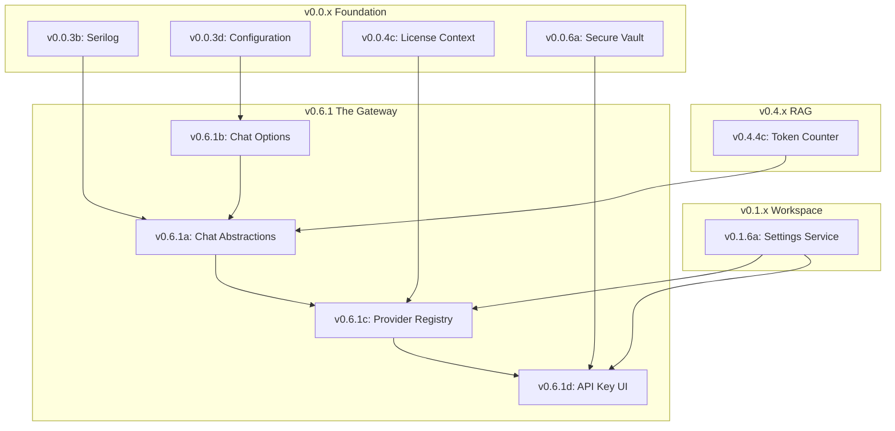

# LCS-SBD-061: Scope Breakdown — The Gateway

## Document Control

| Field            | Value                                                     |
| :--------------- | :-------------------------------------------------------- |
| **Document ID**  | LCS-SBD-061                                               |
| **Version**      | v0.6.1                                                    |
| **Status**       | Draft                                                     |
| **Created**      | 2026-01-28                                                |
| **Author**       | Documentation Agent                                       |
| **Related Docs** | [LCS-DES-061-INDEX](LCS-DES-061-INDEX.md), roadmap-v0.6.x |

---

## 1. Executive Summary

### 1.1 The Vision

**v0.6.1** delivers **The Gateway** — a unified interface for communicating with multiple LLM providers. This release establishes the foundational abstraction layer that enables Lexichord to integrate with OpenAI, Anthropic, and local models through a consistent API, transforming the application into an AI-assisted writing platform.

### 1.2 The Value Proposition

| Stakeholder    | Benefit                                                                |
| :------------- | :--------------------------------------------------------------------- |
| **Writers**    | Seamless access to AI assistance through any configured LLM provider   |
| **Teams**      | Centralized provider configuration and secure API key management       |
| **Developers** | Clean abstraction layer enabling easy addition of new LLM providers    |
| **Enterprise** | Provider flexibility for compliance requirements and cost optimization |

### 1.3 Success Metrics

| Metric                        | Target | Measurement Method                              |
| :---------------------------- | :----- | :---------------------------------------------- |
| Provider abstraction coverage | 100%   | All LLM calls go through IChatCompletionService |
| API response latency overhead | < 5ms  | Benchmark: direct vs. abstracted calls          |
| Streaming token latency       | < 50ms | First token arrival measurement                 |
| Connection test success rate  | ≥ 99%  | Automated provider health checks                |

---

## 2. Dependency Analysis

### 2.1 Required Interfaces

| Interface          | Source Version | Module        | Usage                                |
| :----------------- | :------------- | :------------ | :----------------------------------- |
| `ISecureVault`     | v0.0.6a        | Abstractions  | Secure API key storage               |
| `ISettingsService` | v0.1.6a        | Abstractions  | Default provider persistence         |
| `ISettingsPage`    | v0.1.6a        | Abstractions  | Settings dialog extension            |
| `ILicenseContext`  | v0.0.4c        | Abstractions  | License tier validation              |
| `LicenseTier`      | v0.0.4c        | Abstractions  | Core/WriterPro/Teams/Enterprise enum |
| `ILogger<T>`       | v0.0.3b        | Serilog       | Structured logging                   |
| `IConfiguration`   | v0.0.3d        | MS.Extensions | Configuration access                 |

### 2.2 External Dependencies

| Package                   | Version | Purpose                               |
| :------------------------ | :------ | :------------------------------------ |
| `System.Text.Json`        | 9.x     | API response parsing                  |
| `Microsoft.ML.Tokenizers` | 0.22.x  | GPT token counting (existing v0.4.4c) |
| `Polly`                   | 8.5.x   | Retry policies (existing v0.0.5d)     |

### 2.3 License Gating Strategy

| Feature                | Required Tier | Rationale                          |
| :--------------------- | :------------ | :--------------------------------- |
| Basic Chat Completion  | WriterPro     | Core AI feature                    |
| Streaming Responses    | Teams         | Higher API cost, concurrent usage  |
| Multiple Providers     | Teams         | Enterprise flexibility requirement |
| Custom Model Selection | Enterprise    | Advanced configuration             |

---

## 3. Sub-Part Specifications

### 3.1 v0.6.1a: Chat Completion Abstractions

**Goal:** Define core interfaces for LLM communication in `Lexichord.Abstractions`.

#### Scope

| Item                     | Description                                       |
| :----------------------- | :------------------------------------------------ |
| `IChatCompletionService` | Provider-agnostic chat completion interface       |
| `ChatRequest`            | Request record with messages and options          |
| `ChatMessage`            | Individual message with role and content          |
| `ChatRole`               | System/User/Assistant/Tool enum                   |
| `ChatResponse`           | Response with content, token counts, and duration |
| `StreamingChatToken`     | Individual token for streaming responses          |

#### Key Interfaces

```csharp
public interface IChatCompletionService
{
    string ProviderName { get; }
    Task<ChatResponse> CompleteAsync(ChatRequest request, CancellationToken ct = default);
    IAsyncEnumerable<StreamingChatToken> StreamAsync(ChatRequest request, CancellationToken ct = default);
}
```

#### Design Spec Reference

See [LCS-DES-061a](LCS-DES-061a.md) for full specification.

---

### 3.2 v0.6.1b: Chat Options Model

**Goal:** Define configuration for LLM calls with validation and model-specific defaults.

#### Scope

| Item           | Description                                          |
| :------------- | :--------------------------------------------------- |
| `ChatOptions`  | Configuration record for LLM parameters              |
| Model Defaults | Provider/model-specific default configurations       |
| Validation     | Parameter range validation (Temperature, TopP, etc.) |

#### Key Record

```csharp
public record ChatOptions(
    string Model = "gpt-4o-mini",
    float Temperature = 0.7f,
    int MaxTokens = 2048,
    float TopP = 1.0f,
    float FrequencyPenalty = 0.0f,
    float PresencePenalty = 0.0f,
    IReadOnlyList<string>? StopSequences = null
);
```

#### Validation Rules

| Parameter        | Valid Range | Default |
| :--------------- | :---------- | :------ |
| Temperature      | 0.0 – 2.0   | 0.7     |
| MaxTokens        | > 0         | 2048    |
| TopP             | 0.0 – 1.0   | 1.0     |
| FrequencyPenalty | -2.0 – 2.0  | 0.0     |
| PresencePenalty  | -2.0 – 2.0  | 0.0     |

#### Design Spec Reference

See [LCS-DES-061b](LCS-DES-061b.md) for full specification.

---

### 3.3 v0.6.1c: Provider Registry

**Goal:** Implement `ILLMProviderRegistry` for dynamic provider selection and management.

#### Scope

| Item                   | Description                                   |
| :--------------------- | :-------------------------------------------- |
| `ILLMProviderRegistry` | Provider registration and selection interface |
| `LLMProviderInfo`      | Provider metadata record                      |
| Default Provider       | Persistence via `ISettingsService`            |
| DI Integration         | Named registrations for providers             |

#### Key Interfaces

```csharp
public interface ILLMProviderRegistry
{
    IReadOnlyList<LLMProviderInfo> AvailableProviders { get; }
    IChatCompletionService GetProvider(string providerName);
    IChatCompletionService GetDefaultProvider();
    void SetDefaultProvider(string providerName);
}

public record LLMProviderInfo(
    string Name,
    string DisplayName,
    IReadOnlyList<string> SupportedModels,
    bool IsConfigured,
    bool SupportsStreaming
);
```

#### Design Spec Reference

See [LCS-DES-061c](LCS-DES-061c.md) for full specification.

---

### 3.4 v0.6.1d: API Key Management UI

**Goal:** Extend Settings dialog with LLM configuration panel.

#### Scope

| Item                  | Description                                    |
| :-------------------- | :--------------------------------------------- |
| Provider Selection    | Dropdown for selecting LLM provider            |
| API Key Input         | Secure input with masked display               |
| Connection Test       | "Test Connection" button with status indicator |
| Secure Storage        | Integration with `ISecureVault` (v0.0.6a)      |
| Key Naming Convention | Provider-prefixed keys (`openai:api-key`)      |

#### UI Components

| Component               | Description                                |
| :---------------------- | :----------------------------------------- |
| `LLMSettingsPage`       | Settings page implementing `ISettingsPage` |
| `ProviderConfigPanel`   | Per-provider configuration panel           |
| `ConnectionStatusBadge` | Visual connection status indicator         |

#### Design Spec Reference

See [LCS-DES-061d](LCS-DES-061d.md) for full specification.

---

## 4. Implementation Checklist

### 4.1 v0.6.1a: Chat Completion Abstractions

- [ ] Define `IChatCompletionService` interface in `Lexichord.Abstractions`
- [ ] Create `ChatRequest` record
- [ ] Create `ChatMessage` record with `ChatRole` enum
- [ ] Create `ChatResponse` record
- [ ] Create `StreamingChatToken` record
- [ ] Add XML documentation for all public types
- [ ] Create unit tests for record validation

### 4.2 v0.6.1b: Chat Options Model

- [ ] Define `ChatOptions` record in `Lexichord.Abstractions`
- [ ] Implement `ChatOptionsValidator` using FluentValidation
- [ ] Create `ModelDefaults` static class for provider-specific defaults
- [ ] Add configuration binding for `appsettings.json`
- [ ] Create unit tests for validation rules
- [ ] Create unit tests for model defaults

### 4.3 v0.6.1c: Provider Registry

- [x] Define `ILLMProviderRegistry` interface in `Lexichord.Abstractions`
- [x] Create `LLMProviderInfo` record
- [x] Create `ProviderNotFoundException` exception
- [x] Implement `LLMProviderRegistry` in `Lexichord.Modules.LLM`
- [x] Add DI extension methods for provider registration
- [x] Integrate with `ISystemSettingsRepository` for default provider storage
- [x] Integrate with `ISecureVault` for API key checking
- [x] Add structured logging events (1400-1415)
- [x] Create unit tests for registry operations (72 tests)
- [ ] Create integration tests for DI resolution

### 4.4 v0.6.1d: API Key Management UI

- [x] Create `ConnectionStatus` enum for connection state tracking
- [x] Create `ProviderConfigViewModel` with API key masking and vault operations
- [x] Create `LLMSettingsViewModel` with provider loading and commands
- [x] Create `LLMSettingsPage` implementing `ISettingsPage`
- [x] Create `ConnectionStatusBadge` Avalonia control
- [x] Create `LLMSettingsView` with split-panel layout
- [x] Integrate with `ISecureVault` for key storage
- [x] Implement connection testing logic
- [x] Add license gating (view at Core, configure at WriterPro+)
- [x] Add structured logging events (1500-1510)
- [x] Create unit tests for ViewModels (108 tests)
- [ ] Create UI automation tests for settings page

---

## 5. Dependency Matrix



---

## 6. Risk Assessment

| Risk                           | Probability | Impact | Mitigation                                       |
| :----------------------------- | :---------- | :----- | :----------------------------------------------- |
| API rate limiting by providers | High        | Medium | Implement Polly retry with exponential backoff   |
| Token counting discrepancies   | Medium      | Low    | Use provider-specific tokenizers when available  |
| Streaming connection drops     | Medium      | Medium | Implement reconnection logic with state recovery |
| API key exposure in logs       | Low         | High   | PII scrubbing in Serilog pipeline                |

---

## 7. Testing Strategy

### 7.1 Unit Tests

| Component              | Test Focus                                 |
| :--------------------- | :----------------------------------------- |
| `ChatRequest`          | Immutability, validation                   |
| `ChatOptions`          | Validation rules, default values           |
| `ChatOptionsValidator` | All validation scenarios                   |
| `LLMProviderRegistry`  | Registration, resolution, default handling |
| `LLMSettingsViewModel` | Property binding, command execution        |

### 7.2 Integration Tests

| Scenario                 | Validation                             |
| :----------------------- | :------------------------------------- |
| Provider DI resolution   | Named registrations resolve correctly  |
| Settings persistence     | Default provider survives restart      |
| Secure vault integration | API keys stored and retrieved securely |

### 7.3 Mock Providers

For development and testing, implement `MockChatCompletionService`:

- Configurable response delays
- Predetermined response content
- Error injection for resilience testing

---

## 8. Documentation Requirements

| Document Type       | Scope                             |
| :------------------ | :-------------------------------- |
| **API Reference**   | All public interfaces and records |
| **Developer Guide** | Adding new LLM providers          |
| **User Guide**      | Configuring providers in Settings |
| **Security Guide**  | API key management best practices |

---

## 9. Implementation Status

### v0.6.1a: Chat Completion Abstractions ✅

| Component                | Status      | Tests |
| :----------------------- | :---------- | :---- |
| `ChatRole` enum          | ✅ Complete | 8     |
| `ChatMessage` record     | ✅ Complete | 11    |
| `ChatOptions` record     | ✅ Complete | 19    |
| `ChatRequest` record     | ✅ Complete | 13    |
| `ChatResponse` record    | ✅ Complete | 10    |
| `StreamingChatToken`     | ✅ Complete | 6     |
| `IChatCompletionService` | ✅ Complete | -     |
| `ChatRequestBuilder`     | ✅ Complete | 18    |
| `ChatSerialization`      | ✅ Complete | 8     |
| `SseParser`              | ✅ Complete | 14    |
| Exception hierarchy      | ✅ Complete | 16    |
| `ChatRoleExtensions`     | ✅ Complete | 12    |

### v0.6.1b: Chat Options Model ✅

| Component                       | Status      | Tests |
| :------------------------------ | :---------- | :---- |
| Extended presets (5 new)        | ✅ Complete | 6     |
| `ChatOptionsValidator`          | ✅ Complete | 17    |
| `ChatOptionsValidationException`| ✅ Complete | -     |
| `ContextWindowExceededException`| ✅ Complete | -     |
| `IModelProvider` interface      | ✅ Complete | -     |
| `ModelInfo` record              | ✅ Complete | -     |
| `TokenEstimate` record          | ✅ Complete | -     |
| `ChatOptionsContextExtensions`  | ✅ Complete | -     |
| `Lexichord.Modules.LLM` module  | ✅ Complete | -     |
| `LLMOptions` configuration      | ✅ Complete | -     |
| `ModelDefaults` static registry | ✅ Complete | 19    |
| `ModelRegistry` service         | ✅ Complete | -     |
| `TokenEstimator` service        | ✅ Complete | -     |
| `ChatOptionsResolver` service   | ✅ Complete | -     |
| `OpenAIParameterMapper`         | ✅ Complete | -     |
| `AnthropicParameterMapper`      | ✅ Complete | 10    |
| `ProviderAwareChatOptionsValidator` | ✅ Complete | -     |
| `LLMLogEvents` structured logging | ✅ Complete | -     |

### v0.6.1c: Provider Registry ✅

| Component                       | Status      | Tests |
| :------------------------------ | :---------- | :---- |
| `ILLMProviderRegistry` interface | ✅ Complete | -     |
| `LLMProviderInfo` record        | ✅ Complete | 26    |
| `ProviderNotFoundException`     | ✅ Complete | 15    |
| `LLMProviderRegistry` impl      | ✅ Complete | 31    |
| `LLMProviderServiceExtensions`  | ✅ Complete | -     |
| `LLMModule` registry init       | ✅ Complete | -     |
| `LLMServiceExtensions` update   | ✅ Complete | -     |
| `LLMLogEvents` (1400-1415)      | ✅ Complete | -     |

### v0.6.1d: API Key Management UI ✅

| Component                       | Status      | Tests |
| :------------------------------ | :---------- | :---- |
| `ConnectionStatus` enum         | ✅ Complete | 18    |
| `ProviderConfigViewModel`       | ✅ Complete | 48    |
| `LLMSettingsViewModel`          | ✅ Complete | 26    |
| `LLMSettingsPage`               | ✅ Complete | 16    |
| `ConnectionStatusBadge`         | ✅ Complete | -     |
| `LLMSettingsView`               | ✅ Complete | -     |
| `LLMModule` DI registrations    | ✅ Complete | -     |
| `LLMLogEvents` (1500-1510)      | ✅ Complete | -     |

---

## 10. Version History

| Version | Date       | Author              | Changes                    |
| :------ | :--------- | :------------------ | :------------------------- |
| 0.1     | 2026-01-28 | Documentation Agent | Initial draft              |
| 0.2     | 2026-02-04 | Claude Opus 4.5     | Added v0.6.1b status table |
| 0.3     | 2026-02-04 | Claude Opus 4.5     | Added v0.6.1c status table |
| 0.4     | 2026-02-04 | Claude Opus 4.5     | Added v0.6.1d status table |
