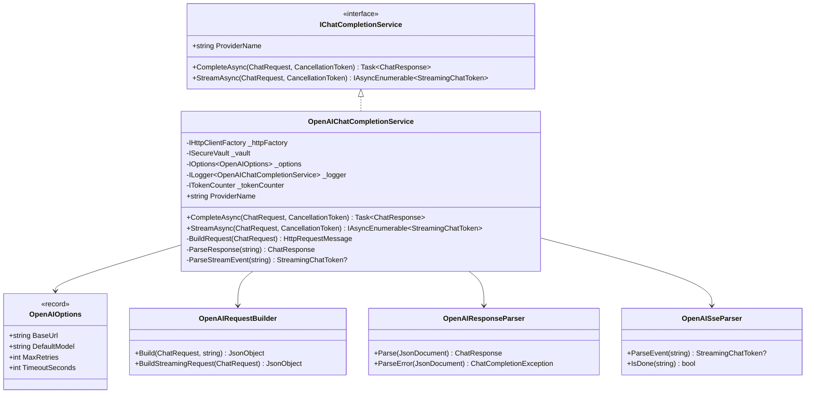

# LCS-DES-062a: Design Specification — OpenAI Connector

## 1. Metadata & Categorization

| Field           | Value                                     |
| :-------------- | :---------------------------------------- |
| **Document ID** | LCS-DES-062a                              |
| **Version**     | v0.6.2a                                   |
| **Status**      | Draft                                     |
| **Category**    | Implementation                            |
| **Module**      | Lexichord.Modules.LLM                     |
| **Created**     | 2026-01-28                                |
| **Author**      | Documentation Agent                       |
| **Parent**      | [LCS-DES-062-INDEX](LCS-DES-062-INDEX.md) |

---

## 2. Executive Summary

### 2.1 The Requirement

Lexichord requires a production-ready integration with the OpenAI Chat Completions API. The implementation must:

- Implement `IChatCompletionService` from v0.6.1a
- Support both synchronous completion and streaming responses
- Handle OpenAI-specific authentication and error formats
- Integrate with the resilience pipeline from v0.6.2c
- Provide accurate token counting through v0.6.2d

### 2.2 The Solution

Implement `OpenAIChatCompletionService` — a license-gated service that translates our unified `ChatRequest`/`ChatResponse` models to OpenAI's API format, handles streaming via Server-Sent Events, and properly maps errors to our exception hierarchy.

---

## 3. Architecture

### 3.1 Component Placement

```
Lexichord.Modules.LLM/
└── Providers/
    └── OpenAI/
        ├── OpenAIChatCompletionService.cs
        ├── OpenAIOptions.cs
        ├── OpenAIRequestBuilder.cs
        ├── OpenAIResponseParser.cs
        └── OpenAISseParser.cs
```

### 3.2 Class Diagram



---

## 4. Data Contract (The API)

### 4.1 OpenAIOptions Record

```csharp
namespace Lexichord.Modules.LLM.Providers.OpenAI;

/// <summary>
/// Configuration options for the OpenAI provider.
/// </summary>
/// <param name="BaseUrl">The base URL for the OpenAI API.</param>
/// <param name="DefaultModel">The default model to use if not specified in request.</param>
/// <param name="MaxRetries">Maximum retry attempts for transient failures.</param>
/// <param name="TimeoutSeconds">Request timeout in seconds.</param>
public record OpenAIOptions(
    string BaseUrl = "https://api.openai.com/v1",
    string DefaultModel = "gpt-4o-mini",
    int MaxRetries = 3,
    int TimeoutSeconds = 30
)
{
    /// <summary>
    /// Vault key for retrieving the API key.
    /// </summary>
    public string VaultKey => "openai:api-key";

    /// <summary>
    /// Chat completions endpoint path.
    /// </summary>
    public string CompletionsEndpoint => $"{BaseUrl}/chat/completions";
}
```

### 4.2 OpenAIChatCompletionService Class

```csharp
namespace Lexichord.Modules.LLM.Providers.OpenAI;

/// <summary>
/// OpenAI implementation of the chat completion service.
/// </summary>
/// <remarks>
/// This service requires WriterPro or higher license tier.
/// Uses the Chat Completions API with support for streaming responses.
/// </remarks>
[RequiresLicense(LicenseTier.WriterPro)]
public class OpenAIChatCompletionService : IChatCompletionService
{
    private readonly IHttpClientFactory _httpFactory;
    private readonly ISecureVault _vault;
    private readonly OpenAIOptions _options;
    private readonly ILogger<OpenAIChatCompletionService> _logger;
    private readonly ITokenCounter _tokenCounter;

    private const string HttpClientName = "OpenAI";

    /// <summary>
    /// Initializes a new instance of the OpenAI chat completion service.
    /// </summary>
    public OpenAIChatCompletionService(
        IHttpClientFactory httpFactory,
        ISecureVault vault,
        IOptions<OpenAIOptions> options,
        ILogger<OpenAIChatCompletionService> logger,
        ITokenCounter tokenCounter)
    {
        _httpFactory = httpFactory ?? throw new ArgumentNullException(nameof(httpFactory));
        _vault = vault ?? throw new ArgumentNullException(nameof(vault));
        _options = options?.Value ?? throw new ArgumentNullException(nameof(options));
        _logger = logger ?? throw new ArgumentNullException(nameof(logger));
        _tokenCounter = tokenCounter ?? throw new ArgumentNullException(nameof(tokenCounter));
    }

    /// <inheritdoc />
    public string ProviderName => "OpenAI";

    /// <inheritdoc />
    public async Task<ChatResponse> CompleteAsync(
        ChatRequest request,
        CancellationToken ct = default)
    {
        _logger.LogDebug("Starting OpenAI completion request for model {Model}", request.Options.Model);
        var stopwatch = Stopwatch.StartNew();

        var apiKey = await GetApiKeyAsync();
        var httpClient = _httpFactory.CreateClient(HttpClientName);

        var promptTokens = _tokenCounter.CountTokens(request.Messages, request.Options.Model);
        _logger.LogDebug("Estimated prompt tokens: {PromptTokens}", promptTokens);

        using var httpRequest = BuildHttpRequest(request, apiKey, stream: false);

        try
        {
            using var httpResponse = await httpClient.SendAsync(httpRequest, ct);
            var responseBody = await httpResponse.Content.ReadAsStringAsync(ct);

            if (!httpResponse.IsSuccessStatusCode)
            {
                throw ParseErrorResponse(httpResponse.StatusCode, responseBody);
            }

            var response = ParseSuccessResponse(responseBody, stopwatch.Elapsed);

            _logger.LogInformation(
                "OpenAI completion succeeded in {Duration}ms. Tokens: {Prompt}/{Completion}",
                stopwatch.ElapsedMilliseconds, response.PromptTokens, response.CompletionTokens);

            return response;
        }
        catch (HttpRequestException ex)
        {
            _logger.LogError(ex, "HTTP request to OpenAI failed");
            throw new ProviderUnavailableException(ProviderName, ex);
        }
    }

    /// <inheritdoc />
    public async IAsyncEnumerable<StreamingChatToken> StreamAsync(
        ChatRequest request,
        [EnumeratorCancellation] CancellationToken ct = default)
    {
        _logger.LogDebug("Starting OpenAI streaming request for model {Model}", request.Options.Model);

        var apiKey = await GetApiKeyAsync();
        var httpClient = _httpFactory.CreateClient(HttpClientName);

        using var httpRequest = BuildHttpRequest(request, apiKey, stream: true);

        using var httpResponse = await httpClient.SendAsync(
            httpRequest,
            HttpCompletionOption.ResponseHeadersRead,
            ct);

        if (!httpResponse.IsSuccessStatusCode)
        {
            var errorBody = await httpResponse.Content.ReadAsStringAsync(ct);
            throw ParseErrorResponse(httpResponse.StatusCode, errorBody);
        }

        using var stream = await httpResponse.Content.ReadAsStreamAsync(ct);
        using var reader = new StreamReader(stream);

        while (!reader.EndOfStream && !ct.IsCancellationRequested)
        {
            var line = await reader.ReadLineAsync(ct);

            if (string.IsNullOrWhiteSpace(line))
                continue;

            if (!line.StartsWith("data: "))
                continue;

            var data = line.Substring(6);

            if (data == "[DONE]")
            {
                yield return StreamingChatToken.Complete("stop");
                yield break;
            }

            var token = ParseStreamingChunk(data);
            if (token != null)
            {
                yield return token;
            }
        }
    }

    // Private helper methods...
}
```

---

## 5. Implementation Logic

### 5.1 Request Building

```csharp
private HttpRequestMessage BuildHttpRequest(ChatRequest request, string apiKey, bool stream)
{
    var messages = request.Messages.Select(m => new
    {
        role = m.Role.ToString().ToLowerInvariant(),
        content = m.Content,
        name = m.Name
    }).ToList();

    var body = new
    {
        model = request.Options.Model,
        messages,
        temperature = request.Options.Temperature,
        max_tokens = request.Options.MaxTokens,
        top_p = request.Options.TopP,
        frequency_penalty = request.Options.FrequencyPenalty,
        presence_penalty = request.Options.PresencePenalty,
        stop = request.Options.StopSequences,
        stream
    };

    var json = JsonSerializer.Serialize(body, JsonOptions);
    var content = new StringContent(json, Encoding.UTF8, "application/json");

    var httpRequest = new HttpRequestMessage(HttpMethod.Post, _options.CompletionsEndpoint)
    {
        Content = content
    };

    httpRequest.Headers.Authorization = new AuthenticationHeaderValue("Bearer", apiKey);
    httpRequest.Headers.Accept.Add(new MediaTypeWithQualityHeaderValue("application/json"));

    return httpRequest;
}
```

### 5.2 Response Parsing

```csharp
private ChatResponse ParseSuccessResponse(string responseBody, TimeSpan duration)
{
    using var doc = JsonDocument.Parse(responseBody);
    var root = doc.RootElement;

    var content = root
        .GetProperty("choices")[0]
        .GetProperty("message")
        .GetProperty("content")
        .GetString() ?? string.Empty;

    var finishReason = root
        .GetProperty("choices")[0]
        .GetProperty("finish_reason")
        .GetString();

    var usage = root.GetProperty("usage");
    var promptTokens = usage.GetProperty("prompt_tokens").GetInt32();
    var completionTokens = usage.GetProperty("completion_tokens").GetInt32();

    return new ChatResponse(
        Content: content,
        PromptTokens: promptTokens,
        CompletionTokens: completionTokens,
        Duration: duration,
        FinishReason: finishReason
    );
}
```

### 5.3 Streaming Chunk Parsing

```csharp
private StreamingChatToken? ParseStreamingChunk(string data)
{
    try
    {
        using var doc = JsonDocument.Parse(data);
        var root = doc.RootElement;

        var choices = root.GetProperty("choices");
        if (choices.GetArrayLength() == 0)
            return null;

        var choice = choices[0];
        var finishReason = choice.TryGetProperty("finish_reason", out var fr)
            ? fr.GetString()
            : null;

        if (finishReason != null)
        {
            return new StreamingChatToken(string.Empty, true, finishReason);
        }

        var delta = choice.GetProperty("delta");
        if (delta.TryGetProperty("content", out var contentProp))
        {
            var content = contentProp.GetString();
            if (!string.IsNullOrEmpty(content))
            {
                return new StreamingChatToken(content);
            }
        }

        return null;
    }
    catch (JsonException ex)
    {
        _logger.LogWarning(ex, "Failed to parse streaming chunk");
        return null;
    }
}
```

### 5.4 Error Parsing

```csharp
private ChatCompletionException ParseErrorResponse(HttpStatusCode statusCode, string responseBody)
{
    string? errorMessage = null;
    string? errorType = null;

    try
    {
        using var doc = JsonDocument.Parse(responseBody);
        if (doc.RootElement.TryGetProperty("error", out var error))
        {
            errorMessage = error.TryGetProperty("message", out var msg) ? msg.GetString() : null;
            errorType = error.TryGetProperty("type", out var type) ? type.GetString() : null;
        }
    }
    catch (JsonException)
    {
        errorMessage = responseBody;
    }

    return statusCode switch
    {
        HttpStatusCode.Unauthorized =>
            new AuthenticationException(ProviderName),

        HttpStatusCode.Forbidden =>
            new AuthorizationException(ProviderName, errorMessage ?? "Access denied"),

        HttpStatusCode.NotFound when errorType == "model_not_found" =>
            new ModelNotAvailableException(ProviderName, "Model not available"),

        HttpStatusCode.TooManyRequests =>
            new RateLimitException(ProviderName, ParseRetryAfter(responseBody)),

        HttpStatusCode.BadRequest when errorType == "invalid_request_error" =>
            new InvalidRequestException(ProviderName, errorMessage ?? "Invalid request"),

        (HttpStatusCode)529 => // OpenAI overloaded
            new ProviderUnavailableException(ProviderName, new Exception("Service overloaded")),

        >= HttpStatusCode.InternalServerError =>
            new ProviderUnavailableException(ProviderName,
                new HttpRequestException(errorMessage ?? "Server error")),

        _ =>
            new ChatCompletionException(ProviderName, errorMessage ?? $"HTTP {(int)statusCode}")
    };
}
```

---

## 6. OpenAI API Reference

### 6.1 Request Format

```json
{
    "model": "gpt-4o-mini",
    "messages": [
        { "role": "system", "content": "You are a helpful assistant." },
        { "role": "user", "content": "Hello!" }
    ],
    "temperature": 0.7,
    "max_tokens": 2048,
    "top_p": 1.0,
    "frequency_penalty": 0.0,
    "presence_penalty": 0.0,
    "stream": false
}
```

### 6.2 Response Format (Non-Streaming)

```json
{
    "id": "chatcmpl-abc123",
    "object": "chat.completion",
    "created": 1677858242,
    "model": "gpt-4o-mini",
    "usage": {
        "prompt_tokens": 13,
        "completion_tokens": 7,
        "total_tokens": 20
    },
    "choices": [
        {
            "message": {
                "role": "assistant",
                "content": "Hello! How can I help you today?"
            },
            "finish_reason": "stop",
            "index": 0
        }
    ]
}
```

### 6.3 Streaming Format (SSE)

```text
data: {"id":"chatcmpl-abc123","object":"chat.completion.chunk","created":1677858242,"model":"gpt-4o-mini","choices":[{"index":0,"delta":{"role":"assistant"},"finish_reason":null}]}

data: {"id":"chatcmpl-abc123","object":"chat.completion.chunk","created":1677858242,"model":"gpt-4o-mini","choices":[{"index":0,"delta":{"content":"Hello"},"finish_reason":null}]}

data: {"id":"chatcmpl-abc123","object":"chat.completion.chunk","created":1677858242,"model":"gpt-4o-mini","choices":[{"index":0,"delta":{"content":"!"},"finish_reason":null}]}

data: {"id":"chatcmpl-abc123","object":"chat.completion.chunk","created":1677858242,"model":"gpt-4o-mini","choices":[{"index":0,"delta":{},"finish_reason":"stop"}]}

data: [DONE]
```

### 6.4 Supported Models

| Model         | Max Tokens | Knowledge Cutoff |
| :------------ | :--------- | :--------------- |
| gpt-4o        | 128,000    | Oct 2023         |
| gpt-4o-mini   | 128,000    | Oct 2023         |
| gpt-4-turbo   | 128,000    | Dec 2023         |
| gpt-3.5-turbo | 16,385     | Sep 2021         |

---

## 7. DI Registration

### 7.1 Service Registration

```csharp
public static class OpenAIServiceCollectionExtensions
{
    /// <summary>
    /// Adds the OpenAI chat completion service to the service collection.
    /// </summary>
    public static IServiceCollection AddOpenAIProvider(
        this IServiceCollection services,
        IConfiguration configuration)
    {
        // Bind configuration
        services.Configure<OpenAIOptions>(
            configuration.GetSection("LLM:Providers:OpenAI"));

        // Register HTTP client with resilience policies
        services.AddHttpClient("OpenAI")
            .ConfigureHttpClient((sp, client) =>
            {
                var options = sp.GetRequiredService<IOptions<OpenAIOptions>>().Value;
                client.BaseAddress = new Uri(options.BaseUrl);
                client.Timeout = TimeSpan.FromSeconds(options.TimeoutSeconds);
            })
            .AddPolicyHandler(GetRetryPolicy())
            .AddPolicyHandler(GetCircuitBreakerPolicy());

        // Register service
        services.AddTransient<IChatCompletionService, OpenAIChatCompletionService>();

        // Register with provider registry
        services.AddSingleton<ILLMProviderRegistration>(sp =>
            new LLMProviderRegistration(
                "OpenAI",
                "OpenAI GPT",
                ["gpt-4o", "gpt-4o-mini", "gpt-4-turbo", "gpt-3.5-turbo"],
                supportsStreaming: true,
                () => sp.GetRequiredService<OpenAIChatCompletionService>()
            ));

        return services;
    }

    private static IAsyncPolicy<HttpResponseMessage> GetRetryPolicy()
    {
        return HttpPolicyExtensions
            .HandleTransientHttpError()
            .OrResult(r => r.StatusCode == HttpStatusCode.TooManyRequests)
            .WaitAndRetryAsync(
                retryCount: 3,
                sleepDurationProvider: attempt =>
                    TimeSpan.FromSeconds(Math.Pow(2, attempt)) +
                    TimeSpan.FromMilliseconds(Random.Shared.Next(0, 1000)));
    }

    private static IAsyncPolicy<HttpResponseMessage> GetCircuitBreakerPolicy()
    {
        return HttpPolicyExtensions
            .HandleTransientHttpError()
            .CircuitBreakerAsync(
                handledEventsAllowedBeforeBreaking: 5,
                durationOfBreak: TimeSpan.FromSeconds(30));
    }
}
```

---

## 8. Testing Strategy

### 8.1 Unit Tests

| Test Case                                                | Validation               |
| :------------------------------------------------------- | :----------------------- |
| `CompleteAsync_WithValidRequest_ReturnsResponse`         | Successful completion    |
| `CompleteAsync_WithUnauthorized_ThrowsAuthException`     | 401 handling             |
| `CompleteAsync_WithRateLimited_ThrowsRateLimitException` | 429 handling             |
| `CompleteAsync_WithServerError_ThrowsProviderException`  | 5xx handling             |
| `StreamAsync_WithValidRequest_YieldsTokens`              | Streaming token delivery |
| `StreamAsync_WithDone_YieldsCompleteToken`               | Stream termination       |
| `BuildHttpRequest_SetsAuthorizationHeader`               | API key in header        |
| `ParseResponse_ExtractsTokenCounts`                      | Token usage extraction   |

### 8.2 Test Fixtures

```csharp
public static class OpenAITestFixtures
{
    public static string SuccessResponse => """
        {
            "id": "chatcmpl-test123",
            "object": "chat.completion",
            "created": 1677858242,
            "model": "gpt-4o-mini",
            "usage": {"prompt_tokens": 10, "completion_tokens": 5, "total_tokens": 15},
            "choices": [{
                "message": {"role": "assistant", "content": "Test response"},
                "finish_reason": "stop",
                "index": 0
            }]
        }
        """;

    public static string RateLimitResponse => """
        {
            "error": {
                "message": "Rate limit reached",
                "type": "rate_limit_error",
                "code": "rate_limit_exceeded"
            }
        }
        """;

    public static IEnumerable<string> StreamingChunks => new[]
    {
        """data: {"id":"test","choices":[{"index":0,"delta":{"role":"assistant"}}]}""",
        """data: {"id":"test","choices":[{"index":0,"delta":{"content":"Hello"}}]}""",
        """data: {"id":"test","choices":[{"index":0,"delta":{"content":"!"}}]}""",
        """data: {"id":"test","choices":[{"index":0,"delta":{},"finish_reason":"stop"}]}""",
        "data: [DONE]"
    };
}
```

### 8.3 Mock HTTP Handler

```csharp
public class MockHttpMessageHandler : HttpMessageHandler
{
    private readonly Func<HttpRequestMessage, HttpResponseMessage> _sendAsync;

    public MockHttpMessageHandler(Func<HttpRequestMessage, HttpResponseMessage> sendAsync)
    {
        _sendAsync = sendAsync;
    }

    protected override Task<HttpResponseMessage> SendAsync(
        HttpRequestMessage request,
        CancellationToken cancellationToken)
    {
        return Task.FromResult(_sendAsync(request));
    }

    public static MockHttpMessageHandler WithResponse(HttpStatusCode status, string content)
    {
        return new MockHttpMessageHandler(_ =>
            new HttpResponseMessage(status)
            {
                Content = new StringContent(content, Encoding.UTF8, "application/json")
            });
    }
}
```

---

## 9. Acceptance Criteria

### 9.1 Functional Criteria

| ID    | Criterion                                            | Verification    |
| :---- | :--------------------------------------------------- | :-------------- |
| AC-01 | Service implements `IChatCompletionService`          | Compilation     |
| AC-02 | Returns valid `ChatResponse` for successful requests | Unit tests      |
| AC-03 | Throws `AuthenticationException` for 401             | Unit tests      |
| AC-04 | Throws `RateLimitException` for 429                  | Unit tests      |
| AC-05 | Streaming yields tokens until `[DONE]`               | Unit tests      |
| AC-06 | API key retrieved from `ISecureVault`                | Unit tests      |
| AC-07 | License gating via `[RequiresLicense]` attribute     | Reflection test |

### 9.2 Non-Functional Criteria

| ID    | Criterion                     | Target  |
| :---- | :---------------------------- | :------ |
| NF-01 | First-token streaming latency | < 500ms |
| NF-02 | Request serialization time    | < 10ms  |
| NF-03 | Memory per streaming response | < 100KB |

---

## 10. Version History

| Version | Date       | Author              | Changes       |
| :------ | :--------- | :------------------ | :------------ |
| 0.1     | 2026-01-28 | Documentation Agent | Initial draft |
