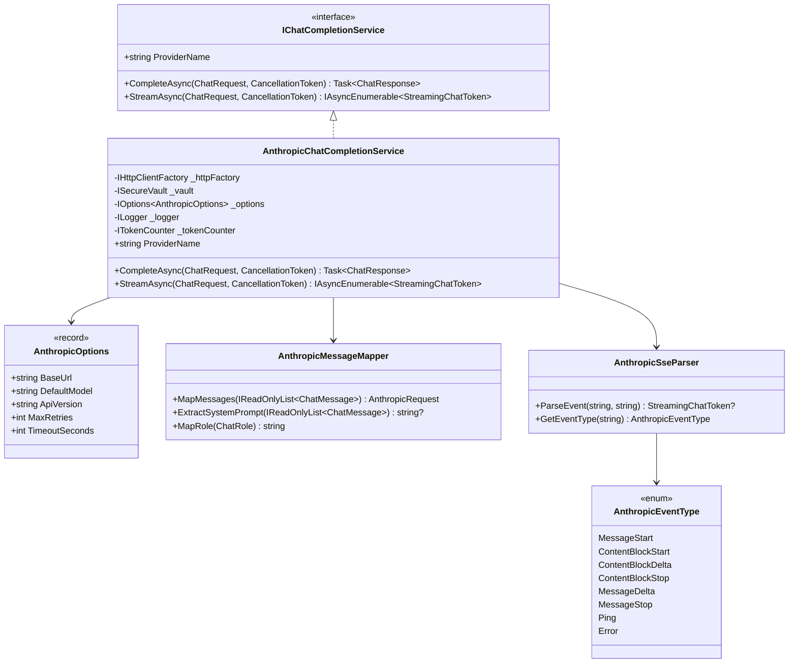

# LCS-DES-062b: Design Specification — Anthropic Connector

## 1. Metadata & Categorization

| Field           | Value                                     |
| :-------------- | :---------------------------------------- |
| **Document ID** | LCS-DES-062b                              |
| **Version**     | v0.6.2b                                   |
| **Status**      | Draft                                     |
| **Category**    | Implementation                            |
| **Module**      | Lexichord.Modules.LLM                     |
| **Created**     | 2026-01-28                                |
| **Author**      | Documentation Agent                       |
| **Parent**      | [LCS-DES-062-INDEX](LCS-DES-062-INDEX.md) |

---

## 2. Executive Summary

### 2.1 The Requirement

Lexichord requires integration with the Anthropic Messages API to provide access to Claude models. The implementation must:

- Implement `IChatCompletionService` from v0.6.1a
- Handle Anthropic's unique message format (system prompts handled separately)
- Support streaming via Anthropic's SSE event types
- Include required headers (`anthropic-version`, `x-api-key`)
- Map Anthropic-specific errors to our exception hierarchy

### 2.2 The Solution

Implement `AnthropicChatCompletionService` — a license-gated service that adapts our unified `ChatMessage` model to Anthropic's format, handles their streaming event types (`message_start`, `content_block_delta`, `message_stop`), and provides Claude model access with proper authentication.

---

## 3. Architecture

### 3.1 Component Placement

```
Lexichord.Modules.LLM/
└── Providers/
    └── Anthropic/
        ├── AnthropicChatCompletionService.cs
        ├── AnthropicOptions.cs
        ├── AnthropicRequestBuilder.cs
        ├── AnthropicResponseParser.cs
        ├── AnthropicSseParser.cs
        └── AnthropicMessageMapper.cs
```

### 3.2 Class Diagram



---

## 4. Data Contract (The API)

### 4.1 AnthropicOptions Record

```csharp
namespace Lexichord.Modules.LLM.Providers.Anthropic;

/// <summary>
/// Configuration options for the Anthropic provider.
/// </summary>
/// <param name="BaseUrl">The base URL for the Anthropic API.</param>
/// <param name="DefaultModel">The default Claude model to use.</param>
/// <param name="ApiVersion">The Anthropic API version header value.</param>
/// <param name="MaxRetries">Maximum retry attempts for transient failures.</param>
/// <param name="TimeoutSeconds">Request timeout in seconds.</param>
public record AnthropicOptions(
    string BaseUrl = "https://api.anthropic.com/v1",
    string DefaultModel = "claude-3-haiku-20240307",
    string ApiVersion = "2024-01-01",
    int MaxRetries = 3,
    int TimeoutSeconds = 30
)
{
    /// <summary>
    /// Vault key for retrieving the API key.
    /// </summary>
    public string VaultKey => "anthropic:api-key";

    /// <summary>
    /// Messages endpoint path.
    /// </summary>
    public string MessagesEndpoint => $"{BaseUrl}/messages";
}
```

### 4.2 AnthropicChatCompletionService Class

```csharp
namespace Lexichord.Modules.LLM.Providers.Anthropic;

/// <summary>
/// Anthropic Claude implementation of the chat completion service.
/// </summary>
/// <remarks>
/// This service requires WriterPro or higher license tier.
/// Uses the Messages API with support for streaming responses.
/// </remarks>
[RequiresLicense(LicenseTier.WriterPro)]
public class AnthropicChatCompletionService : IChatCompletionService
{
    private readonly IHttpClientFactory _httpFactory;
    private readonly ISecureVault _vault;
    private readonly AnthropicOptions _options;
    private readonly ILogger<AnthropicChatCompletionService> _logger;
    private readonly ITokenCounter _tokenCounter;
    private readonly AnthropicMessageMapper _messageMapper;

    private const string HttpClientName = "Anthropic";

    public AnthropicChatCompletionService(
        IHttpClientFactory httpFactory,
        ISecureVault vault,
        IOptions<AnthropicOptions> options,
        ILogger<AnthropicChatCompletionService> logger,
        ITokenCounter tokenCounter)
    {
        _httpFactory = httpFactory ?? throw new ArgumentNullException(nameof(httpFactory));
        _vault = vault ?? throw new ArgumentNullException(nameof(vault));
        _options = options?.Value ?? throw new ArgumentNullException(nameof(options));
        _logger = logger ?? throw new ArgumentNullException(nameof(logger));
        _tokenCounter = tokenCounter ?? throw new ArgumentNullException(nameof(tokenCounter));
        _messageMapper = new AnthropicMessageMapper();
    }

    /// <inheritdoc />
    public string ProviderName => "Anthropic";

    /// <inheritdoc />
    public async Task<ChatResponse> CompleteAsync(
        ChatRequest request,
        CancellationToken ct = default)
    {
        _logger.LogDebug("Starting Anthropic completion for model {Model}", request.Options.Model);
        var stopwatch = Stopwatch.StartNew();

        var apiKey = await GetApiKeyAsync();
        var httpClient = _httpFactory.CreateClient(HttpClientName);

        var promptTokens = _tokenCounter.CountTokens(request.Messages, request.Options.Model);
        _logger.LogDebug("Estimated prompt tokens: {PromptTokens}", promptTokens);

        using var httpRequest = BuildHttpRequest(request, apiKey, stream: false);

        try
        {
            using var httpResponse = await httpClient.SendAsync(httpRequest, ct);
            var responseBody = await httpResponse.Content.ReadAsStringAsync(ct);

            if (!httpResponse.IsSuccessStatusCode)
            {
                throw ParseErrorResponse(httpResponse.StatusCode, responseBody);
            }

            var response = ParseSuccessResponse(responseBody, stopwatch.Elapsed);

            _logger.LogInformation(
                "Anthropic completion succeeded in {Duration}ms. Tokens: {Input}/{Output}",
                stopwatch.ElapsedMilliseconds, response.PromptTokens, response.CompletionTokens);

            return response;
        }
        catch (HttpRequestException ex)
        {
            _logger.LogError(ex, "HTTP request to Anthropic failed");
            throw new ProviderUnavailableException(ProviderName, ex);
        }
    }

    /// <inheritdoc />
    public async IAsyncEnumerable<StreamingChatToken> StreamAsync(
        ChatRequest request,
        [EnumeratorCancellation] CancellationToken ct = default)
    {
        _logger.LogDebug("Starting Anthropic streaming for model {Model}", request.Options.Model);

        var apiKey = await GetApiKeyAsync();
        var httpClient = _httpFactory.CreateClient(HttpClientName);

        using var httpRequest = BuildHttpRequest(request, apiKey, stream: true);

        using var httpResponse = await httpClient.SendAsync(
            httpRequest,
            HttpCompletionOption.ResponseHeadersRead,
            ct);

        if (!httpResponse.IsSuccessStatusCode)
        {
            var errorBody = await httpResponse.Content.ReadAsStringAsync(ct);
            throw ParseErrorResponse(httpResponse.StatusCode, errorBody);
        }

        using var stream = await httpResponse.Content.ReadAsStreamAsync(ct);
        using var reader = new StreamReader(stream);

        string? currentEventType = null;

        while (!reader.EndOfStream && !ct.IsCancellationRequested)
        {
            var line = await reader.ReadLineAsync(ct);

            if (string.IsNullOrWhiteSpace(line))
            {
                currentEventType = null;
                continue;
            }

            if (line.StartsWith("event: "))
            {
                currentEventType = line.Substring(7);
                continue;
            }

            if (line.StartsWith("data: ") && currentEventType != null)
            {
                var data = line.Substring(6);
                var token = ParseStreamingEvent(currentEventType, data);

                if (token != null)
                {
                    yield return token;

                    if (token.IsComplete)
                        yield break;
                }
            }
        }
    }

    // Private helper methods...
}
```

---

## 5. Implementation Logic

### 5.1 Message Mapping

Anthropic handles system prompts separately from the message array:

```csharp
public class AnthropicMessageMapper
{
    /// <summary>
    /// Extracts the system prompt from the message list.
    /// </summary>
    public string? ExtractSystemPrompt(IReadOnlyList<ChatMessage> messages)
    {
        var systemMessages = messages
            .Where(m => m.Role == ChatRole.System)
            .Select(m => m.Content);

        return systemMessages.Any()
            ? string.Join("\n\n", systemMessages)
            : null;
    }

    /// <summary>
    /// Maps ChatMessages to Anthropic's message format.
    /// </summary>
    public List<AnthropicMessage> MapMessages(IReadOnlyList<ChatMessage> messages)
    {
        return messages
            .Where(m => m.Role != ChatRole.System)
            .Select(m => new AnthropicMessage(
                Role: MapRole(m.Role),
                Content: m.Content
            ))
            .ToList();
    }

    /// <summary>
    /// Maps ChatRole to Anthropic role string.
    /// </summary>
    public string MapRole(ChatRole role) => role switch
    {
        ChatRole.User => "user",
        ChatRole.Assistant => "assistant",
        ChatRole.Tool => "user", // Tools wrapped as user messages
        _ => "user"
    };
}

public record AnthropicMessage(string Role, string Content);
```

### 5.2 Request Building

```csharp
private HttpRequestMessage BuildHttpRequest(ChatRequest request, string apiKey, bool stream)
{
    var systemPrompt = _messageMapper.ExtractSystemPrompt(request.Messages);
    var messages = _messageMapper.MapMessages(request.Messages);

    var body = new Dictionary<string, object>
    {
        ["model"] = request.Options.Model,
        ["messages"] = messages,
        ["max_tokens"] = request.Options.MaxTokens,
        ["temperature"] = request.Options.Temperature,
        ["top_p"] = request.Options.TopP,
        ["stream"] = stream
    };

    if (systemPrompt != null)
    {
        body["system"] = systemPrompt;
    }

    if (request.Options.StopSequences?.Count > 0)
    {
        body["stop_sequences"] = request.Options.StopSequences;
    }

    var json = JsonSerializer.Serialize(body, JsonOptions);
    var content = new StringContent(json, Encoding.UTF8, "application/json");

    var httpRequest = new HttpRequestMessage(HttpMethod.Post, _options.MessagesEndpoint)
    {
        Content = content
    };

    // Anthropic-specific headers
    httpRequest.Headers.Add("x-api-key", apiKey);
    httpRequest.Headers.Add("anthropic-version", _options.ApiVersion);
    httpRequest.Headers.Accept.Add(new MediaTypeWithQualityHeaderValue("application/json"));

    return httpRequest;
}
```

### 5.3 Response Parsing

```csharp
private ChatResponse ParseSuccessResponse(string responseBody, TimeSpan duration)
{
    using var doc = JsonDocument.Parse(responseBody);
    var root = doc.RootElement;

    // Extract content from content blocks
    var contentBlocks = root.GetProperty("content");
    var content = new StringBuilder();

    foreach (var block in contentBlocks.EnumerateArray())
    {
        if (block.GetProperty("type").GetString() == "text")
        {
            content.Append(block.GetProperty("text").GetString());
        }
    }

    var stopReason = root.GetProperty("stop_reason").GetString();

    var usage = root.GetProperty("usage");
    var inputTokens = usage.GetProperty("input_tokens").GetInt32();
    var outputTokens = usage.GetProperty("output_tokens").GetInt32();

    return new ChatResponse(
        Content: content.ToString(),
        PromptTokens: inputTokens,
        CompletionTokens: outputTokens,
        Duration: duration,
        FinishReason: stopReason
    );
}
```

### 5.4 Streaming Event Parsing

```csharp
public enum AnthropicEventType
{
    MessageStart,
    ContentBlockStart,
    ContentBlockDelta,
    ContentBlockStop,
    MessageDelta,
    MessageStop,
    Ping,
    Error
}

private StreamingChatToken? ParseStreamingEvent(string eventType, string data)
{
    try
    {
        using var doc = JsonDocument.Parse(data);
        var root = doc.RootElement;

        return eventType switch
        {
            "content_block_delta" => ParseContentBlockDelta(root),
            "message_stop" => StreamingChatToken.Complete("stop"),
            "message_delta" => ParseMessageDelta(root),
            "error" => throw ParseStreamingError(root),
            "ping" => null, // Ignore keepalive
            "message_start" => null, // Metadata only
            "content_block_start" => null, // Content block metadata
            "content_block_stop" => null, // Content block end
            _ => null
        };
    }
    catch (JsonException ex)
    {
        _logger.LogWarning(ex, "Failed to parse Anthropic streaming event: {EventType}", eventType);
        return null;
    }
}

private StreamingChatToken? ParseContentBlockDelta(JsonElement root)
{
    var delta = root.GetProperty("delta");
    if (delta.GetProperty("type").GetString() == "text_delta")
    {
        var text = delta.GetProperty("text").GetString();
        if (!string.IsNullOrEmpty(text))
        {
            return new StreamingChatToken(text);
        }
    }
    return null;
}

private StreamingChatToken? ParseMessageDelta(JsonElement root)
{
    var delta = root.GetProperty("delta");
    if (delta.TryGetProperty("stop_reason", out var stopReason))
    {
        var reason = stopReason.GetString();
        if (reason != null)
        {
            return new StreamingChatToken(string.Empty, true, reason);
        }
    }
    return null;
}
```

### 5.5 Error Parsing

```csharp
private ChatCompletionException ParseErrorResponse(HttpStatusCode statusCode, string responseBody)
{
    string? errorType = null;
    string? errorMessage = null;

    try
    {
        using var doc = JsonDocument.Parse(responseBody);
        if (doc.RootElement.TryGetProperty("error", out var error))
        {
            errorType = error.TryGetProperty("type", out var t) ? t.GetString() : null;
            errorMessage = error.TryGetProperty("message", out var m) ? m.GetString() : null;
        }
    }
    catch (JsonException)
    {
        errorMessage = responseBody;
    }

    return (statusCode, errorType) switch
    {
        (HttpStatusCode.Unauthorized, _) =>
            new AuthenticationException(ProviderName),

        (HttpStatusCode.Forbidden, _) =>
            new AuthorizationException(ProviderName, errorMessage ?? "Access denied"),

        (_, "invalid_request_error") =>
            new InvalidRequestException(ProviderName, errorMessage ?? "Invalid request"),

        (_, "rate_limit_error") =>
            new RateLimitException(ProviderName, ParseRetryAfter(responseBody)),

        (_, "overloaded_error") =>
            new ProviderUnavailableException(ProviderName, new Exception("Overloaded")),

        (HttpStatusCode.NotFound, _) =>
            new ModelNotAvailableException(ProviderName, errorMessage ?? "Model not found"),

        (>= HttpStatusCode.InternalServerError, _) =>
            new ProviderUnavailableException(ProviderName,
                new HttpRequestException(errorMessage ?? "Server error")),

        _ =>
            new ChatCompletionException(ProviderName, errorMessage ?? $"HTTP {(int)statusCode}")
    };
}
```

---

## 6. Anthropic API Reference

### 6.1 Request Format

```json
{
    "model": "claude-3-haiku-20240307",
    "max_tokens": 1024,
    "system": "You are a helpful writing assistant.",
    "messages": [{ "role": "user", "content": "Hello!" }],
    "temperature": 0.7,
    "top_p": 1.0,
    "stream": false
}
```

### 6.2 Response Format (Non-Streaming)

```json
{
    "id": "msg_abc123",
    "type": "message",
    "role": "assistant",
    "content": [
        {
            "type": "text",
            "text": "Hello! How can I help you today?"
        }
    ],
    "model": "claude-3-haiku-20240307",
    "stop_reason": "end_turn",
    "usage": {
        "input_tokens": 15,
        "output_tokens": 10
    }
}
```

### 6.3 Streaming Event Sequence

```text
event: message_start
data: {"type":"message_start","message":{"id":"msg_abc123","type":"message","role":"assistant","content":[],"model":"claude-3-haiku-20240307"}}

event: content_block_start
data: {"type":"content_block_start","index":0,"content_block":{"type":"text","text":""}}

event: content_block_delta
data: {"type":"content_block_delta","index":0,"delta":{"type":"text_delta","text":"Hello"}}

event: content_block_delta
data: {"type":"content_block_delta","index":0,"delta":{"type":"text_delta","text":"!"}}

event: content_block_stop
data: {"type":"content_block_stop","index":0}

event: message_delta
data: {"type":"message_delta","delta":{"stop_reason":"end_turn"},"usage":{"output_tokens":10}}

event: message_stop
data: {"type":"message_stop"}
```

### 6.4 Required Headers

| Header              | Value              | Description           |
| :------------------ | :----------------- | :-------------------- |
| `x-api-key`         | `sk-ant-...`       | Anthropic API key     |
| `anthropic-version` | `2024-01-01`       | API version           |
| `Content-Type`      | `application/json` | Request content type  |
| `Accept`            | `application/json` | Response content type |

### 6.5 Supported Models

| Model                      | Max Tokens | Context Window |
| :------------------------- | :--------- | :------------- |
| claude-3-5-sonnet-20241022 | 8,192      | 200,000        |
| claude-3-opus-20240229     | 4,096      | 200,000        |
| claude-3-sonnet-20240229   | 4,096      | 200,000        |
| claude-3-haiku-20240307    | 4,096      | 200,000        |

---

## 7. DI Registration

```csharp
public static class AnthropicServiceCollectionExtensions
{
    /// <summary>
    /// Adds the Anthropic chat completion service to the service collection.
    /// </summary>
    public static IServiceCollection AddAnthropicProvider(
        this IServiceCollection services,
        IConfiguration configuration)
    {
        // Bind configuration
        services.Configure<AnthropicOptions>(
            configuration.GetSection("LLM:Providers:Anthropic"));

        // Register HTTP client with resilience policies
        services.AddHttpClient("Anthropic")
            .ConfigureHttpClient((sp, client) =>
            {
                var options = sp.GetRequiredService<IOptions<AnthropicOptions>>().Value;
                client.BaseAddress = new Uri(options.BaseUrl);
                client.Timeout = TimeSpan.FromSeconds(options.TimeoutSeconds);
            })
            .AddPolicyHandler(GetRetryPolicy())
            .AddPolicyHandler(GetCircuitBreakerPolicy());

        // Register service
        services.AddTransient<IChatCompletionService, AnthropicChatCompletionService>();

        // Register with provider registry
        services.AddSingleton<ILLMProviderRegistration>(sp =>
            new LLMProviderRegistration(
                "Anthropic",
                "Anthropic Claude",
                ["claude-3-5-sonnet-20241022", "claude-3-opus-20240229", "claude-3-haiku-20240307"],
                supportsStreaming: true,
                () => sp.GetRequiredService<AnthropicChatCompletionService>()
            ));

        return services;
    }
}
```

---

## 8. Testing Strategy

### 8.1 Unit Tests

| Test Case                                        | Validation                           |
| :----------------------------------------------- | :----------------------------------- |
| `ExtractSystemPrompt_WithSystemMessages_Returns` | System prompt extraction             |
| `MapMessages_ExcludesSystemMessages`             | Only user/assistant in array         |
| `BuildRequest_IncludesAnthropicHeaders`          | x-api-key, anthropic-version present |
| `ParseStreamingEvent_ContentBlockDelta`          | Token extraction from delta          |
| `ParseStreamingEvent_MessageStop_Completes`      | Stream termination                   |
| `CompleteAsync_ReturnsContentFromBlocks`         | Multi-block content assembly         |

### 8.2 Test Fixtures

```csharp
public static class AnthropicTestFixtures
{
    public static string SuccessResponse => """
        {
            "id": "msg_test123",
            "type": "message",
            "role": "assistant",
            "content": [{"type": "text", "text": "Hello!"}],
            "model": "claude-3-haiku-20240307",
            "stop_reason": "end_turn",
            "usage": {"input_tokens": 10, "output_tokens": 2}
        }
        """;

    public static IEnumerable<(string EventType, string Data)> StreamingEvents => new[]
    {
        ("message_start", """{"type":"message_start","message":{"id":"msg_123"}}"""),
        ("content_block_start", """{"type":"content_block_start","index":0}"""),
        ("content_block_delta", """{"type":"content_block_delta","delta":{"type":"text_delta","text":"Hi"}}"""),
        ("content_block_delta", """{"type":"content_block_delta","delta":{"type":"text_delta","text":"!"}}"""),
        ("content_block_stop", """{"type":"content_block_stop","index":0}"""),
        ("message_delta", """{"type":"message_delta","delta":{"stop_reason":"end_turn"}}"""),
        ("message_stop", """{"type":"message_stop"}""")
    };
}
```

---

## 9. Acceptance Criteria

### 9.1 Functional Criteria

| ID    | Criterion                                   | Verification |
| :---- | :------------------------------------------ | :----------- |
| AC-01 | Service implements `IChatCompletionService` | Compilation  |
| AC-02 | System prompt extracted and sent separately | Unit tests   |
| AC-03 | Required headers included in requests       | Unit tests   |
| AC-04 | Multi-block content assembled correctly     | Unit tests   |
| AC-05 | Streaming events parsed correctly           | Unit tests   |
| AC-06 | Error types mapped to exception hierarchy   | Unit tests   |

### 9.2 Non-Functional Criteria

| ID    | Criterion                     | Target  |
| :---- | :---------------------------- | :------ |
| NF-01 | First-token streaming latency | < 500ms |
| NF-02 | Message mapping overhead      | < 5ms   |

---

## 10. Version History

| Version | Date       | Author              | Changes       |
| :------ | :--------- | :------------------ | :------------ |
| 0.1     | 2026-01-28 | Documentation Agent | Initial draft |
