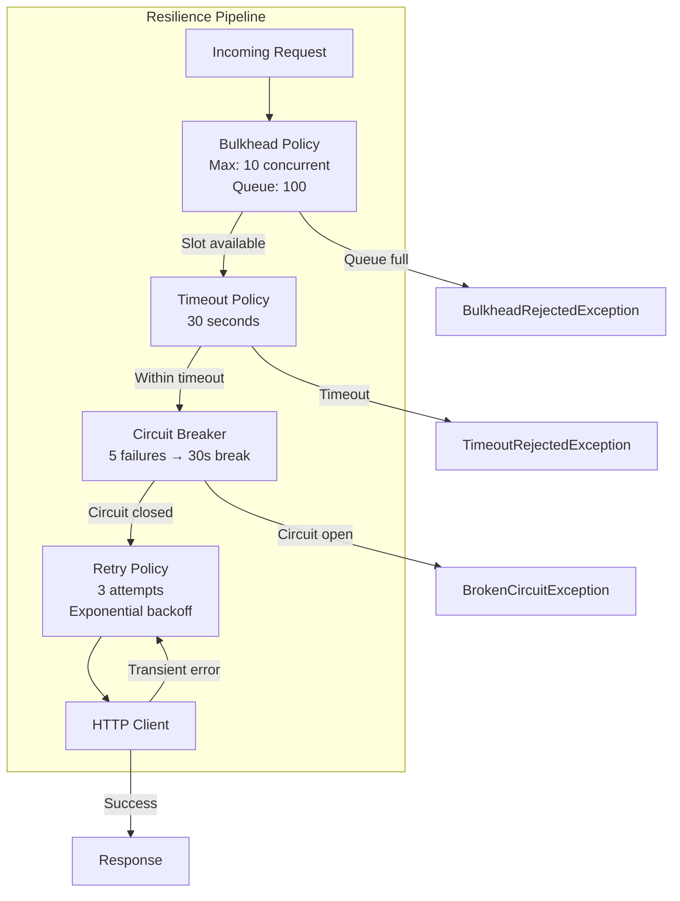
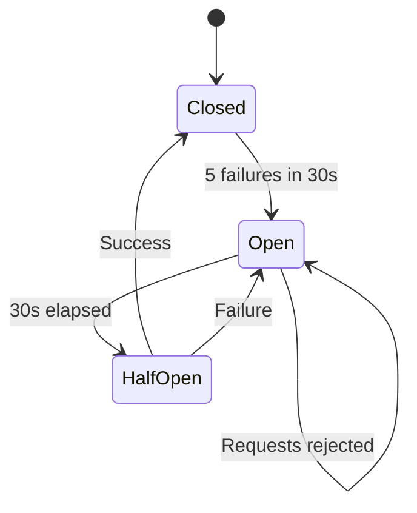

# LCS-DES-062c: Design Specification — Retry Policy Implementation

## 1. Metadata & Categorization

| Field           | Value                                     |
| :-------------- | :---------------------------------------- |
| **Document ID** | LCS-DES-062c                              |
| **Version**     | v0.6.2c                                   |
| **Status**      | Draft                                     |
| **Category**    | Infrastructure                            |
| **Module**      | Lexichord.Modules.LLM                     |
| **Created**     | 2026-01-28                                |
| **Author**      | Documentation Agent                       |
| **Parent**      | [LCS-DES-062-INDEX](LCS-DES-062-INDEX.md) |

---

## 2. Executive Summary

### 2.1 The Requirement

LLM API calls are inherently unreliable due to:

- Rate limiting (429 responses)
- Temporary service unavailability (503 responses)
- Network timeouts and intermittent failures
- Provider capacity constraints during peak usage

The system requires a robust resilience layer that handles these conditions gracefully while providing visibility into failure patterns.

### 2.2 The Solution

Implement a Polly-based resilience pipeline with four layers:

1. **Retry Policy** — Automatic retries with exponential backoff
2. **Circuit Breaker** — Fail-fast during sustained outages
3. **Timeout Policy** — Per-request time limits
4. **Bulkhead** — Concurrent request limiting

---

## 3. Architecture

### 3.1 Component Placement

```
Lexichord.Modules.LLM/
└── Resilience/
    ├── IResiliencePipeline.cs
    ├── LLMResiliencePipeline.cs
    ├── ResilienceOptions.cs
    ├── ResiliencePolicyBuilder.cs
    └── ResilienceTelemetry.cs
```

### 3.2 Policy Stack Diagram



### 3.3 State Machine: Circuit Breaker



---

## 4. Data Contract (The API)

### 4.1 ResilienceOptions Record

```csharp
namespace Lexichord.Modules.LLM.Resilience;

/// <summary>
/// Configuration options for the LLM resilience pipeline.
/// </summary>
/// <param name="RetryCount">Number of retry attempts after initial failure.</param>
/// <param name="RetryBaseDelaySeconds">Base delay for exponential backoff.</param>
/// <param name="RetryMaxDelaySeconds">Maximum delay cap for retries.</param>
/// <param name="CircuitBreakerThreshold">Failures before circuit opens.</param>
/// <param name="CircuitBreakerDurationSeconds">Duration circuit stays open.</param>
/// <param name="TimeoutSeconds">Per-request timeout.</param>
/// <param name="BulkheadMaxConcurrency">Maximum concurrent requests.</param>
/// <param name="BulkheadMaxQueue">Maximum queued requests.</param>
public record ResilienceOptions(
    int RetryCount = 3,
    double RetryBaseDelaySeconds = 1.0,
    double RetryMaxDelaySeconds = 30.0,
    int CircuitBreakerThreshold = 5,
    int CircuitBreakerDurationSeconds = 30,
    int TimeoutSeconds = 30,
    int BulkheadMaxConcurrency = 10,
    int BulkheadMaxQueue = 100
)
{
    /// <summary>
    /// Validates the options and throws if invalid.
    /// </summary>
    public void Validate()
    {
        if (RetryCount < 0)
            throw new ArgumentOutOfRangeException(nameof(RetryCount));
        if (RetryBaseDelaySeconds <= 0)
            throw new ArgumentOutOfRangeException(nameof(RetryBaseDelaySeconds));
        if (CircuitBreakerThreshold < 1)
            throw new ArgumentOutOfRangeException(nameof(CircuitBreakerThreshold));
        if (TimeoutSeconds < 1)
            throw new ArgumentOutOfRangeException(nameof(TimeoutSeconds));
        if (BulkheadMaxConcurrency < 1)
            throw new ArgumentOutOfRangeException(nameof(BulkheadMaxConcurrency));
    }
}
```

### 4.2 IResiliencePipeline Interface

```csharp
namespace Lexichord.Modules.LLM.Resilience;

/// <summary>
/// Defines a resilience pipeline for HTTP operations.
/// </summary>
public interface IResiliencePipeline
{
    /// <summary>
    /// Executes an HTTP operation through the resilience pipeline.
    /// </summary>
    /// <param name="operation">The HTTP operation to execute.</param>
    /// <param name="ct">Cancellation token.</param>
    /// <returns>The HTTP response.</returns>
    Task<HttpResponseMessage> ExecuteAsync(
        Func<CancellationToken, Task<HttpResponseMessage>> operation,
        CancellationToken ct = default);

    /// <summary>
    /// Gets the current state of the circuit breaker.
    /// </summary>
    CircuitState CircuitState { get; }

    /// <summary>
    /// Event raised when a policy event occurs.
    /// </summary>
    event EventHandler<ResilienceEvent> OnPolicyEvent;
}

/// <summary>
/// Circuit breaker states.
/// </summary>
public enum CircuitState
{
    Closed,
    Open,
    HalfOpen,
    Isolated
}

/// <summary>
/// Telemetry event from resilience policies.
/// </summary>
public record ResilienceEvent(
    string PolicyName,
    string EventType,
    TimeSpan? Duration,
    Exception? Exception,
    int? AttemptNumber
);
```

---

## 5. Implementation Logic

### 5.1 LLMResiliencePipeline Class

```csharp
namespace Lexichord.Modules.LLM.Resilience;

/// <summary>
/// Polly-based resilience pipeline for LLM HTTP operations.
/// </summary>
public class LLMResiliencePipeline : IResiliencePipeline
{
    private readonly ResilienceOptions _options;
    private readonly ILogger<LLMResiliencePipeline> _logger;
    private readonly AsyncPolicyWrap<HttpResponseMessage> _policyWrap;
    private readonly AsyncCircuitBreakerPolicy<HttpResponseMessage> _circuitBreaker;

    public LLMResiliencePipeline(
        IOptions<ResilienceOptions> options,
        ILogger<LLMResiliencePipeline> logger)
    {
        _options = options?.Value ?? throw new ArgumentNullException(nameof(options));
        _options.Validate();
        _logger = logger ?? throw new ArgumentNullException(nameof(logger));

        var builder = new ResiliencePolicyBuilder(_options, _logger);
        var bulkhead = builder.BuildBulkheadPolicy();
        var timeout = builder.BuildTimeoutPolicy();
        _circuitBreaker = builder.BuildCircuitBreakerPolicy();
        var retry = builder.BuildRetryPolicy();

        // Wrap policies in order: Bulkhead → Timeout → Circuit Breaker → Retry
        _policyWrap = Policy.WrapAsync(bulkhead, timeout, _circuitBreaker, retry);
    }

    /// <inheritdoc />
    public CircuitState CircuitState => _circuitBreaker.CircuitState switch
    {
        Polly.CircuitBreaker.CircuitState.Closed => CircuitState.Closed,
        Polly.CircuitBreaker.CircuitState.Open => CircuitState.Open,
        Polly.CircuitBreaker.CircuitState.HalfOpen => CircuitState.HalfOpen,
        Polly.CircuitBreaker.CircuitState.Isolated => CircuitState.Isolated,
        _ => CircuitState.Closed
    };

    /// <inheritdoc />
    public event EventHandler<ResilienceEvent>? OnPolicyEvent;

    /// <inheritdoc />
    public async Task<HttpResponseMessage> ExecuteAsync(
        Func<CancellationToken, Task<HttpResponseMessage>> operation,
        CancellationToken ct = default)
    {
        return await _policyWrap.ExecuteAsync(operation, ct);
    }

    private void RaiseEvent(ResilienceEvent evt)
    {
        OnPolicyEvent?.Invoke(this, evt);
    }
}
```

### 5.2 Policy Builder

```csharp
namespace Lexichord.Modules.LLM.Resilience;

/// <summary>
/// Builds individual resilience policies.
/// </summary>
public class ResiliencePolicyBuilder
{
    private readonly ResilienceOptions _options;
    private readonly ILogger _logger;
    private static readonly Random Jitter = new();

    public ResiliencePolicyBuilder(ResilienceOptions options, ILogger logger)
    {
        _options = options;
        _logger = logger;
    }

    /// <summary>
    /// Builds the retry policy with exponential backoff and jitter.
    /// </summary>
    public IAsyncPolicy<HttpResponseMessage> BuildRetryPolicy()
    {
        return Policy
            .Handle<HttpRequestException>()
            .Or<TaskCanceledException>()
            .OrResult<HttpResponseMessage>(ShouldRetry)
            .WaitAndRetryAsync(
                retryCount: _options.RetryCount,
                sleepDurationProvider: CalculateDelay,
                onRetryAsync: OnRetryAsync);
    }

    /// <summary>
    /// Builds the circuit breaker policy.
    /// </summary>
    public AsyncCircuitBreakerPolicy<HttpResponseMessage> BuildCircuitBreakerPolicy()
    {
        return Policy
            .Handle<HttpRequestException>()
            .Or<TaskCanceledException>()
            .OrResult<HttpResponseMessage>(r => (int)r.StatusCode >= 500)
            .AdvancedCircuitBreakerAsync(
                failureThreshold: 0.5,
                samplingDuration: TimeSpan.FromSeconds(30),
                minimumThroughput: _options.CircuitBreakerThreshold,
                durationOfBreak: TimeSpan.FromSeconds(_options.CircuitBreakerDurationSeconds),
                onBreak: OnCircuitBreak,
                onReset: OnCircuitReset,
                onHalfOpen: OnCircuitHalfOpen);
    }

    /// <summary>
    /// Builds the timeout policy.
    /// </summary>
    public IAsyncPolicy<HttpResponseMessage> BuildTimeoutPolicy()
    {
        return Policy.TimeoutAsync<HttpResponseMessage>(
            TimeSpan.FromSeconds(_options.TimeoutSeconds),
            TimeoutStrategy.Pessimistic,
            onTimeoutAsync: OnTimeoutAsync);
    }

    /// <summary>
    /// Builds the bulkhead isolation policy.
    /// </summary>
    public IAsyncPolicy<HttpResponseMessage> BuildBulkheadPolicy()
    {
        return Policy.BulkheadAsync<HttpResponseMessage>(
            maxParallelization: _options.BulkheadMaxConcurrency,
            maxQueuingActions: _options.BulkheadMaxQueue,
            onBulkheadRejectedAsync: OnBulkheadRejectedAsync);
    }

    private bool ShouldRetry(HttpResponseMessage response)
    {
        return response.StatusCode switch
        {
            HttpStatusCode.TooManyRequests => true,       // 429
            HttpStatusCode.ServiceUnavailable => true,    // 503
            HttpStatusCode.GatewayTimeout => true,        // 504
            HttpStatusCode.BadGateway => true,            // 502
            (HttpStatusCode)529 => true,                  // OpenAI overloaded
            _ => false
        };
    }

    private TimeSpan CalculateDelay(int attempt, DelegateResult<HttpResponseMessage> result, Context context)
    {
        // Check for Retry-After header
        if (result.Result?.Headers.RetryAfter?.Delta is TimeSpan retryAfter)
        {
            _logger.LogDebug("Using Retry-After header: {RetryAfter}", retryAfter);
            return retryAfter;
        }

        // Exponential backoff with jitter
        var exponentialDelay = TimeSpan.FromSeconds(
            Math.Pow(2, attempt) * _options.RetryBaseDelaySeconds);

        var jitterMs = Jitter.Next(0, 1000);
        var totalDelay = exponentialDelay + TimeSpan.FromMilliseconds(jitterMs);

        // Cap at max delay
        var maxDelay = TimeSpan.FromSeconds(_options.RetryMaxDelaySeconds);
        return totalDelay > maxDelay ? maxDelay : totalDelay;
    }

    private Task OnRetryAsync(
        DelegateResult<HttpResponseMessage> outcome,
        TimeSpan delay,
        int attempt,
        Context context)
    {
        var reason = outcome.Exception?.Message ?? outcome.Result?.StatusCode.ToString() ?? "Unknown";

        _logger.LogWarning(
            "Retry attempt {Attempt}/{MaxRetries} after {Delay}ms. Reason: {Reason}",
            attempt, _options.RetryCount, delay.TotalMilliseconds, reason);

        return Task.CompletedTask;
    }

    private void OnCircuitBreak(
        DelegateResult<HttpResponseMessage> result,
        CircuitState state,
        TimeSpan breakDuration,
        Context context)
    {
        _logger.LogError(
            "Circuit breaker opened for {Duration}s due to: {Reason}",
            breakDuration.TotalSeconds,
            result.Exception?.Message ?? result.Result?.StatusCode.ToString());
    }

    private void OnCircuitReset(Context context)
    {
        _logger.LogInformation("Circuit breaker reset - resuming normal operations");
    }

    private void OnCircuitHalfOpen()
    {
        _logger.LogInformation("Circuit breaker half-open - testing with next request");
    }

    private Task OnTimeoutAsync(Context context, TimeSpan timeout, Task timedOutTask)
    {
        _logger.LogWarning("Request timed out after {Timeout}s", timeout.TotalSeconds);
        return Task.CompletedTask;
    }

    private Task OnBulkheadRejectedAsync(Context context)
    {
        _logger.LogWarning("Request rejected by bulkhead - system at capacity");
        return Task.CompletedTask;
    }
}
```

---

## 6. HTTP Client Integration

### 6.1 DI Registration with Polly

```csharp
public static class ResilienceServiceCollectionExtensions
{
    /// <summary>
    /// Adds LLM resilience services to the service collection.
    /// </summary>
    public static IServiceCollection AddLLMResilience(
        this IServiceCollection services,
        IConfiguration configuration)
    {
        // Bind configuration
        services.Configure<ResilienceOptions>(
            configuration.GetSection("LLM:Resilience"));

        // Register resilience pipeline
        services.AddSingleton<IResiliencePipeline, LLMResiliencePipeline>();

        return services;
    }

    /// <summary>
    /// Adds Polly policies to an HTTP client builder.
    /// </summary>
    public static IHttpClientBuilder AddLLMResiliencePolicies(
        this IHttpClientBuilder builder,
        IServiceProvider serviceProvider)
    {
        var options = serviceProvider
            .GetRequiredService<IOptions<ResilienceOptions>>().Value;

        var loggerFactory = serviceProvider.GetRequiredService<ILoggerFactory>();
        var logger = loggerFactory.CreateLogger<ResiliencePolicyBuilder>();

        var policyBuilder = new ResiliencePolicyBuilder(options, logger);

        return builder
            .AddPolicyHandler(policyBuilder.BuildBulkheadPolicy())
            .AddPolicyHandler(policyBuilder.BuildTimeoutPolicy())
            .AddPolicyHandler(policyBuilder.BuildCircuitBreakerPolicy())
            .AddPolicyHandler(policyBuilder.BuildRetryPolicy());
    }
}
```

### 6.2 Configuration Schema

```json
{
    "LLM": {
        "Resilience": {
            "RetryCount": 3,
            "RetryBaseDelaySeconds": 1.0,
            "RetryMaxDelaySeconds": 30.0,
            "CircuitBreakerThreshold": 5,
            "CircuitBreakerDurationSeconds": 30,
            "TimeoutSeconds": 30,
            "BulkheadMaxConcurrency": 10,
            "BulkheadMaxQueue": 100
        }
    }
}
```

---

## 7. Telemetry & Observability

### 7.1 Metrics

```csharp
public class ResilienceTelemetry
{
    private static readonly Counter<long> RetryCounter = Metrics.CreateCounter<long>(
        "llm_resilience_retry_total",
        "Total retry attempts",
        new[] { "provider", "attempt" });

    private static readonly Counter<long> CircuitBreakerCounter = Metrics.CreateCounter<long>(
        "llm_resilience_circuit_breaker_total",
        "Circuit breaker state changes",
        new[] { "provider", "state" });

    private static readonly Counter<long> TimeoutCounter = Metrics.CreateCounter<long>(
        "llm_resilience_timeout_total",
        "Total timeout occurrences",
        new[] { "provider" });

    private static readonly Counter<long> BulkheadRejectionCounter = Metrics.CreateCounter<long>(
        "llm_resilience_bulkhead_rejected_total",
        "Total bulkhead rejections",
        new[] { "provider" });

    public void RecordRetry(string provider, int attempt)
        => RetryCounter.Add(1, new("provider", provider), new("attempt", attempt));

    public void RecordCircuitState(string provider, string state)
        => CircuitBreakerCounter.Add(1, new("provider", provider), new("state", state));

    public void RecordTimeout(string provider)
        => TimeoutCounter.Add(1, new("provider", provider));

    public void RecordBulkheadRejection(string provider)
        => BulkheadRejectionCounter.Add(1, new("provider", provider));
}
```

### 7.2 Health Check

```csharp
public class LLMCircuitBreakerHealthCheck : IHealthCheck
{
    private readonly IResiliencePipeline _pipeline;

    public LLMCircuitBreakerHealthCheck(IResiliencePipeline pipeline)
    {
        _pipeline = pipeline;
    }

    public Task<HealthCheckResult> CheckHealthAsync(
        HealthCheckContext context,
        CancellationToken ct = default)
    {
        return Task.FromResult(_pipeline.CircuitState switch
        {
            CircuitState.Closed => HealthCheckResult.Healthy("Circuit closed"),
            CircuitState.HalfOpen => HealthCheckResult.Degraded("Circuit half-open"),
            CircuitState.Open => HealthCheckResult.Unhealthy("Circuit open"),
            CircuitState.Isolated => HealthCheckResult.Unhealthy("Circuit isolated"),
            _ => HealthCheckResult.Healthy()
        });
    }
}
```

---

## 8. Testing Strategy

### 8.1 Unit Tests

| Test Case                              | Validation                      |
| :------------------------------------- | :------------------------------ |
| `RetryPolicy_Retries429`               | Retries on rate limit           |
| `RetryPolicy_Retries503`               | Retries on service unavailable  |
| `RetryPolicy_NoRetryOn400`             | No retry on client error        |
| `RetryPolicy_ExponentialBackoff`       | Delay doubles each attempt      |
| `RetryPolicy_RespectsRetryAfterHeader` | Uses header when present        |
| `CircuitBreaker_OpensAfterThreshold`   | Opens after 5 failures          |
| `CircuitBreaker_RejectsWhenOpen`       | Throws BrokenCircuitException   |
| `CircuitBreaker_ResetsAfterDuration`   | Transitions to half-open        |
| `Timeout_ThrowsAfterDuration`          | Request cancelled after timeout |
| `Bulkhead_RejectsWhenFull`             | Throws when at capacity         |

### 8.2 Chaos Engineering Tests

```csharp
[Fact]
public async Task Pipeline_HandlesIntermittentFailures()
{
    // Arrange: Fail first 2 requests, succeed on 3rd
    var callCount = 0;
    var handler = new MockHttpMessageHandler(_ =>
    {
        callCount++;
        return callCount < 3
            ? new HttpResponseMessage(HttpStatusCode.ServiceUnavailable)
            : new HttpResponseMessage(HttpStatusCode.OK);
    });

    var pipeline = CreatePipeline();

    // Act
    var result = await pipeline.ExecuteAsync(async ct =>
        await handler.SendAsync(new HttpRequestMessage(), ct));

    // Assert
    Assert.Equal(HttpStatusCode.OK, result.StatusCode);
    Assert.Equal(3, callCount);
}

[Fact]
public async Task CircuitBreaker_FailsFastAfterThreshold()
{
    // Arrange: All requests fail
    var handler = new MockHttpMessageHandler(_ =>
        new HttpResponseMessage(HttpStatusCode.InternalServerError));

    var pipeline = CreatePipeline();

    // Act: Exhaust circuit breaker threshold
    for (int i = 0; i < 10; i++)
    {
        try
        {
            await pipeline.ExecuteAsync(async ct =>
                await handler.SendAsync(new HttpRequestMessage(), ct));
        }
        catch { }
    }

    // Assert: Circuit should be open
    Assert.Equal(CircuitState.Open, pipeline.CircuitState);
    await Assert.ThrowsAsync<BrokenCircuitException>(async () =>
        await pipeline.ExecuteAsync(async ct =>
            await handler.SendAsync(new HttpRequestMessage(), ct)));
}
```

---

## 9. Acceptance Criteria

### 9.1 Functional Criteria

| ID    | Criterion                                          | Verification |
| :---- | :------------------------------------------------- | :----------- |
| AC-01 | Retries 429 responses with exponential backoff     | Unit tests   |
| AC-02 | Retries 503 responses with exponential backoff     | Unit tests   |
| AC-03 | Does not retry 400/401/403 responses               | Unit tests   |
| AC-04 | Circuit opens after threshold failures             | Unit tests   |
| AC-05 | Circuit rejects requests while open                | Unit tests   |
| AC-06 | Timeout cancels requests after configured duration | Unit tests   |
| AC-07 | Bulkhead limits concurrent requests                | Unit tests   |
| AC-08 | Retry-After header respected when present          | Unit tests   |

### 9.2 Non-Functional Criteria

| ID    | Criterion                    | Target |
| :---- | :--------------------------- | :----- |
| NF-01 | Policy overhead per request  | < 1ms  |
| NF-02 | Memory per pipeline instance | < 10KB |

---

## 10. Version History

| Version | Date       | Author              | Changes       |
| :------ | :--------- | :------------------ | :------------ |
| 0.1     | 2026-01-28 | Documentation Agent | Initial draft |
