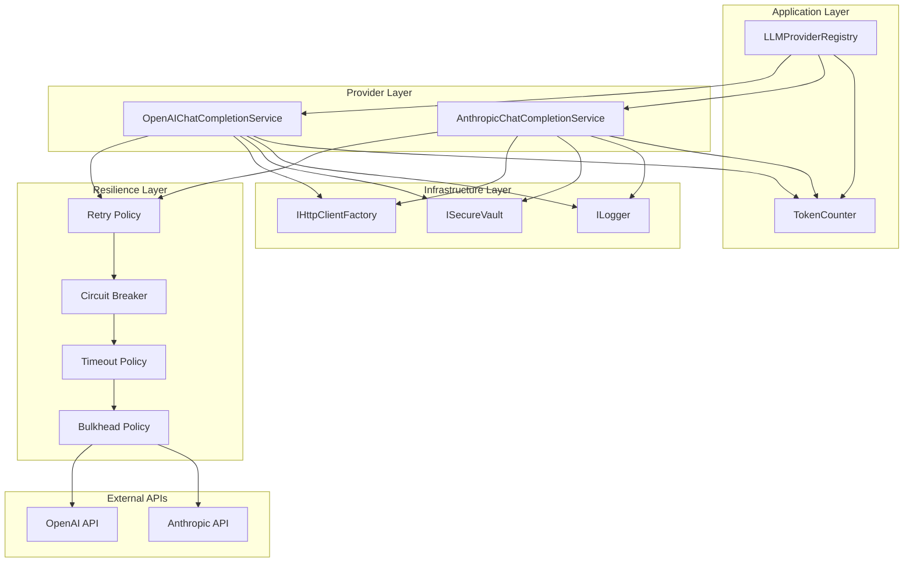
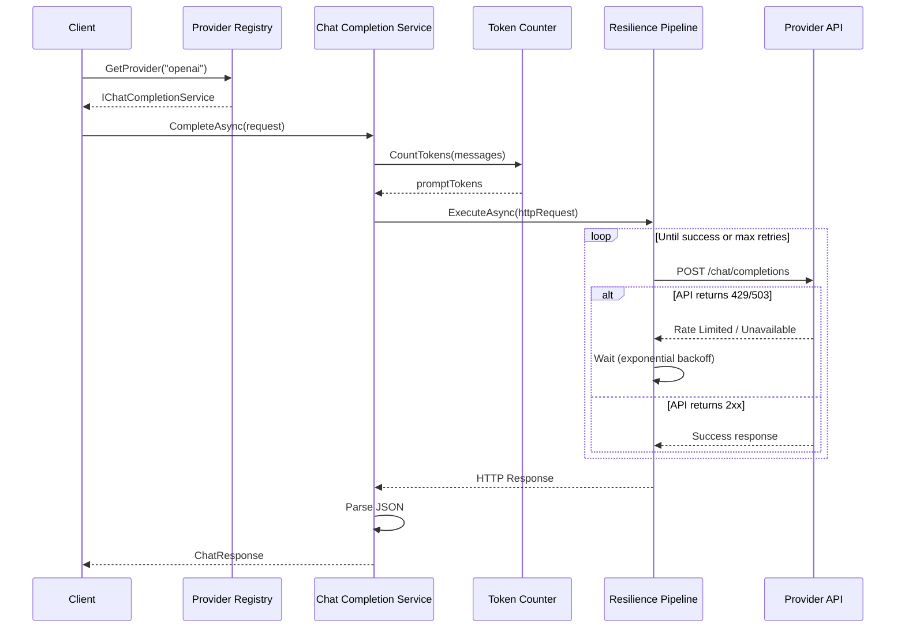
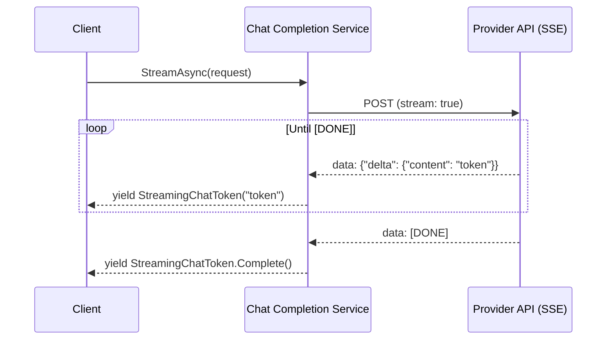
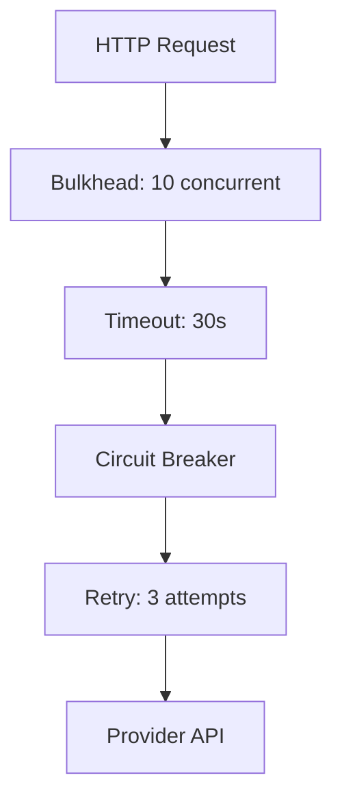
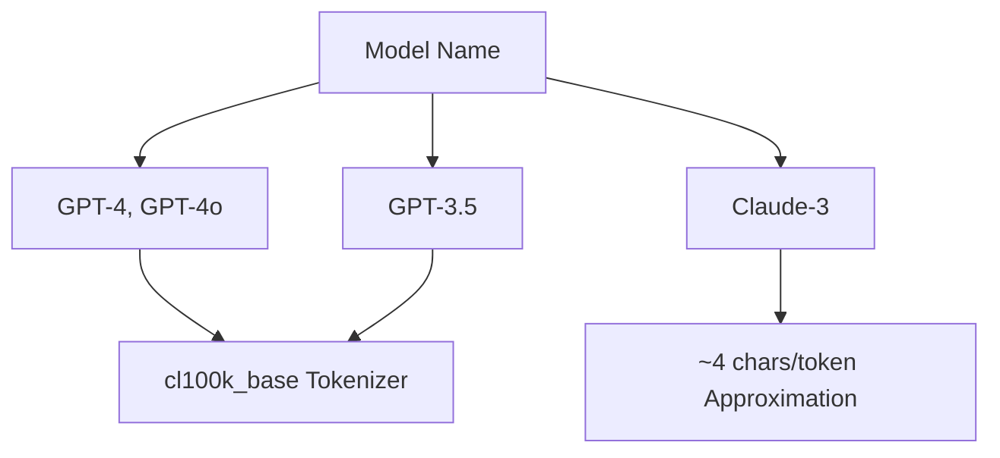
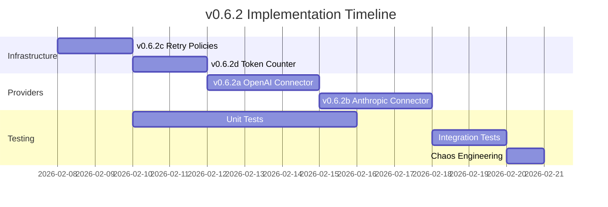

# LCS-DES-062: Design Specification Index — The Providers

## Document Control

| Field            | Value                                         |
| :--------------- | :-------------------------------------------- |
| **Document ID**  | LCS-DES-062-INDEX                             |
| **Version**      | v0.6.2                                        |
| **Status**       | Draft                                         |
| **Created**      | 2026-01-28                                    |
| **Author**       | Documentation Agent                           |
| **Related Docs** | [LCS-SBD-062](LCS-SBD-062.md), roadmap-v0.6.x |

---

## 1. Executive Summary

### 1.1 The Problem

With the LLM Gateway abstraction layer established in v0.6.1, Lexichord requires concrete implementations that communicate with real LLM providers. These implementations must handle:

- Provider-specific API protocols and authentication schemes
- Resilient communication with retry logic and circuit breakers
- Accurate token counting for cost estimation and context management
- Streaming response handling for real-time user feedback
- Error mapping to the unified exception hierarchy

### 1.2 The Solution

**v0.6.2 "The Providers"** implements production-ready LLM provider integrations with four integrated components:

| Sub-Part | Component              | Purpose                                        |
| :------- | :--------------------- | :--------------------------------------------- |
| v0.6.2a  | OpenAI Connector       | GPT model integration via Chat Completions API |
| v0.6.2b  | Anthropic Connector    | Claude model integration via Messages API      |
| v0.6.2c  | Retry Policy           | Resilient API communication with Polly         |
| v0.6.2d  | Token Counting Service | Accurate token counting for cost estimation    |

---

## 2. Related Documents

### 2.1 Design Specifications

| Document ID    | Title                  | Status |
| :------------- | :--------------------- | :----- |
| [LCS-DES-062a] | OpenAI Connector       | Draft  |
| [LCS-DES-062b] | Anthropic Connector    | Draft  |
| [LCS-DES-062c] | Retry Policy           | Draft  |
| [LCS-DES-062d] | Token Counting Service | Draft  |

### 2.2 Upstream Dependencies

| Document ID  | Title                        | Relevance              |
| :----------- | :--------------------------- | :--------------------- |
| LCS-DES-061a | Chat Completion Abstractions | Interface to implement |
| LCS-DES-061b | Chat Options Model           | Configuration model    |
| LCS-DES-061c | Provider Registry            | Registration mechanism |
| LCS-DES-006a | Secure Vault                 | API key retrieval      |
| LCS-DES-004c | License Context              | WriterPro gating       |

### 2.3 Downstream Dependents

| Version | Feature           | Dependency                                 |
| :------ | :---------------- | :----------------------------------------- |
| v0.6.3  | Prompt Templates  | Uses provider implementations              |
| v0.6.4  | Co-pilot Agent    | Orchestrates provider calls                |
| v0.6.5  | Specialist Agents | Uses token counting for context management |
| v0.6.6+ | Multi-Agent       | Manages provider capacity                  |

---

## 3. Architecture Overview

### 3.1 Component Diagram



### 3.2 Request Flow



### 3.3 Streaming Flow



---

## 4. Dependencies

### 4.1 Interface Dependencies

| Interface                | Version | Module       | Usage                 |
| :----------------------- | :------ | :----------- | :-------------------- |
| `IChatCompletionService` | v0.6.1a | Abstractions | Base interface        |
| `ChatRequest`            | v0.6.1a | Abstractions | Request model         |
| `ChatResponse`           | v0.6.1a | Abstractions | Response model        |
| `StreamingChatToken`     | v0.6.1a | Abstractions | Streaming token       |
| `ChatOptions`            | v0.6.1b | Abstractions | Configuration         |
| `ILLMProviderRegistry`   | v0.6.1c | Abstractions | Provider registration |
| `ISecureVault`           | v0.0.6a | Abstractions | API key storage       |
| `ILicenseContext`        | v0.0.4c | Abstractions | License validation    |
| `ILogger<T>`             | v0.0.3b | MS.Logging   | Structured logging    |
| `IConfiguration`         | v0.0.3d | MS.Config    | Configuration access  |

### 4.2 NuGet Dependencies

| Package                           | Version | Purpose                  |
| :-------------------------------- | :------ | :----------------------- |
| `System.Text.Json`                | 9.x     | JSON serialization       |
| `Polly`                           | 8.5.x   | Resilience policies      |
| `Polly.Extensions.Http`           | 8.x     | HttpClient integration   |
| `Microsoft.Extensions.Http.Polly` | 9.x     | DI integration for Polly |
| `Microsoft.ML.Tokenizers`         | 0.22.x  | GPT token counting       |

---

## 5. License Gating Strategy

### 5.1 Feature Matrix

| Feature                    | Core | WriterPro | Teams | Enterprise |
| :------------------------- | :--- | :-------- | :---- | :--------- |
| Use OpenAI provider        | ✗    | ✓         | ✓     | ✓          |
| Use Anthropic provider     | ✗    | ✓         | ✓     | ✓          |
| Streaming responses        | ✗    | ✗         | ✓     | ✓          |
| Token usage dashboard      | ✗    | ✓         | ✓     | ✓          |
| Custom retry configuration | ✗    | ✗         | ✗     | ✓          |
| Concurrent request limits  | 1    | 3         | 10    | Unlimited  |

### 5.2 Gating Implementation

```csharp
// Attribute-based gating on service classes
[RequiresLicense(LicenseTier.WriterPro)]
public class OpenAIChatCompletionService : IChatCompletionService { }

[RequiresLicense(LicenseTier.WriterPro)]
public class AnthropicChatCompletionService : IChatCompletionService { }

// Feature keys for runtime checks
public static class FeatureKeys
{
    public const string OpenAIProvider = "Features.LLM.Provider.OpenAI";
    public const string AnthropicProvider = "Features.LLM.Provider.Anthropic";
    public const string StreamingChat = "Features.LLM.Streaming";
    public const string CustomResilience = "Features.LLM.CustomResilience";
}
```

---

## 6. Security Considerations

### 6.1 API Key Handling

- Keys retrieved from `ISecureVault` on each request to avoid memory persistence
- Keys never logged, serialized to disk, or included in exception messages
- HTTP Authorization header set just before transmission
- Memory cleared after HTTP request completes

### 6.2 Request/Response Logging

```csharp
// Safe logging - only metadata
logger.LogInformation(
    "Completing request to {Provider}: Model={Model}, PromptTokens={Tokens}",
    ProviderName, request.Options.Model, promptTokens);

// NEVER log content
// logger.LogDebug("Request content: {Content}", request.Messages); // FORBIDDEN
```

### 6.3 Rate Limiting Protection

| Attack Vector      | Protection                                 |
| :----------------- | :----------------------------------------- |
| API key theft      | ISecureVault encryption, no logging        |
| Rate limit abuse   | Bulkhead policy limits concurrent requests |
| Cost explosion     | Token counting, optional spending limits   |
| Response injection | Validate response format before parsing    |

---

## 7. Error Handling Strategy

### 7.1 HTTP Status Code Mapping

| Status Code | Exception Type                 | Retry |
| :---------- | :----------------------------- | :---- |
| 400         | `InvalidRequestException`      | No    |
| 401         | `AuthenticationException`      | No    |
| 403         | `AuthorizationException`       | No    |
| 404         | `ModelNotAvailableException`   | No    |
| 429         | `RateLimitException`           | Yes   |
| 500         | `ProviderUnavailableException` | Yes   |
| 502         | `ProviderUnavailableException` | Yes   |
| 503         | `ProviderUnavailableException` | Yes   |
| Timeout     | `RequestTimeoutException`      | Yes   |

### 7.2 Exception Enrichment

```csharp
public class RateLimitException : ChatCompletionException
{
    public TimeSpan? RetryAfter { get; }
    public int? RemainingRequests { get; }
    public DateTimeOffset? ResetTime { get; }

    // Parsed from Retry-After, x-ratelimit-remaining-requests, etc.
}
```

---

## 8. Resilience Architecture

### 8.1 Policy Stack



### 8.2 Policy Configuration

| Policy          | Configuration                                    |
| :-------------- | :----------------------------------------------- |
| Bulkhead        | Max 10 concurrent, 100 queue depth               |
| Timeout         | 30 seconds per request                           |
| Circuit Breaker | Open after 5 failures in 30s, break for 30s      |
| Retry           | 3 attempts with exponential backoff (1s, 2s, 4s) |

### 8.3 Telemetry Events

| Event                     | Metric                         |
| :------------------------ | :----------------------------- |
| `polly.retry`             | Retry count, delay duration    |
| `polly.circuit-breaker`   | State transitions, break count |
| `polly.timeout`           | Timeout occurrences            |
| `polly.bulkhead-rejected` | Queue overflow count           |

---

## 9. Token Counting Architecture

### 9.1 Tokenizer Selection



### 9.2 Message Overhead

| Component         | Token Cost |
| :---------------- | :--------- |
| Per message       | 4 tokens   |
| Role: system      | 1 token    |
| Role: user        | 1 token    |
| Role: assistant   | 1 token    |
| Name (if present) | 1+ tokens  |

### 9.3 Cost Calculation

```csharp
public record TokenUsage(
    int PromptTokens,
    int CompletionTokens,
    decimal EstimatedCost
)
{
    public int TotalTokens => PromptTokens + CompletionTokens;
}

// Model pricing (USD per 1M tokens) - configurable
public static class ModelPricing
{
    public static decimal GetInputPrice(string model) => model switch
    {
        "gpt-4o" => 2.50m,
        "gpt-4o-mini" => 0.15m,
        "claude-3-5-sonnet-20241022" => 3.00m,
        "claude-3-haiku-20240307" => 0.25m,
        _ => 1.00m // default estimate
    };
}
```

---

## 10. Implementation Order



---

## 11. Observability

### 11.1 Metrics

| Metric                         | Type      | Labels                   |
| :----------------------------- | :-------- | :----------------------- |
| `llm_request_duration_seconds` | Histogram | provider, model, success |
| `llm_token_usage_total`        | Counter   | provider, model, type    |
| `llm_request_total`            | Counter   | provider, model, status  |
| `llm_circuit_breaker_state`    | Gauge     | provider                 |
| `llm_retry_total`              | Counter   | provider, attempt        |

### 11.2 Structured Logging

```csharp
// Request start
logger.LogInformation(
    "LLM request started: Provider={Provider}, Model={Model}, PromptTokens={Tokens}",
    provider, model, promptTokens);

// Request complete
logger.LogInformation(
    "LLM request completed: Provider={Provider}, Duration={Duration}ms, " +
    "PromptTokens={Prompt}, CompletionTokens={Completion}",
    provider, duration.TotalMilliseconds, promptTokens, completionTokens);

// Error with correlation
logger.LogError(ex,
    "LLM request failed: Provider={Provider}, Error={Error}, CorrelationId={CorrelationId}",
    provider, ex.Message, correlationId);
```

---

## 12. Version History

| Version | Date       | Author              | Changes       |
| :------ | :--------- | :------------------ | :------------ |
| 0.1     | 2026-01-28 | Documentation Agent | Initial draft |
