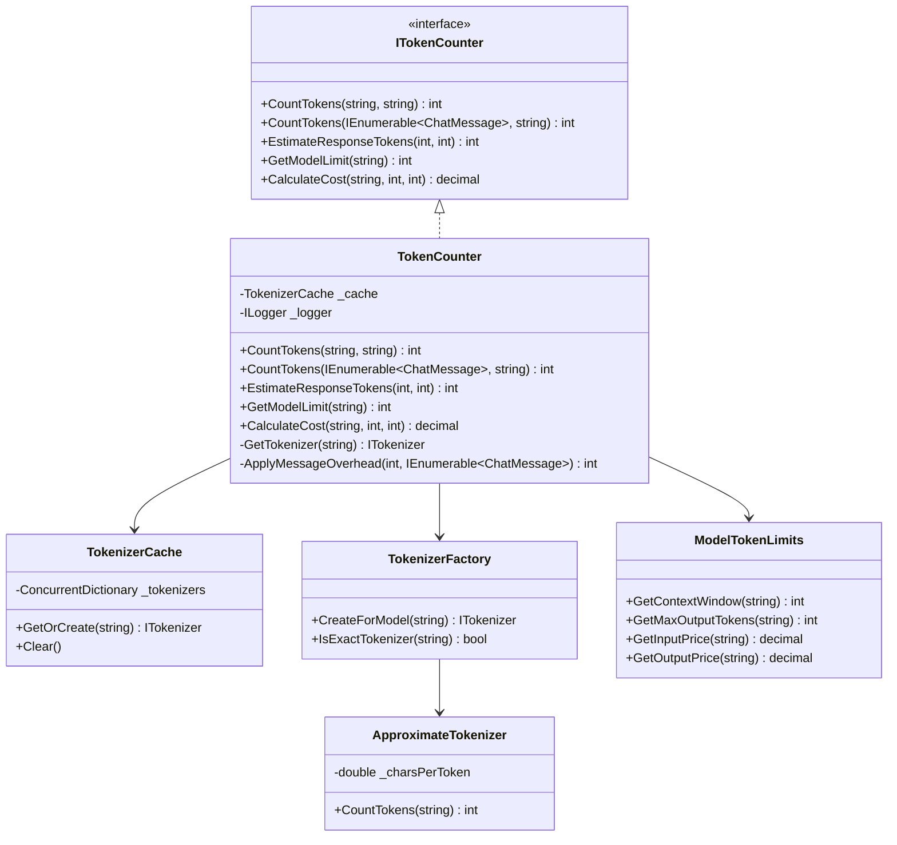

# LCS-DES-062d: Design Specification — Token Counting Service

## 1. Metadata & Categorization

| Field           | Value                                     |
| :-------------- | :---------------------------------------- |
| **Document ID** | LCS-DES-062d                              |
| **Version**     | v0.6.2d                                   |
| **Status**      | Draft                                     |
| **Category**    | Infrastructure                            |
| **Module**      | Lexichord.Modules.LLM                     |
| **Created**     | 2026-01-28                                |
| **Author**      | Documentation Agent                       |
| **Parent**      | [LCS-DES-062-INDEX](LCS-DES-062-INDEX.md) |

---

## 2. Executive Summary

### 2.1 The Requirement

Accurate token counting is essential for:

- **Cost estimation** — Predicting API costs before sending requests
- **Context management** — Ensuring prompts fit within model limits
- **Prompt truncation** — Intelligently trimming content to fit budgets
- **Usage tracking** — Monitoring consumption across sessions

Different LLM providers use different tokenization schemes, requiring model-aware counting.

### 2.2 The Solution

Implement `ITokenCounter` with `TokenCounter` — a service that uses:

- **Microsoft.ML.Tokenizers** for GPT models (cl100k_base encoding)
- **Approximation** (~4 characters/token) for Claude models until official tokenizer is available
- **Caching** for tokenizer instances to optimize performance

---

## 3. Architecture

### 3.1 Component Placement

```
Lexichord.Modules.LLM/
└── TokenCounting/
    ├── ITokenCounter.cs
    ├── TokenCounter.cs
    ├── TokenizerFactory.cs
    ├── TokenizerCache.cs
    └── ModelTokenLimits.cs
```

### 3.2 Class Diagram



---

## 4. Data Contract (The API)

### 4.1 ITokenCounter Interface

```csharp
namespace Lexichord.Abstractions.Contracts.LLM;

/// <summary>
/// Service for counting tokens in text and chat messages.
/// </summary>
public interface ITokenCounter
{
    /// <summary>
    /// Counts tokens in a text string for a specific model.
    /// </summary>
    /// <param name="text">The text to tokenize.</param>
    /// <param name="model">The model name (e.g., "gpt-4o", "claude-3-haiku-20240307").</param>
    /// <returns>The token count.</returns>
    int CountTokens(string text, string model);

    /// <summary>
    /// Counts tokens in a collection of chat messages.
    /// </summary>
    /// <param name="messages">The chat messages.</param>
    /// <param name="model">The model name.</param>
    /// <returns>The total token count including message overhead.</returns>
    int CountTokens(IEnumerable<ChatMessage> messages, string model);

    /// <summary>
    /// Estimates the expected response tokens based on prompt tokens.
    /// </summary>
    /// <param name="promptTokens">Number of tokens in the prompt.</param>
    /// <param name="maxTokens">Maximum tokens allowed in response.</param>
    /// <returns>Estimated response tokens.</returns>
    int EstimateResponseTokens(int promptTokens, int maxTokens);

    /// <summary>
    /// Gets the context window size for a model.
    /// </summary>
    /// <param name="model">The model name.</param>
    /// <returns>Maximum context tokens.</returns>
    int GetModelLimit(string model);

    /// <summary>
    /// Calculates the estimated cost for a request.
    /// </summary>
    /// <param name="model">The model name.</param>
    /// <param name="inputTokens">Number of input tokens.</param>
    /// <param name="outputTokens">Number of output tokens.</param>
    /// <returns>Estimated cost in USD.</returns>
    decimal CalculateCost(string model, int inputTokens, int outputTokens);
}
```

### 4.2 TokenCounter Implementation

```csharp
namespace Lexichord.Modules.LLM.TokenCounting;

/// <summary>
/// Implementation of token counting with support for multiple model families.
/// </summary>
public class TokenCounter : ITokenCounter
{
    private readonly TokenizerCache _cache;
    private readonly TokenizerFactory _factory;
    private readonly ILogger<TokenCounter> _logger;

    // Message overhead constants (OpenAI format)
    private const int TokensPerMessage = 4;  // Every message has overhead
    private const int TokensPerRole = 1;     // Role name token
    private const int ReplyPriming = 3;      // Reply priming tokens

    public TokenCounter(
        TokenizerCache cache,
        TokenizerFactory factory,
        ILogger<TokenCounter> logger)
    {
        _cache = cache ?? throw new ArgumentNullException(nameof(cache));
        _factory = factory ?? throw new ArgumentNullException(nameof(factory));
        _logger = logger ?? throw new ArgumentNullException(nameof(logger));
    }

    /// <inheritdoc />
    public int CountTokens(string text, string model)
    {
        if (string.IsNullOrEmpty(text))
            return 0;

        var tokenizer = _cache.GetOrCreate(model, () => _factory.CreateForModel(model));
        var count = tokenizer.CountTokens(text);

        _logger.LogTrace(
            "Counted {Tokens} tokens for {Length} chars using {Model}",
            count, text.Length, model);

        return count;
    }

    /// <inheritdoc />
    public int CountTokens(IEnumerable<ChatMessage> messages, string model)
    {
        var messageList = messages.ToList();
        if (messageList.Count == 0)
            return 0;

        var tokenizer = _cache.GetOrCreate(model, () => _factory.CreateForModel(model));
        var totalTokens = 0;

        foreach (var message in messageList)
        {
            // Content tokens
            totalTokens += tokenizer.CountTokens(message.Content);

            // Message overhead
            totalTokens += TokensPerMessage;
            totalTokens += TokensPerRole;

            // Name tokens if present
            if (!string.IsNullOrEmpty(message.Name))
            {
                totalTokens += tokenizer.CountTokens(message.Name);
            }
        }

        // Reply priming
        totalTokens += ReplyPriming;

        _logger.LogDebug(
            "Counted {Tokens} tokens for {MessageCount} messages using {Model}",
            totalTokens, messageList.Count, model);

        return totalTokens;
    }

    /// <inheritdoc />
    public int EstimateResponseTokens(int promptTokens, int maxTokens)
    {
        // Heuristic: responses typically use 30-70% of max tokens
        // Use 50% as a reasonable estimate
        var estimated = Math.Min(maxTokens, Math.Max(100, maxTokens / 2));
        return estimated;
    }

    /// <inheritdoc />
    public int GetModelLimit(string model) => ModelTokenLimits.GetContextWindow(model);

    /// <inheritdoc />
    public decimal CalculateCost(string model, int inputTokens, int outputTokens)
    {
        var inputPrice = ModelTokenLimits.GetInputPrice(model);
        var outputPrice = ModelTokenLimits.GetOutputPrice(model);

        // Prices are per 1M tokens
        var inputCost = (inputTokens / 1_000_000m) * inputPrice;
        var outputCost = (outputTokens / 1_000_000m) * outputPrice;

        return inputCost + outputCost;
    }
}
```

---

## 5. Implementation Logic

### 5.1 Tokenizer Factory

```csharp
namespace Lexichord.Modules.LLM.TokenCounting;

/// <summary>
/// Factory for creating model-specific tokenizers.
/// </summary>
public class TokenizerFactory
{
    private static readonly Lazy<Tokenizer> Cl100kTokenizer = new(() =>
        Tokenizer.CreateTiktokenForModel("gpt-4"));

    /// <summary>
    /// Creates a tokenizer appropriate for the given model.
    /// </summary>
    public ITokenizer CreateForModel(string model)
    {
        var normalizedModel = model.ToLowerInvariant();

        // GPT-4 and GPT-3.5 family - use cl100k_base
        if (normalizedModel.StartsWith("gpt-4") ||
            normalizedModel.StartsWith("gpt-3.5"))
        {
            return new MlTokenizerWrapper(Cl100kTokenizer.Value);
        }

        // Claude family - use approximation until official tokenizer available
        if (normalizedModel.StartsWith("claude"))
        {
            return new ApproximateTokenizer(charsPerToken: 4.0);
        }

        // Default to approximation for unknown models
        return new ApproximateTokenizer(charsPerToken: 4.0);
    }

    /// <summary>
    /// Returns whether the model has an exact tokenizer implementation.
    /// </summary>
    public bool IsExactTokenizer(string model)
    {
        var normalizedModel = model.ToLowerInvariant();
        return normalizedModel.StartsWith("gpt-4") ||
               normalizedModel.StartsWith("gpt-3.5");
    }
}
```

### 5.2 Tokenizer Wrapper

```csharp
namespace Lexichord.Modules.LLM.TokenCounting;

/// <summary>
/// Common interface for tokenizer implementations.
/// </summary>
public interface ITokenizer
{
    int CountTokens(string text);
}

/// <summary>
/// Wrapper for Microsoft.ML.Tokenizers.
/// </summary>
public class MlTokenizerWrapper : ITokenizer
{
    private readonly Tokenizer _tokenizer;

    public MlTokenizerWrapper(Tokenizer tokenizer)
    {
        _tokenizer = tokenizer ?? throw new ArgumentNullException(nameof(tokenizer));
    }

    public int CountTokens(string text)
    {
        if (string.IsNullOrEmpty(text))
            return 0;

        var encoded = _tokenizer.Encode(text);
        return encoded.Ids.Count;
    }
}

/// <summary>
/// Approximate tokenizer using character-to-token ratio.
/// </summary>
public class ApproximateTokenizer : ITokenizer
{
    private readonly double _charsPerToken;

    public ApproximateTokenizer(double charsPerToken = 4.0)
    {
        _charsPerToken = charsPerToken > 0
            ? charsPerToken
            : throw new ArgumentOutOfRangeException(nameof(charsPerToken));
    }

    public int CountTokens(string text)
    {
        if (string.IsNullOrEmpty(text))
            return 0;

        return (int)Math.Ceiling(text.Length / _charsPerToken);
    }
}
```

### 5.3 Tokenizer Cache

```csharp
namespace Lexichord.Modules.LLM.TokenCounting;

/// <summary>
/// Thread-safe cache for tokenizer instances.
/// </summary>
public class TokenizerCache
{
    private readonly ConcurrentDictionary<string, Lazy<ITokenizer>> _cache = new();

    /// <summary>
    /// Gets or creates a tokenizer for the given model.
    /// </summary>
    public ITokenizer GetOrCreate(string model, Func<ITokenizer> factory)
    {
        var key = NormalizeModelKey(model);
        return _cache.GetOrAdd(key, _ => new Lazy<ITokenizer>(factory)).Value;
    }

    /// <summary>
    /// Clears the tokenizer cache.
    /// </summary>
    public void Clear() => _cache.Clear();

    private static string NormalizeModelKey(string model)
    {
        var lower = model.ToLowerInvariant();

        // Group GPT models together
        if (lower.StartsWith("gpt-4")) return "gpt-4";
        if (lower.StartsWith("gpt-3.5")) return "gpt-3.5";

        // Group Claude models together
        if (lower.StartsWith("claude")) return "claude";

        return lower;
    }
}
```

### 5.4 Model Token Limits

```csharp
namespace Lexichord.Modules.LLM.TokenCounting;

/// <summary>
/// Static data for model token limits and pricing.
/// </summary>
public static class ModelTokenLimits
{
    private static readonly Dictionary<string, (int ContextWindow, int MaxOutput, decimal InputPrice, decimal OutputPrice)> Models = new()
    {
        // OpenAI models (prices per 1M tokens)
        ["gpt-4o"] = (128_000, 16_384, 2.50m, 10.00m),
        ["gpt-4o-mini"] = (128_000, 16_384, 0.15m, 0.60m),
        ["gpt-4-turbo"] = (128_000, 4_096, 10.00m, 30.00m),
        ["gpt-3.5-turbo"] = (16_385, 4_096, 0.50m, 1.50m),

        // Anthropic models (prices per 1M tokens)
        ["claude-3-5-sonnet-20241022"] = (200_000, 8_192, 3.00m, 15.00m),
        ["claude-3-opus-20240229"] = (200_000, 4_096, 15.00m, 75.00m),
        ["claude-3-sonnet-20240229"] = (200_000, 4_096, 3.00m, 15.00m),
        ["claude-3-haiku-20240307"] = (200_000, 4_096, 0.25m, 1.25m),
    };

    // Default values for unknown models
    private const int DefaultContextWindow = 4_096;
    private const int DefaultMaxOutput = 2_048;
    private const decimal DefaultInputPrice = 1.00m;
    private const decimal DefaultOutputPrice = 2.00m;

    /// <summary>
    /// Gets the context window size for a model.
    /// </summary>
    public static int GetContextWindow(string model)
    {
        var key = FindModelKey(model);
        return key != null && Models.TryGetValue(key, out var info)
            ? info.ContextWindow
            : DefaultContextWindow;
    }

    /// <summary>
    /// Gets the maximum output tokens for a model.
    /// </summary>
    public static int GetMaxOutputTokens(string model)
    {
        var key = FindModelKey(model);
        return key != null && Models.TryGetValue(key, out var info)
            ? info.MaxOutput
            : DefaultMaxOutput;
    }

    /// <summary>
    /// Gets the input price per 1M tokens.
    /// </summary>
    public static decimal GetInputPrice(string model)
    {
        var key = FindModelKey(model);
        return key != null && Models.TryGetValue(key, out var info)
            ? info.InputPrice
            : DefaultInputPrice;
    }

    /// <summary>
    /// Gets the output price per 1M tokens.
    /// </summary>
    public static decimal GetOutputPrice(string model)
    {
        var key = FindModelKey(model);
        return key != null && Models.TryGetValue(key, out var info)
            ? info.OutputPrice
            : DefaultOutputPrice;
    }

    private static string? FindModelKey(string model)
    {
        var lower = model.ToLowerInvariant();
        return Models.Keys.FirstOrDefault(k =>
            lower.StartsWith(k) || lower == k);
    }
}
```

---

## 6. Usage Examples

### 6.1 Basic Token Counting

```csharp
// Count tokens in plain text
var tokens = tokenCounter.CountTokens("Hello, world!", "gpt-4o");
// Result: ~4 tokens

// Count tokens in messages
var messages = new[]
{
    ChatMessage.System("You are a helpful assistant."),
    ChatMessage.User("What is the capital of France?")
};
var messageTokens = tokenCounter.CountTokens(messages, "gpt-4o");
// Result: ~25 tokens (content + overhead)
```

### 6.2 Cost Estimation

```csharp
// Before sending a request
var promptTokens = tokenCounter.CountTokens(request.Messages, "gpt-4o-mini");
var estimatedOutput = tokenCounter.EstimateResponseTokens(promptTokens, request.Options.MaxTokens);
var estimatedCost = tokenCounter.CalculateCost("gpt-4o-mini", promptTokens, estimatedOutput);

logger.LogInformation(
    "Estimated cost: ${Cost:F4} ({PromptTokens} in, ~{OutputTokens} out)",
    estimatedCost, promptTokens, estimatedOutput);
```

### 6.3 Context Window Validation

```csharp
public class ContextValidator
{
    private readonly ITokenCounter _tokenCounter;

    public bool WillFitInContext(
        IEnumerable<ChatMessage> messages,
        string model,
        int maxResponseTokens)
    {
        var promptTokens = _tokenCounter.CountTokens(messages, model);
        var contextWindow = _tokenCounter.GetModelLimit(model);
        var available = contextWindow - promptTokens;

        return available >= maxResponseTokens;
    }

    public int GetAvailableTokens(
        IEnumerable<ChatMessage> messages,
        string model)
    {
        var promptTokens = _tokenCounter.CountTokens(messages, model);
        var contextWindow = _tokenCounter.GetModelLimit(model);
        return Math.Max(0, contextWindow - promptTokens);
    }
}
```

---

## 7. DI Registration

```csharp
public static class TokenCountingServiceCollectionExtensions
{
    /// <summary>
    /// Adds token counting services to the service collection.
    /// </summary>
    public static IServiceCollection AddTokenCounting(this IServiceCollection services)
    {
        services.AddSingleton<TokenizerCache>();
        services.AddSingleton<TokenizerFactory>();
        services.AddSingleton<ITokenCounter, TokenCounter>();

        return services;
    }
}
```

---

## 8. Testing Strategy

### 8.1 Unit Tests

| Test Case                                   | Validation                  |
| :------------------------------------------ | :-------------------------- |
| `CountTokens_EmptyString_ReturnsZero`       | Empty input handling        |
| `CountTokens_SimpleText_ReturnsTokens`      | Basic tokenization          |
| `CountTokens_GptModel_UsesCl100k`           | Correct tokenizer selection |
| `CountTokens_ClaudeModel_UsesApproximation` | Falls back to approximation |
| `CountTokens_Messages_IncludesOverhead`     | Message overhead added      |
| `GetModelLimit_KnownModel_ReturnsLimit`     | Correct context window      |
| `GetModelLimit_UnknownModel_ReturnsDefault` | Default fallback            |
| `CalculateCost_ReturnsCorrectCost`          | Price calculation           |
| `TokenizerCache_ReusesInstances`            | Caching works               |

### 8.2 Accuracy Tests

```csharp
public class TokenCountingAccuracyTests
{
    [Theory]
    [InlineData("Hello, world!", "gpt-4o", 4)]
    [InlineData("The quick brown fox jumps over the lazy dog.", "gpt-4o", 9)]
    [InlineData("1234567890", "gpt-4o", 3)]
    public void CountTokens_GptModel_MatchesExpected(string text, string model, int expected)
    {
        var counter = CreateTokenCounter();
        var actual = counter.CountTokens(text, model);

        // Allow 10% variance for tokenizer differences
        Assert.InRange(actual, (int)(expected * 0.9), (int)(expected * 1.1));
    }

    [Theory]
    [InlineData("Hello, world!", "claude-3-haiku-20240307")]
    public void CountTokens_ClaudeModel_ReasonableApproximation(string text, string model)
    {
        var counter = CreateTokenCounter();
        var actual = counter.CountTokens(text, model);

        // Approximation should be within 2x of actual (conservative estimate)
        var expectedMin = text.Length / 8;  // ~8 chars/token worst case
        var expectedMax = text.Length / 2;  // ~2 chars/token best case

        Assert.InRange(actual, expectedMin, expectedMax);
    }
}
```

### 8.3 Performance Tests

```csharp
[Fact]
public void CountTokens_LargeText_CompletesQuickly()
{
    var largeText = new string('x', 100_000);  // 100KB of text
    var counter = CreateTokenCounter();

    var sw = Stopwatch.StartNew();
    var tokens = counter.CountTokens(largeText, "gpt-4o");
    sw.Stop();

    Assert.True(sw.ElapsedMilliseconds < 100, $"Took {sw.ElapsedMilliseconds}ms");
    Assert.True(tokens > 0);
}

[Fact]
public void TokenizerCache_IncreasesPerformance()
{
    var counter = CreateTokenCounter();
    var text = "Hello world";

    // Warm up
    counter.CountTokens(text, "gpt-4o");

    // Measure cached performance
    var iterations = 10_000;
    var sw = Stopwatch.StartNew();
    for (int i = 0; i < iterations; i++)
    {
        counter.CountTokens(text, "gpt-4o");
    }
    sw.Stop();

    var avgMicroseconds = (sw.ElapsedMilliseconds * 1000.0) / iterations;
    Assert.True(avgMicroseconds < 100, $"Avg: {avgMicroseconds}μs");
}
```

---

## 9. Acceptance Criteria

### 9.1 Functional Criteria

| ID    | Criterion                                        | Verification   |
| :---- | :----------------------------------------------- | :------------- |
| AC-01 | GPT models use cl100k_base tokenizer             | Unit tests     |
| AC-02 | Claude models use approximation tokenizer        | Unit tests     |
| AC-03 | Message overhead included in message counting    | Unit tests     |
| AC-04 | Model limits return correct context windows      | Unit tests     |
| AC-05 | Cost calculation uses correct pricing            | Unit tests     |
| AC-06 | Tokenizer instances are cached                   | Unit tests     |
| AC-07 | Token count within 10% of OpenAI's count for GPT | Accuracy tests |

### 9.2 Non-Functional Criteria

| ID    | Criterion                     | Target  |
| :---- | :---------------------------- | :------ |
| NF-01 | Token counting 100KB text     | < 100ms |
| NF-02 | Cached tokenizer lookup       | < 100μs |
| NF-03 | Memory per tokenizer instance | < 5MB   |

---

## 10. Future Enhancements

### 10.1 Planned Improvements

| Enhancement                | Version | Description                          |
| :------------------------- | :------ | :----------------------------------- |
| Anthropic tokenizer        | v0.6.5+ | Replace approximation with official  |
| Token budget management    | v0.6.5+ | Automatic prompt truncation          |
| Cost alerts                | v0.7.x  | Notify when approaching spend limits |
| Token streaming estimation | v0.7.x  | Real-time cost during streaming      |

### 10.2 Configuration Extension

```json
{
    "LLM": {
        "TokenCounting": {
            "EnableCaching": true,
            "CacheTimeout": "01:00:00",
            "ApproximationCharsPerToken": 4.0,
            "PricingOverrides": {
                "gpt-4o": {
                    "InputPricePerMillion": 2.5,
                    "OutputPricePerMillion": 10.0
                }
            }
        }
    }
}
```

---

## 11. Version History

| Version | Date       | Author              | Changes       |
| :------ | :--------- | :------------------ | :------------ |
| 0.1     | 2026-01-28 | Documentation Agent | Initial draft |
