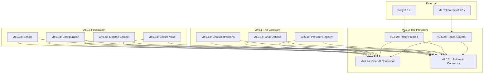

# LCS-SBD-062: Scope Breakdown — The Providers

## Document Control

| Field            | Value                                                     |
| :--------------- | :-------------------------------------------------------- |
| **Document ID**  | LCS-SBD-062                                               |
| **Version**      | v0.6.2                                                    |
| **Status**       | Draft                                                     |
| **Created**      | 2026-01-28                                                |
| **Author**       | Documentation Agent                                       |
| **Related Docs** | [LCS-DES-062-INDEX](LCS-DES-062-INDEX.md), roadmap-v0.6.x |

---

## 1. Executive Summary

### 1.1 The Vision

**v0.6.2** delivers **The Providers** — concrete LLM provider integrations for OpenAI and Anthropic with production-ready resilience patterns. This release implements the `IChatCompletionService` interface defined in v0.6.1, transforming the abstract gateway into a functional AI backbone with proper error handling, retry logic, and cost estimation.

### 1.2 The Value Proposition

| Stakeholder    | Benefit                                                             |
| :------------- | :------------------------------------------------------------------ |
| **Writers**    | Access to GPT-4o and Claude models for AI-assisted writing          |
| **Teams**      | Provider flexibility for cost optimization and compliance           |
| **Developers** | Production-ready integrations with resilient API communication      |
| **Enterprise** | Predictable costs through accurate token counting and rate limiting |

### 1.3 Success Metrics

| Metric                        | Target  | Measurement Method                       |
| :---------------------------- | :------ | :--------------------------------------- |
| API call success rate         | ≥ 99%   | Success/failure ratio after retries      |
| Token counting accuracy       | ≥ 98%   | Comparison with provider-reported counts |
| Streaming first-token latency | < 500ms | Time to first StreamingChatToken         |
| Circuit breaker recovery      | < 30s   | Time from open to half-open state        |

---

## 2. Dependency Analysis

### 2.1 Required Interfaces (from v0.6.1)

| Interface                | Source Version | Module       | Usage                              |
| :----------------------- | :------------- | :----------- | :--------------------------------- |
| `IChatCompletionService` | v0.6.1a        | Abstractions | Base interface for implementations |
| `ChatRequest`            | v0.6.1a        | Abstractions | Request model                      |
| `ChatResponse`           | v0.6.1a        | Abstractions | Response model                     |
| `StreamingChatToken`     | v0.6.1a        | Abstractions | Streaming response tokens          |
| `ChatOptions`            | v0.6.1b        | Abstractions | Configuration options              |
| `ILLMProviderRegistry`   | v0.6.1c        | Abstractions | Provider registration              |
| `LLMProviderInfo`        | v0.6.1c        | Abstractions | Provider metadata                  |

### 2.2 Foundation Dependencies

| Interface         | Source Version | Module       | Usage                    |
| :---------------- | :------------- | :----------- | :----------------------- |
| `ISecureVault`    | v0.0.6a        | Abstractions | Secure API key retrieval |
| `ILogger<T>`      | v0.0.3b        | MS.Logging   | Structured logging       |
| `IConfiguration`  | v0.0.3d        | MS.Config    | Provider configuration   |
| `ILicenseContext` | v0.0.4c        | Abstractions | License tier validation  |
| `LicenseTier`     | v0.0.4c        | Abstractions | WriterPro gating         |

### 2.3 External Dependencies

| Package                   | Version | Purpose                            |
| :------------------------ | :------ | :--------------------------------- |
| `System.Text.Json`        | 9.x     | API request/response serialization |
| `Polly`                   | 8.5.x   | Retry and circuit breaker policies |
| `Polly.Extensions.Http`   | 8.x     | HttpClient resilience integration  |
| `Microsoft.ML.Tokenizers` | 0.22.x  | GPT token counting (cl100k_base)   |

### 2.4 License Gating Strategy

| Feature               | Required Tier | Rationale                   |
| :-------------------- | :------------ | :-------------------------- |
| OpenAI Integration    | WriterPro     | Core AI functionality       |
| Anthropic Integration | WriterPro     | Alternative provider access |
| Streaming Responses   | Teams         | Higher resource consumption |
| Custom Retry Policies | Enterprise    | Advanced configuration      |

---

## 3. Sub-Part Specifications

### 3.1 v0.6.2a: OpenAI Connector

**Goal:** Implement `IChatCompletionService` for OpenAI API integration.

#### Scope

| Item                          | Description                                     |
| :---------------------------- | :---------------------------------------------- |
| `OpenAIChatCompletionService` | Primary service implementing chat completion    |
| `OpenAIOptions`               | Configuration record for OpenAI settings        |
| API Endpoint                  | `https://api.openai.com/v1/chat/completions`    |
| Supported Models              | gpt-4o, gpt-4o-mini, gpt-4-turbo, gpt-3.5-turbo |
| SSE Streaming                 | Server-Sent Events parsing for streaming        |

#### Key Implementation

```csharp
[RequiresLicense(LicenseTier.WriterPro)]
public class OpenAIChatCompletionService(
    IHttpClientFactory httpFactory,
    ISecureVault vault,
    IOptions<OpenAIOptions> options,
    ILogger<OpenAIChatCompletionService> logger) : IChatCompletionService
{
    public string ProviderName => "OpenAI";
    // Full implementation in LCS-DES-062a
}
```

#### Design Spec Reference

See [LCS-DES-062a](LCS-DES-062a.md) for full specification.

---

### 3.2 v0.6.2b: Anthropic Connector

**Goal:** Implement `IChatCompletionService` for Anthropic Messages API.

#### Scope

| Item                             | Description                                      |
| :------------------------------- | :----------------------------------------------- |
| `AnthropicChatCompletionService` | Service implementing chat completion for Claude  |
| `AnthropicOptions`               | Configuration record for Anthropic settings      |
| API Endpoint                     | `https://api.anthropic.com/v1/messages`          |
| Supported Models                 | claude-3-5-sonnet, claude-3-opus, claude-3-haiku |
| Message Mapping                  | ChatMessage to Anthropic format conversion       |

#### Key Implementation

```csharp
[RequiresLicense(LicenseTier.WriterPro)]
public class AnthropicChatCompletionService(
    IHttpClientFactory httpFactory,
    ISecureVault vault,
    IOptions<AnthropicOptions> options,
    ILogger<AnthropicChatCompletionService> logger) : IChatCompletionService
{
    public string ProviderName => "Anthropic";
    // Full implementation in LCS-DES-062b
}
```

#### Streaming Event Types

| Event Type            | Description              |
| :-------------------- | :----------------------- |
| `message_start`       | Initial message metadata |
| `content_block_delta` | Incremental text content |
| `message_stop`        | End of message stream    |

#### Design Spec Reference

See [LCS-DES-062b](LCS-DES-062b.md) for full specification.

---

### 3.3 v0.6.2c: Retry Policy Implementation

**Goal:** Implement resilient API communication using Polly policies.

#### Scope

| Item            | Description                     |
| :-------------- | :------------------------------ |
| Retry Policy    | Exponential backoff with jitter |
| Circuit Breaker | Fail-fast for sustained outages |
| Timeout Policy  | Request-level timeouts          |
| Bulkhead        | Concurrent request limiting     |
| Policy Wrapping | Combined resilience pipeline    |

#### Key Implementation

```csharp
var retryPolicy = Policy
    .Handle<HttpRequestException>()
    .OrResult<HttpResponseMessage>(r =>
        r.StatusCode == HttpStatusCode.TooManyRequests ||
        r.StatusCode == HttpStatusCode.ServiceUnavailable)
    .WaitAndRetryAsync(
        retryCount: 3,
        sleepDurationProvider: attempt => TimeSpan.FromSeconds(Math.Pow(2, attempt)),
        onRetry: (outcome, delay, attempt, ctx) =>
            logger.LogWarning("Retry {Attempt} after {Delay}ms", attempt, delay.TotalMilliseconds));
```

#### Policy Configuration

| Policy          | Configuration                                 |
| :-------------- | :-------------------------------------------- |
| Retry           | 3 attempts, exponential backoff (2^n seconds) |
| Circuit Breaker | Open after 5 failures, 30 second break        |
| Timeout         | 30 seconds per request                        |
| Bulkhead        | 10 concurrent requests, 100 queue limit       |

#### Design Spec Reference

See [LCS-DES-062c](LCS-DES-062c.md) for full specification.

---

### 3.4 v0.6.2d: Token Counting Service

**Goal:** Implement `ITokenCounter` for accurate cost estimation and context management.

#### Scope

| Item            | Description                              |
| :-------------- | :--------------------------------------- |
| `ITokenCounter` | Interface for token counting operations  |
| `TokenCounter`  | Implementation using ML.Tokenizers       |
| GPT Tokenizer   | cl100k_base encoding for OpenAI models   |
| Approximation   | Character-based estimation for Anthropic |

#### Key Interface

```csharp
public interface ITokenCounter
{
    int CountTokens(string text, string model);
    int CountTokens(IEnumerable<ChatMessage> messages, string model);
    int EstimateResponseTokens(int promptTokens, int maxTokens);
}
```

#### Tokenizer Mapping

| Model Family  | Tokenizer      | Source                  |
| :------------ | :------------- | :---------------------- |
| GPT-4, GPT-4o | cl100k_base    | Microsoft.ML.Tokenizers |
| GPT-3.5       | cl100k_base    | Microsoft.ML.Tokenizers |
| Claude-3      | ~4 chars/token | Approximation           |

#### Design Spec Reference

See [LCS-DES-062d](LCS-DES-062d.md) for full specification.

---

## 4. Implementation Checklist

### 4.1 v0.6.2a: OpenAI Connector ✅ Complete

- [x] Create `OpenAIOptions` configuration record
- [x] Implement `OpenAIChatCompletionService` class
- [x] Add `[RequiresLicense(LicenseTier.WriterPro)]` attribute
- [x] Implement `CompleteAsync` with JSON request/response
- [x] Implement `StreamAsync` with SSE parsing
- [x] Map OpenAI errors to `ChatCompletionException` hierarchy
- [x] Register with `ILLMProviderRegistry`
- [x] Add configuration binding for `appsettings.json`
- [x] Create unit tests with mocked HttpClient
- [ ] Create integration tests with sandbox API

### 4.2 v0.6.2b: Anthropic Connector

- [ ] Create `AnthropicOptions` configuration record
- [ ] Implement `AnthropicChatCompletionService` class
- [ ] Add `[RequiresLicense(LicenseTier.WriterPro)]` attribute
- [ ] Implement message format conversion (ChatMessage → Anthropic)
- [ ] Add `anthropic-version` header (2024-01-01)
- [ ] Implement `CompleteAsync` with Messages API
- [ ] Implement `StreamAsync` with event type handling
- [ ] Map Anthropic errors to exception hierarchy
- [ ] Register with `ILLMProviderRegistry`
- [ ] Create unit tests with mocked HttpClient
- [ ] Create integration tests with sandbox API

### 4.3 v0.6.2c: Retry Policy Implementation

- [ ] Define `IResiliencePipeline` abstraction
- [ ] Implement retry policy with exponential backoff
- [ ] Implement circuit breaker policy
- [ ] Implement timeout policy
- [ ] Implement bulkhead policy
- [ ] Create combined policy pipeline
- [ ] Add DI registration for policy injection
- [ ] Add telemetry for policy events
- [ ] Create unit tests for each policy
- [ ] Create chaos engineering tests

### 4.4 v0.6.2d: Token Counting Service

- [ ] Define `ITokenCounter` interface in Abstractions
- [ ] Implement `TokenCounter` with ML.Tokenizers
- [ ] Load cl100k_base tokenizer for GPT models
- [ ] Implement approximation for Anthropic models
- [ ] Add message overhead calculation (role tokens)
- [ ] Implement `EstimateResponseTokens` for cost prediction
- [ ] Add caching for tokenizer instances
- [ ] Add DI registration
- [ ] Create unit tests for accuracy validation
- [ ] Benchmark tokenization performance

---

## 5. Dependency Matrix



---

## 6. Risk Assessment

| Risk                           | Probability | Impact | Mitigation                                        |
| :----------------------------- | :---------- | :----- | :------------------------------------------------ |
| API rate limiting              | High        | Medium | Implement retry with exponential backoff + jitter |
| Provider API changes           | Medium      | High   | Version headers, integration test suite           |
| Token count discrepancies      | Medium      | Low    | Validation against provider-reported counts       |
| Streaming connection drops     | Medium      | Medium | Reconnection logic, partial response recovery     |
| API key exposure in logs       | Low         | High   | PII scrubbing, structured logging redaction       |
| Circuit breaker false positive | Low         | Medium | Tune failure thresholds, health check endpoints   |

---

## 7. Testing Strategy

### 7.1 Unit Tests

| Component                        | Test Focus                               |
| :------------------------------- | :--------------------------------------- |
| `OpenAIChatCompletionService`    | Request building, response parsing       |
| `AnthropicChatCompletionService` | Message conversion, event parsing        |
| `RetryPolicy`                    | Backoff calculation, retry conditions    |
| `CircuitBreakerPolicy`           | State transitions, recovery              |
| `TokenCounter`                   | Accuracy validation against known counts |

### 7.2 Integration Tests

| Scenario                | Validation                                 |
| :---------------------- | :----------------------------------------- |
| OpenAI completion       | End-to-end request with sandbox API        |
| Anthropic completion    | End-to-end request with sandbox API        |
| Streaming responses     | Token delivery timing, completeness        |
| Provider failover       | Circuit breaker triggers registry fallback |
| Token counting accuracy | ≤2% variance from provider-reported counts |

### 7.3 Chaos Engineering Tests

| Scenario          | Validation                            |
| :---------------- | :------------------------------------ |
| Network partition | Timeout policy triggers correctly     |
| 429 rate limiting | Retry policy handles with backoff     |
| 5xx server errors | Circuit breaker opens after threshold |
| Slow responses    | Timeout doesn't block other requests  |

---

## 8. Configuration Schema

```json
{
    "LLM": {
        "Providers": {
            "OpenAI": {
                "BaseUrl": "https://api.openai.com/v1",
                "DefaultModel": "gpt-4o-mini",
                "MaxRetries": 3,
                "TimeoutSeconds": 30,
                "CircuitBreakerThreshold": 5,
                "CircuitBreakerDurationSeconds": 30
            },
            "Anthropic": {
                "BaseUrl": "https://api.anthropic.com/v1",
                "DefaultModel": "claude-3-haiku-20240307",
                "ApiVersion": "2024-01-01",
                "MaxRetries": 3,
                "TimeoutSeconds": 30,
                "CircuitBreakerThreshold": 5,
                "CircuitBreakerDurationSeconds": 30
            }
        },
        "Resilience": {
            "RetryCount": 3,
            "RetryBaseDelaySeconds": 1,
            "BulkheadMaxConcurrency": 10,
            "BulkheadMaxQueue": 100
        }
    }
}
```

---

## 9. Documentation Requirements

| Document Type        | Scope                             |
| :------------------- | :-------------------------------- |
| **API Reference**    | All public types and methods      |
| **Developer Guide**  | Implementing additional providers |
| **Operations Guide** | Monitoring resilience policies    |
| **Troubleshooting**  | Common API errors and resolutions |

---

## 10. Version History

| Version | Date       | Author              | Changes       |
| :------ | :--------- | :------------------ | :------------ |
| 0.1     | 2026-01-28 | Documentation Agent | Initial draft |
