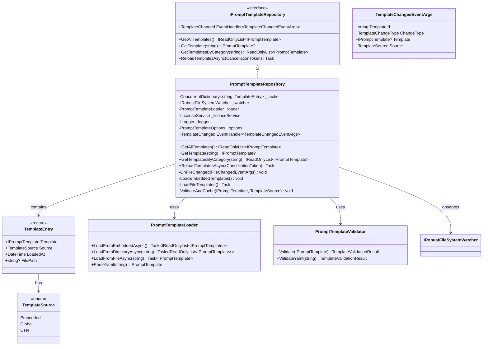

# LCS-DES-063c: Design Specification — Template Repository

## 1. Metadata & Categorization

| Field           | Value                                     |
| :-------------- | :---------------------------------------- |
| **Document ID** | LCS-DES-063c                              |
| **Version**     | v0.6.3c                                   |
| **Status**      | Draft                                     |
| **Category**    | Implementation                            |
| **Module**      | Lexichord.Modules.Agents                  |
| **Created**     | 2026-01-27                                |
| **Author**      | Documentation Agent                       |
| **Parent**      | [LCS-DES-063-INDEX](LCS-DES-063-INDEX.md) |

---

## 2. Executive Summary

### 2.1 The Requirement

Implement `IPromptTemplateRepository` to manage prompt template storage and retrieval. The repository must:

- Load built-in templates from embedded resources (always available)
- Load user-defined templates from `{workspace}/.lexichord/prompts/`
- Load global templates from `{AppData}/Lexichord/prompts/`
- Support hot-reload for user templates (file change detection)
- Implement template priority/override (user > global > built-in)
- Cache templates for efficient repeated access
- Parse YAML template definitions with validation
- Fire events when templates change for UI updates

### 2.2 The Solution

Implement `PromptTemplateRepository` with a tiered loading strategy:

1. **Embedded resources**: Ship 5+ built-in templates covering common use cases
2. **File system loading**: YAML parsing via `YamlDotNet`
3. **Hot-reload**: Leverage existing `IRobustFileSystemWatcher` (v0.1.2b)
4. **Caching**: Thread-safe `ConcurrentDictionary` with event-driven invalidation

### 2.3 License Gating

| Feature                 | License Tier | Rationale           |
| :---------------------- | :----------- | :------------------ |
| Built-in templates      | Free         | Core functionality  |
| Custom template loading | WriterPro+   | Power user feature  |
| Hot-reload              | Teams+       | Enterprise workflow |
| Template export/import  | WriterPro+   | Portability feature |

---

## 3. Architecture

### 3.1 Component Placement

```text
Lexichord.Modules.Agents/
├── Templates/
│   ├── IPromptTemplateRepository.cs     # Interface (in Abstractions)
│   ├── PromptTemplateRepository.cs      # Main implementation
│   ├── PromptTemplateLoader.cs          # File/embedded loading logic
│   ├── PromptTemplateValidator.cs       # YAML validation
│   ├── TemplateChangedEventArgs.cs      # Event args
│   └── PromptTemplateOptions.cs         # Configuration
└── Resources/
    └── Prompts/
        ├── co-pilot-editor.yaml
        ├── document-reviewer.yaml
        ├── summarizer.yaml
        ├── style-checker.yaml
        └── translator.yaml
```

### 3.2 Class Diagram



### 3.3 Loading Priority Diagram

```mermaid
graph TB
    subgraph "Template Loading Order"
        E[Embedded Resources<br/>Priority: 1 Lowest]
        G[Global Templates<br/>{AppData}/Lexichord/prompts/<br/>Priority: 2]
        U[User Templates<br/>{Workspace}/.lexichord/prompts/<br/>Priority: 3 Highest]
    end

    subgraph "Resolution"
        C{Same TemplateId?}
        W[Higher Priority Wins]
        M[Merged into Cache]
    end

    E --> C
    G --> C
    U --> C
    C -->|Yes| W
    C -->|No| M
    W --> M

    style U fill:#4a9eff,color:#fff
    style G fill:#6b7280,color:#fff
    style E fill:#374151,color:#fff
```

---

## 4. Data Contract (The API)

### 4.1 IPromptTemplateRepository Interface

```csharp
namespace Lexichord.Abstractions.Contracts;

/// <summary>
/// Repository for prompt template storage and retrieval.
/// Supports multiple sources: embedded, global, and user-defined templates.
/// </summary>
/// <remarks>
/// Templates are loaded from multiple sources with the following priority:
/// 1. User templates ({workspace}/.lexichord/prompts/) - highest
/// 2. Global templates ({AppData}/Lexichord/prompts/)
/// 3. Embedded templates (built-in) - lowest
///
/// When templates share the same ID, higher priority sources override lower.
/// </remarks>
public interface IPromptTemplateRepository
{
    /// <summary>
    /// Gets all available templates from all sources.
    /// </summary>
    /// <returns>Read-only list of all cached templates.</returns>
    /// <remarks>
    /// Templates with the same ID are unified by priority.
    /// Only one template per ID is returned (the highest priority version).
    /// </remarks>
    IReadOnlyList<IPromptTemplate> GetAllTemplates();

    /// <summary>
    /// Gets a specific template by ID.
    /// </summary>
    /// <param name="templateId">The unique template identifier.</param>
    /// <returns>The template if found; null otherwise.</returns>
    IPromptTemplate? GetTemplate(string templateId);

    /// <summary>
    /// Gets templates in a specific category.
    /// </summary>
    /// <param name="category">Category name (e.g., "writing", "review").</param>
    /// <returns>Templates matching the category.</returns>
    IReadOnlyList<IPromptTemplate> GetTemplatesByCategory(string category);

    /// <summary>
    /// Finds templates matching a search query.
    /// </summary>
    /// <param name="query">Search query for name/description.</param>
    /// <returns>Matching templates ordered by relevance.</returns>
    IReadOnlyList<IPromptTemplate> SearchTemplates(string query);

    /// <summary>
    /// Forces a reload of all templates from all sources.
    /// </summary>
    /// <param name="ct">Cancellation token.</param>
    /// <returns>Task completing when reload is done.</returns>
    /// <remarks>
    /// Clears the cache and reloads all templates.
    /// Fires TemplateChanged events for any changes detected.
    /// </remarks>
    Task ReloadTemplatesAsync(CancellationToken ct = default);

    /// <summary>
    /// Event fired when any template changes (add/update/remove).
    /// </summary>
    event EventHandler<TemplateChangedEventArgs>? TemplateChanged;

    /// <summary>
    /// Gets metadata about a template's source and status.
    /// </summary>
    /// <param name="templateId">The template to query.</param>
    /// <returns>Template metadata if found.</returns>
    TemplateInfo? GetTemplateInfo(string templateId);
}
```

### 4.2 PromptTemplateRepository Implementation

```csharp
namespace Lexichord.Modules.Agents.Templates;

/// <summary>
/// Repository for loading, caching, and hot-reloading prompt templates.
/// </summary>
/// <remarks>
/// Thread-safe implementation using ConcurrentDictionary.
/// Integrates with ILicenseService for feature gating.
/// Uses IRobustFileSystemWatcher (v0.1.2b) for hot-reload.
/// </remarks>
public sealed class PromptTemplateRepository : IPromptTemplateRepository, IDisposable
{
    private readonly ConcurrentDictionary<string, TemplateEntry> _cache = new(StringComparer.OrdinalIgnoreCase);
    private readonly IRobustFileSystemWatcher _watcher;
    private readonly PromptTemplateLoader _loader;
    private readonly ILicenseService _licenseService;
    private readonly ILogger<PromptTemplateRepository> _logger;
    private readonly PromptTemplateOptions _options;
    private readonly SemaphoreSlim _reloadLock = new(1, 1);
    private bool _disposed;

    public event EventHandler<TemplateChangedEventArgs>? TemplateChanged;

    public PromptTemplateRepository(
        IRobustFileSystemWatcher watcher,
        ILicenseService licenseService,
        IOptions<PromptTemplateOptions> options,
        ILogger<PromptTemplateRepository> logger)
    {
        _watcher = watcher ?? throw new ArgumentNullException(nameof(watcher));
        _licenseService = licenseService ?? throw new ArgumentNullException(nameof(licenseService));
        _options = options?.Value ?? PromptTemplateOptions.Default;
        _logger = logger ?? throw new ArgumentNullException(nameof(logger));
        _loader = new PromptTemplateLoader(logger);

        _logger.LogDebug(
            "PromptTemplateRepository initializing. " +
            "EmbeddedEnabled={Embedded}, UserPath={UserPath}, HotReload={HotReload}",
            _options.BuiltInEnabled,
            _options.UserTemplatesPath,
            _options.HotReloadEnabled);

        // Initial load on construction
        InitializeAsync().ConfigureAwait(false).GetAwaiter().GetResult();
    }

    private async Task InitializeAsync()
    {
        // Always load embedded templates
        if (_options.BuiltInEnabled)
        {
            await LoadEmbeddedTemplatesAsync();
        }

        // Load file-system templates if licensed
        if (_licenseService.HasFeature(Features.CustomTemplates))
        {
            await LoadFileTemplatesAsync();
            SetupFileWatcher();
        }
        else
        {
            _logger.LogInformation(
                "Custom template loading not available with current license. " +
                "Using built-in templates only.");
        }

        _logger.LogInformation(
            "Template repository initialized with {Count} templates",
            _cache.Count);
    }

    /// <inheritdoc />
    public IReadOnlyList<IPromptTemplate> GetAllTemplates()
    {
        return _cache.Values
            .Select(e => e.Template)
            .OrderBy(t => t.Name)
            .ToList()
            .AsReadOnly();
    }

    /// <inheritdoc />
    public IPromptTemplate? GetTemplate(string templateId)
    {
        ArgumentNullException.ThrowIfNull(templateId);

        if (_cache.TryGetValue(templateId, out var entry))
        {
            _logger.LogDebug(
                "Template retrieved: {TemplateId} from {Source}",
                templateId, entry.Source);
            return entry.Template;
        }

        _logger.LogDebug("Template not found: {TemplateId}", templateId);
        return null;
    }

    /// <inheritdoc />
    public IReadOnlyList<IPromptTemplate> GetTemplatesByCategory(string category)
    {
        ArgumentNullException.ThrowIfNull(category);

        return _cache.Values
            .Where(e => e.Template is PromptTemplateExtended ext &&
                        ext.Category.Equals(category, StringComparison.OrdinalIgnoreCase))
            .Select(e => e.Template)
            .ToList()
            .AsReadOnly();
    }

    /// <inheritdoc />
    public IReadOnlyList<IPromptTemplate> SearchTemplates(string query)
    {
        if (string.IsNullOrWhiteSpace(query))
            return GetAllTemplates();

        var queryLower = query.ToLowerInvariant();

        return _cache.Values
            .Where(e =>
                e.Template.Name.Contains(query, StringComparison.OrdinalIgnoreCase) ||
                e.Template.Description.Contains(query, StringComparison.OrdinalIgnoreCase) ||
                e.Template.TemplateId.Contains(query, StringComparison.OrdinalIgnoreCase))
            .Select(e => e.Template)
            .OrderByDescending(t =>
                t.Name.StartsWith(query, StringComparison.OrdinalIgnoreCase) ? 2 :
                t.Name.Contains(query, StringComparison.OrdinalIgnoreCase) ? 1 : 0)
            .ToList()
            .AsReadOnly();
    }

    /// <inheritdoc />
    public async Task ReloadTemplatesAsync(CancellationToken ct = default)
    {
        await _reloadLock.WaitAsync(ct);
        try
        {
            _logger.LogInformation("Reloading all templates");
            var previousCount = _cache.Count;

            _cache.Clear();

            if (_options.BuiltInEnabled)
            {
                await LoadEmbeddedTemplatesAsync();
            }

            if (_licenseService.HasFeature(Features.CustomTemplates))
            {
                await LoadFileTemplatesAsync();
            }

            _logger.LogInformation(
                "Template reload complete. Previous: {Previous}, Current: {Current}",
                previousCount, _cache.Count);
        }
        finally
        {
            _reloadLock.Release();
        }
    }

    /// <inheritdoc />
    public TemplateInfo? GetTemplateInfo(string templateId)
    {
        if (_cache.TryGetValue(templateId, out var entry))
        {
            return new TemplateInfo(
                TemplateId: entry.Template.TemplateId,
                Source: entry.Source,
                FilePath: entry.FilePath,
                LoadedAt: entry.LoadedAt,
                VariableCount: entry.Template.RequiredVariables.Count +
                               entry.Template.OptionalVariables.Count);
        }
        return null;
    }

    #region Loading Logic

    private async Task LoadEmbeddedTemplatesAsync()
    {
        _logger.LogDebug("Loading embedded templates");

        var templates = await _loader.LoadFromEmbeddedAsync();

        foreach (var template in templates)
        {
            CacheTemplate(template, TemplateSource.Embedded, null);
        }

        _logger.LogDebug("Loaded {Count} embedded templates", templates.Count);
    }

    private async Task LoadFileTemplatesAsync()
    {
        // Load global templates first (lower priority)
        if (Directory.Exists(_options.GlobalTemplatesPath))
        {
            _logger.LogDebug("Loading global templates from {Path}", _options.GlobalTemplatesPath);
            var globalTemplates = await _loader.LoadFromDirectoryAsync(_options.GlobalTemplatesPath);

            foreach (var template in globalTemplates)
            {
                CacheTemplate(template.Template, TemplateSource.Global, template.FilePath);
            }
        }

        // Load user templates (higher priority - overwrites)
        var userPath = ResolveUserPath();
        if (Directory.Exists(userPath))
        {
            _logger.LogDebug("Loading user templates from {Path}", userPath);
            var userTemplates = await _loader.LoadFromDirectoryAsync(userPath);

            foreach (var template in userTemplates)
            {
                CacheTemplate(template.Template, TemplateSource.User, template.FilePath);
            }
        }
    }

    private void CacheTemplate(IPromptTemplate template, TemplateSource source, string? filePath)
    {
        var entry = new TemplateEntry(template, source, DateTime.UtcNow, filePath);

        var added = _cache.AddOrUpdate(
            template.TemplateId,
            entry,
            (key, existing) =>
            {
                // Higher priority source overwrites
                if (source >= existing.Source)
                {
                    _logger.LogDebug(
                        "Template {TemplateId} overridden: {OldSource} -> {NewSource}",
                        key, existing.Source, source);
                    return entry;
                }
                return existing;
            });

        _logger.LogTrace(
            "Cached template: {TemplateId} from {Source}",
            template.TemplateId, source);
    }

    private string ResolveUserPath()
    {
        // If relative path, resolve against workspace root
        var path = _options.UserTemplatesPath;
        if (!Path.IsPathRooted(path))
        {
            // Get workspace root from some service
            path = Path.Combine(Environment.CurrentDirectory, path);
        }
        return path;
    }

    #endregion

    #region Hot Reload

    private void SetupFileWatcher()
    {
        if (!_options.HotReloadEnabled)
        {
            _logger.LogDebug("Hot-reload disabled by configuration");
            return;
        }

        if (!_licenseService.HasFeature(Features.HotReload))
        {
            _logger.LogDebug("Hot-reload not available with current license");
            return;
        }

        var userPath = ResolveUserPath();
        if (Directory.Exists(userPath))
        {
            _watcher.FileChanged += OnFileChanged;
            _watcher.Watch(userPath, "*.yaml", "*.yml");

            _logger.LogInformation(
                "Hot-reload enabled for: {Path}",
                userPath);
        }
    }

    private async void OnFileChanged(object? sender, FileChangedEventArgs e)
    {
        // Debounce rapid changes
        await Task.Delay(_options.HotReloadDebounceMs);

        try
        {
            _logger.LogDebug("File change detected: {Path} ({ChangeType})", e.FullPath, e.ChangeType);

            switch (e.ChangeType)
            {
                case WatcherChangeTypes.Created:
                case WatcherChangeTypes.Changed:
                    await HandleTemplateFileChangedAsync(e.FullPath);
                    break;

                case WatcherChangeTypes.Deleted:
                    HandleTemplateFileDeleted(e.FullPath);
                    break;

                case WatcherChangeTypes.Renamed:
                    // Handle as delete + create
                    if (e is RenamedEventArgs renamed)
                    {
                        HandleTemplateFileDeleted(renamed.OldFullPath);
                        await HandleTemplateFileChangedAsync(renamed.FullPath);
                    }
                    break;
            }
        }
        catch (Exception ex)
        {
            _logger.LogWarning(ex, "Hot-reload failed for: {Path}", e.FullPath);
        }
    }

    private async Task HandleTemplateFileChangedAsync(string filePath)
    {
        try
        {
            var result = await _loader.LoadFromFileAsync(filePath);

            if (result.Success)
            {
                var isUpdate = _cache.ContainsKey(result.Template!.TemplateId);
                CacheTemplate(result.Template, TemplateSource.User, filePath);

                OnTemplateChanged(new TemplateChangedEventArgs
                {
                    TemplateId = result.Template.TemplateId,
                    ChangeType = isUpdate ? TemplateChangeType.Updated : TemplateChangeType.Added,
                    Template = result.Template,
                    Source = TemplateSource.User
                });

                _logger.LogInformation(
                    "Template hot-reloaded: {TemplateId} ({ChangeType})",
                    result.Template.TemplateId,
                    isUpdate ? "updated" : "added");
            }
            else
            {
                _logger.LogWarning(
                    "Template validation failed for {Path}: {Error}",
                    filePath, result.Error);
            }
        }
        catch (Exception ex)
        {
            _logger.LogWarning(ex, "Failed to hot-reload template: {Path}", filePath);
        }
    }

    private void HandleTemplateFileDeleted(string filePath)
    {
        // Find template that came from this file
        var entry = _cache.Values.FirstOrDefault(e => e.FilePath == filePath);
        if (entry != null)
        {
            // Check if there's a lower-priority version to restore
            var templateId = entry.Template.TemplateId;

            if (_cache.TryRemove(templateId, out _))
            {
                OnTemplateChanged(new TemplateChangedEventArgs
                {
                    TemplateId = templateId,
                    ChangeType = TemplateChangeType.Removed,
                    Template = null,
                    Source = entry.Source
                });

                _logger.LogInformation("Template removed: {TemplateId}", templateId);
            }
        }
    }

    private void OnTemplateChanged(TemplateChangedEventArgs args)
    {
        TemplateChanged?.Invoke(this, args);
    }

    #endregion

    #region IDisposable

    public void Dispose()
    {
        if (_disposed) return;

        _watcher.FileChanged -= OnFileChanged;
        _reloadLock.Dispose();
        _disposed = true;

        _logger.LogDebug("PromptTemplateRepository disposed");
    }

    #endregion
}
```

### 4.3 Supporting Types

```csharp
namespace Lexichord.Modules.Agents.Templates;

/// <summary>
/// Cache entry for a loaded template.
/// </summary>
/// <param name="Template">The loaded template.</param>
/// <param name="Source">Where the template came from.</param>
/// <param name="LoadedAt">When the template was loaded.</param>
/// <param name="FilePath">File path if loaded from disk.</param>
public record TemplateEntry(
    IPromptTemplate Template,
    TemplateSource Source,
    DateTime LoadedAt,
    string? FilePath
);

/// <summary>
/// Template source for priority resolution.
/// Higher values have higher priority.
/// </summary>
public enum TemplateSource
{
    Embedded = 0,
    Global = 1,
    User = 2
}

/// <summary>
/// Type of template change for events.
/// </summary>
public enum TemplateChangeType
{
    Added,
    Updated,
    Removed
}

/// <summary>
/// Event arguments for template changes.
/// </summary>
public class TemplateChangedEventArgs : EventArgs
{
    public required string TemplateId { get; init; }
    public required TemplateChangeType ChangeType { get; init; }
    public IPromptTemplate? Template { get; init; }
    public required TemplateSource Source { get; init; }
}

/// <summary>
/// Information about a cached template.
/// </summary>
/// <param name="TemplateId">Template identifier.</param>
/// <param name="Source">Where the template came from.</param>
/// <param name="FilePath">File path if applicable.</param>
/// <param name="LoadedAt">When the template was loaded.</param>
/// <param name="VariableCount">Total variable count.</param>
public record TemplateInfo(
    string TemplateId,
    TemplateSource Source,
    string? FilePath,
    DateTime LoadedAt,
    int VariableCount
);
```

---

## 5. YAML Template Format

### 5.1 Full Schema

```yaml
# Template metadata (required)
template_id: "unique-kebab-case-id"
name: "Human-Readable Template Name"
description: "Description of what this template does"

# Optional categorization
category: "writing"
tags:
    - writing
    - review
    - technical

# Prompt templates (required)
system_prompt: |
    Multi-line system prompt with Mustache variables.

    {{#style_rules}}
    Style guidelines:
    {{style_rules}}
    {{/style_rules}}

user_prompt: "{{user_input}}"

# Variable declarations (required)
required_variables:
    - user_input

optional_variables:
    - style_rules
    - context
    - document_path

# Optional variable metadata
variable_metadata:
    user_input:
        description: "The user's input text"
    style_rules:
        description: "Active style rules to follow"
        default: "" # Explicit default for optional
    context:
        description: "RAG-retrieved context chunks"
```

### 5.2 YAML DTO Classes

```csharp
namespace Lexichord.Modules.Agents.Templates;

using YamlDotNet.Serialization;

/// <summary>
/// YAML deserialization target for prompt templates.
/// </summary>
internal class PromptTemplateYaml
{
    [YamlMember(Alias = "template_id")]
    public string TemplateId { get; set; } = string.Empty;

    [YamlMember(Alias = "name")]
    public string Name { get; set; } = string.Empty;

    [YamlMember(Alias = "description")]
    public string Description { get; set; } = string.Empty;

    [YamlMember(Alias = "category")]
    public string? Category { get; set; }

    [YamlMember(Alias = "tags")]
    public List<string>? Tags { get; set; }

    [YamlMember(Alias = "system_prompt")]
    public string SystemPrompt { get; set; } = string.Empty;

    [YamlMember(Alias = "user_prompt")]
    public string UserPrompt { get; set; } = string.Empty;

    [YamlMember(Alias = "required_variables")]
    public List<string> RequiredVariables { get; set; } = [];

    [YamlMember(Alias = "optional_variables")]
    public List<string>? OptionalVariables { get; set; }

    [YamlMember(Alias = "variable_metadata")]
    public Dictionary<string, VariableMetadataYaml>? VariableMetadata { get; set; }

    /// <summary>
    /// Converts to domain PromptTemplate record.
    /// </summary>
    public PromptTemplate ToPromptTemplate()
    {
        return new PromptTemplate(
            TemplateId: TemplateId,
            Name: Name,
            Description: Description ?? string.Empty,
            SystemPromptTemplate: SystemPrompt,
            UserPromptTemplate: UserPrompt,
            RequiredVariables: RequiredVariables.AsReadOnly(),
            OptionalVariables: (OptionalVariables ?? []).AsReadOnly()
        );
    }

    /// <summary>
    /// Converts to extended domain type with metadata.
    /// </summary>
    public PromptTemplateExtended ToPromptTemplateExtended()
    {
        return new PromptTemplateExtended(
            ToPromptTemplate(),
            Category: Category ?? "general",
            Tags: (Tags ?? []).AsReadOnly(),
            VariableMetadata: BuildVariableMetadata()
        );
    }

    private IReadOnlyDictionary<string, TemplateVariable> BuildVariableMetadata()
    {
        var result = new Dictionary<string, TemplateVariable>();

        foreach (var req in RequiredVariables)
        {
            var meta = VariableMetadata?.GetValueOrDefault(req);
            result[req] = TemplateVariable.Required(req, meta?.Description);
        }

        foreach (var opt in OptionalVariables ?? [])
        {
            var meta = VariableMetadata?.GetValueOrDefault(opt);
            result[opt] = TemplateVariable.Optional(opt, meta?.Description, meta?.Default);
        }

        return result.AsReadOnly();
    }
}

internal class VariableMetadataYaml
{
    [YamlMember(Alias = "description")]
    public string? Description { get; set; }

    [YamlMember(Alias = "default")]
    public string? Default { get; set; }
}
```

---

## 6. Built-in Templates

### 6.1 Embedded Templates List

| Template ID         | Name              | Category | Required Vars             | Optional Vars                  |
| :------------------ | :---------------- | :------- | :------------------------ | :----------------------------- |
| `co-pilot-editor`   | Co-pilot Editor   | writing  | `user_input`              | `style_rules`, `context`       |
| `document-reviewer` | Document Reviewer | review   | `document_content`        | `style_rules`, `instructions`  |
| `summarizer`        | Summarizer        | writing  | `content`                 | `max_length`, `format`         |
| `style-checker`     | Style Checker     | review   | `text`                    | `style_rules`                  |
| `translator`        | Translator        | writing  | `text`, `target_language` | `source_language`, `formality` |

### 6.2 Example: co-pilot-editor.yaml

```yaml
template_id: "co-pilot-editor"
name: "Co-pilot Editor"
description: "General-purpose writing assistant for editing and composition"
category: "writing"
tags:
    - editing
    - writing
    - general

system_prompt: |
    You are a skilled writing assistant integrated into Lexichord.
    Your role is to help users improve their writing with clear, 
    constructive suggestions.

    {{#style_rules}}
    STYLE GUIDELINES:
    Follow these style rules strictly:
    {{style_rules}}
    {{/style_rules}}

    {{#context}}
    REFERENCE CONTEXT:
    Use this context to inform your response:
    {{context}}
    {{/context}}

    {{^style_rules}}
    {{^context}}
    Use your best judgment for style and tone.
    {{/context}}
    {{/style_rules}}

    Guidelines:
    - Be specific in your suggestions
    - Explain the reasoning behind changes
    - Preserve the author's voice and intent
    - Focus on clarity and readability

user_prompt: "{{user_input}}"

required_variables:
    - user_input

optional_variables:
    - style_rules
    - context

variable_metadata:
    user_input:
        description: "The user's request or text to work with"
    style_rules:
        description: "Active style rules from the project"
    context:
        description: "RAG-retrieved relevant context"
```

### 6.3 Example: document-reviewer.yaml

```yaml
template_id: "document-reviewer"
name: "Document Reviewer"
description: "Reviews documents for clarity, structure, and style"
category: "review"
tags:
    - review
    - editing
    - feedback

system_prompt: |
    You are a document reviewer for technical and professional writing.

    Provide a structured review covering:
    1. **Clarity**: Is the message clear and easy to understand?
    2. **Structure**: Is the document well-organized?
    3. **Style**: Does the writing follow best practices?
    4. **Accuracy**: Are there any factual concerns?

    {{#style_rules}}
    STYLE GUIDELINES TO CHECK:
    {{style_rules}}
    {{/style_rules}}

    {{#instructions}}
    ADDITIONAL INSTRUCTIONS:
    {{instructions}}
    {{/instructions}}

    Format your review as:
    - Summary (2-3 sentences)
    - Strengths (bullet points)
    - Suggestions (numbered list with specific changes)
    - Priority fixes (top 3 most impactful changes)

user_prompt: |
    Please review this document:

    ---
    {{document_content}}
    ---

required_variables:
    - document_content

optional_variables:
    - style_rules
    - instructions

variable_metadata:
    document_content:
        description: "The full document text to review"
    style_rules:
        description: "Style guidelines to check against"
    instructions:
        description: "Additional review instructions"
```

---

## 7. Configuration

### 7.1 PromptTemplateOptions

```csharp
namespace Lexichord.Modules.Agents.Templates;

/// <summary>
/// Configuration options for the template repository.
/// </summary>
public record PromptTemplateOptions(
    bool BuiltInEnabled = true,
    string UserTemplatesPath = ".lexichord/prompts",
    string GlobalTemplatesPath = "",
    bool HotReloadEnabled = true,
    int HotReloadDebounceMs = 300,
    int CacheMaxSize = 100,
    bool ValidateOnLoad = true,
    bool LogTemplateContent = false
)
{
    /// <summary>
    /// Default configuration.
    /// </summary>
    public static PromptTemplateOptions Default { get; } = new()
    {
        GlobalTemplatesPath = GetDefaultGlobalPath()
    };

    private static string GetDefaultGlobalPath()
    {
        var appData = Environment.GetFolderPath(
            Environment.SpecialFolder.ApplicationData);
        return Path.Combine(appData, "Lexichord", "prompts");
    }

    /// <summary>
    /// Validates the configuration options.
    /// </summary>
    public void Validate()
    {
        if (HotReloadDebounceMs < 0 || HotReloadDebounceMs > 10000)
            throw new ArgumentOutOfRangeException(nameof(HotReloadDebounceMs));
        if (CacheMaxSize < 1 || CacheMaxSize > 10000)
            throw new ArgumentOutOfRangeException(nameof(CacheMaxSize));
    }
}
```

### 7.2 AppSettings Configuration

```json
{
    "Lexichord": {
        "Templates": {
            "BuiltInEnabled": true,
            "UserTemplatesPath": ".lexichord/prompts",
            "GlobalTemplatesPath": "",
            "HotReloadEnabled": true,
            "HotReloadDebounceMs": 300,
            "CacheMaxSize": 100
        }
    }
}
```

---

## 8. NuGet Dependencies

### 8.1 Package References

```xml
<ItemGroup>
    <PackageReference Include="YamlDotNet" Version="15.1.4" />
</ItemGroup>
```

### 8.2 Package Details

| Package      | Version | License | Purpose                         |
| :----------- | :------ | :------ | :------------------------------ |
| `YamlDotNet` | 15.1.x  | MIT     | YAML parsing for template files |

---

## 9. Testing Strategy

### 9.1 Test Categories

| Category             | Purpose                  | Count |
| :------------------- | :----------------------- | :---- |
| **Repository basic** | Get, GetAll, Search      | 6     |
| **Loading**          | Embedded, file, priority | 8     |
| **Hot-reload**       | Change detection, events | 5     |
| **YAML parsing**     | Valid/invalid templates  | 6     |
| **License gating**   | Feature restrictions     | 4     |

### 9.2 Unit Tests

```csharp
[Trait("Category", "Unit")]
[Trait("Version", "v0.6.3c")]
public class PromptTemplateRepositoryTests
{
    private readonly Mock<IRobustFileSystemWatcher> _watcherMock;
    private readonly Mock<ILicenseService> _licenseMock;
    private readonly ILogger<PromptTemplateRepository> _logger;

    public PromptTemplateRepositoryTests()
    {
        _watcherMock = new Mock<IRobustFileSystemWatcher>();
        _licenseMock = new Mock<ILicenseService>();
        _logger = NullLogger<PromptTemplateRepository>.Instance;

        // Default: all features licensed
        _licenseMock.Setup(l => l.HasFeature(It.IsAny<string>())).Returns(true);
    }

    #region GetAllTemplates Tests

    [Fact]
    public void GetAllTemplates_ReturnsBuiltInTemplates()
    {
        var repo = CreateRepository();

        var templates = repo.GetAllTemplates();

        templates.Should().NotBeEmpty();
        templates.Should().Contain(t => t.TemplateId == "co-pilot-editor");
    }

    [Fact]
    public void GetAllTemplates_OrdersByName()
    {
        var repo = CreateRepository();

        var templates = repo.GetAllTemplates();

        templates.Select(t => t.Name).Should().BeInAscendingOrder();
    }

    #endregion

    #region GetTemplate Tests

    [Fact]
    public void GetTemplate_WithValidId_ReturnsTemplate()
    {
        var repo = CreateRepository();

        var template = repo.GetTemplate("co-pilot-editor");

        template.Should().NotBeNull();
        template!.Name.Should().Be("Co-pilot Editor");
    }

    [Fact]
    public void GetTemplate_WithInvalidId_ReturnsNull()
    {
        var repo = CreateRepository();

        var template = repo.GetTemplate("non-existent-template");

        template.Should().BeNull();
    }

    [Fact]
    public void GetTemplate_IsCaseInsensitive()
    {
        var repo = CreateRepository();

        var template1 = repo.GetTemplate("co-pilot-editor");
        var template2 = repo.GetTemplate("CO-PILOT-EDITOR");
        var template3 = repo.GetTemplate("Co-Pilot-Editor");

        template1.Should().NotBeNull();
        template2.Should().NotBeNull();
        template3.Should().NotBeNull();
        template1!.TemplateId.Should().Be(template2!.TemplateId);
    }

    #endregion

    #region SearchTemplates Tests

    [Fact]
    public void SearchTemplates_MatchesName()
    {
        var repo = CreateRepository();

        var results = repo.SearchTemplates("editor");

        results.Should().Contain(t => t.TemplateId == "co-pilot-editor");
    }

    [Fact]
    public void SearchTemplates_MatchesDescription()
    {
        var repo = CreateRepository();

        var results = repo.SearchTemplates("writing");

        results.Should().NotBeEmpty();
    }

    [Fact]
    public void SearchTemplates_EmptyQuery_ReturnsAll()
    {
        var repo = CreateRepository();

        var all = repo.GetAllTemplates();
        var search = repo.SearchTemplates("");

        search.Should().HaveCount(all.Count);
    }

    #endregion

    #region Priority Tests

    [Fact]
    public async Task LoadTemplates_UserOverridesGlobal()
    {
        // Arrange
        var options = CreateOptions(withUserPath: true);

        // Create mock user template with same ID as built-in
        SetupUserTemplate("co-pilot-editor", "Custom Co-pilot");

        var repo = CreateRepository(options);

        // Act
        var template = repo.GetTemplate("co-pilot-editor");

        // Assert
        template!.Name.Should().Be("Custom Co-pilot"); // User version wins
    }

    [Fact]
    public void GetTemplateInfo_ReturnsSource()
    {
        var repo = CreateRepository();

        var info = repo.GetTemplateInfo("co-pilot-editor");

        info.Should().NotBeNull();
        info!.Source.Should().Be(TemplateSource.Embedded);
    }

    #endregion

    #region Hot Reload Tests

    [Fact]
    public async Task FileChanged_TriggersTemplateReload()
    {
        // Arrange
        var repo = CreateRepository();
        TemplateChangedEventArgs? eventArgs = null;
        repo.TemplateChanged += (s, e) => eventArgs = e;

        // Act
        SimulateFileChange("test-template.yaml", WatcherChangeTypes.Created);
        await Task.Delay(500); // Wait for debounce

        // Assert
        eventArgs.Should().NotBeNull();
        eventArgs!.ChangeType.Should().Be(TemplateChangeType.Added);
    }

    [Fact]
    public async Task FileDeleted_TriggersTemplateRemoval()
    {
        // Arrange
        var repo = CreateRepository(withUserTemplate: true);
        TemplateChangedEventArgs? eventArgs = null;
        repo.TemplateChanged += (s, e) => eventArgs = e;

        // Act
        SimulateFileChange("user-template.yaml", WatcherChangeTypes.Deleted);
        await Task.Delay(500);

        // Assert
        eventArgs.Should().NotBeNull();
        eventArgs!.ChangeType.Should().Be(TemplateChangeType.Removed);
    }

    #endregion

    #region License Gating Tests

    [Fact]
    public void WithoutLicense_OnlyBuiltInTemplatesAvailable()
    {
        _licenseMock.Setup(l => l.HasFeature(Features.CustomTemplates)).Returns(false);

        var repo = CreateRepository();

        var templates = repo.GetAllTemplates();
        var info = repo.GetTemplateInfo("co-pilot-editor");

        templates.Should().OnlyContain(t =>
            repo.GetTemplateInfo(t.TemplateId)!.Source == TemplateSource.Embedded);
    }

    [Fact]
    public void WithoutHotReloadLicense_FileWatcherNotSetup()
    {
        _licenseMock.Setup(l => l.HasFeature(Features.HotReload)).Returns(false);

        var repo = CreateRepository();

        _watcherMock.Verify(w => w.Watch(It.IsAny<string>(), It.IsAny<string[]>()), Times.Never);
    }

    #endregion

    #region Helper Methods

    private PromptTemplateRepository CreateRepository(
        PromptTemplateOptions? options = null,
        bool withUserTemplate = false)
    {
        options ??= CreateOptions();
        return new PromptTemplateRepository(
            _watcherMock.Object,
            _licenseMock.Object,
            Options.Create(options),
            _logger);
    }

    private PromptTemplateOptions CreateOptions(bool withUserPath = false)
    {
        var options = PromptTemplateOptions.Default;
        if (withUserPath)
        {
            options = options with { UserTemplatesPath = _testUserPath };
        }
        return options;
    }

    #endregion
}
```

---

## 10. Acceptance Criteria

### 10.1 Functional Criteria

| ID    | Criterion                                       | Verification     |
| :---- | :---------------------------------------------- | :--------------- |
| AC-01 | Built-in templates load from embedded resources | Unit test        |
| AC-02 | User templates load from `.lexichord/prompts/`  | Integration test |
| AC-03 | Global templates load from AppData path         | Integration test |
| AC-04 | User templates override built-in with same ID   | Unit test        |
| AC-05 | `GetTemplate` returns null for unknown ID       | Unit test        |
| AC-06 | `SearchTemplates` matches name and description  | Unit test        |
| AC-07 | Hot-reload detects file changes within 1 second | Integration test |
| AC-08 | `TemplateChanged` event fires on hot-reload     | Unit test        |
| AC-09 | Invalid YAML files are logged, not loaded       | Unit test        |
| AC-10 | License gating restricts custom templates       | Unit test        |

### 10.2 Non-Functional Criteria

| ID    | Criterion                               | Target              |
| :---- | :-------------------------------------- | :------------------ |
| NF-01 | Repository initialization < 100ms       | Benchmark           |
| NF-02 | Template retrieval < 1ms                | Benchmark           |
| NF-03 | Thread-safe for concurrent access       | Design review       |
| NF-04 | Supports up to 100 cached templates     | Integration test    |
| NF-05 | Graceful handling of file system errors | Error handling test |

---

## 11. Implementation Checklist

- [ ] Add `YamlDotNet` NuGet package to `Agents.csproj`
- [ ] Create `IPromptTemplateRepository.cs` in Abstractions
- [ ] Create `PromptTemplateRepository.cs` in `Templates/`
- [ ] Create `PromptTemplateLoader.cs` in `Templates/`
- [ ] Create `PromptTemplateValidator.cs` in `Templates/`
- [ ] Create `PromptTemplateOptions.cs` in `Templates/`
- [ ] Create embedded `.yaml` templates in `Resources/Prompts/`
- [ ] Set template files as EmbeddedResource in `.csproj`
- [ ] Add XML documentation to all public members
- [ ] Create `PromptTemplateRepositoryTests.cs` with 25+ tests
- [ ] Create YAML parsing tests
- [ ] Create hot-reload integration tests
- [ ] Verify all tests pass
- [ ] Verify build succeeds
- [ ] Update DEPENDENCY-MATRIX.md with YamlDotNet

---

## 12. DI Registration

```csharp
public static class AgentsServiceCollectionExtensions
{
    public static IServiceCollection AddTemplateRepository(
        this IServiceCollection services,
        Action<PromptTemplateOptions>? configure = null)
    {
        services.Configure<PromptTemplateOptions>(options =>
        {
            var defaults = PromptTemplateOptions.Default;
            configure?.Invoke(defaults);
            options = defaults;
        });

        services.AddSingleton<IPromptTemplateRepository, PromptTemplateRepository>();

        return services;
    }
}
```

---

## 13. Version History

| Version | Date       | Author              | Changes       |
| :------ | :--------- | :------------------ | :------------ |
| 0.1     | 2026-01-27 | Documentation Agent | Initial draft |
