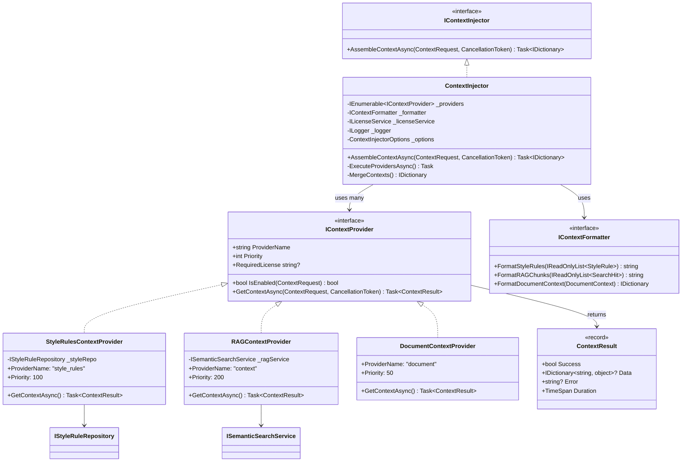
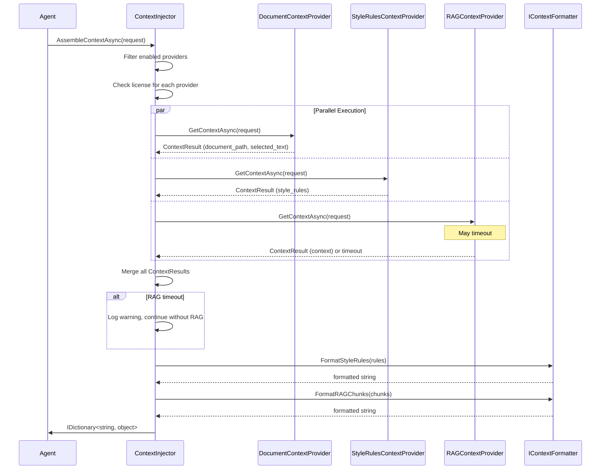

# LCS-DES-063d: Design Specification — Context Injection Service

## 1. Metadata & Categorization

| Field           | Value                                     |
| :-------------- | :---------------------------------------- |
| **Document ID** | LCS-DES-063d                              |
| **Version**     | v0.6.3d                                   |
| **Status**      | Draft                                     |
| **Category**    | Implementation                            |
| **Module**      | Lexichord.Modules.Agents                  |
| **Created**     | 2026-01-27                                |
| **Author**      | Documentation Agent                       |
| **Parent**      | [LCS-DES-063-INDEX](LCS-DES-063-INDEX.md) |

---

## 2. Executive Summary

### 2.1 The Requirement

Implement `IContextInjector` (defined in v0.6.3a) to automatically assemble context from multiple sources before prompt rendering. The service must:

- Fetch style rules from `IStyleRuleRepository` (v0.2.1b)
- Retrieve relevant content from `ISemanticSearchService` (v0.4.5a RAG)
- Include document metadata (path, cursor position, selection)
- Execute context sources in parallel for performance
- Handle timeouts gracefully without failing the entire request
- Format context appropriately for template injection
- Respect license tiers for advanced context features

### 2.2 The Solution

Implement `ContextInjector` that orchestrates multiple context providers with:

1. **Parallel execution**: Fetch from all sources simultaneously
2. **Timeout isolation**: Each source has independent timeout handling
3. **Graceful degradation**: Missing context doesn't fail the request
4. **Smart formatting**: Context is formatted for optimal LLM consumption
5. **Caching**: Recent RAG results cached to avoid redundant queries

### 2.3 Context Sources Overview

| Source             | Interface                | Data Provided            | License    |
| :----------------- | :----------------------- | :----------------------- | :--------- |
| **Style Rules**    | `IStyleRuleRepository`   | Active style guidelines  | Free       |
| **RAG Context**    | `ISemanticSearchService` | Relevant document chunks | WriterPro+ |
| **Document State** | Direct from request      | Path, cursor, selection  | Free       |
| **Custom Context** | Plugin extensibility     | User-defined data        | Teams+     |

---

## 3. Architecture

### 3.1 Component Placement

```text
Lexichord.Modules.Agents/
└── Templates/
    ├── ContextInjector.cs              # Main implementation
    ├── ContextInjectorOptions.cs       # Configuration
    ├── Providers/
    │   ├── IContextProvider.cs         # Provider interface
    │   ├── StyleRulesContextProvider.cs
    │   ├── RAGContextProvider.cs
    │   └── DocumentContextProvider.cs
    └── Formatters/
        ├── IContextFormatter.cs
        └── DefaultContextFormatter.cs
```

### 3.2 Class Diagram



### 3.3 Sequence Diagram



---

## 4. Data Contract (The API)

### 4.1 ContextInjector Implementation

```csharp
namespace Lexichord.Modules.Agents.Templates;

/// <summary>
/// Assembles context from multiple sources for prompt template injection.
/// </summary>
/// <remarks>
/// Context sources are executed in parallel with independent timeouts.
/// Missing or failed sources do not block other sources.
/// Results are merged with later providers potentially overwriting earlier ones.
/// </remarks>
public sealed class ContextInjector : IContextInjector
{
    private readonly IEnumerable<IContextProvider> _providers;
    private readonly IContextFormatter _formatter;
    private readonly ILicenseService _licenseService;
    private readonly ILogger<ContextInjector> _logger;
    private readonly ContextInjectorOptions _options;

    /// <summary>
    /// Creates a new context injector.
    /// </summary>
    public ContextInjector(
        IEnumerable<IContextProvider> providers,
        IContextFormatter formatter,
        ILicenseService licenseService,
        IOptions<ContextInjectorOptions> options,
        ILogger<ContextInjector> logger)
    {
        _providers = providers?.OrderBy(p => p.Priority)
            ?? throw new ArgumentNullException(nameof(providers));
        _formatter = formatter ?? throw new ArgumentNullException(nameof(formatter));
        _licenseService = licenseService ?? throw new ArgumentNullException(nameof(licenseService));
        _options = options?.Value ?? ContextInjectorOptions.Default;
        _logger = logger ?? throw new ArgumentNullException(nameof(logger));

        _logger.LogDebug(
            "ContextInjector initialized with {ProviderCount} providers",
            _providers.Count());
    }

    /// <inheritdoc />
    public async Task<IDictionary<string, object>> AssembleContextAsync(
        ContextRequest request,
        CancellationToken ct = default)
    {
        ArgumentNullException.ThrowIfNull(request);

        var stopwatch = Stopwatch.StartNew();

        _logger.LogDebug(
            "Assembling context: StyleRules={IncludeStyle}, RAG={IncludeRAG}, " +
            "DocumentPath={HasPath}, Selection={HasSelection}",
            request.IncludeStyleRules,
            request.IncludeRAGContext,
            request.CurrentDocumentPath != null,
            request.SelectedText != null);

        // Filter to enabled and licensed providers
        var enabledProviders = _providers
            .Where(p => IsProviderEnabled(p, request))
            .ToList();

        if (enabledProviders.Count == 0)
        {
            _logger.LogDebug("No context providers enabled for this request");
            return new Dictionary<string, object>();
        }

        // Execute all providers in parallel with individual timeouts
        var providerTasks = enabledProviders.Select(p =>
            ExecuteProviderWithTimeoutAsync(p, request, ct));

        var results = await Task.WhenAll(providerTasks);

        // Merge results (later priorities overwrite earlier)
        var context = MergeResults(results);

        _logger.LogInformation(
            "Context assembled in {ElapsedMs}ms: {KeyCount} variables from {ProviderCount} providers",
            stopwatch.ElapsedMilliseconds,
            context.Count,
            results.Count(r => r.Success));

        return context;
    }

    private bool IsProviderEnabled(IContextProvider provider, ContextRequest request)
    {
        // Check if provider is enabled for this request
        if (!provider.IsEnabled(request))
        {
            _logger.LogTrace("Provider {Provider} not enabled for request", provider.ProviderName);
            return false;
        }

        // Check license requirements
        if (provider.RequiredLicense != null &&
            !_licenseService.HasFeature(provider.RequiredLicense))
        {
            _logger.LogDebug(
                "Provider {Provider} requires license {License}",
                provider.ProviderName,
                provider.RequiredLicense);
            return false;
        }

        return true;
    }

    private async Task<ProviderResult> ExecuteProviderWithTimeoutAsync(
        IContextProvider provider,
        ContextRequest request,
        CancellationToken ct)
    {
        var providerName = provider.ProviderName;
        var timeout = GetTimeoutForProvider(provider);

        using var cts = CancellationTokenSource.CreateLinkedTokenSource(ct);
        cts.CancelAfter(timeout);

        try
        {
            var stopwatch = Stopwatch.StartNew();
            var result = await provider.GetContextAsync(request, cts.Token);

            _logger.LogDebug(
                "Provider {Provider} completed in {ElapsedMs}ms: Success={Success}",
                providerName,
                stopwatch.ElapsedMilliseconds,
                result.Success);

            return new ProviderResult(providerName, provider.Priority, result);
        }
        catch (OperationCanceledException) when (cts.IsCancellationRequested && !ct.IsCancellationRequested)
        {
            _logger.LogWarning(
                "Provider {Provider} timed out after {TimeoutMs}ms",
                providerName,
                timeout.TotalMilliseconds);

            return new ProviderResult(
                providerName,
                provider.Priority,
                ContextResult.Timeout(providerName));
        }
        catch (Exception ex)
        {
            _logger.LogWarning(ex,
                "Provider {Provider} failed with error",
                providerName);

            return new ProviderResult(
                providerName,
                provider.Priority,
                ContextResult.Error(providerName, ex.Message));
        }
    }

    private TimeSpan GetTimeoutForProvider(IContextProvider provider)
    {
        // RAG has its own configurable timeout
        if (provider is RAGContextProvider)
        {
            return TimeSpan.FromMilliseconds(_options.RAGTimeoutMs);
        }

        // Other providers use general timeout
        return TimeSpan.FromMilliseconds(_options.ProviderTimeoutMs);
    }

    private IDictionary<string, object> MergeResults(ProviderResult[] results)
    {
        var context = new Dictionary<string, object>();

        // Process in priority order (lowest first, so higher priority overwrites)
        foreach (var result in results.OrderBy(r => r.Priority))
        {
            if (!result.Result.Success || result.Result.Data == null)
            {
                continue;
            }

            foreach (var kvp in result.Result.Data)
            {
                if (kvp.Value != null)
                {
                    context[kvp.Key] = kvp.Value;
                }
            }
        }

        return context;
    }

    private record ProviderResult(string ProviderName, int Priority, ContextResult Result);
}
```

### 4.2 IContextProvider Interface

```csharp
namespace Lexichord.Modules.Agents.Templates.Providers;

/// <summary>
/// Interface for context providers that supply data for template injection.
/// </summary>
/// <remarks>
/// Providers are executed in parallel. Each provider should handle its own
/// errors and return a ContextResult indicating success or failure.
/// Providers with higher Priority values are processed later and can
/// overwrite values from lower-priority providers.
/// </remarks>
public interface IContextProvider
{
    /// <summary>
    /// Name of the provider, used for logging and debugging.
    /// </summary>
    string ProviderName { get; }

    /// <summary>
    /// Priority for merge order. Higher values are processed later
    /// and can overwrite lower priority values.
    /// Suggested: Document=50, Style=100, RAG=200, Custom=300+
    /// </summary>
    int Priority { get; }

    /// <summary>
    /// License feature required for this provider. Null if free.
    /// </summary>
    string? RequiredLicense { get; }

    /// <summary>
    /// Checks if this provider should be executed for the given request.
    /// </summary>
    /// <param name="request">The context assembly request.</param>
    /// <returns>True if this provider should execute.</returns>
    bool IsEnabled(ContextRequest request);

    /// <summary>
    /// Retrieves context data for template injection.
    /// </summary>
    /// <param name="request">The context assembly request.</param>
    /// <param name="ct">Cancellation token.</param>
    /// <returns>Context result with data or error.</returns>
    Task<ContextResult> GetContextAsync(ContextRequest request, CancellationToken ct);
}
```

### 4.3 ContextResult Record

```csharp
namespace Lexichord.Modules.Agents.Templates.Providers;

/// <summary>
/// Result from a context provider execution.
/// </summary>
/// <param name="Success">Whether the provider executed successfully.</param>
/// <param name="Data">Context data if successful.</param>
/// <param name="Error">Error message if failed.</param>
/// <param name="Duration">Time taken by the provider.</param>
/// <param name="ProviderName">Name of the provider for diagnostics.</param>
public record ContextResult(
    bool Success,
    IDictionary<string, object>? Data,
    string? Error,
    TimeSpan Duration,
    string ProviderName
)
{
    /// <summary>
    /// Creates a successful result with data.
    /// </summary>
    public static ContextResult Ok(string providerName, IDictionary<string, object> data, TimeSpan duration)
        => new(true, data, null, duration, providerName);

    /// <summary>
    /// Creates an error result.
    /// </summary>
    public static ContextResult Error(string providerName, string error)
        => new(false, null, error, TimeSpan.Zero, providerName);

    /// <summary>
    /// Creates a timeout result.
    /// </summary>
    public static ContextResult Timeout(string providerName)
        => new(false, null, "Provider timed out", TimeSpan.Zero, providerName);

    /// <summary>
    /// Creates an empty (but successful) result.
    /// </summary>
    public static ContextResult Empty(string providerName, TimeSpan duration)
        => new(true, new Dictionary<string, object>(), null, duration, providerName);
}
```

---

## 5. Context Providers

### 5.1 DocumentContextProvider

```csharp
namespace Lexichord.Modules.Agents.Templates.Providers;

/// <summary>
/// Provides document state context (path, cursor, selection).
/// </summary>
/// <remarks>
/// This is the simplest provider - it just extracts data from the request.
/// Always enabled, no external dependencies.
/// </remarks>
public sealed class DocumentContextProvider : IContextProvider
{
    private readonly ILogger<DocumentContextProvider> _logger;

    public string ProviderName => "document";
    public int Priority => 50; // Low priority, foundational data
    public string? RequiredLicense => null; // Free

    public DocumentContextProvider(ILogger<DocumentContextProvider> logger)
    {
        _logger = logger;
    }

    public bool IsEnabled(ContextRequest request)
    {
        // Always enabled if there's any document context to provide
        return request.CurrentDocumentPath != null ||
               request.SelectedText != null ||
               request.CursorPosition != null;
    }

    public Task<ContextResult> GetContextAsync(ContextRequest request, CancellationToken ct)
    {
        var stopwatch = Stopwatch.StartNew();
        var data = new Dictionary<string, object>();

        if (request.CurrentDocumentPath != null)
        {
            data["document_path"] = request.CurrentDocumentPath;
            data["document_name"] = Path.GetFileName(request.CurrentDocumentPath);
            data["document_extension"] = Path.GetExtension(request.CurrentDocumentPath);
        }

        if (request.CursorPosition.HasValue)
        {
            data["cursor_position"] = request.CursorPosition.Value;
        }

        if (request.SelectedText != null)
        {
            data["selected_text"] = request.SelectedText;
            data["selection_length"] = request.SelectedText.Length;
            data["selection_word_count"] = CountWords(request.SelectedText);
        }

        _logger.LogDebug(
            "Document context: {KeyCount} variables",
            data.Count);

        return Task.FromResult(ContextResult.Ok(ProviderName, data, stopwatch.Elapsed));
    }

    private static int CountWords(string text)
    {
        if (string.IsNullOrWhiteSpace(text)) return 0;
        return text.Split([' ', '\n', '\r', '\t'], StringSplitOptions.RemoveEmptyEntries).Length;
    }
}
```

### 5.2 StyleRulesContextProvider

```csharp
namespace Lexichord.Modules.Agents.Templates.Providers;

/// <summary>
/// Provides active style rules as formatted context.
/// </summary>
/// <remarks>
/// Fetches style rules from IStyleRuleRepository (v0.2.1b) and formats
/// them as a bulleted list for LLM consumption.
/// </remarks>
public sealed class StyleRulesContextProvider : IContextProvider
{
    private readonly IStyleRuleRepository _styleRepo;
    private readonly IContextFormatter _formatter;
    private readonly ILogger<StyleRulesContextProvider> _logger;

    public string ProviderName => "style_rules";
    public int Priority => 100;
    public string? RequiredLicense => null; // Free with base product

    public StyleRulesContextProvider(
        IStyleRuleRepository styleRepo,
        IContextFormatter formatter,
        ILogger<StyleRulesContextProvider> logger)
    {
        _styleRepo = styleRepo;
        _formatter = formatter;
        _logger = logger;
    }

    public bool IsEnabled(ContextRequest request) => request.IncludeStyleRules;

    public async Task<ContextResult> GetContextAsync(
        ContextRequest request,
        CancellationToken ct)
    {
        var stopwatch = Stopwatch.StartNew();

        try
        {
            var rules = await _styleRepo.GetActiveRulesAsync(ct);

            if (rules.Count == 0)
            {
                _logger.LogDebug("No active style rules found");
                return ContextResult.Empty(ProviderName, stopwatch.Elapsed);
            }

            var formatted = _formatter.FormatStyleRules(rules);
            var data = new Dictionary<string, object>
            {
                ["style_rules"] = formatted,
                ["style_rule_count"] = rules.Count
            };

            _logger.LogDebug(
                "Injected {RuleCount} style rules ({CharCount} chars)",
                rules.Count,
                formatted.Length);

            return ContextResult.Ok(ProviderName, data, stopwatch.Elapsed);
        }
        catch (Exception ex)
        {
            _logger.LogWarning(ex, "Failed to fetch style rules");
            return ContextResult.Error(ProviderName, ex.Message);
        }
    }
}
```

### 5.3 RAGContextProvider

```csharp
namespace Lexichord.Modules.Agents.Templates.Providers;

/// <summary>
/// Provides RAG (Retrieval-Augmented Generation) context from semantic search.
/// </summary>
/// <remarks>
/// Uses ISemanticSearchService (v0.4.5a) to retrieve relevant document chunks
/// based on the user's selection or input. Results are formatted as
/// source-labeled excerpts.
///
/// This provider requires WriterPro+ license.
///
/// The query is derived from:
/// 1. Selected text (if available)
/// 2. User input (fallback)
/// 3. Document title (last resort)
/// </remarks>
public sealed class RAGContextProvider : IContextProvider
{
    private readonly ISemanticSearchService _ragService;
    private readonly IContextFormatter _formatter;
    private readonly ILogger<RAGContextProvider> _logger;
    private readonly RAGProviderOptions _options;

    public string ProviderName => "rag";
    public int Priority => 200; // High priority, can be long-running
    public string? RequiredLicense => Features.RAGContext;

    public RAGContextProvider(
        ISemanticSearchService ragService,
        IContextFormatter formatter,
        IOptions<RAGProviderOptions> options,
        ILogger<RAGContextProvider> logger)
    {
        _ragService = ragService;
        _formatter = formatter;
        _options = options?.Value ?? RAGProviderOptions.Default;
        _logger = logger;
    }

    public bool IsEnabled(ContextRequest request)
    {
        // RAG requires something to search for
        return request.IncludeRAGContext &&
               (request.SelectedText != null || request.CurrentDocumentPath != null);
    }

    public async Task<ContextResult> GetContextAsync(
        ContextRequest request,
        CancellationToken ct)
    {
        var stopwatch = Stopwatch.StartNew();

        try
        {
            var query = DetermineQuery(request);
            if (string.IsNullOrWhiteSpace(query))
            {
                _logger.LogDebug("No query available for RAG search");
                return ContextResult.Empty(ProviderName, stopwatch.Elapsed);
            }

            // Truncate query if too long
            if (query.Length > _options.MaxQueryLength)
            {
                query = query[.._options.MaxQueryLength];
                _logger.LogDebug("Query truncated to {Length} chars", _options.MaxQueryLength);
            }

            var maxChunks = Math.Min(request.MaxRAGChunks, _options.MaxChunks);

            _logger.LogDebug(
                "Executing RAG search: Query={QueryPreview}, MaxChunks={MaxChunks}",
                query.Length > 50 ? query[..50] + "..." : query,
                maxChunks);

            var hits = await _ragService.SearchAsync(query, maxChunks, ct);

            if (hits.Count == 0)
            {
                _logger.LogDebug("No RAG results found");
                return ContextResult.Empty(ProviderName, stopwatch.Elapsed);
            }

            // Filter by minimum relevance score
            var relevantHits = hits
                .Where(h => h.Score >= _options.MinRelevanceScore)
                .ToList();

            if (relevantHits.Count == 0)
            {
                _logger.LogDebug(
                    "All {Count} hits below relevance threshold {Threshold}",
                    hits.Count,
                    _options.MinRelevanceScore);
                return ContextResult.Empty(ProviderName, stopwatch.Elapsed);
            }

            var formatted = _formatter.FormatRAGChunks(relevantHits);
            var data = new Dictionary<string, object>
            {
                ["context"] = formatted,
                ["context_source_count"] = relevantHits.Count,
                ["context_sources"] = string.Join(", ", relevantHits.Select(h => h.Source).Distinct())
            };

            _logger.LogDebug(
                "Injected {ChunkCount} RAG chunks ({CharCount} chars) in {ElapsedMs}ms",
                relevantHits.Count,
                formatted.Length,
                stopwatch.ElapsedMilliseconds);

            return ContextResult.Ok(ProviderName, data, stopwatch.Elapsed);
        }
        catch (Exception ex) when (ex is not OperationCanceledException)
        {
            _logger.LogWarning(ex, "RAG search failed");
            return ContextResult.Error(ProviderName, ex.Message);
        }
    }

    private static string? DetermineQuery(ContextRequest request)
    {
        // Priority: selected text > document name
        if (!string.IsNullOrWhiteSpace(request.SelectedText))
        {
            return request.SelectedText;
        }

        if (!string.IsNullOrWhiteSpace(request.CurrentDocumentPath))
        {
            return Path.GetFileNameWithoutExtension(request.CurrentDocumentPath);
        }

        return null;
    }
}

/// <summary>
/// Configuration for RAG context provider.
/// </summary>
public record RAGProviderOptions(
    int MaxChunks = 5,
    int MaxQueryLength = 500,
    double MinRelevanceScore = 0.5
)
{
    public static RAGProviderOptions Default { get; } = new();
}
```

---

## 6. Context Formatter

### 6.1 IContextFormatter Interface

```csharp
namespace Lexichord.Modules.Agents.Templates;

/// <summary>
/// Formats context data for optimal LLM consumption.
/// </summary>
public interface IContextFormatter
{
    /// <summary>
    /// Formats style rules as a bulleted list.
    /// </summary>
    string FormatStyleRules(IReadOnlyList<StyleRule> rules);

    /// <summary>
    /// Formats RAG search hits with source attribution.
    /// </summary>
    string FormatRAGChunks(IReadOnlyList<SearchHit> hits);

    /// <summary>
    /// Formats document context for display.
    /// </summary>
    IDictionary<string, object> FormatDocumentContext(ContextRequest request);
}
```

### 6.2 DefaultContextFormatter Implementation

```csharp
namespace Lexichord.Modules.Agents.Templates;

/// <summary>
/// Default implementation of context formatting.
/// Optimizes content for LLM token efficiency while maintaining clarity.
/// </summary>
public sealed class DefaultContextFormatter : IContextFormatter
{
    private readonly ILogger<DefaultContextFormatter> _logger;
    private readonly ContextFormatterOptions _options;

    public DefaultContextFormatter(
        IOptions<ContextFormatterOptions> options,
        ILogger<DefaultContextFormatter> logger)
    {
        _options = options?.Value ?? ContextFormatterOptions.Default;
        _logger = logger;
    }

    /// <inheritdoc />
    public string FormatStyleRules(IReadOnlyList<StyleRule> rules)
    {
        if (rules.Count == 0) return string.Empty;

        var sb = new StringBuilder();

        foreach (var rule in rules.Take(_options.MaxStyleRules))
        {
            sb.AppendLine($"• {rule.Description}");

            if (_options.IncludeRuleExamples && !string.IsNullOrEmpty(rule.Example))
            {
                sb.AppendLine($"  Example: {rule.Example}");
            }
        }

        if (rules.Count > _options.MaxStyleRules)
        {
            sb.AppendLine($"• ... and {rules.Count - _options.MaxStyleRules} more rules");
        }

        return sb.ToString().TrimEnd();
    }

    /// <inheritdoc />
    public string FormatRAGChunks(IReadOnlyList<SearchHit> hits)
    {
        if (hits.Count == 0) return string.Empty;

        var sb = new StringBuilder();

        foreach (var hit in hits)
        {
            // Source header
            sb.AppendLine($"[Source: {hit.Source}]");

            // Content with optional truncation
            var content = hit.Content;
            if (content.Length > _options.MaxChunkLength)
            {
                content = content[.._options.MaxChunkLength] + "...";
            }
            sb.AppendLine(content);
            sb.AppendLine();
        }

        return sb.ToString().TrimEnd();
    }

    /// <inheritdoc />
    public IDictionary<string, object> FormatDocumentContext(ContextRequest request)
    {
        var result = new Dictionary<string, object>();

        if (request.CurrentDocumentPath != null)
        {
            result["document_path"] = request.CurrentDocumentPath;
        }

        if (request.SelectedText != null)
        {
            result["selected_text"] = request.SelectedText;
        }

        if (request.CursorPosition.HasValue)
        {
            result["cursor_position"] = request.CursorPosition.Value;
        }

        return result;
    }
}

/// <summary>
/// Configuration for context formatting.
/// </summary>
public record ContextFormatterOptions(
    int MaxStyleRules = 20,
    bool IncludeRuleExamples = false,
    int MaxChunkLength = 1000,
    bool IncludeChunkScores = false
)
{
    public static ContextFormatterOptions Default { get; } = new();
}
```

---

## 7. Configuration

### 7.1 ContextInjectorOptions

```csharp
namespace Lexichord.Modules.Agents.Templates;

/// <summary>
/// Configuration options for the context injector.
/// </summary>
public record ContextInjectorOptions(
    bool StyleRulesEnabled = true,
    bool RAGEnabled = true,
    int RAGMaxChunks = 3,
    int RAGTimeoutMs = 5000,
    int ProviderTimeoutMs = 2000,
    bool ParallelExecution = true,
    bool CacheRAGResults = true,
    int CacheDurationSeconds = 300
)
{
    /// <summary>
    /// Default configuration.
    /// </summary>
    public static ContextInjectorOptions Default { get; } = new();

    /// <summary>
    /// Fast configuration with shorter timeouts.
    /// </summary>
    public static ContextInjectorOptions Fast { get; } = new(
        RAGTimeoutMs: 2000,
        ProviderTimeoutMs: 1000
    );

    /// <summary>
    /// Validates configuration values.
    /// </summary>
    public void Validate()
    {
        if (RAGMaxChunks < 0 || RAGMaxChunks > 20)
            throw new ArgumentOutOfRangeException(nameof(RAGMaxChunks));
        if (RAGTimeoutMs < 100 || RAGTimeoutMs > 30000)
            throw new ArgumentOutOfRangeException(nameof(RAGTimeoutMs));
        if (ProviderTimeoutMs < 100 || ProviderTimeoutMs > 10000)
            throw new ArgumentOutOfRangeException(nameof(ProviderTimeoutMs));
    }
}
```

### 7.2 AppSettings Configuration

```json
{
    "Lexichord": {
        "ContextInjector": {
            "StyleRulesEnabled": true,
            "RAGEnabled": true,
            "RAGMaxChunks": 3,
            "RAGTimeoutMs": 5000,
            "ProviderTimeoutMs": 2000,
            "ParallelExecution": true
        }
    }
}
```

---

## 8. Context Variables Produced

### 8.1 Full Variable Reference

| Variable               | Type     | Provider   | Description                   |
| :--------------------- | :------- | :--------- | :---------------------------- |
| `document_path`        | `string` | Document   | Full path to current document |
| `document_name`        | `string` | Document   | Filename only                 |
| `document_extension`   | `string` | Document   | File extension (e.g., ".md")  |
| `cursor_position`      | `int`    | Document   | Cursor offset in document     |
| `selected_text`        | `string` | Document   | Currently selected text       |
| `selection_length`     | `int`    | Document   | Character count of selection  |
| `selection_word_count` | `int`    | Document   | Word count of selection       |
| `style_rules`          | `string` | StyleRules | Formatted style guidelines    |
| `style_rule_count`     | `int`    | StyleRules | Number of active rules        |
| `context`              | `string` | RAG        | Formatted RAG chunks          |
| `context_source_count` | `int`    | RAG        | Number of sources used        |
| `context_sources`      | `string` | RAG        | Comma-separated source list   |

### 8.2 Variable Usage in Templates

```mustache
You are a writing assistant.

{{#document_name}}
Working on: {{document_name}}
{{/document_name}}

{{#style_rules}}
STYLE GUIDELINES ({{style_rule_count}} rules):
{{style_rules}}
{{/style_rules}}

{{#context}}
REFERENCE CONTEXT ({{context_source_count}} sources):
{{context}}
{{/context}}

{{#selected_text}}
Selected text ({{selection_word_count}} words):
{{selected_text}}
{{/selected_text}}
```

---

## 9. Dependencies

### 9.1 Internal Dependencies

| Interface                | Source Version | Purpose                |
| :----------------------- | :------------- | :--------------------- |
| `IStyleRuleRepository`   | v0.2.1b        | Style rule retrieval   |
| `ISemanticSearchService` | v0.4.5a        | RAG context retrieval  |
| `ILicenseService`        | v0.0.4         | License feature checks |
| `ContextRequest`         | v0.6.3a        | Request configuration  |

### 9.2 NuGet Dependencies

No additional NuGet packages required. Uses framework types only.

---

## 10. Testing Strategy

### 10.1 Test Categories

| Category               | Purpose                   | Count |
| :--------------------- | :------------------------ | :---- |
| **Context assembly**   | Full pipeline tests       | 4     |
| **Provider execution** | Individual provider tests | 9     |
| **Timeout handling**   | Timeout and cancellation  | 4     |
| **Parallel execution** | Concurrency tests         | 3     |
| **License gating**     | Feature restrictions      | 3     |
| **Formatting**         | Output format validation  | 5     |

### 10.2 Unit Tests

```csharp
[Trait("Category", "Unit")]
[Trait("Version", "v0.6.3d")]
public class ContextInjectorTests
{
    private readonly Mock<IStyleRuleRepository> _styleRepoMock;
    private readonly Mock<ISemanticSearchService> _ragServiceMock;
    private readonly Mock<ILicenseService> _licenseMock;
    private readonly ILogger<ContextInjector> _logger;

    public ContextInjectorTests()
    {
        _styleRepoMock = new Mock<IStyleRuleRepository>();
        _ragServiceMock = new Mock<ISemanticSearchService>();
        _licenseMock = new Mock<ILicenseService>();
        _logger = NullLogger<ContextInjector>.Instance;

        // Default: all features licensed
        _licenseMock.Setup(l => l.HasFeature(It.IsAny<string>())).Returns(true);
    }

    #region Full Pipeline Tests

    [Fact]
    public async Task AssembleContextAsync_WithStyleRules_InjectsFormattedRules()
    {
        // Arrange
        _styleRepoMock
            .Setup(r => r.GetActiveRulesAsync(It.IsAny<CancellationToken>()))
            .ReturnsAsync([new StyleRule("Use active voice", null)]);

        var injector = CreateInjector();
        var request = new ContextRequest(null, null, null, true, false);

        // Act
        var context = await injector.AssembleContextAsync(request);

        // Assert
        context.Should().ContainKey("style_rules");
        context["style_rules"].ToString().Should().Contain("active voice");
        context.Should().ContainKey("style_rule_count");
        context["style_rule_count"].Should().Be(1);
    }

    [Fact]
    public async Task AssembleContextAsync_WithRAGContext_InjectsSearchHits()
    {
        // Arrange
        _ragServiceMock
            .Setup(r => r.SearchAsync(It.IsAny<string>(), It.IsAny<int>(), It.IsAny<CancellationToken>()))
            .ReturnsAsync([new SearchHit("doc.md", "Relevant content", 0.8)]);

        var injector = CreateInjector();
        var request = new ContextRequest(null, null, "query text", false, true);

        // Act
        var context = await injector.AssembleContextAsync(request);

        // Assert
        context.Should().ContainKey("context");
        context["context"].ToString().Should().Contain("Relevant content");
        context.Should().ContainKey("context_source_count");
    }

    [Fact]
    public async Task AssembleContextAsync_WithDocumentPath_InjectsDocumentInfo()
    {
        var injector = CreateInjector();
        var request = new ContextRequest("/path/to/doc.md", 100, "selected", false, false);

        var context = await injector.AssembleContextAsync(request);

        context["document_path"].Should().Be("/path/to/doc.md");
        context["document_name"].Should().Be("doc.md");
        context["cursor_position"].Should().Be(100);
        context["selected_text"].Should().Be("selected");
    }

    [Fact]
    public async Task AssembleContextAsync_WithAllSources_CombinesContext()
    {
        // Arrange
        _styleRepoMock
            .Setup(r => r.GetActiveRulesAsync(It.IsAny<CancellationToken>()))
            .ReturnsAsync([new StyleRule("Rule 1", null)]);
        _ragServiceMock
            .Setup(r => r.SearchAsync(It.IsAny<string>(), It.IsAny<int>(), It.IsAny<CancellationToken>()))
            .ReturnsAsync([new SearchHit("source.md", "Content", 0.9)]);

        var injector = CreateInjector();
        var request = ContextRequest.Full("/doc.md", "selected");

        // Act
        var context = await injector.AssembleContextAsync(request);

        // Assert
        context.Should().ContainKey("document_path");
        context.Should().ContainKey("style_rules");
        context.Should().ContainKey("context");
    }

    #endregion

    #region Timeout Tests

    [Fact]
    public async Task AssembleContextAsync_WithRAGTimeout_GracefullyDegrades()
    {
        // Arrange
        _ragServiceMock
            .Setup(r => r.SearchAsync(It.IsAny<string>(), It.IsAny<int>(), It.IsAny<CancellationToken>()))
            .Returns(async (string q, int max, CancellationToken ct) =>
            {
                await Task.Delay(10000, ct); // Longer than timeout
                return new List<SearchHit>();
            });

        var options = new ContextInjectorOptions(RAGTimeoutMs: 100);
        var injector = CreateInjector(options);
        var request = new ContextRequest(null, null, "query", false, true);

        // Act
        var context = await injector.AssembleContextAsync(request);

        // Assert - should complete without throwing, without RAG context
        context.Should().NotContainKey("context");
    }

    [Fact]
    public async Task AssembleContextAsync_WithProviderError_ContinuesWithOthers()
    {
        // Arrange
        _styleRepoMock
            .Setup(r => r.GetActiveRulesAsync(It.IsAny<CancellationToken>()))
            .ThrowsAsync(new Exception("Style service unavailable"));
        _ragServiceMock
            .Setup(r => r.SearchAsync(It.IsAny<string>(), It.IsAny<int>(), It.IsAny<CancellationToken>()))
            .ReturnsAsync([new SearchHit("doc.md", "Content", 0.8)]);

        var injector = CreateInjector();
        var request = new ContextRequest(null, null, "query", true, true);

        // Act
        var context = await injector.AssembleContextAsync(request);

        // Assert - RAG should still work
        context.Should().ContainKey("context");
        context.Should().NotContainKey("style_rules"); // Failed gracefully
    }

    [Fact]
    public async Task AssembleContextAsync_WithCancellation_PropagatesCancellation()
    {
        // Arrange
        var cts = new CancellationTokenSource();
        _ragServiceMock
            .Setup(r => r.SearchAsync(It.IsAny<string>(), It.IsAny<int>(), It.IsAny<CancellationToken>()))
            .Returns(async (string q, int max, CancellationToken ct) =>
            {
                await Task.Delay(1000, ct);
                return new List<SearchHit>();
            });

        var injector = CreateInjector();
        var request = new ContextRequest(null, null, "query", false, true);

        // Act
        cts.CancelAfter(50);
        var act = () => injector.AssembleContextAsync(request, cts.Token);

        // Assert
        await act.Should().ThrowAsync<OperationCanceledException>();
    }

    #endregion

    #region License Gating Tests

    [Fact]
    public async Task AssembleContextAsync_WithoutRAGLicense_SkipsRAG()
    {
        // Arrange
        _licenseMock.Setup(l => l.HasFeature(Features.RAGContext)).Returns(false);
        _ragServiceMock
            .Setup(r => r.SearchAsync(It.IsAny<string>(), It.IsAny<int>(), It.IsAny<CancellationToken>()))
            .ReturnsAsync([new SearchHit("doc.md", "Content", 0.8)]);

        var injector = CreateInjector();
        var request = new ContextRequest(null, null, "query", false, true);

        // Act
        var context = await injector.AssembleContextAsync(request);

        // Assert
        context.Should().NotContainKey("context");
        _ragServiceMock.Verify(
            r => r.SearchAsync(It.IsAny<string>(), It.IsAny<int>(), It.IsAny<CancellationToken>()),
            Times.Never);
    }

    #endregion

    #region Parallel Execution Tests

    [Fact]
    public async Task AssembleContextAsync_ExecutesProvidersInParallel()
    {
        // Arrange
        var styleStarted = new TaskCompletionSource();
        var ragStarted = new TaskCompletionSource();

        _styleRepoMock
            .Setup(r => r.GetActiveRulesAsync(It.IsAny<CancellationToken>()))
            .Returns(async (CancellationToken ct) =>
            {
                styleStarted.SetResult();
                await Task.Delay(100, ct);
                return new List<StyleRule> { new("Rule", null) };
            });

        _ragServiceMock
            .Setup(r => r.SearchAsync(It.IsAny<string>(), It.IsAny<int>(), It.IsAny<CancellationToken>()))
            .Returns(async (string q, int max, CancellationToken ct) =>
            {
                ragStarted.SetResult();
                await Task.Delay(100, ct);
                return new List<SearchHit> { new("doc.md", "Content", 0.8) };
            });

        var injector = CreateInjector();
        var request = new ContextRequest(null, null, "query", true, true);

        // Act
        var assembleTask = injector.AssembleContextAsync(request);

        // Wait for both to start (proves parallel execution)
        await Task.WhenAll(
            Task.WhenAny(styleStarted.Task, Task.Delay(1000)),
            Task.WhenAny(ragStarted.Task, Task.Delay(1000))
        );

        // Assert
        styleStarted.Task.IsCompleted.Should().BeTrue();
        ragStarted.Task.IsCompleted.Should().BeTrue();

        await assembleTask; // Complete the test
    }

    #endregion

    #region Formatting Tests

    [Fact]
    public void FormatStyleRules_CreatesReadableList()
    {
        var formatter = new DefaultContextFormatter(
            Options.Create(ContextFormatterOptions.Default),
            NullLogger<DefaultContextFormatter>.Instance);

        var rules = new List<StyleRule>
        {
            new("Use active voice", null),
            new("Avoid jargon", null)
        };

        var result = formatter.FormatStyleRules(rules);

        result.Should().Contain("• Use active voice");
        result.Should().Contain("• Avoid jargon");
    }

    [Fact]
    public void FormatRAGChunks_IncludesSourceAttribution()
    {
        var formatter = new DefaultContextFormatter(
            Options.Create(ContextFormatterOptions.Default),
            NullLogger<DefaultContextFormatter>.Instance);

        var hits = new List<SearchHit>
        {
            new("docs/guide.md", "This is relevant content", 0.9)
        };

        var result = formatter.FormatRAGChunks(hits);

        result.Should().Contain("[Source: docs/guide.md]");
        result.Should().Contain("This is relevant content");
    }

    #endregion

    #region Helper Methods

    private ContextInjector CreateInjector(ContextInjectorOptions? options = null)
    {
        var providers = new List<IContextProvider>
        {
            new DocumentContextProvider(NullLogger<DocumentContextProvider>.Instance),
            new StyleRulesContextProvider(
                _styleRepoMock.Object,
                new DefaultContextFormatter(
                    Options.Create(ContextFormatterOptions.Default),
                    NullLogger<DefaultContextFormatter>.Instance),
                NullLogger<StyleRulesContextProvider>.Instance),
            new RAGContextProvider(
                _ragServiceMock.Object,
                new DefaultContextFormatter(
                    Options.Create(ContextFormatterOptions.Default),
                    NullLogger<DefaultContextFormatter>.Instance),
                Options.Create(RAGProviderOptions.Default),
                NullLogger<RAGContextProvider>.Instance)
        };

        return new ContextInjector(
            providers,
            new DefaultContextFormatter(
                Options.Create(ContextFormatterOptions.Default),
                NullLogger<DefaultContextFormatter>.Instance),
            _licenseMock.Object,
            Options.Create(options ?? ContextInjectorOptions.Default),
            _logger);
    }

    #endregion
}
```

---

## 11. Acceptance Criteria

### 11.1 Functional Criteria

| ID    | Criterion                                       | Verification  |
| :---- | :---------------------------------------------- | :------------ |
| AC-01 | Style rules injected when enabled               | Unit test     |
| AC-02 | RAG context injected when enabled               | Unit test     |
| AC-03 | Document context always included when available | Unit test     |
| AC-04 | Providers execute in parallel                   | Unit test     |
| AC-05 | RAG timeout gracefully degrades                 | Unit test     |
| AC-06 | Provider errors don't fail entire request       | Unit test     |
| AC-07 | License checks gate RAG context                 | Unit test     |
| AC-08 | Context merged in priority order                | Unit test     |
| AC-09 | Formatted output is LLM-friendly                | Review        |
| AC-10 | All variables documented in output              | Documentation |

### 11.2 Non-Functional Criteria

| ID    | Criterion                                    | Target        |
| :---- | :------------------------------------------- | :------------ |
| NF-01 | Full context assembly < 5s (default timeout) | Benchmark     |
| NF-02 | Style rules fetch < 100ms                    | Benchmark     |
| NF-03 | Document context < 1ms                       | Benchmark     |
| NF-04 | RAG timeout configurable                     | Configuration |
| NF-05 | Thread-safe for concurrent requests          | Design review |

---

## 12. DI Registration

```csharp
public static class AgentsServiceCollectionExtensions
{
    public static IServiceCollection AddContextInjection(
        this IServiceCollection services,
        Action<ContextInjectorOptions>? configure = null)
    {
        services.Configure<ContextInjectorOptions>(options =>
        {
            configure?.Invoke(options);
            options.Validate();
        });

        // Register formatter
        services.AddSingleton<IContextFormatter, DefaultContextFormatter>();

        // Register providers
        services.AddSingleton<IContextProvider, DocumentContextProvider>();
        services.AddSingleton<IContextProvider, StyleRulesContextProvider>();
        services.AddSingleton<IContextProvider, RAGContextProvider>();

        // Register main service
        services.AddScoped<IContextInjector, ContextInjector>();

        return services;
    }
}
```

---

## 13. Implementation Checklist

- [ ] Create `IContextProvider.cs` in `Templates/Providers/`
- [ ] Create `ContextResult.cs` in `Templates/Providers/`
- [ ] Create `DocumentContextProvider.cs`
- [ ] Create `StyleRulesContextProvider.cs`
- [ ] Create `RAGContextProvider.cs`
- [ ] Create `IContextFormatter.cs` in `Templates/Formatters/`
- [ ] Create `DefaultContextFormatter.cs`
- [ ] Create `ContextInjector.cs` in `Templates/`
- [ ] Create `ContextInjectorOptions.cs`
- [ ] Add XML documentation to all public members
- [ ] Create `ContextInjectorTests.cs` with 28+ tests
- [ ] Create `ContextProviderTests.cs` for individual providers
- [ ] Create `ContextFormatterTests.cs`
- [ ] Verify all tests pass
- [ ] Verify build succeeds

---

## 14. Version History

| Version | Date       | Author              | Changes       |
| :------ | :--------- | :------------------ | :------------ |
| 0.1     | 2026-01-27 | Documentation Agent | Initial draft |
