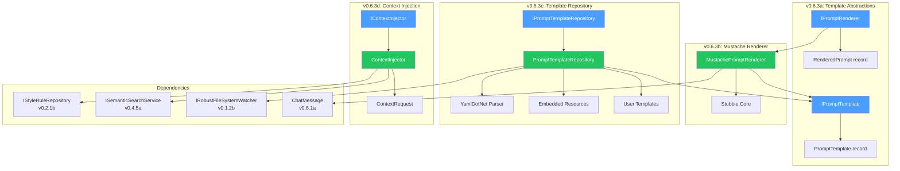
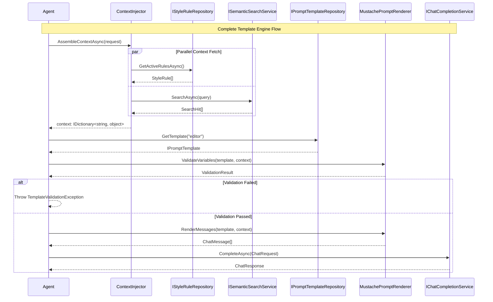
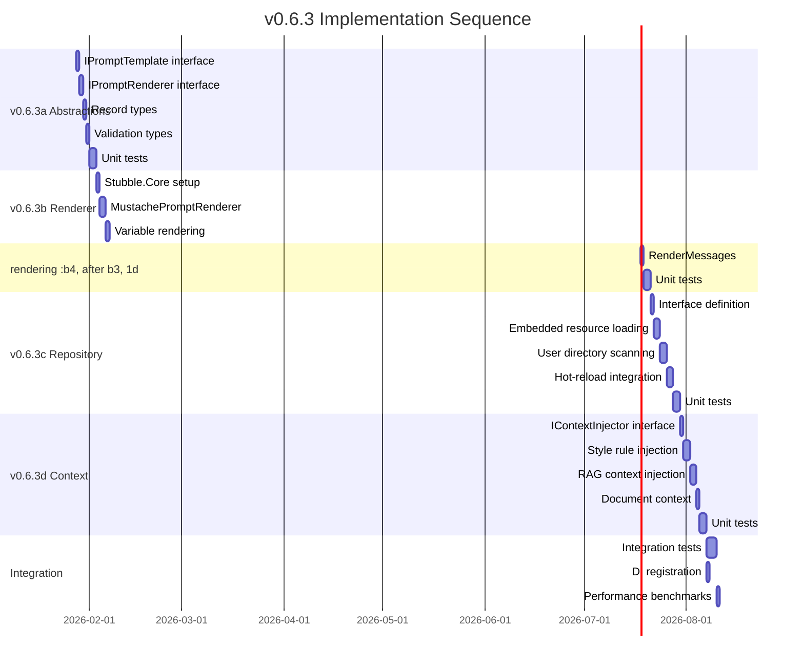

# LCS-DES-063-INDEX: Design Specification Index — The Template Engine

## Document Control

| Field           | Value                         |
| :-------------- | :---------------------------- |
| **Document ID** | LCS-DES-063-INDEX             |
| **Version**     | v0.6.3                        |
| **Codename**    | The Template Engine           |
| **Status**      | Draft                         |
| **Created**     | 2026-01-27                    |
| **Author**      | Documentation Agent           |
| **Parent SBD**  | [LCS-SBD-063](LCS-SBD-063.md) |

---

## 1. Overview

This index catalogs the design specifications for **v0.6.3: The Template Engine**, which delivers a flexible prompt templating system for dynamic prompt assembly. The Template Engine bridges user intent and LLM communication by automatically injecting context—style rules, RAG results, and document state—into sophisticated prompts.

### 1.1 Feature Summary

| Aspect         | Description                                                           |
| :------------- | :-------------------------------------------------------------------- |
| **Goal**       | Build a flexible prompt templating system                             |
| **Scope**      | Template abstractions, Mustache rendering, repositories               |
| **Key Output** | `IPromptTemplate`, `IPromptRenderer`, `IContextInjector`              |
| **Depends On** | v0.6.1 (Gateway), v0.6.2 (Providers), v0.2.1b (Styles), v0.4.5a (RAG) |
| **Enables**    | v0.6.4 (Chat Interface), v0.6.5 (Stream), v0.6.6 (Co-pilot)           |

### 1.2 Sub-Part Overview

| Sub-Part | Title                     | Module         | License Tier |
| :------- | :------------------------ | :------------- | :----------- |
| v0.6.3a  | Template Abstractions     | Abstractions   | WriterPro    |
| v0.6.3b  | Mustache Renderer         | Modules.Agents | WriterPro    |
| v0.6.3c  | Template Repository       | Modules.Agents | WriterPro+   |
| v0.6.3d  | Context Injection Service | Modules.Agents | WriterPro    |

---

## 2. Design Specification Registry

### 2.1 v0.6.3a: Template Abstractions

| Field        | Value                           |
| :----------- | :------------------------------ |
| **Document** | [LCS-DES-063a](LCS-DES-063a.md) |
| **Title**    | Template Abstractions           |
| **Module**   | `Lexichord.Abstractions`        |
| **License**  | WriterPro                       |
| **Status**   | Draft                           |

**Scope:**

- `IPromptTemplate` interface for template definition
- `IPromptRenderer` interface for template rendering
- `PromptTemplate` record implementation
- `RenderedPrompt` record for output
- `TemplateVariable` record for metadata
- `ValidationResult` for variable validation
- `TemplateValidationException` for errors

**Key Interfaces:**

```csharp
public interface IPromptTemplate
{
    string TemplateId { get; }
    string Name { get; }
    string Description { get; }
    string SystemPromptTemplate { get; }
    string UserPromptTemplate { get; }
    IReadOnlyList<string> RequiredVariables { get; }
    IReadOnlyList<string> OptionalVariables { get; }
}

public interface IPromptRenderer
{
    string Render(string template, IDictionary<string, object> variables);
    ChatMessage[] RenderMessages(IPromptTemplate template, IDictionary<string, object> variables);
    ValidationResult ValidateVariables(IPromptTemplate template, IDictionary<string, object> variables);
}
```

**Dependencies:**

- `ChatMessage` (v0.6.1a)
- `ChatRole` (v0.6.1a)

---

### 2.2 v0.6.3b: Mustache Renderer

| Field        | Value                           |
| :----------- | :------------------------------ |
| **Document** | [LCS-DES-063b](LCS-DES-063b.md) |
| **Title**    | Mustache Renderer               |
| **Module**   | `Lexichord.Modules.Agents`      |
| **License**  | WriterPro                       |
| **Status**   | Complete                        |

**Scope:**

- `MustachePromptRenderer` implementing `IPromptRenderer`
- Stubble.Core library integration
- Variable substitution: `{{variable}}`
- Section rendering: `{{#section}}...{{/section}}`
- Inverted sections: `{{^inverted}}...{{/inverted}}`
- Partials support: `{{> partial}}`
- Raw/unescaped content: `{{{raw}}}`
- Performance benchmarks

**Key Implementation:**

```csharp
public class MustachePromptRenderer : IPromptRenderer
{
    private readonly StubbleVisitorRenderer _renderer;

    public MustachePromptRenderer(ILogger<MustachePromptRenderer> logger)
    {
        _renderer = new StubbleBuilder()
            .Configure(settings => settings.SetIgnoreCaseOnKeyLookup(true))
            .Build();
    }

    public string Render(string template, IDictionary<string, object> variables)
        => _renderer.Render(template, variables);
}
```

**NuGet Dependencies:**

| Package        | Version | Purpose                     |
| :------------- | :------ | :-------------------------- |
| `Stubble.Core` | 1.10.x  | Mustache template rendering |

---

### 2.3 v0.6.3c: Template Repository

| Field        | Value                                 |
| :----------- | :------------------------------------ |
| **Document** | [LCS-DES-063c](LCS-DES-063c.md)       |
| **Title**    | Template Repository                   |
| **Module**   | `Lexichord.Modules.Agents`            |
| **License**  | WriterPro (built-in) / Teams (custom) |
| **Status**   | Draft                                 |

**Scope:**

- `IPromptTemplateRepository` interface definition
- `PromptTemplateRepository` implementation
- Built-in templates (embedded YAML resources)
- User templates (`.lexichord/prompts/` directory)
- Global templates (`{AppData}/Lexichord/prompts/`)
- YAML parsing with YamlDotNet
- Template caching with LRU eviction
- Hot-reload via `IRobustFileSystemWatcher`
- Template validation on load
- `TemplateChangedEventArgs` for notifications

**Key Interface:**

```csharp
public interface IPromptTemplateRepository
{
    IReadOnlyList<IPromptTemplate> GetAllTemplates();
    IPromptTemplate? GetTemplate(string templateId);
    Task ReloadTemplatesAsync(CancellationToken ct = default);
    event EventHandler<TemplateChangedEventArgs>? TemplateChanged;
}
```

**Template Format (YAML):**

```yaml
template_id: "co-pilot-editor"
name: "Co-pilot Editor"
description: "General writing assistance"
system_prompt: |
    You are a writing assistant.
    {{#style_rules}}
    Follow these rules: {{style_rules}}
    {{/style_rules}}
user_prompt: "{{user_input}}"
required_variables: ["user_input"]
optional_variables: ["style_rules", "context"]
```

**Dependencies:**

- `IPromptTemplate` (v0.6.3a)
- `IRobustFileSystemWatcher` (v0.1.2b)
- `YamlDotNet` (existing)

---

### 2.4 v0.6.3d: Context Injection Service

| Field        | Value                           |
| :----------- | :------------------------------ |
| **Document** | [LCS-DES-063d](LCS-DES-063d.md) |
| **Title**    | Context Injection Service       |
| **Module**   | `Lexichord.Modules.Agents`      |
| **License**  | WriterPro                       |
| **Status**   | Draft                           |

**Scope:**

- `IContextInjector` interface definition
- `ContextInjector` implementation
- `ContextRequest` record for configuration
- Style rule injection via `IStyleRuleRepository`
- RAG context injection via `ISemanticSearchService`
- Document context extraction
- Context formatting for template variables
- Parallel fetch with configurable timeout
- Context caching

**Key Interface:**

```csharp
public interface IContextInjector
{
    Task<IDictionary<string, object>> AssembleContextAsync(
        ContextRequest request,
        CancellationToken ct = default);
}

public record ContextRequest(
    string? CurrentDocumentPath,
    int? CursorPosition,
    string? SelectedText,
    bool IncludeStyleRules,
    bool IncludeRAGContext,
    int MaxRAGChunks = 3
);
```

**Dependencies:**

- `IStyleRuleRepository` (v0.2.1b)
- `ISemanticSearchService` (v0.4.5a)
- `IPromptTemplate` (v0.6.3a)

---

## 3. Architecture Diagram



---

## 4. Data Flow



---

## 5. Dependency Matrix

### 5.1 Internal Dependencies (v0.6.3 ↔ v0.6.3)

| Consumer | Depends On | Interface          | Purpose                   |
| :------- | :--------- | :----------------- | :------------------------ |
| v0.6.3b  | v0.6.3a    | `IPromptTemplate`  | Template definition input |
| v0.6.3b  | v0.6.3a    | `IPromptRenderer`  | Interface implementation  |
| v0.6.3c  | v0.6.3a    | `IPromptTemplate`  | Template storage contract |
| v0.6.3d  | v0.6.3a    | Template datatypes | Context variable types    |

### 5.2 External Dependencies (v0.6.3 → Prior Versions)

| Sub-Part | Interface                  | Source  | Purpose                 |
| :------- | :------------------------- | :------ | :---------------------- |
| v0.6.3a  | `ChatMessage`              | v0.6.1a | Rendered message format |
| v0.6.3a  | `ChatRole`                 | v0.6.1a | Message role assignment |
| v0.6.3c  | `IRobustFileSystemWatcher` | v0.1.2b | Template hot-reload     |
| v0.6.3d  | `IStyleRuleRepository`     | v0.2.1b | Style rules for context |
| v0.6.3d  | `ISemanticSearchService`   | v0.4.5a | RAG context retrieval   |

### 5.3 Downstream Consumers (Future Versions → v0.6.3)

| Version | Interface                   | Usage                         |
| :------ | :-------------------------- | :---------------------------- |
| v0.6.4  | `IPromptTemplateRepository` | Template selection in chat UI |
| v0.6.4  | `IPromptRenderer`           | Message rendering for chat    |
| v0.6.5  | `IPromptRenderer`           | Streaming response rendering  |
| v0.6.6  | `IContextInjector`          | Co-pilot context assembly     |
| v0.6.7  | All v0.6.3 interfaces       | Document bridge prompts       |

---

## 6. Implementation Order



---

## 7. Test Coverage Requirements

### 7.1 Unit Test Distribution

| Sub-Part | Test Class                      | Min Test Count |
| :------- | :------------------------------ | :------------- |
| v0.6.3a  | `PromptTemplateTests`           | 8              |
| v0.6.3a  | `ValidationResultTests`         | 5              |
| v0.6.3b  | `MustachePromptRendererTests`   | 15             |
| v0.6.3c  | `PromptTemplateRepositoryTests` | 12             |
| v0.6.3d  | `ContextInjectorTests`          | 10             |

### 7.2 Integration Test Requirements

| Scenario                  | Validation                                |
| :------------------------ | :---------------------------------------- |
| Full template pipeline    | Context → Template → Render → LLM         |
| Hot-reload workflow       | File change → Reload → Updated template   |
| Missing required variable | ValidationException before LLM call       |
| RAG timeout handling      | Graceful degradation with partial context |
| License tier enforcement  | Custom templates rejected for WriterPro   |

---

## 8. File Structure

```text
src/
├── Lexichord.Abstractions/
│   └── Contracts/
│       ├── IPromptTemplate.cs          # v0.6.3a
│       ├── IPromptRenderer.cs          # v0.6.3a
│       ├── IContextInjector.cs         # v0.6.3d
│       ├── PromptTemplate.cs           # v0.6.3a (record)
│       ├── RenderedPrompt.cs           # v0.6.3a (record)
│       ├── TemplateVariable.cs         # v0.6.3a (record)
│       ├── ValidationResult.cs         # v0.6.3a (record)
│       ├── ContextRequest.cs           # v0.6.3d (record)
│       └── TemplateValidationException.cs
│
├── Lexichord.Modules.Agents/
│   ├── Templates/
│   │   ├── MustachePromptRenderer.cs   # v0.6.3b
│   │   ├── PromptTemplateRepository.cs # v0.6.3c
│   │   ├── ContextInjector.cs          # v0.6.3d
│   │   ├── IPromptTemplateRepository.cs # v0.6.3c
│   │   └── TemplateChangedEventArgs.cs # v0.6.3c
│   │
│   └── Resources/
│       └── Prompts/                    # Built-in templates
│           ├── co-pilot-editor.yaml
│           ├── document-reviewer.yaml
│           ├── style-checker.yaml
│           ├── summarizer.yaml
│           └── translator.yaml
│
tests/
├── Lexichord.Abstractions.Tests/
│   └── Contracts/
│       ├── PromptTemplateTests.cs
│       └── ValidationResultTests.cs
│
└── Lexichord.Modules.Agents.Tests/
    └── Templates/
        ├── MustachePromptRendererTests.cs
        ├── PromptTemplateRepositoryTests.cs
        └── ContextInjectorTests.cs
```

---

## 9. Configuration Schema

```json
{
    "Agents": {
        "Templates": {
            "BuiltInEnabled": true,
            "UserTemplatesPath": ".lexichord/prompts",
            "GlobalTemplatesPath": "{AppData}/Lexichord/prompts",
            "HotReloadEnabled": true,
            "HotReloadDebounceMs": 300,
            "CacheMaxSize": 100,
            "ValidationEnabled": true
        },
        "Context": {
            "StyleRulesEnabled": true,
            "RAGEnabled": true,
            "RAGMaxChunks": 3,
            "RAGTimeoutMs": 5000,
            "ParallelFetch": true
        }
    }
}
```

---

## 10. Acceptance Criteria Summary

| Sub-Part | AC Count | Key Acceptance Criteria                           |
| :------- | :------- | :------------------------------------------------ |
| v0.6.3a  | 6        | Interfaces defined, records immutable, validation |
| v0.6.3b  | 8        | Variables, sections, inverted, partials, < 10ms   |
| v0.6.3c  | 7        | Load, cache, hot-reload, validation, YAML parse   |
| v0.6.3d  | 6        | Style inject, RAG inject, parallel, timeout       |

---

## 11. Version History

| Version | Date       | Author              | Changes       |
| :------ | :--------- | :------------------ | :------------ |
| 0.1     | 2026-01-27 | Documentation Agent | Initial draft |
