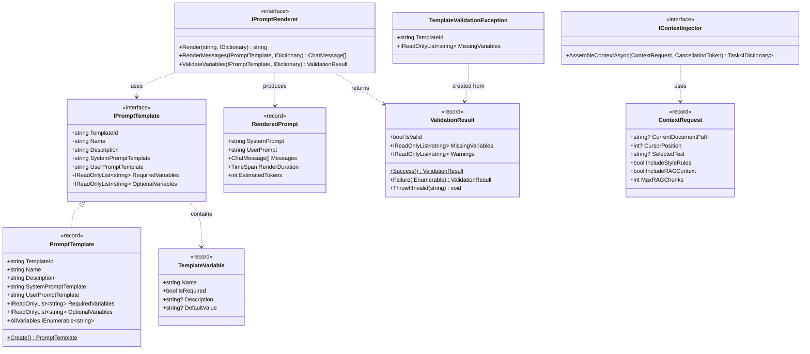
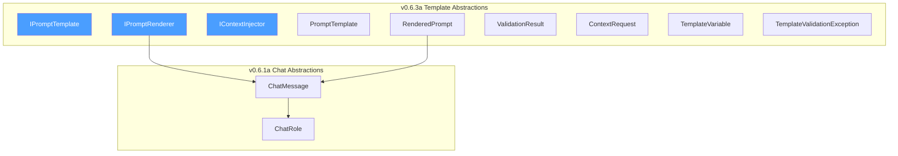

# LCS-DES-063a: Design Specification — Template Abstractions

## 1. Metadata & Categorization

| Field           | Value                                     |
| :-------------- | :---------------------------------------- |
| **Document ID** | LCS-DES-063a                              |
| **Version**     | v0.6.3a                                   |
| **Status**      | Draft                                     |
| **Category**    | Abstractions                              |
| **Module**      | Lexichord.Abstractions                    |
| **Created**     | 2026-01-27                                |
| **Author**      | Documentation Agent                       |
| **Parent**      | [LCS-DES-063-INDEX](LCS-DES-063-INDEX.md) |

---

## 2. Executive Summary

### 2.1 The Requirement

Lexichord's AI agents require a structured, type-safe approach to prompt definition and rendering. The current approach of hardcoded string concatenation presents significant challenges:

- **Inflexible**: Cannot adapt prompts without code changes and redeployment
- **Error-prone**: No validation of required variables before expensive LLM calls
- **Inconsistent**: Different agents build prompts using different patterns
- **Unmaintainable**: Prompt logic scattered across codebase, difficult to audit
- **Non-reusable**: Same prompt patterns duplicated across multiple agents

### 2.2 The Solution

Define a comprehensive set of core abstractions in `Lexichord.Abstractions` that establish the contract for prompt templates and rendering:

- **`IPromptTemplate`**: Declares a reusable prompt template with system/user prompts and variable requirements
- **`IPromptRenderer`**: Transforms templates and variables into `ChatMessage[]` ready for LLM submission
- **`IContextInjector`**: Assembles context from multiple sources for template variable injection
- **`ValidationResult`**: Captures validation state with detailed error information
- **Record types**: Immutable data carriers for templates, variables, and rendering output

These abstractions enable plugin implementations (Mustache, Handlebars, Liquid) while maintaining a consistent API surface across all agent implementations.

---

## 3. Architecture

### 3.1 Component Placement

```text
Lexichord.Abstractions/
└── Contracts/
    ├── IPromptTemplate.cs         # Template definition interface
    ├── IPromptRenderer.cs         # Rendering interface
    ├── IContextInjector.cs        # Context assembly interface
    ├── PromptTemplate.cs          # Record implementation
    ├── RenderedPrompt.cs          # Render output record
    ├── TemplateVariable.cs        # Variable metadata record
    ├── ValidationResult.cs        # Validation outcome record
    ├── ContextRequest.cs          # Context assembly request
    └── TemplateValidationException.cs  # Validation exception
```

### 3.2 Type Hierarchy



### 3.3 Dependency Graph



---

## 4. Data Contract (The API)

### 4.1 IPromptTemplate Interface

```csharp
namespace Lexichord.Abstractions.Contracts;

/// <summary>
/// Defines a reusable prompt template for LLM interactions.
/// Templates use Mustache-style variable substitution.
/// </summary>
/// <remarks>
/// Templates define both system and user prompts with placeholders.
/// Required variables must be provided; optional variables default to empty.
/// Template IDs should be kebab-case and unique within the repository.
/// </remarks>
public interface IPromptTemplate
{
    /// <summary>
    /// Unique identifier for the template (e.g., "co-pilot-editor").
    /// Must be kebab-case and unique within the repository.
    /// </summary>
    /// <example>co-pilot-editor</example>
    string TemplateId { get; }

    /// <summary>
    /// Human-readable display name for the template.
    /// Shown in UI template selectors.
    /// </summary>
    /// <example>Co-pilot Editor</example>
    string Name { get; }

    /// <summary>
    /// Describes the template's purpose and intended use case.
    /// Helps users select appropriate templates.
    /// </summary>
    string Description { get; }

    /// <summary>
    /// Mustache template for the system prompt.
    /// May contain {{variable}} placeholders.
    /// </summary>
    /// <remarks>
    /// The system prompt establishes the AI's role and behavior.
    /// Supports sections: {{#var}}...{{/var}} and inverted: {{^var}}...{{/var}}
    /// </remarks>
    string SystemPromptTemplate { get; }

    /// <summary>
    /// Mustache template for the user prompt.
    /// May contain {{variable}} placeholders.
    /// </summary>
    /// <remarks>
    /// The user prompt contains the actual request/content to process.
    /// </remarks>
    string UserPromptTemplate { get; }

    /// <summary>
    /// Variables that must be provided for rendering.
    /// Rendering fails if any required variable is missing.
    /// </summary>
    IReadOnlyList<string> RequiredVariables { get; }

    /// <summary>
    /// Variables that may be provided for rendering.
    /// Missing optional variables render as empty strings.
    /// </summary>
    IReadOnlyList<string> OptionalVariables { get; }
}
```

### 4.2 IPromptRenderer Interface

```csharp
namespace Lexichord.Abstractions.Contracts;

/// <summary>
/// Renders prompt templates with variable substitution.
/// </summary>
/// <remarks>
/// Implementations may use different templating engines (Mustache, Handlebars, etc.).
/// The renderer is responsible for variable validation and error handling.
/// All implementations must be thread-safe for concurrent rendering.
/// </remarks>
public interface IPromptRenderer
{
    /// <summary>
    /// Renders a template string with the provided variables.
    /// </summary>
    /// <param name="template">The template string with {{variable}} placeholders.</param>
    /// <param name="variables">Dictionary of variable names to values.</param>
    /// <returns>The rendered string with all placeholders substituted.</returns>
    /// <exception cref="ArgumentNullException">If template or variables is null.</exception>
    /// <remarks>
    /// This method does not validate required variables - it renders whatever is provided.
    /// For validation, use ValidateVariables before rendering.
    /// </remarks>
    string Render(string template, IDictionary<string, object> variables);

    /// <summary>
    /// Renders a complete prompt template into ChatMessage array.
    /// </summary>
    /// <param name="template">The prompt template to render.</param>
    /// <param name="variables">Dictionary of variable names to values.</param>
    /// <returns>Array of ChatMessage ready for LLM submission.</returns>
    /// <exception cref="TemplateValidationException">
    /// If required variables are missing. Validate first to avoid exceptions.
    /// </exception>
    /// <remarks>
    /// This method validates required variables before rendering.
    /// Returns [System, User] message pair for standard prompts.
    /// </remarks>
    ChatMessage[] RenderMessages(
        IPromptTemplate template,
        IDictionary<string, object> variables);

    /// <summary>
    /// Validates that all required variables are present.
    /// </summary>
    /// <param name="template">The prompt template to validate against.</param>
    /// <param name="variables">Dictionary of variable names to values.</param>
    /// <returns>Validation result with any missing variables listed.</returns>
    /// <remarks>
    /// Call this before RenderMessages to get validation errors without exceptions.
    /// Validation considers null and empty string as "missing" for required variables.
    /// </remarks>
    ValidationResult ValidateVariables(
        IPromptTemplate template,
        IDictionary<string, object> variables);
}
```

### 4.3 IContextInjector Interface

```csharp
namespace Lexichord.Abstractions.Contracts;

/// <summary>
/// Assembles context from multiple sources for template variable injection.
/// </summary>
/// <remarks>
/// The context injector gathers style rules, RAG results, and document state
/// into a dictionary suitable for template variable substitution.
/// Implementation is in v0.6.3d; interface defined here for abstraction.
/// </remarks>
public interface IContextInjector
{
    /// <summary>
    /// Assembles context from configured sources.
    /// </summary>
    /// <param name="request">Specifies which context sources to include.</param>
    /// <param name="ct">Cancellation token for async operations.</param>
    /// <returns>Dictionary of variable names to context values.</returns>
    /// <remarks>
    /// The returned dictionary contains standard variable names:
    /// <list type="bullet">
    /// <item><description>"style_rules": Formatted style rules string</description></item>
    /// <item><description>"context": RAG context chunks as formatted string</description></item>
    /// <item><description>"document_path": Current document path</description></item>
    /// <item><description>"selected_text": User's text selection</description></item>
    /// </list>
    /// Missing sources return an empty dictionary without the key.
    /// </remarks>
    Task<IDictionary<string, object>> AssembleContextAsync(
        ContextRequest request,
        CancellationToken ct = default);
}
```

### 4.4 PromptTemplate Record

```csharp
namespace Lexichord.Abstractions.Contracts;

/// <summary>
/// Immutable record implementing IPromptTemplate.
/// Provides value equality and immutability guarantees.
/// </summary>
/// <param name="TemplateId">Unique template identifier (kebab-case).</param>
/// <param name="Name">Human-readable display name.</param>
/// <param name="Description">Template purpose description.</param>
/// <param name="SystemPromptTemplate">Mustache template for system prompt.</param>
/// <param name="UserPromptTemplate">Mustache template for user prompt.</param>
/// <param name="RequiredVariables">Variables that must be provided.</param>
/// <param name="OptionalVariables">Variables that may be provided.</param>
public record PromptTemplate(
    string TemplateId,
    string Name,
    string Description,
    string SystemPromptTemplate,
    string UserPromptTemplate,
    IReadOnlyList<string> RequiredVariables,
    IReadOnlyList<string> OptionalVariables
) : IPromptTemplate
{
    /// <summary>
    /// Creates a minimal template with just the essentials.
    /// </summary>
    /// <param name="templateId">Unique identifier for the template.</param>
    /// <param name="name">Human-readable name.</param>
    /// <param name="systemPrompt">System prompt template content.</param>
    /// <param name="userPrompt">User prompt template content.</param>
    /// <param name="requiredVariables">Optional list of required variables.</param>
    /// <param name="optionalVariables">Optional list of optional variables.</param>
    /// <returns>A new PromptTemplate instance.</returns>
    public static PromptTemplate Create(
        string templateId,
        string name,
        string systemPrompt,
        string userPrompt,
        IEnumerable<string>? requiredVariables = null,
        IEnumerable<string>? optionalVariables = null)
    {
        ArgumentException.ThrowIfNullOrWhiteSpace(templateId);
        ArgumentException.ThrowIfNullOrWhiteSpace(name);

        return new PromptTemplate(
            TemplateId: templateId,
            Name: name,
            Description: string.Empty,
            SystemPromptTemplate: systemPrompt ?? string.Empty,
            UserPromptTemplate: userPrompt ?? string.Empty,
            RequiredVariables: requiredVariables?.ToList().AsReadOnly()
                ?? Array.Empty<string>().AsReadOnly(),
            OptionalVariables: optionalVariables?.ToList().AsReadOnly()
                ?? Array.Empty<string>().AsReadOnly()
        );
    }

    /// <summary>
    /// Gets all variables (required and optional combined).
    /// </summary>
    public IEnumerable<string> AllVariables
        => RequiredVariables.Concat(OptionalVariables);

    /// <summary>
    /// Gets the total count of all variables.
    /// </summary>
    public int VariableCount
        => RequiredVariables.Count + OptionalVariables.Count;

    /// <summary>
    /// Checks if a variable name is defined in this template.
    /// </summary>
    public bool HasVariable(string variableName)
        => AllVariables.Contains(variableName, StringComparer.OrdinalIgnoreCase);
}
```

### 4.5 RenderedPrompt Record

```csharp
namespace Lexichord.Abstractions.Contracts;

/// <summary>
/// Result of rendering a prompt template.
/// Contains both raw strings and ready-to-send messages.
/// </summary>
/// <param name="SystemPrompt">The rendered system prompt string.</param>
/// <param name="UserPrompt">The rendered user prompt string.</param>
/// <param name="Messages">Ready-to-send ChatMessage array.</param>
/// <param name="RenderDuration">Time taken to render the template.</param>
public record RenderedPrompt(
    string SystemPrompt,
    string UserPrompt,
    ChatMessage[] Messages,
    TimeSpan RenderDuration
)
{
    /// <summary>
    /// Approximate token count for the rendered prompts.
    /// Uses character-based estimation (4 chars ≈ 1 token).
    /// </summary>
    /// <remarks>
    /// This is an approximation. For accurate counts, use ITokenCounter (v0.6.2d).
    /// </remarks>
    public int EstimatedTokens
        => (SystemPrompt.Length + UserPrompt.Length) / 4;

    /// <summary>
    /// Total character count across all prompts.
    /// </summary>
    public int TotalCharacters
        => SystemPrompt.Length + UserPrompt.Length;

    /// <summary>
    /// Indicates if rendering completed quickly (under 10ms).
    /// </summary>
    public bool WasFastRender
        => RenderDuration.TotalMilliseconds < 10;
}
```

### 4.6 TemplateVariable Record

```csharp
namespace Lexichord.Abstractions.Contracts;

/// <summary>
/// Metadata about a template variable for documentation and validation.
/// Used for UI display and advanced validation scenarios.
/// </summary>
/// <param name="Name">Variable name as used in template (without braces).</param>
/// <param name="IsRequired">Whether the variable must be provided.</param>
/// <param name="Description">Human-readable description of the variable.</param>
/// <param name="DefaultValue">Default value if not provided (optional vars only).</param>
public record TemplateVariable(
    string Name,
    bool IsRequired,
    string? Description = null,
    string? DefaultValue = null
)
{
    /// <summary>
    /// Creates a required variable.
    /// </summary>
    public static TemplateVariable Required(string name, string? description = null)
        => new(name, true, description);

    /// <summary>
    /// Creates an optional variable with optional default.
    /// </summary>
    public static TemplateVariable Optional(
        string name,
        string? description = null,
        string? defaultValue = null)
        => new(name, false, description, defaultValue);
}
```

### 4.7 ValidationResult Record

```csharp
namespace Lexichord.Abstractions.Contracts;

/// <summary>
/// Result of validating template variables.
/// Provides detailed information about validation failures.
/// </summary>
/// <param name="IsValid">True if all required variables are present.</param>
/// <param name="MissingVariables">List of required variables not provided.</param>
/// <param name="Warnings">Non-fatal validation warnings.</param>
public record ValidationResult(
    bool IsValid,
    IReadOnlyList<string> MissingVariables,
    IReadOnlyList<string> Warnings
)
{
    /// <summary>
    /// Creates a successful validation result.
    /// </summary>
    public static ValidationResult Success()
        => new(true, Array.Empty<string>(), Array.Empty<string>());

    /// <summary>
    /// Creates a successful result with warnings.
    /// </summary>
    /// <param name="warnings">Non-fatal warnings to include.</param>
    public static ValidationResult WithWarnings(IEnumerable<string> warnings)
        => new(true, Array.Empty<string>(), warnings.ToList().AsReadOnly());

    /// <summary>
    /// Creates a failed validation result.
    /// </summary>
    /// <param name="missingVariables">List of missing required variables.</param>
    public static ValidationResult Failure(IEnumerable<string> missingVariables)
        => new(false, missingVariables.ToList().AsReadOnly(), Array.Empty<string>());

    /// <summary>
    /// Creates a failed result with warnings.
    /// </summary>
    /// <param name="missingVariables">List of missing required variables.</param>
    /// <param name="warnings">Non-fatal warnings to include.</param>
    public static ValidationResult Failure(
        IEnumerable<string> missingVariables,
        IEnumerable<string> warnings)
        => new(false, missingVariables.ToList().AsReadOnly(), warnings.ToList().AsReadOnly());

    /// <summary>
    /// Throws TemplateValidationException if validation failed.
    /// </summary>
    /// <param name="templateId">Template ID for the exception message.</param>
    /// <exception cref="TemplateValidationException">Thrown when IsValid is false.</exception>
    public void ThrowIfInvalid(string templateId)
    {
        if (!IsValid)
        {
            throw new TemplateValidationException(templateId, MissingVariables);
        }
    }

    /// <summary>
    /// Gets a formatted error message for display.
    /// </summary>
    public string ErrorMessage => IsValid
        ? string.Empty
        : $"Missing required variables: {string.Join(", ", MissingVariables)}";

    /// <summary>
    /// Gets whether there are any warnings.
    /// </summary>
    public bool HasWarnings => Warnings.Count > 0;
}
```

### 4.8 ContextRequest Record

```csharp
namespace Lexichord.Abstractions.Contracts;

/// <summary>
/// Request for context assembly before prompt rendering.
/// Specifies what context sources to include.
/// </summary>
/// <param name="CurrentDocumentPath">Path to the active document, if any.</param>
/// <param name="CursorPosition">Cursor offset in the document, if relevant.</param>
/// <param name="SelectedText">Currently selected text for context.</param>
/// <param name="IncludeStyleRules">Whether to inject active style rules.</param>
/// <param name="IncludeRAGContext">Whether to query semantic search for context.</param>
/// <param name="MaxRAGChunks">Maximum RAG chunks to include (default: 3).</param>
public record ContextRequest(
    string? CurrentDocumentPath,
    int? CursorPosition,
    string? SelectedText,
    bool IncludeStyleRules,
    bool IncludeRAGContext,
    int MaxRAGChunks = 3
)
{
    /// <summary>
    /// Creates a minimal context request with only user input.
    /// </summary>
    /// <param name="input">The user's input text.</param>
    public static ContextRequest ForUserInput(string input)
        => new(null, null, input, false, false);

    /// <summary>
    /// Creates a full context request with all sources enabled.
    /// </summary>
    /// <param name="documentPath">Path to the current document.</param>
    /// <param name="selectedText">Currently selected text.</param>
    public static ContextRequest Full(
        string? documentPath,
        string? selectedText)
        => new(documentPath, null, selectedText, true, true);

    /// <summary>
    /// Creates a style-only context request.
    /// </summary>
    /// <param name="documentPath">Path to the current document.</param>
    public static ContextRequest StyleOnly(string? documentPath)
        => new(documentPath, null, null, true, false);

    /// <summary>
    /// Creates a RAG-only context request.
    /// </summary>
    /// <param name="query">The query text for semantic search.</param>
    /// <param name="maxChunks">Maximum chunks to retrieve.</param>
    public static ContextRequest RAGOnly(string query, int maxChunks = 3)
        => new(null, null, query, false, true, maxChunks);

    /// <summary>
    /// Gets whether any context sources are enabled.
    /// </summary>
    public bool HasContextSources => IncludeStyleRules || IncludeRAGContext;

    /// <summary>
    /// Gets whether this request has document context.
    /// </summary>
    public bool HasDocumentContext => CurrentDocumentPath != null;
}
```

### 4.9 TemplateValidationException

```csharp
namespace Lexichord.Abstractions.Contracts;

/// <summary>
/// Exception thrown when template rendering fails due to missing required variables.
/// </summary>
[Serializable]
public class TemplateValidationException : Exception
{
    /// <summary>
    /// The template ID that failed validation.
    /// </summary>
    public string TemplateId { get; }

    /// <summary>
    /// List of required variables that were not provided.
    /// </summary>
    public IReadOnlyList<string> MissingVariables { get; }

    /// <summary>
    /// Creates a new template validation exception.
    /// </summary>
    /// <param name="templateId">The template that failed validation.</param>
    /// <param name="missingVariables">List of missing required variables.</param>
    public TemplateValidationException(
        string templateId,
        IReadOnlyList<string> missingVariables)
        : base(BuildMessage(templateId, missingVariables))
    {
        TemplateId = templateId;
        MissingVariables = missingVariables;
    }

    /// <summary>
    /// Creates a new template validation exception with inner exception.
    /// </summary>
    /// <param name="templateId">The template that failed validation.</param>
    /// <param name="missingVariables">List of missing required variables.</param>
    /// <param name="innerException">The underlying exception.</param>
    public TemplateValidationException(
        string templateId,
        IReadOnlyList<string> missingVariables,
        Exception innerException)
        : base(BuildMessage(templateId, missingVariables), innerException)
    {
        TemplateId = templateId;
        MissingVariables = missingVariables;
    }

    private static string BuildMessage(string templateId, IReadOnlyList<string> missing)
    {
        var vars = string.Join(", ", missing);
        return $"Template '{templateId}' validation failed. " +
               $"Missing required variables: {vars}";
    }
}
```

---

## 5. Usage Examples

### 5.1 Basic Template Rendering

```csharp
// Create a simple template
var template = PromptTemplate.Create(
    templateId: "simple-assistant",
    name: "Simple Assistant",
    systemPrompt: "You are a helpful assistant.",
    userPrompt: "{{user_input}}",
    requiredVariables: ["user_input"]
);

// Prepare variables
var variables = new Dictionary<string, object>
{
    ["user_input"] = "What is dependency injection?"
};

// Validate and render
var validation = renderer.ValidateVariables(template, variables);
if (validation.IsValid)
{
    var messages = renderer.RenderMessages(template, variables);
    var response = await chatService.CompleteAsync(new ChatRequest(messages));
    Console.WriteLine(response.Content);
}
else
{
    foreach (var missing in validation.MissingVariables)
    {
        Console.WriteLine($"Missing: {missing}");
    }
}
```

### 5.2 Template with Conditional Sections

```csharp
var template = new PromptTemplate(
    TemplateId: "context-aware",
    Name: "Context-Aware Assistant",
    Description: "Assistant that uses optional context",
    SystemPromptTemplate: """
        You are a writing assistant.

        {{#style_rules}}
        Follow these style guidelines:
        {{style_rules}}
        {{/style_rules}}

        {{#context}}
        Reference this context:
        {{context}}
        {{/context}}
        """,
    UserPromptTemplate: "{{user_input}}",
    RequiredVariables: ImmutableArray.Create("user_input"),
    OptionalVariables: ImmutableArray.Create("style_rules", "context")
);

// Render with partial context
var variables = new Dictionary<string, object>
{
    ["user_input"] = "Review this paragraph.",
    ["style_rules"] = "Use active voice. Keep sentences under 25 words."
    // "context" not provided - section will be omitted
};

var messages = renderer.RenderMessages(template, variables);
// System prompt will include style_rules section but not context section
```

### 5.3 Context Assembly with IContextInjector

```csharp
// Create a full context request
var request = ContextRequest.Full(
    documentPath: "/path/to/document.md",
    selectedText: "The quick brown fox jumps over the lazy dog."
);

// Assemble context from all sources
var context = await contextInjector.AssembleContextAsync(request);

// Context now contains:
// - "document_path": "/path/to/document.md"
// - "selected_text": "The quick brown fox..."
// - "style_rules": "• Use active voice\n• Avoid jargon" (if enabled)
// - "context": "[doc1.md]\nRelevant content..." (if RAG enabled)

// Merge with user-provided variables
context["user_input"] = "Please review this text for clarity.";

// Render template with assembled context
var messages = renderer.RenderMessages(template, context);
```

### 5.4 Validation Error Handling

```csharp
var template = PromptTemplate.Create(
    templateId: "strict-template",
    name: "Strict Template",
    systemPrompt: "Translate to {{target_language}}.",
    userPrompt: "{{source_text}}",
    requiredVariables: ["target_language", "source_text"]
);

var variables = new Dictionary<string, object>
{
    ["source_text"] = "Hello, world!"
    // Missing: target_language
};

var validation = renderer.ValidateVariables(template, variables);

if (!validation.IsValid)
{
    // Log the specific missing variables
    logger.LogWarning(
        "Template {TemplateId} validation failed. Missing: {Missing}",
        template.TemplateId,
        string.Join(", ", validation.MissingVariables));

    // Or throw with detailed exception
    validation.ThrowIfInvalid(template.TemplateId);
    // Throws: TemplateValidationException: Template 'strict-template' validation failed.
    //         Missing required variables: target_language
}
```

---

## 6. Design Rationale

### 6.1 Why Interfaces in Abstractions?

| Design Choice               | Rationale                                                         |
| :-------------------------- | :---------------------------------------------------------------- |
| **Interface-first**         | Enables multiple implementations (Mustache, Handlebars, custom)   |
| **In Abstractions module**  | Shared across Host and all modules without circular dependencies  |
| **Small interface surface** | 3 methods on `IPromptRenderer` keeps implementations simple       |
| **Records for data**        | Immutability prevents accidental mutation, enables value equality |

### 6.2 Why Separate Validation?

Explicit `ValidateVariables` method allows:

1. **Pre-flight checks** before expensive LLM calls
2. **UI feedback** showing missing variables before submission
3. **Logging** of validation failures separately from render failures
4. **Optional validation** for callers who trust their input

### 6.3 Why ChatMessage[] Output?

| Alternative         | Rejected Because                                 |
| :------------------ | :----------------------------------------------- |
| Single string       | Loses role information, harder for agents        |
| Custom type         | Would require conversion before LLM calls        |
| RenderedPrompt only | Callers need raw messages for further processing |

`ChatMessage[]` integrates directly with `IChatCompletionService.CompleteAsync`.

### 6.4 Why Context Injection Separate from Rendering?

| Reason                     | Explanation                                                    |
| :------------------------- | :------------------------------------------------------------- |
| **Separation of concerns** | Context assembly is async I/O; rendering is synchronous        |
| **Flexibility**            | Context can be cached, modified, or augmented before rendering |
| **Testability**            | Can mock context independently from rendering                  |
| **Reusability**            | Same context can be used with different templates              |

---

## 7. Dependencies

### 7.1 Required Types (from v0.6.1a)

| Type          | Usage                              |
| :------------ | :--------------------------------- |
| `ChatMessage` | Output of `RenderMessages`         |
| `ChatRole`    | Role assignment in rendered output |

### 7.2 No External Dependencies

All types in v0.6.3a are self-contained within `Lexichord.Abstractions` with no NuGet package dependencies beyond the framework.

---

## 8. Testing Strategy

### 8.1 Unit Tests

| Test Class              | Test Focus                               | Count |
| :---------------------- | :--------------------------------------- | :---- |
| `PromptTemplateTests`   | Record equality, factory methods         | 8     |
| `ValidationResultTests` | Success/failure creation, ThrowIfInvalid | 6     |
| `ContextRequestTests`   | Factory methods, property defaults       | 5     |
| `TemplateVariableTests` | Factory methods, record behavior         | 3     |

### 8.2 Sample Test Cases

```csharp
[Trait("Category", "Unit")]
[Trait("Version", "v0.6.3a")]
public class PromptTemplateTests
{
    [Fact]
    public void Create_WithMinimalArgs_SetsDefaults()
    {
        var template = PromptTemplate.Create(
            "test-id",
            "Test Template",
            "System prompt",
            "{{input}}"
        );

        template.TemplateId.Should().Be("test-id");
        template.Description.Should().BeEmpty();
        template.RequiredVariables.Should().BeEmpty();
        template.OptionalVariables.Should().BeEmpty();
    }

    [Fact]
    public void AllVariables_CombinesRequiredAndOptional()
    {
        var template = PromptTemplate.Create(
            "test", "Test", "{{a}} {{b}}", "{{c}}",
            requiredVariables: ["a", "b"],
            optionalVariables: ["c", "d"]
        );

        template.AllVariables.Should().BeEquivalentTo(["a", "b", "c", "d"]);
    }

    [Fact]
    public void VariableCount_ReturnsCorrectTotal()
    {
        var template = PromptTemplate.Create(
            "test", "Test", "sys", "user",
            requiredVariables: ["a", "b"],
            optionalVariables: ["c"]
        );

        template.VariableCount.Should().Be(3);
    }

    [Fact]
    public void HasVariable_ReturnsTrueForExisting()
    {
        var template = PromptTemplate.Create(
            "test", "Test", "sys", "user",
            requiredVariables: ["input"]
        );

        template.HasVariable("input").Should().BeTrue();
        template.HasVariable("INPUT").Should().BeTrue(); // Case-insensitive
        template.HasVariable("other").Should().BeFalse();
    }

    [Fact]
    public void Records_WithSameValues_AreEqual()
    {
        var template1 = PromptTemplate.Create("id", "name", "sys", "user");
        var template2 = PromptTemplate.Create("id", "name", "sys", "user");

        template1.Should().Be(template2);
        template1.GetHashCode().Should().Be(template2.GetHashCode());
    }

    [Theory]
    [InlineData(null)]
    [InlineData("")]
    [InlineData("   ")]
    public void Create_WithInvalidId_Throws(string? invalidId)
    {
        var act = () => PromptTemplate.Create(invalidId!, "name", "sys", "user");
        act.Should().Throw<ArgumentException>();
    }
}

[Trait("Category", "Unit")]
[Trait("Version", "v0.6.3a")]
public class ValidationResultTests
{
    [Fact]
    public void Success_IsValid_ReturnsTrue()
    {
        var result = ValidationResult.Success();

        result.IsValid.Should().BeTrue();
        result.MissingVariables.Should().BeEmpty();
        result.HasWarnings.Should().BeFalse();
    }

    [Fact]
    public void Failure_IsValid_ReturnsFalse()
    {
        var result = ValidationResult.Failure(["var1", "var2"]);

        result.IsValid.Should().BeFalse();
        result.MissingVariables.Should().BeEquivalentTo(["var1", "var2"]);
    }

    [Fact]
    public void WithWarnings_IsValidWithWarnings()
    {
        var result = ValidationResult.WithWarnings(["Unused variable: extra"]);

        result.IsValid.Should().BeTrue();
        result.HasWarnings.Should().BeTrue();
        result.Warnings.Should().Contain("Unused variable: extra");
    }

    [Fact]
    public void ErrorMessage_WhenInvalid_ContainsMissingVars()
    {
        var result = ValidationResult.Failure(["input", "context"]);

        result.ErrorMessage.Should().Contain("input");
        result.ErrorMessage.Should().Contain("context");
    }

    [Fact]
    public void ThrowIfInvalid_WhenInvalid_ThrowsWithDetails()
    {
        var result = ValidationResult.Failure(["missing"]);

        var act = () => result.ThrowIfInvalid("test-template");

        act.Should().Throw<TemplateValidationException>()
            .WithMessage("*'test-template'*")
            .Where(e => e.MissingVariables.Contains("missing"));
    }

    [Fact]
    public void ThrowIfInvalid_WhenValid_DoesNotThrow()
    {
        var result = ValidationResult.Success();

        var act = () => result.ThrowIfInvalid("test-template");

        act.Should().NotThrow();
    }
}

[Trait("Category", "Unit")]
[Trait("Version", "v0.6.3a")]
public class ContextRequestTests
{
    [Fact]
    public void ForUserInput_CreatesMinimalRequest()
    {
        var request = ContextRequest.ForUserInput("Hello");

        request.SelectedText.Should().Be("Hello");
        request.IncludeStyleRules.Should().BeFalse();
        request.IncludeRAGContext.Should().BeFalse();
        request.HasContextSources.Should().BeFalse();
    }

    [Fact]
    public void Full_EnablesAllSources()
    {
        var request = ContextRequest.Full("/doc.md", "selected");

        request.CurrentDocumentPath.Should().Be("/doc.md");
        request.SelectedText.Should().Be("selected");
        request.IncludeStyleRules.Should().BeTrue();
        request.IncludeRAGContext.Should().BeTrue();
        request.HasContextSources.Should().BeTrue();
    }

    [Fact]
    public void HasDocumentContext_WhenPathProvided_ReturnsTrue()
    {
        var request = new ContextRequest("/doc.md", null, null, false, false);
        request.HasDocumentContext.Should().BeTrue();
    }

    [Fact]
    public void RAGOnly_SetsCorrectProperties()
    {
        var request = ContextRequest.RAGOnly("query text", 5);

        request.SelectedText.Should().Be("query text");
        request.MaxRAGChunks.Should().Be(5);
        request.IncludeRAGContext.Should().BeTrue();
        request.IncludeStyleRules.Should().BeFalse();
    }
}
```

---

## 9. Acceptance Criteria

### 9.1 Functional Criteria

| ID    | Criterion                                               | Verification |
| :---- | :------------------------------------------------------ | :----------- |
| AC-01 | `IPromptTemplate` interface defined with all properties | Compilation  |
| AC-02 | `IPromptRenderer` interface has 3 required methods      | Compilation  |
| AC-03 | `IContextInjector` interface defined                    | Compilation  |
| AC-04 | `PromptTemplate` record implements `IPromptTemplate`    | Compilation  |
| AC-05 | `PromptTemplate.Create` factory works correctly         | Unit test    |
| AC-06 | `ValidationResult.Success()` returns valid result       | Unit test    |
| AC-07 | `ValidationResult.Failure()` returns invalid result     | Unit test    |
| AC-08 | `ThrowIfInvalid` throws when validation failed          | Unit test    |
| AC-09 | `ContextRequest` factory methods work correctly         | Unit test    |
| AC-10 | All record types support value equality                 | Unit test    |

### 9.2 Non-Functional Criteria

| ID    | Criterion                        | Target            |
| :---- | :------------------------------- | :---------------- |
| NF-01 | All records are immutable        | Code review       |
| NF-02 | All types have XML documentation | Code review       |
| NF-03 | No external NuGet dependencies   | Package reference |
| NF-04 | Thread-safe type design          | Code review       |

---

## 10. Implementation Checklist

- [ ] Create `IPromptTemplate.cs` in `Contracts/`
- [ ] Create `IPromptRenderer.cs` in `Contracts/`
- [ ] Create `IContextInjector.cs` in `Contracts/`
- [ ] Create `PromptTemplate.cs` record in `Contracts/`
- [ ] Create `RenderedPrompt.cs` record in `Contracts/`
- [ ] Create `TemplateVariable.cs` record in `Contracts/`
- [ ] Create `ValidationResult.cs` record in `Contracts/`
- [ ] Create `ContextRequest.cs` record in `Contracts/`
- [ ] Create `TemplateValidationException.cs` in `Contracts/`
- [ ] Add XML documentation to all public members
- [ ] Create `PromptTemplateTests.cs` with 8+ tests
- [ ] Create `ValidationResultTests.cs` with 6+ tests
- [ ] Create `ContextRequestTests.cs` with 5+ tests
- [ ] Create `TemplateVariableTests.cs` with 3+ tests
- [ ] Verify all tests pass
- [ ] Verify build succeeds

---

## 11. Version History

| Version | Date       | Author              | Changes       |
| :------ | :--------- | :------------------ | :------------ |
| 0.1     | 2026-01-27 | Documentation Agent | Initial draft |
