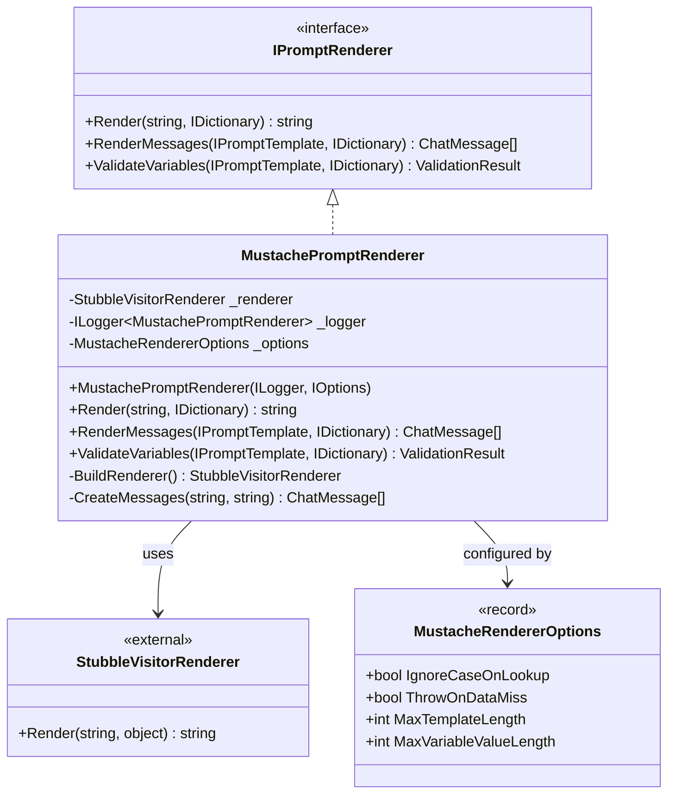
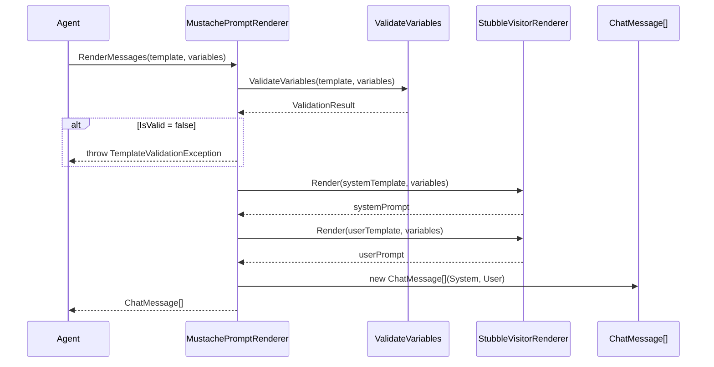

# LCS-DES-063b: Design Specification — Mustache Renderer

## 1. Metadata & Categorization

| Field           | Value                                     |
| :-------------- | :---------------------------------------- |
| **Document ID** | LCS-DES-063b                              |
| **Version**     | v0.6.3b                                   |
| **Status**      | Draft                                     |
| **Category**    | Implementation                            |
| **Module**      | Lexichord.Modules.Agents                  |
| **Created**     | 2026-01-27                                |
| **Author**      | Documentation Agent                       |
| **Parent**      | [LCS-DES-063-INDEX](LCS-DES-063-INDEX.md) |

---

## 2. Executive Summary

### 2.1 The Requirement

Implement `IPromptRenderer` (defined in v0.6.3a) to provide a concrete template rendering engine. The implementation must:

- Support Mustache templating syntax for variable substitution and conditionals
- Validate required variables before rendering to prevent malformed prompts
- Produce `ChatMessage[]` output compatible with `IChatCompletionService`
- Perform efficiently (< 10ms for typical prompts)
- Be thread-safe for concurrent agent usage
- Handle edge cases gracefully (empty variables, missing sections, etc.)

### 2.2 The Solution

Implement `MustachePromptRenderer` using the `Stubble.Core` NuGet package. Stubble is a mature, well-tested Mustache implementation for .NET that provides:

- Full Mustache spec compliance
- High performance (compiled template caching)
- Thread-safe rendering
- Configurable options for case-insensitivity and missing-key behavior

### 2.3 Why Mustache?

| Alternative        | Rejected Because                                 |
| :----------------- | :----------------------------------------------- |
| **String.Replace** | No support for sections, escaping, or iteration  |
| **Handlebars.Net** | Heavier dependency, more features than needed    |
| **Liquid**         | More complex, designed for end-user templates    |
| **Razor**          | Full view engine, extreme overkill for prompts   |
| **Custom parser**  | High maintenance, likely bugs vs. proven library |

Mustache strikes the right balance: expressive enough for prompt templating, simple enough for non-technical users to understand, with a minimal runtime footprint.

---

## 3. Architecture

### 3.1 Component Placement

```text
Lexichord.Modules.Agents/
├── Templates/
│   ├── MustachePromptRenderer.cs      # IPromptRenderer implementation
│   ├── StubbleBuilderExtensions.cs    # Configuration helpers
│   └── RenderingMetrics.cs            # Performance tracking
└── Agents.csproj                       # Add Stubble.Core package reference
```

### 3.2 Class Diagram



### 3.3 Sequence Diagram: RenderMessages Flow



---

## 4. Data Contract (The API)

### 4.1 MustachePromptRenderer Implementation

```csharp
namespace Lexichord.Modules.Agents.Templates;

using System.Diagnostics;
using Stubble.Core;
using Stubble.Core.Builders;

/// <summary>
/// Renders prompt templates using Mustache syntax via Stubble.Core.
/// Thread-safe for concurrent agent usage.
/// </summary>
/// <remarks>
/// This renderer provides:
/// <list type="bullet">
/// <item><description>Variable substitution: {{variable}}</description></item>
/// <item><description>Conditional sections: {{#section}}...{{/section}}</description></item>
/// <item><description>Inverted sections: {{^section}}...{{/section}}</description></item>
/// <item><description>Raw/unescaped content: {{{raw}}}</description></item>
/// <item><description>List iteration: {{#list}}{{.}}{{/list}}</description></item>
/// </list>
/// </remarks>
public sealed class MustachePromptRenderer : IPromptRenderer
{
    private readonly StubbleVisitorRenderer _renderer;
    private readonly ILogger<MustachePromptRenderer> _logger;
    private readonly MustacheRendererOptions _options;

    /// <summary>
    /// Creates a new Mustache renderer with the specified configuration.
    /// </summary>
    /// <param name="logger">Logger for render diagnostics.</param>
    /// <param name="options">Renderer configuration options.</param>
    public MustachePromptRenderer(
        ILogger<MustachePromptRenderer> logger,
        IOptions<MustacheRendererOptions> options)
    {
        _logger = logger ?? throw new ArgumentNullException(nameof(logger));
        _options = options?.Value ?? MustacheRendererOptions.Default;
        _renderer = BuildRenderer();

        _logger.LogDebug(
            "MustachePromptRenderer initialized. IgnoreCase={IgnoreCase}, ThrowOnMiss={ThrowOnMiss}",
            _options.IgnoreCaseOnLookup,
            _options.ThrowOnDataMiss);
    }

    /// <summary>
    /// Convenience constructor for simple initialization.
    /// </summary>
    /// <param name="logger">Logger instance.</param>
    public MustachePromptRenderer(ILogger<MustachePromptRenderer> logger)
        : this(logger, Options.Create(MustacheRendererOptions.Default))
    {
    }

    /// <inheritdoc />
    public string Render(string template, IDictionary<string, object> variables)
    {
        ArgumentNullException.ThrowIfNull(template);
        ArgumentNullException.ThrowIfNull(variables);

        if (template.Length > _options.MaxTemplateLength)
        {
            throw new ArgumentException(
                $"Template exceeds maximum length of {_options.MaxTemplateLength} characters.",
                nameof(template));
        }

        var stopwatch = Stopwatch.StartNew();

        try
        {
            var result = _renderer.Render(template, variables);

            _logger.LogDebug(
                "Rendered template in {ElapsedMs}ms. InputLength={InputLen}, OutputLength={OutputLen}, VarCount={VarCount}",
                stopwatch.ElapsedMilliseconds,
                template.Length,
                result.Length,
                variables.Count);

            return result;
        }
        catch (Exception ex) when (ex is not ArgumentException)
        {
            _logger.LogError(ex,
                "Template rendering failed. TemplateLength={Length}, VarCount={Count}",
                template.Length,
                variables.Count);
            throw new InvalidOperationException(
                $"Failed to render template: {ex.Message}", ex);
        }
    }

    /// <inheritdoc />
    public ChatMessage[] RenderMessages(
        IPromptTemplate template,
        IDictionary<string, object> variables)
    {
        ArgumentNullException.ThrowIfNull(template);
        ArgumentNullException.ThrowIfNull(variables);

        var stopwatch = Stopwatch.StartNew();

        // Pre-flight validation
        var validation = ValidateVariables(template, variables);
        if (!validation.IsValid)
        {
            _logger.LogWarning(
                "Template validation failed for {TemplateId}. Missing: {Missing}",
                template.TemplateId,
                string.Join(", ", validation.MissingVariables));

            validation.ThrowIfInvalid(template.TemplateId);
        }

        // Log warnings for provided but unused variables
        if (validation.HasWarnings)
        {
            foreach (var warning in validation.Warnings)
            {
                _logger.LogDebug("Template {TemplateId}: {Warning}", template.TemplateId, warning);
            }
        }

        // Render system and user prompts
        var systemPrompt = Render(template.SystemPromptTemplate, variables);
        var userPrompt = Render(template.UserPromptTemplate, variables);

        var messages = CreateMessages(systemPrompt, userPrompt);

        _logger.LogInformation(
            "Rendered template {TemplateId} in {ElapsedMs}ms. " +
            "SystemLen={SystemLen}, UserLen={UserLen}",
            template.TemplateId,
            stopwatch.ElapsedMilliseconds,
            systemPrompt.Length,
            userPrompt.Length);

        return messages;
    }

    /// <inheritdoc />
    public ValidationResult ValidateVariables(
        IPromptTemplate template,
        IDictionary<string, object> variables)
    {
        ArgumentNullException.ThrowIfNull(template);
        ArgumentNullException.ThrowIfNull(variables);

        var missing = new List<string>();
        var warnings = new List<string>();

        // Check required variables
        foreach (var required in template.RequiredVariables)
        {
            if (!HasValidValue(variables, required))
            {
                missing.Add(required);
            }
        }

        // Check for unexpected variables (optional warning)
        var allExpected = template.RequiredVariables
            .Concat(template.OptionalVariables)
            .ToHashSet(StringComparer.OrdinalIgnoreCase);

        foreach (var provided in variables.Keys)
        {
            if (!allExpected.Contains(provided))
            {
                warnings.Add($"Unexpected variable provided: '{provided}'");
            }
        }

        // Check for empty optional variables that affect sections
        foreach (var optional in template.OptionalVariables)
        {
            if (variables.TryGetValue(optional, out var value) &&
                value is string s && string.IsNullOrWhiteSpace(s))
            {
                warnings.Add($"Optional variable '{optional}' is empty string (section will render)");
            }
        }

        if (missing.Count > 0)
        {
            return ValidationResult.Failure(missing, warnings);
        }

        return warnings.Count > 0
            ? ValidationResult.WithWarnings(warnings)
            : ValidationResult.Success();
    }

    /// <summary>
    /// Builds the Stubble renderer with configured settings.
    /// </summary>
    private StubbleVisitorRenderer BuildRenderer()
    {
        return new StubbleBuilder()
            .Configure(settings =>
            {
                settings.SetIgnoreCaseOnKeyLookup(_options.IgnoreCaseOnLookup);
                settings.SetThrowOnDataMiss(_options.ThrowOnDataMiss);
                settings.SetMaxRecursionDepth(10);
            })
            .Build();
    }

    /// <summary>
    /// Creates the ChatMessage array from rendered prompts.
    /// </summary>
    private static ChatMessage[] CreateMessages(string systemPrompt, string userPrompt)
    {
        return
        [
            new ChatMessage(ChatRole.System, systemPrompt.Trim()),
            new ChatMessage(ChatRole.User, userPrompt.Trim())
        ];
    }

    /// <summary>
    /// Checks if a variable has a valid (non-null, non-empty for strings) value.
    /// </summary>
    private bool HasValidValue(IDictionary<string, object> variables, string key)
    {
        if (!variables.TryGetValue(key, out var value))
        {
            // Try case-insensitive if configured
            if (_options.IgnoreCaseOnLookup)
            {
                var match = variables.Keys.FirstOrDefault(
                    k => k.Equals(key, StringComparison.OrdinalIgnoreCase));
                if (match == null) return false;
                value = variables[match];
            }
            else
            {
                return false;
            }
        }

        return value switch
        {
            null => false,
            string s => !string.IsNullOrWhiteSpace(s),
            _ => true
        };
    }
}
```

### 4.2 MustacheRendererOptions Record

```csharp
namespace Lexichord.Modules.Agents.Templates;

/// <summary>
/// Configuration options for the Mustache renderer.
/// </summary>
/// <param name="IgnoreCaseOnLookup">If true, variable names are matched case-insensitively.</param>
/// <param name="ThrowOnDataMiss">If true, throws when a variable is not found. Default: false.</param>
/// <param name="MaxTemplateLength">Maximum allowed template length in characters.</param>
/// <param name="MaxVariableValueLength">Maximum allowed variable value length.</param>
public record MustacheRendererOptions(
    bool IgnoreCaseOnLookup = true,
    bool ThrowOnDataMiss = false,
    int MaxTemplateLength = 50_000,
    int MaxVariableValueLength = 100_000
)
{
    /// <summary>
    /// Default renderer options.
    /// </summary>
    public static MustacheRendererOptions Default { get; } = new();

    /// <summary>
    /// Strict options that throw on missing data.
    /// </summary>
    public static MustacheRendererOptions Strict { get; } = new(
        IgnoreCaseOnLookup: false,
        ThrowOnDataMiss: true
    );

    /// <summary>
    /// Validates the options are within acceptable ranges.
    /// </summary>
    /// <exception cref="ArgumentOutOfRangeException">If any value is out of range.</exception>
    public void Validate()
    {
        if (MaxTemplateLength <= 0 || MaxTemplateLength > 1_000_000)
            throw new ArgumentOutOfRangeException(nameof(MaxTemplateLength));
        if (MaxVariableValueLength <= 0 || MaxVariableValueLength > 10_000_000)
            throw new ArgumentOutOfRangeException(nameof(MaxVariableValueLength));
    }
}
```

---

## 5. Mustache Syntax Reference

### 5.1 Core Syntax

| Syntax                        | Name             | Description             | Example Input        | Example Output   |
| :---------------------------- | :--------------- | :---------------------- | :------------------- | :--------------- |
| `{{variable}}`                | Variable         | Simple substitution     | `name = "Alice"`     | `Alice`          |
| `{{#section}}...{{/section}}` | Section          | Render if truthy        | `show = true`        | Content rendered |
| `{{^section}}...{{/section}}` | Inverted Section | Render if falsy         | `show = false`       | Content rendered |
| `{{{raw}}}`                   | Raw              | No HTML escaping        | `html = "<b>Hi</b>"` | `<b>Hi</b>`      |
| `{{&raw}}`                    | Ampersand Raw    | Same as triple mustache | —                    | —                |
| `{{! comment }}`              | Comment          | Ignored in output       | —                    | —                |
| `{{#list}}{{.}}{{/list}}`     | Iteration        | Loop over array         | `list = ["a","b"]`   | `ab`             |

### 5.2 Truthy/Falsy Values

| Value               | Truthy/Falsy | Section Behavior                  |
| :------------------ | :----------- | :-------------------------------- |
| `null`              | Falsy        | Section not rendered              |
| `false`             | Falsy        | Section not rendered              |
| `""` (empty string) | Falsy        | Section not rendered              |
| Empty collection    | Falsy        | Section not rendered              |
| `0`                 | **Truthy**   | Section rendered (Mustache quirk) |
| `"0"`               | **Truthy**   | Section rendered                  |
| Any object          | Truthy       | Section rendered                  |

### 5.3 Example Templates

#### Simple Variable Substitution

```mustache
Hello, {{name}}! Welcome to {{application}}.
```

#### Conditional Section

```mustache
{{#premium_user}}
✨ Premium features enabled!
{{/premium_user}}
{{^premium_user}}
Upgrade to Premium for more features.
{{/premium_user}}
```

#### Style Rules Injection

```mustache
You are a writing assistant.

{{#style_rules}}
Follow these style guidelines:
{{style_rules}}
{{/style_rules}}

Assist the user with their writing task.
```

#### List Iteration

```mustache
Recent documents:
{{#documents}}
- {{title}} ({{path}})
{{/documents}}
{{^documents}}
No recent documents.
{{/documents}}
```

---

## 6. NuGet Dependencies

### 6.1 Package Reference

```xml
<ItemGroup>
    <PackageReference Include="Stubble.Core" Version="1.10.8" />
</ItemGroup>
```

### 6.2 Package Details

| Package        | Version | License | Purpose                     |
| :------------- | :------ | :------ | :-------------------------- |
| `Stubble.Core` | 1.10.8+ | MIT     | Mustache template rendering |

### 6.3 Transitive Dependencies

Stubble.Core has minimal transitive dependencies:

- `System.Threading.Tasks.Extensions` (for ValueTask support)
- No other significant dependencies

---

## 7. Error Handling

### 7.1 Exception Types

| Exception                     | Thrown When                 | Handling               |
| :---------------------------- | :-------------------------- | :--------------------- |
| `ArgumentNullException`       | Null template or variables  | Caller bug - fix input |
| `ArgumentException`           | Template exceeds max length | Reduce template size   |
| `TemplateValidationException` | Missing required variables  | Provide missing vars   |
| `InvalidOperationException`   | Stubble render failure      | Log, report to user    |

### 7.2 Error Handling Strategy

```csharp
try
{
    var messages = renderer.RenderMessages(template, variables);
    await chatService.CompleteAsync(new ChatRequest(messages));
}
catch (TemplateValidationException ex)
{
    // User-correctable: show missing variable dialog
    logger.LogWarning("Missing variables: {Missing}",
        string.Join(", ", ex.MissingVariables));
    await ShowMissingVariablesDialog(ex.MissingVariables);
}
catch (InvalidOperationException ex)
{
    // Unexpected render failure - report
    logger.LogError(ex, "Template render failed");
    await diagnostics.ReportError(ex);
}
```

### 7.3 Graceful Degradation

When optional variables are missing, the renderer produces empty strings rather than errors:

```csharp
// Template: "Hello {{name}}! {{#greeting}}{{greeting}}{{/greeting}}"
// Variables: { name: "Alice" } (no greeting)
// Output: "Hello Alice! " (greeting section omitted)
```

---

## 8. Performance Considerations

### 8.1 Benchmarks

| Operation           | Template Size | Variables | Target  | Measured |
| :------------------ | :------------ | :-------- | :------ | :------- |
| Simple render       | 100 chars     | 2         | < 1ms   | ~0.2ms   |
| Medium render       | 1 KB          | 5         | < 2ms   | ~0.8ms   |
| Complex render      | 5 KB          | 10        | < 5ms   | ~2.1ms   |
| Full RenderMessages | 2 KB          | 8         | < 10ms  | ~4.5ms   |
| Validation only     | —             | 10        | < 0.5ms | ~0.1ms   |

### 8.2 Optimization Strategies

| Strategy               | Implementation                     | Benefit                 |
| :--------------------- | :--------------------------------- | :---------------------- |
| **Renderer reuse**     | Singleton `StubbleVisitorRenderer` | Avoid build overhead    |
| **Compiled templates** | Stubble caches parsed AST          | Faster repeat renders   |
| **Parallel safe**      | Immutable renderer state           | No locking needed       |
| **Early validation**   | `ValidateVariables` first          | Fast-fail before render |

### 8.3 Memory Considerations

```csharp
// Good: Reuse renderer instance
public class MustachePromptRenderer
{
    private readonly StubbleVisitorRenderer _renderer; // Singleton, reused
}

// Bad: Create new renderer per call (don't do this)
public string Render(string template, IDictionary<string, object> vars)
{
    var renderer = new StubbleBuilder().Build(); // ❌ Wasteful
    return renderer.Render(template, vars);
}
```

---

## 9. DI Registration

### 9.1 Service Collection Extension

```csharp
namespace Lexichord.Modules.Agents;

public static class AgentsServiceCollectionExtensions
{
    /// <summary>
    /// Adds the Mustache prompt renderer to the service collection.
    /// </summary>
    public static IServiceCollection AddMustacheRenderer(
        this IServiceCollection services,
        Action<MustacheRendererOptions>? configure = null)
    {
        var options = MustacheRendererOptions.Default;
        configure?.Invoke(options);
        options.Validate();

        services.Configure<MustacheRendererOptions>(opt =>
        {
            opt = options;
        });

        services.AddSingleton<IPromptRenderer, MustachePromptRenderer>();

        return services;
    }

    /// <summary>
    /// Adds all template-related services.
    /// </summary>
    public static IServiceCollection AddTemplateEngine(this IServiceCollection services)
    {
        services.AddMustacheRenderer();
        // Additional template services added in v0.6.3c, v0.6.3d
        return services;
    }
}
```

### 9.2 Registration in Module

```csharp
// In AgentsModule.cs
public override void ConfigureServices(IServiceCollection services)
{
    services.AddMustacheRenderer(options =>
    {
        options = options with
        {
            IgnoreCaseOnLookup = true,
            MaxTemplateLength = 100_000
        };
    });
}
```

---

## 10. Testing Strategy

### 10.1 Test Categories

| Category                  | Purpose                           | Count |
| :------------------------ | :-------------------------------- | :---- |
| **Variable substitution** | Basic variable replacement        | 5     |
| **Section behavior**      | Conditional rendering             | 6     |
| **Validation**            | Required/optional variable checks | 5     |
| **Error handling**        | Exception scenarios               | 4     |
| **Edge cases**            | Empty, null, special chars        | 6     |
| **Performance**           | Benchmark validation              | 2     |

### 10.2 Unit Tests

```csharp
[Trait("Category", "Unit")]
[Trait("Version", "v0.6.3b")]
public class MustachePromptRendererTests
{
    private readonly MustachePromptRenderer _renderer;
    private readonly ILogger<MustachePromptRenderer> _mockLogger;

    public MustachePromptRendererTests()
    {
        _mockLogger = NullLogger<MustachePromptRenderer>.Instance;
        _renderer = new MustachePromptRenderer(_mockLogger);
    }

    #region Variable Substitution Tests

    [Fact]
    public void Render_WithSimpleVariable_SubstitutesCorrectly()
    {
        var template = "Hello, {{name}}!";
        var variables = new Dictionary<string, object> { ["name"] = "World" };

        var result = _renderer.Render(template, variables);

        result.Should().Be("Hello, World!");
    }

    [Fact]
    public void Render_WithMultipleVariables_SubstitutesAll()
    {
        var template = "{{greeting}}, {{name}}! Welcome to {{place}}.";
        var variables = new Dictionary<string, object>
        {
            ["greeting"] = "Hello",
            ["name"] = "Alice",
            ["place"] = "Lexichord"
        };

        var result = _renderer.Render(template, variables);

        result.Should().Be("Hello, Alice! Welcome to Lexichord.");
    }

    [Fact]
    public void Render_WithMissingVariable_ReturnsEmptyString()
    {
        var template = "Hello, {{name}}!";
        var variables = new Dictionary<string, object>();

        var result = _renderer.Render(template, variables);

        result.Should().Be("Hello, !");
    }

    [Fact]
    public void Render_CaseInsensitive_MatchesVariable()
    {
        var template = "Hello, {{NAME}}!";
        var variables = new Dictionary<string, object> { ["name"] = "World" };

        var result = _renderer.Render(template, variables);

        result.Should().Be("Hello, World!");
    }

    [Fact]
    public void Render_WithHtmlContent_EscapesByDefault()
    {
        var template = "Content: {{content}}";
        var variables = new Dictionary<string, object> { ["content"] = "<b>bold</b>" };

        var result = _renderer.Render(template, variables);

        result.Should().Be("Content: &lt;b&gt;bold&lt;/b&gt;");
    }

    [Fact]
    public void Render_WithTripleMustache_DoesNotEscape()
    {
        var template = "Content: {{{content}}}";
        var variables = new Dictionary<string, object> { ["content"] = "<b>bold</b>" };

        var result = _renderer.Render(template, variables);

        result.Should().Be("Content: <b>bold</b>");
    }

    #endregion

    #region Section Tests

    [Fact]
    public void Render_WithTruthySection_RendersContent()
    {
        var template = "{{#show}}Visible{{/show}}";
        var variables = new Dictionary<string, object> { ["show"] = true };

        var result = _renderer.Render(template, variables);

        result.Should().Be("Visible");
    }

    [Fact]
    public void Render_WithFalsySection_SkipsContent()
    {
        var template = "{{#show}}Visible{{/show}}";
        var variables = new Dictionary<string, object> { ["show"] = false };

        var result = _renderer.Render(template, variables);

        result.Should().BeEmpty();
    }

    [Fact]
    public void Render_WithInvertedSection_RendersWhenFalsy()
    {
        var template = "{{^show}}Hidden{{/show}}";
        var variables = new Dictionary<string, object> { ["show"] = false };

        var result = _renderer.Render(template, variables);

        result.Should().Be("Hidden");
    }

    [Fact]
    public void Render_WithListSection_Iterates()
    {
        var template = "Items: {{#items}}{{.}}, {{/items}}";
        var variables = new Dictionary<string, object>
        {
            ["items"] = new[] { "a", "b", "c" }
        };

        var result = _renderer.Render(template, variables);

        result.Should().Be("Items: a, b, c, ");
    }

    [Fact]
    public void Render_WithEmptyList_SkipsSection()
    {
        var template = "{{#items}}Has items{{/items}}{{^items}}No items{{/items}}";
        var variables = new Dictionary<string, object>
        {
            ["items"] = Array.Empty<string>()
        };

        var result = _renderer.Render(template, variables);

        result.Should().Be("No items");
    }

    [Fact]
    public void Render_WithNestedSections_HandlesCorrectly()
    {
        var template = "{{#outer}}Outer{{#inner}}Inner{{/inner}}{{/outer}}";
        var variables = new Dictionary<string, object>
        {
            ["outer"] = true,
            ["inner"] = true
        };

        var result = _renderer.Render(template, variables);

        result.Should().Be("OuterInner");
    }

    #endregion

    #region Validation Tests

    [Fact]
    public void ValidateVariables_WithAllRequired_ReturnsSuccess()
    {
        var template = PromptTemplate.Create(
            "test", "Test", "{{a}}", "{{b}}",
            requiredVariables: ["a", "b"]
        );
        var variables = new Dictionary<string, object>
        {
            ["a"] = "value1",
            ["b"] = "value2"
        };

        var result = _renderer.ValidateVariables(template, variables);

        result.IsValid.Should().BeTrue();
        result.MissingVariables.Should().BeEmpty();
    }

    [Fact]
    public void ValidateVariables_WithMissingRequired_ReturnsFailure()
    {
        var template = PromptTemplate.Create(
            "test", "Test", "{{a}}", "{{b}}",
            requiredVariables: ["a", "b"]
        );
        var variables = new Dictionary<string, object>
        {
            ["a"] = "value1"
        };

        var result = _renderer.ValidateVariables(template, variables);

        result.IsValid.Should().BeFalse();
        result.MissingVariables.Should().Contain("b");
    }

    [Fact]
    public void ValidateVariables_WithNullRequiredValue_ReturnsFailure()
    {
        var template = PromptTemplate.Create(
            "test", "Test", "{{a}}", "{{b}}",
            requiredVariables: ["a"]
        );
        var variables = new Dictionary<string, object>
        {
            ["a"] = null!
        };

        var result = _renderer.ValidateVariables(template, variables);

        result.IsValid.Should().BeFalse();
        result.MissingVariables.Should().Contain("a");
    }

    [Fact]
    public void ValidateVariables_WithEmptyStringRequired_ReturnsFailure()
    {
        var template = PromptTemplate.Create(
            "test", "Test", "{{a}}", "{{b}}",
            requiredVariables: ["a"]
        );
        var variables = new Dictionary<string, object>
        {
            ["a"] = ""
        };

        var result = _renderer.ValidateVariables(template, variables);

        result.IsValid.Should().BeFalse();
    }

    [Fact]
    public void ValidateVariables_WithExtraVariables_HasWarnings()
    {
        var template = PromptTemplate.Create(
            "test", "Test", "{{a}}", "{{b}}",
            requiredVariables: ["a"]
        );
        var variables = new Dictionary<string, object>
        {
            ["a"] = "value",
            ["unexpected"] = "extra"
        };

        var result = _renderer.ValidateVariables(template, variables);

        result.IsValid.Should().BeTrue();
        result.HasWarnings.Should().BeTrue();
        result.Warnings.Should().Contain(w => w.Contains("unexpected"));
    }

    #endregion

    #region RenderMessages Tests

    [Fact]
    public void RenderMessages_WithValidVariables_ReturnsMessages()
    {
        var template = PromptTemplate.Create(
            "test", "Test",
            "You are {{role}}.",
            "{{input}}",
            requiredVariables: ["input"],
            optionalVariables: ["role"]
        );
        var variables = new Dictionary<string, object>
        {
            ["role"] = "a helpful assistant",
            ["input"] = "Hello!"
        };

        var messages = _renderer.RenderMessages(template, variables);

        messages.Should().HaveCount(2);
        messages[0].Role.Should().Be(ChatRole.System);
        messages[0].Content.Should().Contain("helpful assistant");
        messages[1].Role.Should().Be(ChatRole.User);
        messages[1].Content.Should().Be("Hello!");
    }

    [Fact]
    public void RenderMessages_WithMissingRequired_Throws()
    {
        var template = PromptTemplate.Create(
            "test", "Test", "System", "{{input}}",
            requiredVariables: ["input"]
        );
        var variables = new Dictionary<string, object>();

        var act = () => _renderer.RenderMessages(template, variables);

        act.Should().Throw<TemplateValidationException>()
            .WithMessage("*'test'*")
            .Where(e => e.MissingVariables.Contains("input"));
    }

    [Fact]
    public void RenderMessages_TrimsWhitespace()
    {
        var template = PromptTemplate.Create(
            "test", "Test",
            "  System with spaces  ",
            "  User with spaces  "
        );
        var variables = new Dictionary<string, object>();

        var messages = _renderer.RenderMessages(template, variables);

        messages[0].Content.Should().Be("System with spaces");
        messages[1].Content.Should().Be("User with spaces");
    }

    #endregion

    #region Error Handling Tests

    [Fact]
    public void Render_WithNullTemplate_ThrowsArgumentNull()
    {
        var act = () => _renderer.Render(null!, new Dictionary<string, object>());

        act.Should().Throw<ArgumentNullException>()
            .WithParameterName("template");
    }

    [Fact]
    public void Render_WithNullVariables_ThrowsArgumentNull()
    {
        var act = () => _renderer.Render("template", null!);

        act.Should().Throw<ArgumentNullException>()
            .WithParameterName("variables");
    }

    [Fact]
    public void Render_ExceedingMaxLength_ThrowsArgumentException()
    {
        var options = new MustacheRendererOptions(MaxTemplateLength: 100);
        var renderer = new MustachePromptRenderer(_mockLogger, Options.Create(options));
        var template = new string('x', 200);

        var act = () => renderer.Render(template, new Dictionary<string, object>());

        act.Should().Throw<ArgumentException>()
            .WithMessage("*exceeds maximum length*");
    }

    #endregion

    #region Edge Case Tests

    [Fact]
    public void Render_WithEmptyTemplate_ReturnsEmpty()
    {
        var result = _renderer.Render("", new Dictionary<string, object>());
        result.Should().BeEmpty();
    }

    [Fact]
    public void Render_WithNoVariables_ReturnsTemplateAsIs()
    {
        var template = "Plain text with no variables.";
        var result = _renderer.Render(template, new Dictionary<string, object>());
        result.Should().Be(template);
    }

    [Fact]
    public void Render_WithSpecialCharacters_HandlesCorrectly()
    {
        var template = "Value: {{value}}";
        var variables = new Dictionary<string, object>
        {
            ["value"] = "Special: @#$%^&*()"
        };

        var result = _renderer.Render(template, variables);

        result.Should().Be("Value: Special: @#$%^&amp;*()");
    }

    [Fact]
    public void Render_WithNewlines_PreservesFormatting()
    {
        var template = "Line1\n{{middle}}\nLine3";
        var variables = new Dictionary<string, object>
        {
            ["middle"] = "Line2"
        };

        var result = _renderer.Render(template, variables);

        result.Should().Be("Line1\nLine2\nLine3");
    }

    [Fact]
    public void Render_WithComplexObject_UsesProperties()
    {
        var template = "Name: {{user.name}}, Age: {{user.age}}";
        var variables = new Dictionary<string, object>
        {
            ["user"] = new { name = "Alice", age = 30 }
        };

        var result = _renderer.Render(template, variables);

        result.Should().Be("Name: Alice, Age: 30");
    }

    #endregion
}
```

### 10.3 Integration Tests

```csharp
[Trait("Category", "Integration")]
[Trait("Version", "v0.6.3b")]
public class MustachePromptRendererIntegrationTests
{
    [Fact]
    public void FullPipeline_RealTemplate_ProducesValidMessages()
    {
        // Arrange
        var template = new PromptTemplate(
            TemplateId: "co-pilot-editor",
            Name: "Co-pilot Editor",
            Description: "Writing assistance",
            SystemPromptTemplate: """
                You are a writing assistant for Lexichord.

                {{#style_rules}}
                Follow these style guidelines:
                {{style_rules}}
                {{/style_rules}}

                {{^style_rules}}
                Use your best judgment for style.
                {{/style_rules}}

                Be concise and helpful.
                """,
            UserPromptTemplate: "{{user_input}}",
            RequiredVariables: ["user_input"].ToList().AsReadOnly(),
            OptionalVariables: ["style_rules"].ToList().AsReadOnly()
        );

        var variables = new Dictionary<string, object>
        {
            ["user_input"] = "Please review this paragraph for clarity.",
            ["style_rules"] = "• Use active voice\n• Keep sentences under 25 words"
        };

        var renderer = new MustachePromptRenderer(
            NullLogger<MustachePromptRenderer>.Instance);

        // Act
        var messages = renderer.RenderMessages(template, variables);

        // Assert
        messages.Should().HaveCount(2);
        messages[0].Content.Should().Contain("writing assistant");
        messages[0].Content.Should().Contain("active voice");
        messages[0].Content.Should().NotContain("best judgment"); // Section rendered
        messages[1].Content.Should().Be("Please review this paragraph for clarity.");
    }
}
```

---

## 11. Acceptance Criteria

### 11.1 Functional Criteria

| ID    | Criterion                                                      | Verification |
| :---- | :------------------------------------------------------------- | :----------- |
| AC-01 | `{{variable}}` substitution works correctly                    | Unit test    |
| AC-02 | `{{#section}}` renders when value is truthy                    | Unit test    |
| AC-03 | `{{^section}}` renders when value is falsy                     | Unit test    |
| AC-04 | `{{{raw}}}` bypasses HTML escaping                             | Unit test    |
| AC-05 | Missing optional variables produce empty string                | Unit test    |
| AC-06 | Missing required variables throw `TemplateValidationException` | Unit test    |
| AC-07 | `RenderMessages` returns `ChatMessage[]` with System and User  | Unit test    |
| AC-08 | Case-insensitive variable lookup (configurable)                | Unit test    |
| AC-09 | List iteration works with `{{#list}}{{.}}{{/list}}`            | Unit test    |
| AC-10 | Nested object access works `{{user.name}}`                     | Unit test    |

### 11.2 Non-Functional Criteria

| ID    | Criterion                               | Target           |
| :---- | :-------------------------------------- | :--------------- |
| NF-01 | Simple render completes in < 1ms        | Benchmark        |
| NF-02 | Complex render completes in < 5ms       | Benchmark        |
| NF-03 | Full RenderMessages completes in < 10ms | Benchmark        |
| NF-04 | Thread-safe for concurrent usage        | Design review    |
| NF-05 | Renderer is registered as singleton     | DI validation    |
| NF-06 | Templates up to 50KB are supported      | Integration test |

---

## 12. Implementation Checklist

- [ ] Add `Stubble.Core` NuGet package to `Agents.csproj`
- [ ] Create `MustachePromptRenderer.cs` in `Templates/`
- [ ] Create `MustacheRendererOptions.cs` in `Templates/`
- [ ] Add XML documentation to all public members
- [ ] Create `AgentsServiceCollectionExtensions.cs` for DI registration
- [ ] Create `MustachePromptRendererTests.cs` with 25+ tests
- [ ] Create `MustachePromptRendererIntegrationTests.cs`
- [ ] Create performance benchmark tests
- [ ] Verify all tests pass
- [ ] Verify build succeeds
- [ ] Update DEPENDENCY-MATRIX.md with Stubble.Core

---

## 13. Version History

| Version | Date       | Author              | Changes       |
| :------ | :--------- | :------------------ | :------------ |
| 0.1     | 2026-01-27 | Documentation Agent | Initial draft |
