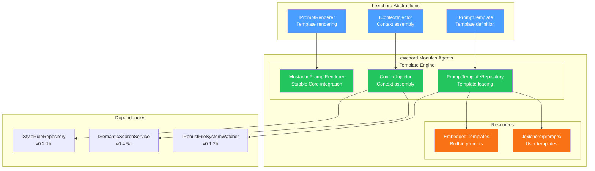
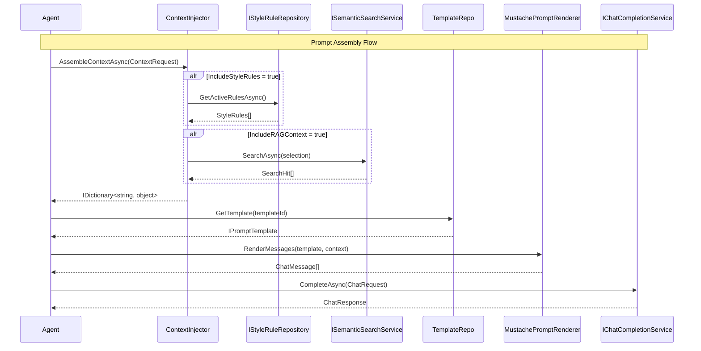

# LCS-SBD-063: Scope Breakdown — The Template Engine

## Document Control

| Field            | Value                            |
| :--------------- | :------------------------------- |
| **Document ID**  | LCS-SBD-063                      |
| **Version**      | v0.6.3                           |
| **Codename**     | The Template Engine              |
| **Status**       | Draft                            |
| **Last Updated** | 2026-01-27                       |
| **Owner**        | Lead Architect                   |
| **Depends On**   | v0.6.1, v0.6.2, v0.2.1b, v0.4.5a |

---

## 1. Executive Summary

### 1.1 The Vision

**v0.6.3** delivers **The Template Engine** — a flexible prompt templating system that dynamically assembles context, style rules, and user instructions into coherent LLM prompts. This release transforms raw user input into sophisticated, context-aware prompts that leverage Lexichord's existing style and RAG infrastructure.

The Template Engine bridges the gap between user intent and effective AI communication. By automatically injecting relevant context—document state, style guidelines, and semantic search results—the engine ensures every AI interaction is informed by the user's established writing conventions and project knowledge.

### 1.2 Business Value

| Stakeholder    | Benefit                                                            |
| :------------- | :----------------------------------------------------------------- |
| **Writers**    | Consistent AI responses that respect their style guides            |
| **Teams**      | Shareable prompt templates for standardized AI-assisted workflows  |
| **Developers** | Extensible templating system for custom prompt engineering         |
| **Enterprise** | Customizable prompt libraries for organizational writing standards |

### 1.3 Success Criteria

This release succeeds when:

1. Prompt templates render variables with Mustache syntax in under 10ms.
2. Users can define custom prompt templates in `.lexichord/prompts/` with hot-reload.
3. Context injection assembles style rules and RAG chunks automatically.
4. Template validation catches missing required variables before LLM invocation.
5. All components integrate with the license gating framework (Teams+ for custom templates).

### 1.4 License Gating

The Template Engine features tier-based access:

| Feature                 | Core | WriterPro | Teams | Enterprise |
| :---------------------- | :--- | :-------- | :---- | :--------- |
| Built-in templates      | —    | ✓         | ✓     | ✓          |
| Style rule injection    | —    | ✓         | ✓     | ✓          |
| RAG context injection   | —    | ✓         | ✓     | ✓          |
| Custom prompt templates | —    | —         | ✓     | ✓          |
| Template hot-reload     | —    | —         | ✓     | ✓          |
| Workspace template sync | —    | —         | —     | ✓          |

---

## 2. Dependencies on Prior Versions

| Component                  | Source Version | Usage in v0.6.3                           |
| :------------------------- | :------------- | :---------------------------------------- |
| `IChatCompletionService`   | v0.6.1a        | Receives rendered messages from templates |
| `ChatMessage`              | v0.6.1a        | Output format for rendered prompts        |
| `ChatRole`                 | v0.6.1a        | Role assignment in rendered messages      |
| `ILLMProviderRegistry`     | v0.6.1c        | Model-aware template rendering            |
| `IStyleRuleRepository`     | v0.2.1b        | Fetch style rules for context injection   |
| `ISemanticSearchService`   | v0.4.5a        | Fetch RAG context for prompts             |
| `IRobustFileSystemWatcher` | v0.1.2b        | Hot-reload for user-defined templates     |
| `ISecureVault`             | v0.0.6a        | Template encryption for Enterprise tier   |
| `ILogger<T>`               | v0.0.3b        | Structured logging                        |
| `IConfiguration`           | v0.0.3d        | Template configuration settings           |
| `ILicenseContext`          | v0.0.4c        | License tier validation                   |

---

## 3. Sub-Part Specifications

### 3.1 v0.6.3a: Template Abstractions

| Field            | Value                    |
| :--------------- | :----------------------- |
| **Sub-Part ID**  | AGT-063a                 |
| **Title**        | Template Abstractions    |
| **Module**       | `Lexichord.Abstractions` |
| **License Tier** | WriterPro                |

**Goal:** Define core interfaces and records for prompt template representation and rendering.

**Key Deliverables:**

- `IPromptTemplate` interface for template definition
- `IPromptRenderer` interface for template rendering
- `PromptTemplate` record implementing `IPromptTemplate`
- `RenderedPrompt` record for render output
- `TemplateVariable` record for variable metadata
- `TemplateValidationException` for validation errors
- Unit tests for all abstractions

**Key Interfaces:**

```csharp
public interface IPromptTemplate
{
    string TemplateId { get; }
    string Name { get; }
    string Description { get; }
    string SystemPromptTemplate { get; }
    string UserPromptTemplate { get; }
    IReadOnlyList<string> RequiredVariables { get; }
    IReadOnlyList<string> OptionalVariables { get; }
}

public interface IPromptRenderer
{
    string Render(string template, IDictionary<string, object> variables);
    ChatMessage[] RenderMessages(IPromptTemplate template, IDictionary<string, object> variables);
    ValidationResult ValidateVariables(IPromptTemplate template, IDictionary<string, object> variables);
}
```

**Design Spec Reference:**

See [LCS-DES-063a](LCS-DES-063a.md) for full specification.

---

### 3.2 v0.6.3b: Mustache Renderer

| Field            | Value                      |
| :--------------- | :------------------------- |
| **Sub-Part ID**  | AGT-063b                   |
| **Title**        | Mustache Renderer          |
| **Module**       | `Lexichord.Modules.Agents` |
| **License Tier** | WriterPro                  |

**Goal:** Implement `IPromptRenderer` using Mustache syntax via the Stubble.Core library.

**Key Deliverables:**

- `MustachePromptRenderer` implementing `IPromptRenderer`
- Support for variables: `{{variable}}`, sections `{{#section}}...{{/section}}`
- Support for inverted sections: `{{^inverted}}...{{/inverted}}`
- Support for partials: `{{> partial_name}}`
- HTML escaping disabled by default for prompt content
- Raw syntax awareness: `{{{raw}}}`
- Benchmark suite for rendering performance
- Unit tests for all Mustache syntax variants

**Key Implementation:**

```csharp
public class MustachePromptRenderer : IPromptRenderer
{
    private readonly StubbleVisitorRenderer _renderer;
    private readonly ILogger<MustachePromptRenderer> _logger;

    public MustachePromptRenderer(ILogger<MustachePromptRenderer> logger)
    {
        _renderer = new StubbleBuilder()
            .Configure(settings => settings.SetIgnoreCaseOnKeyLookup(true))
            .Build();
        _logger = logger;
    }

    public string Render(string template, IDictionary<string, object> variables)
    {
        return _renderer.Render(template, variables);
    }
}
```

**NuGet Package:**

| Package        | Version | Purpose                     |
| :------------- | :------ | :-------------------------- |
| `Stubble.Core` | 1.10.x  | Mustache template rendering |

**Design Spec Reference:**

See [LCS-DES-063b](LCS-DES-063b.md) for full specification.

---

### 3.3 v0.6.3c: Template Repository

| Field            | Value                                 |
| :--------------- | :------------------------------------ |
| **Sub-Part ID**  | AGT-063c                              |
| **Title**        | Template Repository                   |
| **Module**       | `Lexichord.Modules.Agents`            |
| **License Tier** | WriterPro (built-in) / Teams (custom) |

**Goal:** Implement `IPromptTemplateRepository` for loading, caching, and hot-reloading templates.

**Key Deliverables:**

- `IPromptTemplateRepository` interface definition
- `PromptTemplateRepository` implementation
- Built-in templates loaded from embedded resources (YAML format)
- User-defined templates from `.lexichord/prompts/` directory
- Hot-reload on file change using `IRobustFileSystemWatcher`
- Template validation on load (required variables check)
- Template caching with invalidation
- Unit tests for repository operations

**Key Interfaces:**

```csharp
public interface IPromptTemplateRepository
{
    IReadOnlyList<IPromptTemplate> GetAllTemplates();
    IPromptTemplate? GetTemplate(string templateId);
    Task ReloadTemplatesAsync(CancellationToken ct = default);
    event EventHandler<TemplateChangedEventArgs>? TemplateChanged;
}
```

**YAML Template Format:**

```yaml
# Example: .lexichord/prompts/editor.yaml
template_id: "co-pilot-editor"
name: "Co-pilot Editor"
description: "General writing assistance"
system_prompt: |
    You are a writing assistant for technical documentation.
    {{#style_rules}}
    Follow these style rules:
    {{style_rules}}
    {{/style_rules}}
    {{#context}}
    Reference context:
    {{context}}
    {{/context}}
user_prompt: "{{user_input}}"
required_variables: ["user_input"]
optional_variables: ["style_rules", "context"]
```

**Storage Locations:**

- Built-in: Embedded resources in `Lexichord.Modules.Agents.dll`
- User: `{WorkspaceRoot}/.lexichord/prompts/*.yaml`
- Global: `{AppData}/Lexichord/prompts/*.yaml`

**Design Spec Reference:**

See [LCS-DES-063c](LCS-DES-063c.md) for full specification.

---

### 3.4 v0.6.3d: Context Injection Service

| Field            | Value                      |
| :--------------- | :------------------------- |
| **Sub-Part ID**  | AGT-063d                   |
| **Title**        | Context Injection Service  |
| **Module**       | `Lexichord.Modules.Agents` |
| **License Tier** | WriterPro                  |

**Goal:** Implement `IContextInjector` for automatic context assembly from style rules, RAG, and document state.

**Key Deliverables:**

- `IContextInjector` interface definition
- `ContextInjector` implementation
- `ContextRequest` record for assembly configuration
- `ContextResult` record for assembled context
- Integration with `IStyleRuleRepository` (v0.2.1b)
- Integration with `ISemanticSearchService` (v0.4.5a)
- Document context extraction (current file, cursor position, selection)
- Context formatting for template injection
- Caching for repeated context requests
- Unit tests for all injection scenarios

**Key Interfaces:**

```csharp
public interface IContextInjector
{
    Task<IDictionary<string, object>> AssembleContextAsync(
        ContextRequest request,
        CancellationToken ct = default);
}

public record ContextRequest(
    string? CurrentDocumentPath,
    int? CursorPosition,
    string? SelectedText,
    bool IncludeStyleRules,
    bool IncludeRAGContext,
    int MaxRAGChunks = 3
);
```

**Context Assembly Flow:**

```text
START: "Assemble context for prompt"
│
├── CurrentDocumentPath provided?
│   ├── NO → Skip document context
│   └── YES → Extract document metadata
│
├── IncludeStyleRules?
│   ├── NO → Skip style rules
│   └── YES → Fetch from IStyleRuleRepository
│
├── IncludeRAGContext?
│   ├── NO → Skip RAG
│   └── YES → Query ISemanticSearchService with selection/context
│
└── Merge all context into dictionary
```

**Dependencies:**

- v0.6.3a: Template abstractions for context variable types
- v0.2.1b: `IStyleRuleRepository` for style rules
- v0.4.5a: `ISemanticSearchService` for RAG context

**Design Spec Reference:**

See [LCS-DES-063d](LCS-DES-063d.md) for full specification.

---

## 4. Implementation Checklist

| #         | Sub-Part | Task                                                | Est. Hours   |
| :-------- | :------- | :-------------------------------------------------- | :----------- |
| 1         | v0.6.3a  | Define `IPromptTemplate` interface                  | 1            |
| 2         | v0.6.3a  | Define `IPromptRenderer` interface                  | 1            |
| 3         | v0.6.3a  | Create `PromptTemplate` record                      | 0.5          |
| 4         | v0.6.3a  | Create `RenderedPrompt` record                      | 0.5          |
| 5         | v0.6.3a  | Create `TemplateValidationException`                | 0.5          |
| 6         | v0.6.3a  | Unit tests for abstractions                         | 2            |
| 7         | v0.6.3b  | Install Stubble.Core NuGet package                  | 0.5          |
| 8         | v0.6.3b  | Implement `MustachePromptRenderer`                  | 3            |
| 9         | v0.6.3b  | Implement variable rendering                        | 1            |
| 10        | v0.6.3b  | Implement section/inverted section rendering        | 1            |
| 11        | v0.6.3b  | Implement partial support                           | 1            |
| 12        | v0.6.3b  | Implement `RenderMessages` for ChatMessage[]        | 1            |
| 13        | v0.6.3b  | Implement `ValidateVariables`                       | 1            |
| 14        | v0.6.3b  | Unit tests for renderer                             | 3            |
| 15        | v0.6.3b  | Performance benchmarks                              | 1            |
| 16        | v0.6.3c  | Define `IPromptTemplateRepository` interface        | 1            |
| 17        | v0.6.3c  | Create built-in template YAML files                 | 2            |
| 18        | v0.6.3c  | Implement embedded resource loading                 | 2            |
| 19        | v0.6.3c  | Implement user template directory scanning          | 2            |
| 20        | v0.6.3c  | Implement YAML parsing with YamlDotNet              | 2            |
| 21        | v0.6.3c  | Implement template caching                          | 1            |
| 22        | v0.6.3c  | Integrate `IRobustFileSystemWatcher` for hot-reload | 2            |
| 23        | v0.6.3c  | Implement template validation                       | 1            |
| 24        | v0.6.3c  | Unit tests for repository                           | 3            |
| 25        | v0.6.3d  | Define `IContextInjector` interface                 | 1            |
| 26        | v0.6.3d  | Create `ContextRequest` record                      | 0.5          |
| 27        | v0.6.3d  | Implement style rule injection                      | 2            |
| 28        | v0.6.3d  | Implement RAG context injection                     | 2            |
| 29        | v0.6.3d  | Implement document context extraction               | 2            |
| 30        | v0.6.3d  | Implement context caching                           | 1            |
| 31        | v0.6.3d  | Unit tests for context injector                     | 3            |
| 32        | All      | Integration tests for full template pipeline        | 4            |
| 33        | All      | DI registration in AgentsModule.cs                  | 1            |
| **Total** |          |                                                     | **46 hours** |

---

## 5. Dependency Matrix

### 5.1 Required Interfaces (from earlier versions)

| Interface                  | Source Version | Purpose                           |
| :------------------------- | :------------- | :-------------------------------- |
| `IChatCompletionService`   | v0.6.1a        | Target for rendered messages      |
| `ChatMessage`              | v0.6.1a        | Rendered message format           |
| `ChatRole`                 | v0.6.1a        | Message role assignment           |
| `IStyleRuleRepository`     | v0.2.1b        | Style rules for context injection |
| `ISemanticSearchService`   | v0.4.5a        | RAG context retrieval             |
| `IRobustFileSystemWatcher` | v0.1.2b        | Template hot-reload               |
| `ILicenseContext`          | v0.0.4c        | License tier validation           |

### 5.2 New Interfaces (defined in v0.6.3)

| Interface                   | Defined In | Module         | Purpose                      |
| :-------------------------- | :--------- | :------------- | :--------------------------- |
| `IPromptTemplate`           | v0.6.3a    | Abstractions   | Template definition contract |
| `IPromptRenderer`           | v0.6.3a    | Abstractions   | Template rendering contract  |
| `IPromptTemplateRepository` | v0.6.3c    | Modules.Agents | Template storage and loading |
| `IContextInjector`          | v0.6.3d    | Abstractions   | Context assembly contract    |

### 5.3 New Records/DTOs (defined in v0.6.3)

| Record                     | Defined In | Purpose                          |
| :------------------------- | :--------- | :------------------------------- |
| `PromptTemplate`           | v0.6.3a    | Template definition record       |
| `RenderedPrompt`           | v0.6.3a    | Render output with metadata      |
| `TemplateVariable`         | v0.6.3a    | Variable metadata for validation |
| `TemplateChangedEventArgs` | v0.6.3c    | Template change notification     |
| `ContextRequest`           | v0.6.3d    | Context assembly request         |
| `InjectedStyleContext`     | v0.6.3d    | Formatted style rules            |
| `InjectedRAGContext`       | v0.6.3d    | Formatted RAG chunks             |

### 5.4 NuGet Packages

| Package        | Version | Purpose                     | New/Existing |
| :------------- | :------ | :-------------------------- | :----------- |
| `Stubble.Core` | 1.10.x  | Mustache template rendering | New          |
| `YamlDotNet`   | 16.x    | YAML template parsing       | Existing     |

---

## 6. Architecture Diagram



---

## 7. Data Flow Diagram



---

## 8. Risks & Mitigations

| Risk                                      | Impact | Probability | Mitigation                            |
| :---------------------------------------- | :----- | :---------- | :------------------------------------ |
| Mustache syntax conflicts with LLM output | Medium | Medium      | Escape detection, raw syntax support  |
| Template hot-reload race conditions       | Low    | Medium      | Debounce file watcher, atomic swaps   |
| Context assembly timeout with slow RAG    | Medium | Medium      | Configurable timeout, parallel fetch  |
| YAML parsing errors in user templates     | Medium | High        | Validation on load, graceful fallback |
| Template variable name collisions         | Low    | Low         | Namespace prefixes for system vars    |
| Memory growth from template caching       | Low    | Low         | LRU eviction, size limits             |

---

## 9. Success Metrics

| Metric                      | Target  | Measurement                 |
| :-------------------------- | :------ | :-------------------------- |
| Template rendering time     | < 10ms  | Stopwatch timing            |
| Context assembly time       | < 200ms | Stopwatch for style + RAG   |
| Template hot-reload latency | < 500ms | File change to availability |
| Built-in template count     | ≥ 5     | Template registry count     |
| YAML validation pass rate   | 100%    | Schema validation           |

---

## 10. What This Enables

After v0.6.3, Lexichord will support:

- **v0.6.4:** The Chat Interface — Chat panel using rendered templates
- **v0.6.5:** The Stream — Real-time response rendering with template context
- **v0.6.6:** The Co-pilot Agent — Full agent using template engine
- **v0.6.7:** The Document Bridge — Template-driven inline suggestions
- **Future:** Specialized agents with domain-specific templates

---

## 11. User Stories

| ID    | Role            | Story                                                                                                    | Acceptance Criteria                     |
| :---- | :-------------- | :------------------------------------------------------------------------------------------------------- | :-------------------------------------- |
| US-01 | Writer          | As a writer, I want AI prompts to include my style rules so that responses match my writing conventions. | Style rules visible in rendered prompt  |
| US-02 | Writer          | As a writer, I want relevant context from my project included automatically.                             | RAG chunks injected based on selection  |
| US-03 | Team Lead       | As a team lead, I want to create custom prompt templates for my team.                                    | Templates load from .lexichord/prompts/ |
| US-04 | Developer       | As a developer, I want templates to hot-reload when I edit them.                                         | Changes reflect without restart         |
| US-05 | Enterprise User | As an enterprise user, I want template validation before LLM calls.                                      | Missing vars throw before API call      |

---

## 12. Use Cases

### UC-01: Render Prompt with Style Context

**Preconditions:**

- User has style rules defined in workspace
- User has WriterPro or higher license

**Flow:**

1. User initiates AI assistance with text selection.
2. Agent calls `IContextInjector.AssembleContextAsync` with `IncludeStyleRules = true`.
3. Context injector fetches active style rules from `IStyleRuleRepository`.
4. Agent calls `IPromptTemplateRepository.GetTemplate("co-pilot-editor")`.
5. Agent calls `IPromptRenderer.RenderMessages(template, context)`.
6. Renderer substitutes `{{style_rules}}` with formatted rules.
7. Agent sends rendered messages to LLM.

**Postconditions:**

- LLM receives prompt with embedded style rules
- Response follows user's style conventions

### UC-02: Hot-Reload Custom Template

**Preconditions:**

- User is on Teams tier or higher
- Workspace has `.lexichord/prompts/` directory

**Flow:**

1. User creates/edits `custom-reviewer.yaml` in prompts directory.
2. `IRobustFileSystemWatcher` detects file change.
3. `PromptTemplateRepository` parses and validates YAML.
4. Repository updates cached template.
5. Repository raises `TemplateChanged` event.
6. Next agent invocation uses updated template.

**Postconditions:**

- New template available immediately
- Invalid templates logged but don't crash system

---

## 13. Unit Testing Requirements

### 13.1 MustachePromptRenderer Tests

```csharp
[Trait("Category", "Unit")]
[Trait("Version", "v0.6.3b")]
public class MustachePromptRendererTests
{
    [Fact]
    public void Render_WithSimpleVariable_SubstitutesCorrectly()
    {
        // Arrange
        var renderer = new MustachePromptRenderer(NullLogger<MustachePromptRenderer>.Instance);
        var template = "Hello, {{name}}!";
        var variables = new Dictionary<string, object> { ["name"] = "World" };

        // Act
        var result = renderer.Render(template, variables);

        // Assert
        result.Should().Be("Hello, World!");
    }

    [Fact]
    public void Render_WithSection_RendersWhenTruthy()
    {
        // Arrange
        var renderer = new MustachePromptRenderer(NullLogger<MustachePromptRenderer>.Instance);
        var template = "{{#show_rules}}Rules: {{rules}}{{/show_rules}}";
        var variables = new Dictionary<string, object>
        {
            ["show_rules"] = true,
            ["rules"] = "Be concise"
        };

        // Act
        var result = renderer.Render(template, variables);

        // Assert
        result.Should().Be("Rules: Be concise");
    }

    [Fact]
    public void Render_WithMissingOptionalVariable_ReturnsEmpty()
    {
        // Arrange
        var renderer = new MustachePromptRenderer(NullLogger<MustachePromptRenderer>.Instance);
        var template = "{{#context}}Context: {{context}}{{/context}}";
        var variables = new Dictionary<string, object>();

        // Act
        var result = renderer.Render(template, variables);

        // Assert
        result.Should().BeEmpty();
    }
}
```

---

## 14. Observability & Logging

| Level   | Source             | Message Template                                                             |
| :------ | :----------------- | :--------------------------------------------------------------------------- |
| Debug   | PromptRenderer     | `Rendering template {TemplateId} with {VarCount} variables`                  |
| Debug   | ContextInjector    | `Assembling context: StyleRules={IncludeStyle}, RAG={IncludeRAG}`            |
| Info    | TemplateRepository | `Loaded {Count} templates from {Source}`                                     |
| Info    | TemplateRepository | `Template {TemplateId} hot-reloaded`                                         |
| Info    | ContextInjector    | `Context assembled in {ElapsedMs}ms: {RuleCount} rules, {ChunkCount} chunks` |
| Warning | TemplateRepository | `Template validation failed for {Path}: {Error}`                             |
| Warning | ContextInjector    | `RAG context assembly timed out after {TimeoutMs}ms`                         |
| Error   | PromptRenderer     | `Template rendering failed: {Error}`                                         |
| Error   | TemplateRepository | `Failed to parse template {Path}: {Error}`                                   |

---

## 15. UI/UX Specifications

### 15.1 Template Preview (Future: v0.6.4)

```text
┌──────────────────────────────────────────────────────────────────────────┐
│  Template Preview                                        [Validate] [X]  │
├──────────────────────────────────────────────────────────────────────────┤
│  Template: [Co-pilot Editor        ▼]                                    │
├──────────────────────────────────────────────────────────────────────────┤
│  System Prompt:                                                          │
│  ┌─────────────────────────────────────────────────────────────────────┐ │
│  │ You are a writing assistant for technical documentation.            │ │
│  │                                                                     │ │
│  │ Follow these style rules:                                           │ │
│  │ • Use active voice                                                  │ │
│  │ • Avoid jargon                                                      │ │
│  └─────────────────────────────────────────────────────────────────────┘ │
├──────────────────────────────────────────────────────────────────────────┤
│  Variables: user_input (required), style_rules (optional)                │
├──────────────────────────────────────────────────────────────────────────┤
│  Status: ✓ Valid                              Tokens: ~150              │
└──────────────────────────────────────────────────────────────────────────┘
```

---

## 16. Acceptance Criteria (QA)

| #   | Category         | Criterion                                                      |
| :-- | :--------------- | :------------------------------------------------------------- |
| 1   | **Rendering**    | Simple variables render correctly                              |
| 2   | **Rendering**    | Sections render when truthy, hide when falsy                   |
| 3   | **Rendering**    | Inverted sections render when falsy                            |
| 4   | **Rendering**    | Missing optional variables produce empty string                |
| 5   | **Validation**   | Missing required variables throw `TemplateValidationException` |
| 6   | **Repository**   | Built-in templates load from embedded resources                |
| 7   | **Repository**   | User templates load from `.lexichord/prompts/`                 |
| 8   | **Repository**   | Invalid YAML files are logged but don't crash                  |
| 9   | **Hot-Reload**   | Template changes reflect within 500ms                          |
| 10  | **Context**      | Style rules inject when `IncludeStyleRules = true`             |
| 11  | **Context**      | RAG chunks inject when `IncludeRAGContext = true`              |
| 12  | **License Gate** | Custom templates require Teams tier                            |
| 13  | **Performance**  | Template rendering completes in < 10ms                         |
| 14  | **Performance**  | Context assembly completes in < 200ms                          |

---

## 17. Verification Commands

```bash
# ═══════════════════════════════════════════════════════════════════════════
# v0.6.3 Verification
# ═══════════════════════════════════════════════════════════════════════════

# 1. Verify NuGet packages installed
dotnet list src/Lexichord.Modules.Agents package | grep -i stubble

# 2. Build solution
dotnet build

# 3. Run unit tests for v0.6.3 components
dotnet test --filter "Category=Unit&FullyQualifiedName~v0.6.3"

# 4. Run template rendering tests
dotnet test --filter "FullyQualifiedName~MustachePromptRenderer"

# 5. Run template repository tests
dotnet test --filter "FullyQualifiedName~PromptTemplateRepository"

# 6. Run context injection tests
dotnet test --filter "FullyQualifiedName~ContextInjector"

# 7. Run performance benchmarks
dotnet run --project tests/Lexichord.Benchmarks -- --filter "*Template*"

# 8. Manual verification:
# a) Create .lexichord/prompts/test.yaml with valid template
# b) Verify template loads in application
# c) Edit template and verify hot-reload
```

---

## 18. Deliverable Checklist

| #   | Deliverable                                       | Status |
| :-- | :------------------------------------------------ | :----- |
| 1   | `IPromptTemplate` interface in Abstractions       | [ ]    |
| 2   | `IPromptRenderer` interface in Abstractions       | [ ]    |
| 3   | `IPromptTemplateRepository` interface             | [ ]    |
| 4   | `IContextInjector` interface in Abstractions      | [ ]    |
| 5   | `MustachePromptRenderer` implementation           | [ ]    |
| 6   | `PromptTemplateRepository` implementation         | [ ]    |
| 7   | `ContextInjector` implementation                  | [ ]    |
| 8   | Built-in template YAML files (embedded resources) | [ ]    |
| 9   | Unit tests for all components                     | [ ]    |
| 10  | Integration tests for template pipeline           | [ ]    |
| 11  | DI registration in AgentsModule.cs                | [ ]    |
| 12  | Performance benchmarks                            | [ ]    |

---

## 19. Code Examples

### 19.1 IPromptTemplate Interface

```csharp
namespace Lexichord.Abstractions.Contracts;

/// <summary>
/// Defines a prompt template for LLM interactions.
/// </summary>
public interface IPromptTemplate
{
    /// <summary>
    /// Unique identifier for the template.
    /// </summary>
    string TemplateId { get; }

    /// <summary>
    /// Human-readable name for display.
    /// </summary>
    string Name { get; }

    /// <summary>
    /// Description of the template's purpose.
    /// </summary>
    string Description { get; }

    /// <summary>
    /// Mustache template for the system prompt.
    /// </summary>
    string SystemPromptTemplate { get; }

    /// <summary>
    /// Mustache template for the user prompt.
    /// </summary>
    string UserPromptTemplate { get; }

    /// <summary>
    /// Variables that must be provided for rendering.
    /// </summary>
    IReadOnlyList<string> RequiredVariables { get; }

    /// <summary>
    /// Variables that may be provided for rendering.
    /// </summary>
    IReadOnlyList<string> OptionalVariables { get; }
}
```

### 19.2 ContextRequest Record

```csharp
namespace Lexichord.Abstractions.Contracts;

/// <summary>
/// Request for context assembly before prompt rendering.
/// </summary>
/// <param name="CurrentDocumentPath">Path to the active document, if any.</param>
/// <param name="CursorPosition">Cursor offset in the document, if relevant.</param>
/// <param name="SelectedText">Currently selected text for context.</param>
/// <param name="IncludeStyleRules">Whether to inject active style rules.</param>
/// <param name="IncludeRAGContext">Whether to query semantic search for context.</param>
/// <param name="MaxRAGChunks">Maximum RAG chunks to include (default: 3).</param>
public record ContextRequest(
    string? CurrentDocumentPath,
    int? CursorPosition,
    string? SelectedText,
    bool IncludeStyleRules,
    bool IncludeRAGContext,
    int MaxRAGChunks = 3
);
```

---

## 20. Deferred Features

| Feature                  | Deferred To | Reason                             |
| :----------------------- | :---------- | :--------------------------------- |
| Template versioning      | v0.7.x      | Wait for multi-agent architecture  |
| Template marketplace     | v0.9.x      | Requires cloud infrastructure      |
| Visual template editor   | v0.8.x      | Focus on core functionality first  |
| Template A/B testing     | v0.9.x      | Analytics infrastructure not ready |
| Multi-language templates | v0.7.x      | Internationalization phase         |

---

## 21. Changelog Entry

Upon completion of v0.6.3, the following entry will be added to `CHANGELOG.md`:

```markdown
## [0.6.3] - 2026-01-XX

### Added

- **Template Abstractions (v0.6.3a)**: Core interfaces for prompt template definition (`IPromptTemplate`) and rendering (`IPromptRenderer`)
- **Mustache Renderer (v0.6.3b)**: Template rendering using Stubble.Core with full Mustache syntax support including sections, inverted sections, and partials
- **Template Repository (v0.6.3c)**: Built-in and user-defined prompt template loading with YAML format support and hot-reload capability
- **Context Injection Service (v0.6.3d)**: Automatic context assembly from style rules and RAG search results

### Changed

- Prompt assembly now uses structured templates instead of hardcoded prompts

### Dependencies

- Added: Stubble.Core 1.10.x for Mustache template rendering

### Technical

- `IPromptTemplate` abstraction for declarative prompt definition
- `IContextInjector` for automated context retrieval and formatting
- Hot-reload for workspace templates using `IRobustFileSystemWatcher`
```

---

## 22. Version History

| Version | Date       | Author              | Changes       |
| :------ | :--------- | :------------------ | :------------ |
| 0.1     | 2026-01-27 | Documentation Agent | Initial draft |
