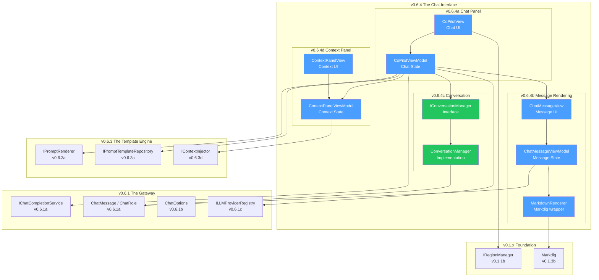
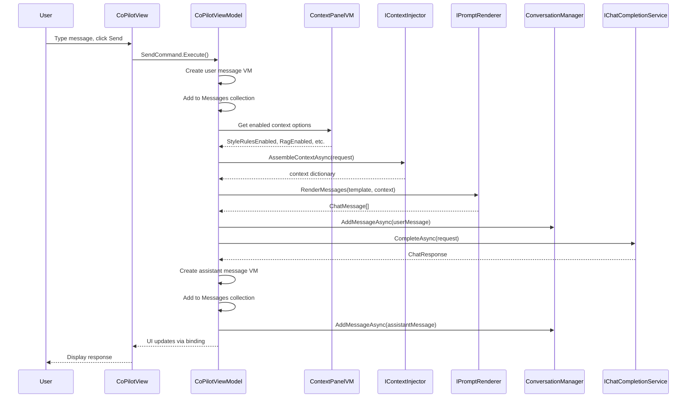
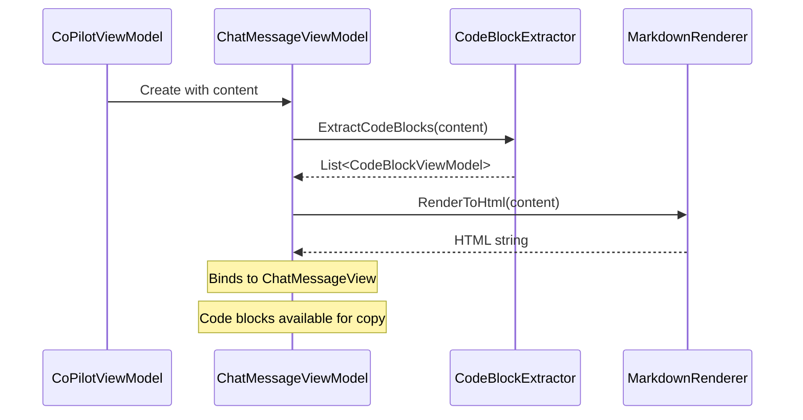
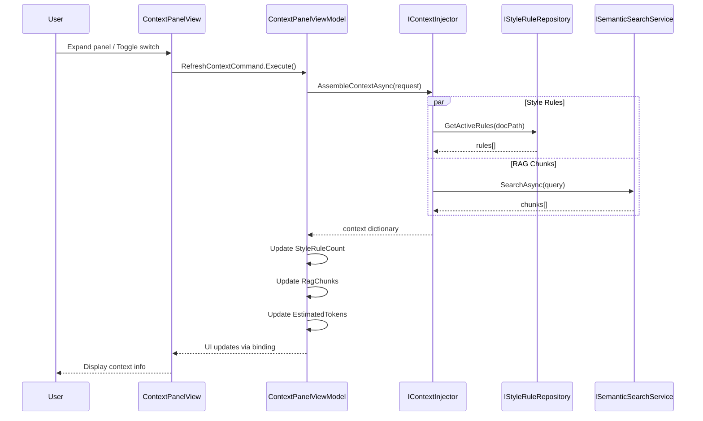

# LCS-DES-064-INDEX: Design Specification Index — The Chat Interface

## Document Control

| Field            | Value                         |
| :--------------- | :---------------------------- |
| **Document ID**  | LCS-DES-064-INDEX             |
| **Version**      | v0.6.4                        |
| **Status**       | Draft                         |
| **Last Updated** | 2026-01-27                    |
| **Author**       | Documentation Agent           |
| **Parent SBD**   | [LCS-SBD-064](LCS-SBD-064.md) |

---

## 1. Overview

**Version 0.6.4 — The Chat Interface** builds the user-facing chat panel for conversational AI assistance. This release transforms the underlying LLM infrastructure (v0.6.1-v0.6.3) into an interactive experience where writers can converse naturally with their AI assistant.

### 1.1 Goals

1. Provide an intuitive chat interface for AI conversations
2. Render rich Markdown responses with syntax-highlighted code
3. Manage conversation lifecycle with export capabilities
4. Display transparent context information to users
5. Integrate with license gating for tiered feature access

### 1.2 Module Structure

```text
Lexichord.Modules.Agents/
├── Chat/
│   ├── Views/
│   │   ├── CoPilotView.axaml              # v0.6.4a: Main chat panel
│   │   ├── CoPilotView.axaml.cs
│   │   ├── ChatMessageView.axaml          # v0.6.4b: Message rendering
│   │   ├── ChatMessageView.axaml.cs
│   │   ├── ContextPanelView.axaml         # v0.6.4d: Context display
│   │   └── ContextPanelView.axaml.cs
│   ├── ViewModels/
│   │   ├── CoPilotViewModel.cs            # v0.6.4a: Chat state
│   │   ├── ChatMessageViewModel.cs        # v0.6.4b: Message state
│   │   ├── CodeBlockViewModel.cs          # v0.6.4b: Code block data
│   │   └── ContextPanelViewModel.cs       # v0.6.4d: Context state
│   ├── Contracts/
│   │   ├── IConversationManager.cs        # v0.6.4c: Conversation interface
│   │   └── ConversationChangedEventArgs.cs
│   ├── Services/
│   │   └── ConversationManager.cs         # v0.6.4c: Implementation
│   ├── Models/
│   │   ├── Conversation.cs                # v0.6.4c: Conversation record
│   │   ├── ConversationMetadata.cs        # v0.6.4c: Metadata record
│   │   └── RagChunkSummary.cs             # v0.6.4d: RAG preview
│   └── Rendering/
│       ├── MarkdownRenderer.cs            # v0.6.4b: Markdig wrapper
│       └── CodeBlockExtractor.cs          # v0.6.4b: Code extraction
```

---

## 2. Sub-Part Index

| Sub-Part ID | Title                   | Design Spec                     | Status |
| :---------- | :---------------------- | :------------------------------ | :----- |
| v0.6.4a     | Chat Panel View         | [LCS-DES-064a](LCS-DES-064a.md) | Draft  |
| v0.6.4b     | Message Rendering       | [LCS-DES-064b](LCS-DES-064b.md) | Draft  |
| v0.6.4c     | Conversation Management | [LCS-DES-064c](LCS-DES-064c.md) | Draft  |
| v0.6.4d     | Context Panel           | [LCS-DES-064d](LCS-DES-064d.md) | Draft  |

---

## 3. Dependency Graph

### 3.1 External Dependencies (Prior Versions)



### 3.2 Internal Dependencies (Within v0.6.4)

| Component               | Depends On               | Purpose                |
| :---------------------- | :----------------------- | :--------------------- |
| `CoPilotView`           | `IRegionManager`         | Panel registration     |
| `CoPilotViewModel`      | `IChatCompletionService` | LLM communication      |
| `CoPilotViewModel`      | `ILLMProviderRegistry`   | Model selection        |
| `CoPilotViewModel`      | `IPromptRenderer`        | Prompt rendering       |
| `CoPilotViewModel`      | `IConversationManager`   | Conversation lifecycle |
| `CoPilotViewModel`      | `ContextPanelViewModel`  | Context integration    |
| `ChatMessageViewModel`  | `MarkdownRenderer`       | Content rendering      |
| `ChatMessageViewModel`  | `ChatRole`               | Role styling           |
| `ContextPanelViewModel` | `IContextInjector`       | Context assembly       |
| `ConversationManager`   | `ChatMessage`            | Message storage        |

---

## 4. Interface Summary

### 4.1 New Interfaces (Defined in v0.6.4)

| Interface              | Module                   | Purpose                | Spec         |
| :--------------------- | :----------------------- | :--------------------- | :----------- |
| `IConversationManager` | Lexichord.Modules.Agents | Conversation lifecycle | LCS-DES-064c |

### 4.2 Key ViewModels

| ViewModel               | Purpose                              | Spec         |
| :---------------------- | :----------------------------------- | :----------- |
| `CoPilotViewModel`      | Chat state and message orchestration | LCS-DES-064a |
| `ChatMessageViewModel`  | Individual message display state     | LCS-DES-064b |
| `ContextPanelViewModel` | Context source display and toggles   | LCS-DES-064d |
| `CodeBlockViewModel`    | Extracted code block data            | LCS-DES-064b |

### 4.3 Key Records

| Record                         | Purpose                     | Spec         |
| :----------------------------- | :-------------------------- | :----------- |
| `Conversation`                 | Conversation data container | LCS-DES-064c |
| `ConversationMetadata`         | Conversation metadata       | LCS-DES-064c |
| `ConversationChangedEventArgs` | Change notification         | LCS-DES-064c |
| `RagChunkSummary`              | RAG context preview         | LCS-DES-064d |

---

## 5. Data Flow Overview

### 5.1 Message Send Flow



### 5.2 Message Rendering Flow



### 5.3 Context Panel Flow



---

## 6. UI Component Layout

### 6.1 Complete Chat Panel Layout

```text
┌──────────────────────────────────────────────────────────────────────────────────┐
│ ┌──────────────────────────────────────────────────────────────────────────────┐ │
│ │  Co-pilot                                                 [OpenAI ▼][gpt-4o▼]│ │ ← Header
│ └──────────────────────────────────────────────────────────────────────────────┘ │
│ ┌──────────────────────────────────────────────────────────────────────────────┐ │
│ │  ▶ Context (5 style rules, 3 chunks)                          [Refresh ↻]   │ │ ← Context Bar (collapsed)
│ └──────────────────────────────────────────────────────────────────────────────┘ │
│ ┌──────────────────────────────────────────────────────────────────────────────┐ │
│ │                                                                              │ │
│ │  ┌────────────────────────────────────────────────────────────────────────┐  │ │
│ │  │ 👤 What is dependency injection?                            2 min ago │  │ │ ← User Message
│ │  └────────────────────────────────────────────────────────────────────────┘  │ │
│ │                                                                              │ │
│ │  ┌────────────────────────────────────────────────────────────────────────┐  │ │
│ │  │ 🤖 Dependency injection (DI) is a design pattern in which an object   │  │ │ ← Assistant Message
│ │  │    receives its dependencies from external sources rather than        │  │ │
│ │  │    creating them itself.                                              │  │ │
│ │  │                                                                        │  │ │
│ │  │    Here's an example:                                                  │  │ │
│ │  │    ┌───────────────────────────────────────────────────────┐  [Copy]  │  │ │ ← Code Block
│ │  │    │ public class OrderService                             │          │  │ │
│ │  │    │ {                                                      │          │  │ │
│ │  │    │     private readonly ILogger _logger;                  │          │  │ │
│ │  │    │     public OrderService(ILogger logger)                │          │  │ │
│ │  │    │     {                                                  │          │  │ │
│ │  │    │         _logger = logger;                              │          │  │ │
│ │  │    │     }                                                  │          │  │ │
│ │  │    │ }                                                      │          │  │ │
│ │  │    └───────────────────────────────────────────────────────┘          │  │ │
│ │  │                                                                        │  │ │
│ │  │    This approach enables...                                Just now   │  │ │
│ │  └────────────────────────────────────────────────────────────────────────┘  │ │
│ │                                                                              │ │
│ └──────────────────────────────────────────────────────────────────────────────┘ │ ← Message List
│ ┌──────────────────────────────────────────────────────────────────────────────┐ │
│ │  Type your message...                                                        │ │ ← Input Area
│ │                                                                              │ │
│ └───────────────────────────────────────────────────────────────────────[⏎]───┘ │
│ ┌──────────────────────────────────────────────────────────────────────────────┐ │
│ │  [New Chat] [Export]                                         ~250 tokens    │ │ ← Footer
│ └──────────────────────────────────────────────────────────────────────────────┘ │
└──────────────────────────────────────────────────────────────────────────────────┘
```

### 6.2 Expanded Context Panel

```text
┌──────────────────────────────────────────────────────────────────────────────────┐
│  ▼ Context                                                      [Refresh ↻]     │
├──────────────────────────────────────────────────────────────────────────────────┤
│                                                                                  │
│  [☑] Style Rules (5 active)                                                     │
│      ┌─────────────────────────────────────────────────────────────────────┐    │
│      │ • Use active voice instead of passive                               │    │
│      │ • Avoid jargon and technical terms unless defined                   │    │
│      │ • Keep sentences under 25 words                                     │    │
│      │ • Use contractions for informal tone                                │    │
│      │ • Address the reader directly as "you"                              │    │
│      └─────────────────────────────────────────────────────────────────────┘    │
│                                                                                  │
│  [☑] RAG Context (3 chunks)                                                     │
│      ┌─────────────────────────────────────────────────────────────────────┐    │
│      │ 📄 docs/api/overview.md                              Score: 0.89    │    │
│      │    "The API provides endpoints for creating, updating, and          │    │
│      │    deleting resources. All endpoints require authentication..."    │    │
│      ├─────────────────────────────────────────────────────────────────────┤    │
│      │ 📄 docs/guides/setup.md                              Score: 0.82    │    │
│      │    "To configure the application, create a settings.json file       │    │
│      │    in the root directory containing your API credentials..."       │    │
│      ├─────────────────────────────────────────────────────────────────────┤    │
│      │ 📄 docs/faq.md                                       Score: 0.76    │    │
│      │    "Common questions about the API include rate limits,             │    │
│      │    authentication methods, and error handling strategies..."       │    │
│      └─────────────────────────────────────────────────────────────────────┘    │
│                                                                                  │
│  [☑] Document Context                                                           │
│      ┌─────────────────────────────────────────────────────────────────────┐    │
│      │ 📝 architecture.md                                                  │    │
│      │    Path: /project/docs/architecture.md                              │    │
│      │    Size: 15.2 KB | Modified: 2 hours ago                           │    │
│      └─────────────────────────────────────────────────────────────────────┘    │
│                                                                                  │
├──────────────────────────────────────────────────────────────────────────────────┤
│  Estimated context tokens: ~450                                                 │
└──────────────────────────────────────────────────────────────────────────────────┘
```

---

## 7. Testing Summary

### 7.1 Unit Tests by Sub-Part

| Sub-Part | Test Class                   | Test Count | Coverage Target |
| :------- | :--------------------------- | :--------- | :-------------- |
| v0.6.4a  | `CoPilotViewModelTests`      | ~15        | 85%             |
| v0.6.4b  | `ChatMessageViewModelTests`  | ~12        | 85%             |
| v0.6.4b  | `MarkdownRendererTests`      | ~8         | 90%             |
| v0.6.4b  | `CodeBlockExtractorTests`    | ~10        | 95%             |
| v0.6.4c  | `ConversationManagerTests`   | ~12        | 90%             |
| v0.6.4d  | `ContextPanelViewModelTests` | ~10        | 85%             |

### 7.2 Key Test Scenarios

| Scenario                                | Sub-Part | Priority |
| :-------------------------------------- | :------- | :------- |
| Send message and receive response       | v0.6.4a  | Critical |
| CanSend guards prevent invalid sends    | v0.6.4a  | Critical |
| Model selector updates available models | v0.6.4a  | High     |
| Markdown renders correctly              | v0.6.4b  | Critical |
| Code blocks extracted from content      | v0.6.4b  | Critical |
| Relative time formats correctly         | v0.6.4b  | Medium   |
| Copy copies to clipboard                | v0.6.4b  | High     |
| New conversation clears history         | v0.6.4c  | Critical |
| Export produces valid Markdown          | v0.6.4c  | High     |
| Auto-title generated from first message | v0.6.4c  | Medium   |
| History truncates at max length         | v0.6.4c  | Medium   |
| Context toggles affect next message     | v0.6.4d  | High     |
| Token estimation updates on toggle      | v0.6.4d  | Medium   |
| Context refresh updates display         | v0.6.4d  | High     |

---

## 8. DI Registration

```csharp
// In AgentsModule.cs

public static class AgentsModule
{
    public static IServiceCollection AddAgentsModule(
        this IServiceCollection services)
    {
        // v0.6.4a: Chat Panel
        services.AddTransient<CoPilotView>();
        services.AddTransient<CoPilotViewModel>();

        // v0.6.4b: Message Rendering
        services.AddTransient<ChatMessageView>();
        services.AddTransient<ChatMessageViewModel>();
        services.AddSingleton<MarkdownRenderer>();
        services.AddSingleton<CodeBlockExtractor>();

        // v0.6.4c: Conversation Management
        services.AddSingleton<IConversationManager, ConversationManager>();

        // v0.6.4d: Context Panel
        services.AddTransient<ContextPanelView>();
        services.AddTransient<ContextPanelViewModel>();

        return services;
    }

    public static void RegisterRegions(IRegionManager regionManager)
    {
        // Register Co-pilot in right sidebar
        regionManager.RegisterViewWithRegion(
            ShellRegion.Right,
            typeof(CoPilotView));
    }
}
```

---

## 9. License Gating

### 9.1 Feature Access Matrix

| Feature                   | Core | WriterPro | Teams | Enterprise |
| :------------------------ | :--- | :-------- | :---- | :--------- |
| Chat panel visibility     | —    | ✓         | ✓     | ✓          |
| Send messages             | —    | ✓         | ✓     | ✓          |
| Markdown rendering        | —    | ✓         | ✓     | ✓          |
| Code block highlighting   | —    | ✓         | ✓     | ✓          |
| Model selector            | —    | ✓         | ✓     | ✓          |
| Context panel             | —    | ✓         | ✓     | ✓          |
| Export conversation       | —    | ✓         | ✓     | ✓          |
| Multiple conversations    | —    | —         | ✓     | ✓          |
| Conversation history      | —    | —         | —     | ✓          |
| Team conversation sharing | —    | —         | —     | ✓          |

### 9.2 Gating Implementation

```csharp
// CoPilotViewModel constructor
public CoPilotViewModel(
    ILicenseContext license,
    // ... other dependencies
)
{
    _license = license;

    // Check license on initialization
    if (!_license.HasFeature(FeatureFlags.Agents.CoPilot))
    {
        throw new LicenseRequiredException(
            FeatureFlags.Agents.CoPilot,
            LicenseTier.WriterPro);
    }
}

// Region registration with license check
public static void RegisterRegions(
    IRegionManager regionManager,
    ILicenseContext license)
{
    if (license.HasFeature(FeatureFlags.Agents.CoPilot))
    {
        regionManager.RegisterViewWithRegion(
            ShellRegion.Right,
            typeof(CoPilotView));
    }
}
```

---

## 10. Related Documents

### 10.1 Prior Versions

| Version | Title               | Relevance                |
| :------ | :------------------ | :----------------------- |
| v0.6.1  | The Gateway         | LLM abstraction layer    |
| v0.6.2  | The Providers       | Provider implementations |
| v0.6.3  | The Template Engine | Prompt rendering         |
| v0.1.1b | Shell Regions       | Panel registration       |
| v0.1.3b | Editor (Markdig)    | Markdown rendering       |

### 10.2 Future Versions

| Version | Title               | Builds Upon                 |
| :------ | :------------------ | :-------------------------- |
| v0.6.5  | The Stream          | Streaming in chat panel     |
| v0.6.6  | The Co-pilot Agent  | Full agent implementation   |
| v0.6.7  | The Document Bridge | Editor integration          |
| v0.7.x  | The Specialists     | Multiple specialized agents |

---

## 11. Quick Reference

### 11.1 Key Files

| File                       | Purpose                      |
| :------------------------- | :--------------------------- |
| `CoPilotView.axaml`        | Main chat panel UI           |
| `CoPilotViewModel.cs`      | Chat state management        |
| `ChatMessageView.axaml`    | Individual message display   |
| `ChatMessageViewModel.cs`  | Message state with rendering |
| `IConversationManager.cs`  | Conversation contract        |
| `ConversationManager.cs`   | Conversation implementation  |
| `ContextPanelView.axaml`   | Context display panel        |
| `ContextPanelViewModel.cs` | Context state management     |

### 11.2 Key Commands

```bash
# Build
dotnet build

# Test all v0.6.4 components
dotnet test --filter "FullyQualifiedName~v0.6.4"

# Test specific sub-part
dotnet test --filter "FullyQualifiedName~CoPilotViewModel"
dotnet test --filter "FullyQualifiedName~ChatMessageViewModel"
dotnet test --filter "FullyQualifiedName~ConversationManager"
dotnet test --filter "FullyQualifiedName~ContextPanelViewModel"
```

---

## 12. Changelog

| Date       | Version | Description   |
| :--------- | :------ | :------------ |
| 2026-01-27 | 1.0     | Initial draft |

---
