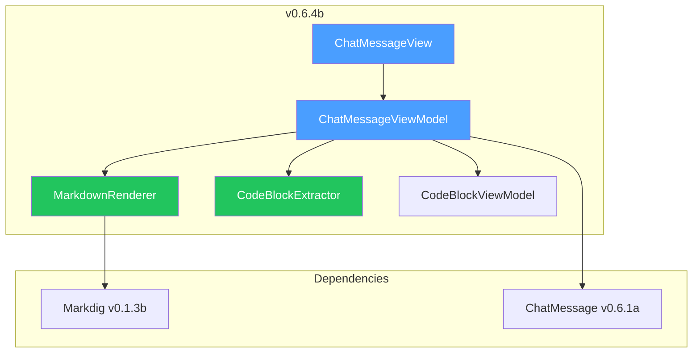

# LCS-DES-064b: Design Specification — Message Rendering

## 1. Metadata & Categorization

| Field           | Value                                     |
| :-------------- | :---------------------------------------- |
| **Document ID** | LCS-DES-064b                              |
| **Version**     | v0.6.4b                                   |
| **Status**      | Draft                                     |
| **Category**    | UI/UX                                     |
| **Module**      | Lexichord.Modules.Agents                  |
| **Created**     | 2026-01-27                                |
| **Author**      | Documentation Agent                       |
| **Parent**      | [LCS-DES-064-INDEX](LCS-DES-064-INDEX.md) |

---

## 2. Executive Summary

### 2.1 The Requirement

AI responses contain rich content including Markdown formatting, code blocks, and lists. Plain text display loses valuable formatting and makes code difficult to read and copy.

### 2.2 The Proposed Solution

Create `ChatMessageView` UserControl with:

- **Role-specific Styling**: Different colors/layouts for User, Assistant, System
- **Markdown Rendering**: Full Markdown support via Markdig
- **Code Block Highlighting**: Syntax highlighting with language detection
- **Copy Functionality**: Copy buttons for code blocks and full responses
- **Relative Timestamps**: Human-readable time display ("2 minutes ago")

---

## 3. Architecture

### 3.1 Component Placement

```text
Lexichord.Modules.Agents/
└── Chat/
    ├── Views/
    │   ├── ChatMessageView.axaml
    │   └── ChatMessageView.axaml.cs
    ├── ViewModels/
    │   ├── ChatMessageViewModel.cs
    │   └── CodeBlockViewModel.cs
    └── Rendering/
        ├── MarkdownRenderer.cs
        └── CodeBlockExtractor.cs
```

### 3.2 Dependency Graph



---

## 4. Data Contract

### 4.1 ChatMessageViewModel

```csharp
namespace Lexichord.Modules.Agents.Chat.ViewModels;

/// <summary>
/// ViewModel representing a single chat message in the conversation.
/// Handles Markdown rendering, code block extraction, and copy operations.
/// </summary>
/// <remarks>
/// <para>
/// This ViewModel provides:
/// </para>
/// <list type="bullet">
///   <item>Role-based styling context for User, Assistant, System messages</item>
///   <item>Lazy Markdown rendering with HTML caching</item>
///   <item>Code block extraction with syntax highlighting support</item>
///   <item>Relative timestamp display with automatic updates</item>
///   <item>Clipboard operations for copying content</item>
/// </list>
/// <para>
/// The rendering is lazy-evaluated and cached to avoid re-processing
/// on each UI binding access. Cache is invalidated when content changes
/// (e.g., during streaming).
/// </para>
/// </remarks>
public partial class ChatMessageViewModel : ObservableObject, IDisposable
{
    #region Dependencies

    private readonly MarkdownRenderer _renderer;
    private readonly CodeBlockExtractor _extractor;
    private readonly IClipboardService _clipboard;
    private readonly ILogger<ChatMessageViewModel> _logger;

    #endregion

    #region Private State

    private string? _cachedHtml;
    private IReadOnlyList<CodeBlockViewModel>? _cachedCodeBlocks;
    private readonly DispatcherTimer _relativeTimeTimer;
    private bool _disposed;

    #endregion

    #region Observable Properties

    /// <summary>
    /// Unique identifier for this message.
    /// </summary>
    public Guid MessageId { get; init; } = Guid.NewGuid();

    /// <summary>
    /// The role of the message sender (User, Assistant, or System).
    /// </summary>
    /// <remarks>
    /// Role determines:
    /// <list type="bullet">
    ///   <item>Visual styling (background color, alignment)</item>
    ///   <item>Avatar/icon displayed</item>
    ///   <item>Position in the chat layout (left/right alignment)</item>
    /// </list>
    /// </remarks>
    public ChatRole Role { get; init; }

    /// <summary>
    /// The raw Markdown content of the message.
    /// </summary>
    /// <remarks>
    /// When this property changes (e.g., during streaming), the cached
    /// <see cref="RenderedHtml"/> and <see cref="CodeBlocks"/> are invalidated
    /// and will be re-computed on next access.
    /// </remarks>
    [ObservableProperty]
    private string _content = string.Empty;

    /// <summary>
    /// When the message was created.
    /// </summary>
    [ObservableProperty]
    private DateTime _timestamp = DateTime.Now;

    /// <summary>
    /// Indicates whether this message is currently being streamed from the LLM.
    /// </summary>
    /// <remarks>
    /// When true, the UI shows:
    /// <list type="bullet">
    ///   <item>A typing indicator animation</item>
    ///   <item>Partial content that updates in real-time</item>
    ///   <item>No copy buttons (until streaming completes)</item>
    /// </list>
    /// </remarks>
    [ObservableProperty]
    private bool _isStreaming;

    /// <summary>
    /// Indicates whether this message has been successfully copied.
    /// Used to show temporary "Copied!" feedback.
    /// </summary>
    [ObservableProperty]
    private bool _isCopied;

    /// <summary>
    /// Error message if rendering failed, otherwise null.
    /// </summary>
    [ObservableProperty]
    private string? _renderError;

    #endregion

    #region Computed Properties

    /// <summary>
    /// Relative time display ("Just now", "2 minutes ago", etc.)
    /// </summary>
    /// <remarks>
    /// This property is automatically refreshed every minute via a timer.
    /// </remarks>
    public string RelativeTime => FormatRelativeTime(Timestamp);

    /// <summary>
    /// Rendered HTML from Markdown content.
    /// </summary>
    /// <remarks>
    /// The HTML is cached after first access. Cache is invalidated when
    /// <see cref="Content"/> changes. If rendering fails, returns escaped
    /// plain text and sets <see cref="RenderError"/>.
    /// </remarks>
    public string RenderedHtml
    {
        get
        {
            if (_cachedHtml is not null)
                return _cachedHtml;

            try
            {
                _cachedHtml = _renderer.Render(Content);
                RenderError = null;
            }
            catch (Exception ex)
            {
                _logger.LogWarning(ex, "Markdown rendering failed for message {MessageId}", MessageId);
                _cachedHtml = WebUtility.HtmlEncode(Content);
                RenderError = "Failed to render Markdown";
            }

            return _cachedHtml;
        }
    }

    /// <summary>
    /// Extracted code blocks from content.
    /// </summary>
    public IReadOnlyList<CodeBlockViewModel> CodeBlocks =>
        _cachedCodeBlocks ??= _extractor.Extract(Content, MessageId);

    /// <summary>
    /// Whether this message contains any code blocks.
    /// </summary>
    public bool HasCodeBlocks => CodeBlocks.Count > 0;

    /// <summary>
    /// Total number of code blocks in this message.
    /// </summary>
    public int CodeBlockCount => CodeBlocks.Count;

    /// <summary>
    /// Estimated word count for display purposes.
    /// </summary>
    public int WordCount => string.IsNullOrWhiteSpace(Content)
        ? 0
        : Content.Split(new[] { ' ', '\n', '\r' }, StringSplitOptions.RemoveEmptyEntries).Length;

    #endregion

    #region Constructor

    /// <summary>
    /// Initializes a new instance of <see cref="ChatMessageViewModel"/>.
    /// </summary>
    /// <param name="renderer">Markdown renderer service.</param>
    /// <param name="extractor">Code block extraction service.</param>
    /// <param name="clipboard">Clipboard service for copy operations.</param>
    /// <param name="logger">Logger instance.</param>
    public ChatMessageViewModel(
        MarkdownRenderer renderer,
        CodeBlockExtractor extractor,
        IClipboardService clipboard,
        ILogger<ChatMessageViewModel> logger)
    {
        _renderer = renderer ?? throw new ArgumentNullException(nameof(renderer));
        _extractor = extractor ?? throw new ArgumentNullException(nameof(extractor));
        _clipboard = clipboard ?? throw new ArgumentNullException(nameof(clipboard));
        _logger = logger ?? throw new ArgumentNullException(nameof(logger));

        // Set up timer for relative time updates
        _relativeTimeTimer = new DispatcherTimer
        {
            Interval = TimeSpan.FromMinutes(1)
        };
        _relativeTimeTimer.Tick += OnRelativeTimeTimerTick;
        _relativeTimeTimer.Start();
    }

    /// <summary>
    /// Design-time constructor for XAML previewer.
    /// </summary>
    public ChatMessageViewModel()
        : this(
            new MarkdownRenderer(NullLogger<MarkdownRenderer>.Instance),
            new CodeBlockExtractor(),
            new DesignClipboardService(),
            NullLogger<ChatMessageViewModel>.Instance)
    {
    }

    #endregion

    #region Commands

    /// <summary>
    /// Copies the full message content to clipboard.
    /// </summary>
    [RelayCommand]
    private async Task CopyContentAsync()
    {
        try
        {
            await _clipboard.SetTextAsync(Content);
            IsCopied = true;

            _logger.LogDebug(
                "Message content copied to clipboard: {Length} chars",
                Content.Length);

            // Reset copied state after 2 seconds
            await Task.Delay(TimeSpan.FromSeconds(2));
            IsCopied = false;
        }
        catch (Exception ex)
        {
            _logger.LogError(ex, "Failed to copy content to clipboard");
        }
    }

    /// <summary>
    /// Copies a specific code block to clipboard.
    /// </summary>
    [RelayCommand]
    private async Task CopyCodeBlockAsync(CodeBlockViewModel block)
    {
        if (block is null)
        {
            _logger.LogWarning("CopyCodeBlockAsync called with null block");
            return;
        }

        try
        {
            await _clipboard.SetTextAsync(block.Code);
            block.IsCopied = true;

            _logger.LogDebug(
                "Code block copied to clipboard: {Language}, {Lines} lines",
                block.Language, block.LineCount);

            // Reset copied state after 2 seconds
            await Task.Delay(TimeSpan.FromSeconds(2));
            block.IsCopied = false;
        }
        catch (Exception ex)
        {
            _logger.LogError(ex, "Failed to copy code block to clipboard");
        }
    }

    #endregion

    #region Private Methods

    /// <summary>
    /// Called when content changes to invalidate caches.
    /// </summary>
    partial void OnContentChanged(string value)
    {
        _cachedHtml = null;
        _cachedCodeBlocks = null;
        RenderError = null;

        OnPropertyChanged(nameof(RenderedHtml));
        OnPropertyChanged(nameof(CodeBlocks));
        OnPropertyChanged(nameof(HasCodeBlocks));
        OnPropertyChanged(nameof(CodeBlockCount));
        OnPropertyChanged(nameof(WordCount));

        _logger.LogTrace(
            "Content changed for message {MessageId}: {Length} chars",
            MessageId, value.Length);
    }

    private void OnRelativeTimeTimerTick(object? sender, EventArgs e)
    {
        OnPropertyChanged(nameof(RelativeTime));
    }

    private static string FormatRelativeTime(DateTime timestamp)
    {
        var elapsed = DateTime.Now - timestamp;

        return elapsed.TotalSeconds switch
        {
            < 0 => "In the future", // Handle clock skew
            < 5 => "Just now",
            < 60 => $"{(int)elapsed.TotalSeconds} seconds ago",
            < 120 => "1 minute ago",
            < 3600 => $"{(int)elapsed.TotalMinutes} minutes ago",
            < 7200 => "1 hour ago",
            < 86400 => $"{(int)elapsed.TotalHours} hours ago",
            < 172800 => "Yesterday",
            < 604800 => $"{(int)elapsed.TotalDays} days ago",
            < 2592000 => $"{(int)(elapsed.TotalDays / 7)} weeks ago",
            _ => timestamp.ToString("MMM d, yyyy")
        };
    }

    #endregion

    #region IDisposable

    /// <inheritdoc />
    public void Dispose()
    {
        if (_disposed) return;

        _relativeTimeTimer.Stop();
        _relativeTimeTimer.Tick -= OnRelativeTimeTimerTick;

        _disposed = true;
    }

    #endregion
}
```

### 4.2 CodeBlockViewModel

````csharp
namespace Lexichord.Modules.Agents.Chat.ViewModels;

/// <summary>
/// Represents an extracted code block from a chat message.
/// </summary>
/// <remarks>
/// <para>
/// Code blocks are extracted from Markdown fenced code syntax:
/// </para>
/// <code>
/// ```language
/// code content here
/// ```
/// </code>
/// <para>
/// This ViewModel provides display-friendly properties for rendering
/// code blocks with syntax highlighting and copy functionality.
/// </para>
/// </remarks>
public class CodeBlockViewModel : ObservableObject
{
    /// <summary>
    /// The language identifier from the code fence (e.g., "csharp", "js").
    /// </summary>
    public string Language { get; init; } = string.Empty;

    /// <summary>
    /// The raw code content without the fence markers.
    /// </summary>
    public string Code { get; init; } = string.Empty;

    /// <summary>
    /// Start index in the parent message content.
    /// </summary>
    public int StartIndex { get; init; }

    /// <summary>
    /// End index in the parent message content.
    /// </summary>
    public int EndIndex { get; init; }

    /// <summary>
    /// ID of the parent message containing this code block.
    /// </summary>
    public Guid ParentMessageId { get; init; }

    /// <summary>
    /// Zero-based index of this code block within the parent message.
    /// </summary>
    public int BlockIndex { get; init; }

    /// <summary>
    /// Indicates whether this code block has been copied to clipboard.
    /// Used for temporary "Copied!" UI feedback.
    /// </summary>
    [ObservableProperty]
    private bool _isCopied;

    /// <summary>
    /// Display name for the language (e.g., "C#" instead of "csharp").
    /// </summary>
    /// <remarks>
    /// Provides human-friendly language names for common programming languages.
    /// Falls back to uppercase language identifier for unknown languages.
    /// </remarks>
    public string LanguageDisplayName => Language.ToLowerInvariant() switch
    {
        "csharp" or "cs" or "c#" => "C#",
        "javascript" or "js" => "JavaScript",
        "typescript" or "ts" => "TypeScript",
        "python" or "py" => "Python",
        "xml" or "xaml" or "axaml" => "XML",
        "json" => "JSON",
        "bash" or "sh" or "shell" or "zsh" => "Shell",
        "powershell" or "ps" or "ps1" => "PowerShell",
        "sql" or "tsql" or "plsql" => "SQL",
        "html" or "htm" => "HTML",
        "css" or "scss" or "sass" or "less" => "CSS",
        "yaml" or "yml" => "YAML",
        "markdown" or "md" => "Markdown",
        "rust" or "rs" => "Rust",
        "go" or "golang" => "Go",
        "java" => "Java",
        "kotlin" or "kt" => "Kotlin",
        "swift" => "Swift",
        "ruby" or "rb" => "Ruby",
        "php" => "PHP",
        "cpp" or "c++" => "C++",
        "c" => "C",
        "fsharp" or "fs" or "f#" => "F#",
        "dockerfile" => "Dockerfile",
        "text" or "txt" or "" or null => "Plain Text",
        _ => Language.ToUpperInvariant()
    };

    /// <summary>
    /// Line count for display in UI.
    /// </summary>
    public int LineCount => string.IsNullOrEmpty(Code)
        ? 0
        : Code.Count(c => c == '\n') + 1;

    /// <summary>
    /// Character count for display in UI.
    /// </summary>
    public int CharacterCount => Code?.Length ?? 0;

    /// <summary>
    /// Returns true if this is a short code block (fits in one line or less).
    /// </summary>
    public bool IsInline => LineCount == 1 && CharacterCount < 80;

    /// <summary>
    /// Returns the first line of code for preview purposes.
    /// </summary>
    public string PreviewLine
    {
        get
        {
            if (string.IsNullOrEmpty(Code)) return string.Empty;

            var firstNewline = Code.IndexOf('\n');
            var firstLine = firstNewline > 0 ? Code[..firstNewline] : Code;

            return firstLine.Length > 60
                ? firstLine[..57] + "..."
                : firstLine;
        }
    }
}
````

### 4.3 MarkdownRenderer

```csharp
namespace Lexichord.Modules.Agents.Chat.Rendering;

public class MarkdownRenderer
{
    private readonly MarkdownPipeline _pipeline;
    private readonly ILogger<MarkdownRenderer> _logger;

    public MarkdownRenderer(ILogger<MarkdownRenderer> logger)
    {
        _logger = logger;

        _pipeline = new MarkdownPipelineBuilder()
            .UseAdvancedExtensions()
            .UseSyntaxHighlighting()
            .DisableHtml() // Security: prevent raw HTML injection
            .Build();
    }

    public string Render(string markdown)
    {
        if (string.IsNullOrEmpty(markdown))
            return string.Empty;

        try
        {
            return Markdown.ToHtml(markdown, _pipeline);
        }
        catch (Exception ex)
        {
            _logger.LogWarning(ex, "Markdown rendering failed, returning escaped text");
            return WebUtility.HtmlEncode(markdown);
        }
    }
}
```

### 4.4 CodeBlockExtractor

````csharp
namespace Lexichord.Modules.Agents.Chat.Rendering;

public class CodeBlockExtractor
{
    private static readonly Regex CodeBlockRegex = new(
        @"```(\w*)\r?\n([\s\S]*?)```",
        RegexOptions.Compiled);

    public IReadOnlyList<CodeBlockViewModel> Extract(string content)
    {
        if (string.IsNullOrEmpty(content))
            return Array.Empty<CodeBlockViewModel>();

        var blocks = new List<CodeBlockViewModel>();

        foreach (Match match in CodeBlockRegex.Matches(content))
        {
            var language = match.Groups[1].Value.ToLowerInvariant();
            var code = match.Groups[2].Value.TrimEnd();

            blocks.Add(new CodeBlockViewModel(
                Language: language,
                Code: code,
                StartIndex: match.Index,
                EndIndex: match.Index + match.Length
            ));
        }

        return blocks.AsReadOnly();
    }
}
````

---

## 5. UI/UX Specifications

### 5.1 Role Styling

| Role      | Background            | Alignment | Avatar   | Text Color         | Border Color         |
| :-------- | :-------------------- | :-------- | :------- | :----------------- | :------------------- |
| User      | `Brush.Surface.User`  | Right     | 👤 User  | `Color.Text`       | `Color.Border.User`  |
| Assistant | `Brush.Surface.AI`    | Left      | 🤖 Robot | `Color.Text`       | `Color.Border.AI`    |
| System    | `Brush.Surface.Muted` | Center    | ⚙️ Gear  | `Color.Text.Muted` | None                 |
| Error     | `Brush.Surface.Error` | Center    | ⚠️ Warn  | `Color.Text.Error` | `Color.Border.Error` |

### 5.2 Message Layout

```text
User Message (Right-aligned):
┌────────────────────────────────────────────────────────────────────────┐
│                                            ┌─────────────────────────┐ │
│                                            │ 👤  What is DI?         │ │
│                                            │                         │ │
│                                            │              2 min ago  │ │
│                                            └─────────────────────────┘ │
└────────────────────────────────────────────────────────────────────────┘

Assistant Message (Left-aligned):
┌────────────────────────────────────────────────────────────────────────┐
│ ┌───────────────────────────────────────────────────────────────────┐  │
│ │ 🤖  Dependency injection is a design pattern...                   │  │
│ │                                                                   │  │
│ │     ┌──────────────────────────────────────────────────────────┐  │  │
│ │     │ C# ▾                                        📋 Copy      │  │  │
│ │     ├──────────────────────────────────────────────────────────┤  │  │
│ │     │ public class Service {                                   │  │  │
│ │     │     private readonly ILogger _logger;                    │  │  │
│ │     │ }                                                        │  │  │
│ │     └──────────────────────────────────────────────────────────┘  │  │
│ │                                                                   │  │
│ │ Just now                                               [Copy All] │  │
│ └───────────────────────────────────────────────────────────────────┘  │
└────────────────────────────────────────────────────────────────────────┘

System Message (Center-aligned):
┌────────────────────────────────────────────────────────────────────────┐
│               ┌──────────────────────────────────────┐                 │
│               │ ⚙️  Context loaded: 3 documents       │                 │
│               │                           Just now   │                 │
│               └──────────────────────────────────────┘                 │
└────────────────────────────────────────────────────────────────────────┘
```

### 5.3 Color Palette

```css
/* Light Theme */
:root[data-theme="light"] {
    --surface-user: #e3f2fd; /* Light blue for user messages */
    --surface-ai: #f3e5f5; /* Light purple for AI messages */
    --surface-system: #eceff1; /* Light gray for system messages */
    --surface-error: #ffebee; /* Light red for errors */
    --surface-code: #263238; /* Dark background for code blocks */

    --border-user: #90caf9;
    --border-ai: #ce93d8;
    --border-error: #ef9a9a;

    --text-code: #e0e0e0;
}

/* Dark Theme */
:root[data-theme="dark"] {
    --surface-user: #1a237e; /* Dark blue for user messages */
    --surface-ai: #311b92; /* Dark purple for AI messages */
    --surface-system: #212121; /* Dark gray for system messages */
    --surface-error: #b71c1c; /* Dark red for errors */
    --surface-code: #1e1e1e; /* VS Code-like dark background */

    --border-user: #3949ab;
    --border-ai: #5e35b1;
    --border-error: #c62828;

    --text-code: #d4d4d4;
}
```

### 5.4 ChatMessageView.axaml

```xml
<UserControl x:Class="Lexichord.Modules.Agents.Chat.Views.ChatMessageView"
             xmlns="https://github.com/avaloniaui"
             xmlns:x="http://schemas.microsoft.com/winfx/2006/xaml"
             xmlns:vm="using:Lexichord.Modules.Agents.Chat.ViewModels"
             xmlns:converters="using:Lexichord.Modules.Agents.Chat.Converters"
             xmlns:markdown="using:Lexichord.Controls.Markdown"
             x:DataType="vm:ChatMessageViewModel">

    <UserControl.Resources>
        <converters:RoleToBoolConverter x:Key="RoleToUserConverter" TargetRole="User"/>
        <converters:RoleToBoolConverter x:Key="RoleToAssistantConverter" TargetRole="Assistant"/>
        <converters:RoleToBoolConverter x:Key="RoleToSystemConverter" TargetRole="System"/>
        <converters:RoleToEmojiConverter x:Key="RoleToEmojiConverter"/>
        <converters:RoleToAlignmentConverter x:Key="RoleToAlignmentConverter"/>
        <converters:BoolToVisibilityConverter x:Key="BoolToVisibility"/>
    </UserControl.Resources>

    <!-- Message Container with role-based alignment -->
    <Border HorizontalAlignment="{Binding Role, Converter={StaticResource RoleToAlignmentConverter}}"
            MaxWidth="600"
            Margin="8,4">

        <!-- Role-styled message bubble -->
        <Border Classes.user="{Binding Role, Converter={StaticResource RoleToUserConverter}}"
                Classes.assistant="{Binding Role, Converter={StaticResource RoleToAssistantConverter}}"
                Classes.system="{Binding Role, Converter={StaticResource RoleToSystemConverter}}"
                Classes="chat-message"
                Padding="12"
                CornerRadius="12"
                BoxShadow="0 2 4 0 #20000000">

            <Grid RowDefinitions="Auto,*,Auto,Auto">

                <!-- Header: Avatar, role label, and streaming indicator -->
                <Grid Grid.Row="0"
                      ColumnDefinitions="Auto,*,Auto"
                      Margin="0,0,0,8">

                    <!-- Avatar -->
                    <Border Grid.Column="0"
                            Width="28" Height="28"
                            CornerRadius="14"
                            Background="{DynamicResource AvatarBackgroundBrush}"
                            Margin="0,0,8,0">
                        <TextBlock Text="{Binding Role, Converter={StaticResource RoleToEmojiConverter}}"
                                   FontSize="14"
                                   HorizontalAlignment="Center"
                                   VerticalAlignment="Center"/>
                    </Border>

                    <!-- Role label -->
                    <TextBlock Grid.Column="1"
                               Text="{Binding Role}"
                               Classes="role-label"
                               VerticalAlignment="Center"/>

                    <!-- Streaming indicator -->
                    <StackPanel Grid.Column="2"
                                Orientation="Horizontal"
                                IsVisible="{Binding IsStreaming}"
                                Spacing="4">
                        <ProgressRing Width="12" Height="12"
                                      IsActive="{Binding IsStreaming}"/>
                        <TextBlock Text="Generating..."
                                   Classes="streaming-label"
                                   FontSize="11"/>
                    </StackPanel>
                </Grid>

                <!-- Content: Rendered Markdown with code blocks -->
                <StackPanel Grid.Row="1" Spacing="8">
                    <!-- Main markdown content -->
                    <markdown:MarkdownViewer Markdown="{Binding RenderedHtml}"
                                             Classes="markdown-content"/>

                    <!-- Code blocks with individual controls -->
                    <ItemsControl ItemsSource="{Binding CodeBlocks}"
                                  IsVisible="{Binding HasCodeBlocks}"
                                  Margin="0,8,0,0">
                        <ItemsControl.ItemTemplate>
                            <DataTemplate DataType="vm:CodeBlockViewModel">
                                <Border Classes="code-block-container"
                                        CornerRadius="8"
                                        Margin="0,4">

                                    <!-- Code block header -->
                                    <Grid RowDefinitions="Auto,*">
                                        <Border Grid.Row="0"
                                                Classes="code-block-header"
                                                CornerRadius="8,8,0,0"
                                                Padding="12,6">
                                            <Grid ColumnDefinitions="*,Auto,Auto">
                                                <!-- Language label -->
                                                <TextBlock Grid.Column="0"
                                                           Text="{Binding LanguageDisplayName}"
                                                           Classes="code-language-label"
                                                           FontSize="11"/>

                                                <!-- Line count -->
                                                <TextBlock Grid.Column="1"
                                                           Text="{Binding LineCount, StringFormat='{}{0} lines'}"
                                                           Classes="code-info-label"
                                                           FontSize="10"
                                                           Margin="0,0,12,0"/>

                                                <!-- Copy button with feedback -->
                                                <Button Grid.Column="2"
                                                        Command="{Binding $parent[UserControl].((vm:ChatMessageViewModel)DataContext).CopyCodeBlockCommand}"
                                                        CommandParameter="{Binding}"
                                                        Classes="copy-code-button"
                                                        Padding="8,4">
                                                    <StackPanel Orientation="Horizontal" Spacing="4">
                                                        <PathIcon Data="{StaticResource CopyIcon}"
                                                                  Width="12" Height="12"
                                                                  IsVisible="{Binding !IsCopied}"/>
                                                        <PathIcon Data="{StaticResource CheckIcon}"
                                                                  Width="12" Height="12"
                                                                  IsVisible="{Binding IsCopied}"
                                                                  Foreground="Green"/>
                                                        <TextBlock Text="{Binding IsCopied, Converter={StaticResource BoolToTextConverter}, ConverterParameter='Copied!|Copy'}"
                                                                   FontSize="11"/>
                                                    </StackPanel>
                                                </Button>
                                            </Grid>
                                        </Border>

                                        <!-- Code content with syntax highlighting -->
                                        <ScrollViewer Grid.Row="1"
                                                      HorizontalScrollBarVisibility="Auto"
                                                      VerticalScrollBarVisibility="Auto"
                                                      MaxHeight="400">
                                            <SelectableTextBlock Text="{Binding Code}"
                                                                 Classes="code-content"
                                                                 FontFamily="Cascadia Code, Fira Code, Consolas, monospace"
                                                                 FontSize="13"
                                                                 Padding="12"
                                                                 TextWrapping="NoWrap"/>
                                        </ScrollViewer>
                                    </Grid>
                                </Border>
                            </DataTemplate>
                        </ItemsControl.ItemTemplate>
                    </ItemsControl>
                </StackPanel>

                <!-- Error display -->
                <Border Grid.Row="2"
                        IsVisible="{Binding RenderError, Converter={x:Static StringConverters.IsNotNullOrEmpty}}"
                        Classes="render-error"
                        Padding="8"
                        CornerRadius="4"
                        Margin="0,8,0,0">
                    <TextBlock Text="{Binding RenderError}"
                               Foreground="{DynamicResource ErrorForegroundBrush}"
                               FontSize="11"/>
                </Border>

                <!-- Footer: Timestamp, word count, and actions -->
                <Grid Grid.Row="3" ColumnDefinitions="*,Auto,Auto" Margin="0,12,0,0">
                    <!-- Timestamp and metadata -->
                    <StackPanel Grid.Column="0" Orientation="Horizontal" Spacing="8">
                        <TextBlock Text="{Binding RelativeTime}"
                                   Classes="timestamp"
                                   FontSize="11"/>
                        <TextBlock Text="{Binding WordCount, StringFormat='• {0} words'}"
                                   Classes="word-count"
                                   FontSize="11"
                                   IsVisible="{Binding Role, Converter={StaticResource RoleToAssistantConverter}}"/>
                        <TextBlock Text="{Binding CodeBlockCount, StringFormat='• {0} code blocks'}"
                                   Classes="code-count"
                                   FontSize="11"
                                   IsVisible="{Binding HasCodeBlocks}"/>
                    </StackPanel>

                    <!-- Copy feedback -->
                    <TextBlock Grid.Column="1"
                               Text="Copied!"
                               Classes="copy-feedback"
                               IsVisible="{Binding IsCopied}"
                               Foreground="Green"
                               FontSize="11"
                               Margin="0,0,8,0"/>

                    <!-- Copy all button -->
                    <Button Grid.Column="2"
                            Command="{Binding CopyContentCommand}"
                            Classes="copy-button"
                            ToolTip.Tip="Copy entire message"
                            IsVisible="{Binding !IsStreaming}"
                            Padding="8,4">
                        <StackPanel Orientation="Horizontal" Spacing="4">
                            <PathIcon Data="{StaticResource CopyIcon}" Width="12" Height="12"/>
                            <TextBlock Text="Copy" FontSize="11"/>
                        </StackPanel>
                    </Button>
                </Grid>

            </Grid>
        </Border>
    </Border>
</UserControl>
```

### 5.5 ChatMessageView.axaml.cs (Code-Behind)

```csharp
namespace Lexichord.Modules.Agents.Chat.Views;

/// <summary>
/// Code-behind for ChatMessageView providing interactivity.
/// </summary>
public partial class ChatMessageView : UserControl
{
    public ChatMessageView()
    {
        InitializeComponent();
    }

    /// <summary>
    /// Handle double-click on code block to select all text.
    /// </summary>
    private void CodeBlock_DoubleTapped(object sender, TappedEventArgs e)
    {
        if (sender is SelectableTextBlock textBlock)
        {
            textBlock.SelectAll();
            e.Handled = true;
        }
    }
}
```

### 5.6 Value Converters

```csharp
namespace Lexichord.Modules.Agents.Chat.Converters;

/// <summary>
/// Converts a ChatRole to a boolean indicating if it matches the target role.
/// </summary>
public class RoleToBoolConverter : IValueConverter
{
    public ChatRole TargetRole { get; set; }

    public object? Convert(object? value, Type targetType, object? parameter, CultureInfo culture)
    {
        if (value is ChatRole role)
            return role == TargetRole;
        return false;
    }

    public object? ConvertBack(object? value, Type targetType, object? parameter, CultureInfo culture)
        => throw new NotSupportedException();
}

/// <summary>
/// Converts a ChatRole to its emoji representation.
/// </summary>
public class RoleToEmojiConverter : IValueConverter
{
    public object? Convert(object? value, Type targetType, object? parameter, CultureInfo culture)
    {
        return value switch
        {
            ChatRole.User => "👤",
            ChatRole.Assistant => "🤖",
            ChatRole.System => "⚙️",
            _ => "💬"
        };
    }

    public object? ConvertBack(object? value, Type targetType, object? parameter, CultureInfo culture)
        => throw new NotSupportedException();
}

/// <summary>
/// Converts a ChatRole to a HorizontalAlignment for message positioning.
/// </summary>
public class RoleToAlignmentConverter : IValueConverter
{
    public object? Convert(object? value, Type targetType, object? parameter, CultureInfo culture)
    {
        return value switch
        {
            ChatRole.User => HorizontalAlignment.Right,
            ChatRole.Assistant => HorizontalAlignment.Left,
            ChatRole.System => HorizontalAlignment.Center,
            _ => HorizontalAlignment.Stretch
        };
    }

    public object? ConvertBack(object? value, Type targetType, object? parameter, CultureInfo culture)
        => throw new NotSupportedException();
}
```

### 5.7 Keyboard Shortcuts

| Shortcut       | Action                        | Context          |
| :------------- | :---------------------------- | :--------------- |
| `Ctrl+C`       | Copy selected text            | Message content  |
| `Ctrl+A`       | Select all text in code block | Code block focus |
| `Escape`       | Deselect text                 | Any selection    |
| `Double-click` | Select word in content        | Any text         |
| `Triple-click` | Select line in content        | Any text         |

### 5.8 Accessibility

| Feature             | Implementation                              |
| :------------------ | :------------------------------------------ |
| Screen Reader       | `AutomationProperties.Name` on all controls |
| Keyboard Navigation | `TabIndex` and `IsTabStop` properly set     |
| High Contrast       | Respects system high contrast settings      |
| Focus Indicators    | Visible focus rings on interactive elements |
| Semantic Roles      | `AutomationProperties.AutomationId`         |

---

## 6. Implementation Logic

### 6.1 Relative Time Updates

```csharp
// Timer to update relative times periodically
private readonly DispatcherTimer _relativeTimeTimer;

public ChatMessageViewModel()
{
    _relativeTimeTimer = new DispatcherTimer
    {
        Interval = TimeSpan.FromMinutes(1)
    };
    _relativeTimeTimer.Tick += (_, _) => OnPropertyChanged(nameof(RelativeTime));
    _relativeTimeTimer.Start();
}
```

### 6.2 Streaming Content Support

```csharp
/// <summary>
/// Handles real-time content updates during streaming responses.
/// </summary>
/// <remarks>
/// When content changes during streaming:
/// <list type="number">
///   <item>Cached HTML is invalidated</item>
///   <item>Cached code blocks are invalidated</item>
///   <item>UI is notified to re-render</item>
/// </list>
/// This may happen many times per second during fast streaming.
/// </remarks>
partial void OnContentChanged(string value)
{
    // Invalidate cached values when content changes (during streaming)
    _cachedHtml = null;
    _cachedCodeBlocks = null;
    RenderError = null;

    OnPropertyChanged(nameof(RenderedHtml));
    OnPropertyChanged(nameof(CodeBlocks));
    OnPropertyChanged(nameof(HasCodeBlocks));
    OnPropertyChanged(nameof(CodeBlockCount));
    OnPropertyChanged(nameof(WordCount));
}
```

### 6.3 Throttled Rendering During Streaming

```csharp
namespace Lexichord.Modules.Agents.Chat.Rendering;

/// <summary>
/// Throttles rendering updates during high-frequency content changes.
/// </summary>
/// <remarks>
/// During streaming, content may change hundreds of times per second.
/// This throttler ensures we only re-render at most once every 100ms
/// to avoid overwhelming the UI thread.
/// </remarks>
public class RenderThrottler
{
    private readonly TimeSpan _minInterval;
    private readonly ILogger<RenderThrottler> _logger;
    private DateTime _lastRender = DateTime.MinValue;
    private string? _pendingContent;
    private CancellationTokenSource? _pendingCts;

    public RenderThrottler(
        TimeSpan? minInterval = null,
        ILogger<RenderThrottler>? logger = null)
    {
        _minInterval = minInterval ?? TimeSpan.FromMilliseconds(100);
        _logger = logger ?? NullLogger<RenderThrottler>.Instance;
    }

    /// <summary>
    /// Request a render of the specified content.
    /// May be deferred if called too frequently.
    /// </summary>
    public async Task RequestRenderAsync(
        string content,
        Action<string> renderCallback,
        CancellationToken ct = default)
    {
        var now = DateTime.UtcNow;
        var elapsed = now - _lastRender;

        if (elapsed >= _minInterval)
        {
            // Enough time has passed, render immediately
            _lastRender = now;
            renderCallback(content);
            return;
        }

        // Too soon, defer the render
        _pendingContent = content;

        // Cancel any existing pending render
        _pendingCts?.Cancel();
        _pendingCts = CancellationTokenSource.CreateLinkedTokenSource(ct);

        try
        {
            var delay = _minInterval - elapsed;
            await Task.Delay(delay, _pendingCts.Token);

            // Time's up, render the latest pending content
            if (_pendingContent is not null)
            {
                _lastRender = DateTime.UtcNow;
                renderCallback(_pendingContent);
                _pendingContent = null;
            }
        }
        catch (OperationCanceledException)
        {
            // Newer render request superseded this one
            _logger.LogTrace("Render request superseded by newer request");
        }
    }

    /// <summary>
    /// Force immediate render of any pending content.
    /// Call this when streaming completes.
    /// </summary>
    public void Flush(Action<string> renderCallback)
    {
        if (_pendingContent is not null)
        {
            _pendingCts?.Cancel();
            _lastRender = DateTime.UtcNow;
            renderCallback(_pendingContent);
            _pendingContent = null;
        }
    }
}
```

### 6.4 Syntax Highlighting Integration

```csharp
namespace Lexichord.Modules.Agents.Chat.Rendering;

/// <summary>
/// Provides syntax highlighting for code blocks.
/// </summary>
/// <remarks>
/// Uses TextMate grammars for syntax highlighting, matching VS Code's
/// highlighting behavior. This ensures code looks familiar to developers.
/// </remarks>
public class SyntaxHighlighter
{
    private readonly ILogger<SyntaxHighlighter> _logger;
    private readonly Dictionary<string, string> _grammars = new();

    public SyntaxHighlighter(ILogger<SyntaxHighlighter> logger)
    {
        _logger = logger;
        LoadGrammars();
    }

    private void LoadGrammars()
    {
        // Map language identifiers to TextMate scope names
        _grammars["csharp"] = "source.cs";
        _grammars["cs"] = "source.cs";
        _grammars["javascript"] = "source.js";
        _grammars["js"] = "source.js";
        _grammars["typescript"] = "source.ts";
        _grammars["ts"] = "source.ts";
        _grammars["python"] = "source.python";
        _grammars["py"] = "source.python";
        _grammars["json"] = "source.json";
        _grammars["xml"] = "text.xml";
        _grammars["html"] = "text.html.basic";
        _grammars["css"] = "source.css";
        _grammars["sql"] = "source.sql";
        _grammars["bash"] = "source.shell";
        _grammars["sh"] = "source.shell";
    }

    /// <summary>
    /// Applies syntax highlighting to the code content.
    /// </summary>
    /// <param name="code">The raw code content.</param>
    /// <param name="language">The programming language identifier.</param>
    /// <returns>HTML with syntax highlighting spans.</returns>
    public string Highlight(string code, string language)
    {
        if (string.IsNullOrEmpty(code))
            return string.Empty;

        var normalizedLang = language.ToLowerInvariant();

        if (!_grammars.TryGetValue(normalizedLang, out var scope))
        {
            _logger.LogDebug("No grammar found for language: {Language}", language);
            return WebUtility.HtmlEncode(code);
        }

        try
        {
            // Apply TextMate tokenization
            return ApplyTokenization(code, scope);
        }
        catch (Exception ex)
        {
            _logger.LogWarning(ex, "Syntax highlighting failed for {Language}", language);
            return WebUtility.HtmlEncode(code);
        }
    }

    private string ApplyTokenization(string code, string scope)
    {
        // Implementation uses TextMate grammar engine
        // Returns HTML with <span class="token-xxx"> elements
        _logger.LogTrace("Applying tokenization with scope: {Scope}", scope);

        // Placeholder: actual implementation would use a TextMate engine
        return WebUtility.HtmlEncode(code);
    }
}
```

### 6.5 Clipboard Service Abstraction

```csharp
namespace Lexichord.Services;

/// <summary>
/// Abstraction for clipboard operations to enable testing.
/// </summary>
public interface IClipboardService
{
    /// <summary>
    /// Sets text content to the system clipboard.
    /// </summary>
    Task SetTextAsync(string text);

    /// <summary>
    /// Gets text content from the system clipboard.
    /// </summary>
    Task<string?> GetTextAsync();
}

/// <summary>
/// Production implementation using Avalonia's clipboard.
/// </summary>
public class AvaloniaClipboardService : IClipboardService
{
    private readonly ILogger<AvaloniaClipboardService> _logger;

    public AvaloniaClipboardService(ILogger<AvaloniaClipboardService> logger)
    {
        _logger = logger;
    }

    public async Task SetTextAsync(string text)
    {
        var clipboard = Application.Current?.Clipboard;
        if (clipboard is null)
        {
            _logger.LogWarning("Clipboard not available");
            return;
        }

        await clipboard.SetTextAsync(text);
        _logger.LogDebug("Text set to clipboard: {Length} chars", text.Length);
    }

    public async Task<string?> GetTextAsync()
    {
        var clipboard = Application.Current?.Clipboard;
        if (clipboard is null)
        {
            _logger.LogWarning("Clipboard not available");
            return null;
        }

        return await clipboard.GetTextAsync();
    }
}

/// <summary>
/// Design-time clipboard service that does nothing.
/// </summary>
public class DesignClipboardService : IClipboardService
{
    public Task SetTextAsync(string text) => Task.CompletedTask;
    public Task<string?> GetTextAsync() => Task.FromResult<string?>(null);
}
```

---

## 7. Observability & Logging

### 7.1 Log Events

| Level   | Event ID | Message Template                                            |
| :------ | :------- | :---------------------------------------------------------- |
| Trace   | 6400     | `Content changed for message {MessageId}: {Length} chars`   |
| Trace   | 6401     | `Render request superseded by newer request`                |
| Debug   | 6402     | `Rendering message: {Length} chars, role: {Role}`           |
| Debug   | 6403     | `Extracted {Count} code blocks from message`                |
| Debug   | 6404     | `Code block copied to clipboard: {Language}, {Lines} lines` |
| Debug   | 6405     | `Message content copied to clipboard: {Length} chars`       |
| Debug   | 6406     | `Text set to clipboard: {Length} chars`                     |
| Debug   | 6407     | `No grammar found for language: {Language}`                 |
| Info    | 6410     | `Message rendered successfully: {MessageId}`                |
| Info    | 6411     | `Content copied to clipboard`                               |
| Warning | 6420     | `Failed to detect code block language at index {Index}`     |
| Warning | 6421     | `Markdown rendering failed, returning escaped text`         |
| Warning | 6422     | `Syntax highlighting failed for {Language}`                 |
| Warning | 6423     | `Clipboard not available`                                   |
| Warning | 6424     | `CopyCodeBlockAsync called with null block`                 |
| Error   | 6430     | `Markdown rendering failed for message {MessageId}`         |
| Error   | 6431     | `Failed to copy content to clipboard`                       |
| Error   | 6432     | `Failed to copy code block to clipboard`                    |

### 7.2 Metrics

| Metric                            | Type      | Labels   | Purpose                          |
| :-------------------------------- | :-------- | :------- | :------------------------------- |
| `message.render_time_ms`          | Histogram | role     | Time to render Markdown to HTML  |
| `message.code_blocks_extracted`   | Counter   | language | Code blocks extracted by lang    |
| `message.copy_operations_total`   | Counter   | type     | Total copy operations (msg/code) |
| `message.streaming_updates_total` | Counter   | -        | Content updates during streaming |
| `message.render_throttle_count`   | Counter   | -        | Renders deferred by throttler    |

---

## 8. Acceptance Criteria

### 8.1 Message Display

| #   | Criterion                                                            | Priority |
| :-- | :------------------------------------------------------------------- | :------- |
| 1   | User messages display with blue background and right alignment       | Critical |
| 2   | Assistant messages display with purple background and left alignment | Critical |
| 3   | System messages display with gray background and center alignment    | Critical |
| 4   | Each role displays correct avatar emoji (👤, 🤖, ⚙️)                 | High     |
| 5   | Messages have rounded corners (12px) and subtle shadow               | Medium   |
| 6   | Maximum message width is 600px                                       | Medium   |

### 8.2 Markdown Rendering

| #   | Criterion                                                | Priority |
| :-- | :------------------------------------------------------- | :------- |
| 7   | Headings (h1-h6) render with correct styling             | Critical |
| 8   | Bold, italic, and strikethrough text renders correctly   | Critical |
| 9   | Bullet and numbered lists render with proper indentation | Critical |
| 10  | Links are clickable and open in external browser         | High     |
| 11  | Tables render with proper borders and alignment          | High     |
| 12  | Inline code renders with monospace font and background   | High     |
| 13  | Raw HTML is escaped for security                         | Critical |

### 8.3 Code Block Display

| #   | Criterion                                                 | Priority |
| :-- | :-------------------------------------------------------- | :------- |
| 14  | Code blocks display with dark background                  | Critical |
| 15  | Language label shows in header (e.g., "C#", "JavaScript") | High     |
| 16  | Line count displays in header                             | Medium   |
| 17  | Copy button is visible in header                          | High     |
| 18  | Code uses monospace font (Cascadia Code preferred)        | High     |
| 19  | Long code blocks scroll horizontally                      | High     |
| 20  | Maximum code block height is 400px with vertical scroll   | Medium   |
| 21  | Syntax highlighting applies based on language             | Medium   |

### 8.4 Copy Functionality

| #   | Criterion                                                | Priority |
| :-- | :------------------------------------------------------- | :------- |
| 22  | "Copy" button in footer copies entire message content    | High     |
| 23  | "Copy" button in code block header copies only that code | High     |
| 24  | "Copied!" feedback displays for 2 seconds after copy     | Medium   |
| 25  | Copy buttons are hidden during streaming                 | Medium   |

### 8.5 Timestamps

| #   | Criterion                                                   | Priority |
| :-- | :---------------------------------------------------------- | :------- |
| 26  | Timestamps show relative time ("Just now", "2 minutes ago") | Medium   |
| 27  | Relative time updates every minute                          | Low      |
| 28  | Past dates (>7 days) show absolute date format              | Low      |

### 8.6 Streaming Support

| #   | Criterion                                                     | Priority |
| :-- | :------------------------------------------------------------ | :------- |
| 29  | Content updates in real-time during streaming                 | High     |
| 30  | Streaming indicator shows "Generating..." with spinner        | High     |
| 31  | Rendering is throttled to avoid UI jank during fast streaming | Medium   |
| 32  | Final render occurs immediately when streaming completes      | High     |

---

## 9. Unit Tests

`````csharp
namespace Lexichord.Modules.Agents.Chat.Tests;

/// <summary>
/// Unit tests for ChatMessageViewModel.
/// </summary>
[Trait("Category", "Unit")]
[Trait("Version", "v0.6.4b")]
public class ChatMessageViewModelTests
{
    private readonly Mock<MarkdownRenderer> _mockRenderer;
    private readonly Mock<CodeBlockExtractor> _mockExtractor;
    private readonly Mock<IClipboardService> _mockClipboard;
    private readonly Mock<ILogger<ChatMessageViewModel>> _mockLogger;

    public ChatMessageViewModelTests()
    {
        _mockRenderer = new Mock<MarkdownRenderer>(MockBehavior.Loose, null);
        _mockExtractor = new Mock<CodeBlockExtractor>();
        _mockClipboard = new Mock<IClipboardService>();
        _mockLogger = new Mock<ILogger<ChatMessageViewModel>>();
    }

    private ChatMessageViewModel CreateViewModel() =>
        new ChatMessageViewModel(
            _mockRenderer.Object,
            _mockExtractor.Object,
            _mockClipboard.Object,
            _mockLogger.Object);

    #region Relative Time Tests

    [Theory]
    [InlineData(0, "Just now")]
    [InlineData(30, "30 seconds ago")]
    [InlineData(60, "1 minute ago")]
    [InlineData(120, "2 minutes ago")]
    [InlineData(3600, "1 hour ago")]
    [InlineData(7200, "2 hours ago")]
    [InlineData(86400, "Yesterday")]
    [InlineData(172800, "2 days ago")]
    [InlineData(604800, "1 weeks ago")]
    public void RelativeTime_ReturnsCorrectFormat(int secondsAgo, string expected)
    {
        var vm = CreateViewModel();
        vm.Timestamp = DateTime.Now.AddSeconds(-secondsAgo);

        var result = vm.RelativeTime;

        Assert.Equal(expected, result);
    }

    [Fact]
    public void RelativeTime_WithFutureTimestamp_ShowsInFuture()
    {
        var vm = CreateViewModel();
        vm.Timestamp = DateTime.Now.AddMinutes(5);

        Assert.Equal("In the future", vm.RelativeTime);
    }

    [Fact]
    public void RelativeTime_OldTimestamp_ShowsAbsoluteDate()
    {
        var vm = CreateViewModel();
        vm.Timestamp = new DateTime(2025, 6, 15);

        Assert.Contains("Jun 15, 2025", vm.RelativeTime);
    }

    #endregion

    #region Content Change Tests

    [Fact]
    public void OnContentChanged_InvalidatesCachedHtml()
    {
        var vm = CreateViewModel();
        _mockRenderer.Setup(r => r.Render("initial")).Returns("<p>initial</p>");
        _mockRenderer.Setup(r => r.Render("updated")).Returns("<p>updated</p>");

        vm.Content = "initial";
        var html1 = vm.RenderedHtml;

        vm.Content = "updated";
        var html2 = vm.RenderedHtml;

        Assert.Equal("<p>initial</p>", html1);
        Assert.Equal("<p>updated</p>", html2);
    }

    [Fact]
    public void OnContentChanged_InvalidatesCachedCodeBlocks()
    {
        var vm = CreateViewModel();
        _mockExtractor.Setup(e => e.Extract("initial", It.IsAny<Guid>()))
            .Returns(new List<CodeBlockViewModel>());
        _mockExtractor.Setup(e => e.Extract("with code", It.IsAny<Guid>()))
            .Returns(new List<CodeBlockViewModel> { new CodeBlockViewModel() });

        vm.Content = "initial";
        var blocks1 = vm.CodeBlocks;

        vm.Content = "with code";
        var blocks2 = vm.CodeBlocks;

        Assert.Empty(blocks1);
        Assert.Single(blocks2);
    }

    [Fact]
    public void OnContentChanged_NotifiesPropertyChanges()
    {
        var vm = CreateViewModel();
        var changedProperties = new List<string>();
        vm.PropertyChanged += (_, e) => changedProperties.Add(e.PropertyName!);

        vm.Content = "new content";

        Assert.Contains(nameof(ChatMessageViewModel.RenderedHtml), changedProperties);
        Assert.Contains(nameof(ChatMessageViewModel.CodeBlocks), changedProperties);
        Assert.Contains(nameof(ChatMessageViewModel.HasCodeBlocks), changedProperties);
        Assert.Contains(nameof(ChatMessageViewModel.WordCount), changedProperties);
    }

    #endregion

    #region Copy Command Tests

    [Fact]
    public async Task CopyContentAsync_CopiesToClipboard()
    {
        var vm = CreateViewModel();
        vm.Content = "Test content";

        await vm.CopyContentCommand.ExecuteAsync(null);

        _mockClipboard.Verify(c => c.SetTextAsync("Test content"), Times.Once);
    }

    [Fact]
    public async Task CopyContentAsync_SetsIsCopiedTemporarily()
    {
        var vm = CreateViewModel();
        vm.Content = "Test";

        var task = vm.CopyContentCommand.ExecuteAsync(null);

        Assert.True(vm.IsCopied);
        await Task.Delay(TimeSpan.FromSeconds(2.5));
        Assert.False(vm.IsCopied);
    }

    [Fact]
    public async Task CopyCodeBlockAsync_CopiesCodeToClipboard()
    {
        var vm = CreateViewModel();
        var block = new CodeBlockViewModel { Code = "var x = 1;" };

        await vm.CopyCodeBlockCommand.ExecuteAsync(block);

        _mockClipboard.Verify(c => c.SetTextAsync("var x = 1;"), Times.Once);
    }

    [Fact]
    public async Task CopyCodeBlockAsync_WithNullBlock_LogsWarning()
    {
        var vm = CreateViewModel();

        await vm.CopyCodeBlockCommand.ExecuteAsync(null);

        _mockClipboard.Verify(c => c.SetTextAsync(It.IsAny<string>()), Times.Never);
    }

    #endregion

    #region Computed Property Tests

    [Fact]
    public void HasCodeBlocks_WithBlocks_ReturnsTrue()
    {
        var vm = CreateViewModel();
        _mockExtractor.Setup(e => e.Extract(It.IsAny<string>(), It.IsAny<Guid>()))
            .Returns(new List<CodeBlockViewModel> { new CodeBlockViewModel() });

        vm.Content = "code here";

        Assert.True(vm.HasCodeBlocks);
    }

    [Fact]
    public void HasCodeBlocks_WithoutBlocks_ReturnsFalse()
    {
        var vm = CreateViewModel();
        _mockExtractor.Setup(e => e.Extract(It.IsAny<string>(), It.IsAny<Guid>()))
            .Returns(new List<CodeBlockViewModel>());

        vm.Content = "plain text";

        Assert.False(vm.HasCodeBlocks);
    }

    [Theory]
    [InlineData("", 0)]
    [InlineData("hello", 1)]
    [InlineData("hello world", 2)]
    [InlineData("one two three four five", 5)]
    public void WordCount_ReturnsCorrectCount(string content, int expected)
    {
        var vm = CreateViewModel();
        vm.Content = content;

        Assert.Equal(expected, vm.WordCount);
    }

    #endregion

    #region Dispose Tests

    [Fact]
    public void Dispose_StopsRelativeTimeTimer()
    {
        var vm = CreateViewModel();

        vm.Dispose();

        // Verify no exception is thrown when accessing RelativeTime after disposal
        _ = vm.RelativeTime;
    }

    [Fact]
    public void Dispose_CanBeCalledMultipleTimes()
    {
        var vm = CreateViewModel();

        vm.Dispose();
        vm.Dispose(); // Should not throw

        Assert.True(true); // If we get here, no exception was thrown
    }

    #endregion
}

/// <summary>
/// Unit tests for CodeBlockExtractor.
/// </summary>
[Trait("Category", "Unit")]
[Trait("Version", "v0.6.4b")]
public class CodeBlockExtractorTests
{
    [Fact]
    public void Extract_WithCodeBlock_ReturnsBlock()
    {
        var extractor = new CodeBlockExtractor();
        var content = "Here is code:\n```csharp\nvar x = 1;\n```";

        var blocks = extractor.Extract(content);

        Assert.Single(blocks);
        Assert.Equal("csharp", blocks[0].Language);
        Assert.Equal("var x = 1;", blocks[0].Code);
    }

    [Fact]
    public void Extract_WithMultipleBlocks_ReturnsAll()
    {
        var extractor = new CodeBlockExtractor();
        var content = "```js\nlet x = 1;\n```\nand\n```python\nx = 1\n```";

        var blocks = extractor.Extract(content);

        Assert.Equal(2, blocks.Count);
        Assert.Equal("js", blocks[0].Language);
        Assert.Equal("python", blocks[1].Language);
    }

    [Fact]
    public void Extract_WithNoBlocks_ReturnsEmpty()
    {
        var extractor = new CodeBlockExtractor();
        var content = "No code blocks here.";

        var blocks = extractor.Extract(content);

        Assert.Empty(blocks);
    }

    [Fact]
    public void Extract_WithNoLanguage_ReturnsEmptyLanguage()
    {
        var extractor = new CodeBlockExtractor();
        var content = "```\nplain code\n```";

        var blocks = extractor.Extract(content);

        Assert.Single(blocks);
        Assert.Equal("", blocks[0].Language);
    }

    [Fact]
    public void Extract_RecordsCorrectIndices()
    {
        var extractor = new CodeBlockExtractor();
        var content = "Start\n```js\ncode\n```\nEnd";

        var blocks = extractor.Extract(content);

        Assert.Equal(6, blocks[0].StartIndex);
        Assert.Equal(20, blocks[0].EndIndex);
    }

    [Fact]
    public void Extract_WithNestedBackticks_HandlesCorrectly()
    {
        var extractor = new CodeBlockExtractor();
        var content = "````markdown\n```js\ncode\n```\n````";

        var blocks = extractor.Extract(content);

        // Should only find the outer block
        Assert.Single(blocks);
    }

    [Fact]
    public void Extract_WithWindowsLineEndings_Works()
    {
        var extractor = new CodeBlockExtractor();
        var content = "```csharp\r\nvar x = 1;\r\n```";

        var blocks = extractor.Extract(content);

        Assert.Single(blocks);
        Assert.Equal("var x = 1;", blocks[0].Code);
    }
}

/// <summary>
/// Unit tests for MarkdownRenderer.
/// </summary>
[Trait("Category", "Unit")]
[Trait("Version", "v0.6.4b")]
public class MarkdownRendererTests
{
    private readonly MarkdownRenderer _renderer;

    public MarkdownRendererTests()
    {
        _renderer = new MarkdownRenderer(Mock.Of<ILogger<MarkdownRenderer>>());
    }

    [Fact]
    public void Render_WithHeading_ReturnsH1()
    {
        var html = _renderer.Render("# Hello");

        Assert.Contains("<h1>Hello</h1>", html);
    }

    [Fact]
    public void Render_WithEmptyString_ReturnsEmpty()
    {
        var html = _renderer.Render("");

        Assert.Empty(html);
    }

    [Fact]
    public void Render_WithNull_ReturnsEmpty()
    {
        var html = _renderer.Render(null!);

        Assert.Empty(html);
    }

    [Fact]
    public void Render_WithBold_ReturnsBoldHtml()
    {
        var html = _renderer.Render("**bold text**");

        Assert.Contains("<strong>bold text</strong>", html);
    }

    [Fact]
    public void Render_WithItalic_ReturnsItalicHtml()
    {
        var html = _renderer.Render("*italic text*");

        Assert.Contains("<em>italic text</em>", html);
    }

    [Fact]
    public void Render_WithLink_ReturnsAnchorTag()
    {
        var html = _renderer.Render("[example](https://example.com)");

        Assert.Contains("<a href=\"https://example.com\">example</a>", html);
    }

    [Fact]
    public void Render_WithBulletList_ReturnsUnorderedList()
    {
        var html = _renderer.Render("- item 1\n- item 2");

        Assert.Contains("<ul>", html);
        Assert.Contains("<li>item 1</li>", html);
        Assert.Contains("<li>item 2</li>", html);
    }

    [Fact]
    public void Render_WithRawHtml_EscapesHtml()
    {
        var html = _renderer.Render("<script>alert('xss')</script>");

        Assert.DoesNotContain("<script>", html);
        Assert.Contains("&lt;script&gt;", html);
    }

    [Fact]
    public void Render_WithCodeBlock_ReturnsPreTag()
    {
        var html = _renderer.Render("```\ncode here\n```");

        Assert.Contains("<pre>", html);
        Assert.Contains("<code>", html);
    }
}

/// <summary>
/// Unit tests for CodeBlockViewModel.
/// </summary>
[Trait("Category", "Unit")]
[Trait("Version", "v0.6.4b")]
public class CodeBlockViewModelTests
{
    [Theory]
    [InlineData("csharp", "C#")]
    [InlineData("cs", "C#")]
    [InlineData("javascript", "JavaScript")]
    [InlineData("js", "JavaScript")]
    [InlineData("typescript", "TypeScript")]
    [InlineData("ts", "TypeScript")]
    [InlineData("python", "Python")]
    [InlineData("py", "Python")]
    [InlineData("", "Plain Text")]
    [InlineData("unknown", "UNKNOWN")]
    public void LanguageDisplayName_ReturnsCorrectName(string language, string expected)
    {
        var vm = new CodeBlockViewModel { Language = language };

        Assert.Equal(expected, vm.LanguageDisplayName);
    }

    [Theory]
    [InlineData("", 0)]
    [InlineData("single line", 1)]
    [InlineData("line1\nline2", 2)]
    [InlineData("line1\nline2\nline3", 3)]
    public void LineCount_ReturnsCorrectCount(string code, int expected)
    {
        var vm = new CodeBlockViewModel { Code = code };

        Assert.Equal(expected, vm.LineCount);
    }

    [Theory]
    [InlineData("short", true)]
    [InlineData("this is a much longer line that exceeds the 80 character threshold for inline display", false)]
    [InlineData("line1\nline2", false)]
    public void IsInline_ReturnsCorrectValue(string code, bool expected)
    {
        var vm = new CodeBlockViewModel { Code = code };

        Assert.Equal(expected, vm.IsInline);
    }

    [Fact]
    public void PreviewLine_ReturnsTruncatedFirstLine()
    {
        var code = "This is a very long first line that should be truncated for preview purposes\nSecond line";
        var vm = new CodeBlockViewModel { Code = code };

        Assert.EndsWith("...", vm.PreviewLine);
        Assert.True(vm.PreviewLine.Length <= 60);
    }

    [Fact]
    public void CharacterCount_ReturnsCodeLength()
    {
        var vm = new CodeBlockViewModel { Code = "12345" };

        Assert.Equal(5, vm.CharacterCount);
    }
}
`````

---

## 10. DI Registration

```csharp
namespace Lexichord.Modules.Agents;

public static class DiRegistration
{
    public static IServiceCollection AddMessageRendering(this IServiceCollection services)
    {
        // Core services
        services.AddSingleton<MarkdownRenderer>();
        services.AddSingleton<CodeBlockExtractor>();
        services.AddSingleton<SyntaxHighlighter>();
        services.AddSingleton<IClipboardService, AvaloniaClipboardService>();

        // View models (transient, one per message)
        services.AddTransient<ChatMessageViewModel>();

        // Rendering utilities
        services.AddSingleton<RenderThrottler>();

        return services;
    }
}
```

---

## 11. Related Documents

| Document                                     | Relationship             |
| :------------------------------------------- | :----------------------- |
| [LCS-DES-064-INDEX](LCS-DES-064-INDEX.md)    | Design Spec Index        |
| [LCS-DES-064a](LCS-DES-064a.md)              | Chat Panel View          |
| [LCS-DES-064c](LCS-DES-064c.md)              | Conversation Management  |
| [LCS-DES-013b](../../v0.1.x/LCS-DES-013b.md) | Markdig Integration      |
| [LCS-DES-063a](../v0.6.3/LCS-DES-063a.md)    | Prompt Template Renderer |

---
