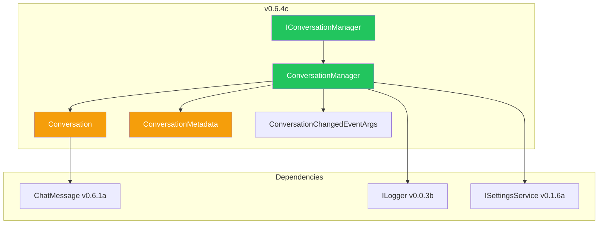

# LCS-DES-064c: Design Specification — Conversation Management

## 1. Metadata & Categorization

| Field           | Value                                     |
| :-------------- | :---------------------------------------- |
| **Document ID** | LCS-DES-064c                              |
| **Version**     | v0.6.4c                                   |
| **Status**      | Draft                                     |
| **Category**    | Services                                  |
| **Module**      | Lexichord.Modules.Agents                  |
| **Created**     | 2026-01-27                                |
| **Author**      | Documentation Agent                       |
| **Parent**      | [LCS-DES-064-INDEX](LCS-DES-064-INDEX.md) |

---

## 2. Executive Summary

### 2.1 The Requirement

Users need conversation lifecycle management including history tracking, easy conversation reset, and the ability to export conversations for reference or sharing.

### 2.2 The Proposed Solution

Implement `IConversationManager` with:

- **In-memory History**: Store conversation messages for current session
- **New Conversation**: Clear and start fresh
- **Export to Markdown**: Generate formatted document
- **Auto-title Generation**: Title from first user message
- **History Truncation**: Configurable max message count (default: 50)

---

## 3. Architecture

### 3.1 Component Placement

```text
Lexichord.Modules.Agents/
└── Chat/
    ├── Contracts/
    │   ├── IConversationManager.cs
    │   └── ConversationChangedEventArgs.cs
    ├── Services/
    │   └── ConversationManager.cs
    └── Models/
        ├── Conversation.cs
        └── ConversationMetadata.cs
```

### 3.2 Dependency Graph



---

## 4. Data Contract

### 4.1 IConversationManager Interface

```csharp
namespace Lexichord.Modules.Agents.Chat.Contracts;

/// <summary>
/// Manages conversation lifecycle, history, and export.
/// </summary>
/// <remarks>
/// <para>
/// The <see cref="IConversationManager"/> provides a unified API for managing
/// co-pilot chat conversations. It handles:
/// </para>
/// <list type="bullet">
///   <item>Conversation creation and lifecycle management</item>
///   <item>Message addition with automatic history truncation</item>
///   <item>Conversation export to Markdown format</item>
///   <item>Recent conversation tracking (for Teams+ license tier)</item>
///   <item>Auto-title generation from first user message</item>
/// </list>
/// <para>
/// This interface is registered as a scoped service in the DI container,
/// ensuring each user session has its own conversation state.
/// </para>
/// </remarks>
/// <example>
/// <code>
/// // Inject and use in a ViewModel
/// public class CoPilotViewModel
/// {
///     private readonly IConversationManager _conversations;
///
///     public CoPilotViewModel(IConversationManager conversations)
///     {
///         _conversations = conversations;
///         _conversations.ConversationChanged += OnConversationChanged;
///     }
///
///     private async Task StartNewConversationAsync()
///     {
///         var conversation = await _conversations.CreateConversationAsync();
///         // conversation.ConversationId is a new unique identifier
///     }
/// }
/// </code>
/// </example>
public interface IConversationManager
{
    /// <summary>
    /// Gets the currently active conversation.
    /// </summary>
    /// <value>
    /// The current <see cref="Conversation"/>. Never null; returns an empty
    /// conversation if none has been started.
    /// </value>
    Conversation CurrentConversation { get; }

    /// <summary>
    /// Gets recently accessed conversations (Teams+ feature).
    /// </summary>
    /// <value>
    /// A read-only list of recent conversations, ordered by last access time
    /// (most recent first). Maximum of 10 conversations retained.
    /// </value>
    /// <remarks>
    /// This feature requires the Teams+ license tier. Users on lower tiers
    /// will see an empty list.
    /// </remarks>
    IReadOnlyList<Conversation> RecentConversations { get; }

    /// <summary>
    /// Gets whether there is an active conversation with messages.
    /// </summary>
    bool HasActiveConversation { get; }

    /// <summary>
    /// Gets the total message count across all recent conversations.
    /// </summary>
    int TotalMessageCount { get; }

    /// <summary>
    /// Creates a new conversation and sets it as current.
    /// </summary>
    /// <param name="ct">Cancellation token.</param>
    /// <returns>The newly created conversation.</returns>
    /// <remarks>
    /// If the current conversation has messages, it is archived to
    /// <see cref="RecentConversations"/> before creating the new one.
    /// The <see cref="ConversationChanged"/> event fires with
    /// <see cref="ConversationChangeType.Created"/>.
    /// </remarks>
    Task<Conversation> CreateConversationAsync(CancellationToken ct = default);

    /// <summary>
    /// Creates a new conversation with initial metadata.
    /// </summary>
    /// <param name="metadata">Initial metadata for the conversation.</param>
    /// <param name="ct">Cancellation token.</param>
    /// <returns>The newly created conversation with metadata.</returns>
    Task<Conversation> CreateConversationAsync(
        ConversationMetadata metadata,
        CancellationToken ct = default);

    /// <summary>
    /// Adds a message to the current conversation.
    /// Triggers history truncation if max length exceeded.
    /// </summary>
    /// <param name="message">The message to add.</param>
    /// <param name="ct">Cancellation token.</param>
    /// <returns>A task representing the asynchronous operation.</returns>
    /// <exception cref="ArgumentNullException">Thrown if message is null.</exception>
    /// <remarks>
    /// <para>
    /// If this is the first user message, an auto-generated title is created
    /// from the message content.
    /// </para>
    /// <para>
    /// If adding this message exceeds the configured max history length,
    /// older messages are truncated from the beginning of the conversation.
    /// </para>
    /// </remarks>
    Task AddMessageAsync(ChatMessage message, CancellationToken ct = default);

    /// <summary>
    /// Adds multiple messages to the current conversation.
    /// </summary>
    /// <param name="messages">The messages to add.</param>
    /// <param name="ct">Cancellation token.</param>
    /// <returns>A task representing the asynchronous operation.</returns>
    /// <remarks>
    /// Useful for restoring a conversation from persistence or
    /// adding a user-assistant message pair atomically.
    /// </remarks>
    Task AddMessagesAsync(
        IEnumerable<ChatMessage> messages,
        CancellationToken ct = default);

    /// <summary>
    /// Clears the current conversation and creates a new empty one.
    /// </summary>
    /// <param name="ct">Cancellation token.</param>
    /// <returns>A task representing the asynchronous operation.</returns>
    /// <remarks>
    /// Equivalent to calling <see cref="CreateConversationAsync()"/>.
    /// The cleared conversation is archived to recent conversations.
    /// </remarks>
    Task ClearCurrentConversationAsync(CancellationToken ct = default);

    /// <summary>
    /// Switches to a specific conversation from the recent list.
    /// </summary>
    /// <param name="conversationId">The ID of the conversation to switch to.</param>
    /// <param name="ct">Cancellation token.</param>
    /// <returns>The conversation that was switched to, or null if not found.</returns>
    Task<Conversation?> SwitchToConversationAsync(
        Guid conversationId,
        CancellationToken ct = default);

    /// <summary>
    /// Exports a conversation to Markdown format.
    /// </summary>
    /// <param name="conversation">The conversation to export.</param>
    /// <param name="ct">Cancellation token.</param>
    /// <returns>The conversation formatted as Markdown.</returns>
    /// <exception cref="ArgumentNullException">Thrown if conversation is null.</exception>
    Task<string> ExportToMarkdownAsync(
        Conversation conversation,
        CancellationToken ct = default);

    /// <summary>
    /// Exports a conversation to Markdown and saves to a file.
    /// </summary>
    /// <param name="conversation">The conversation to export.</param>
    /// <param name="filePath">The file path to save to.</param>
    /// <param name="ct">Cancellation token.</param>
    /// <returns>A task representing the asynchronous operation.</returns>
    Task ExportToFileAsync(
        Conversation conversation,
        string filePath,
        CancellationToken ct = default);

    /// <summary>
    /// Updates the conversation title.
    /// </summary>
    /// <param name="title">The new title.</param>
    /// <param name="ct">Cancellation token.</param>
    /// <returns>A task representing the asynchronous operation.</returns>
    /// <exception cref="ArgumentException">Thrown if title is null or whitespace.</exception>
    Task SetTitleAsync(string title, CancellationToken ct = default);

    /// <summary>
    /// Searches recent conversations for messages containing the query.
    /// </summary>
    /// <param name="query">The search query.</param>
    /// <param name="ct">Cancellation token.</param>
    /// <returns>Conversations containing matching messages.</returns>
    Task<IReadOnlyList<ConversationSearchResult>> SearchAsync(
        string query,
        CancellationToken ct = default);

    /// <summary>
    /// Deletes a conversation from the recent list.
    /// </summary>
    /// <param name="conversationId">The ID of the conversation to delete.</param>
    /// <param name="ct">Cancellation token.</param>
    /// <returns>True if the conversation was found and deleted.</returns>
    Task<bool> DeleteConversationAsync(
        Guid conversationId,
        CancellationToken ct = default);

    /// <summary>
    /// Raised when conversation changes occur.
    /// </summary>
    /// <remarks>
    /// Subscribe to this event to update UI when:
    /// <list type="bullet">
    ///   <item>A new conversation is created</item>
    ///   <item>A message is added</item>
    ///   <item>The conversation is cleared</item>
    ///   <item>The title changes</item>
    ///   <item>History is truncated</item>
    /// </list>
    /// </remarks>
    event EventHandler<ConversationChangedEventArgs>? ConversationChanged;
}
```

### 4.2 Conversation Record

```csharp
namespace Lexichord.Modules.Agents.Chat.Models;

/// <summary>
/// Represents a conversation with its messages and metadata.
/// </summary>
/// <remarks>
/// <para>
/// <see cref="Conversation"/> is an immutable record that represents a complete
/// conversation state at a point in time. When messages are added or metadata
/// changes, a new <see cref="Conversation"/> instance is created using the
/// <c>with</c> expression.
/// </para>
/// <para>
/// The immutability ensures thread-safety and simplifies state management
/// in the reactive UI layer.
/// </para>
/// </remarks>
/// <param name="ConversationId">Unique identifier for this conversation.</param>
/// <param name="Title">Display title, auto-generated or user-set.</param>
/// <param name="CreatedAt">When the conversation was created.</param>
/// <param name="LastMessageAt">When the last message was added.</param>
/// <param name="Messages">The ordered list of messages in this conversation.</param>
/// <param name="Metadata">Additional context and tracking data.</param>
public record Conversation(
    Guid ConversationId,
    string Title,
    DateTime CreatedAt,
    DateTime LastMessageAt,
    IReadOnlyList<ChatMessage> Messages,
    ConversationMetadata Metadata
)
{
    /// <summary>
    /// Creates an empty conversation with default values.
    /// </summary>
    /// <returns>A new empty conversation.</returns>
    public static Conversation Empty() => new(
        Guid.NewGuid(),
        "New Conversation",
        DateTime.Now,
        DateTime.Now,
        Array.Empty<ChatMessage>(),
        ConversationMetadata.Default
    );

    /// <summary>
    /// Creates an empty conversation with specific metadata.
    /// </summary>
    /// <param name="metadata">The metadata to attach.</param>
    /// <returns>A new empty conversation with metadata.</returns>
    public static Conversation WithMetadata(ConversationMetadata metadata) => new(
        Guid.NewGuid(),
        "New Conversation",
        DateTime.Now,
        DateTime.Now,
        Array.Empty<ChatMessage>(),
        metadata
    );

    /// <summary>
    /// Gets the message count.
    /// </summary>
    public int MessageCount => Messages.Count;

    /// <summary>
    /// Checks if conversation has any messages.
    /// </summary>
    public bool HasMessages => Messages.Count > 0;

    /// <summary>
    /// Gets the duration since the conversation was created.
    /// </summary>
    public TimeSpan Age => DateTime.Now - CreatedAt;

    /// <summary>
    /// Gets the duration since the last message was added.
    /// </summary>
    public TimeSpan TimeSinceLastMessage => DateTime.Now - LastMessageAt;

    /// <summary>
    /// Gets the count of user messages.
    /// </summary>
    public int UserMessageCount => Messages.Count(m => m.Role == ChatRole.User);

    /// <summary>
    /// Gets the count of assistant messages.
    /// </summary>
    public int AssistantMessageCount => Messages.Count(m => m.Role == ChatRole.Assistant);

    /// <summary>
    /// Gets the total character count across all messages.
    /// </summary>
    public int TotalCharacterCount => Messages.Sum(m => m.Content.Length);

    /// <summary>
    /// Gets the first user message, if any.
    /// </summary>
    public ChatMessage? FirstUserMessage =>
        Messages.FirstOrDefault(m => m.Role == ChatRole.User);

    /// <summary>
    /// Gets the last message, if any.
    /// </summary>
    public ChatMessage? LastMessage => Messages.LastOrDefault();

    /// <summary>
    /// Checks if the conversation matches a search query.
    /// </summary>
    /// <param name="query">The search query.</param>
    /// <returns>True if any message contains the query.</returns>
    public bool MatchesSearch(string query)
    {
        if (string.IsNullOrWhiteSpace(query))
            return true;

        return Title.Contains(query, StringComparison.OrdinalIgnoreCase) ||
               Messages.Any(m => m.Content.Contains(query, StringComparison.OrdinalIgnoreCase));
    }
}
```

### 4.3 ConversationMetadata Record

```csharp
namespace Lexichord.Modules.Agents.Chat.Models;

/// <summary>
/// Metadata about a conversation for context tracking.
/// </summary>
/// <remarks>
/// Tracks contextual information about where and how a conversation
/// was created, enabling better context restoration and analytics.
/// </remarks>
/// <param name="DocumentPath">Path to the document that was open when conversation started.</param>
/// <param name="SelectedModel">The AI model used for this conversation.</param>
/// <param name="TotalTokens">Cumulative token count across all messages.</param>
public record ConversationMetadata(
    string? DocumentPath,
    string? SelectedModel,
    int TotalTokens
)
{
    /// <summary>
    /// Gets the provider name extracted from the model identifier.
    /// </summary>
    public string? ProviderName =>
        SelectedModel?.Split('/').FirstOrDefault();

    /// <summary>
    /// Gets the model name without provider prefix.
    /// </summary>
    public string? ModelName =>
        SelectedModel?.Split('/').LastOrDefault() ?? SelectedModel;

    /// <summary>
    /// Gets whether this conversation has document context.
    /// </summary>
    public bool HasDocumentContext => !string.IsNullOrEmpty(DocumentPath);

    /// <summary>
    /// Gets the document filename without path.
    /// </summary>
    public string? DocumentName =>
        DocumentPath is not null ? Path.GetFileName(DocumentPath) : null;

    /// <summary>
    /// Default metadata with no context.
    /// </summary>
    public static ConversationMetadata Default => new(null, null, 0);

    /// <summary>
    /// Creates metadata with document context.
    /// </summary>
    /// <param name="path">The document path.</param>
    /// <returns>Metadata with document path set.</returns>
    public static ConversationMetadata ForDocument(string path) =>
        new(path, null, 0);

    /// <summary>
    /// Creates metadata with model context.
    /// </summary>
    /// <param name="model">The model identifier.</param>
    /// <returns>Metadata with model set.</returns>
    public static ConversationMetadata ForModel(string model) =>
        new(null, model, 0);

    /// <summary>
    /// Creates a copy with updated token count.
    /// </summary>
    /// <param name="tokens">The new total token count.</param>
    /// <returns>Updated metadata.</returns>
    public ConversationMetadata WithTokens(int tokens) =>
        this with { TotalTokens = tokens };

    /// <summary>
    /// Creates a copy with added tokens.
    /// </summary>
    /// <param name="additionalTokens">Tokens to add to the total.</param>
    /// <returns>Updated metadata.</returns>
    public ConversationMetadata AddTokens(int additionalTokens) =>
        this with { TotalTokens = TotalTokens + additionalTokens };
}
```

### 4.4 ConversationChangedEventArgs

```csharp
namespace Lexichord.Modules.Agents.Chat.Contracts;

/// <summary>
/// Event arguments for conversation change notifications.
/// </summary>
/// <param name="ChangeType">The type of change that occurred.</param>
/// <param name="Conversation">The conversation after the change.</param>
/// <param name="AffectedMessageCount">Number of messages affected (for truncation).</param>
public record ConversationChangedEventArgs(
    ConversationChangeType ChangeType,
    Conversation Conversation,
    int AffectedMessageCount = 0
)
{
    /// <summary>
    /// Gets whether this change added new content.
    /// </summary>
    public bool IsAddition =>
        ChangeType is ConversationChangeType.MessageAdded or ConversationChangeType.Created;

    /// <summary>
    /// Gets whether this change removed content.
    /// </summary>
    public bool IsRemoval =>
        ChangeType is ConversationChangeType.Cleared or ConversationChangeType.Truncated;
}

/// <summary>
/// Types of conversation changes that can occur.
/// </summary>
public enum ConversationChangeType
{
    /// <summary>A new conversation was created.</summary>
    Created,

    /// <summary>A message was added to the conversation.</summary>
    MessageAdded,

    /// <summary>Multiple messages were added to the conversation.</summary>
    MessagesAdded,

    /// <summary>The conversation was cleared.</summary>
    Cleared,

    /// <summary>The conversation title was changed.</summary>
    TitleChanged,

    /// <summary>Old messages were truncated due to history limits.</summary>
    Truncated,

    /// <summary>The active conversation was switched.</summary>
    Switched,

    /// <summary>A conversation was deleted from history.</summary>
    Deleted
}
```

### 4.5 ConversationSearchResult

```csharp
namespace Lexichord.Modules.Agents.Chat.Models;

/// <summary>
/// Represents a search result from conversation history.
/// </summary>
/// <param name="Conversation">The matching conversation.</param>
/// <param name="MatchingMessages">Messages that matched the query.</param>
/// <param name="HighlightedSnippets">Text snippets with highlighted matches.</param>
public record ConversationSearchResult(
    Conversation Conversation,
    IReadOnlyList<ChatMessage> MatchingMessages,
    IReadOnlyList<string> HighlightedSnippets
)
{
    /// <summary>
    /// Gets the number of matches in this conversation.
    /// </summary>
    public int MatchCount => MatchingMessages.Count;

    /// <summary>
    /// Gets the first matching snippet for preview.
    /// </summary>
    public string? PreviewSnippet => HighlightedSnippets.FirstOrDefault();
}
```

### 4.6 ConversationExportOptions

````csharp
namespace Lexichord.Modules.Agents.Chat.Models;

/// <summary>
/// Options for customizing conversation export.
/// </summary>
/// <param name="IncludeMetadata">Whether to include metadata header.</param>
/// <param name="IncludeTimestamps">Whether to include message timestamps.</param>
/// <param name="IncludeSystemMessages">Whether to include system messages.</param>
/// <param name="UseEmoji">Whether to use emoji for role indicators.</param>
public record ConversationExportOptions(
    bool IncludeMetadata = true,
    bool IncludeTimestamps = false,
    bool IncludeSystemMessages = false,
    bool UseEmoji = true
)
{
    /// <summary>
    /// Default export options.
    /// </summary>
    public static ConversationExportOptions Default => new();

    /// <summary>
    /// Minimal export with just messages.
    /// </summary>
    public static ConversationExportOptions Minimal => new(
        IncludeMetadata: false,
        IncludeTimestamps: false,
        IncludeSystemMessages: false,
        UseEmoji: false
    );

    /// <summary>
    /// Full export with all details.
    /// </summary>
    public static ConversationExportOptions Full => new(
        IncludeMetadata: true,
        IncludeTimestamps: true,
        IncludeSystemMessages: true,
        UseEmoji: true
    );
}

---

## 5. Implementation

### 5.1 ConversationManager

```csharp
namespace Lexichord.Modules.Agents.Chat.Services;

public class ConversationManager : IConversationManager
{
    private readonly ISettingsService _settings;
    private readonly ILogger<ConversationManager> _logger;

    private Conversation _currentConversation;
    private readonly List<ChatMessage> _messages = [];
    private readonly List<Conversation> _recentConversations = [];

    private int MaxHistoryLength => _settings.GetValue("Chat.MaxHistory", 50);

    public Conversation CurrentConversation => _currentConversation;
    public IReadOnlyList<Conversation> RecentConversations => _recentConversations.AsReadOnly();

    public event EventHandler<ConversationChangedEventArgs>? ConversationChanged;

    public ConversationManager(ISettingsService settings, ILogger<ConversationManager> logger)
    {
        _settings = settings ?? throw new ArgumentNullException(nameof(settings));
        _logger = logger ?? throw new ArgumentNullException(nameof(logger));

        _currentConversation = Conversation.Empty();
        _logger.LogDebug("ConversationManager initialized with max history: {Max}", MaxHistoryLength);
    }

    public Task<Conversation> CreateConversationAsync(CancellationToken ct = default)
    {
        // Archive current if it has messages
        if (_currentConversation.HasMessages)
        {
            _recentConversations.Insert(0, _currentConversation);
            if (_recentConversations.Count > 10)
                _recentConversations.RemoveAt(_recentConversations.Count - 1);
        }

        _messages.Clear();
        _currentConversation = Conversation.Empty();

        _logger.LogInformation("New conversation created: {Id}", _currentConversation.ConversationId);

        RaiseConversationChanged(ConversationChangeType.Created);
        return Task.FromResult(_currentConversation);
    }

    public Task AddMessageAsync(ChatMessage message, CancellationToken ct = default)
    {
        ArgumentNullException.ThrowIfNull(message);

        _messages.Add(message);

        // Auto-title from first user message
        if (_messages.Count == 1 && message.Role == ChatRole.User)
        {
            var title = GenerateTitle(message.Content);
            _currentConversation = _currentConversation with
            {
                Title = title,
                Messages = _messages.AsReadOnly(),
                LastMessageAt = DateTime.Now
            };
            RaiseConversationChanged(ConversationChangeType.TitleChanged);
        }

        // Truncate if exceeds max
        if (_messages.Count > MaxHistoryLength)
        {
            var truncateCount = _messages.Count - MaxHistoryLength;
            _messages.RemoveRange(0, truncateCount);

            _logger.LogWarning("Conversation truncated: {Count} messages removed", truncateCount);
            RaiseConversationChanged(ConversationChangeType.Truncated);
        }

        // Update conversation
        _currentConversation = _currentConversation with
        {
            Messages = _messages.AsReadOnly(),
            LastMessageAt = DateTime.Now
        };

        _logger.LogDebug("Message added: {Role}, total: {Count}", message.Role, _messages.Count);
        RaiseConversationChanged(ConversationChangeType.MessageAdded);

        return Task.CompletedTask;
    }

    public Task ClearCurrentConversationAsync(CancellationToken ct = default)
    {
        _logger.LogDebug("Clearing current conversation: {Id}", _currentConversation.ConversationId);
        return CreateConversationAsync(ct);
    }

    public Task<Conversation> CreateConversationAsync(
        ConversationMetadata metadata,
        CancellationToken ct = default)
    {
        // Archive current if it has messages
        ArchiveCurrentConversation();

        _messages.Clear();
        _currentConversation = Conversation.WithMetadata(metadata);

        _logger.LogInformation(
            "New conversation created with metadata: {Id}, Model: {Model}, Doc: {Doc}",
            _currentConversation.ConversationId,
            metadata.SelectedModel,
            metadata.DocumentName);

        RaiseConversationChanged(ConversationChangeType.Created);
        return Task.FromResult(_currentConversation);
    }

    public Task AddMessagesAsync(
        IEnumerable<ChatMessage> messages,
        CancellationToken ct = default)
    {
        ArgumentNullException.ThrowIfNull(messages);

        var messageList = messages.ToList();
        if (messageList.Count == 0)
            return Task.CompletedTask;

        foreach (var message in messageList)
        {
            _messages.Add(message);
        }

        // Auto-title from first user message
        var firstUserMessage = messageList.FirstOrDefault(m => m.Role == ChatRole.User);
        if (_currentConversation.Title == "New Conversation" && firstUserMessage is not null)
        {
            var title = GenerateTitle(firstUserMessage.Content);
            _currentConversation = _currentConversation with { Title = title };
        }

        // Truncate if exceeds max
        TruncateIfNeeded();

        // Update conversation
        _currentConversation = _currentConversation with
        {
            Messages = _messages.AsReadOnly(),
            LastMessageAt = DateTime.Now
        };

        _logger.LogDebug(
            "Messages added: {Count} messages, total: {Total}",
            messageList.Count,
            _messages.Count);

        RaiseConversationChanged(ConversationChangeType.MessagesAdded, messageList.Count);
        return Task.CompletedTask;
    }

    public Task<Conversation?> SwitchToConversationAsync(
        Guid conversationId,
        CancellationToken ct = default)
    {
        var targetIndex = _recentConversations.FindIndex(c => c.ConversationId == conversationId);
        if (targetIndex < 0)
        {
            _logger.LogWarning("Conversation not found for switch: {Id}", conversationId);
            return Task.FromResult<Conversation?>(null);
        }

        // Archive current
        ArchiveCurrentConversation();

        // Load target
        var target = _recentConversations[targetIndex];
        _recentConversations.RemoveAt(targetIndex);

        _messages.Clear();
        _messages.AddRange(target.Messages);
        _currentConversation = target;

        _logger.LogInformation(
            "Switched to conversation: {Id} '{Title}'",
            conversationId,
            target.Title);

        RaiseConversationChanged(ConversationChangeType.Switched);
        return Task.FromResult<Conversation?>(target);
    }

    public Task<string> ExportToMarkdownAsync(Conversation conversation, CancellationToken ct = default)
    {
        return ExportToMarkdownAsync(conversation, ConversationExportOptions.Default, ct);
    }

    /// <summary>
    /// Exports a conversation to Markdown with custom options.
    /// </summary>
    public Task<string> ExportToMarkdownAsync(
        Conversation conversation,
        ConversationExportOptions options,
        CancellationToken ct = default)
    {
        ArgumentNullException.ThrowIfNull(conversation);

        var sb = new StringBuilder();

        // Header
        sb.AppendLine($"# {conversation.Title}");
        sb.AppendLine();

        if (options.IncludeMetadata)
        {
            sb.AppendLine($"**Date:** {conversation.CreatedAt:yyyy-MM-dd HH:mm}");

            if (conversation.Metadata.SelectedModel is not null)
                sb.AppendLine($"**Model:** {conversation.Metadata.SelectedModel}");

            if (conversation.Metadata.DocumentPath is not null)
                sb.AppendLine($"**Document:** {conversation.Metadata.DocumentPath}");

            sb.AppendLine($"**Messages:** {conversation.MessageCount}");
            sb.AppendLine();
        }

        sb.AppendLine("---");
        sb.AppendLine();

        // Messages
        foreach (var message in conversation.Messages)
        {
            // Skip system messages if not included
            if (message.Role == ChatRole.System && !options.IncludeSystemMessages)
                continue;

            var roleHeader = GetRoleHeader(message.Role, options.UseEmoji);

            sb.AppendLine(roleHeader);

            if (options.IncludeTimestamps)
                sb.AppendLine($"*{message.Timestamp:HH:mm:ss}*");

            sb.AppendLine();
            sb.AppendLine(message.Content);
            sb.AppendLine();
            sb.AppendLine("---");
            sb.AppendLine();
        }

        _logger.LogInformation(
            "Conversation exported: {Count} messages, options: {Options}",
            conversation.MessageCount,
            options);

        return Task.FromResult(sb.ToString());
    }

    public async Task ExportToFileAsync(
        Conversation conversation,
        string filePath,
        CancellationToken ct = default)
    {
        ArgumentNullException.ThrowIfNull(conversation);
        ArgumentException.ThrowIfNullOrWhiteSpace(filePath);

        var markdown = await ExportToMarkdownAsync(conversation, ct);
        await File.WriteAllTextAsync(filePath, markdown, ct);

        _logger.LogInformation(
            "Conversation exported to file: {Path}, {Count} messages",
            filePath,
            conversation.MessageCount);
    }

    public Task SetTitleAsync(string title, CancellationToken ct = default)
    {
        if (string.IsNullOrWhiteSpace(title))
            throw new ArgumentException("Title cannot be empty", nameof(title));

        var previousTitle = _currentConversation.Title;
        _currentConversation = _currentConversation with { Title = title };

        _logger.LogDebug(
            "Conversation title changed: '{Previous}' -> '{New}'",
            previousTitle,
            title);

        RaiseConversationChanged(ConversationChangeType.TitleChanged);
        return Task.CompletedTask;
    }

    public Task<IReadOnlyList<ConversationSearchResult>> SearchAsync(
        string query,
        CancellationToken ct = default)
    {
        if (string.IsNullOrWhiteSpace(query))
            return Task.FromResult<IReadOnlyList<ConversationSearchResult>>(
                Array.Empty<ConversationSearchResult>());

        var results = new List<ConversationSearchResult>();

        // Search current conversation
        if (_currentConversation.MatchesSearch(query))
        {
            results.Add(CreateSearchResult(_currentConversation, query));
        }

        // Search recent conversations
        foreach (var conversation in _recentConversations)
        {
            if (conversation.MatchesSearch(query))
            {
                results.Add(CreateSearchResult(conversation, query));
            }
        }

        _logger.LogDebug(
            "Search completed: query='{Query}', results={Count}",
            query,
            results.Count);

        return Task.FromResult<IReadOnlyList<ConversationSearchResult>>(results);
    }

    public Task<bool> DeleteConversationAsync(
        Guid conversationId,
        CancellationToken ct = default)
    {
        var index = _recentConversations.FindIndex(c => c.ConversationId == conversationId);
        if (index < 0)
        {
            _logger.LogWarning("Conversation not found for deletion: {Id}", conversationId);
            return Task.FromResult(false);
        }

        var deleted = _recentConversations[index];
        _recentConversations.RemoveAt(index);

        _logger.LogInformation(
            "Conversation deleted: {Id} '{Title}'",
            conversationId,
            deleted.Title);

        RaiseConversationChanged(ConversationChangeType.Deleted);
        return Task.FromResult(true);
    }

    #region Private Methods

    private void ArchiveCurrentConversation()
    {
        if (_currentConversation.HasMessages)
        {
            _recentConversations.Insert(0, _currentConversation);
            if (_recentConversations.Count > MaxRecentConversations)
                _recentConversations.RemoveAt(_recentConversations.Count - 1);

            _logger.LogDebug(
                "Archived conversation: {Id}, recent count: {Count}",
                _currentConversation.ConversationId,
                _recentConversations.Count);
        }
    }

    private void TruncateIfNeeded()
    {
        if (_messages.Count > MaxHistoryLength)
        {
            var truncateCount = _messages.Count - MaxHistoryLength;
            _messages.RemoveRange(0, truncateCount);

            _logger.LogWarning(
                "Conversation truncated: {Count} messages removed, {Remaining} remaining",
                truncateCount,
                _messages.Count);

            RaiseConversationChanged(ConversationChangeType.Truncated, truncateCount);
        }
    }

    private static string GenerateTitle(string firstMessage)
    {
        if (string.IsNullOrWhiteSpace(firstMessage))
            return "New Conversation";

        // Take first sentence or first 50 chars
        var title = firstMessage.Split('.', '?', '!').FirstOrDefault()?.Trim()
            ?? firstMessage;

        // Remove leading/trailing whitespace and common prefixes
        title = title.TrimStart("Can you ", "Please ", "How do I ", "What is ");

        if (title.Length > 50)
            title = title[..47] + "...";

        return title;
    }

    private static string GetRoleHeader(ChatRole role, bool useEmoji)
    {
        return (role, useEmoji) switch
        {
            (ChatRole.User, true) => "## 👤 User",
            (ChatRole.User, false) => "## User",
            (ChatRole.Assistant, true) => "## 🤖 Assistant",
            (ChatRole.Assistant, false) => "## Assistant",
            (ChatRole.System, true) => "## ⚙️ System",
            (ChatRole.System, false) => "## System",
            _ => $"## {role}"
        };
    }

    private static ConversationSearchResult CreateSearchResult(
        Conversation conversation,
        string query)
    {
        var matchingMessages = conversation.Messages
            .Where(m => m.Content.Contains(query, StringComparison.OrdinalIgnoreCase))
            .ToList();

        var snippets = matchingMessages
            .Select(m => CreateHighlightedSnippet(m.Content, query))
            .ToList();

        return new ConversationSearchResult(conversation, matchingMessages, snippets);
    }

    private static string CreateHighlightedSnippet(string content, string query, int contextLength = 50)
    {
        var index = content.IndexOf(query, StringComparison.OrdinalIgnoreCase);
        if (index < 0)
            return content.Length > 100 ? content[..97] + "..." : content;

        var start = Math.Max(0, index - contextLength);
        var end = Math.Min(content.Length, index + query.Length + contextLength);

        var snippet = content[start..end];

        if (start > 0)
            snippet = "..." + snippet;
        if (end < content.Length)
            snippet += "...";

        return snippet;
    }

    private void RaiseConversationChanged(
        ConversationChangeType changeType,
        int affectedMessageCount = 0)
    {
        ConversationChanged?.Invoke(
            this,
            new ConversationChangedEventArgs(changeType, _currentConversation, affectedMessageCount));
    }

    #endregion

    #region Properties

    public bool HasActiveConversation => _currentConversation.HasMessages;

    public int TotalMessageCount =>
        _currentConversation.MessageCount +
        _recentConversations.Sum(c => c.MessageCount);

    private int MaxHistoryLength => _settings.GetValue("Chat.MaxHistory", 50);
    private int MaxRecentConversations => _settings.GetValue("Chat.MaxRecent", 10);

    #endregion
}
````

---

## 6. Export Format

### 6.1 Default Export

````markdown
# What is dependency injection?

**Date:** 2026-01-27 14:30
**Model:** gpt-4o-mini
**Document:** /project/docs/architecture.md
**Messages:** 4

---

## 👤 User

What is dependency injection?

---

## 🤖 Assistant

Dependency injection (DI) is a design pattern in which an object receives its dependencies from external sources rather than creating them itself.

Here's an example:

```csharp
public class OrderService
{
    private readonly ILogger _logger;

    public OrderService(ILogger logger)
    {
        _logger = logger;
    }
}
```

This approach enables...

---
````

### 6.2 Full Export (with timestamps)

```markdown
# What is dependency injection?

**Date:** 2026-01-27 14:30
**Model:** gpt-4o-mini
**Document:** /project/docs/architecture.md
**Messages:** 4

---

## 👤 User

_14:30:15_

What is dependency injection?

---

## 🤖 Assistant

_14:30:18_

Dependency injection (DI) is a design pattern...

---

## ⚙️ System

_14:30:00_

You are a helpful coding assistant.

---
```

### 6.3 Minimal Export

```markdown
# What is dependency injection?

---

## User

What is dependency injection?

---

## Assistant

Dependency injection (DI) is a design pattern...

---
```

---

## 7. Observability & Logging

### 7.1 Log Events

| Level   | Event ID | Message Template                                               |
| :------ | :------- | :------------------------------------------------------------- |
| Trace   | 6300     | `Message content preview: {Preview}`                           |
| Debug   | 6301     | `ConversationManager initialized with max history: {Max}`      |
| Debug   | 6302     | `Message added: {Role}, total: {Count}`                        |
| Debug   | 6303     | `Conversation title set: {Title}`                              |
| Debug   | 6304     | `Archived conversation: {Id}, recent count: {Count}`           |
| Debug   | 6305     | `Messages added: {Count} messages, total: {Total}`             |
| Debug   | 6306     | `Search completed: query='{Query}', results={Count}`           |
| Debug   | 6307     | `Conversation title changed: '{Previous}' -> '{New}'`          |
| Debug   | 6308     | `Clearing current conversation: {Id}`                          |
| Info    | 6310     | `New conversation created: {Id}`                               |
| Info    | 6311     | `New conversation created with metadata: {Id}, Model: {Model}` |
| Info    | 6312     | `Conversation exported: {Count} messages`                      |
| Info    | 6313     | `Conversation exported to file: {Path}, {Count} messages`      |
| Info    | 6314     | `Switched to conversation: {Id} '{Title}'`                     |
| Info    | 6315     | `Conversation deleted: {Id} '{Title}'`                         |
| Warning | 6320     | `Conversation truncated: {Count} messages removed`             |
| Warning | 6321     | `Conversation not found for switch: {Id}`                      |
| Warning | 6322     | `Conversation not found for deletion: {Id}`                    |
| Error   | 6330     | `Failed to export conversation: {Id}`                          |
| Error   | 6331     | `Failed to save conversation to file: {Path}`                  |

### 7.2 Metrics

| Metric                              | Type      | Labels | Purpose                        |
| :---------------------------------- | :-------- | :----- | :----------------------------- |
| `conversation.created_total`        | Counter   | -      | Total conversations created    |
| `conversation.messages_total`       | Counter   | role   | Total messages by role         |
| `conversation.truncations_total`    | Counter   | -      | Times history was truncated    |
| `conversation.exports_total`        | Counter   | format | Export operations by format    |
| `conversation.searches_total`       | Counter   | -      | Search operations performed    |
| `conversation.active_count`         | Gauge     | -      | Recent conversations in memory |
| `conversation.message_length_bytes` | Histogram | role   | Message content length         |

---

## 8. Acceptance Criteria

### 8.1 Conversation Lifecycle

| #   | Criterion                                                | Priority |
| :-- | :------------------------------------------------------- | :------- |
| 1   | Creating a new conversation generates a unique GUID      | Critical |
| 2   | Current conversation is archived when new one is created | High     |
| 3   | Maximum of 10 recent conversations are retained          | Medium   |
| 4   | Clearing conversation creates a new empty one            | Critical |
| 5   | Switching to a conversation restores its messages        | High     |

### 8.2 Message Management

| #   | Criterion                                           | Priority |
| :-- | :-------------------------------------------------- | :------- |
| 6   | Messages are added in order to the conversation     | Critical |
| 7   | Batch message addition works atomically             | High     |
| 8   | History truncates oldest messages when max exceeded | High     |
| 9   | Truncation count is reported in event arguments     | Medium   |
| 10  | LastMessageAt timestamp updates on each message     | Medium   |

### 8.3 Auto-Title Generation

| #   | Criterion                                                 | Priority |
| :-- | :-------------------------------------------------------- | :------- |
| 11  | Title is generated from first user message                | High     |
| 12  | Title uses first sentence if message contains punctuation | Medium   |
| 13  | Title is truncated to 50 characters with ellipsis         | Medium   |
| 14  | Common prefixes ("Can you", "How do I") are stripped      | Low      |
| 15  | Manual title can override auto-generated title            | High     |

### 8.4 Export Functionality

| #   | Criterion                                           | Priority |
| :-- | :-------------------------------------------------- | :------- |
| 16  | Export produces valid Markdown                      | Critical |
| 17  | Metadata header includes date, model, document path | High     |
| 18  | Role headers use correct emoji when enabled         | Medium   |
| 19  | Timestamps are optional based on export options     | Low      |
| 20  | System messages are optionally included             | Low      |
| 21  | Export to file saves correctly with UTF-8 encoding  | High     |

### 8.5 Search Functionality

| #   | Criterion                                        | Priority |
| :-- | :----------------------------------------------- | :------- |
| 22  | Search matches across conversation titles        | High     |
| 23  | Search matches across message content            | High     |
| 24  | Search is case-insensitive                       | High     |
| 25  | Search returns highlighted snippets with context | Medium   |
| 26  | Empty query returns empty results                | Low      |

### 8.6 Events

| #   | Criterion                                     | Priority |
| :-- | :-------------------------------------------- | :------- |
| 27  | ConversationChanged fires on new conversation | High     |
| 28  | ConversationChanged fires on message added    | High     |
| 29  | ConversationChanged fires on title change     | Medium   |
| 30  | ConversationChanged fires on truncation       | Medium   |
| 31  | ConversationChanged fires on switch           | Medium   |
| 32  | ConversationChanged fires on delete           | Medium   |

---

## 9. Unit Tests

```csharp
namespace Lexichord.Modules.Agents.Chat.Tests;

/// <summary>
/// Unit tests for ConversationManager.
/// </summary>
[Trait("Category", "Unit")]
[Trait("Version", "v0.6.4c")]
public class ConversationManagerTests
{
    private readonly Mock<ISettingsService> _mockSettings;
    private readonly Mock<ILogger<ConversationManager>> _mockLogger;

    public ConversationManagerTests()
    {
        _mockSettings = new Mock<ISettingsService>();
        _mockSettings.Setup(s => s.GetValue("Chat.MaxHistory", 50)).Returns(50);
        _mockSettings.Setup(s => s.GetValue("Chat.MaxRecent", 10)).Returns(10);
        _mockLogger = new Mock<ILogger<ConversationManager>>();
    }

    private ConversationManager CreateSut() =>
        new(_mockSettings.Object, _mockLogger.Object);

    #region CreateConversationAsync Tests

    [Fact]
    public async Task CreateConversationAsync_ReturnsNewConversation()
    {
        var manager = CreateSut();

        var conversation = await manager.CreateConversationAsync();

        Assert.NotEqual(Guid.Empty, conversation.ConversationId);
        Assert.Equal("New Conversation", conversation.Title);
        Assert.Empty(conversation.Messages);
    }

    [Fact]
    public async Task CreateConversationAsync_WithMetadata_SetsMetadata()
    {
        var manager = CreateSut();
        var metadata = ConversationMetadata.ForModel("openai/gpt-4o-mini");

        var conversation = await manager.CreateConversationAsync(metadata);

        Assert.Equal("openai/gpt-4o-mini", conversation.Metadata.SelectedModel);
        Assert.Equal("openai", conversation.Metadata.ProviderName);
        Assert.Equal("gpt-4o-mini", conversation.Metadata.ModelName);
    }

    [Fact]
    public async Task CreateConversationAsync_ArchivesPreviousConversation()
    {
        var manager = CreateSut();
        await manager.AddMessageAsync(new ChatMessage(ChatRole.User, "First"));
        var firstId = manager.CurrentConversation.ConversationId;

        await manager.CreateConversationAsync();

        Assert.Single(manager.RecentConversations);
        Assert.Equal(firstId, manager.RecentConversations[0].ConversationId);
    }

    [Fact]
    public async Task CreateConversationAsync_LimitsRecentConversations()
    {
        _mockSettings.Setup(s => s.GetValue("Chat.MaxRecent", 10)).Returns(3);
        var manager = CreateSut();

        for (int i = 0; i < 5; i++)
        {
            await manager.AddMessageAsync(new ChatMessage(ChatRole.User, $"Msg {i}"));
            await manager.CreateConversationAsync();
        }

        Assert.Equal(3, manager.RecentConversations.Count);
    }

    #endregion

    #region AddMessageAsync Tests

    [Fact]
    public async Task AddMessageAsync_AddsMessageToConversation()
    {
        var manager = CreateSut();
        var message = new ChatMessage(ChatRole.User, "Hello");

        await manager.AddMessageAsync(message);

        Assert.Single(manager.CurrentConversation.Messages);
        Assert.Equal("Hello", manager.CurrentConversation.Messages[0].Content);
    }

    [Fact]
    public async Task AddMessageAsync_FirstUserMessage_GeneratesTitle()
    {
        var manager = CreateSut();
        var message = new ChatMessage(ChatRole.User, "What is dependency injection?");

        await manager.AddMessageAsync(message);

        Assert.Equal("What is dependency injection", manager.CurrentConversation.Title);
    }

    [Fact]
    public async Task AddMessageAsync_LongFirstMessage_TruncatesTitle()
    {
        var manager = CreateSut();
        var longMessage = new string('a', 100);

        await manager.AddMessageAsync(new ChatMessage(ChatRole.User, longMessage));

        Assert.Equal(50, manager.CurrentConversation.Title.Length);
        Assert.EndsWith("...", manager.CurrentConversation.Title);
    }

    [Fact]
    public async Task AddMessageAsync_ExceedsMaxHistory_Truncates()
    {
        _mockSettings.Setup(s => s.GetValue("Chat.MaxHistory", 50)).Returns(5);
        var manager = CreateSut();

        for (int i = 0; i < 10; i++)
            await manager.AddMessageAsync(new ChatMessage(ChatRole.User, $"Message {i}"));

        Assert.Equal(5, manager.CurrentConversation.Messages.Count);
        // Should have the last 5 messages
        Assert.Equal("Message 5", manager.CurrentConversation.Messages[0].Content);
    }

    [Fact]
    public async Task AddMessageAsync_UpdatesLastMessageAt()
    {
        var manager = CreateSut();
        var before = manager.CurrentConversation.LastMessageAt;

        await Task.Delay(10);
        await manager.AddMessageAsync(new ChatMessage(ChatRole.User, "Hello"));

        Assert.True(manager.CurrentConversation.LastMessageAt > before);
    }

    #endregion

    #region AddMessagesAsync Tests

    [Fact]
    public async Task AddMessagesAsync_AddsAllMessages()
    {
        var manager = CreateSut();
        var messages = new[]
        {
            new ChatMessage(ChatRole.User, "Hello"),
            new ChatMessage(ChatRole.Assistant, "Hi there!")
        };

        await manager.AddMessagesAsync(messages);

        Assert.Equal(2, manager.CurrentConversation.Messages.Count);
    }

    [Fact]
    public async Task AddMessagesAsync_GeneratesTitleFromFirstUserMessage()
    {
        var manager = CreateSut();
        var messages = new[]
        {
            new ChatMessage(ChatRole.System, "You are helpful"),
            new ChatMessage(ChatRole.User, "Hello world")
        };

        await manager.AddMessagesAsync(messages);

        Assert.Equal("Hello world", manager.CurrentConversation.Title);
    }

    [Fact]
    public async Task AddMessagesAsync_EmptyList_DoesNothing()
    {
        var manager = CreateSut();
        await manager.AddMessageAsync(new ChatMessage(ChatRole.User, "First"));
        var countBefore = manager.CurrentConversation.MessageCount;

        await manager.AddMessagesAsync(Array.Empty<ChatMessage>());

        Assert.Equal(countBefore, manager.CurrentConversation.MessageCount);
    }

    #endregion

    #region SwitchToConversationAsync Tests

    [Fact]
    public async Task SwitchToConversationAsync_RestoresConversation()
    {
        var manager = CreateSut();
        await manager.AddMessageAsync(new ChatMessage(ChatRole.User, "Old message"));
        var oldId = manager.CurrentConversation.ConversationId;
        await manager.CreateConversationAsync();

        var result = await manager.SwitchToConversationAsync(oldId);

        Assert.NotNull(result);
        Assert.Equal(oldId, manager.CurrentConversation.ConversationId);
        Assert.Single(manager.CurrentConversation.Messages);
    }

    [Fact]
    public async Task SwitchToConversationAsync_NotFound_ReturnsNull()
    {
        var manager = CreateSut();

        var result = await manager.SwitchToConversationAsync(Guid.NewGuid());

        Assert.Null(result);
    }

    #endregion

    #region ClearCurrentConversationAsync Tests

    [Fact]
    public async Task ClearCurrentConversationAsync_ClearsMessages()
    {
        var manager = CreateSut();
        await manager.AddMessageAsync(new ChatMessage(ChatRole.User, "Hello"));

        await manager.ClearCurrentConversationAsync();

        Assert.Empty(manager.CurrentConversation.Messages);
    }

    [Fact]
    public async Task ClearCurrentConversationAsync_ArchivesPrevious()
    {
        var manager = CreateSut();
        await manager.AddMessageAsync(new ChatMessage(ChatRole.User, "Hello"));
        var oldId = manager.CurrentConversation.ConversationId;

        await manager.ClearCurrentConversationAsync();

        Assert.Contains(manager.RecentConversations, c => c.ConversationId == oldId);
    }

    #endregion

    #region ExportToMarkdownAsync Tests

    [Fact]
    public async Task ExportToMarkdownAsync_GeneratesValidMarkdown()
    {
        var manager = CreateSut();
        await manager.AddMessageAsync(new ChatMessage(ChatRole.User, "Hello"));
        await manager.AddMessageAsync(new ChatMessage(ChatRole.Assistant, "Hi there!"));

        var markdown = await manager.ExportToMarkdownAsync(manager.CurrentConversation);

        Assert.Contains("## 👤 User", markdown);
        Assert.Contains("Hello", markdown);
        Assert.Contains("## 🤖 Assistant", markdown);
        Assert.Contains("Hi there!", markdown);
    }

    [Fact]
    public async Task ExportToMarkdownAsync_IncludesMetadata()
    {
        var manager = CreateSut();
        var metadata = new ConversationMetadata("/docs/test.md", "openai/gpt-4o", 1000);
        await manager.CreateConversationAsync(metadata);
        await manager.AddMessageAsync(new ChatMessage(ChatRole.User, "Hello"));

        var markdown = await manager.ExportToMarkdownAsync(manager.CurrentConversation);

        Assert.Contains("**Model:** openai/gpt-4o", markdown);
        Assert.Contains("**Document:** /docs/test.md", markdown);
    }

    [Fact]
    public async Task ExportToMarkdownAsync_MinimalOptions_ExcludesMetadata()
    {
        var manager = CreateSut();
        await manager.AddMessageAsync(new ChatMessage(ChatRole.User, "Hello"));

        var markdown = await manager.ExportToMarkdownAsync(
            manager.CurrentConversation,
            ConversationExportOptions.Minimal);

        Assert.DoesNotContain("**Date:**", markdown);
        Assert.Contains("## User", markdown); // No emoji
    }

    [Fact]
    public async Task ExportToMarkdownAsync_NullConversation_Throws()
    {
        var manager = CreateSut();

        await Assert.ThrowsAsync<ArgumentNullException>(
            () => manager.ExportToMarkdownAsync(null!));
    }

    #endregion

    #region SetTitleAsync Tests

    [Fact]
    public async Task SetTitleAsync_UpdatesTitle()
    {
        var manager = CreateSut();
        await manager.AddMessageAsync(new ChatMessage(ChatRole.User, "Hello"));

        await manager.SetTitleAsync("Custom Title");

        Assert.Equal("Custom Title", manager.CurrentConversation.Title);
    }

    [Fact]
    public async Task SetTitleAsync_EmptyTitle_Throws()
    {
        var manager = CreateSut();

        await Assert.ThrowsAsync<ArgumentException>(
            () => manager.SetTitleAsync(""));
    }

    [Fact]
    public async Task SetTitleAsync_WhitespaceTitle_Throws()
    {
        var manager = CreateSut();

        await Assert.ThrowsAsync<ArgumentException>(
            () => manager.SetTitleAsync("   "));
    }

    #endregion

    #region SearchAsync Tests

    [Fact]
    public async Task SearchAsync_FindsMatchingMessages()
    {
        var manager = CreateSut();
        await manager.AddMessageAsync(new ChatMessage(ChatRole.User, "Hello world"));
        await manager.AddMessageAsync(new ChatMessage(ChatRole.Assistant, "Greetings!"));

        var results = await manager.SearchAsync("world");

        Assert.Single(results);
        Assert.Single(results[0].MatchingMessages);
    }

    [Fact]
    public async Task SearchAsync_CaseInsensitive()
    {
        var manager = CreateSut();
        await manager.AddMessageAsync(new ChatMessage(ChatRole.User, "Hello WORLD"));

        var results = await manager.SearchAsync("world");

        Assert.Single(results);
    }

    [Fact]
    public async Task SearchAsync_SearchesRecentConversations()
    {
        var manager = CreateSut();
        await manager.AddMessageAsync(new ChatMessage(ChatRole.User, "Unique keyword"));
        await manager.CreateConversationAsync();
        await manager.AddMessageAsync(new ChatMessage(ChatRole.User, "Different message"));

        var results = await manager.SearchAsync("Unique");

        Assert.Single(results);
    }

    [Fact]
    public async Task SearchAsync_EmptyQuery_ReturnsEmpty()
    {
        var manager = CreateSut();
        await manager.AddMessageAsync(new ChatMessage(ChatRole.User, "Hello"));

        var results = await manager.SearchAsync("");

        Assert.Empty(results);
    }

    #endregion

    #region DeleteConversationAsync Tests

    [Fact]
    public async Task DeleteConversationAsync_RemovesFromRecent()
    {
        var manager = CreateSut();
        await manager.AddMessageAsync(new ChatMessage(ChatRole.User, "Hello"));
        var oldId = manager.CurrentConversation.ConversationId;
        await manager.CreateConversationAsync();

        var result = await manager.DeleteConversationAsync(oldId);

        Assert.True(result);
        Assert.DoesNotContain(manager.RecentConversations, c => c.ConversationId == oldId);
    }

    [Fact]
    public async Task DeleteConversationAsync_NotFound_ReturnsFalse()
    {
        var manager = CreateSut();

        var result = await manager.DeleteConversationAsync(Guid.NewGuid());

        Assert.False(result);
    }

    #endregion

    #region Event Tests

    [Fact]
    public async Task ConversationChanged_FiresOnMessageAdded()
    {
        var manager = CreateSut();
        ConversationChangedEventArgs? args = null;
        manager.ConversationChanged += (_, e) => args = e;

        await manager.AddMessageAsync(new ChatMessage(ChatRole.User, "Hello"));

        Assert.NotNull(args);
        Assert.Equal(ConversationChangeType.MessageAdded, args!.ChangeType);
    }

    [Fact]
    public async Task ConversationChanged_FiresOnCreated()
    {
        var manager = CreateSut();
        ConversationChangedEventArgs? args = null;
        manager.ConversationChanged += (_, e) => args = e;

        await manager.CreateConversationAsync();

        Assert.NotNull(args);
        Assert.Equal(ConversationChangeType.Created, args!.ChangeType);
    }

    [Fact]
    public async Task ConversationChanged_FiresOnTruncation()
    {
        _mockSettings.Setup(s => s.GetValue("Chat.MaxHistory", 50)).Returns(2);
        var manager = CreateSut();
        ConversationChangedEventArgs? truncateArgs = null;
        manager.ConversationChanged += (_, e) =>
        {
            if (e.ChangeType == ConversationChangeType.Truncated)
                truncateArgs = e;
        };

        for (int i = 0; i < 5; i++)
            await manager.AddMessageAsync(new ChatMessage(ChatRole.User, $"Msg {i}"));

        Assert.NotNull(truncateArgs);
        Assert.True(truncateArgs!.AffectedMessageCount > 0);
    }

    [Fact]
    public async Task ConversationChanged_FiresOnSwitch()
    {
        var manager = CreateSut();
        await manager.AddMessageAsync(new ChatMessage(ChatRole.User, "First"));
        var firstId = manager.CurrentConversation.ConversationId;
        await manager.CreateConversationAsync();

        ConversationChangedEventArgs? args = null;
        manager.ConversationChanged += (_, e) => args = e;

        await manager.SwitchToConversationAsync(firstId);

        Assert.NotNull(args);
        Assert.Equal(ConversationChangeType.Switched, args!.ChangeType);
    }

    #endregion

    #region Property Tests

    [Fact]
    public async Task HasActiveConversation_TrueWithMessages()
    {
        var manager = CreateSut();
        await manager.AddMessageAsync(new ChatMessage(ChatRole.User, "Hello"));

        Assert.True(manager.HasActiveConversation);
    }

    [Fact]
    public void HasActiveConversation_FalseWhenEmpty()
    {
        var manager = CreateSut();

        Assert.False(manager.HasActiveConversation);
    }

    [Fact]
    public async Task TotalMessageCount_IncludesAllConversations()
    {
        var manager = CreateSut();
        await manager.AddMessageAsync(new ChatMessage(ChatRole.User, "First"));
        await manager.AddMessageAsync(new ChatMessage(ChatRole.User, "Second"));
        await manager.CreateConversationAsync();
        await manager.AddMessageAsync(new ChatMessage(ChatRole.User, "Third"));

        Assert.Equal(3, manager.TotalMessageCount);
    }

    #endregion
}

/// <summary>
/// Unit tests for Conversation record.
/// </summary>
[Trait("Category", "Unit")]
[Trait("Version", "v0.6.4c")]
public class ConversationTests
{
    [Fact]
    public void Empty_CreatesValidConversation()
    {
        var conversation = Conversation.Empty();

        Assert.NotEqual(Guid.Empty, conversation.ConversationId);
        Assert.Equal("New Conversation", conversation.Title);
        Assert.Empty(conversation.Messages);
        Assert.Equal(ConversationMetadata.Default, conversation.Metadata);
    }

    [Fact]
    public void WithMetadata_CreatesWithMetadata()
    {
        var metadata = ConversationMetadata.ForDocument("/test.md");

        var conversation = Conversation.WithMetadata(metadata);

        Assert.Equal("/test.md", conversation.Metadata.DocumentPath);
    }

    [Fact]
    public void MatchesSearch_FindsInTitle()
    {
        var conversation = Conversation.Empty() with { Title = "Test Query" };

        Assert.True(conversation.MatchesSearch("query"));
    }

    [Fact]
    public void MatchesSearch_FindsInMessages()
    {
        var messages = new[] { new ChatMessage(ChatRole.User, "Hello world") };
        var conversation = Conversation.Empty() with { Messages = messages };

        Assert.True(conversation.MatchesSearch("world"));
    }

    [Fact]
    public void MatchesSearch_EmptyQuery_ReturnsTrue()
    {
        var conversation = Conversation.Empty();

        Assert.True(conversation.MatchesSearch(""));
    }
}

/// <summary>
/// Unit tests for ConversationMetadata record.
/// </summary>
[Trait("Category", "Unit")]
[Trait("Version", "v0.6.4c")]
public class ConversationMetadataTests
{
    [Theory]
    [InlineData("openai/gpt-4o", "openai", "gpt-4o")]
    [InlineData("anthropic/claude-3", "anthropic", "claude-3")]
    [InlineData("gpt-4o", "gpt-4o", "gpt-4o")]
    [InlineData(null, null, null)]
    public void ProviderAndModelName_ParseCorrectly(string? model, string? expectedProvider, string? expectedModel)
    {
        var metadata = new ConversationMetadata(null, model, 0);

        Assert.Equal(expectedProvider, metadata.ProviderName);
        Assert.Equal(expectedModel, metadata.ModelName);
    }

    [Theory]
    [InlineData("/path/to/file.md", "file.md")]
    [InlineData("/docs/test.txt", "test.txt")]
    [InlineData(null, null)]
    public void DocumentName_ExtractsFilename(string? path, string? expected)
    {
        var metadata = new ConversationMetadata(path, null, 0);

        Assert.Equal(expected, metadata.DocumentName);
    }

    [Fact]
    public void WithTokens_UpdatesTokenCount()
    {
        var metadata = ConversationMetadata.Default;

        var updated = metadata.WithTokens(1000);

        Assert.Equal(1000, updated.TotalTokens);
    }

    [Fact]
    public void AddTokens_AccumulatesTokens()
    {
        var metadata = new ConversationMetadata(null, null, 500);

        var updated = metadata.AddTokens(300);

        Assert.Equal(800, updated.TotalTokens);
    }
}
```

---

## 10. DI Registration

```csharp
namespace Lexichord.Modules.Agents;

public static class DiRegistration
{
    public static IServiceCollection AddConversationManagement(this IServiceCollection services)
    {
        // Scoped service: one per user session
        services.AddScoped<IConversationManager, ConversationManager>();

        return services;
    }
}
```

---

## 11. Related Documents

| Document                                     | Relationship      |
| :------------------------------------------- | :---------------- |
| [LCS-DES-064-INDEX](LCS-DES-064-INDEX.md)    | Design Spec Index |
| [LCS-DES-064a](LCS-DES-064a.md)              | Chat Panel View   |
| [LCS-DES-064b](LCS-DES-064b.md)              | Message Rendering |
| [LCS-DES-064d](LCS-DES-064d.md)              | Context Panel     |
| [LCS-DES-061a](../v0.6.1/LCS-DES-061a.md)    | ChatMessage type  |
| [LCS-DES-016a](../../v0.1.x/LCS-DES-016a.md) | Settings Service  |

---
