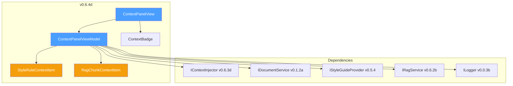

# LCS-DES-064d: Design Specification — Context Panel

## 1. Metadata & Categorization

| Field           | Value                                     |
| :-------------- | :---------------------------------------- |
| **Document ID** | LCS-DES-064d                              |
| **Version**     | v0.6.4d                                   |
| **Status**      | Draft                                     |
| **Category**    | UI/UX                                     |
| **Module**      | Lexichord.Modules.Agents                  |
| **Created**     | 2026-01-27                                |
| **Author**      | Documentation Agent                       |
| **Parent**      | [LCS-DES-064-INDEX](LCS-DES-064-INDEX.md) |

---

## 2. Executive Summary

### 2.1 The Requirement

Users need visibility into what context is being sent to the AI, including style rules, RAG context, and document information. Without this, users cannot understand or control AI behavior.

### 2.2 The Proposed Solution

Create a collapsible `ContextPanelView` displaying:

- **Style Rules Active**: Count and list of applied style rules
- **RAG Context**: Retrieved chunk summaries with token counts
- **Document Context**: Current file path and selection info
- **Toggle Switches**: Enable/disable each context source per-conversation
- **Token Budget**: Visual estimate of context token usage

---

## 3. Architecture

### 3.1 Component Placement

```text
Lexichord.Modules.Agents/
└── Chat/
    ├── Views/
    │   ├── ContextPanelView.axaml
    │   └── ContextPanelView.axaml.cs
    ├── ViewModels/
    │   ├── ContextPanelViewModel.cs
    │   ├── StyleRuleContextItem.cs
    │   └── RagChunkContextItem.cs
    └── Controls/
        └── ContextBadge.axaml
```

### 3.2 Dependency Graph



---

## 4. Data Contract

### 4.1 ContextPanelViewModel

```csharp
namespace Lexichord.Modules.Agents.Chat.ViewModels;

/// <summary>
/// ViewModel for the context panel, managing visibility and state of AI context sources.
/// </summary>
/// <remarks>
/// <para>
/// The <see cref="ContextPanelViewModel"/> provides transparency into what context
/// is being assembled for AI prompts. It displays:
/// </para>
/// <list type="bullet">
///   <item>Active style rules from the Style Guide Provider</item>
///   <item>Retrieved RAG chunks with relevance scores</item>
///   <item>Current document context and selection</item>
///   <item>Token budget usage and estimates</item>
/// </list>
/// <para>
/// Users can toggle individual context sources on/off per conversation,
/// allowing fine-grained control over what information the AI receives.
/// </para>
/// </remarks>
/// <example>
/// <code>
/// // Typical usage in CoPilotViewModel
/// public class CoPilotViewModel
/// {
///     public ContextPanelViewModel ContextPanel { get; }
///
///     private async Task PrepareContextAsync()
///     {
///         await ContextPanel.RefreshContextCommand.ExecuteAsync(null);
///
///         if (ContextPanel.IsOverBudget)
///             ShowWarning("Context exceeds token budget");
///     }
/// }
/// </code>
/// </example>
public partial class ContextPanelViewModel : ObservableObject, IDisposable
{
    private readonly IContextInjector _injector;
    private readonly IDocumentService _documentService;
    private readonly IStyleGuideProvider _styleProvider;
    private readonly IRagService _ragService;
    private readonly ISettingsService _settings;
    private readonly ILogger<ContextPanelViewModel> _logger;
    private bool _disposed;

    #region Observable Properties

    /// <summary>
    /// Gets or sets whether the panel is expanded.
    /// </summary>
    [ObservableProperty]
    private bool _isExpanded = false;

    /// <summary>
    /// Gets or sets whether the context panel is loading.
    /// </summary>
    [ObservableProperty]
    private bool _isLoading;

    /// <summary>
    /// Gets or sets whether style rules are included in context.
    /// </summary>
    [ObservableProperty]
    [NotifyPropertyChangedFor(nameof(StyleRuleCount))]
    [NotifyPropertyChangedFor(nameof(EstimatedContextTokens))]
    [NotifyPropertyChangedFor(nameof(TokenBudgetPercentage))]
    [NotifyPropertyChangedFor(nameof(ContextSummary))]
    private bool _styleRulesEnabled = true;

    /// <summary>
    /// Gets or sets whether RAG context is included.
    /// </summary>
    [ObservableProperty]
    [NotifyPropertyChangedFor(nameof(RagChunkCount))]
    [NotifyPropertyChangedFor(nameof(EstimatedContextTokens))]
    [NotifyPropertyChangedFor(nameof(TokenBudgetPercentage))]
    [NotifyPropertyChangedFor(nameof(ContextSummary))]
    private bool _ragContextEnabled = true;

    /// <summary>
    /// Gets or sets whether document context is included.
    /// </summary>
    [ObservableProperty]
    [NotifyPropertyChangedFor(nameof(EstimatedContextTokens))]
    [NotifyPropertyChangedFor(nameof(TokenBudgetPercentage))]
    [NotifyPropertyChangedFor(nameof(ContextSummary))]
    private bool _documentContextEnabled = true;

    /// <summary>
    /// Gets or sets whether custom instructions are included.
    /// </summary>
    [ObservableProperty]
    [NotifyPropertyChangedFor(nameof(EstimatedContextTokens))]
    [NotifyPropertyChangedFor(nameof(TokenBudgetPercentage))]
    private bool _customInstructionsEnabled = true;

    /// <summary>
    /// Gets or sets the collection of active style rules.
    /// </summary>
    [ObservableProperty]
    private ObservableCollection<StyleRuleContextItem> _activeStyleRules = [];

    /// <summary>
    /// Gets or sets the collection of RAG chunks.
    /// </summary>
    [ObservableProperty]
    private ObservableCollection<RagChunkContextItem> _ragChunks = [];

    /// <summary>
    /// Gets or sets the current document path.
    /// </summary>
    [ObservableProperty]
    [NotifyPropertyChangedFor(nameof(HasDocumentContext))]
    [NotifyPropertyChangedFor(nameof(DocumentFileName))]
    private string? _currentDocumentPath;

    /// <summary>
    /// Gets or sets the selected text from the document.
    /// </summary>
    [ObservableProperty]
    [NotifyPropertyChangedFor(nameof(HasSelection))]
    [NotifyPropertyChangedFor(nameof(SelectionCharCount))]
    private string? _selectedText;

    /// <summary>
    /// Gets or sets custom instructions text.
    /// </summary>
    [ObservableProperty]
    [NotifyPropertyChangedFor(nameof(CustomInstructionsTokens))]
    [NotifyPropertyChangedFor(nameof(EstimatedContextTokens))]
    private string? _customInstructions;

    /// <summary>
    /// Gets or sets the maximum RAG chunks to retrieve.
    /// </summary>
    [ObservableProperty]
    private int _maxRagChunks = 5;

    /// <summary>
    /// Gets or sets the last error message.
    /// </summary>
    [ObservableProperty]
    private string? _lastError;

    /// <summary>
    /// Gets or sets the last refresh timestamp.
    /// </summary>
    [ObservableProperty]
    private DateTime? _lastRefreshTime;

    #endregion

    #region Computed Properties

    /// <summary>
    /// Count of active style rules when enabled.
    /// </summary>
    public int StyleRuleCount => StyleRulesEnabled ? ActiveStyleRules.Count : 0;

    /// <summary>
    /// Total tokens from style rules.
    /// </summary>
    public int StyleRulesTokens => StyleRulesEnabled
        ? ActiveStyleRules.Sum(r => r.EstimatedTokens)
        : 0;

    /// <summary>
    /// Count of RAG chunks when enabled.
    /// </summary>
    public int RagChunkCount => RagContextEnabled ? RagChunks.Count : 0;

    /// <summary>
    /// Total tokens from RAG chunks.
    /// </summary>
    public int RagContextTokens => RagContextEnabled
        ? RagChunks.Sum(c => c.EstimatedTokens)
        : 0;

    /// <summary>
    /// Whether there is document context available.
    /// </summary>
    public bool HasDocumentContext => !string.IsNullOrEmpty(CurrentDocumentPath);

    /// <summary>
    /// Whether there is selected text.
    /// </summary>
    public bool HasSelection => !string.IsNullOrEmpty(SelectedText);

    /// <summary>
    /// Character count of selected text.
    /// </summary>
    public int SelectionCharCount => SelectedText?.Length ?? 0;

    /// <summary>
    /// Tokens from document context.
    /// </summary>
    public int DocumentContextTokens
    {
        get
        {
            if (!DocumentContextEnabled)
                return 0;

            var tokens = 0;

            if (HasDocumentContext)
                tokens += DocumentMetadataTokens;

            if (HasSelection)
                tokens += EstimateTokens(SelectedText!);

            return tokens;
        }
    }

    /// <summary>
    /// Tokens from custom instructions.
    /// </summary>
    public int CustomInstructionsTokens => CustomInstructionsEnabled && CustomInstructions is not null
        ? EstimateTokens(CustomInstructions)
        : 0;

    /// <summary>
    /// Just the document filename.
    /// </summary>
    public string? DocumentFileName => CurrentDocumentPath is not null
        ? Path.GetFileName(CurrentDocumentPath)
        : null;

    /// <summary>
    /// Summary text for collapsed view.
    /// </summary>
    /// <remarks>
    /// Produces a compact summary like "5 rules, 3 chunks, doc" for the header.
    /// </remarks>
    public string ContextSummary
    {
        get
        {
            var parts = new List<string>();

            if (StyleRulesEnabled && ActiveStyleRules.Count > 0)
                parts.Add($"{ActiveStyleRules.Count} rules");

            if (RagContextEnabled && RagChunks.Count > 0)
                parts.Add($"{RagChunks.Count} chunks");

            if (DocumentContextEnabled && CurrentDocumentPath is not null)
                parts.Add("doc");

            if (CustomInstructionsEnabled && !string.IsNullOrEmpty(CustomInstructions))
                parts.Add("custom");

            return parts.Count > 0
                ? string.Join(", ", parts)
                : "No context";
        }
    }

    /// <summary>
    /// Estimated total tokens for all enabled context.
    /// </summary>
    public int EstimatedContextTokens =>
        StyleRulesTokens + RagContextTokens + DocumentContextTokens + CustomInstructionsTokens;

    /// <summary>
    /// Token budget usage as percentage (0-100).
    /// </summary>
    public int TokenBudgetPercentage =>
        Math.Min(100, EstimatedContextTokens * 100 / MaxTokenBudget);

    /// <summary>
    /// Whether context exceeds the budget.
    /// </summary>
    public bool IsOverBudget => EstimatedContextTokens > MaxTokenBudget;

    /// <summary>
    /// Tokens remaining in the budget.
    /// </summary>
    public int RemainingTokenBudget => Math.Max(0, MaxTokenBudget - EstimatedContextTokens);

    /// <summary>
    /// Maximum token budget from settings.
    /// </summary>
    public int MaxTokenBudget =>
        _settings.GetValue("Chat.MaxContextTokens", DefaultMaxTokenBudget);

    /// <summary>
    /// Number of enabled context sources.
    /// </summary>
    public int EnabledSourceCount
    {
        get
        {
            var count = 0;
            if (StyleRulesEnabled) count++;
            if (RagContextEnabled) count++;
            if (DocumentContextEnabled) count++;
            if (CustomInstructionsEnabled) count++;
            return count;
        }
    }

    /// <summary>
    /// Provides access to IContextInjector for message building.
    /// </summary>
    public IContextInjector Injector => _injector;

    #endregion

    #region Constants

    /// <summary>
    /// Default max token budget.
    /// </summary>
    private const int DefaultMaxTokenBudget = 4096;

    /// <summary>
    /// Tokens estimated for document metadata.
    /// </summary>
    private const int DocumentMetadataTokens = 50;

    /// <summary>
    /// Tokens per character estimate (1 token ≈ 4 chars for English).
    /// </summary>
    private const double TokensPerChar = 0.25;

    #endregion

    /// <summary>
    /// Initializes a new instance of the <see cref="ContextPanelViewModel"/> class.
    /// </summary>
    /// <param name="injector">The context injector service.</param>
    /// <param name="documentService">The document service.</param>
    /// <param name="styleProvider">The style guide provider.</param>
    /// <param name="ragService">The RAG service.</param>
    /// <param name="settings">The settings service.</param>
    /// <param name="logger">The logger.</param>
    /// <exception cref="ArgumentNullException">Thrown if any parameter is null.</exception>
    public ContextPanelViewModel(
        IContextInjector injector,
        IDocumentService documentService,
        IStyleGuideProvider styleProvider,
        IRagService ragService,
        ISettingsService settings,
        ILogger<ContextPanelViewModel> logger)
    {
        _injector = injector ?? throw new ArgumentNullException(nameof(injector));
        _documentService = documentService ?? throw new ArgumentNullException(nameof(documentService));
        _styleProvider = styleProvider ?? throw new ArgumentNullException(nameof(styleProvider));
        _ragService = ragService ?? throw new ArgumentNullException(nameof(ragService));
        _settings = settings ?? throw new ArgumentNullException(nameof(settings));
        _logger = logger ?? throw new ArgumentNullException(nameof(logger));

        // Subscribe to document changes
        _documentService.ActiveDocumentChanged += OnActiveDocumentChanged;
        _documentService.SelectionChanged += OnSelectionChanged;

        _logger.LogDebug("ContextPanelViewModel initialized");
    }

    #region Commands

    /// <summary>
    /// Refreshes all context sources.
    /// </summary>
    [RelayCommand]
    private async Task RefreshContextAsync(CancellationToken ct = default)
    {
        if (IsLoading)
            return;

        try
        {
            IsLoading = true;
            LastError = null;
            _logger.LogDebug("Refreshing context panel");

            // Load style rules
            await LoadStyleRulesAsync(ct);

            // Load RAG chunks based on current document
            await LoadRagChunksAsync(ct);

            // Update document context
            UpdateDocumentContext();

            // Update timestamp
            LastRefreshTime = DateTime.Now;

            // Notify all computed properties
            NotifyAllComputedProperties();

            _logger.LogInformation(
                "Context refreshed: {Rules} rules (~{RuleTokens} tk), " +
                "{Chunks} chunks (~{ChunkTokens} tk), ~{Total} tokens total",
                StyleRuleCount, StyleRulesTokens,
                RagChunkCount, RagContextTokens,
                EstimatedContextTokens);

            if (IsOverBudget)
            {
                _logger.LogWarning(
                    "Context exceeds token budget: {Current} > {Max}",
                    EstimatedContextTokens, MaxTokenBudget);
            }
        }
        catch (OperationCanceledException)
        {
            _logger.LogDebug("Context refresh cancelled");
        }
        catch (Exception ex)
        {
            LastError = ex.Message;
            _logger.LogError(ex, "Failed to refresh context");
        }
        finally
        {
            IsLoading = false;
        }
    }

    /// <summary>
    /// Toggles the panel expansion state.
    /// </summary>
    [RelayCommand]
    private void ToggleExpanded()
    {
        IsExpanded = !IsExpanded;
        _logger.LogDebug("Context panel toggled: {State}", IsExpanded ? "expanded" : "collapsed");
    }

    /// <summary>
    /// Removes a specific RAG chunk from context.
    /// </summary>
    /// <param name="chunk">The chunk to remove.</param>
    [RelayCommand]
    private void RemoveRagChunk(RagChunkContextItem chunk)
    {
        if (RagChunks.Remove(chunk))
        {
            _logger.LogDebug("RAG chunk removed: {ChunkId}", chunk.ChunkId);
            NotifyAllComputedProperties();
        }
    }

    /// <summary>
    /// Clears all RAG chunks.
    /// </summary>
    [RelayCommand]
    private void ClearRagChunks()
    {
        RagChunks.Clear();
        _logger.LogDebug("All RAG chunks cleared");
        NotifyAllComputedProperties();
    }

    /// <summary>
    /// Disables all context sources.
    /// </summary>
    [RelayCommand]
    private void DisableAllSources()
    {
        StyleRulesEnabled = false;
        RagContextEnabled = false;
        DocumentContextEnabled = false;
        CustomInstructionsEnabled = false;

        _logger.LogDebug("All context sources disabled");
    }

    /// <summary>
    /// Enables all context sources.
    /// </summary>
    [RelayCommand]
    private void EnableAllSources()
    {
        StyleRulesEnabled = true;
        RagContextEnabled = true;
        DocumentContextEnabled = true;
        CustomInstructionsEnabled = true;

        _logger.LogDebug("All context sources enabled");
    }

    #endregion

    #region Private Methods

    private async Task LoadStyleRulesAsync(CancellationToken ct)
    {
        ActiveStyleRules.Clear();

        var rules = await _styleProvider.GetActiveRulesAsync(ct);
        foreach (var rule in rules)
        {
            ActiveStyleRules.Add(new StyleRuleContextItem(
                rule.RuleId,
                rule.RuleName,
                rule.Description ?? string.Empty,
                rule.Category,
                EstimateTokens(rule.Content),
                rule.IsActive,
                rule.Severity
            ));
        }

        _logger.LogDebug("Loaded {Count} style rules", ActiveStyleRules.Count);
    }

    private async Task LoadRagChunksAsync(CancellationToken ct)
    {
        RagChunks.Clear();

        if (CurrentDocumentPath is null)
            return;

        try
        {
            var query = SelectedText ?? string.Empty;
            if (string.IsNullOrWhiteSpace(query))
            {
                // Use document content as query if no selection
                var docContent = await _documentService.GetDocumentContentAsync(CurrentDocumentPath, ct);
                query = docContent.Length > 500 ? docContent[..500] : docContent;
            }

            var chunks = await _ragService.RetrieveRelevantChunksAsync(query, MaxRagChunks, ct);
            foreach (var chunk in chunks)
            {
                RagChunks.Add(new RagChunkContextItem(
                    chunk.ChunkId,
                    chunk.SourceDocument,
                    chunk.SourcePath,
                    chunk.Content,
                    chunk.Summary,
                    EstimateTokens(chunk.Content),
                    chunk.RelevanceScore
                ));
            }

            _logger.LogDebug("Loaded {Count} RAG chunks", RagChunks.Count);
        }
        catch (Exception ex)
        {
            _logger.LogError(ex, "Failed to load RAG chunks");
        }
    }

    private void UpdateDocumentContext()
    {
        var activeDoc = _documentService.ActiveDocument;
        CurrentDocumentPath = activeDoc?.FilePath;
        SelectedText = activeDoc?.SelectedText;
    }

    private void OnActiveDocumentChanged(object? sender, DocumentChangedEventArgs e)
    {
        _logger.LogDebug("Active document changed: {Path}", e.NewDocument?.FilePath);
        UpdateDocumentContext();
        NotifyAllComputedProperties();
    }

    private void OnSelectionChanged(object? sender, SelectionChangedEventArgs e)
    {
        SelectedText = e.SelectedText;
        NotifyAllComputedProperties();
    }

    private void NotifyAllComputedProperties()
    {
        OnPropertyChanged(nameof(StyleRuleCount));
        OnPropertyChanged(nameof(StyleRulesTokens));
        OnPropertyChanged(nameof(RagChunkCount));
        OnPropertyChanged(nameof(RagContextTokens));
        OnPropertyChanged(nameof(DocumentContextTokens));
        OnPropertyChanged(nameof(CustomInstructionsTokens));
        OnPropertyChanged(nameof(ContextSummary));
        OnPropertyChanged(nameof(EstimatedContextTokens));
        OnPropertyChanged(nameof(TokenBudgetPercentage));
        OnPropertyChanged(nameof(IsOverBudget));
        OnPropertyChanged(nameof(RemainingTokenBudget));
        OnPropertyChanged(nameof(EnabledSourceCount));
    }

    /// <summary>
    /// Estimates token count from text using character-based heuristic.
    /// </summary>
    /// <param name="text">The text to estimate.</param>
    /// <returns>Estimated token count.</returns>
    private static int EstimateTokens(string text) =>
        (int)(text.Length * TokensPerChar);

    /// <inheritdoc />
    public void Dispose()
    {
        if (_disposed)
            return;

        _documentService.ActiveDocumentChanged -= OnActiveDocumentChanged;
        _documentService.SelectionChanged -= OnSelectionChanged;
        _disposed = true;

        _logger.LogDebug("ContextPanelViewModel disposed");
    }

    #endregion
}
```

### 4.2 StyleRuleContextItem

```csharp
namespace Lexichord.Modules.Agents.Chat.ViewModels;

/// <summary>
/// Represents a style rule displayed in the context panel.
/// </summary>
/// <remarks>
/// Each style rule shows its category, name, and estimated token impact
/// on the AI context. Users can see which style rules are actively
/// influencing the AI's responses.
/// </remarks>
/// <param name="RuleId">Unique identifier for the rule.</param>
/// <param name="Name">Display name of the rule.</param>
/// <param name="Description">Brief description of what the rule enforces.</param>
/// <param name="Category">Category (Grammar, Style, Voice, Formatting).</param>
/// <param name="EstimatedTokens">Approximate token count when included.</param>
/// <param name="IsActive">Whether the rule is currently active.</param>
/// <param name="Severity">Rule severity level.</param>
public record StyleRuleContextItem(
    string RuleId,
    string Name,
    string Description,
    string Category,
    int EstimatedTokens,
    bool IsActive,
    RuleSeverity Severity = RuleSeverity.Information
)
{
    /// <summary>
    /// Display name with category prefix.
    /// </summary>
    public string DisplayName => $"{Category}: {Name}";

    /// <summary>
    /// Short name for compact display.
    /// </summary>
    public string ShortName => Name.Length > 25 ? Name[..22] + "..." : Name;

    /// <summary>
    /// Icon for the rule category.
    /// </summary>
    public string CategoryIcon => Category switch
    {
        "Grammar" => "📝",
        "Style" => "🎨",
        "Voice" => "🗣️",
        "Formatting" => "📋",
        "Terminology" => "📖",
        "Punctuation" => "✏️",
        _ => "📌"
    };

    /// <summary>
    /// Severity indicator.
    /// </summary>
    public string SeverityIcon => Severity switch
    {
        RuleSeverity.Error => "🔴",
        RuleSeverity.Warning => "🟡",
        RuleSeverity.Information => "🔵",
        RuleSeverity.Hint => "⚪",
        _ => "⚪"
    };

    /// <summary>
    /// Tooltip text combining all rule information.
    /// </summary>
    public string TooltipText =>
        $"{DisplayName}\n{Description}\n~{EstimatedTokens} tokens";
}

/// <summary>
/// Rule severity levels.
/// </summary>
public enum RuleSeverity
{
    /// <summary>Hint-level suggestion.</summary>
    Hint,

    /// <summary>Informational rule.</summary>
    Information,

    /// <summary>Warning-level rule.</summary>
    Warning,

    /// <summary>Error-level rule.</summary>
    Error
}
```

### 4.3 RagChunkContextItem

```csharp
namespace Lexichord.Modules.Agents.Chat.ViewModels;

/// <summary>
/// Represents a RAG (Retrieval-Augmented Generation) chunk in the context panel.
/// </summary>
/// <remarks>
/// RAG chunks are retrieved from the knowledge base based on semantic
/// similarity to the user's query. Each chunk shows its source, summary,
/// and relevance score to help users understand what knowledge is being
/// used to augment the AI's responses.
/// </remarks>
/// <param name="ChunkId">Unique identifier for the chunk.</param>
/// <param name="SourceDocument">Name of the source document.</param>
/// <param name="SourcePath">Full path to the source document.</param>
/// <param name="Content">Full content of the chunk.</param>
/// <param name="Summary">Brief summary for display.</param>
/// <param name="EstimatedTokens">Approximate token count.</param>
/// <param name="RelevanceScore">Semantic similarity score (0.0 to 1.0).</param>
public record RagChunkContextItem(
    string ChunkId,
    string SourceDocument,
    string SourcePath,
    string Content,
    string Summary,
    int EstimatedTokens,
    float RelevanceScore
)
{
    /// <summary>
    /// Truncated summary for display (max 80 chars).
    /// </summary>
    public string TruncatedSummary =>
        Summary.Length > 80 ? Summary[..77] + "..." : Summary;

    /// <summary>
    /// First line of content for preview.
    /// </summary>
    public string ContentPreview
    {
        get
        {
            var firstLine = Content.Split('\n').FirstOrDefault()?.Trim() ?? Content;
            return firstLine.Length > 100 ? firstLine[..97] + "..." : firstLine;
        }
    }

    /// <summary>
    /// Relevance as percentage (0-100).
    /// </summary>
    public int RelevancePercentage => (int)(RelevanceScore * 100);

    /// <summary>
    /// Relevance tier for styling.
    /// </summary>
    public RelevanceTier Relevance => RelevanceScore switch
    {
        >= 0.9f => RelevanceTier.VeryHigh,
        >= 0.75f => RelevanceTier.High,
        >= 0.5f => RelevanceTier.Medium,
        >= 0.25f => RelevanceTier.Low,
        _ => RelevanceTier.VeryLow
    };

    /// <summary>
    /// Relevance indicator for display.
    /// </summary>
    public string RelevanceIndicator => Relevance switch
    {
        RelevanceTier.VeryHigh => "🟢",
        RelevanceTier.High => "🟡",
        RelevanceTier.Medium => "🟠",
        RelevanceTier.Low => "🔴",
        RelevanceTier.VeryLow => "⚫",
        _ => "⚪"
    };

    /// <summary>
    /// Tooltip with full chunk information.
    /// </summary>
    public string TooltipText =>
        $"Source: {SourceDocument}\nPath: {SourcePath}\nRelevance: {RelevancePercentage}%\n\n{Summary}";
}

/// <summary>
/// Relevance tier for RAG chunks.
/// </summary>
public enum RelevanceTier
{
    /// <summary>Very low relevance (&lt;25%).</summary>
    VeryLow,

    /// <summary>Low relevance (25-50%).</summary>
    Low,

    /// <summary>Medium relevance (50-75%).</summary>
    Medium,

    /// <summary>High relevance (75-90%).</summary>
    High,

    /// <summary>Very high relevance (>90%).</summary>
    VeryHigh
}
```

### 4.4 ContextSnapshot

````csharp
namespace Lexichord.Modules.Agents.Chat.Models;

/// <summary>
/// A snapshot of the current context state for building prompts.
/// </summary>
/// <remarks>
/// This record captures the current enabled context sources and their
/// content for use by the <see cref="IContextInjector"/> when building
/// the system prompt. It is immutable to ensure thread-safety.
/// </remarks>
/// <param name="StyleRules">Active style rules if enabled.</param>
/// <param name="RagChunks">Retrieved RAG chunks if enabled.</param>
/// <param name="DocumentPath">Current document path if enabled.</param>
/// <param name="SelectedText">Selected text if any.</param>
/// <param name="CustomInstructions">Custom instructions if enabled.</param>
/// <param name="EstimatedTokens">Total estimated token count.</param>
public record ContextSnapshot(
    IReadOnlyList<StyleRuleContextItem> StyleRules,
    IReadOnlyList<RagChunkContextItem> RagChunks,
    string? DocumentPath,
    string? SelectedText,
    string? CustomInstructions,
    int EstimatedTokens
)
{
    /// <summary>
    /// Creates a snapshot from the current ViewModel state.
    /// </summary>
    /// <param name="viewModel">The context panel ViewModel.</param>
    /// <returns>An immutable snapshot of the context.</returns>
    public static ContextSnapshot FromViewModel(ContextPanelViewModel viewModel)
    {
        return new ContextSnapshot(
            viewModel.StyleRulesEnabled
                ? viewModel.ActiveStyleRules.ToList()
                : Array.Empty<StyleRuleContextItem>(),
            viewModel.RagContextEnabled
                ? viewModel.RagChunks.ToList()
                : Array.Empty<RagChunkContextItem>(),
            viewModel.DocumentContextEnabled ? viewModel.CurrentDocumentPath : null,
            viewModel.DocumentContextEnabled ? viewModel.SelectedText : null,
            viewModel.CustomInstructionsEnabled ? viewModel.CustomInstructions : null,
            viewModel.EstimatedContextTokens
        );
    }

    /// <summary>
    /// Gets whether any context is present.
    /// </summary>
    public bool HasContent =>
        StyleRules.Count > 0 ||
        RagChunks.Count > 0 ||
        DocumentPath is not null ||
        CustomInstructions is not null;

    /// <summary>
    /// Gets the total count of context items.
    /// </summary>
    public int TotalItemCount =>
        StyleRules.Count + RagChunks.Count +
        (DocumentPath is not null ? 1 : 0) +
        (CustomInstructions is not null ? 1 : 0);

    /// <summary>
    /// Empty snapshot with no context.
    /// </summary>
    public static ContextSnapshot Empty => new(
        Array.Empty<StyleRuleContextItem>(),
        Array.Empty<RagChunkContextItem>(),
        null, null, null, 0
    );
}

---

## 5. UI/UX Specifications

### 5.1 Layout

```text
Collapsed View:
┌──────────────────────────────────────────────────────────────────┐
│  ▶ Context (5 rules, 3 chunks, custom)        ~250 tokens  [↻]  │
└──────────────────────────────────────────────────────────────────┘

Expanded View:
┌──────────────────────────────────────────────────────────────────┐
│  ▼ Context                                    ~250 tokens  [↻]  │
├──────────────────────────────────────────────────────────────────┤
│  ┌────────────────────────────────────────────────────────────┐  │
│  │ Token Budget                    ████████████░░░░░░  61%    │  │
│  │ Remaining: 1,596 tokens                                    │  │
│  └────────────────────────────────────────────────────────────┘  │
├──────────────────────────────────────────────────────────────────┤
│  ☑ Style Rules (5 active)                              ~120 tk  │
│    ├─ 📝🔵 Grammar: Active Voice                                │
│    ├─ 🎨🔵 Style: Concise Writing                               │
│    ├─ 🗣️🟡 Voice: Professional Tone                             │
│    ├─ 📖🔵 Terminology: Domain Terms                            │
│    └─ ✏️⚪ Punctuation: Serial Comma                            │
├──────────────────────────────────────────────────────────────────┤
│  ☑ RAG Context (3 chunks)                      [Clear All] ~80 tk│
│    ├─ 🟢 architecture.md: "The core module handles..."   92% [×]│
│    ├─ 🟡 patterns.md: "Dependency injection is a..."     85% [×]│
│    └─ 🟠 services.md: "Service registration occurs..."   65% [×]│
├──────────────────────────────────────────────────────────────────┤
│  ☑ Document: feature.md                                  ~75 tk  │
│    └─ Selection: "The user wants to..." (45 chars, ~11 tk)      │
├──────────────────────────────────────────────────────────────────┤
│  ☑ Custom Instructions                                   ~25 tk  │
│    └─ "Be concise and focus on..."                              │
├──────────────────────────────────────────────────────────────────┤
│  [Disable All Sources]  [Enable All Sources]  Last: 2s ago      │
└──────────────────────────────────────────────────────────────────┘

Over-Budget Warning:
┌──────────────────────────────────────────────────────────────────┐
│  ▼ Context                                   ~5,200 tokens  [↻] │
├──────────────────────────────────────────────────────────────────┤
│  ┌────────────────────────────────────────────────────────────┐  │
│  │ Token Budget  ⚠️ OVER BUDGET ████████████████████  127%    │  │
│  │ Exceeded by: 1,104 tokens                                  │  │
│  └────────────────────────────────────────────────────────────┘  │
└──────────────────────────────────────────────────────────────────┘

Loading State:
┌──────────────────────────────────────────────────────────────────┐
│  ▼ Context                         [⟳ Refreshing...]   ~? tokens│
└──────────────────────────────────────────────────────────────────┘

Error State:
┌──────────────────────────────────────────────────────────────────┐
│  ▼ Context                                    ~250 tokens  [↻]  │
├──────────────────────────────────────────────────────────────────┤
│  ⚠️ Failed to load style rules: Connection timeout              │
└──────────────────────────────────────────────────────────────────┘
```

### 5.2 ContextPanelView.axaml

```xml
<UserControl x:Class="Lexichord.Modules.Agents.Chat.Views.ContextPanelView"
             xmlns="https://github.com/avaloniaui"
             xmlns:x="http://schemas.microsoft.com/winfx/2006/xaml"
             xmlns:vm="using:Lexichord.Modules.Agents.Chat.ViewModels"
             xmlns:converters="using:Lexichord.Modules.Agents.Chat.Converters"
             x:DataType="vm:ContextPanelViewModel">

    <UserControl.Resources>
        <converters:SumTokensConverter x:Key="SumTokensConverter"/>
        <converters:BoolToVisibilityConverter x:Key="BoolToVisibility"/>
        <converters:BudgetToColorConverter x:Key="BudgetToColor"/>
        <converters:TimeAgoConverter x:Key="TimeAgo"/>
    </UserControl.Resources>

    <UserControl.Styles>
        <!-- Context Panel Base -->
        <Style Selector="Border.context-panel">
            <Setter Property="Background" Value="{DynamicResource ContextPanelBackground}"/>
            <Setter Property="BorderBrush" Value="{DynamicResource ContextPanelBorder}"/>
            <Setter Property="CornerRadius" Value="4"/>
        </Style>

        <!-- Section Styling -->
        <Style Selector="Border.context-section">
            <Setter Property="Background" Value="{DynamicResource ContextSectionBackground}"/>
            <Setter Property="Padding" Value="8"/>
            <Setter Property="CornerRadius" Value="4"/>
            <Setter Property="Margin" Value="0,4,0,0"/>
        </Style>

        <!-- Token Budget Progress Bar -->
        <Style Selector="ProgressBar.token-budget">
            <Setter Property="Height" Value="8"/>
            <Setter Property="Foreground" Value="{DynamicResource BudgetNormalColor}"/>
        </Style>

        <Style Selector="ProgressBar.token-budget.warning">
            <Setter Property="Foreground" Value="{DynamicResource BudgetWarningColor}"/>
        </Style>

        <Style Selector="ProgressBar.token-budget.over-budget">
            <Setter Property="Foreground" Value="{DynamicResource BudgetOverColor}"/>
        </Style>

        <!-- Token Count Labels -->
        <Style Selector="TextBlock.token-count">
            <Setter Property="Foreground" Value="{DynamicResource TokenCountForeground}"/>
            <Setter Property="FontSize" Value="12"/>
            <Setter Property="Opacity" Value="0.8"/>
        </Style>

        <!-- Context Summary -->
        <Style Selector="TextBlock.context-summary">
            <Setter Property="Foreground" Value="{DynamicResource SecondaryForeground}"/>
            <Setter Property="FontSize" Value="12"/>
        </Style>

        <!-- Section Header -->
        <Style Selector="TextBlock.section-header">
            <Setter Property="FontWeight" Value="SemiBold"/>
            <Setter Property="VerticalAlignment" Value="Center"/>
        </Style>

        <!-- Selection Preview -->
        <Style Selector="TextBlock.selection-preview">
            <Setter Property="FontStyle" Value="Italic"/>
            <Setter Property="Foreground" Value="{DynamicResource SelectionPreviewForeground}"/>
            <Setter Property="FontSize" Value="12"/>
        </Style>

        <!-- Relevance Score -->
        <Style Selector="TextBlock.relevance">
            <Setter Property="FontSize" Value="11"/>
            <Setter Property="Margin" Value="8,0,0,0"/>
        </Style>

        <!-- Error Display -->
        <Style Selector="Border.error-banner">
            <Setter Property="Background" Value="{DynamicResource ErrorBannerBackground}"/>
            <Setter Property="Padding" Value="8,4"/>
            <Setter Property="CornerRadius" Value="4"/>
        </Style>

        <Style Selector="TextBlock.error-text">
            <Setter Property="Foreground" Value="{DynamicResource ErrorForeground}"/>
            <Setter Property="FontSize" Value="12"/>
        </Style>

        <!-- Loading Indicator -->
        <Style Selector="TextBlock.loading-text">
            <Setter Property="FontStyle" Value="Italic"/>
            <Setter Property="Foreground" Value="{DynamicResource LoadingForeground}"/>
        </Style>

        <!-- Remove Button -->
        <Style Selector="Button.remove-chunk">
            <Setter Property="Background" Value="Transparent"/>
            <Setter Property="BorderThickness" Value="0"/>
            <Setter Property="Padding" Value="2"/>
            <Setter Property="Cursor" Value="Hand"/>
            <Setter Property="Opacity" Value="0.6"/>
        </Style>

        <Style Selector="Button.remove-chunk:pointerover">
            <Setter Property="Opacity" Value="1"/>
        </Style>

        <!-- Last Refresh Time -->
        <Style Selector="TextBlock.last-refresh">
            <Setter Property="FontSize" Value="11"/>
            <Setter Property="Foreground" Value="{DynamicResource SecondaryForeground}"/>
            <Setter Property="VerticalAlignment" Value="Center"/>
        </Style>
    </UserControl.Styles>

    <Border Classes="context-panel" BorderThickness="0,1" Padding="8">
        <Expander IsExpanded="{Binding IsExpanded}">
            <!-- Header with loading indicator -->
            <Expander.Header>
                <Grid ColumnDefinitions="*,Auto,Auto,Auto">
                    <StackPanel Grid.Column="0" Orientation="Horizontal">
                        <TextBlock Text="Context" FontWeight="SemiBold"/>
                        <TextBlock Text="{Binding ContextSummary}"
                                   Classes="context-summary" Margin="8,0,0,0"
                                   IsVisible="{Binding !IsLoading}"/>
                        <TextBlock Text="Refreshing..."
                                   Classes="loading-text" Margin="8,0,0,0"
                                   IsVisible="{Binding IsLoading}"/>
                    </StackPanel>

                    <!-- Token estimate with over-budget warning -->
                    <StackPanel Grid.Column="1" Orientation="Horizontal" Margin="8,0">
                        <TextBlock Text="⚠️" IsVisible="{Binding IsOverBudget}"
                                   ToolTip.Tip="Token budget exceeded!"/>
                        <TextBlock Classes="token-estimate"
                                   Foreground="{Binding IsOverBudget, Converter={StaticResource BudgetToColor}}">
                            <Run Text="~"/>
                            <Run Text="{Binding EstimatedContextTokens}"/>
                            <Run Text=" tokens"/>
                        </TextBlock>
                    </StackPanel>

                    <!-- Enabled source count badge -->
                    <Border Grid.Column="2" Background="{DynamicResource BadgeBackground}"
                            CornerRadius="8" Padding="6,2" Margin="4,0"
                            ToolTip.Tip="Number of enabled context sources">
                        <TextBlock Text="{Binding EnabledSourceCount}" FontSize="11"/>
                    </Border>

                    <Button Grid.Column="3"
                            Command="{Binding RefreshContextCommand}"
                            Classes="icon-button"
                            IsEnabled="{Binding !IsLoading}"
                            ToolTip.Tip="Refresh context">
                        <PathIcon Data="{StaticResource RefreshIcon}"/>
                    </Button>
                </Grid>
            </Expander.Header>

            <!-- Content -->
            <StackPanel Spacing="8">
                <!-- Error Banner -->
                <Border Classes="error-banner"
                        IsVisible="{Binding LastError, Converter={x:Static StringConverters.IsNotNullOrEmpty}}">
                    <StackPanel Orientation="Horizontal">
                        <TextBlock Text="⚠️" Margin="0,0,8,0"/>
                        <TextBlock Text="{Binding LastError}" Classes="error-text"/>
                    </StackPanel>
                </Border>

                <!-- Token Budget Section -->
                <Grid RowDefinitions="Auto,Auto,Auto">
                    <Grid Grid.Row="0" ColumnDefinitions="*,Auto">
                        <TextBlock Grid.Column="0" Text="Token Budget" Classes="section-label"/>
                        <TextBlock Grid.Column="1" Classes="last-refresh"
                                   Text="{Binding LastRefreshTime, Converter={StaticResource TimeAgo}, StringFormat='Last: {0}'}"/>
                    </Grid>

                    <Grid Grid.Row="1" ColumnDefinitions="*,Auto">
                        <ProgressBar Grid.Column="0"
                                     Value="{Binding TokenBudgetPercentage}"
                                     Maximum="100"
                                     Classes="token-budget"
                                     Classes.warning="{Binding TokenBudgetPercentage, Converter={StaticResource GreaterThan}, ConverterParameter=75}"
                                     Classes.over-budget="{Binding IsOverBudget}"/>
                        <TextBlock Grid.Column="1"
                                   Classes="percentage"
                                   Margin="8,0,0,0"
                                   Foreground="{Binding IsOverBudget, Converter={StaticResource BudgetToColor}}">
                            <Run Text="{Binding TokenBudgetPercentage}"/>
                            <Run Text="%"/>
                        </TextBlock>
                    </Grid>

                    <!-- Remaining/Exceeded tokens -->
                    <TextBlock Grid.Row="2" FontSize="11"
                               Foreground="{Binding IsOverBudget, Converter={StaticResource BudgetToColor}}">
                        <TextBlock.Text>
                            <MultiBinding StringFormat="{}{0}: {1:N0} tokens">
                                <Binding Path="IsOverBudget" Converter="{StaticResource BoolToText}"
                                         ConverterParameter="Exceeded by|Remaining"/>
                                <Binding Path="RemainingTokenBudget"/>
                            </MultiBinding>
                        </TextBlock.Text>
                    </TextBlock>
                </Grid>

                <!-- Style Rules Section -->
                <Border Classes="context-section">
                    <StackPanel>
                        <Grid ColumnDefinitions="Auto,*,Auto">
                            <CheckBox Grid.Column="0"
                                      IsChecked="{Binding StyleRulesEnabled}"
                                      ToolTip.Tip="Include style rules in context"/>
                            <TextBlock Grid.Column="1"
                                       Classes="section-header">
                                <Run Text="Style Rules ("/>
                                <Run Text="{Binding StyleRuleCount}"/>
                                <Run Text=" active)"/>
                            </TextBlock>
                            <TextBlock Grid.Column="2" Classes="token-count">
                                <Run Text="~"/>
                                <Run Text="{Binding StyleRulesTokens}"/>
                                <Run Text=" tk"/>
                            </TextBlock>
                        </Grid>

                        <ItemsControl ItemsSource="{Binding ActiveStyleRules}"
                                      IsVisible="{Binding StyleRulesEnabled}"
                                      Margin="24,4,0,0">
                            <ItemsControl.ItemTemplate>
                                <DataTemplate DataType="vm:StyleRuleContextItem">
                                    <Grid ColumnDefinitions="Auto,Auto,*,Auto"
                                          ToolTip.Tip="{Binding TooltipText}">
                                        <TextBlock Grid.Column="0" Text="{Binding CategoryIcon}"/>
                                        <TextBlock Grid.Column="1" Text="{Binding SeverityIcon}" Margin="2,0"/>
                                        <TextBlock Grid.Column="2" Text="{Binding ShortName}" Margin="4,0"
                                                   TextTrimming="CharacterEllipsis"/>
                                        <TextBlock Grid.Column="3" Classes="token-count"
                                                   Text="{Binding TokenCount, StringFormat='{}{0} tk'}"/>
                                    </Grid>
                                </DataTemplate>
                            </ItemsControl.ItemTemplate>
                        </ItemsControl>
                    </StackPanel>
                </Border>

                <!-- RAG Context Section -->
                <Border Classes="context-section">
                    <StackPanel>
                        <Grid ColumnDefinitions="Auto,*,Auto,Auto">
                            <CheckBox Grid.Column="0"
                                      IsChecked="{Binding RagContextEnabled}"
                                      ToolTip.Tip="Include RAG chunks in context"/>
                            <TextBlock Grid.Column="1"
                                       Classes="section-header">
                                <Run Text="RAG Context ("/>
                                <Run Text="{Binding RagChunkCount}"/>
                                <Run Text=" chunks)"/>
                            </TextBlock>
                            <Button Grid.Column="2"
                                    Content="Clear All"
                                    Command="{Binding ClearRagChunksCommand}"
                                    Classes="link-button"
                                    IsVisible="{Binding RagChunks.Count}"
                                    Margin="0,0,8,0"/>
                            <TextBlock Grid.Column="3" Classes="token-count">
                                <Run Text="~"/>
                                <Run Text="{Binding RagContextTokens}"/>
                                <Run Text=" tk"/>
                            </TextBlock>
                        </Grid>

                        <ItemsControl ItemsSource="{Binding RagChunks}"
                                      IsVisible="{Binding RagContextEnabled}"
                                      Margin="24,4,0,0">
                            <ItemsControl.ItemTemplate>
                                <DataTemplate DataType="vm:RagChunkContextItem">
                                    <Grid ColumnDefinitions="Auto,*,Auto,Auto"
                                          ToolTip.Tip="{Binding TooltipText}">
                                        <TextBlock Grid.Column="0" Text="{Binding RelevanceIndicator}"
                                                   VerticalAlignment="Center"/>
                                        <StackPanel Grid.Column="1" Margin="4,0">
                                            <TextBlock Text="{Binding SourceDocument}" FontWeight="SemiBold"
                                                       FontSize="12"/>
                                            <TextBlock Text="{Binding ContentPreview}"
                                                       FontSize="11" TextTrimming="CharacterEllipsis"
                                                       Foreground="{DynamicResource SecondaryForeground}"/>
                                        </StackPanel>
                                        <TextBlock Grid.Column="2" Classes="relevance"
                                                   VerticalAlignment="Center">
                                            <Run Text="{Binding RelevancePercentage}"/>
                                            <Run Text="%"/>
                                        </TextBlock>
                                        <Button Grid.Column="3"
                                                Classes="remove-chunk"
                                                Command="{Binding DataContext.RemoveRagChunkCommand, RelativeSource={RelativeSource AncestorType=ItemsControl}}"
                                                CommandParameter="{Binding}"
                                                ToolTip.Tip="Remove this chunk">
                                            <TextBlock Text="×" FontSize="14"/>
                                        </Button>
                                    </Grid>
                                </DataTemplate>
                            </ItemsControl.ItemTemplate>
                        </ItemsControl>
                    </StackPanel>
                </Border>

                <!-- Document Context Section -->
                <Border Classes="context-section">
                    <StackPanel>
                        <Grid ColumnDefinitions="Auto,*,Auto">
                            <CheckBox Grid.Column="0"
                                      IsChecked="{Binding DocumentContextEnabled}"
                                      ToolTip.Tip="Include document context"/>
                            <StackPanel Grid.Column="1">
                                <TextBlock Text="{Binding DocumentFileName, FallbackValue='No document'}"
                                           FontWeight="SemiBold"
                                           TextTrimming="CharacterEllipsis"/>
                                <TextBlock Text="{Binding CurrentDocumentPath}"
                                           FontSize="11" Opacity="0.7"
                                           TextTrimming="CharacterEllipsis"
                                           IsVisible="{Binding HasDocumentContext}"/>
                            </StackPanel>
                            <TextBlock Grid.Column="2" Classes="token-count">
                                <Run Text="~"/>
                                <Run Text="{Binding DocumentContextTokens}"/>
                                <Run Text=" tk"/>
                            </TextBlock>
                        </Grid>

                        <Grid IsVisible="{Binding HasSelection}" Margin="24,4,0,0"
                              ColumnDefinitions="Auto,*">
                            <TextBlock Grid.Column="0" Text="Selection:" FontSize="12"
                                       Foreground="{DynamicResource SecondaryForeground}"/>
                            <TextBlock Grid.Column="1"
                                       Text="{Binding SelectedText}"
                                       TextTrimming="CharacterEllipsis"
                                       MaxLines="1"
                                       Classes="selection-preview"
                                       Margin="4,0,0,0"/>
                        </Grid>
                        <TextBlock IsVisible="{Binding HasSelection}" FontSize="11"
                                   Margin="24,2,0,0"
                                   Foreground="{DynamicResource SecondaryForeground}">
                            <Run Text="("/>
                            <Run Text="{Binding SelectionCharCount}"/>
                            <Run Text=" chars)"/>
                        </TextBlock>
                    </StackPanel>
                </Border>

                <!-- Custom Instructions Section -->
                <Border Classes="context-section"
                        IsVisible="{Binding CustomInstructions, Converter={x:Static StringConverters.IsNotNullOrEmpty}}">
                    <StackPanel>
                        <Grid ColumnDefinitions="Auto,*,Auto">
                            <CheckBox Grid.Column="0"
                                      IsChecked="{Binding CustomInstructionsEnabled}"
                                      ToolTip.Tip="Include custom instructions"/>
                            <TextBlock Grid.Column="1"
                                       Classes="section-header"
                                       Text="Custom Instructions"/>
                            <TextBlock Grid.Column="2" Classes="token-count">
                                <Run Text="~"/>
                                <Run Text="{Binding CustomInstructionsTokens}"/>
                                <Run Text=" tk"/>
                            </TextBlock>
                        </Grid>

                        <TextBlock Text="{Binding CustomInstructions}"
                                   IsVisible="{Binding CustomInstructionsEnabled}"
                                   TextTrimming="CharacterEllipsis"
                                   MaxLines="2"
                                   Classes="selection-preview"
                                   Margin="24,4,0,0"/>
                    </StackPanel>
                </Border>

                <!-- Action Buttons -->
                <Grid ColumnDefinitions="Auto,Auto,*,Auto">
                    <Button Grid.Column="0"
                            Content="Disable All"
                            Command="{Binding DisableAllSourcesCommand}"
                            Classes="link-button"/>
                    <Button Grid.Column="1"
                            Content="Enable All"
                            Command="{Binding EnableAllSourcesCommand}"
                            Classes="link-button"
                            Margin="8,0,0,0"/>
                    <TextBlock Grid.Column="3" Classes="last-refresh"
                               IsVisible="{Binding LastRefreshTime, Converter={StaticResource NotNull}}">
                        <Run Text="Last: "/>
                        <Run Text="{Binding LastRefreshTime, Converter={StaticResource TimeAgo}}"/>
                    </TextBlock>
                </Grid>
            </StackPanel>
        </Expander>
    </Border>
</UserControl>
```

### 5.3 Value Converters

```csharp
namespace Lexichord.Modules.Agents.Chat.Converters;

/// <summary>
/// Sums the TokenCount property of items in a collection.
/// </summary>
public class SumTokensConverter : IValueConverter
{
    public object? Convert(object? value, Type targetType, object? parameter, CultureInfo culture)
    {
        if (value is IEnumerable<StyleRuleContextItem> styleRules)
            return styleRules.Sum(r => r.TokenCount);

        if (value is IEnumerable<RagChunkContextItem> ragChunks)
            return ragChunks.Sum(c => c.TokenCount);

        return 0;
    }

    public object? ConvertBack(object? value, Type targetType, object? parameter, CultureInfo culture)
        => throw new NotSupportedException();
}

/// <summary>
/// Converts budget status to appropriate color.
/// </summary>
public class BudgetToColorConverter : IValueConverter
{
    public IBrush NormalBrush { get; set; } = Brushes.Gray;
    public IBrush WarningBrush { get; set; } = Brushes.Orange;
    public IBrush OverBudgetBrush { get; set; } = Brushes.Red;

    public object? Convert(object? value, Type targetType, object? parameter, CultureInfo culture)
    {
        if (value is bool isOverBudget && isOverBudget)
            return OverBudgetBrush;

        if (value is int percentage)
        {
            if (percentage > 100) return OverBudgetBrush;
            if (percentage > 75) return WarningBrush;
        }

        return NormalBrush;
    }

    public object? ConvertBack(object? value, Type targetType, object? parameter, CultureInfo culture)
        => throw new NotSupportedException();
}

/// <summary>
/// Converts DateTime to relative time string (e.g., "2s ago", "5m ago").
/// </summary>
public class TimeAgoConverter : IValueConverter
{
    public object? Convert(object? value, Type targetType, object? parameter, CultureInfo culture)
    {
        if (value is not DateTime dateTime)
            return null;

        var elapsed = DateTime.Now - dateTime;

        return elapsed.TotalSeconds < 60
            ? $"{(int)elapsed.TotalSeconds}s ago"
            : elapsed.TotalMinutes < 60
                ? $"{(int)elapsed.TotalMinutes}m ago"
                : elapsed.TotalHours < 24
                    ? $"{(int)elapsed.TotalHours}h ago"
                    : dateTime.ToString("MMM d, HH:mm");
    }

    public object? ConvertBack(object? value, Type targetType, object? parameter, CultureInfo culture)
        => throw new NotSupportedException();
}

/// <summary>
/// Selects text based on boolean value.
/// Usage: ConverterParameter="TrueText|FalseText"
/// </summary>
public class BoolToTextConverter : IValueConverter
{
    public object? Convert(object? value, Type targetType, object? parameter, CultureInfo culture)
    {
        if (value is not bool boolValue || parameter is not string paramStr)
            return null;

        var parts = paramStr.Split('|');
        if (parts.Length != 2)
            return null;

        return boolValue ? parts[0] : parts[1];
    }

    public object? ConvertBack(object? value, Type targetType, object? parameter, CultureInfo culture)
        => throw new NotSupportedException();
}
```

### 5.4 ContextPanelView.axaml.cs

```csharp
namespace Lexichord.Modules.Agents.Chat.Views;

/// <summary>
/// Code-behind for ContextPanelView.
/// Handles keyboard shortcuts and accessibility concerns.
/// </summary>
public partial class ContextPanelView : UserControl
{
    public ContextPanelView()
    {
        InitializeComponent();
        KeyDown += OnKeyDown;
    }

    /// <summary>
    /// Handles keyboard shortcuts for context panel operations.
    /// </summary>
    private void OnKeyDown(object? sender, KeyEventArgs e)
    {
        if (DataContext is not ContextPanelViewModel vm)
            return;

        // Ctrl+R: Refresh context
        if (e.KeyModifiers.HasFlag(KeyModifiers.Control) && e.Key == Key.R)
        {
            if (vm.RefreshContextCommand.CanExecute(null))
            {
                vm.RefreshContextCommand.Execute(null);
                e.Handled = true;
            }
        }

        // Space: Toggle expanded state when focused
        if (e.Key == Key.Space && IsFocused)
        {
            vm.ToggleExpandedCommand.Execute(null);
            e.Handled = true;
        }

        // Ctrl+Shift+D: Disable all sources
        if (e.KeyModifiers.HasFlag(KeyModifiers.Control | KeyModifiers.Shift) && e.Key == Key.D)
        {
            vm.DisableAllSourcesCommand.Execute(null);
            e.Handled = true;
        }

        // Ctrl+Shift+E: Enable all sources
        if (e.KeyModifiers.HasFlag(KeyModifiers.Control | KeyModifiers.Shift) && e.Key == Key.E)
        {
            vm.EnableAllSourcesCommand.Execute(null);
            e.Handled = true;
        }
    }
}
```

### 5.5 Keyboard Shortcuts

| Shortcut        | Action                    | Scope            |
| :-------------- | :------------------------ | :--------------- |
| `Ctrl+R`        | Refresh context           | Context panel    |
| `Space`         | Toggle expanded/collapsed | When focused     |
| `Ctrl+Shift+D`  | Disable all sources       | Context panel    |
| `Ctrl+Shift+E`  | Enable all sources        | Context panel    |

### 5.6 Accessibility

| Requirement                | Implementation                                              |
| :------------------------- | :---------------------------------------------------------- |
| Screen Reader              | All sections have accessible names and descriptions         |
| Keyboard Navigation        | Full keyboard support for all interactions                  |
| Focus Indicators           | Clear visual focus states on all interactive elements       |
| Color Contrast             | Token budget colors meet WCAG AA contrast requirements      |
| Status Announcements       | Loading and error states announced via live regions         |
| Tooltips                   | All icons and abbreviated content have descriptive tooltips |


## 6. Observability & Logging

### 6.1 Log Events

| Event ID | Level   | Message Template                                                                 | Notes                        |
| :------- | :------ | :------------------------------------------------------------------------------- | :--------------------------- |
| 6400     | Trace   | `ContextPanelViewModel initialized`                                              | Startup                      |
| 6401     | Trace   | `Token budget calculation: {StyleTokens} + {RagTokens} + {DocTokens} = {Total}`  | Detailed token breakdown     |
| 6402     | Debug   | `Context panel toggled: {State}`                                                 | Expanded/collapsed           |
| 6403     | Debug   | `Refreshing context panel`                                                       | Refresh started              |
| 6404     | Debug   | `Loaded {Count} style rules`                                                     | Style rules loaded           |
| 6405     | Debug   | `Loaded {Count} RAG chunks`                                                      | RAG chunks loaded            |
| 6406     | Debug   | `Active document changed: {Path}`                                                | Document switch              |
| 6407     | Debug   | `Selection changed: {CharCount} characters`                                      | Selection update             |
| 6408     | Debug   | `RAG chunk removed: {ChunkId}`                                                   | Manual chunk removal         |
| 6409     | Debug   | `All RAG chunks cleared`                                                         | Bulk chunk clear             |
| 6410     | Debug   | `All context sources disabled`                                                   | Disable all                  |
| 6411     | Debug   | `All context sources enabled`                                                    | Enable all                   |
| 6412     | Debug   | `Context refresh cancelled`                                                      | Cancellation token triggered |
| 6413     | Debug   | `ContextPanelViewModel disposed`                                                 | Cleanup                      |
| 6420     | Info    | `Context refreshed: {Rules} rules (~{RuleTokens} tk), {Chunks} chunks, ~{Total}` | Full refresh complete        |
| 6421     | Info    | `Style rules toggled: {Enabled}`                                                 | Style toggle                 |
| 6422     | Info    | `RAG context toggled: {Enabled}`                                                 | RAG toggle                   |
| 6423     | Info    | `Document context toggled: {Enabled}`                                            | Document toggle              |
| 6424     | Info    | `Custom instructions toggled: {Enabled}`                                         | Custom toggle                |
| 6430     | Warning | `Context exceeds token budget: {Current} > {Max}`                                | Over budget                  |
| 6431     | Warning | `RAG query returned no chunks for document: {Path}`                              | Empty RAG results            |
| 6432     | Warning | `Style provider returned empty rules`                                            | No active rules              |
| 6433     | Warning | `Token estimate may be inaccurate for non-English text`                          | Estimation limitation        |
| 6440     | Error   | `Failed to refresh context`                                                      | Generic refresh error        |
| 6441     | Error   | `Failed to load style rules: {Error}`                                            | Style loading error          |
| 6442     | Error   | `Failed to load RAG chunks: {Error}`                                             | RAG loading error            |
| 6443     | Error   | `Failed to get document content: {Path}`                                         | Document read error          |

### 6.2 Metrics

| Metric Name                        | Type      | Labels                      | Description                          |
| :--------------------------------- | :-------- | :-------------------------- | :----------------------------------- |
| `context.refresh_total`            | Counter   | `outcome` (success/failure) | Total context refresh operations     |
| `context.refresh_duration_seconds` | Histogram | -                           | Time taken for context refresh       |
| `context.tokens_total`             | Gauge     | -                           | Current total estimated tokens       |
| `context.budget_percentage`        | Gauge     | -                           | Current budget usage percentage      |
| `context.style_rules_count`        | Gauge     | -                           | Number of active style rules         |
| `context.rag_chunks_count`         | Gauge     | -                           | Number of RAG chunks                 |
| `context.style_rules_tokens`       | Gauge     | -                           | Tokens from style rules              |
| `context.rag_chunks_tokens`        | Gauge     | -                           | Tokens from RAG chunks               |
| `context.document_tokens`          | Gauge     | -                           | Tokens from document context         |
| `context.over_budget_total`        | Counter   | -                           | Times context exceeded budget        |
| `context.source_toggles_total`     | Counter   | `source`, `enabled`         | Toggle events per source             |
| `context.rag_retrieval_seconds`    | Histogram | -                           | Time to retrieve RAG chunks          |
| `context.rag_relevance_score`      | Histogram | -                           | Distribution of RAG relevance scores |

---

## 7. Acceptance Criteria

### 7.1 Panel Behavior

| #     | Criterion                                                               | Priority |
| :---- | :---------------------------------------------------------------------- | :------- |
| 7.1.1 | Context panel shows collapsed summary by default                        | Critical |
| 7.1.2 | Clicking header expands panel to show all sections                      | Critical |
| 7.1.3 | Expanded state persists during conversation                             | High     |
| 7.1.4 | Panel header shows accurate context summary (e.g., "5 rules, 3 chunks") | High     |
| 7.1.5 | Loading indicator shows during refresh                                  | Medium   |
| 7.1.6 | Error state displays last error message                                 | Medium   |

### 7.2 Context Sources

| #     | Criterion                                                          | Priority |
| :---- | :----------------------------------------------------------------- | :------- |
| 7.2.1 | Style rules section displays all active rules with category icons  | High     |
| 7.2.2 | RAG chunks section displays summaries with relevance percentages   | High     |
| 7.2.3 | Document section shows current file path and selection preview     | High     |
| 7.2.4 | Custom instructions section shows when instructions are configured | Medium   |
| 7.2.5 | Each section shows accurate token count                            | High     |

### 7.3 Toggle Controls

| #     | Criterion                                                         | Priority |
| :---- | :---------------------------------------------------------------- | :------- |
| 7.3.1 | Toggle switches enable/disable individual context sources         | Critical |
| 7.3.2 | Disabling source immediately excludes from token estimate         | Critical |
| 7.3.3 | Disabling source hides the section content (keeps header visible) | Medium   |
| 7.3.4 | Toggle state persists during conversation                         | High     |
| 7.3.5 | "Disable All" command turns off all context sources               | Low      |
| 7.3.6 | "Enable All" command turns on all context sources                 | Low      |

### 7.4 Token Budget

| #     | Criterion                                                    | Priority |
| :---- | :----------------------------------------------------------- | :------- |
| 7.4.1 | Token count updates immediately when toggles change          | Critical |
| 7.4.2 | Token budget progress bar reflects usage percentage          | High     |
| 7.4.3 | Progress bar changes color when approaching/exceeding budget | Medium   |
| 7.4.4 | IsOverBudget property correctly identifies budget exceeded   | High     |
| 7.4.5 | Remaining token budget calculates correctly                  | Medium   |
| 7.4.6 | Token estimation uses consistent ~4 chars/token heuristic    | High     |

### 7.5 Refresh & Updates

| #     | Criterion                                                        | Priority |
| :---- | :--------------------------------------------------------------- | :------- |
| 7.5.1 | Refresh button reloads all context sources                       | High     |
| 7.5.2 | Document context updates automatically on active document change | Critical |
| 7.5.3 | Selection context updates on text selection change               | High     |
| 7.5.4 | Refresh can be cancelled via cancellation token                  | Medium   |
| 7.5.5 | Last refresh timestamp tracks when context was updated           | Low      |
| 7.5.6 | Concurrent refresh requests are ignored (IsLoading guard)        | Medium   |

### 7.6 RAG Integration

| #     | Criterion                                                     | Priority |
| :---- | :------------------------------------------------------------ | :------- |
| 7.6.1 | RAG chunks retrieved based on document content or selection   | High     |
| 7.6.2 | MaxRagChunks setting limits number of chunks retrieved        | Medium   |
| 7.6.3 | Individual RAG chunks can be removed via command              | Medium   |
| 7.6.4 | All RAG chunks can be cleared via command                     | Low      |
| 7.6.5 | Relevance scores display as percentages                       | High     |
| 7.6.6 | Relevance tiers (VeryHigh, High, Medium, Low) classify chunks | Medium   |

### 7.7 ContextSnapshot

| #     | Criterion                                                 | Priority |
| :---- | :-------------------------------------------------------- | :------- |
| 7.7.1 | ContextSnapshot captures only enabled sources             | Critical |
| 7.7.2 | ContextSnapshot is immutable                              | High     |
| 7.7.3 | ContextSnapshot.Empty returns valid empty snapshot        | Medium   |
| 7.7.4 | HasContent correctly identifies presence of context       | Medium   |
| 7.7.5 | TotalItemCount provides accurate count across all sources | Low      |

---

## 8. Unit Tests

### 8.1 Test Fixtures

```csharp
namespace Lexichord.Modules.Agents.Chat.Tests;

/// <summary>
/// Base test class for ContextPanel tests.
/// </summary>
public abstract class ContextPanelTestBase
{
    protected readonly Mock<IContextInjector> MockInjector;
    protected readonly Mock<IDocumentService> MockDocService;
    protected readonly Mock<IStyleGuideProvider> MockStyleProvider;
    protected readonly Mock<IRagService> MockRagService;
    protected readonly Mock<ISettingsService> MockSettings;
    protected readonly Mock<ILogger<ContextPanelViewModel>> MockLogger;

    protected ContextPanelTestBase()
    {
        MockInjector = new Mock<IContextInjector>();
        MockDocService = new Mock<IDocumentService>();
        MockStyleProvider = new Mock<IStyleGuideProvider>();
        MockRagService = new Mock<IRagService>();
        MockSettings = new Mock<ISettingsService>();
        MockLogger = new Mock<ILogger<ContextPanelViewModel>>();

        // Default settings
        MockSettings.Setup(s => s.GetValue("Chat.MaxContextTokens", It.IsAny<int>()))
            .Returns(4096);
    }

    protected ContextPanelViewModel CreateSut() => new(
        MockInjector.Object,
        MockDocService.Object,
        MockStyleProvider.Object,
        MockRagService.Object,
        MockSettings.Object,
        MockLogger.Object
    );

    protected static StyleRuleContextItem CreateStyleRule(
        string id = "rule-1",
        string name = "Test Rule",
        string description = "Test description",
        string category = "Grammar",
        int tokens = 50,
        bool isActive = true,
        RuleSeverity severity = RuleSeverity.Information)
    {
        return new StyleRuleContextItem(id, name, description, category, tokens, isActive, severity);
    }

    protected static RagChunkContextItem CreateRagChunk(
        string id = "chunk-1",
        string sourceDoc = "doc.md",
        string sourcePath = "/docs/doc.md",
        string content = "Sample content",
        string summary = "Sample summary",
        int tokens = 30,
        float relevance = 0.85f)
    {
        return new RagChunkContextItem(id, sourceDoc, sourcePath, content, summary, tokens, relevance);
    }
}
```

### 8.2 ContextPanelViewModel Tests

```csharp
[Trait("Category", "Unit")]
[Trait("Version", "v0.6.4d")]
public class ContextPanelViewModelTests : ContextPanelTestBase
{
    #region Initialization Tests

    [Fact]
    public void Constructor_InitializesWithDefaults()
    {
        var vm = CreateSut();

        Assert.False(vm.IsExpanded);
        Assert.False(vm.IsLoading);
        Assert.True(vm.StyleRulesEnabled);
        Assert.True(vm.RagContextEnabled);
        Assert.True(vm.DocumentContextEnabled);
        Assert.True(vm.CustomInstructionsEnabled);
        Assert.Empty(vm.ActiveStyleRules);
        Assert.Empty(vm.RagChunks);
        Assert.Null(vm.CurrentDocumentPath);
        Assert.Null(vm.SelectedText);
    }

    [Fact]
    public void Constructor_ThrowsOnNullInjector()
    {
        Assert.Throws<ArgumentNullException>(() => new ContextPanelViewModel(
            null!, MockDocService.Object, MockStyleProvider.Object,
            MockRagService.Object, MockSettings.Object, MockLogger.Object));
    }

    [Fact]
    public void Constructor_SubscribesToDocumentChanges()
    {
        var vm = CreateSut();

        MockDocService.Raise(d => d.ActiveDocumentChanged += null,
            new DocumentChangedEventArgs(new DocumentInfo("/test.md")));

        Assert.Equal("/test.md", vm.CurrentDocumentPath);
    }

    #endregion

    #region StyleRules Tests

    [Fact]
    public void StyleRuleCount_WhenDisabled_ReturnsZero()
    {
        var vm = CreateSut();
        vm.ActiveStyleRules.Add(CreateStyleRule());
        vm.StyleRulesEnabled = false;

        Assert.Equal(0, vm.StyleRuleCount);
    }

    [Fact]
    public void StyleRuleCount_WhenEnabled_ReturnsCount()
    {
        var vm = CreateSut();
        vm.ActiveStyleRules.Add(CreateStyleRule("1"));
        vm.ActiveStyleRules.Add(CreateStyleRule("2"));
        vm.StyleRulesEnabled = true;

        Assert.Equal(2, vm.StyleRuleCount);
    }

    [Fact]
    public void StyleRulesTokens_SumsAllRuleTokens()
    {
        var vm = CreateSut();
        vm.ActiveStyleRules.Add(CreateStyleRule("1", tokens: 40));
        vm.ActiveStyleRules.Add(CreateStyleRule("2", tokens: 60));
        vm.StyleRulesEnabled = true;

        Assert.Equal(100, vm.StyleRulesTokens);
    }

    [Fact]
    public void StyleRulesTokens_WhenDisabled_ReturnsZero()
    {
        var vm = CreateSut();
        vm.ActiveStyleRules.Add(CreateStyleRule(tokens: 100));
        vm.StyleRulesEnabled = false;

        Assert.Equal(0, vm.StyleRulesTokens);
    }

    #endregion

    #region RagChunks Tests

    [Fact]
    public void RagChunkCount_WhenDisabled_ReturnsZero()
    {
        var vm = CreateSut();
        vm.RagChunks.Add(CreateRagChunk());
        vm.RagContextEnabled = false;

        Assert.Equal(0, vm.RagChunkCount);
    }

    [Fact]
    public void RagContextTokens_SumsAllChunkTokens()
    {
        var vm = CreateSut();
        vm.RagChunks.Add(CreateRagChunk("1", tokens: 25));
        vm.RagChunks.Add(CreateRagChunk("2", tokens: 35));
        vm.RagContextEnabled = true;

        Assert.Equal(60, vm.RagContextTokens);
    }

    [Fact]
    public void RemoveRagChunk_RemovesSpecificChunk()
    {
        var vm = CreateSut();
        var chunk1 = CreateRagChunk("1");
        var chunk2 = CreateRagChunk("2");
        vm.RagChunks.Add(chunk1);
        vm.RagChunks.Add(chunk2);

        vm.RemoveRagChunkCommand.Execute(chunk1);

        Assert.Single(vm.RagChunks);
        Assert.Contains(chunk2, vm.RagChunks);
        Assert.DoesNotContain(chunk1, vm.RagChunks);
    }

    [Fact]
    public void ClearRagChunks_RemovesAllChunks()
    {
        var vm = CreateSut();
        vm.RagChunks.Add(CreateRagChunk("1"));
        vm.RagChunks.Add(CreateRagChunk("2"));

        vm.ClearRagChunksCommand.Execute(null);

        Assert.Empty(vm.RagChunks);
    }

    #endregion

    #region DocumentContext Tests

    [Fact]
    public void HasDocumentContext_WhenPathSet_ReturnsTrue()
    {
        var vm = CreateSut();
        vm.CurrentDocumentPath = "/docs/file.md";

        Assert.True(vm.HasDocumentContext);
    }

    [Fact]
    public void HasDocumentContext_WhenPathNull_ReturnsFalse()
    {
        var vm = CreateSut();
        vm.CurrentDocumentPath = null;

        Assert.False(vm.HasDocumentContext);
    }

    [Fact]
    public void HasSelection_WhenTextSet_ReturnsTrue()
    {
        var vm = CreateSut();
        vm.SelectedText = "Some selected text";

        Assert.True(vm.HasSelection);
    }

    [Fact]
    public void SelectionCharCount_ReturnsTextLength()
    {
        var vm = CreateSut();
        vm.SelectedText = "test";

        Assert.Equal(4, vm.SelectionCharCount);
    }

    [Fact]
    public void DocumentFileName_ExtractsFilename()
    {
        var vm = CreateSut();
        vm.CurrentDocumentPath = "/docs/specs/file.md";

        Assert.Equal("file.md", vm.DocumentFileName);
    }

    [Fact]
    public void DocumentContextTokens_IncludesMetadataAndSelection()
    {
        var vm = CreateSut();
        vm.CurrentDocumentPath = "/test.md";
        vm.SelectedText = new string('x', 100); // ~25 tokens
        vm.DocumentContextEnabled = true;

        // 50 (metadata) + 25 (selection) = 75
        Assert.Equal(75, vm.DocumentContextTokens);
    }

    [Fact]
    public void DocumentContextTokens_WhenDisabled_ReturnsZero()
    {
        var vm = CreateSut();
        vm.CurrentDocumentPath = "/test.md";
        vm.SelectedText = new string('x', 100);
        vm.DocumentContextEnabled = false;

        Assert.Equal(0, vm.DocumentContextTokens);
    }

    #endregion

    #region EstimatedContextTokens Tests

    [Fact]
    public void EstimatedContextTokens_SumsAllEnabledSources()
    {
        var vm = CreateSut();
        vm.ActiveStyleRules.Add(CreateStyleRule(tokens: 50));
        vm.RagChunks.Add(CreateRagChunk(tokens: 30));
        vm.CurrentDocumentPath = "/test.md";
        vm.CustomInstructions = new string('x', 80); // ~20 tokens

        vm.StyleRulesEnabled = true;
        vm.RagContextEnabled = true;
        vm.DocumentContextEnabled = true;
        vm.CustomInstructionsEnabled = true;

        // 50 + 30 + 50 (doc metadata) + 20 = 150
        Assert.Equal(150, vm.EstimatedContextTokens);
    }

    [Fact]
    public void EstimatedContextTokens_ExcludesDisabledSources()
    {
        var vm = CreateSut();
        vm.ActiveStyleRules.Add(CreateStyleRule(tokens: 50));
        vm.RagChunks.Add(CreateRagChunk(tokens: 30));

        vm.StyleRulesEnabled = false;
        vm.RagContextEnabled = true;
        vm.DocumentContextEnabled = false;
        vm.CustomInstructionsEnabled = false;

        Assert.Equal(30, vm.EstimatedContextTokens);
    }

    #endregion

    #region ContextSummary Tests

    [Fact]
    public void ContextSummary_WithNoContext_ReturnsNoContext()
    {
        var vm = CreateSut();

        Assert.Equal("No context", vm.ContextSummary);
    }

    [Fact]
    public void ContextSummary_WithMixedContext_ReturnsFormattedSummary()
    {
        var vm = CreateSut();
        vm.ActiveStyleRules.Add(CreateStyleRule("1"));
        vm.ActiveStyleRules.Add(CreateStyleRule("2"));
        vm.CurrentDocumentPath = "/test.md";

        vm.StyleRulesEnabled = true;
        vm.DocumentContextEnabled = true;
        vm.RagContextEnabled = false;

        Assert.Equal("2 rules, doc", vm.ContextSummary);
    }

    [Fact]
    public void ContextSummary_IncludesCustomWhenSet()
    {
        var vm = CreateSut();
        vm.CustomInstructions = "Be concise";
        vm.CustomInstructionsEnabled = true;

        Assert.Equal("custom", vm.ContextSummary);
    }

    [Fact]
    public void ContextSummary_FullContext()
    {
        var vm = CreateSut();
        vm.ActiveStyleRules.Add(CreateStyleRule());
        vm.RagChunks.Add(CreateRagChunk());
        vm.CurrentDocumentPath = "/test.md";
        vm.CustomInstructions = "Be concise";

        Assert.Equal("1 rules, 1 chunks, doc, custom", vm.ContextSummary);
    }

    #endregion

    #region TokenBudget Tests

    [Fact]
    public void TokenBudgetPercentage_CalculatesCorrectly()
    {
        var vm = CreateSut();
        vm.ActiveStyleRules.Add(CreateStyleRule(tokens: 1024));
        vm.StyleRulesEnabled = true;

        // 1024 / 4096 * 100 = 25%
        Assert.Equal(25, vm.TokenBudgetPercentage);
    }

    [Fact]
    public void TokenBudgetPercentage_CapsAt100()
    {
        var vm = CreateSut();
        vm.ActiveStyleRules.Add(CreateStyleRule(tokens: 5000));
        vm.StyleRulesEnabled = true;

        Assert.Equal(100, vm.TokenBudgetPercentage);
    }

    [Fact]
    public void IsOverBudget_WhenExceeds_ReturnsTrue()
    {
        var vm = CreateSut();
        vm.ActiveStyleRules.Add(CreateStyleRule(tokens: 5000));
        vm.StyleRulesEnabled = true;

        Assert.True(vm.IsOverBudget);
    }

    [Fact]
    public void IsOverBudget_WhenUnder_ReturnsFalse()
    {
        var vm = CreateSut();
        vm.ActiveStyleRules.Add(CreateStyleRule(tokens: 100));
        vm.StyleRulesEnabled = true;

        Assert.False(vm.IsOverBudget);
    }

    [Fact]
    public void RemainingTokenBudget_CalculatesCorrectly()
    {
        var vm = CreateSut();
        vm.ActiveStyleRules.Add(CreateStyleRule(tokens: 1000));
        vm.StyleRulesEnabled = true;

        Assert.Equal(3096, vm.RemainingTokenBudget);
    }

    [Fact]
    public void RemainingTokenBudget_NeverNegative()
    {
        var vm = CreateSut();
        vm.ActiveStyleRules.Add(CreateStyleRule(tokens: 5000));
        vm.StyleRulesEnabled = true;

        Assert.Equal(0, vm.RemainingTokenBudget);
    }

    [Fact]
    public void EnabledSourceCount_CountsEnabledSources()
    {
        var vm = CreateSut();
        vm.StyleRulesEnabled = true;
        vm.RagContextEnabled = false;
        vm.DocumentContextEnabled = true;
        vm.CustomInstructionsEnabled = false;

        Assert.Equal(2, vm.EnabledSourceCount);
    }

    #endregion

    #region Command Tests

    [Fact]
    public void ToggleExpandedCommand_TogglesState()
    {
        var vm = CreateSut();
        Assert.False(vm.IsExpanded);

        vm.ToggleExpandedCommand.Execute(null);
        Assert.True(vm.IsExpanded);

        vm.ToggleExpandedCommand.Execute(null);
        Assert.False(vm.IsExpanded);
    }

    [Fact]
    public void DisableAllSourcesCommand_DisablesAll()
    {
        var vm = CreateSut();

        vm.DisableAllSourcesCommand.Execute(null);

        Assert.False(vm.StyleRulesEnabled);
        Assert.False(vm.RagContextEnabled);
        Assert.False(vm.DocumentContextEnabled);
        Assert.False(vm.CustomInstructionsEnabled);
    }

    [Fact]
    public void EnableAllSourcesCommand_EnablesAll()
    {
        var vm = CreateSut();
        vm.StyleRulesEnabled = false;
        vm.RagContextEnabled = false;
        vm.DocumentContextEnabled = false;
        vm.CustomInstructionsEnabled = false;

        vm.EnableAllSourcesCommand.Execute(null);

        Assert.True(vm.StyleRulesEnabled);
        Assert.True(vm.RagContextEnabled);
        Assert.True(vm.DocumentContextEnabled);
        Assert.True(vm.CustomInstructionsEnabled);
    }

    [Fact]
    public async Task RefreshContextCommand_SetsIsLoading()
    {
        var tcs = new TaskCompletionSource<IEnumerable<StyleRule>>();
        MockStyleProvider.Setup(p => p.GetActiveRulesAsync(It.IsAny<CancellationToken>()))
            .Returns(tcs.Task);

        var vm = CreateSut();

        var refreshTask = vm.RefreshContextCommand.ExecuteAsync(null);

        Assert.True(vm.IsLoading);

        tcs.SetResult(Array.Empty<StyleRule>());
        await refreshTask;

        Assert.False(vm.IsLoading);
    }

    [Fact]
    public async Task RefreshContextCommand_UpdatesLastRefreshTime()
    {
        MockStyleProvider.Setup(p => p.GetActiveRulesAsync(It.IsAny<CancellationToken>()))
            .ReturnsAsync(Array.Empty<StyleRule>());

        var vm = CreateSut();
        Assert.Null(vm.LastRefreshTime);

        await vm.RefreshContextCommand.ExecuteAsync(null);

        Assert.NotNull(vm.LastRefreshTime);
        Assert.True(vm.LastRefreshTime > DateTime.Now.AddSeconds(-5));
    }

    [Fact]
    public async Task RefreshContextCommand_OnError_SetsLastError()
    {
        MockStyleProvider.Setup(p => p.GetActiveRulesAsync(It.IsAny<CancellationToken>()))
            .ThrowsAsync(new Exception("Test error"));

        var vm = CreateSut();

        await vm.RefreshContextCommand.ExecuteAsync(null);

        Assert.Equal("Test error", vm.LastError);
    }

    #endregion

    #region Dispose Tests

    [Fact]
    public void Dispose_UnsubscribesFromDocumentEvents()
    {
        var vm = CreateSut();
        vm.Dispose();

        // Should not throw after dispose
        MockDocService.Raise(d => d.ActiveDocumentChanged += null,
            new DocumentChangedEventArgs(new DocumentInfo("/new.md")));

        // Path should not have updated
        Assert.Null(vm.CurrentDocumentPath);
    }

    [Fact]
    public void Dispose_CanBeCalledMultipleTimes()
    {
        var vm = CreateSut();

        vm.Dispose();
        vm.Dispose(); // Should not throw
    }

    #endregion
}
```

### 8.3 StyleRuleContextItem Tests

```csharp
[Trait("Category", "Unit")]
[Trait("Version", "v0.6.4d")]
public class StyleRuleContextItemTests
{
    [Theory]
    [InlineData("Grammar", "📝")]
    [InlineData("Style", "🎨")]
    [InlineData("Voice", "🗣️")]
    [InlineData("Formatting", "📋")]
    [InlineData("Terminology", "📖")]
    [InlineData("Punctuation", "✏️")]
    [InlineData("Unknown", "📌")]
    public void CategoryIcon_ReturnsCorrectIcon(string category, string expectedIcon)
    {
        var item = new StyleRuleContextItem("1", "Test", "Description", category, 50, true);

        Assert.Equal(expectedIcon, item.CategoryIcon);
    }

    [Theory]
    [InlineData(RuleSeverity.Error, "🔴")]
    [InlineData(RuleSeverity.Warning, "🟡")]
    [InlineData(RuleSeverity.Information, "🔵")]
    [InlineData(RuleSeverity.Hint, "⚪")]
    public void SeverityIcon_ReturnsCorrectIcon(RuleSeverity severity, string expectedIcon)
    {
        var item = new StyleRuleContextItem("1", "Test", "Description", "Grammar", 50, true, severity);

        Assert.Equal(expectedIcon, item.SeverityIcon);
    }

    [Fact]
    public void DisplayName_CombinesCategoryAndName()
    {
        var item = new StyleRuleContextItem("1", "Active Voice", "Desc", "Grammar", 50, true);

        Assert.Equal("Grammar: Active Voice", item.DisplayName);
    }

    [Fact]
    public void ShortName_TruncatesLongNames()
    {
        var longName = "This is a very long rule name that exceeds the limit";
        var item = new StyleRuleContextItem("1", longName, "Desc", "Grammar", 50, true);

        Assert.Equal(25, item.ShortName.Length);
        Assert.EndsWith("...", item.ShortName);
    }

    [Fact]
    public void ShortName_KeepsShortNames()
    {
        var shortName = "Short";
        var item = new StyleRuleContextItem("1", shortName, "Desc", "Grammar", 50, true);

        Assert.Equal(shortName, item.ShortName);
    }

    [Fact]
    public void TooltipText_CombinesAllInfo()
    {
        var item = new StyleRuleContextItem("1", "Test", "Description", "Grammar", 50, true);

        Assert.Contains("Grammar: Test", item.TooltipText);
        Assert.Contains("Description", item.TooltipText);
        Assert.Contains("50 tokens", item.TooltipText);
    }
}
```

### 8.4 RagChunkContextItem Tests

```csharp
[Trait("Category", "Unit")]
[Trait("Version", "v0.6.4d")]
public class RagChunkContextItemTests
{
    [Fact]
    public void TruncatedSummary_WithShortText_ReturnsFullText()
    {
        var item = new RagChunkContextItem("1", "doc.md", "/path", "content", "Short text", 50, 0.9f);

        Assert.Equal("Short text", item.TruncatedSummary);
    }

    [Fact]
    public void TruncatedSummary_WithLongText_Truncates()
    {
        var longText = new string('a', 100);
        var item = new RagChunkContextItem("1", "doc.md", "/path", "content", longText, 50, 0.9f);

        Assert.Equal(80, item.TruncatedSummary.Length);
        Assert.EndsWith("...", item.TruncatedSummary);
    }

    [Fact]
    public void ContentPreview_ReturnsFirstLine()
    {
        var content = "First line\nSecond line\nThird line";
        var item = new RagChunkContextItem("1", "doc.md", "/path", content, "summary", 50, 0.9f);

        Assert.Equal("First line", item.ContentPreview);
    }

    [Fact]
    public void ContentPreview_TruncatesLongFirstLine()
    {
        var longLine = new string('a', 150);
        var item = new RagChunkContextItem("1", "doc.md", "/path", longLine, "summary", 50, 0.9f);

        Assert.Equal(100, item.ContentPreview.Length);
        Assert.EndsWith("...", item.ContentPreview);
    }

    [Fact]
    public void RelevancePercentage_ConvertsCorrectly()
    {
        var item = new RagChunkContextItem("1", "doc.md", "/path", "content", "summary", 50, 0.87f);

        Assert.Equal(87, item.RelevancePercentage);
    }

    [Theory]
    [InlineData(0.95f, RelevanceTier.VeryHigh)]
    [InlineData(0.90f, RelevanceTier.VeryHigh)]
    [InlineData(0.85f, RelevanceTier.High)]
    [InlineData(0.75f, RelevanceTier.High)]
    [InlineData(0.60f, RelevanceTier.Medium)]
    [InlineData(0.50f, RelevanceTier.Medium)]
    [InlineData(0.30f, RelevanceTier.Low)]
    [InlineData(0.25f, RelevanceTier.Low)]
    [InlineData(0.20f, RelevanceTier.VeryLow)]
    [InlineData(0.10f, RelevanceTier.VeryLow)]
    public void Relevance_ReturnsTier(float score, RelevanceTier expectedTier)
    {
        var item = new RagChunkContextItem("1", "doc.md", "/path", "content", "summary", 50, score);

        Assert.Equal(expectedTier, item.Relevance);
    }

    [Theory]
    [InlineData(RelevanceTier.VeryHigh, "🟢")]
    [InlineData(RelevanceTier.High, "🟡")]
    [InlineData(RelevanceTier.Medium, "🟠")]
    [InlineData(RelevanceTier.Low, "🔴")]
    [InlineData(RelevanceTier.VeryLow, "⚫")]
    public void RelevanceIndicator_ReturnsCorrectEmoji(RelevanceTier tier, string expectedEmoji)
    {
        var score = tier switch
        {
            RelevanceTier.VeryHigh => 0.95f,
            RelevanceTier.High => 0.80f,
            RelevanceTier.Medium => 0.60f,
            RelevanceTier.Low => 0.30f,
            RelevanceTier.VeryLow => 0.10f,
            _ => 0f
        };

        var item = new RagChunkContextItem("1", "doc.md", "/path", "content", "summary", 50, score);

        Assert.Equal(expectedEmoji, item.RelevanceIndicator);
    }

    [Fact]
    public void TooltipText_CombinesAllInfo()
    {
        var item = new RagChunkContextItem("1", "document.md", "/path/to/doc", "content", "Summary text", 50, 0.85f);

        Assert.Contains("Source: document.md", item.TooltipText);
        Assert.Contains("Path: /path/to/doc", item.TooltipText);
        Assert.Contains("Relevance: 85%", item.TooltipText);
        Assert.Contains("Summary text", item.TooltipText);
    }
}
```

### 8.5 ContextSnapshot Tests

```csharp
[Trait("Category", "Unit")]
[Trait("Version", "v0.6.4d")]
public class ContextSnapshotTests : ContextPanelTestBase
{
    [Fact]
    public void Empty_ReturnsValidEmptySnapshot()
    {
        var snapshot = ContextSnapshot.Empty;

        Assert.Empty(snapshot.StyleRules);
        Assert.Empty(snapshot.RagChunks);
        Assert.Null(snapshot.DocumentPath);
        Assert.Null(snapshot.SelectedText);
        Assert.Null(snapshot.CustomInstructions);
        Assert.Equal(0, snapshot.EstimatedTokens);
        Assert.False(snapshot.HasContent);
        Assert.Equal(0, snapshot.TotalItemCount);
    }

    [Fact]
    public void FromViewModel_CapturesEnabledSourcesOnly()
    {
        var vm = CreateSut();
        vm.ActiveStyleRules.Add(CreateStyleRule());
        vm.RagChunks.Add(CreateRagChunk());
        vm.CurrentDocumentPath = "/test.md";
        vm.SelectedText = "selected";
        vm.CustomInstructions = "custom";

        vm.StyleRulesEnabled = true;
        vm.RagContextEnabled = false;
        vm.DocumentContextEnabled = true;
        vm.CustomInstructionsEnabled = false;

        var snapshot = ContextSnapshot.FromViewModel(vm);

        Assert.Single(snapshot.StyleRules);
        Assert.Empty(snapshot.RagChunks);
        Assert.Equal("/test.md", snapshot.DocumentPath);
        Assert.Equal("selected", snapshot.SelectedText);
        Assert.Null(snapshot.CustomInstructions);
    }

    [Fact]
    public void HasContent_TrueWhenAnyContentPresent()
    {
        var snapshot = new ContextSnapshot(
            new[] { CreateStyleRule() },
            Array.Empty<RagChunkContextItem>(),
            null, null, null, 50
        );

        Assert.True(snapshot.HasContent);
    }

    [Fact]
    public void HasContent_FalseWhenEmpty()
    {
        var snapshot = new ContextSnapshot(
            Array.Empty<StyleRuleContextItem>(),
            Array.Empty<RagChunkContextItem>(),
            null, null, null, 0
        );

        Assert.False(snapshot.HasContent);
    }

    [Fact]
    public void TotalItemCount_CountsAllItems()
    {
        var snapshot = new ContextSnapshot(
            new[] { CreateStyleRule(), CreateStyleRule() },
            new[] { CreateRagChunk() },
            "/doc.md",
            null,
            "custom",
            200
        );

        // 2 rules + 1 chunk + 1 doc + 1 custom = 5
        Assert.Equal(5, snapshot.TotalItemCount);
    }

    [Fact]
    public void FromViewModel_CapturesEstimatedTokens()
    {
        var vm = CreateSut();
        vm.ActiveStyleRules.Add(CreateStyleRule(tokens: 100));
        vm.StyleRulesEnabled = true;

        var snapshot = ContextSnapshot.FromViewModel(vm);

        Assert.Equal(100, snapshot.EstimatedTokens);
    }
}
```

---

## 9. DI Registration

```csharp
namespace Lexichord.Modules.Agents.Chat;

/// <summary>
/// Dependency injection registration for context panel services.
/// </summary>
public static class DiRegistration
{
    /// <summary>
    /// Registers context panel services with the DI container.
    /// </summary>
    /// <param name="services">The service collection.</param>
    /// <returns>The service collection for chaining.</returns>
    public static IServiceCollection AddContextPanel(this IServiceCollection services)
    {
        // ContextPanelViewModel is transient as each CoPilotView needs its own instance
        services.AddTransient<ContextPanelViewModel>();

        return services;
    }
}
```

---

## 10. Related Documents

| Document                                  | Relationship            |
| :---------------------------------------- | :---------------------- |
| [LCS-DES-064-INDEX](LCS-DES-064-INDEX.md) | Design Spec Index       |
| [LCS-DES-064a](LCS-DES-064a.md)           | Chat Panel View         |
| [LCS-DES-064b](LCS-DES-064b.md)           | Message Rendering       |
| [LCS-DES-064c](LCS-DES-064c.md)           | Conversation Management |
| [LCS-DES-063d](../v0.6.3/LCS-DES-063d.md) | IContextInjector        |
| [LCS-DES-062b](../v0.6.2/LCS-DES-062b.md) | RAG Service             |
| [LCS-DES-054](../v0.5.4/LCS-DES-054.md)   | Style Guide Provider    |
| [LCS-DES-016a](../v0.1.x/LCS-DES-016a.md) | Settings Service        |

---
````
