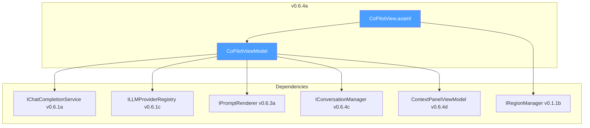
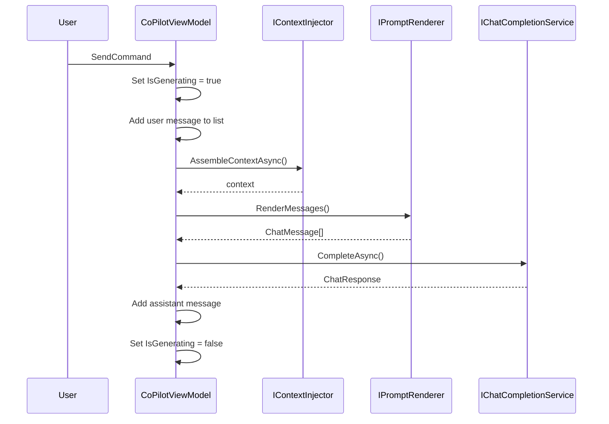

# LCS-DES-064a: Design Specification — Chat Panel View

## 1. Metadata & Categorization

| Field           | Value                                     |
| :-------------- | :---------------------------------------- |
| **Document ID** | LCS-DES-064a                              |
| **Version**     | v0.6.4a                                   |
| **Status**      | Draft                                     |
| **Category**    | UI/UX                                     |
| **Module**      | Lexichord.Modules.Agents                  |
| **Created**     | 2026-01-27                                |
| **Author**      | Documentation Agent                       |
| **Parent**      | [LCS-DES-064-INDEX](LCS-DES-064-INDEX.md) |

---

## 2. Executive Summary

### 2.1 The Requirement

Writers need an integrated AI conversation interface. The lack thereof forces context switching to external tools and prevents integration with Lexichord's style rules and RAG context.

### 2.2 The Proposed Solution

Create `CoPilotView.axaml` featuring:

- **Virtualized Message List**: Efficient display with smooth scrolling
- **Multi-line Input Area**: Rich text input with keyboard shortcuts
- **Model Selector**: Dropdown for provider and model selection
- **Context Indicator**: Summary of active context sources
- **Region Integration**: `ShellRegion.Right` sidebar placement

---

## 3. Architecture

### 3.1 Component Placement

```text
Lexichord.Modules.Agents/
└── Chat/
    ├── Views/
    │   ├── CoPilotView.axaml
    │   └── CoPilotView.axaml.cs
    └── ViewModels/
        └── CoPilotViewModel.cs
```

### 3.2 Dependency Graph



---

## 4. Data Contract (The API)

### 4.1 CoPilotViewModel

```csharp
namespace Lexichord.Modules.Agents.Chat.ViewModels;

/// <summary>
/// Primary ViewModel for the Co-pilot chat interface.
/// Orchestrates message sending, context assembly, and conversation lifecycle.
/// </summary>
/// <remarks>
/// <para>
/// This ViewModel serves as the central coordinator for the chat experience,
/// managing the following responsibilities:
/// </para>
/// <list type="bullet">
///   <item>User input validation and submission</item>
///   <item>LLM communication via <see cref="IChatCompletionService"/></item>
///   <item>Context assembly via <see cref="IContextInjector"/></item>
///   <item>Provider and model selection via <see cref="ILLMProviderRegistry"/></item>
///   <item>Conversation state via <see cref="IConversationManager"/></item>
/// </list>
/// <para>
/// The ViewModel follows MVVM patterns using CommunityToolkit.Mvvm source generators
/// for property change notification and command binding.
/// </para>
/// </remarks>
public partial class CoPilotViewModel : ObservableObject, IDisposable
{
    #region Dependencies

    private readonly IChatCompletionService _chatService;
    private readonly ILLMProviderRegistry _providerRegistry;
    private readonly IPromptRenderer _renderer;
    private readonly IPromptTemplateRepository _templateRepository;
    private readonly IConversationManager _conversationManager;
    private readonly ILicenseContext _license;
    private readonly ILogger<CoPilotViewModel> _logger;

    #endregion

    #region Private State

    private CancellationTokenSource? _generateCts;
    private bool _disposed;

    #endregion

    #region Observable Properties

    /// <summary>
    /// The current text in the message input area.
    /// </summary>
    /// <remarks>
    /// Changes to this property trigger re-evaluation of <see cref="CanSend"/>
    /// and the <see cref="SendCommand"/>'s CanExecute state.
    /// </remarks>
    [ObservableProperty]
    [NotifyPropertyChangedFor(nameof(CanSend))]
    [NotifyCanExecuteChangedFor(nameof(SendCommand))]
    private string _inputText = string.Empty;

    /// <summary>
    /// Indicates whether an LLM request is currently in progress.
    /// </summary>
    /// <remarks>
    /// When true:
    /// <list type="bullet">
    ///   <item>The input TextBox is disabled</item>
    ///   <item>The Send button shows a loading spinner</item>
    ///   <item><see cref="CanSend"/> returns false</item>
    ///   <item>The Cancel button becomes available</item>
    /// </list>
    /// </remarks>
    [ObservableProperty]
    [NotifyPropertyChangedFor(nameof(CanSend))]
    [NotifyCanExecuteChangedFor(nameof(SendCommand))]
    private bool _isGenerating;

    /// <summary>
    /// The currently selected LLM provider identifier.
    /// </summary>
    /// <remarks>
    /// Changing this property triggers:
    /// <list type="bullet">
    ///   <item>Update of <see cref="AvailableModels"/> list</item>
    ///   <item>Auto-selection of the provider's default model</item>
    ///   <item>Persistence of preference to user settings</item>
    /// </list>
    /// </remarks>
    [ObservableProperty]
    [NotifyPropertyChangedFor(nameof(AvailableModels))]
    private string _selectedProvider = "OpenAI";

    /// <summary>
    /// The currently selected model within the active provider.
    /// </summary>
    [ObservableProperty]
    private string _selectedModel = "gpt-4o-mini";

    /// <summary>
    /// Collection of messages in the current conversation.
    /// Bound to the virtualized ItemsControl in the view.
    /// </summary>
    [ObservableProperty]
    private ObservableCollection<ChatMessageViewModel> _messages = [];

    /// <summary>
    /// Status message displayed in the footer area.
    /// </summary>
    /// <remarks>
    /// Examples: "Thinking...", "Completed in 1.2s", "Error occurred"
    /// </remarks>
    [ObservableProperty]
    private string _statusMessage = string.Empty;

    /// <summary>
    /// Estimated total token count for the current context and input.
    /// </summary>
    [ObservableProperty]
    private int _estimatedTokens;

    #endregion

    #region Computed Properties

    /// <summary>
    /// Determines whether the Send command can execute.
    /// </summary>
    /// <value>
    /// <c>true</c> if input is non-empty and no generation is in progress;
    /// otherwise, <c>false</c>.
    /// </value>
    public bool CanSend => !string.IsNullOrWhiteSpace(InputText) && !IsGenerating;

    /// <summary>
    /// Available LLM providers from the registry.
    /// </summary>
    public IReadOnlyList<string> AvailableProviders =>
        _providerRegistry.GetRegisteredProviders()
            .Select(p => p.ProviderId)
            .ToList();

    /// <summary>
    /// Available models for the currently selected provider.
    /// </summary>
    public IReadOnlyList<string> AvailableModels =>
        _providerRegistry.GetProvider(SelectedProvider)?.SupportedModels
            ?? Array.Empty<string>();

    /// <summary>
    /// Child ViewModel for the context panel.
    /// </summary>
    public ContextPanelViewModel ContextPanel { get; }

    #endregion

    #region Constructor

    /// <summary>
    /// Initializes a new instance of <see cref="CoPilotViewModel"/>.
    /// </summary>
    /// <param name="chatService">Service for LLM communication.</param>
    /// <param name="providerRegistry">Registry of available LLM providers.</param>
    /// <param name="renderer">Prompt template renderer.</param>
    /// <param name="templateRepository">Repository of prompt templates.</param>
    /// <param name="conversationManager">Conversation state manager.</param>
    /// <param name="contextPanel">Context panel child ViewModel.</param>
    /// <param name="license">License context for feature gating.</param>
    /// <param name="logger">Logger instance.</param>
    /// <exception cref="ArgumentNullException">
    /// Thrown if any required dependency is null.
    /// </exception>
    /// <exception cref="LicenseRequiredException">
    /// Thrown if user lacks WriterPro license for CoPilot feature.
    /// </exception>
    public CoPilotViewModel(
        IChatCompletionService chatService,
        ILLMProviderRegistry providerRegistry,
        IPromptRenderer renderer,
        IPromptTemplateRepository templateRepository,
        IConversationManager conversationManager,
        ContextPanelViewModel contextPanel,
        ILicenseContext license,
        ILogger<CoPilotViewModel> logger)
    {
        _chatService = chatService ?? throw new ArgumentNullException(nameof(chatService));
        _providerRegistry = providerRegistry ?? throw new ArgumentNullException(nameof(providerRegistry));
        _renderer = renderer ?? throw new ArgumentNullException(nameof(renderer));
        _templateRepository = templateRepository ?? throw new ArgumentNullException(nameof(templateRepository));
        _conversationManager = conversationManager ?? throw new ArgumentNullException(nameof(conversationManager));
        ContextPanel = contextPanel ?? throw new ArgumentNullException(nameof(contextPanel));
        _license = license ?? throw new ArgumentNullException(nameof(license));
        _logger = logger ?? throw new ArgumentNullException(nameof(logger));

        // Validate license before allowing feature access
        ValidateLicense();

        // Initialize default provider and model
        InitializeDefaultModel();

        // Subscribe to conversation state changes
        _conversationManager.ConversationChanged += OnConversationChanged;

        _logger.LogDebug("CoPilotViewModel initialized successfully");
    }

    #endregion

    #region Commands

    /// <summary>
    /// Sends the current input as a user message and requests an LLM response.
    /// </summary>
    [RelayCommand(CanExecute = nameof(CanSend))]
    private async Task SendAsync(CancellationToken ct);

    /// <summary>
    /// Cancels the current LLM generation in progress.
    /// </summary>
    [RelayCommand]
    private void CancelGeneration();

    /// <summary>
    /// Clears the current conversation and starts fresh.
    /// </summary>
    [RelayCommand]
    private async Task NewConversationAsync();

    /// <summary>
    /// Exports the current conversation to a Markdown file.
    /// </summary>
    [RelayCommand]
    private async Task ExportConversationAsync();

    #endregion

    #region Private Methods

    private void ValidateLicense()
    {
        if (!_license.HasFeature(FeatureFlags.Agents.CoPilot))
        {
            _logger.LogWarning(
                "CoPilot access denied: license tier {Tier} lacks required feature",
                _license.CurrentTier);

            throw new LicenseRequiredException(
                FeatureFlags.Agents.CoPilot,
                LicenseTier.WriterPro,
                "The Co-pilot chat feature requires a WriterPro subscription.");
        }
    }

    private void InitializeDefaultModel()
    {
        var providers = AvailableProviders;
        if (providers.Count == 0)
        {
            _logger.LogWarning("No LLM providers registered");
            return;
        }

        SelectedProvider = providers[0];
        var models = AvailableModels;
        if (models.Count > 0)
        {
            SelectedModel = models[0];
        }

        _logger.LogDebug(
            "Default model initialized: {Provider}/{Model}",
            SelectedProvider, SelectedModel);
    }

    partial void OnSelectedProviderChanged(string value)
    {
        _logger.LogDebug("Provider changed to {Provider}", value);

        // Refresh available models for new provider
        OnPropertyChanged(nameof(AvailableModels));

        // Auto-select first model for new provider
        var models = AvailableModels;
        if (models.Count > 0)
        {
            SelectedModel = models[0];
        }
    }

    private void OnConversationChanged(object? sender, ConversationChangedEventArgs e)
    {
        _logger.LogDebug(
            "Conversation changed: {ChangeType}, messages: {Count}",
            e.ChangeType, e.Conversation.MessageCount);
    }

    #endregion

    #region IDisposable

    /// <inheritdoc />
    public void Dispose()
    {
        if (_disposed) return;

        _generateCts?.Cancel();
        _generateCts?.Dispose();
        _conversationManager.ConversationChanged -= OnConversationChanged;

        _disposed = true;
        _logger.LogDebug("CoPilotViewModel disposed");
    }

    #endregion
}
```

### 4.2 Provider Change Handling

When the user selects a different LLM provider, the ViewModel automatically updates the available models and selects a sensible default:

```csharp
partial void OnSelectedProviderChanged(string value)
{
    _logger.LogDebug("Provider changed to {Provider}", value);

    // Trigger re-evaluation of AvailableModels computed property
    OnPropertyChanged(nameof(AvailableModels));

    // Auto-select the first available model for the new provider
    var models = AvailableModels;
    if (models.Count > 0)
    {
        SelectedModel = models[0];
        _logger.LogDebug("Auto-selected model: {Model}", SelectedModel);
    }
    else
    {
        _logger.LogWarning("Provider {Provider} has no available models", value);
        SelectedModel = string.Empty;
    }
}
```

### 4.3 Input Validation

```csharp
/// <summary>
/// Validates user input before sending to LLM.
/// </summary>
/// <param name="input">The user's message text.</param>
/// <returns>Validation result with error message if invalid.</returns>
private (bool IsValid, string? ErrorMessage) ValidateInput(string input)
{
    if (string.IsNullOrWhiteSpace(input))
    {
        return (false, "Message cannot be empty.");
    }

    if (input.Length > MaxInputLength)
    {
        return (false, $"Message exceeds maximum length of {MaxInputLength:N0} characters.");
    }

    // Check for rate limiting
    if (_rateLimiter.IsRateLimited())
    {
        var cooldown = _rateLimiter.GetRemainingCooldown();
        return (false, $"Please wait {cooldown.TotalSeconds:F0} seconds before sending.");
    }

    return (true, null);
}

private const int MaxInputLength = 50_000; // Approximately 12,500 tokens
```

### 4.4 Token Estimation

```csharp
/// <summary>
/// Estimates token count for display purposes.
/// Uses approximate 4 characters per token ratio.
/// </summary>
/// <remarks>
/// This is a rough estimate for UI display only. The actual token count
/// is calculated server-side by the LLM provider's tokenizer.
/// </remarks>
private void UpdateTokenEstimate()
{
    var contextTokens = ContextPanel.EstimatedContextTokens;
    var inputTokens = EstimateTokens(InputText);
    var historyTokens = Messages.Sum(m => EstimateTokens(m.Content));

    EstimatedTokens = contextTokens + inputTokens + historyTokens;

    _logger.LogTrace(
        "Token estimate updated: context={Context}, input={Input}, history={History}, total={Total}",
        contextTokens, inputTokens, historyTokens, EstimatedTokens);
}

private static int EstimateTokens(string text)
{
    if (string.IsNullOrEmpty(text)) return 0;

    // Rough approximation: 4 characters ≈ 1 token
    // More accurate for English text; other languages may vary
    return text.Length / 4;
}
```

---

## 5. Implementation Logic

### 5.1 Send Flow



### 5.2 Key Logic

```csharp
[RelayCommand(CanExecute = nameof(CanSend))]
private async Task SendAsync(CancellationToken ct)
{
    var userInput = InputText.Trim();
    InputText = string.Empty;
    IsGenerating = true;

    try
    {
        _logger.LogDebug("Sending message: {Length} chars, model: {Model}",
            userInput.Length, SelectedModel);

        // Add user message
        Messages.Add(new ChatMessageViewModel
        {
            MessageId = Guid.NewGuid(),
            Role = ChatRole.User,
            Content = userInput,
            Timestamp = DateTime.Now
        });

        // Build context and render prompt
        var context = await BuildContextAsync(userInput, ct);
        var template = _templateRepository.GetTemplate("co-pilot-editor");
        var chatMessages = _renderer.RenderMessages(template, context);

        // Call LLM
        var response = await _chatService.CompleteAsync(
            new ChatRequest(chatMessages, new ChatOptions(Model: SelectedModel)), ct);

        _logger.LogInformation("Response received in {ElapsedMs}ms", stopwatch.ElapsedMilliseconds);

        // Add assistant message
        Messages.Add(new ChatMessageViewModel
        {
            MessageId = Guid.NewGuid(),
            Role = ChatRole.Assistant,
            Content = response.Content,
            Timestamp = DateTime.Now
        });
    }
    catch (Exception ex)
    {
        _logger.LogError(ex, "LLM request failed");
        Messages.Add(new ChatMessageViewModel
        {
            Role = ChatRole.System,
            Content = $"⚠️ {ex.Message}",
            Timestamp = DateTime.Now
        });
    }
    finally
    {
        IsGenerating = false;
    }
}
```

### 5.3 Context Building

```csharp
/// <summary>
/// Assembles context for the LLM request based on current panel settings.
/// </summary>
private async Task<IDictionary<string, object>> BuildContextAsync(
    string userInput,
    CancellationToken ct)
{
    var contextRequest = new ContextRequest(
        DocumentPath: ContextPanel.CurrentDocumentPath,
        CursorPosition: null,
        SelectedText: ContextPanel.SelectedText,
        IncludeStyleRules: ContextPanel.StyleRulesEnabled,
        IncludeRagContext: ContextPanel.RagContextEnabled,
        MaxRagChunks: ContextPanel.MaxRagChunks);

    var context = await ContextPanel.Injector.AssembleContextAsync(contextRequest, ct);

    // Add user input to context
    context["user_input"] = userInput;
    context["selected_model"] = SelectedModel;
    context["selected_provider"] = SelectedProvider;

    _logger.LogDebug(
        "Context assembled: {StyleRules} style rules, {RagChunks} RAG chunks, doc={HasDoc}",
        ContextPanel.StyleRuleCount,
        ContextPanel.RagChunkCount,
        ContextPanel.CurrentDocumentPath is not null);

    return context;
}
```

### 5.4 Cancellation Handling

```csharp
/// <summary>
/// Cancels any in-progress LLM generation.
/// </summary>
[RelayCommand]
private void CancelGeneration()
{
    if (_generateCts is null || _generateCts.IsCancellationRequested)
    {
        _logger.LogDebug("No active generation to cancel");
        return;
    }

    _logger.LogInformation("Cancelling generation by user request");
    _generateCts.Cancel();
    StatusMessage = "Cancelled";
}

/// <summary>
/// Helper to create a linked cancellation token for generation.
/// </summary>
private CancellationTokenSource CreateLinkedCts(CancellationToken ct)
{
    _generateCts?.Dispose();
    _generateCts = CancellationTokenSource.CreateLinkedTokenSource(ct);
    return _generateCts;
}
```

### 5.5 Auto-Scroll Behavior

```csharp
/// <summary>
/// Called when a new message is added to scroll the list to bottom.
/// </summary>
partial void OnMessagesChanged(ObservableCollection<ChatMessageViewModel> value)
{
    // Notify view to scroll to bottom
    MessagesCollectionChanged?.Invoke(this, EventArgs.Empty);
}

/// <summary>
/// Event raised when messages collection changes, for UI scrolling.
/// </summary>
public event EventHandler? MessagesCollectionChanged;
```

---

## 6. UI/UX Specifications

### 6.1 Layout

```text
┌──────────────────────────────────────────────────────────────────┐
│  Co-pilot                                [Provider ▼][Model ▼]  │ ← Header
├──────────────────────────────────────────────────────────────────┤
│  ▶ Context (5 rules, 3 chunks)                      [Refresh]   │ ← Context Bar
├──────────────────────────────────────────────────────────────────┤
│  ┌────────────────────────────────────────────────────────────┐  │
│  │ 👤 User message here...                          2 min ago │  │
│  │ 🤖 Assistant response here...                    Just now  │  │
│  └────────────────────────────────────────────────────────────┘  │ ← Message List
├──────────────────────────────────────────────────────────────────┤
│  Type your message...                                     [⏎]   │ ← Input
├──────────────────────────────────────────────────────────────────┤
│  [New Chat] [Export]                               ~250 tokens  │ ← Footer
└──────────────────────────────────────────────────────────────────┘
```

### 6.2 CoPilotView.axaml

```xml
<UserControl x:Class="Lexichord.Modules.Agents.Chat.Views.CoPilotView"
             xmlns="https://github.com/avaloniaui"
             xmlns:x="http://schemas.microsoft.com/winfx/2006/xaml"
             xmlns:vm="using:Lexichord.Modules.Agents.Chat.ViewModels"
             xmlns:views="using:Lexichord.Modules.Agents.Chat.Views"
             x:DataType="vm:CoPilotViewModel">

    <Grid RowDefinitions="Auto,Auto,*,Auto,Auto">

        <!-- Header with model selector -->
        <Border Grid.Row="0" Classes="chat-header" Padding="12">
            <Grid ColumnDefinitions="*,Auto,Auto">
                <TextBlock Grid.Column="0" Text="Co-pilot" Classes="heading-2"/>

                <ComboBox Grid.Column="1"
                          ItemsSource="{Binding AvailableProviders}"
                          SelectedItem="{Binding SelectedProvider}"
                          Margin="8,0" MinWidth="100"/>

                <ComboBox Grid.Column="2"
                          ItemsSource="{Binding AvailableModels}"
                          SelectedItem="{Binding SelectedModel}"
                          MinWidth="120"/>
            </Grid>
        </Border>

        <!-- Context indicator bar -->
        <views:ContextPanelView Grid.Row="1" DataContext="{Binding ContextPanel}"/>

        <!-- Message list with virtualization -->
        <ScrollViewer Grid.Row="2" Name="MessageScrollViewer"
                      VerticalScrollBarVisibility="Auto">
            <ItemsControl ItemsSource="{Binding Messages}" Margin="8">
                <ItemsControl.ItemTemplate>
                    <DataTemplate DataType="vm:ChatMessageViewModel">
                        <views:ChatMessageView Margin="0,4"/>
                    </DataTemplate>
                </ItemsControl.ItemTemplate>
                <ItemsControl.ItemsPanel>
                    <ItemsPanelTemplate>
                        <VirtualizingStackPanel/>
                    </ItemsPanelTemplate>
                </ItemsControl.ItemsPanel>
            </ItemsControl>
        </ScrollViewer>

        <!-- Input area -->
        <Border Grid.Row="3" Classes="chat-input-container" Padding="8">
            <Grid ColumnDefinitions="*,Auto">
                <TextBox Grid.Column="0"
                         Text="{Binding InputText, Mode=TwoWay}"
                         Watermark="Type your message..."
                         AcceptsReturn="True" TextWrapping="Wrap"
                         MinHeight="60" MaxHeight="150"
                         IsEnabled="{Binding !IsGenerating}"
                         KeyDown="InputTextBox_KeyDown"/>

                <Button Grid.Column="1"
                        Command="{Binding SendCommand}"
                        Classes="send-button"
                        VerticalAlignment="Bottom" Margin="8,0,0,0">
                    <Panel>
                        <PathIcon Data="{StaticResource SendIcon}"
                                  IsVisible="{Binding !IsGenerating}"/>
                        <ProgressRing Width="18" Height="18"
                                      IsVisible="{Binding IsGenerating}"
                                      IsActive="{Binding IsGenerating}"/>
                    </Panel>
                </Button>
            </Grid>
        </Border>

        <!-- Footer with actions and status -->
        <Border Grid.Row="4" Classes="chat-footer" Padding="8">
            <Grid ColumnDefinitions="Auto,Auto,*,Auto">
                <Button Grid.Column="0"
                        Command="{Binding NewConversationCommand}"
                        Content="New Chat" Classes="secondary"/>

                <Button Grid.Column="1"
                        Command="{Binding ExportConversationCommand}"
                        Content="Export" Classes="secondary" Margin="8,0,0,0"/>

                <TextBlock Grid.Column="2"
                           Text="{Binding StatusMessage}"
                           Classes="status-text"
                           HorizontalAlignment="Center" VerticalAlignment="Center"/>

                <TextBlock Grid.Column="3" Classes="token-count">
                    <Run Text="~"/>
                    <Run Text="{Binding EstimatedTokens}"/>
                    <Run Text=" tokens"/>
                </TextBlock>
            </Grid>
        </Border>
    </Grid>
</UserControl>
```

### 6.3 Code-Behind for Keyboard Handling

```csharp
public partial class CoPilotView : UserControl
{
    public CoPilotView()
    {
        InitializeComponent();
    }

    private async void InputTextBox_KeyDown(object? sender, KeyEventArgs e)
    {
        if (e.Key == Key.Enter && e.KeyModifiers == KeyModifiers.None)
        {
            e.Handled = true;
            if (DataContext is CoPilotViewModel vm && vm.CanSend)
            {
                await vm.SendCommand.ExecuteAsync(null);
            }
        }
        else if (e.Key == Key.Escape)
        {
            e.Handled = true;
            if (DataContext is CoPilotViewModel { IsGenerating: true } vm)
            {
                vm.CancelGenerationCommand.Execute(null);
            }
        }
    }
}
```

### 6.4 Keyboard Shortcuts

| Shortcut    | Action              | Context           |
| :---------- | :------------------ | :---------------- |
| Enter       | Send message        | Input focused     |
| Shift+Enter | New line in input   | Input focused     |
| Escape      | Cancel generation   | During generation |
| Ctrl+N      | New conversation    | Panel focused     |
| Ctrl+E      | Export conversation | Panel focused     |

---

## 7. Observability & Logging

### 7.1 Log Events

| Level   | Event                | Message Template                                                          |
| :------ | :------------------- | :------------------------------------------------------------------------ |
| Trace   | Token estimate       | `Token estimate updated: context={Context}, input={Input}, total={Total}` |
| Debug   | ViewModel init       | `CoPilotViewModel initialized successfully`                               |
| Debug   | Provider change      | `Provider changed to {Provider}`                                          |
| Debug   | Send start           | `Sending message: {Length} chars, provider: {Provider}, model: {Model}`   |
| Debug   | Context assembled    | `Context assembled: {StyleRules} rules, {RagChunks} chunks, doc={HasDoc}` |
| Info    | Send complete        | `Message sent, response received in {ElapsedMs}ms`                        |
| Info    | New conversation     | `New conversation created: {ConversationId}`                              |
| Info    | Generation cancelled | `Cancelling generation by user request`                                   |
| Warning | License denied       | `CoPilot access denied: license tier {Tier} lacks required feature`       |
| Warning | No providers         | `No LLM providers registered`                                             |
| Error   | LLM request failed   | `LLM request failed: {Error}`                                             |

### 7.2 Metrics

| Metric                          | Type      | Labels                  | Purpose                  |
| :------------------------------ | :-------- | :---------------------- | :----------------------- |
| `copilot.messages_sent_total`   | Counter   | `provider`, `model`     | Track usage by model     |
| `copilot.response_time_seconds` | Histogram | `provider`, `model`     | LLM latency distribution |
| `copilot.tokens_used_total`     | Counter   | `direction`, `provider` | Token consumption        |
| `copilot.errors_total`          | Counter   | `error_type`            | Error rate tracking      |
| `copilot.conversations_created` | Counter   | —                       | Conversation lifecycle   |

---

## 8. Acceptance Criteria

| #   | Category     | Criterion                                                | Priority |
| :-- | :----------- | :------------------------------------------------------- | :------- |
| 1   | **License**  | Chat panel appears in right sidebar for WriterPro+ users | Critical |
| 2   | **License**  | Panel not visible/accessible for Core tier users         | Critical |
| 3   | **UI**       | Model selector shows available providers and models      | Critical |
| 4   | **UI**       | Provider change updates available models list            | High     |
| 5   | **Input**    | User can send message via button or Enter key            | Critical |
| 6   | **Input**    | Shift+Enter creates new line in input                    | High     |
| 7   | **Input**    | Send button disabled when input empty                    | High     |
| 8   | **Input**    | Send button disabled during generation                   | Critical |
| 9   | **Generate** | Loading indicator shown during generation                | High     |
| 10  | **Generate** | User can cancel generation with Escape                   | Medium   |
| 11  | **Response** | Assistant response appears after user message            | Critical |
| 12  | **Response** | Error message shown if LLM request fails                 | High     |
| 13  | **Actions**  | "New Chat" clears message list                           | High     |
| 14  | **Actions**  | "Export" generates valid Markdown                        | Medium   |
| 15  | **Scroll**   | Message list scrolls to bottom on new message            | High     |
| 16  | **Status**   | Token count updates as context changes                   | Medium   |

---

## 9. Unit Tests

### 9.1 Test Fixture Setup

```csharp
[Trait("Category", "Unit")]
[Trait("Version", "v0.6.4a")]
public class CoPilotViewModelTests
{
    private readonly Mock<IChatCompletionService> _mockChatService;
    private readonly Mock<ILLMProviderRegistry> _mockRegistry;
    private readonly Mock<IPromptRenderer> _mockRenderer;
    private readonly Mock<IPromptTemplateRepository> _mockTemplateRepo;
    private readonly Mock<IConversationManager> _mockConversationManager;
    private readonly Mock<ILicenseContext> _mockLicense;
    private readonly Mock<ILogger<CoPilotViewModel>> _mockLogger;
    private readonly ContextPanelViewModel _contextPanel;

    public CoPilotViewModelTests()
    {
        _mockChatService = new Mock<IChatCompletionService>();
        _mockRegistry = new Mock<ILLMProviderRegistry>();
        _mockRenderer = new Mock<IPromptRenderer>();
        _mockTemplateRepo = new Mock<IPromptTemplateRepository>();
        _mockConversationManager = new Mock<IConversationManager>();
        _mockLicense = new Mock<ILicenseContext>();
        _mockLogger = new Mock<ILogger<CoPilotViewModel>>();

        // Default: license allows access
        _mockLicense.Setup(l => l.HasFeature(It.IsAny<string>())).Returns(true);

        // Default: OpenAI provider with gpt-4o-mini
        var provider = new LLMProviderInfo("OpenAI", "OpenAI", new[] { "gpt-4o-mini", "gpt-4o" });
        _mockRegistry.Setup(r => r.GetRegisteredProviders()).Returns(new[] { provider });
        _mockRegistry.Setup(r => r.GetProvider("OpenAI")).Returns(provider);

        _contextPanel = CreateContextPanel();
    }

    private CoPilotViewModel CreateSut() =>
        new(
            _mockChatService.Object,
            _mockRegistry.Object,
            _mockRenderer.Object,
            _mockTemplateRepo.Object,
            _mockConversationManager.Object,
            _contextPanel,
            _mockLicense.Object,
            _mockLogger.Object);

    private void SetupSuccessfulSend()
    {
        _mockChatService.Setup(s => s.CompleteAsync(It.IsAny<ChatRequest>(), It.IsAny<CancellationToken>()))
            .ReturnsAsync(new ChatResponse("Response content", 50, 20, TimeSpan.FromMilliseconds(500), "stop"));

        _mockTemplateRepo.Setup(r => r.GetTemplate(It.IsAny<string>()))
            .Returns(PromptTemplate.Create("test", "Test", "System", "{{user_input}}"));

        _mockRenderer.Setup(r => r.RenderMessages(It.IsAny<IPromptTemplate>(), It.IsAny<IDictionary<string, object>>()))
            .Returns(new[] { new ChatMessage(ChatRole.User, "Hello") });

        _mockConversationManager.Setup(m => m.CurrentConversation)
            .Returns(Conversation.Empty());
    }
}
```

### 9.2 License Tests

```csharp
[Fact]
public void Constructor_WithoutLicense_ThrowsLicenseRequiredException()
{
    _mockLicense.Setup(l => l.HasFeature(It.IsAny<string>())).Returns(false);

    var ex = Assert.Throws<LicenseRequiredException>(() => CreateSut());

    Assert.Equal(FeatureFlags.Agents.CoPilot, ex.RequiredFeature);
    Assert.Equal(LicenseTier.WriterPro, ex.RequiredTier);
}

[Fact]
public void Constructor_WithWriterProLicense_Succeeds()
{
    _mockLicense.Setup(l => l.HasFeature(FeatureFlags.Agents.CoPilot)).Returns(true);

    var vm = CreateSut();

    Assert.NotNull(vm);
}
```

### 9.3 CanSend Property Tests

```csharp
[Fact]
public void CanSend_WithEmptyInput_ReturnsFalse()
{
    var vm = CreateSut();
    vm.InputText = "";

    Assert.False(vm.CanSend);
}

[Fact]
public void CanSend_WithWhitespaceOnly_ReturnsFalse()
{
    var vm = CreateSut();
    vm.InputText = "   \t\n  ";

    Assert.False(vm.CanSend);
}

[Fact]
public void CanSend_WhileGenerating_ReturnsFalse()
{
    var vm = CreateSut();
    vm.InputText = "Hello";
    vm.IsGenerating = true;

    Assert.False(vm.CanSend);
}

[Fact]
public void CanSend_WithValidInputAndNotGenerating_ReturnsTrue()
{
    var vm = CreateSut();
    vm.InputText = "Hello, how are you?";
    vm.IsGenerating = false;

    Assert.True(vm.CanSend);
}
```

### 9.4 SendAsync Tests

```csharp
[Fact]
public async Task SendAsync_AddsUserAndAssistantMessages()
{
    var vm = CreateSut();
    vm.InputText = "Hello";
    SetupSuccessfulSend();

    await vm.SendCommand.ExecuteAsync(null);

    Assert.Equal(2, vm.Messages.Count);
    Assert.Equal(ChatRole.User, vm.Messages[0].Role);
    Assert.Equal("Hello", vm.Messages[0].Content);
    Assert.Equal(ChatRole.Assistant, vm.Messages[1].Role);
    Assert.Equal("Response content", vm.Messages[1].Content);
}

[Fact]
public async Task SendAsync_ClearsInputText()
{
    var vm = CreateSut();
    vm.InputText = "Hello";
    SetupSuccessfulSend();

    await vm.SendCommand.ExecuteAsync(null);

    Assert.Empty(vm.InputText);
}

[Fact]
public async Task SendAsync_SetsIsGeneratingDuringExecution()
{
    var vm = CreateSut();
    vm.InputText = "Hello";

    var tcs = new TaskCompletionSource<ChatResponse>();
    _mockChatService.Setup(s => s.CompleteAsync(It.IsAny<ChatRequest>(), It.IsAny<CancellationToken>()))
        .Returns(tcs.Task);
    SetupTemplateAndRenderer();

    var sendTask = vm.SendCommand.ExecuteAsync(null);

    Assert.True(vm.IsGenerating);

    tcs.SetResult(new ChatResponse("Response", 10, 5, TimeSpan.Zero, "stop"));
    await sendTask;

    Assert.False(vm.IsGenerating);
}

[Fact]
public async Task SendAsync_OnError_AddsErrorMessage()
{
    var vm = CreateSut();
    vm.InputText = "Hello";

    _mockChatService.Setup(s => s.CompleteAsync(It.IsAny<ChatRequest>(), It.IsAny<CancellationToken>()))
        .ThrowsAsync(new HttpRequestException("Network error"));
    SetupTemplateAndRenderer();

    await vm.SendCommand.ExecuteAsync(null);

    Assert.Equal(2, vm.Messages.Count);
    Assert.Equal(ChatRole.System, vm.Messages[1].Role);
    Assert.Contains("Network error", vm.Messages[1].Content);
}

[Fact]
public async Task SendAsync_OnCancellation_SetsStatusToCancelled()
{
    var vm = CreateSut();
    vm.InputText = "Hello";

    _mockChatService.Setup(s => s.CompleteAsync(It.IsAny<ChatRequest>(), It.IsAny<CancellationToken>()))
        .ThrowsAsync(new OperationCanceledException());
    SetupTemplateAndRenderer();

    await vm.SendCommand.ExecuteAsync(null);

    Assert.Equal("Cancelled", vm.StatusMessage);
}
```

### 9.5 Provider Selection Tests

```csharp
[Fact]
public void SelectedProviderChanged_UpdatesAvailableModels()
{
    var openai = new LLMProviderInfo("OpenAI", "OpenAI", new[] { "gpt-4o-mini", "gpt-4o" });
    var anthropic = new LLMProviderInfo("Anthropic", "Anthropic", new[] { "claude-3-sonnet", "claude-3-opus" });

    _mockRegistry.Setup(r => r.GetRegisteredProviders()).Returns(new[] { openai, anthropic });
    _mockRegistry.Setup(r => r.GetProvider("OpenAI")).Returns(openai);
    _mockRegistry.Setup(r => r.GetProvider("Anthropic")).Returns(anthropic);

    var vm = CreateSut();
    vm.SelectedProvider = "Anthropic";

    Assert.Contains("claude-3-sonnet", vm.AvailableModels);
    Assert.DoesNotContain("gpt-4o-mini", vm.AvailableModels);
}

[Fact]
public void SelectedProviderChanged_AutoSelectsFirstModel()
{
    var openai = new LLMProviderInfo("OpenAI", "OpenAI", new[] { "gpt-4o-mini", "gpt-4o" });
    var anthropic = new LLMProviderInfo("Anthropic", "Anthropic", new[] { "claude-3-sonnet", "claude-3-opus" });

    _mockRegistry.Setup(r => r.GetRegisteredProviders()).Returns(new[] { openai, anthropic });
    _mockRegistry.Setup(r => r.GetProvider("OpenAI")).Returns(openai);
    _mockRegistry.Setup(r => r.GetProvider("Anthropic")).Returns(anthropic);

    var vm = CreateSut();
    vm.SelectedProvider = "Anthropic";

    Assert.Equal("claude-3-sonnet", vm.SelectedModel);
}
```

### 9.6 Conversation Management Tests

```csharp
[Fact]
public async Task NewConversationAsync_ClearsMessages()
{
    var vm = CreateSut();
    vm.Messages.Add(new ChatMessageViewModel { Content = "Test" });

    await vm.NewConversationCommand.ExecuteAsync(null);

    Assert.Empty(vm.Messages);
}

[Fact]
public async Task NewConversationAsync_CallsConversationManager()
{
    var vm = CreateSut();

    await vm.NewConversationCommand.ExecuteAsync(null);

    _mockConversationManager.Verify(m => m.ClearCurrentConversationAsync(It.IsAny<CancellationToken>()), Times.Once);
}

[Fact]
public void Dispose_UnsubscribesFromEvents()
{
    var vm = CreateSut();

    vm.Dispose();

    // Verify no exception when conversation changes after dispose
    _mockConversationManager.Raise(m => m.ConversationChanged += null,
        new ConversationChangedEventArgs(ConversationChangeType.Created, Conversation.Empty()));
}
```

---

## 10. DI Registration

```csharp
// In AgentsModule.cs
public static IServiceCollection AddAgentsModule(this IServiceCollection services)
{
    // ViewModels
    services.AddTransient<CoPilotViewModel>();
    services.AddTransient<ContextPanelViewModel>();
    services.AddTransient<ChatMessageViewModel>();

    // Views (for region management)
    services.AddTransient<CoPilotView>();

    return services;
}

// In App.axaml.cs - Region registration
public override void OnFrameworkInitializationCompleted()
{
    var license = Services.GetRequiredService<ILicenseContext>();
    var regionManager = Services.GetRequiredService<IRegionManager>();

    if (license.HasFeature(FeatureFlags.Agents.CoPilot))
    {
        regionManager.RegisterViewWithRegion<CoPilotView>(ShellRegion.Right);
    }
}
```

---

## 11. Related Documents

| Document                                  | Relationship            |
| :---------------------------------------- | :---------------------- |
| [LCS-DES-064-INDEX](LCS-DES-064-INDEX.md) | Design Spec Index       |
| [LCS-DES-064b](LCS-DES-064b.md)           | Message Rendering       |
| [LCS-DES-064c](LCS-DES-064c.md)           | Conversation Management |
| [LCS-DES-064d](LCS-DES-064d.md)           | Context Panel           |
| [LCS-DES-061a](../v0.6.1/LCS-DES-061a.md) | IChatCompletionService  |
| [LCS-DES-061c](../v0.6.1/LCS-DES-061c.md) | ILLMProviderRegistry    |
| [LCS-DES-063a](../v0.6.3/LCS-DES-063a.md) | IPromptRenderer         |

---
