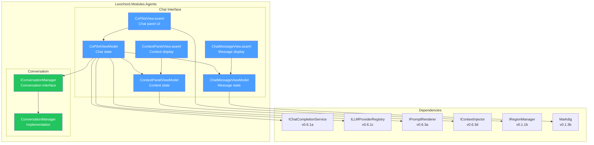
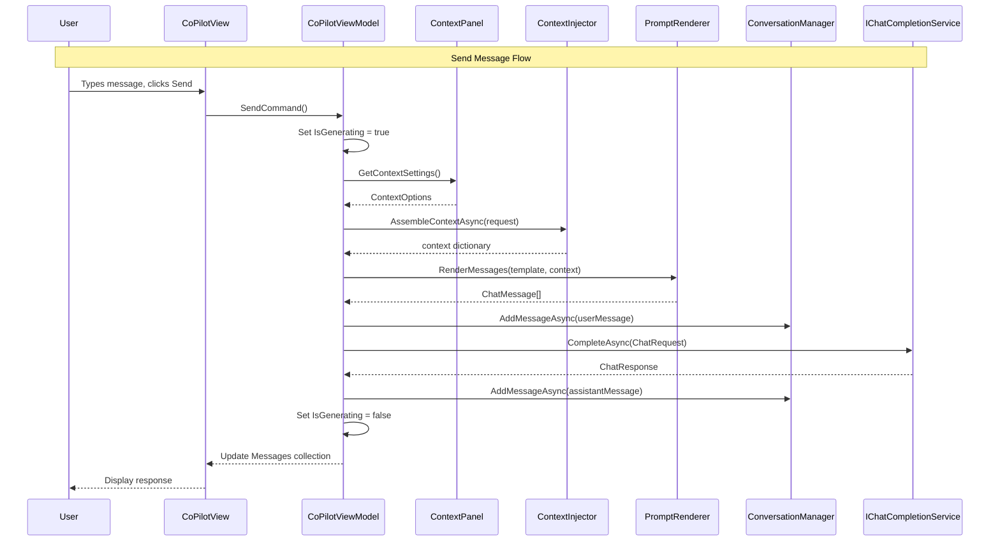

# LCS-SBD-064: Scope Breakdown — The Chat Interface

## Document Control

| Field            | Value                                    |
| :--------------- | :--------------------------------------- |
| **Document ID**  | LCS-SBD-064                              |
| **Version**      | v0.6.4                                   |
| **Codename**     | The Chat Interface                       |
| **Status**       | Draft                                    |
| **Last Updated** | 2026-01-27                               |
| **Owner**        | Lead Architect                           |
| **Depends On**   | v0.6.1, v0.6.2, v0.6.3, v0.1.1b, v0.1.3b |

---

## 1. Executive Summary

### 1.1 The Vision

**v0.6.4** delivers **The Chat Interface** — a user-facing chat panel for conversational AI assistance that brings together all the LLM infrastructure built in v0.6.1-v0.6.3. This release transforms the underlying AI capabilities into a tangible, interactive experience where writers can converse naturally with their AI assistant.

The Chat Interface establishes the foundational Co-pilot experience, providing a virtualized message list, rich Markdown rendering, conversation management, and a context panel showing what information is being sent to the AI. This creates a transparent, controllable AI interaction environment that respects user privacy and preference.

### 1.2 Business Value

| Stakeholder    | Benefit                                                          |
| :------------- | :--------------------------------------------------------------- |
| **Writers**    | Conversational AI assistance accessible via intuitive chat panel |
| **Teams**      | Consistent AI interaction patterns across team members           |
| **Developers** | Extensible chat framework for specialized agents                 |
| **Enterprise** | Auditable conversation history with context transparency         |

### 1.3 Success Criteria

This release succeeds when:

1. Users can send messages and receive AI responses in a chat panel.
2. Chat panel renders Markdown responses with syntax-highlighted code blocks.
3. Conversation history management allows new conversations and export.
4. Context panel shows active style rules, RAG chunks, and document info.
5. All components integrate with license gating (WriterPro+ for chat features).

### 1.4 License Gating

The Chat Interface features tier-based access:

| Feature                  | Core | WriterPro | Teams | Enterprise |
| :----------------------- | :--- | :-------- | :---- | :--------- |
| Chat panel UI            | —    | ✓         | ✓     | ✓          |
| Basic message exchange   | —    | ✓         | ✓     | ✓          |
| Markdown rendering       | —    | ✓         | ✓     | ✓          |
| Model selector           | —    | ✓         | ✓     | ✓          |
| Conversation export      | —    | ✓         | ✓     | ✓          |
| Context panel            | —    | ✓         | ✓     | ✓          |
| Multiple conversations   | —    | —         | ✓     | ✓          |
| Conversation persistence | —    | —         | —     | ✓          |

---

## 2. Dependencies on Prior Versions

| Component                   | Source Version | Usage in v0.6.4                          |
| :-------------------------- | :------------- | :--------------------------------------- |
| `IChatCompletionService`    | v0.6.1a        | LLM communication for chat responses     |
| `ChatMessage`               | v0.6.1a        | Message format for conversation history  |
| `ChatRole`                  | v0.6.1a        | Role assignment for messages             |
| `ChatOptions`               | v0.6.1b        | Model and temperature configuration      |
| `ILLMProviderRegistry`      | v0.6.1c        | Available models for model selector      |
| `LLMProviderInfo`           | v0.6.1c        | Provider information display             |
| `IPromptTemplateRepository` | v0.6.3c        | Template selection for prompts           |
| `IPromptRenderer`           | v0.6.3a        | Rendering prompts with context           |
| `IContextInjector`          | v0.6.3d        | Assembling context for context panel     |
| `IRegionManager`            | v0.1.1b        | Register chat panel in shell region      |
| `Markdig`                   | v0.1.3b        | Markdown rendering for responses         |
| `ILogger<T>`                | v0.0.3b        | Structured logging                       |
| `ILicenseContext`           | v0.0.4c        | License tier validation                  |
| `IMediator`                 | v0.0.7a        | Event publishing for conversation events |

---

## 3. Sub-Part Specifications

### 3.1 v0.6.4a: Chat Panel View

| Field            | Value                      |
| :--------------- | :------------------------- |
| **Sub-Part ID**  | AGT-064a                   |
| **Title**        | Chat Panel View            |
| **Module**       | `Lexichord.Modules.Agents` |
| **License Tier** | WriterPro                  |

**Goal:** Create `CoPilotView.axaml` with a virtualized message list, input area, model selector, and context indicator.

**Key Deliverables:**

- `CoPilotView.axaml` UserControl with chat interface layout
- `CoPilotViewModel` with conversation state management
- Message list with `ItemsControl` and virtualization
- Multi-line `TextBox` input with Send button
- Model selector dropdown bound to `ILLMProviderRegistry`
- Context indicator showing active document and style guide
- Registration in `ShellRegion.Right` via `IRegionManager`
- Unit tests for ViewModel logic

**Key Interfaces:**

```csharp
public partial class CoPilotViewModel : ObservableObject
{
    [ObservableProperty] private ObservableCollection<ChatMessageViewModel> _messages = [];
    [ObservableProperty] private string _inputText = string.Empty;
    [ObservableProperty] private bool _isGenerating;
    [ObservableProperty] private string _selectedModel = "gpt-4o-mini";
    [ObservableProperty] private string _selectedProvider = "OpenAI";
    [ObservableProperty] private bool _canSend;

    [RelayCommand(CanExecute = nameof(CanSend))]
    private async Task SendAsync(CancellationToken ct);

    [RelayCommand]
    private void NewConversation();

    [RelayCommand]
    private async Task ExportConversationAsync();
}
```

**Key UI Components:**

````text
┌──────────────────────────────────────────────────────────────────────────┐
│  Co-pilot                                              [▼ gpt-4o-mini]   │ ← Header
├──────────────────────────────────────────────────────────────────────────┤
│  ┌────────────────────────────────────────────────────────────────────┐  │
│  │  [Context Indicator: Document.md | 5 Style Rules]                  │  │ ← Context Bar
│  └────────────────────────────────────────────────────────────────────┘  │
├──────────────────────────────────────────────────────────────────────────┤
│  ┌────────────────────────────────────────────────────────────────────┐  │
│  │                                                                    │  │
│  │  [User] What is dependency injection?                              │  │
│  │  ─────────────────────────────────────────────────────────────────  │  │
│  │  [Assistant] Dependency injection is a design pattern...          │  │
│  │                                                                    │  │
│  │  ```csharp                                                         │  │
│  │  public class Service {                                            │  │
│  │      private readonly ILogger _logger;                             │  │
│  │  }                                                                 │  │
│  │  ```                                                               │  │
│  │                                                                    │  │
│  └────────────────────────────────────────────────────────────────────┘  │ ← Message List
├──────────────────────────────────────────────────────────────────────────┤
│  ┌────────────────────────────────────────────────────────────────────┐  │
│  │  Type your message...                                              │  │ ← Input Area
│  │                                                                    │  │
│  └──────────────────────────────────────────────────────────────[⏎]──┘  │
├──────────────────────────────────────────────────────────────────────────┤
│  [New Chat] [Export]                                   [Tokens: ~150]   │ ← Footer
└──────────────────────────────────────────────────────────────────────────┘
````

**Design Spec Reference:**

See [LCS-DES-064a](LCS-DES-064a.md) for full specification.

---

### 3.2 v0.6.4b: Message Rendering

| Field            | Value                      |
| :--------------- | :------------------------- |
| **Sub-Part ID**  | AGT-064b                   |
| **Title**        | Message Rendering          |
| **Module**       | `Lexichord.Modules.Agents` |
| **License Tier** | WriterPro                  |

**Goal:** Create `ChatMessageView` UserControl with role-specific styling, Markdown rendering, and code block syntax highlighting.

**Key Deliverables:**

- `ChatMessageView.axaml` UserControl for individual messages
- `ChatMessageViewModel` for message state and actions
- Different styling for User/Assistant/System messages
- Markdown rendering using `Markdig` library (v0.1.3b)
- Code block syntax highlighting with language detection
- Copy button for code blocks and full responses
- Relative timestamp display ("2 minutes ago")
- Unit tests for message rendering logic

**Key Interfaces:**

```csharp
public partial class ChatMessageViewModel : ObservableObject
{
    public Guid MessageId { get; init; }
    public ChatRole Role { get; init; }

    [ObservableProperty] private string _content = string.Empty;
    [ObservableProperty] private DateTime _timestamp;
    [ObservableProperty] private string _relativeTime = string.Empty;
    [ObservableProperty] private bool _isStreaming;

    public IReadOnlyList<CodeBlockViewModel> CodeBlocks { get; }

    [RelayCommand]
    private Task CopyContentAsync();

    [RelayCommand]
    private Task CopyCodeBlockAsync(CodeBlockViewModel block);
}

public record CodeBlockViewModel(
    string Language,
    string Code,
    int StartIndex,
    int EndIndex
);
```

**Styling by Role:**

| Role      | Background            | Alignment | Avatar     |
| :-------- | :-------------------- | :-------- | :--------- |
| User      | `Brush.Surface.User`  | Right     | User icon  |
| Assistant | `Brush.Surface.AI`    | Left      | Robot icon |
| System    | `Brush.Surface.Muted` | Center    | Gear icon  |

**Design Spec Reference:**

See [LCS-DES-064b](LCS-DES-064b.md) for full specification.

---

### 3.3 v0.6.4c: Conversation Management

| Field            | Value                      |
| :--------------- | :------------------------- |
| **Sub-Part ID**  | AGT-064c                   |
| **Title**        | Conversation Management    |
| **Module**       | `Lexichord.Modules.Agents` |
| **License Tier** | WriterPro                  |

**Goal:** Implement conversation state handling with history management, session persistence, and export capabilities.

**Key Deliverables:**

- `IConversationManager` interface for conversation lifecycle
- `ConversationManager` implementation
- `Conversation` record with metadata and messages
- In-memory conversation history (current session)
- "New Conversation" to clear history
- "Export Conversation" to Markdown file
- Auto-generated conversation title from first user message
- Maximum history length configurable (default: 50 messages)
- History truncation with user notification
- Unit tests for conversation logic

**Key Interfaces:**

```csharp
public interface IConversationManager
{
    Conversation CurrentConversation { get; }
    IReadOnlyList<Conversation> RecentConversations { get; }

    Task<Conversation> CreateConversationAsync(CancellationToken ct = default);
    Task AddMessageAsync(ChatMessage message, CancellationToken ct = default);
    Task ClearCurrentConversationAsync(CancellationToken ct = default);
    Task<string> ExportToMarkdownAsync(Conversation conversation, CancellationToken ct = default);

    event EventHandler<ConversationChangedEventArgs>? ConversationChanged;
}

public record Conversation(
    Guid ConversationId,
    string Title,
    DateTime CreatedAt,
    DateTime LastMessageAt,
    IReadOnlyList<ChatMessage> Messages,
    ConversationMetadata Metadata
);

public record ConversationMetadata(
    string? DocumentPath,
    string? SelectedModel,
    int TotalTokens
);

public record ConversationChangedEventArgs(
    ConversationChangeType ChangeType,
    Conversation Conversation
);

public enum ConversationChangeType
{
    Created,
    MessageAdded,
    Cleared,
    TitleChanged
}
```

**Export Format:**

```markdown
# Conversation: [Auto-generated Title]

**Date:** 2026-01-27
**Model:** gpt-4o-mini
**Document:** /path/to/document.md

---

## User

What is dependency injection?

---

## Assistant

Dependency injection is a design pattern...

---
```

**Design Spec Reference:**

See [LCS-DES-064c](LCS-DES-064c.md) for full specification.

---

### 3.4 v0.6.4d: Context Panel

| Field            | Value                      |
| :--------------- | :------------------------- |
| **Sub-Part ID**  | AGT-064d                   |
| **Title**        | Context Panel              |
| **Module**       | `Lexichord.Modules.Agents` |
| **License Tier** | WriterPro                  |

**Goal:** Add collapsible panel showing injected context with toggle switches to enable/disable context sources.

**Key Deliverables:**

- `ContextPanelView.axaml` UserControl for context display
- `ContextPanelViewModel` for context state
- "Style Rules Active" indicator with rule count
- "RAG Context" showing retrieved chunk summaries
- "Document Context" showing current file info
- Toggle switches to enable/disable context sources per-conversation
- Collapsible panel (expandable/collapsible)
- Real-time context preview before sending
- Integration with `IContextInjector` (v0.6.3d)
- Unit tests for context panel logic

**Key Interfaces:**

```csharp
public partial class ContextPanelViewModel : ObservableObject
{
    [ObservableProperty] private bool _isExpanded = false;

    [ObservableProperty] private bool _styleRulesEnabled = true;
    [ObservableProperty] private int _styleRuleCount;
    [ObservableProperty] private string _styleRulesSummary = string.Empty;

    [ObservableProperty] private bool _ragContextEnabled = true;
    [ObservableProperty] private int _ragChunkCount;
    [ObservableProperty] private IReadOnlyList<RagChunkSummary> _ragChunks = [];

    [ObservableProperty] private bool _documentContextEnabled = true;
    [ObservableProperty] private string? _currentDocumentPath;
    [ObservableProperty] private string? _currentDocumentName;

    [ObservableProperty] private int _estimatedContextTokens;

    [RelayCommand]
    private async Task RefreshContextAsync();
}

public record RagChunkSummary(
    string Source,
    string Preview,
    float RelevanceScore
);
```

**Context Panel Layout:**

```text
┌──────────────────────────────────────────────────────────────────────────┐
│  ▼ Context                                              [Refresh ↻]     │ ← Collapsible
├──────────────────────────────────────────────────────────────────────────┤
│                                                                          │
│  [☑] Style Rules (5 active)                                             │
│      • Use active voice                                                  │
│      • Avoid jargon                                                      │
│      • Keep sentences < 25 words                                         │
│                                                                          │
│  [☑] RAG Context (3 chunks)                                             │
│      ├─ docs/api/overview.md (0.89)                                     │
│      │  "The API provides endpoints for..."                             │
│      ├─ docs/guides/setup.md (0.82)                                     │
│      │  "To configure the application..."                               │
│      └─ docs/faq.md (0.76)                                              │
│         "Common questions about..."                                     │
│                                                                          │
│  [☑] Document: architecture.md                                          │
│      Path: /project/docs/architecture.md                                 │
│                                                                          │
├──────────────────────────────────────────────────────────────────────────┤
│  Estimated context tokens: ~450                                         │
└──────────────────────────────────────────────────────────────────────────┘
```

**Dependencies:**

- v0.6.3d: `IContextInjector` for context assembly
- v0.2.1b: `IStyleRuleRepository` for style rule display
- v0.4.5a: `ISemanticSearchService` for RAG chunk preview

**Design Spec Reference:**

See [LCS-DES-064d](LCS-DES-064d.md) for full specification.

---

## 4. Implementation Checklist

| #         | Sub-Part | Task                                             | Est. Hours   |
| :-------- | :------- | :----------------------------------------------- | :----------- |
| 1         | v0.6.4a  | Create `CoPilotView.axaml` layout                | 3            |
| 2         | v0.6.4a  | Implement `CoPilotViewModel` with message state  | 3            |
| 3         | v0.6.4a  | Implement virtualized message list               | 2            |
| 4         | v0.6.4a  | Implement model selector dropdown                | 1            |
| 5         | v0.6.4a  | Implement input area with send logic             | 2            |
| 6         | v0.6.4a  | Register panel with `IRegionManager`             | 1            |
| 7         | v0.6.4a  | Unit tests for ViewModel                         | 3            |
| 8         | v0.6.4b  | Create `ChatMessageView.axaml`                   | 2            |
| 9         | v0.6.4b  | Implement `ChatMessageViewModel`                 | 2            |
| 10        | v0.6.4b  | Implement role-specific styling                  | 2            |
| 11        | v0.6.4b  | Integrate Markdig for Markdown rendering         | 2            |
| 12        | v0.6.4b  | Implement code block extraction and highlighting | 3            |
| 13        | v0.6.4b  | Implement copy functionality                     | 1            |
| 14        | v0.6.4b  | Implement relative timestamp logic               | 1            |
| 15        | v0.6.4b  | Unit tests for message rendering                 | 3            |
| 16        | v0.6.4c  | Define `IConversationManager` interface          | 1            |
| 17        | v0.6.4c  | Implement `ConversationManager`                  | 3            |
| 18        | v0.6.4c  | Implement conversation history storage           | 2            |
| 19        | v0.6.4c  | Implement "New Conversation" logic               | 1            |
| 20        | v0.6.4c  | Implement "Export Conversation" to Markdown      | 2            |
| 21        | v0.6.4c  | Implement auto-title generation                  | 1            |
| 22        | v0.6.4c  | Implement history truncation with notification   | 1            |
| 23        | v0.6.4c  | Unit tests for conversation management           | 3            |
| 24        | v0.6.4d  | Create `ContextPanelView.axaml`                  | 2            |
| 25        | v0.6.4d  | Implement `ContextPanelViewModel`                | 2            |
| 26        | v0.6.4d  | Implement style rules display                    | 1            |
| 27        | v0.6.4d  | Implement RAG chunks display                     | 2            |
| 28        | v0.6.4d  | Implement document context display               | 1            |
| 29        | v0.6.4d  | Implement toggle switches for context sources    | 1            |
| 30        | v0.6.4d  | Implement token estimation                       | 1            |
| 31        | v0.6.4d  | Unit tests for context panel                     | 2            |
| 32        | All      | Integration tests for full chat workflow         | 4            |
| 33        | All      | DI registration in AgentsModule.cs               | 1            |
| **Total** |          |                                                  | **58 hours** |

---

## 5. Dependency Matrix

### 5.1 Required Interfaces (from earlier versions)

| Interface                   | Source Version | Purpose                        |
| :-------------------------- | :------------- | :----------------------------- |
| `IChatCompletionService`    | v0.6.1a        | LLM communication              |
| `ChatMessage`               | v0.6.1a        | Message format                 |
| `ChatRole`                  | v0.6.1a        | Message role                   |
| `ChatOptions`               | v0.6.1b        | Request configuration          |
| `ILLMProviderRegistry`      | v0.6.1c        | Available providers and models |
| `IPromptTemplateRepository` | v0.6.3c        | Template selection             |
| `IPromptRenderer`           | v0.6.3a        | Template rendering             |
| `IContextInjector`          | v0.6.3d        | Context assembly               |
| `IRegionManager`            | v0.1.1b        | Panel registration             |
| `Markdig`                   | v0.1.3b        | Markdown rendering             |
| `ILicenseContext`           | v0.0.4c        | License validation             |

### 5.2 New Interfaces (defined in v0.6.4)

| Interface              | Defined In | Module         | Purpose                |
| :--------------------- | :--------- | :------------- | :--------------------- |
| `IConversationManager` | v0.6.4c    | Modules.Agents | Conversation lifecycle |

### 5.3 New Records/DTOs (defined in v0.6.4)

| Record                         | Defined In | Purpose                     |
| :----------------------------- | :--------- | :-------------------------- |
| `Conversation`                 | v0.6.4c    | Conversation data container |
| `ConversationMetadata`         | v0.6.4c    | Conversation metadata       |
| `ConversationChangedEventArgs` | v0.6.4c    | Change notification         |
| `CodeBlockViewModel`           | v0.6.4b    | Code block display data     |
| `RagChunkSummary`              | v0.6.4d    | RAG context preview         |

### 5.4 NuGet Packages

| Package   | Version | Purpose            | New/Existing |
| :-------- | :------ | :----------------- | :----------- |
| `Markdig` | 0.37.x  | Markdown rendering | Existing     |

---

## 6. Architecture Diagram



---

## 7. Data Flow Diagram



---

## 8. Risks & Mitigations

| Risk                                       | Impact | Probability | Mitigation                             |
| :----------------------------------------- | :----- | :---------- | :------------------------------------- |
| Large response blocks up UI thread         | High   | Medium      | Async rendering, chunk processing      |
| Message list performance with long history | Medium | Medium      | Virtualization, history truncation     |
| Markdown rendering XSS vulnerabilities     | High   | Low         | Sanitize HTML output, use safe mode    |
| Code block language detection failures     | Low    | Medium      | Fallback to plain text, log warning    |
| Conversation export file system errors     | Medium | Low         | Error handling, retry with save dialog |
| Context panel stale after document switch  | Medium | Medium      | Document change subscription, refresh  |

---

## 9. Success Metrics

| Metric                        | Target   | Measurement              |
| :---------------------------- | :------- | :----------------------- |
| Message render time           | < 50ms   | Stopwatch timing         |
| Message list scroll FPS       | > 60 FPS | Performance profiler     |
| Time to first message display | < 200ms  | User action to UI update |
| Export to Markdown time       | < 500ms  | Stopwatch timing         |
| Context panel refresh time    | < 200ms  | Stopwatch timing         |
| Memory per 100 messages       | < 10MB   | Memory profiler          |

---

## 10. What This Enables

After v0.6.4, Lexichord will support:

- **v0.6.5:** The Stream — Real-time streaming in the chat panel
- **v0.6.6:** The Co-pilot Agent — Full agent utilizing chat interface
- **v0.6.7:** The Document Bridge — Editor integration with chat
- **v0.7.x:** The Specialists — Multiple specialized agents in chat
- **Future:** Conversation search, history persistence, team sharing

---

## 11. User Stories

| ID    | Role      | Story                                                               | Acceptance Criteria                         |
| :---- | :-------- | :------------------------------------------------------------------ | :------------------------------------------ |
| US-01 | Writer    | As a writer, I want to chat with an AI assistant about my document. | Chat panel sends and receives messages      |
| US-02 | Writer    | As a writer, I want to see code in responses properly formatted.    | Code blocks render with syntax highlighting |
| US-03 | Writer    | As a writer, I want to copy code snippets from AI responses.        | Copy button copies code to clipboard        |
| US-04 | Writer    | As a writer, I want to see what context is being sent to the AI.    | Context panel shows active context sources  |
| US-05 | Writer    | As a writer, I want to control which context sources are included.  | Toggle switches enable/disable sources      |
| US-06 | Writer    | As a writer, I want to export my conversation for reference.        | Export creates readable Markdown file       |
| US-07 | Writer    | As a writer, I want to start fresh conversations easily.            | New Chat clears history                     |
| US-08 | Team Lead | As a team lead, I want my team to use consistent model settings.    | Model selector remembers preference         |

---

## 12. Use Cases

### UC-01: Send Message and Receive Response

**Preconditions:**

- User has WriterPro or higher license
- At least one LLM provider is configured

**Flow:**

1. User types message in input area.
2. User clicks Send button or presses Enter.
3. System disables input and shows generating indicator.
4. System assembles context from enabled sources.
5. System renders prompt with template and context.
6. System sends request to LLM via `IChatCompletionService`.
7. System receives response and adds to message list.
8. System re-enables input for next message.

**Postconditions:**

- Both user message and AI response visible in chat
- Conversation history updated

### UC-02: Export Conversation to Markdown

**Preconditions:**

- User has active conversation with at least one exchange

**Flow:**

1. User clicks "Export" button.
2. System shows save file dialog.
3. User selects location and filename.
4. System generates Markdown from conversation.
5. System saves file to selected location.
6. System shows success notification.

**Postconditions:**

- Markdown file saved with formatted conversation
- File includes metadata (date, model, document)

### UC-03: Toggle Context Sources

**Preconditions:**

- User has context panel visible

**Flow:**

1. User expands context panel.
2. User toggles off "RAG Context" switch.
3. System updates context preview (removes RAG chunks).
4. System updates estimated token count.
5. User sends next message.
6. System excludes RAG context from prompt.

**Postconditions:**

- Next message sent without RAG context
- Other context sources still included if enabled

---

## 13. Unit Testing Requirements

### 13.1 CoPilotViewModel Tests

```csharp
[Trait("Category", "Unit")]
[Trait("Version", "v0.6.4a")]
public class CoPilotViewModelTests
{
    [Fact]
    public async Task SendAsync_WithValidInput_AddsUserAndAssistantMessages()
    {
        // Arrange
        var mockLlm = Substitute.For<IChatCompletionService>();
        mockLlm.CompleteAsync(Arg.Any<ChatRequest>(), Arg.Any<CancellationToken>())
            .Returns(new ChatResponse("Test response", 10, 20, TimeSpan.Zero, "stop"));

        var vm = new CoPilotViewModel(mockLlm, /* other deps */);
        vm.InputText = "Hello";

        // Act
        await vm.SendCommand.ExecuteAsync(null);

        // Assert
        vm.Messages.Should().HaveCount(2);
        vm.Messages[0].Role.Should().Be(ChatRole.User);
        vm.Messages[1].Role.Should().Be(ChatRole.Assistant);
    }

    [Fact]
    public void CanSend_WithEmptyInput_ReturnsFalse()
    {
        // Arrange
        var vm = new CoPilotViewModel(/* deps */);
        vm.InputText = "";

        // Act & Assert
        vm.CanSend.Should().BeFalse();
    }

    [Fact]
    public void CanSend_WhileGenerating_ReturnsFalse()
    {
        // Arrange
        var vm = new CoPilotViewModel(/* deps */);
        vm.InputText = "Hello";
        vm.IsGenerating = true;

        // Act & Assert
        vm.CanSend.Should().BeFalse();
    }
}
```

### 13.2 ChatMessageViewModel Tests

````csharp
[Trait("Category", "Unit")]
[Trait("Version", "v0.6.4b")]
public class ChatMessageViewModelTests
{
    [Theory]
    [InlineData(0, "Just now")]
    [InlineData(60, "1 minute ago")]
    [InlineData(3600, "1 hour ago")]
    [InlineData(86400, "1 day ago")]
    public void RelativeTime_ReturnsCorrectFormat(int secondsAgo, string expected)
    {
        // Arrange
        var vm = new ChatMessageViewModel
        {
            Timestamp = DateTime.Now.AddSeconds(-secondsAgo)
        };

        // Act
        var result = vm.RelativeTime;

        // Assert
        result.Should().Be(expected);
    }

    [Fact]
    public void CodeBlocks_ExtractsFromMarkdown()
    {
        // Arrange
        var content = """
            Here is code:
            ```csharp
            var x = 1;
            ```
            """;

        var vm = new ChatMessageViewModel { Content = content };

        // Act & Assert
        vm.CodeBlocks.Should().HaveCount(1);
        vm.CodeBlocks[0].Language.Should().Be("csharp");
        vm.CodeBlocks[0].Code.Should().Be("var x = 1;");
    }
}
````

---

## 14. Observability & Logging

| Level   | Source               | Message Template                                                  |
| :------ | :------------------- | :---------------------------------------------------------------- |
| Debug   | CoPilotViewModel     | `Sending message: {Length} chars, model: {Model}`                 |
| Debug   | CoPilotViewModel     | `Context assembled: {RuleCount} rules, {ChunkCount} chunks`       |
| Info    | CoPilotViewModel     | `Message sent, response received in {ElapsedMs}ms`                |
| Info    | ConversationManager  | `New conversation created: {ConversationId}`                      |
| Info    | ConversationManager  | `Conversation exported to {Path}`                                 |
| Warning | CoPilotViewModel     | `Message history truncated: {TruncatedCount} messages removed`    |
| Warning | ChatMessageViewModel | `Failed to detect code block language for block at index {Index}` |
| Error   | CoPilotViewModel     | `LLM request failed: {Error}`                                     |
| Error   | ConversationManager  | `Failed to export conversation: {Error}`                          |

---

## 15. UI/UX Specifications

### 15.1 Component Styling Requirements

| Component         | Theme Resource           | Notes                           |
| :---------------- | :----------------------- | :------------------------------ |
| Chat Panel        | `Brush.Surface.Panel`    | Right sidebar panel             |
| User Message      | `Brush.Surface.User`     | Slightly elevated               |
| Assistant Message | `Brush.Surface.AI`       | Distinct from user              |
| Code Block        | `Brush.Surface.Code`     | Monospace font, dark background |
| Input Area        | `Brush.Surface.Input`    | Subtle border on focus          |
| Send Button       | `LexButtonPrimary` theme | Disabled when can't send        |
| Context Panel     | `Brush.Surface.Muted`    | Collapsible section             |

### 15.2 Keyboard Shortcuts

| Shortcut     | Action             | Context          |
| :----------- | :----------------- | :--------------- |
| Enter        | Send message       | Input focused    |
| Shift+Enter  | New line in input  | Input focused    |
| Ctrl+Shift+C | Copy last response | Chat focused     |
| Ctrl+N       | New conversation   | Chat focused     |
| Escape       | Cancel generation  | While generating |

---

## 16. Acceptance Criteria (QA)

| #   | Category          | Criterion                                           |
| :-- | :---------------- | :-------------------------------------------------- |
| 1   | **Chat**          | User can type message and receive AI response       |
| 2   | **Chat**          | Messages display with correct role styling          |
| 3   | **Chat**          | Model selector shows available models from registry |
| 4   | **Chat**          | Send button disabled during generation              |
| 5   | **Rendering**     | Markdown in responses renders correctly             |
| 6   | **Rendering**     | Code blocks have syntax highlighting                |
| 7   | **Rendering**     | Copy button copies code/response to clipboard       |
| 8   | **Rendering**     | Timestamps show relative time ("2 minutes ago")     |
| 9   | **Conversation**  | "New Chat" clears message history                   |
| 10  | **Conversation**  | "Export" saves conversation as Markdown             |
| 11  | **Conversation**  | Title auto-generated from first message             |
| 12  | **Context**       | Context panel shows active style rules              |
| 13  | **Context**       | Context panel shows RAG chunk previews              |
| 14  | **Context**       | Toggle switches enable/disable context sources      |
| 15  | **Context**       | Token estimation updates with context changes       |
| 16  | **License**       | Chat features require WriterPro license             |
| 17  | **Performance**   | Message list scrolls smoothly with 50+ messages     |
| 18  | **Accessibility** | All interactive elements keyboard accessible        |

---

## 17. Verification Commands

```bash
# ═══════════════════════════════════════════════════════════════════════════
# v0.6.4 Verification
# ═══════════════════════════════════════════════════════════════════════════

# 1. Build solution
dotnet build

# 2. Run unit tests for v0.6.4 components
dotnet test --filter "Category=Unit&FullyQualifiedName~v0.6.4"

# 3. Run CoPilotViewModel tests
dotnet test --filter "FullyQualifiedName~CoPilotViewModel"

# 4. Run ChatMessageViewModel tests
dotnet test --filter "FullyQualifiedName~ChatMessageViewModel"

# 5. Run ConversationManager tests
dotnet test --filter "FullyQualifiedName~ConversationManager"

# 6. Run ContextPanelViewModel tests
dotnet test --filter "FullyQualifiedName~ContextPanelViewModel"

# 7. Run integration tests
dotnet test --filter "Category=Integration&FullyQualifiedName~Chat"

# 8. Manual verification:
# a) Open application with WriterPro license
# b) Click Co-pilot panel in right sidebar
# c) Send test message and verify response
# d) Expand context panel and toggle switches
# e) Export conversation to Markdown file
```

---

## 18. Deliverable Checklist

| #   | Deliverable                                  | Status |
| :-- | :------------------------------------------- | :----- |
| 1   | `CoPilotView.axaml` with chat interface      | [ ]    |
| 2   | `CoPilotViewModel` with message state        | [ ]    |
| 3   | `ChatMessageView.axaml` with role styling    | [ ]    |
| 4   | `ChatMessageViewModel` with Markdown support | [ ]    |
| 5   | `IConversationManager` interface             | [ ]    |
| 6   | `ConversationManager` implementation         | [ ]    |
| 7   | `Conversation` and related records           | [ ]    |
| 8   | `ContextPanelView.axaml` with toggles        | [ ]    |
| 9   | `ContextPanelViewModel` with context state   | [ ]    |
| 10  | Unit tests for all ViewModels                | [ ]    |
| 11  | Integration tests for chat workflow          | [ ]    |
| 12  | DI registration in AgentsModule.cs           | [ ]    |
| 13  | Region registration for panel                | [ ]    |

---

## 19. Code Examples

### 19.1 CoPilotViewModel Implementation

```csharp
namespace Lexichord.Modules.Agents.Chat;

/// <summary>
/// ViewModel for the Co-pilot chat panel.
/// Manages conversation state, message sending, and context integration.
/// </summary>
public partial class CoPilotViewModel : ObservableObject
{
    private readonly IChatCompletionService _chatService;
    private readonly ILLMProviderRegistry _providerRegistry;
    private readonly IPromptRenderer _renderer;
    private readonly IContextInjector _contextInjector;
    private readonly IConversationManager _conversationManager;
    private readonly IPromptTemplateRepository _templateRepository;
    private readonly ILogger<CoPilotViewModel> _logger;

    [ObservableProperty]
    [NotifyPropertyChangedFor(nameof(CanSend))]
    private string _inputText = string.Empty;

    [ObservableProperty]
    [NotifyPropertyChangedFor(nameof(CanSend))]
    private bool _isGenerating;

    [ObservableProperty]
    private string _selectedModel = "gpt-4o-mini";

    [ObservableProperty]
    private string _selectedProvider = "OpenAI";

    [ObservableProperty]
    private ObservableCollection<ChatMessageViewModel> _messages = [];

    public bool CanSend => !string.IsNullOrWhiteSpace(InputText) && !IsGenerating;

    public ContextPanelViewModel ContextPanel { get; }

    public IReadOnlyList<string> AvailableModels =>
        _providerRegistry.GetProvider(SelectedProvider).SupportedModels;

    public CoPilotViewModel(
        IChatCompletionService chatService,
        ILLMProviderRegistry providerRegistry,
        IPromptRenderer renderer,
        IContextInjector contextInjector,
        IConversationManager conversationManager,
        IPromptTemplateRepository templateRepository,
        ContextPanelViewModel contextPanel,
        ILogger<CoPilotViewModel> logger)
    {
        _chatService = chatService;
        _providerRegistry = providerRegistry;
        _renderer = renderer;
        _contextInjector = contextInjector;
        _conversationManager = conversationManager;
        _templateRepository = templateRepository;
        ContextPanel = contextPanel;
        _logger = logger;
    }

    [RelayCommand(CanExecute = nameof(CanSend))]
    private async Task SendAsync(CancellationToken ct)
    {
        var userInput = InputText.Trim();
        InputText = string.Empty;
        IsGenerating = true;

        try
        {
            _logger.LogDebug("Sending message: {Length} chars, model: {Model}",
                userInput.Length, SelectedModel);

            // Add user message to UI
            var userMessage = new ChatMessageViewModel
            {
                MessageId = Guid.NewGuid(),
                Role = ChatRole.User,
                Content = userInput,
                Timestamp = DateTime.Now
            };
            Messages.Add(userMessage);

            // Assemble context
            var contextRequest = new ContextRequest(
                ContextPanel.CurrentDocumentPath,
                CursorPosition: null,
                SelectedText: null,
                ContextPanel.StyleRulesEnabled,
                ContextPanel.RagContextEnabled,
                MaxRAGChunks: 3);

            var context = await _contextInjector.AssembleContextAsync(contextRequest, ct);
            context["user_input"] = userInput;

            _logger.LogDebug("Context assembled: {RuleCount} rules, {ChunkCount} chunks",
                ContextPanel.StyleRuleCount, ContextPanel.RagChunkCount);

            // Render prompt
            var template = _templateRepository.GetTemplate("co-pilot-editor")
                ?? throw new InvalidOperationException("Default template not found");

            var messages = _renderer.RenderMessages(template, context);

            // Include conversation history
            var historyMessages = _conversationManager.CurrentConversation.Messages
                .TakeLast(20)
                .ToList();

            var allMessages = historyMessages.Concat(messages).ToList();

            // Call LLM
            var stopwatch = Stopwatch.StartNew();
            var response = await _chatService.CompleteAsync(
                new ChatRequest(allMessages, new ChatOptions(Model: SelectedModel)), ct);
            stopwatch.Stop();

            _logger.LogInformation("Message sent, response received in {ElapsedMs}ms",
                stopwatch.ElapsedMilliseconds);

            // Add assistant message to UI
            var assistantMessage = new ChatMessageViewModel
            {
                MessageId = Guid.NewGuid(),
                Role = ChatRole.Assistant,
                Content = response.Content,
                Timestamp = DateTime.Now
            };
            Messages.Add(assistantMessage);

            // Update conversation
            await _conversationManager.AddMessageAsync(
                new ChatMessage(ChatRole.User, userInput), ct);
            await _conversationManager.AddMessageAsync(
                new ChatMessage(ChatRole.Assistant, response.Content), ct);
        }
        catch (Exception ex)
        {
            _logger.LogError(ex, "LLM request failed: {Error}", ex.Message);
            // Add error message to chat
            Messages.Add(new ChatMessageViewModel
            {
                Role = ChatRole.System,
                Content = $"Error: {ex.Message}",
                Timestamp = DateTime.Now
            });
        }
        finally
        {
            IsGenerating = false;
        }
    }

    [RelayCommand]
    private async Task NewConversationAsync()
    {
        Messages.Clear();
        await _conversationManager.ClearCurrentConversationAsync();
        _logger.LogInformation("New conversation created: {ConversationId}",
            _conversationManager.CurrentConversation.ConversationId);
    }

    [RelayCommand]
    private async Task ExportConversationAsync()
    {
        try
        {
            var markdown = await _conversationManager.ExportToMarkdownAsync(
                _conversationManager.CurrentConversation);

            // Show save dialog and save file
            // Implementation details in full spec
        }
        catch (Exception ex)
        {
            _logger.LogError(ex, "Failed to export conversation: {Error}", ex.Message);
        }
    }
}
```

### 19.2 IConversationManager Interface

```csharp
namespace Lexichord.Modules.Agents.Contracts;

/// <summary>
/// Manages conversation lifecycle, history, and export.
/// </summary>
public interface IConversationManager
{
    /// <summary>
    /// Gets the currently active conversation.
    /// </summary>
    Conversation CurrentConversation { get; }

    /// <summary>
    /// Gets recently accessed conversations (Teams+ feature).
    /// </summary>
    IReadOnlyList<Conversation> RecentConversations { get; }

    /// <summary>
    /// Creates a new conversation and sets it as current.
    /// </summary>
    Task<Conversation> CreateConversationAsync(CancellationToken ct = default);

    /// <summary>
    /// Adds a message to the current conversation.
    /// </summary>
    /// <param name="message">The message to add.</param>
    /// <param name="ct">Cancellation token.</param>
    Task AddMessageAsync(ChatMessage message, CancellationToken ct = default);

    /// <summary>
    /// Clears the current conversation and creates a new empty one.
    /// </summary>
    Task ClearCurrentConversationAsync(CancellationToken ct = default);

    /// <summary>
    /// Exports a conversation to Markdown format.
    /// </summary>
    /// <param name="conversation">The conversation to export.</param>
    /// <param name="ct">Cancellation token.</param>
    /// <returns>Markdown string representation.</returns>
    Task<string> ExportToMarkdownAsync(
        Conversation conversation,
        CancellationToken ct = default);

    /// <summary>
    /// Raised when conversation changes occur.
    /// </summary>
    event EventHandler<ConversationChangedEventArgs>? ConversationChanged;
}
```

---

## 20. Deferred Features

| Feature                  | Deferred To | Reason                                   |
| :----------------------- | :---------- | :--------------------------------------- |
| Streaming responses      | v0.6.5      | Separate implementation for SSE handling |
| Conversation persistence | v0.7.x      | Requires database schema for Teams+ tier |
| Conversation search      | v0.7.x      | Requires persistence first               |
| Multi-agent selection    | v0.7.x      | Specialists phase                        |
| Voice input              | v1.0+       | Future accessibility enhancement         |

---

## 21. Changelog Entry

Upon completion of v0.6.4, the following entry will be added to `CHANGELOG.md`:

```markdown
## [0.6.4] - 2026-01-XX

### Added

- **Chat Panel UI**: New `CoPilotView` with virtualized message list, model selector, and context indicator
- **Message Rendering**: Role-styled messages with Markdown support and code block syntax highlighting
- **Conversation Management**: `IConversationManager` for history, export, and session lifecycle
- **Context Panel**: Collapsible panel showing active style rules, RAG chunks, and document context
- **Copy Functionality**: Copy buttons for code blocks and full responses

### Changed

- Right sidebar now includes Co-pilot chat panel (WriterPro+)

### Dependencies

- Uses existing Markdig 0.37.x for Markdown rendering

### Technical

- `CoPilotViewModel` for chat state management
- `ChatMessageViewModel` with relative timestamp and code block extraction
- `ConversationManager` for in-memory conversation history
- `ContextPanelViewModel` for context source toggles
```

---
