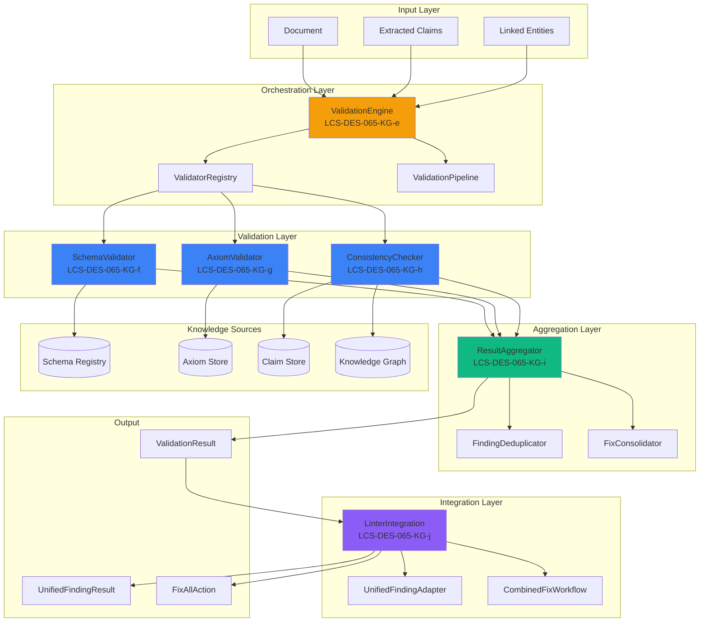
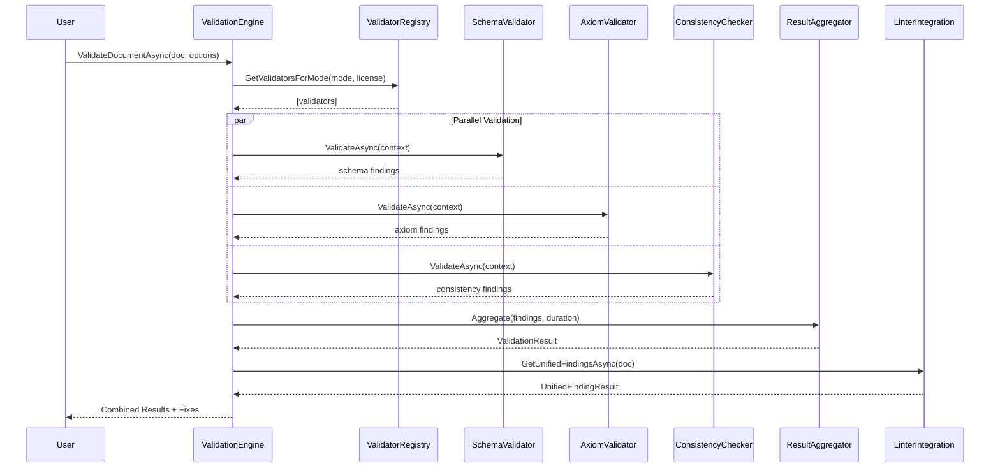

# LCS-DES-065-KG-INDEX: Validation Engine — Design Specifications Index

## Document Control

| Field | Value |
| :--- | :--- |
| **Index ID** | LCS-DES-065-KG-INDEX |
| **System Breakdown** | LCS-SBD-065-KG |
| **Version** | v0.6.5 |
| **Codename** | Validation Engine (CKVS Phase 3a) |
| **Status** | Draft |
| **Last Updated** | 2026-01-31 |

---

## 1. Overview

This index catalogs all design specifications for the **Validation Engine** component of CKVS Phase 3a. The Validation Engine is the core component where all CKVS infrastructure converges to provide actionable validation feedback to technical writers.

---

## 2. Sub-Part Specifications

| Spec ID | Title | Est. Hours | Description |
| :------ | :---- | :--------- | :---------- |
| [LCS-DES-065-KG-e](LCS-DES-065-KG-e.md) | Validation Orchestrator | 6 | Central coordination point for all validators |
| [LCS-DES-065-KG-f](LCS-DES-065-KG-f.md) | Schema Validator | 5 | Validates entities against type schemas |
| [LCS-DES-065-KG-g](LCS-DES-065-KG-g.md) | Axiom Validator | 8 | Validates claims against axiom rules |
| [LCS-DES-065-KG-h](LCS-DES-065-KG-h.md) | Consistency Checker | 8 | Detects contradictions with existing knowledge |
| [LCS-DES-065-KG-i](LCS-DES-065-KG-i.md) | Validation Result Aggregator | 4 | Combines results, deduplicates, suggests fixes |
| [LCS-DES-065-KG-j](LCS-DES-065-KG-j.md) | Linter Integration | 4 | Unified workflow with Lexichord style linter |
| **Total** | | **35** | |

---

## 3. Architecture Diagram



---

## 4. Validation Flow



---

## 5. Key Interfaces

### 5.1 IValidationEngine

```csharp
public interface IValidationEngine
{
    Task<ValidationResult> ValidateDocumentAsync(
        Document document,
        ValidationOptions options,
        CancellationToken ct = default);

    Task<ValidationResult> ValidateClaimsAsync(
        IReadOnlyList<Claim> claims,
        ValidationOptions options,
        CancellationToken ct = default);

    Task<ValidationResult> ValidateGeneratedContentAsync(
        string content,
        GenerationContext context,
        CancellationToken ct = default);

    IAsyncEnumerable<ValidationFinding> ValidateStreamingAsync(
        string content,
        ValidationOptions options,
        CancellationToken ct = default);
}
```

### 5.2 IValidator

```csharp
public interface IValidator
{
    string Name { get; }
    int Priority { get; }
    LicenseTier RequiredTier { get; }
    bool SupportsStreaming { get; }

    Task<IReadOnlyList<ValidationFinding>> ValidateAsync(
        ValidationContext context,
        CancellationToken ct = default);

    IAsyncEnumerable<ValidationFinding> ValidateStreamingAsync(
        ValidationContext context,
        CancellationToken ct = default);
}
```

### 5.3 ILinterIntegration

```csharp
public interface ILinterIntegration
{
    Task<UnifiedFindingResult> GetUnifiedFindingsAsync(
        Document document,
        UnifiedFindingOptions options,
        CancellationToken ct = default);

    Task<FixResult> ApplyUnifiedFixAsync(
        UnifiedFix fix,
        Document document,
        CancellationToken ct = default);

    Task<FixAllResult> ApplyAllFixesAsync(
        Document document,
        FixAllOptions options,
        CancellationToken ct = default);
}
```

---

## 6. Validation Modes

| Mode | Latency Target | Validators | Use Case |
| :--- | :------------- | :--------- | :------- |
| **RealTime** | <100ms | Schema only | As user types |
| **OnSave** | <500ms | Schema + Axiom | Document save |
| **Full** | <5s | All validators | Pre-publish |
| **Streaming** | Per-chunk | Schema + Axiom | LLM generation |

---

## 7. Finding Severity Levels

| Severity | Description | Example |
| :------- | :---------- | :------ |
| **Error** | Blocks publication | Missing required property |
| **Warning** | Should be addressed | Axiom violation (SHOULD) |
| **Info** | Informational note | Deprecated entity usage |
| **Hint** | Style suggestion | Consider adding description |

---

## 8. Validation Finding Codes

### Schema Validator Codes

| Code | Description |
| :--- | :---------- |
| `SCHEMA_REQUIRED_PROPERTY` | Required property missing |
| `SCHEMA_TYPE_MISMATCH` | Property type incorrect |
| `SCHEMA_INVALID_ENUM` | Invalid enum value |
| `SCHEMA_CONSTRAINT` | Constraint violated |
| `SCHEMA_PATTERN_MISMATCH` | Pattern not matched |

### Axiom Validator Codes

| Code | Description |
| :--- | :---------- |
| `AXIOM_VIOLATION` | General axiom violation |
| `AXIOM_PROPERTY_CONSTRAINT` | Property constraint violated |
| `AXIOM_RELATIONSHIP_INVALID` | Invalid relationship types |
| `AXIOM_CARDINALITY` | Cardinality constraint violated |
| `AXIOM_MUTUAL_EXCLUSION` | Mutually exclusive properties |

### Consistency Checker Codes

| Code | Description |
| :--- | :---------- |
| `CONSISTENCY_CONFLICT` | General conflict |
| `CONSISTENCY_VALUE_CONTRADICTION` | Conflicting values |
| `CONSISTENCY_PROPERTY_CONFLICT` | Property value conflict |
| `CONSISTENCY_RELATIONSHIP_CONFLICT` | Relationship contradiction |
| `CONSISTENCY_SEMANTIC_CONFLICT` | Semantic contradiction |

---

## 9. Performance Targets

| Metric | Target | Measurement |
| :----- | :----- | :---------- |
| Real-time validation | <100ms | P95 timing |
| On-save validation | <500ms | P95 timing |
| Full validation | <5s | P95 timing |
| Axiom violation recall | >95% | Test corpus |
| False positive rate | <10% | Human evaluation |

---

## 10. Dependencies

| Component | From | Description |
| :-------- | :--- | :---------- |
| `ISchemaRegistry` | v0.4.5f | Entity type schemas |
| `IAxiomStore` | v0.4.6-KG | Axiom rules |
| `IClaimRepository` | v0.5.6-KG | Existing claims |
| `IGraphRepository` | v0.4.5e | Entity data |
| `IClaimDiffService` | v0.5.6-KG | Semantic comparison |
| `ILinterService` | v0.3.x | Style/grammar linter |

---

## 11. License Gating Summary

| Component | Core | WriterPro | Teams | Enterprise |
| :-------- | :--- | :-------- | :---- | :--------- |
| ValidationEngine | ❌ | Schema only | Full | Full |
| SchemaValidator | ❌ | ✅ | ✅ | ✅ |
| AxiomValidator | ❌ | ❌ | ✅ | ✅ |
| ConsistencyChecker | ❌ | ❌ | ✅ | ✅ |
| LinterIntegration | Linter only | Partial | Full | Full + Custom |

---

## 12. What This Enables

- **v0.6.6 Co-pilot:** Pre/post validation for AI-generated content
- **v0.7.5 Unified Validation:** Combined style + knowledge validation
- **Publication Gates:** Block publishing of invalid documentation
- **Continuous Monitoring:** Track documentation health over time

---

## 13. Changelog

| Version | Date | Author | Changes |
| :------ | :--- | :----- | :------ |
| 1.0 | 2026-01-31 | Lead Architect | Initial creation |

---
