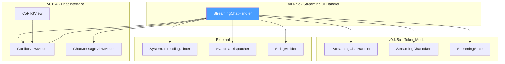
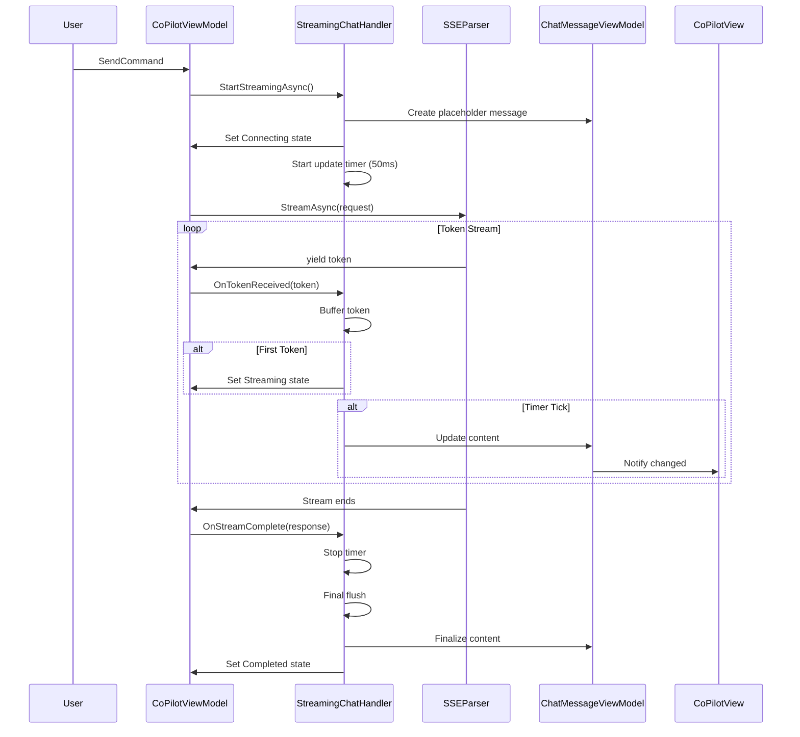
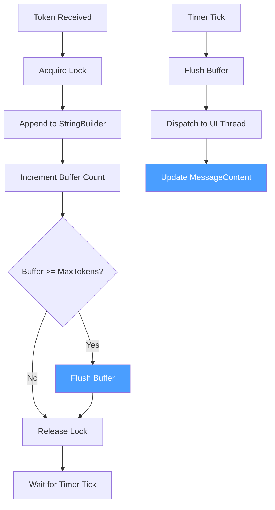

# LCS-DES-065c: Design Specification — Streaming UI Handler

## 1. Metadata & Categorization

| Field           | Value                                     |
| :-------------- | :---------------------------------------- |
| **Document ID** | LCS-DES-065c                              |
| **Version**     | v0.6.5c                                   |
| **Status**      | Draft                                     |
| **Category**    | UI/UX                                     |
| **Module**      | Lexichord.Modules.Agents                  |
| **Created**     | 2026-01-28                                |
| **Author**      | Documentation Agent                       |
| **Parent**      | [LCS-DES-065-INDEX](LCS-DES-065-INDEX.md) |

---

## 2. Executive Summary

### 2.1 The Requirement

Raw streaming tokens arrive rapidly from the SSE parser—potentially hundreds per second. Directly updating the UI for each token would cause severe performance issues, including UI thread blocking, excessive layout recalculations, and poor user experience. A sophisticated handler is needed to bridge the gap between high-frequency token arrival and smooth UI updates.

### 2.2 The Proposed Solution

Implement a `StreamingChatHandler` that:

1. **Buffers tokens** — Accumulates tokens in memory using a `StringBuilder`
2. **Throttles UI updates** — Batches updates at 50ms intervals for smooth rendering
3. **Manages scroll position** — Auto-scrolls to keep latest content visible
4. **Shows typing indicator** — Displays animated indicator during initial connection
5. **Supports cancellation** — Allows users to abort in-progress generation

---

## 3. Architecture & Modular Strategy

### 3.1 Component Placement

```text
Lexichord.Modules.Agents/
└── Chat/
    ├── Services/
    │   └── StreamingChatHandler.cs
    ├── ViewModels/
    │   └── CoPilotViewModel.cs          ← Modified for streaming
    └── Views/
        └── CoPilotView.axaml            ← Modified for streaming UI
```

### 3.2 Dependency Graph



### 3.3 Licensing Behavior

The Streaming UI Handler is only instantiated for Teams-tier users. WriterPro users receive batch responses directly and do not interact with this component. The license check occurs in `CoPilotViewModel` before streaming is initiated (v0.6.5d).

---

## 4. Data Contract (The API)

### 4.1 StreamingChatHandler Implementation

```csharp
namespace Lexichord.Modules.Agents.Chat.Services;

/// <summary>
/// Handles streaming chat tokens for progressive UI updates.
/// </summary>
/// <remarks>
/// <para>
/// This handler receives tokens from the <see cref="ISSEParser"/> and manages
/// their display in the chat interface. Key responsibilities include:
/// </para>
/// <list type="bullet">
///   <item>Buffering tokens to reduce UI update frequency</item>
///   <item>Dispatching updates to the UI thread safely</item>
///   <item>Managing auto-scroll behavior</item>
///   <item>Handling stream lifecycle (start, progress, complete, error)</item>
/// </list>
/// <para>
/// The handler uses a 50ms throttle timer to batch updates, ensuring smooth
/// animation even with rapid token arrival. This approach reduces layout
/// recalculations from potentially hundreds per second to approximately 20.
/// </para>
/// </remarks>
public sealed class StreamingChatHandler : IStreamingChatHandler, IDisposable
{
    #region Constants

    /// <summary>
    /// Interval between UI updates in milliseconds.
    /// </summary>
    /// <remarks>
    /// 50ms provides approximately 20 updates/second, which appears fluid
    /// while avoiding excessive CPU usage. Adjust based on user feedback.
    /// </remarks>
    private const int UpdateIntervalMs = 50;

    /// <summary>
    /// Maximum tokens to buffer before forcing an update.
    /// </summary>
    /// <remarks>
    /// Even if the timer hasn't fired, flush the buffer when it reaches
    /// this size to prevent excessive memory usage on slow UI threads.
    /// </remarks>
    private const int MaxBufferTokens = 20;

    #endregion

    #region Dependencies

    private readonly CoPilotViewModel _viewModel;
    private readonly ILogger<StreamingChatHandler> _logger;

    #endregion

    #region State

    private readonly StringBuilder _contentBuffer = new();
    private readonly object _bufferLock = new();
    private readonly Timer _updateTimer;

    private ChatMessageViewModel? _currentMessage;
    private int _tokenCount;
    private int _bufferedTokenCount;
    private Stopwatch? _streamStopwatch;
    private bool _disposed;

    #endregion

    #region Constructor

    /// <summary>
    /// Initializes a new instance of <see cref="StreamingChatHandler"/>.
    /// </summary>
    /// <param name="viewModel">The parent ViewModel to update.</param>
    /// <param name="logger">Logger for diagnostic output.</param>
    public StreamingChatHandler(
        CoPilotViewModel viewModel,
        ILogger<StreamingChatHandler> logger)
    {
        _viewModel = viewModel ?? throw new ArgumentNullException(nameof(viewModel));
        _logger = logger ?? throw new ArgumentNullException(nameof(logger));

        _updateTimer = new Timer(
            callback: OnUpdateTimerTick,
            state: null,
            dueTime: Timeout.Infinite,
            period: Timeout.Infinite);

        _logger.LogDebug("StreamingChatHandler created");
    }

    #endregion

    #region Public Methods

    /// <summary>
    /// Prepares the handler for a new streaming session.
    /// </summary>
    /// <remarks>
    /// Call this before initiating the SSE stream to set up the UI state.
    /// Creates the assistant message placeholder and starts the timer.
    /// </remarks>
    /// <returns>A task representing the async operation.</returns>
    public async Task StartStreamingAsync()
    {
        ObjectDisposedException.ThrowIf(_disposed, this);

        _logger.LogDebug("Starting streaming session");

        // Reset state
        _contentBuffer.Clear();
        _tokenCount = 0;
        _bufferedTokenCount = 0;
        _streamStopwatch = Stopwatch.StartNew();

        // Create placeholder message for assistant response
        _currentMessage = new ChatMessageViewModel
        {
            MessageId = Guid.NewGuid(),
            Role = ChatRole.Assistant,
            Content = string.Empty,
            Timestamp = DateTime.Now,
            IsStreaming = true
        };

        // Add to messages collection on UI thread
        await DispatchAsync(() =>
        {
            _viewModel.Messages.Add(_currentMessage);
            _viewModel.StreamingState = StreamingState.Connecting;
        });

        // Start the update timer
        _updateTimer.Change(UpdateIntervalMs, UpdateIntervalMs);

        _logger.LogDebug("Streaming session started, timer active");
    }

    #endregion

    #region IStreamingChatHandler Implementation

    /// <inheritdoc />
    public async Task OnTokenReceived(StreamingChatToken token)
    {
        ObjectDisposedException.ThrowIf(_disposed, this);

        if (token.IsComplete)
        {
            _logger.LogDebug("Received completion token: {Reason}", token.FinishReason);
            return;
        }

        _tokenCount++;

        // First token: transition from Connecting to Streaming
        if (_tokenCount == 1)
        {
            var timeToFirst = _streamStopwatch?.ElapsedMilliseconds ?? 0;
            _logger.LogDebug("First token received at {ElapsedMs}ms", timeToFirst);

            await DispatchAsync(() =>
            {
                _viewModel.StreamingState = StreamingState.Streaming;
            });
        }

        // Buffer the token
        lock (_bufferLock)
        {
            _contentBuffer.Append(token.Text);
            _bufferedTokenCount++;

            // Force flush if buffer is large
            if (_bufferedTokenCount >= MaxBufferTokens)
            {
                FlushBufferLocked();
            }
        }

        _logger.LogTrace("Token {Index} buffered: '{Text}'", token.Index, token.Text);
    }

    /// <inheritdoc />
    public async Task OnStreamComplete(ChatResponse fullResponse)
    {
        ObjectDisposedException.ThrowIf(_disposed, this);

        _streamStopwatch?.Stop();
        _updateTimer.Change(Timeout.Infinite, Timeout.Infinite);

        // Final flush of any remaining buffer
        FlushBuffer();

        _logger.LogInformation(
            "Stream completed: {TokenCount} tokens, {CharCount} chars in {ElapsedMs}ms",
            _tokenCount,
            _contentBuffer.Length,
            _streamStopwatch?.ElapsedMilliseconds ?? 0);

        await DispatchAsync(() =>
        {
            if (_currentMessage is not null)
            {
                _currentMessage.Content = _contentBuffer.ToString();
                _currentMessage.IsStreaming = false;
                _currentMessage.TokenCount = fullResponse.Usage?.CompletionTokens;
            }

            _viewModel.StreamingState = StreamingState.Completed;
            _viewModel.StatusMessage = $"Completed in {_streamStopwatch?.ElapsedMilliseconds}ms";

            // Ensure scroll to bottom
            _viewModel.RequestScrollToBottom();
        });

        // Reset for next stream
        _currentMessage = null;
    }

    /// <inheritdoc />
    public async Task OnStreamError(Exception error)
    {
        ObjectDisposedException.ThrowIf(_disposed, this);

        _streamStopwatch?.Stop();
        _updateTimer.Change(Timeout.Infinite, Timeout.Infinite);

        _logger.LogError(error, "Stream error after {TokenCount} tokens", _tokenCount);

        // Preserve partial content
        FlushBuffer();

        await DispatchAsync(() =>
        {
            if (_currentMessage is not null)
            {
                _currentMessage.Content = _contentBuffer.ToString();
                _currentMessage.IsStreaming = false;
                _currentMessage.HasError = true;
            }

            _viewModel.StreamingState = StreamingState.Error;
            _viewModel.StatusMessage = $"Error: {error.Message}";
        });

        _currentMessage = null;
    }

    #endregion

    #region Timer Callback

    private void OnUpdateTimerTick(object? state)
    {
        if (_disposed) return;

        FlushBuffer();
    }

    #endregion

    #region Buffer Management

    private void FlushBuffer()
    {
        lock (_bufferLock)
        {
            FlushBufferLocked();
        }
    }

    private void FlushBufferLocked()
    {
        if (_bufferedTokenCount == 0 || _currentMessage is null)
        {
            return;
        }

        var content = _contentBuffer.ToString();
        var count = _bufferedTokenCount;
        _bufferedTokenCount = 0;

        // Don't clear the buffer - we accumulate content

        _logger.LogTrace("Flushing {Count} tokens, total chars: {Chars}", count, content.Length);

        // Dispatch UI update
        Dispatcher.UIThread.InvokeAsync(() =>
        {
            if (_currentMessage is not null)
            {
                _currentMessage.Content = content;
                _viewModel.RequestScrollToBottom();
            }
        });
    }

    #endregion

    #region Helpers

    private static async Task DispatchAsync(Action action)
    {
        await Dispatcher.UIThread.InvokeAsync(action);
    }

    #endregion

    #region IDisposable

    /// <inheritdoc />
    public void Dispose()
    {
        if (_disposed) return;

        _updateTimer.Dispose();
        _disposed = true;

        _logger.LogDebug("StreamingChatHandler disposed");
    }

    #endregion
}
```

### 4.2 CoPilotViewModel Updates

```csharp
// Additional properties for CoPilotViewModel (v0.6.5c additions)
public partial class CoPilotViewModel : ObservableObject, IDisposable
{
    #region Streaming Properties

    /// <summary>
    /// Current state of the streaming operation.
    /// </summary>
    [ObservableProperty]
    [NotifyPropertyChangedFor(nameof(IsStreaming))]
    [NotifyPropertyChangedFor(nameof(CanCancel))]
    [NotifyPropertyChangedFor(nameof(ShowTypingIndicator))]
    [NotifyPropertyChangedFor(nameof(InputEnabled))]
    private StreamingState _streamingState = StreamingState.Idle;

    /// <summary>
    /// Handler for the current streaming session.
    /// </summary>
    private StreamingChatHandler? _streamingHandler;

    /// <summary>
    /// Cancellation token source for the current stream.
    /// </summary>
    private CancellationTokenSource? _streamCts;

    #endregion

    #region Computed Streaming Properties

    /// <summary>
    /// True if streaming is actively in progress.
    /// </summary>
    public bool IsStreaming => StreamingState.IsActive();

    /// <summary>
    /// True if the cancel command is available.
    /// </summary>
    public bool CanCancel => StreamingState.CanCancel();

    /// <summary>
    /// True if the typing indicator should be displayed.
    /// </summary>
    public bool ShowTypingIndicator => StreamingState.ShowTypingIndicator();

    /// <summary>
    /// True if user input is enabled.
    /// </summary>
    public bool InputEnabled => StreamingState.InputEnabled();

    #endregion

    #region Streaming Events

    /// <summary>
    /// Event raised when scroll to bottom is requested.
    /// </summary>
    public event EventHandler? ScrollToBottomRequested;

    /// <summary>
    /// Requests the view to scroll to the bottom of the message list.
    /// </summary>
    public void RequestScrollToBottom()
    {
        ScrollToBottomRequested?.Invoke(this, EventArgs.Empty);
    }

    #endregion

    #region Modified SendAsync

    [RelayCommand(CanExecute = nameof(CanSend))]
    private async Task SendAsync(CancellationToken ct)
    {
        var userInput = InputText.Trim();
        InputText = string.Empty;

        try
        {
            // Add user message
            Messages.Add(new ChatMessageViewModel
            {
                MessageId = Guid.NewGuid(),
                Role = ChatRole.User,
                Content = userInput,
                Timestamp = DateTime.Now
            });

            // Check license for streaming (v0.6.5d)
            if (_license.Tier >= LicenseTier.Teams)
            {
                await SendStreamingAsync(userInput, ct);
            }
            else
            {
                await SendBatchAsync(userInput, ct);
            }
        }
        catch (OperationCanceledException)
        {
            _logger.LogDebug("Send operation cancelled");
        }
        catch (Exception ex)
        {
            _logger.LogError(ex, "Send operation failed");
            StatusMessage = $"Error: {ex.Message}";
        }
    }

    private async Task SendStreamingAsync(string userInput, CancellationToken ct)
    {
        _logger.LogDebug("Initiating streaming request");

        // Create linked cancellation for abort
        _streamCts?.Dispose();
        _streamCts = CancellationTokenSource.CreateLinkedTokenSource(ct);

        // Create streaming handler
        _streamingHandler = new StreamingChatHandler(
            this,
            _loggerFactory.CreateLogger<StreamingChatHandler>());

        try
        {
            // Prepare UI
            await _streamingHandler.StartStreamingAsync();

            // Build context
            var context = await BuildContextAsync(userInput, _streamCts.Token);
            var request = new ChatRequest(
                await BuildMessagesAsync(context),
                new ChatOptions(Model: SelectedModel, Stream: true));

            // Stream tokens
            await foreach (var token in _chatService.StreamAsync(request, _streamCts.Token))
            {
                await _streamingHandler.OnTokenReceived(token);
            }

            // Complete
            var fullResponse = new ChatResponse(
                Content: _streamingHandler.GetCurrentContent(),
                FinishReason: "stop");
            await _streamingHandler.OnStreamComplete(fullResponse);
        }
        catch (OperationCanceledException)
        {
            StreamingState = StreamingState.Cancelled;
            StatusMessage = "Cancelled";
            throw;
        }
        catch (Exception ex)
        {
            await _streamingHandler.OnStreamError(ex);
            throw;
        }
        finally
        {
            _streamingHandler?.Dispose();
            _streamingHandler = null;
        }
    }

    #endregion

    #region Cancel Command

    [RelayCommand(CanExecute = nameof(CanCancel))]
    private void CancelStreaming()
    {
        if (_streamCts is null || _streamCts.IsCancellationRequested)
        {
            _logger.LogDebug("No active stream to cancel");
            return;
        }

        _logger.LogInformation("Cancelling streaming by user request");
        _streamCts.Cancel();
    }

    #endregion
}
```

---

## 5. Implementation Logic

### 5.1 Streaming Session Lifecycle



### 5.2 Token Buffering Flow



### 5.3 Auto-Scroll Behavior

```csharp
// In CoPilotView.axaml.cs
public partial class CoPilotView : UserControl
{
    public CoPilotView()
    {
        InitializeComponent();

        // Subscribe to scroll requests when DataContext is set
        DataContextChanged += OnDataContextChanged;
    }

    private void OnDataContextChanged(object? sender, EventArgs e)
    {
        if (DataContext is CoPilotViewModel viewModel)
        {
            viewModel.ScrollToBottomRequested += OnScrollToBottomRequested;
        }
    }

    private void OnScrollToBottomRequested(object? sender, EventArgs e)
    {
        // Use dispatcher to ensure layout is complete
        Dispatcher.UIThread.InvokeAsync(() =>
        {
            var scrollViewer = this.FindControl<ScrollViewer>("MessageScrollViewer");
            if (scrollViewer is not null)
            {
                // Smooth scroll to bottom
                scrollViewer.ScrollToEnd();
            }
        }, DispatcherPriority.Render);
    }

    protected override void OnUnloaded(RoutedEventArgs e)
    {
        base.OnUnloaded(e);

        if (DataContext is CoPilotViewModel viewModel)
        {
            viewModel.ScrollToBottomRequested -= OnScrollToBottomRequested;
        }
    }
}
```

---

## 6. UI/UX Specifications

### 6.1 Visual State Transitions

```text
Initial State (Idle):
┌────────────────────────────────────────────────────────────┐
│ 👤 User: How should I structure my novel?                  │
└────────────────────────────────────────────────────────────┘
┌────────────────────────────────────────────────────────────┐
│ [                 Message input enabled                   ]│
└────────────────────────────────────────────────────────────┘
│ [New Chat] [Export]                           ~150 tokens  │


Connecting State:
┌────────────────────────────────────────────────────────────┐
│ 🤖 ●●●                                                     │ ← Typing indicator
└────────────────────────────────────────────────────────────┘
┌────────────────────────────────────────────────────────────┐
│ (                 Input disabled                          )│
└────────────────────────────────────────────────────────────┘
│ [Cancel ⏹]                               Connecting... ●●● │


Streaming State:
┌────────────────────────────────────────────────────────────┐
│ 🤖 Consider organizing your novel using the classic        │
│    three-act structure. In Act I, establish your█          │ ← Cursor blinks
└────────────────────────────────────────────────────────────┘
┌────────────────────────────────────────────────────────────┐
│ (                 Input disabled                          )│
└────────────────────────────────────────────────────────────┘
│ [Cancel ⏹]                              Streaming... ●●●   │


Completed State:
┌────────────────────────────────────────────────────────────┐
│ 🤖 Consider organizing your novel using the classic        │
│    three-act structure. In Act I, establish...             │
│    ... [full response]                                     │
│                                                  Just now  │
└────────────────────────────────────────────────────────────┘
┌────────────────────────────────────────────────────────────┐
│ [                 Message input enabled                   ]│
└────────────────────────────────────────────────────────────┘
│ [New Chat] [Export]               Completed in 2,340ms     │
```

### 6.2 Typing Indicator Animation

```csharp
// Typing indicator style in CoPilotView.axaml
<Style Selector="Border.typing-indicator">
    <Setter Property="Background" Value="{DynamicResource AccentColorBrush}"/>
    <Setter Property="CornerRadius" Value="4"/>
    <Setter Property="Padding" Value="8,4"/>
</Style>

<Style Selector="Border.typing-indicator Ellipse">
    <Setter Property="Width" Value="6"/>
    <Setter Property="Height" Value="6"/>
    <Setter Property="Fill" Value="{DynamicResource ForegroundBrush}"/>
    <Setter Property="Margin" Value="2,0"/>
</Style>

<!-- Typing indicator template -->
<Border Classes="typing-indicator"
        IsVisible="{Binding ShowTypingIndicator}">
    <StackPanel Orientation="Horizontal">
        <TextBlock Text="🤖" Margin="0,0,8,0"/>
        <Ellipse Classes="dot1">
            <Ellipse.Styles>
                <Style Selector="Ellipse.dot1">
                    <Style.Animations>
                        <Animation Duration="0:0:0.9" IterationCount="Infinite">
                            <KeyFrame Cue="0%"><Setter Property="Opacity" Value="0.3"/></KeyFrame>
                            <KeyFrame Cue="33%"><Setter Property="Opacity" Value="1"/></KeyFrame>
                            <KeyFrame Cue="66%"><Setter Property="Opacity" Value="0.3"/></KeyFrame>
                        </Animation>
                    </Style.Animations>
                </Style>
            </Ellipse.Styles>
        </Ellipse>
        <Ellipse Classes="dot2"/>
        <Ellipse Classes="dot3"/>
    </StackPanel>
</Border>
```

### 6.3 Cancel Button Design

```xml
<!-- Cancel button, visible during streaming -->
<Button Command="{Binding CancelStreamingCommand}"
        IsVisible="{Binding CanCancel}"
        Classes="cancel-button danger"
        ToolTip.Tip="Stop generation">
    <StackPanel Orientation="Horizontal" Spacing="6">
        <PathIcon Data="{StaticResource StopIcon}" Width="14" Height="14"/>
        <TextBlock Text="Cancel"/>
    </StackPanel>
</Button>
```

---

## 7. Observability & Logging

### 7.1 Log Events

| Event            | Level       | Template                                                                    |
| :--------------- | :---------- | :-------------------------------------------------------------------------- |
| Handler created  | Debug       | `StreamingChatHandler created`                                              |
| Session started  | Debug       | `Starting streaming session`                                                |
| Timer started    | Debug       | `Streaming session started, timer active`                                   |
| First token      | Debug       | `First token received at {ElapsedMs}ms`                                     |
| Token buffered   | Trace       | `Token {Index} buffered: '{Text}'`                                          |
| Buffer flush     | Trace       | `Flushing {Count} tokens, total chars: {Chars}`                             |
| Stream completed | Information | `Stream completed: {TokenCount} tokens, {CharCount} chars in {ElapsedMs}ms` |
| Stream error     | Error       | `Stream error after {TokenCount} tokens`                                    |
| Cancellation     | Information | `Cancelling streaming by user request`                                      |
| Handler disposed | Debug       | `StreamingChatHandler disposed`                                             |

### 7.2 Metrics

| Metric                         | Type      | Description                           |
| :----------------------------- | :-------- | :------------------------------------ |
| `streaming_ui_flushes_total`   | Counter   | Number of buffer flushes              |
| `streaming_buffer_size_tokens` | Histogram | Tokens per flush                      |
| `streaming_time_to_first_ms`   | Histogram | Time from send to first token display |
| `streaming_total_duration_ms`  | Histogram | Total streaming session duration      |

---

## 8. Performance Optimization

### 8.1 Optimization Strategies

| Strategy              | Implementation                         | Impact                |
| :-------------------- | :------------------------------------- | :-------------------- |
| Token Batching        | 50ms timer coalesces updates           | 20 updates/sec max    |
| StringBuilder         | Avoids O(n²) string concatenation      | O(n) total complexity |
| Async Dispatch        | `InvokeAsync` doesn't block SSE thread | No parser blocking    |
| Weak Event Handler    | View unsubscribes on unload            | No memory leaks       |
| Virtualized Scrolling | Only visible messages rendered         | Bounded memory usage  |

### 8.2 Memory Usage Analysis

| Component            | Memory Pattern              | Cleanup                        |
| :------------------- | :-------------------------- | :----------------------------- |
| StringBuilder Buffer | Grows during stream         | Cleared on stream end          |
| Token Objects        | GC'd after buffering        | Automatic                      |
| Timer                | Single instance per handler | Disposed with handler          |
| Message ViewModel    | Persisted in collection     | Collection cleared on new chat |

---

## 9. Acceptance Criteria

### AC-065c-01: Token Display

- [ ] Tokens appear progressively as they arrive
- [ ] First token visible within 500ms of request
- [ ] Content accumulates without loss or duplication

### AC-065c-02: UI Responsiveness

- [ ] UI remains responsive during streaming (60fps)
- [ ] Updates are batched at ~50ms intervals
- [ ] No visible jank or stutter

### AC-065c-03: Auto-Scroll

- [ ] Message list scrolls to show new content
- [ ] Scroll is smooth, not jarring
- [ ] User can scroll up; auto-scroll resumes on new complete message

### AC-065c-04: Typing Indicator

- [ ] Animated dots visible during Connecting state
- [ ] Indicator hides when first token arrives
- [ ] Animation runs smoothly

### AC-065c-05: Cancellation

- [ ] Cancel button visible during streaming
- [ ] Clicking cancel stops the stream immediately
- [ ] Partial content is preserved
- [ ] Input is re-enabled after cancel

---

## 10. Unit Tests

```csharp
namespace Lexichord.Modules.Agents.Tests.Chat.Services;

public class StreamingChatHandlerTests
{
    private readonly CoPilotViewModel _viewModel;
    private readonly ILogger<StreamingChatHandler> _logger;
    private readonly StreamingChatHandler _handler;

    public StreamingChatHandlerTests()
    {
        _viewModel = CreateMockViewModel();
        _logger = Substitute.For<ILogger<StreamingChatHandler>>();
        _handler = new StreamingChatHandler(_viewModel, _logger);
    }

    #region Token Handling Tests

    [Fact]
    [Trait("SubPart", "v0.6.5c")]
    public async Task OnTokenReceived_FirstToken_TransitionsToStreaming()
    {
        // Arrange
        await _handler.StartStreamingAsync();
        var token = StreamingChatToken.Content("Hello", 0);

        // Act
        await _handler.OnTokenReceived(token);

        // Assert
        _viewModel.StreamingState.Should().Be(StreamingState.Streaming);
    }

    [Fact]
    [Trait("SubPart", "v0.6.5c")]
    public async Task OnTokenReceived_MultipleTokens_AccumulatesContent()
    {
        // Arrange
        await _handler.StartStreamingAsync();

        // Act
        await _handler.OnTokenReceived(StreamingChatToken.Content("Hello", 0));
        await _handler.OnTokenReceived(StreamingChatToken.Content(" ", 1));
        await _handler.OnTokenReceived(StreamingChatToken.Content("World", 2));

        // Wait for timer flush
        await Task.Delay(100);

        // Assert
        var message = _viewModel.Messages.Last();
        message.Content.Should().Be("Hello World");
    }

    [Fact]
    [Trait("SubPart", "v0.6.5c")]
    public async Task OnTokenReceived_CompletionToken_Ignored()
    {
        // Arrange
        await _handler.StartStreamingAsync();
        await _handler.OnTokenReceived(StreamingChatToken.Content("Hi", 0));

        // Act
        await _handler.OnTokenReceived(StreamingChatToken.Complete(1, "stop"));

        // Assert - should not change content
        await Task.Delay(100);
        var message = _viewModel.Messages.Last();
        message.Content.Should().Be("Hi");
    }

    #endregion

    #region Lifecycle Tests

    [Fact]
    [Trait("SubPart", "v0.6.5c")]
    public async Task StartStreamingAsync_CreatesPlaceholderMessage()
    {
        // Arrange
        var initialCount = _viewModel.Messages.Count;

        // Act
        await _handler.StartStreamingAsync();

        // Assert
        _viewModel.Messages.Count.Should().Be(initialCount + 1);
        _viewModel.Messages.Last().Role.Should().Be(ChatRole.Assistant);
        _viewModel.Messages.Last().IsStreaming.Should().BeTrue();
    }

    [Fact]
    [Trait("SubPart", "v0.6.5c")]
    public async Task StartStreamingAsync_SetsConnectingState()
    {
        // Act
        await _handler.StartStreamingAsync();

        // Assert
        _viewModel.StreamingState.Should().Be(StreamingState.Connecting);
    }

    [Fact]
    [Trait("SubPart", "v0.6.5c")]
    public async Task OnStreamComplete_SetsCompletedState()
    {
        // Arrange
        await _handler.StartStreamingAsync();
        await _handler.OnTokenReceived(StreamingChatToken.Content("Test", 0));

        // Act
        await _handler.OnStreamComplete(new ChatResponse("Test", "stop"));

        // Assert
        _viewModel.StreamingState.Should().Be(StreamingState.Completed);
    }

    [Fact]
    [Trait("SubPart", "v0.6.5c")]
    public async Task OnStreamComplete_FinalizesMessage()
    {
        // Arrange
        await _handler.StartStreamingAsync();
        await _handler.OnTokenReceived(StreamingChatToken.Content("Final", 0));

        // Act
        await _handler.OnStreamComplete(new ChatResponse("Final", "stop"));

        // Assert
        var message = _viewModel.Messages.Last();
        message.IsStreaming.Should().BeFalse();
        message.Content.Should().Be("Final");
    }

    #endregion

    #region Error Handling Tests

    [Fact]
    [Trait("SubPart", "v0.6.5c")]
    public async Task OnStreamError_SetsErrorState()
    {
        // Arrange
        await _handler.StartStreamingAsync();
        await _handler.OnTokenReceived(StreamingChatToken.Content("Partial", 0));

        // Act
        await _handler.OnStreamError(new Exception("Network error"));

        // Assert
        _viewModel.StreamingState.Should().Be(StreamingState.Error);
    }

    [Fact]
    [Trait("SubPart", "v0.6.5c")]
    public async Task OnStreamError_PreservesPartialContent()
    {
        // Arrange
        await _handler.StartStreamingAsync();
        await _handler.OnTokenReceived(StreamingChatToken.Content("Preserved", 0));
        await Task.Delay(100); // Allow flush

        // Act
        await _handler.OnStreamError(new Exception("Error"));

        // Assert
        var message = _viewModel.Messages.Last();
        message.Content.Should().Contain("Preserved");
        message.HasError.Should().BeTrue();
    }

    #endregion

    #region Disposal Tests

    [Fact]
    [Trait("SubPart", "v0.6.5c")]
    public void Dispose_StopsTimer()
    {
        // Act
        _handler.Dispose();

        // Assert - should not throw after disposal
        var act = async () => await _handler.OnTokenReceived(
            StreamingChatToken.Content("Test", 0));
        act.Should().ThrowAsync<ObjectDisposedException>();
    }

    [Fact]
    [Trait("SubPart", "v0.6.5c")]
    public void Dispose_CanBeCalledMultipleTimes()
    {
        // Act & Assert - should not throw
        _handler.Dispose();
        _handler.Dispose();
    }

    #endregion

    private static CoPilotViewModel CreateMockViewModel()
    {
        // Create mock with required dependencies
        var vm = Substitute.ForPartsOf<CoPilotViewModel>(
            Substitute.For<IChatCompletionService>(),
            Substitute.For<ILLMProviderRegistry>(),
            Substitute.For<IPromptRenderer>(),
            Substitute.For<IConversationManager>(),
            Substitute.For<ILicenseContext>(),
            Substitute.For<ILoggerFactory>()
        );
        vm.Messages = new ObservableCollection<ChatMessageViewModel>();
        return vm;
    }
}
```

---

## 11. DI Registration

```csharp
// StreamingChatHandler is NOT registered in DI
// It is created per-streaming-session by CoPilotViewModel

// The required dependencies are registered:
services.AddTransient<CoPilotViewModel>();
services.AddSingleton<ILoggerFactory, LoggerFactory>();
```

The `StreamingChatHandler` is instantiated directly by `CoPilotViewModel` because:

- It has instance state tied to a specific streaming session
- Its lifecycle is shorter than the ViewModel
- It needs direct access to the ViewModel's properties

---

## 12. Changelog

| Version | Date       | Author              | Changes       |
| :------ | :--------- | :------------------ | :------------ |
| 0.1     | 2026-01-28 | Documentation Agent | Initial draft |
