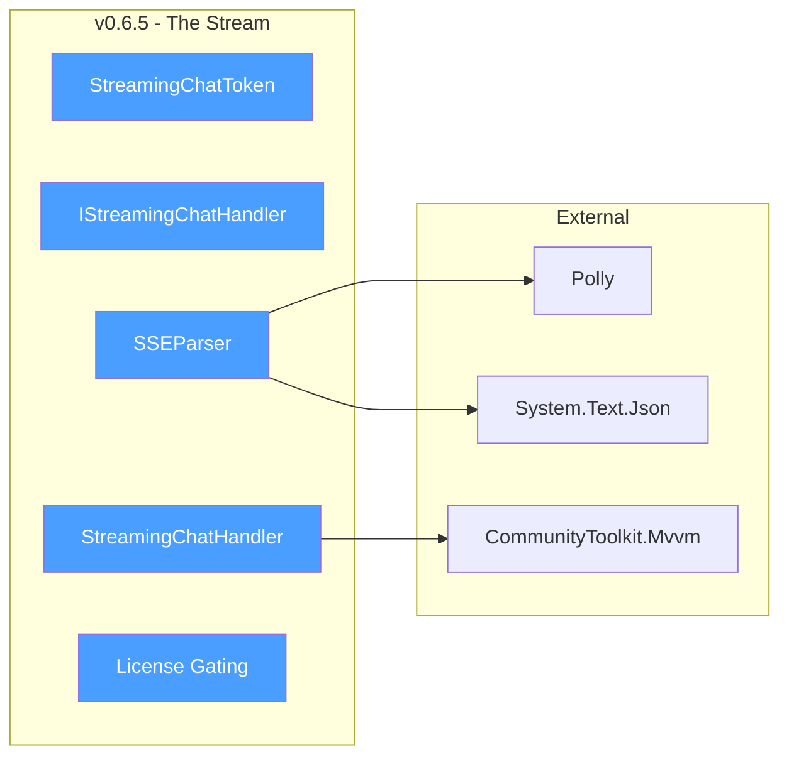
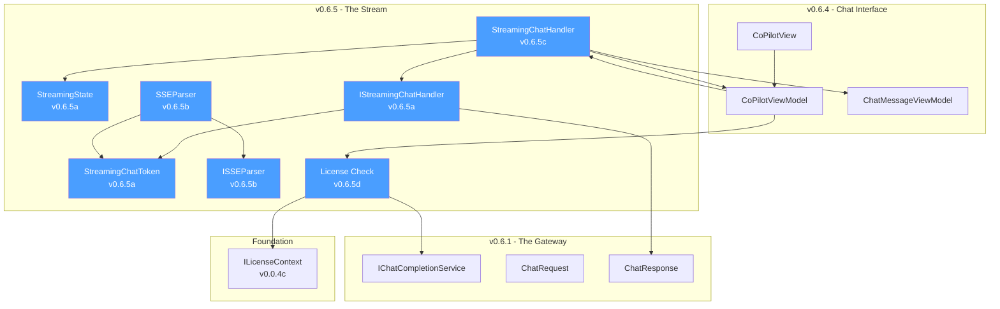
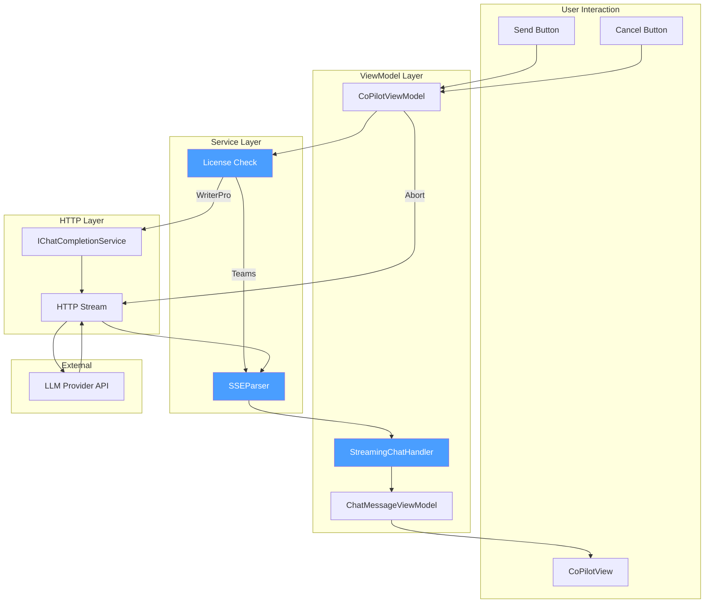
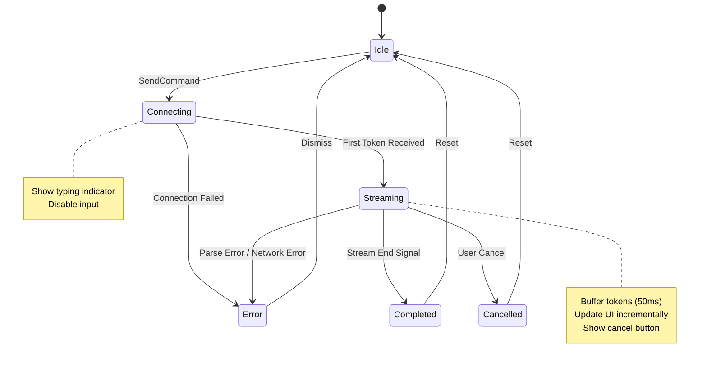
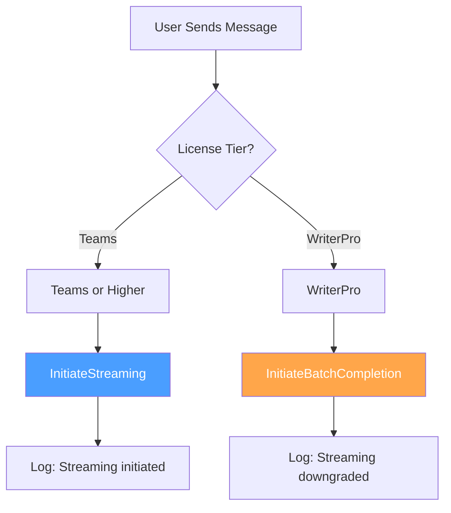
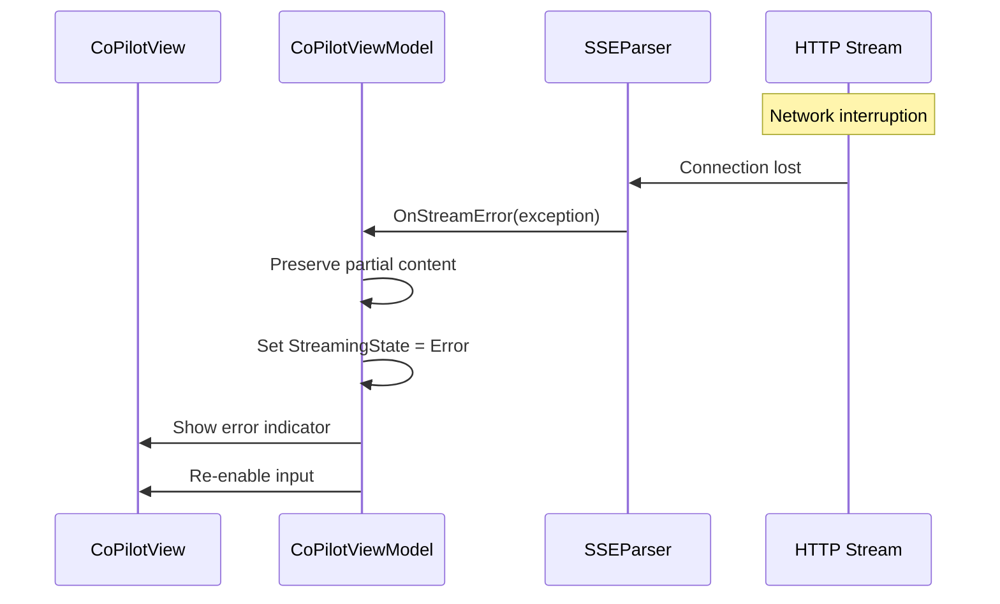

# LCS-DES-065-INDEX: Design Specification Index — The Stream

## Document Control

| Field           | Value                                     |
| :-------------- | :---------------------------------------- |
| **Document ID** | LCS-DES-065-INDEX                         |
| **Version**     | v0.6.5                                    |
| **Codename**    | The Stream (Real-time Response Rendering) |
| **Status**      | Draft                                     |
| **Module**      | Lexichord.Modules.Agents                  |
| **Created**     | 2026-01-28                                |
| **Author**      | Documentation Agent                       |
| **Parent**      | [LCS-SBD-065](LCS-SBD-065.md)             |

---

## 1. Overview

### 1.1 Goals

Transform the Co-pilot chat experience from batch request-response to fluid, real-time streaming by implementing:

1. **Streaming Token Model** — Define data structures for representing and handling streaming tokens
2. **SSE Parser** — Parse Server-Sent Events from LLM provider HTTP streams
3. **Streaming UI Handler** — Display tokens progressively with throttled updates
4. **License Gating** — Enforce Teams tier requirement with graceful WriterPro fallback

### 1.2 Module Structure

```text
Lexichord.Modules.Agents/
└── Chat/
    ├── Abstractions/
    │   ├── IStreamingChatHandler.cs      ← v0.6.5a
    │   └── ISSEParser.cs                 ← v0.6.5b
    ├── Models/
    │   ├── StreamingChatToken.cs         ← v0.6.5a
    │   └── StreamingState.cs             ← v0.6.5a
    ├── Services/
    │   ├── SSEParser.cs                  ← v0.6.5b
    │   └── StreamingChatHandler.cs       ← v0.6.5c
    ├── ViewModels/
    │   └── CoPilotViewModel.cs           ← Modified v0.6.5c, v0.6.5d
    └── Views/
        └── CoPilotView.axaml             ← Modified v0.6.5c
```

---

## 2. Sub-Part Index

| Part    | Title                 | Document                        | Status |
| :------ | :-------------------- | :------------------------------ | :----: |
| v0.6.5a | Streaming Token Model | [LCS-DES-065a](LCS-DES-065a.md) | Draft  |
| v0.6.5b | SSE Parser            | [LCS-DES-065b](LCS-DES-065b.md) | ✅ Complete |
| v0.6.5c | Streaming UI Handler  | [LCS-DES-065c](LCS-DES-065c.md) | Draft  |
| v0.6.5d | License Gating        | [LCS-DES-065d](LCS-DES-065d.md) | Draft  |

---

## 3. Dependency Graph

### 3.1 External Dependencies



### 3.2 Internal Dependencies



---

## 4. Interface Summary

### 4.1 New Interfaces

| Interface               | Sub-Part | Purpose                                      |
| :---------------------- | :------: | :------------------------------------------- |
| `IStreamingChatHandler` | v0.6.5a  | Contract for handling streaming token events |
| `ISSEParser`            | v0.6.5b  | Contract for parsing Server-Sent Events      |

### 4.2 New Records

| Record               | Sub-Part | Purpose                                    |
| :------------------- | :------: | :----------------------------------------- |
| `StreamingChatToken` | v0.6.5a  | Immutable representation of a stream token |

### 4.3 New Enums

| Enum             | Sub-Part | Purpose                                  |
| :--------------- | :------: | :--------------------------------------- |
| `StreamingState` | v0.6.5a  | Lifecycle state of a streaming operation |

### 4.4 New Services

| Service                | Sub-Part | Purpose                             |
| :--------------------- | :------: | :---------------------------------- |
| `SSEParser`            | v0.6.5b  | Parses SSE lines into tokens        |
| `StreamingChatHandler` | v0.6.5c  | Handles token events for UI updates |

---

## 5. Data Flow Overview



---

## 6. Streaming State Machine



---

## 7. UI Component Layout

### 7.1 Streaming State Visual

```text
┌──────────────────────────────────────────────────────────────────┐
│  Co-pilot                                [Provider ▼][Model ▼]  │
├──────────────────────────────────────────────────────────────────┤
│  ▶ Context (5 rules, 3 chunks)                      [Refresh]   │
├──────────────────────────────────────────────────────────────────┤
│                                                                  │
│  ┌────────────────────────────────────────────────────────────┐  │
│  │ 👤 Explain the three-act structure for my novel.           │  │
│  │                                              10:32 AM       │  │
│  └────────────────────────────────────────────────────────────┘  │
│                                                                  │
│  ┌────────────────────────────────────────────────────────────┐  │
│  │ 🤖 The three-act structure is a foundational framework     │  │
│  │    for storytelling that divides your narrative into       │  │
│  │    three distinct parts: Setup, Confrontation, and         │  │
│  │    Resolution.                                             │  │
│  │                                                            │  │
│  │    **Act I: Setup**                                        │  │
│  │    This establishes your protagonist, their world, and     │  │
│  │    the inciting incident that propels them into the█       │  │
│  │                                                            │  │
│  └────────────────────────────────────────────────────────────┘  │
│                                                                  │
├──────────────────────────────────────────────────────────────────┤
│  ┌────────────────────────────────────────────────────────────┐  │
│  │ (Input disabled during streaming)                          │  │
│  └────────────────────────────────────────────────────────────┘  │
├──────────────────────────────────────────────────────────────────┤
│  [Cancel ⏹]                               Streaming... ●●●      │
└──────────────────────────────────────────────────────────────────┘
```

### 7.2 Component Responsibility

| Component           | Responsibility                                 |
| :------------------ | :--------------------------------------------- |
| `CoPilotView`       | Container layout, state binding                |
| `Typing Indicator`  | Animated dots during connection phase          |
| `Message List`      | Virtualized display of chat messages           |
| `Streaming Message` | Incrementally updated assistant response       |
| `Cancel Button`     | Abort streaming, visible only during streaming |
| `Status Indicator`  | "Streaming..." text with animated dots         |

---

## 8. Testing Summary

### 8.1 Test Distribution

| Sub-Part  | Unit Tests | Integration | Total  |
| :-------- | :--------: | :---------: | :----: |
| v0.6.5a   |     11     |      0      |   11   |
| v0.6.5b   |     12     |      2      |   14   |
| v0.6.5c   |     10     |      2      |   12   |
| v0.6.5d   |     6      |      0      |   6    |
| **Total** |   **39**   |    **4**    | **43** |

### 8.2 Key Test Scenarios

| Scenario                             | Sub-Part | Priority |
| :----------------------------------- | :------: | :------: |
| Token record creation and validation | v0.6.5a  |   High   |
| Handler method invocations           | v0.6.5a  |   High   |
| OpenAI SSE format parsing            | v0.6.5b  | Critical |
| Anthropic SSE format parsing         | v0.6.5b  | Critical |
| Stream termination detection         | v0.6.5b  |   High   |
| Malformed SSE line handling          | v0.6.5b  |  Medium  |
| Token buffering and throttling       | v0.6.5c  |   High   |
| UI thread dispatching                | v0.6.5c  |   High   |
| Cancellation propagation             | v0.6.5c  | Critical |
| Teams tier streaming authorization   | v0.6.5d  | Critical |
| WriterPro fallback to batch          | v0.6.5d  | Critical |

---

## 9. DI Registration

### 9.1 Service Registrations

```csharp
// In AgentsModule.cs or Startup.cs
services.AddSingleton<ISSEParser, SSEParser>();

// StreamingChatHandler is created per-conversation, not registered as singleton
// CoPilotViewModel creates StreamingChatHandler internally

services.AddTransient<CoPilotViewModel>();
```

### 9.2 Registration Rationale

| Service                | Lifetime  | Rationale                              |
| :--------------------- | :-------- | :------------------------------------- |
| `ISSEParser`           | Singleton | Stateless parser, thread-safe          |
| `StreamingChatHandler` | Per-use   | Tied to specific ViewModel lifecycle   |
| `CoPilotViewModel`     | Transient | Each panel instance gets own ViewModel |

---

## 10. License Gating

### 10.1 Feature Matrix

| Feature               | WriterPro | Teams | Implementation                   |
| :-------------------- | :-------: | :---: | :------------------------------- |
| Chat Interface Access |     ✓     |   ✓   | Existing v0.6.4 check            |
| Batch Completion      |     ✓     |   ✓   | `CompleteAsync` method           |
| Streaming Completion  |     ✗     |   ✓   | `StreamAsync` method             |
| Cancel Generation     |     ✗     |   ✓   | Cancel button visibility binding |

### 10.2 Fallback Decision Flow



---

## 11. Error Handling

### 11.1 Error Categories

| Category           | Handling Strategy                          | User Message                               |
| :----------------- | :----------------------------------------- | :----------------------------------------- |
| Connection Failed  | Retry with Polly, then fail gracefully     | "Unable to connect. Please try again."     |
| Parse Error        | Log warning, skip malformed line, continue | (Silent - streaming continues)             |
| Stream Interrupted | Preserve partial response, show error      | "Connection lost. Partial response saved." |
| Rate Limited       | Show rate limit message, suggest wait      | "Rate limited. Please wait 30 seconds."    |
| Provider Error     | Parse error response, display message      | Provider-specific error message            |

### 11.2 Error Recovery



---

## 12. Performance Considerations

### 12.1 Optimization Strategies

| Strategy              | Implementation                         | Expected Impact             |
| :-------------------- | :------------------------------------- | :-------------------------- |
| Token Batching        | 50ms timer, aggregate tokens in buffer | 95% reduction in UI updates |
| StringBuilder Buffer  | Avoid string concatenation per token   | O(1) append operations      |
| Virtualized Scrolling | Only render visible messages           | Constant memory usage       |
| Async Dispatching     | `Dispatcher.UIThread.InvokeAsync`      | No UI thread blocking       |
| CancellationToken     | Propagate throughout call chain        | Fast abort on cancel        |

### 12.2 Memory Management

| Component       | Strategy                               | Target               |
| :-------------- | :------------------------------------- | :------------------- |
| Token Buffer    | Clear after UI update                  | < 1KB per batch      |
| Stream Reader   | Dispose after stream ends              | Released immediately |
| Message Content | StringBuilder, convert at end          | Single allocation    |
| Event Handlers  | Weak references for View subscriptions | No memory leaks      |

---

## 13. Related Documents

| Document                                            | Relationship                      |
| :-------------------------------------------------- | :-------------------------------- |
| [LCS-SBD-065](LCS-SBD-065.md)                       | Parent scope document             |
| [LCS-DES-064-INDEX](../v0.6.4/LCS-DES-064-INDEX.md) | Previous version (Chat Interface) |
| [LCS-DES-061-INDEX](../v0.6.1/LCS-DES-061-INDEX.md) | Gateway abstractions dependency   |
| [roadmap-v0.6.x](../roadmap-v0.6.x.md)              | Feature roadmap source            |
| [DEPENDENCY-MATRIX](../../DEPENDENCY-MATRIX.md)     | Cross-version dependencies        |

---

## 14. Quick Reference

### 14.1 Key Types

```csharp
// v0.6.5a: Token Model
public record StreamingChatToken(string Text, int Index, bool IsComplete, string? FinishReason);
public enum StreamingState { Idle, Connecting, Streaming, Completed, Cancelled, Error }
public interface IStreamingChatHandler { ... }

// v0.6.5b: SSE Parser
public interface ISSEParser
{
    IAsyncEnumerable<StreamingChatToken> ParseSSEStreamAsync(
        Stream responseStream, string provider, CancellationToken ct);
}

// v0.6.5c: UI Handler
public class StreamingChatHandler : IStreamingChatHandler { ... }

// v0.6.5d: License Check
if (licenseContext.Tier < LicenseTier.Teams && request.Stream)
{
    logger.LogInformation("Streaming downgraded to batch for {Tier}", licenseContext.Tier);
    return await CompleteAsync(request, ct);
}
```

### 14.2 Configuration

| Setting                         | Default | Description                         |
| :------------------------------ | :------ | :---------------------------------- |
| `Streaming:BatchIntervalMs`     | 50      | Token batch interval for UI updates |
| `Streaming:ConnectionTimeoutMs` | 5000    | Timeout for initial connection      |
| `Streaming:MaxTokensPerBatch`   | 20      | Maximum tokens before forced flush  |

---

## 15. Changelog

| Version | Date       | Author              | Changes       |
| :------ | :--------- | :------------------ | :------------ |
| 0.1     | 2026-01-28 | Documentation Agent | Initial draft |
