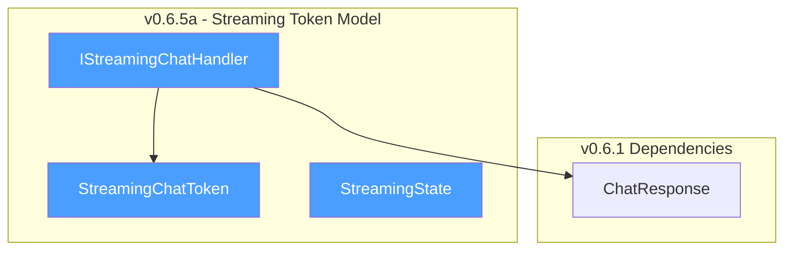
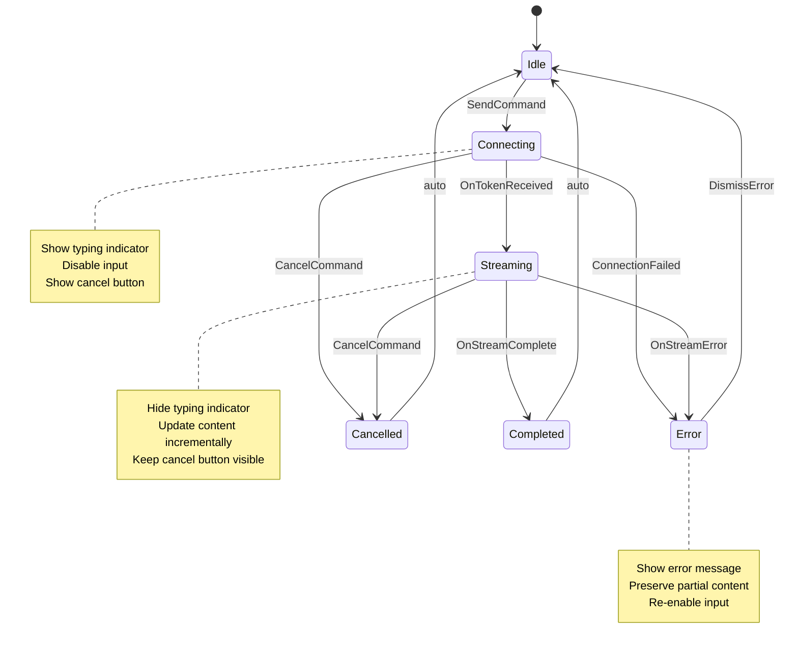
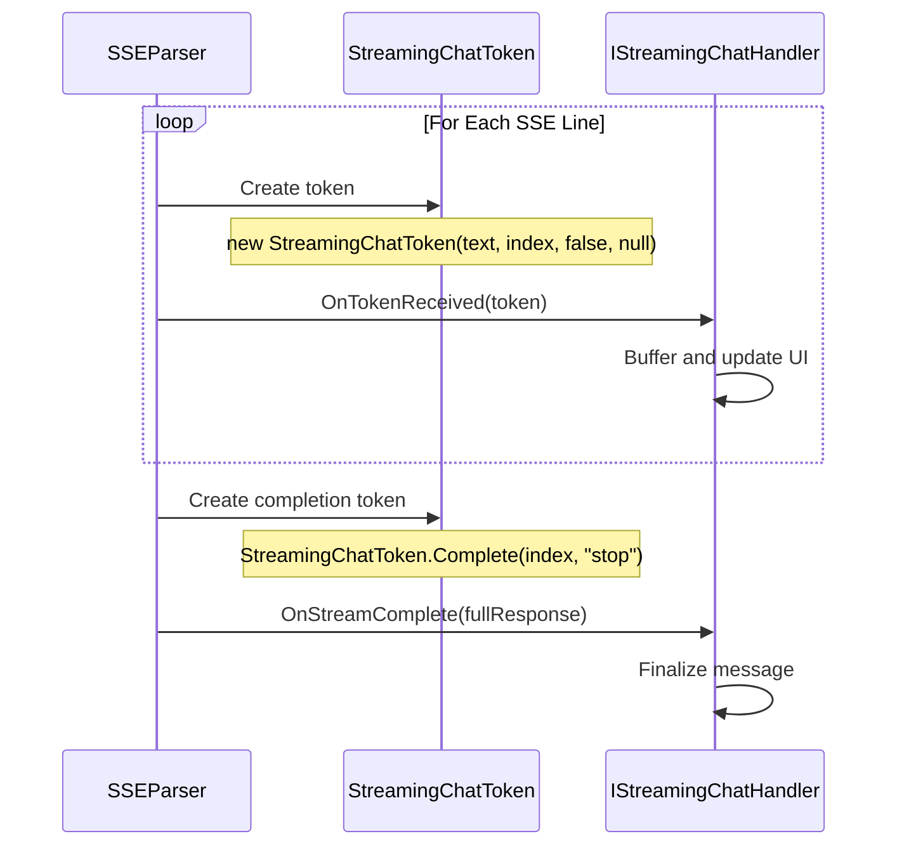

# LCS-DES-065a: Design Specification — Streaming Token Model

## 1. Metadata & Categorization

| Field           | Value                                     |
| :-------------- | :---------------------------------------- |
| **Document ID** | LCS-DES-065a                              |
| **Version**     | v0.6.5a                                   |
| **Status**      | Draft                                     |
| **Category**    | Data Model                                |
| **Module**      | Lexichord.Modules.Agents                  |
| **Created**     | 2026-01-28                                |
| **Author**      | Documentation Agent                       |
| **Parent**      | [LCS-DES-065-INDEX](LCS-DES-065-INDEX.md) |

---

## 2. Executive Summary

### 2.1 The Requirement

Real-time streaming responses require a standardized data model for representing individual tokens as they arrive from LLM providers. Without a well-defined token model, the streaming infrastructure would lack type safety, consistent handling, and clear contracts between components.

### 2.2 The Proposed Solution

Define a comprehensive streaming token model consisting of:

1. **`StreamingChatToken`** — Immutable record representing a single token with metadata
2. **`IStreamingChatHandler`** — Interface contract for consuming streaming events
3. **`StreamingState`** — Enumeration tracking the lifecycle of a streaming operation

These primitives provide the foundation for all streaming operations in v0.6.5 and future versions.

---

## 3. Architecture & Modular Strategy

### 3.1 Component Placement

```text
Lexichord.Modules.Agents/
└── Chat/
    ├── Abstractions/
    │   └── IStreamingChatHandler.cs
    └── Models/
        ├── StreamingChatToken.cs
        └── StreamingState.cs
```

### 3.2 Dependency Graph



### 3.3 Licensing Behavior

The streaming token model has no direct license gating. It provides the data structures used by both streaming (Teams) and batch (WriterPro) code paths. The license check occurs at the orchestration layer (v0.6.5d).

---

## 4. Data Contract (The API)

### 4.1 StreamingChatToken Record

```csharp
namespace Lexichord.Modules.Agents.Chat.Models;

/// <summary>
/// Represents a single token received during streaming LLM responses.
/// </summary>
/// <remarks>
/// <para>
/// This record is used throughout the streaming infrastructure to represent
/// individual chunks of text as they arrive from the LLM provider. Each token
/// carries metadata about its position in the stream and completion status.
/// </para>
/// <para>
/// The record is immutable by design, ensuring thread-safety when tokens are
/// passed between the SSE parser and UI handler components.
/// </para>
/// </remarks>
/// <param name="Text">
/// The text content of this token. May be a single character, word, or phrase
/// depending on the LLM provider's tokenization. Can be empty for control tokens.
/// </param>
/// <param name="Index">
/// Zero-based index of this token in the current stream. Used for ordering
/// and debugging purposes. Monotonically increasing within a stream.
/// </param>
/// <param name="IsComplete">
/// True if this is the final token in the stream, indicating the LLM has
/// finished generating the response. The <see cref="Text"/> field may be
/// empty when this is true.
/// </param>
/// <param name="FinishReason">
/// Optional reason for stream completion. Common values include:
/// <list type="bullet">
///   <item><c>"stop"</c> — Normal completion, model finished naturally</item>
///   <item><c>"length"</c> — Token limit reached</item>
///   <item><c>"content_filter"</c> — Content filtered by provider</item>
///   <item><c>"function_call"</c> — Model invoked a function (future)</item>
///   <item><c>null</c> — Streaming in progress, not yet complete</item>
/// </list>
/// </param>
/// <example>
/// <code>
/// // Example token during streaming
/// var token1 = new StreamingChatToken("Hello", 0, false, null);
///
/// // Example final token
/// var finalToken = new StreamingChatToken("", 42, true, "stop");
///
/// // Example token with content and completion
/// var lastContent = new StreamingChatToken("!", 41, false, null);
/// </code>
/// </example>
public record StreamingChatToken(
    string Text,
    int Index,
    bool IsComplete,
    string? FinishReason
)
{
    /// <summary>
    /// Creates a content token at the specified index.
    /// </summary>
    /// <param name="text">The token text content.</param>
    /// <param name="index">The token index in the stream.</param>
    /// <returns>A new <see cref="StreamingChatToken"/> for content.</returns>
    public static StreamingChatToken Content(string text, int index) =>
        new(text, index, false, null);

    /// <summary>
    /// Creates a completion token with the specified finish reason.
    /// </summary>
    /// <param name="index">The final token index.</param>
    /// <param name="finishReason">The reason for stream completion.</param>
    /// <returns>A new <see cref="StreamingChatToken"/> marking stream end.</returns>
    public static StreamingChatToken Complete(int index, string finishReason = "stop") =>
        new(string.Empty, index, true, finishReason);

    /// <summary>
    /// Indicates whether this token contains displayable text content.
    /// </summary>
    public bool HasContent => !string.IsNullOrEmpty(Text);
}
```

### 4.2 IStreamingChatHandler Interface

```csharp
namespace Lexichord.Modules.Agents.Chat.Abstractions;

/// <summary>
/// Contract for handling streaming chat token events.
/// </summary>
/// <remarks>
/// <para>
/// This interface defines the callback methods invoked during streaming
/// LLM responses. Implementations typically update the UI progressively
/// as tokens arrive, handle errors gracefully, and finalize the message
/// when the stream completes.
/// </para>
/// <para>
/// Implementations should be prepared to receive tokens rapidly (potentially
/// hundreds per second) and should implement appropriate throttling or
/// buffering strategies to maintain UI responsiveness.
/// </para>
/// <para>
/// All methods are asynchronous to allow implementations to perform
/// async operations (e.g., UI thread dispatching) without blocking the
/// SSE parser thread.
/// </para>
/// </remarks>
/// <example>
/// <code>
/// public class StreamingChatHandler : IStreamingChatHandler
/// {
///     private readonly StringBuilder _buffer = new();
///
///     public async Task OnTokenReceived(StreamingChatToken token)
///     {
///         _buffer.Append(token.Text);
///         await UpdateUIAsync(_buffer.ToString());
///     }
///
///     public async Task OnStreamComplete(ChatResponse fullResponse)
///     {
///         await FinalizeMessageAsync(fullResponse);
///     }
///
///     public async Task OnStreamError(Exception error)
///     {
///         await ShowErrorAsync(error.Message);
///     }
/// }
/// </code>
/// </example>
public interface IStreamingChatHandler
{
    /// <summary>
    /// Called when a new token is received from the stream.
    /// </summary>
    /// <remarks>
    /// <para>
    /// This method is invoked for each token parsed from the SSE stream.
    /// Implementations should append the token's text to the message being
    /// built and optionally update the UI (with appropriate throttling).
    /// </para>
    /// <para>
    /// The method may be called very frequently. Implementations should
    /// avoid blocking operations and consider batching UI updates.
    /// </para>
    /// </remarks>
    /// <param name="token">The received token.</param>
    /// <returns>A task representing the asynchronous operation.</returns>
    Task OnTokenReceived(StreamingChatToken token);

    /// <summary>
    /// Called when the stream completes successfully.
    /// </summary>
    /// <remarks>
    /// <para>
    /// This method is invoked once when the stream ends normally. The
    /// <paramref name="fullResponse"/> contains the complete assembled
    /// response, including any metadata provided by the LLM.
    /// </para>
    /// <para>
    /// Implementations should finalize the message display, update
    /// conversation state, and perform any necessary cleanup.
    /// </para>
    /// </remarks>
    /// <param name="fullResponse">The complete response with metadata.</param>
    /// <returns>A task representing the asynchronous operation.</returns>
    Task OnStreamComplete(ChatResponse fullResponse);

    /// <summary>
    /// Called when an error occurs during streaming.
    /// </summary>
    /// <remarks>
    /// <para>
    /// This method is invoked when the stream fails due to network errors,
    /// parse errors, or provider errors. Implementations should display
    /// an appropriate error message and preserve any partial content.
    /// </para>
    /// <para>
    /// After this method is called, no further callbacks will be invoked
    /// for this stream. The handler should reset its state for potential
    /// retry attempts.
    /// </para>
    /// </remarks>
    /// <param name="error">The exception that occurred.</param>
    /// <returns>A task representing the asynchronous operation.</returns>
    Task OnStreamError(Exception error);
}
```

### 4.3 StreamingState Enum

```csharp
namespace Lexichord.Modules.Agents.Chat.Models;

/// <summary>
/// Represents the lifecycle state of a streaming operation.
/// </summary>
/// <remarks>
/// <para>
/// This enumeration tracks the current phase of a streaming LLM request,
/// from initial connection through completion or cancellation. The state
/// is used to:
/// </para>
/// <list type="bullet">
///   <item>Control UI element visibility (typing indicator, cancel button)</item>
///   <item>Enable/disable user input</item>
///   <item>Manage resource cleanup</item>
///   <item>Track operation telemetry</item>
/// </list>
/// <para>
/// State transitions are unidirectional: Idle → Connecting → Streaming →
/// (Completed|Cancelled|Error) → Idle.
/// </para>
/// </remarks>
public enum StreamingState
{
    /// <summary>
    /// No streaming operation in progress.
    /// </summary>
    /// <remarks>
    /// The default state. User input is enabled, and the send button
    /// is available. This is the initial state and the state returned
    /// to after any stream ends.
    /// </remarks>
    Idle = 0,

    /// <summary>
    /// Establishing connection to the LLM provider.
    /// </summary>
    /// <remarks>
    /// The request has been sent, but no tokens have been received yet.
    /// The typing indicator should be displayed during this phase.
    /// Typical duration: 100ms - 2000ms depending on provider and model.
    /// </remarks>
    Connecting = 1,

    /// <summary>
    /// Actively receiving tokens from the stream.
    /// </summary>
    /// <remarks>
    /// At least one token has been received, and more are expected.
    /// The cancel button should be visible, and the UI should be
    /// updating with new content. The typing indicator is hidden.
    /// </remarks>
    Streaming = 2,

    /// <summary>
    /// Stream completed successfully.
    /// </summary>
    /// <remarks>
    /// The stream end signal was received ([DONE] or equivalent).
    /// The complete message is now displayed. This is a transient
    /// state that immediately transitions to Idle.
    /// </remarks>
    Completed = 3,

    /// <summary>
    /// Stream was cancelled by the user.
    /// </summary>
    /// <remarks>
    /// The user clicked the cancel button or navigated away. Partial
    /// content is preserved. This is a transient state that
    /// immediately transitions to Idle.
    /// </remarks>
    Cancelled = 4,

    /// <summary>
    /// Stream failed due to an error.
    /// </summary>
    /// <remarks>
    /// A network error, parse error, or provider error occurred.
    /// An error message is displayed. Partial content may be
    /// preserved if available. This state may require user
    /// acknowledgment before transitioning to Idle.
    /// </remarks>
    Error = 5
}
```

### 4.4 StreamingState Extensions

```csharp
namespace Lexichord.Modules.Agents.Chat.Models;

/// <summary>
/// Extension methods for <see cref="StreamingState"/>.
/// </summary>
public static class StreamingStateExtensions
{
    /// <summary>
    /// Indicates whether the state represents an active streaming operation.
    /// </summary>
    /// <param name="state">The streaming state.</param>
    /// <returns>True if streaming is in progress (Connecting or Streaming).</returns>
    public static bool IsActive(this StreamingState state) =>
        state is StreamingState.Connecting or StreamingState.Streaming;

    /// <summary>
    /// Indicates whether the state represents a terminal (final) state.
    /// </summary>
    /// <param name="state">The streaming state.</param>
    /// <returns>True if the operation has ended (Completed, Cancelled, or Error).</returns>
    public static bool IsTerminal(this StreamingState state) =>
        state is StreamingState.Completed or StreamingState.Cancelled or StreamingState.Error;

    /// <summary>
    /// Indicates whether the cancel button should be visible.
    /// </summary>
    /// <param name="state">The streaming state.</param>
    /// <returns>True if cancel is available (Connecting or Streaming).</returns>
    public static bool CanCancel(this StreamingState state) =>
        state.IsActive();

    /// <summary>
    /// Indicates whether the typing indicator should be shown.
    /// </summary>
    /// <param name="state">The streaming state.</param>
    /// <returns>True if typing indicator should be visible (Connecting only).</returns>
    public static bool ShowTypingIndicator(this StreamingState state) =>
        state == StreamingState.Connecting;

    /// <summary>
    /// Indicates whether user input should be enabled.
    /// </summary>
    /// <param name="state">The streaming state.</param>
    /// <returns>True if input is allowed (Idle or Error).</returns>
    public static bool InputEnabled(this StreamingState state) =>
        state is StreamingState.Idle or StreamingState.Error;
}
```

---

## 5. Implementation Logic

### 5.1 State Transition Diagram



### 5.2 Token Flow Sequence



### 5.3 Token Creation Patterns

```csharp
// Pattern 1: Content token from SSE data
var contentToken = new StreamingChatToken(
    Text: parsedContent,
    Index: currentIndex++,
    IsComplete: false,
    FinishReason: null);

// Pattern 2: Using factory method for content
var contentToken2 = StreamingChatToken.Content("Hello", 0);

// Pattern 3: Completion token with reason
var completionToken = StreamingChatToken.Complete(
    index: currentIndex,
    finishReason: "stop");

// Pattern 4: Length-limited completion
var lengthLimited = new StreamingChatToken(
    Text: string.Empty,
    Index: currentIndex,
    IsComplete: true,
    FinishReason: "length");

// Pattern 5: Error-filtered content
var filtered = new StreamingChatToken(
    Text: string.Empty,
    Index: currentIndex,
    IsComplete: true,
    FinishReason: "content_filter");
```

---

## 6. Data Persistence

This sub-part does not introduce new persistence requirements. The streaming token model operates entirely in memory. Conversation persistence is handled by `IConversationManager` (v0.6.4c), which will store the final assembled content after streaming completes.

---

## 7. UI/UX Specifications

### 7.1 State-Based UI Mapping

| StreamingState | Input Enabled | Typing Indicator | Cancel Button | Status Message  |
| :------------- | :-----------: | :--------------: | :-----------: | :-------------- |
| Idle           |       ✓       |      Hidden      |    Hidden     | (none)          |
| Connecting     |       ✗       |     Visible      |    Visible    | "Connecting..." |
| Streaming      |       ✗       |      Hidden      |    Visible    | "Streaming..."  |
| Completed      |       ✓       |      Hidden      |    Hidden     | "Completed"     |
| Cancelled      |       ✓       |      Hidden      |    Hidden     | "Cancelled"     |
| Error          |       ✓       |      Hidden      |    Hidden     | Error message   |

### 7.2 Visual Indicator Designs

```text
Typing Indicator (Connecting state):
   🤖 ●●●

   Animation: Dots fade in/out sequentially (300ms per dot)

Streaming Indicator (Streaming state):
   Streaming... ●●●

   Animation: Dots pulse continuously

Cancel Button:
   [Cancel ⏹]

   Appears to the left of status during Connecting/Streaming
```

---

## 8. Observability & Logging

### 8.1 Log Events

| Event                 | Level       | Template                                                    |
| :-------------------- | :---------- | :---------------------------------------------------------- |
| State transition      | Debug       | `StreamingState changed: {PreviousState} → {NewState}`      |
| Token received        | Trace       | `Token {Index} received: {Length} chars`                    |
| Stream completed      | Information | `Stream completed: {TokenCount} tokens, {TotalChars} chars` |
| Handler method called | Trace       | `{MethodName} invoked for token {Index}`                    |

### 8.2 Telemetry

| Metric                    | Type    | Description                              |
| :------------------------ | :------ | :--------------------------------------- |
| `streaming_tokens_total`  | Counter | Total tokens received across all streams |
| `streaming_state_changes` | Counter | State transitions by from/to state       |

---

## 9. Security & Safety

### 9.1 Thread Safety

The `StreamingChatToken` record is immutable, ensuring thread-safe access from multiple components. No synchronization is required when passing tokens between threads.

### 9.2 Input Validation

| Field          | Validation                               |
| :------------- | :--------------------------------------- |
| `Text`         | Null checked; empty string allowed       |
| `Index`        | Non-negative; monotonically increasing   |
| `IsComplete`   | Boolean, no validation needed            |
| `FinishReason` | Known values preferred, unknown accepted |

---

## 10. Acceptance Criteria

### AC-065a-01: Token Record Functionality

- [ ] `StreamingChatToken` correctly represents all token properties
- [ ] `StreamingChatToken.Content()` factory creates valid content tokens
- [ ] `StreamingChatToken.Complete()` factory creates valid completion tokens
- [ ] `HasContent` property returns correct value for empty/non-empty text

### AC-065a-02: Handler Interface Contract

- [ ] `IStreamingChatHandler` defines `OnTokenReceived` method
- [ ] `IStreamingChatHandler` defines `OnStreamComplete` method
- [ ] `IStreamingChatHandler` defines `OnStreamError` method
- [ ] All methods are async (return `Task`)

### AC-065a-03: State Enumeration

- [ ] `StreamingState` includes all required states (Idle through Error)
- [ ] Extension methods correctly identify active states
- [ ] Extension methods correctly identify terminal states
- [ ] UI helper methods (`CanCancel`, `ShowTypingIndicator`, `InputEnabled`) work correctly

---

## 11. Unit Tests

```csharp
namespace Lexichord.Modules.Agents.Tests.Chat.Models;

public class StreamingChatTokenTests
{
    [Fact]
    [Trait("SubPart", "v0.6.5a")]
    public void Constructor_ValidParameters_CreatesToken()
    {
        // Arrange & Act
        var token = new StreamingChatToken("Hello", 0, false, null);

        // Assert
        token.Text.Should().Be("Hello");
        token.Index.Should().Be(0);
        token.IsComplete.Should().BeFalse();
        token.FinishReason.Should().BeNull();
    }

    [Fact]
    [Trait("SubPart", "v0.6.5a")]
    public void Content_FactoryMethod_CreatesContentToken()
    {
        // Act
        var token = StreamingChatToken.Content("World", 5);

        // Assert
        token.Text.Should().Be("World");
        token.Index.Should().Be(5);
        token.IsComplete.Should().BeFalse();
        token.FinishReason.Should().BeNull();
    }

    [Fact]
    [Trait("SubPart", "v0.6.5a")]
    public void Complete_FactoryMethod_CreatesCompletionToken()
    {
        // Act
        var token = StreamingChatToken.Complete(42, "length");

        // Assert
        token.Text.Should().BeEmpty();
        token.Index.Should().Be(42);
        token.IsComplete.Should().BeTrue();
        token.FinishReason.Should().Be("length");
    }

    [Theory]
    [Trait("SubPart", "v0.6.5a")]
    [InlineData("Hello", true)]
    [InlineData("", false)]
    [InlineData(null, false)]
    public void HasContent_ReturnsCorrectValue(string? text, bool expected)
    {
        // Arrange
        var token = new StreamingChatToken(text ?? "", 0, false, null);

        // Act & Assert
        token.HasContent.Should().Be(expected);
    }

    [Fact]
    [Trait("SubPart", "v0.6.5a")]
    public void Record_Equality_WorksCorrectly()
    {
        // Arrange
        var token1 = new StreamingChatToken("Hi", 1, false, null);
        var token2 = new StreamingChatToken("Hi", 1, false, null);
        var token3 = new StreamingChatToken("Hi", 2, false, null);

        // Assert
        token1.Should().Be(token2);
        token1.Should().NotBe(token3);
    }
}

public class StreamingStateTests
{
    [Theory]
    [Trait("SubPart", "v0.6.5a")]
    [InlineData(StreamingState.Idle, false)]
    [InlineData(StreamingState.Connecting, true)]
    [InlineData(StreamingState.Streaming, true)]
    [InlineData(StreamingState.Completed, false)]
    [InlineData(StreamingState.Cancelled, false)]
    [InlineData(StreamingState.Error, false)]
    public void IsActive_ReturnsCorrectValue(StreamingState state, bool expected)
    {
        state.IsActive().Should().Be(expected);
    }

    [Theory]
    [Trait("SubPart", "v0.6.5a")]
    [InlineData(StreamingState.Idle, false)]
    [InlineData(StreamingState.Connecting, false)]
    [InlineData(StreamingState.Streaming, false)]
    [InlineData(StreamingState.Completed, true)]
    [InlineData(StreamingState.Cancelled, true)]
    [InlineData(StreamingState.Error, true)]
    public void IsTerminal_ReturnsCorrectValue(StreamingState state, bool expected)
    {
        state.IsTerminal().Should().Be(expected);
    }

    [Theory]
    [Trait("SubPart", "v0.6.5a")]
    [InlineData(StreamingState.Idle, true)]
    [InlineData(StreamingState.Connecting, false)]
    [InlineData(StreamingState.Streaming, false)]
    [InlineData(StreamingState.Completed, true)]
    [InlineData(StreamingState.Cancelled, true)]
    [InlineData(StreamingState.Error, true)]
    public void InputEnabled_ReturnsCorrectValue(StreamingState state, bool expected)
    {
        state.InputEnabled().Should().Be(expected);
    }

    [Theory]
    [Trait("SubPart", "v0.6.5a")]
    [InlineData(StreamingState.Connecting, true)]
    [InlineData(StreamingState.Streaming, false)]
    [InlineData(StreamingState.Idle, false)]
    public void ShowTypingIndicator_ReturnsCorrectValue(StreamingState state, bool expected)
    {
        state.ShowTypingIndicator().Should().Be(expected);
    }
}
```

---

## 12. Changelog

| Version | Date       | Author              | Changes       |
| :------ | :--------- | :------------------ | :------------ |
| 0.1     | 2026-01-28 | Documentation Agent | Initial draft |
