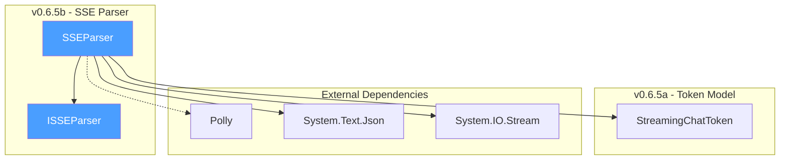
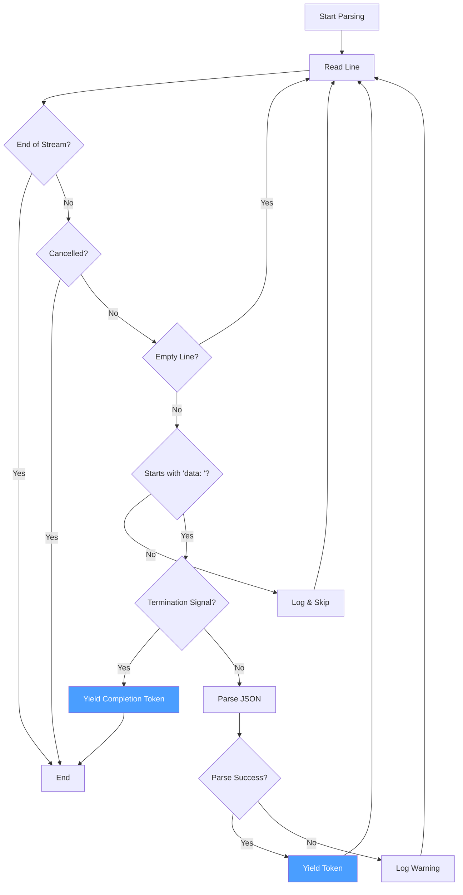
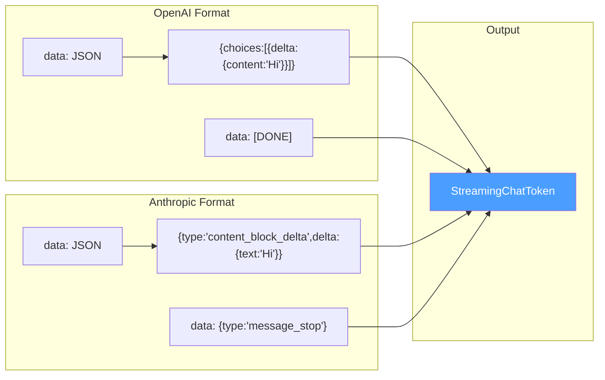

# LCS-DES-065b: Design Specification — SSE Parser

## 1. Metadata & Categorization

| Field           | Value                                     |
| :-------------- | :---------------------------------------- |
| **Document ID** | LCS-DES-065b                              |
| **Version**     | v0.6.5b                                   |
| **Status**      | Draft                                     |
| **Category**    | Service                                   |
| **Module**      | Lexichord.Modules.Agents                  |
| **Created**     | 2026-01-28                                |
| **Author**      | Documentation Agent                       |
| **Parent**      | [LCS-DES-065-INDEX](LCS-DES-065-INDEX.md) |

---

## 2. Executive Summary

### 2.1 The Requirement

LLM providers deliver streaming responses using Server-Sent Events (SSE), a standard for pushing server updates to clients over HTTP. Each provider uses a slightly different JSON format within the SSE `data:` lines, requiring a parser that can handle multiple formats while maintaining robustness against malformed data.

### 2.2 The Proposed Solution

Implement an `SSEParser` service that:

1. **Reads SSE streams** — Processes `data:` lines from HTTP response streams
2. **Handles multiple formats** — Supports OpenAI and Anthropic streaming JSON structures
3. **Detects stream termination** — Recognizes `[DONE]` and `message_stop` signals
4. **Yields tokens asynchronously** — Uses `IAsyncEnumerable` for efficient streaming
5. **Integrates with Polly** — Leverages existing retry infrastructure for resilience

---

## 3. Architecture & Modular Strategy

### 3.1 Component Placement

```text
Lexichord.Modules.Agents/
└── Chat/
    ├── Abstractions/
    │   └── ISSEParser.cs
    └── Services/
        └── SSEParser.cs
```

### 3.2 Dependency Graph



### 3.3 Licensing Behavior

The SSE Parser has no direct license gating. It is a technical service used by both streaming and potentially diagnostic flows. License enforcement occurs at the orchestration layer (v0.6.5d).

---

## 4. Data Contract (The API)

### 4.1 ISSEParser Interface

```csharp
namespace Lexichord.Modules.Agents.Chat.Abstractions;

/// <summary>
/// Contract for parsing Server-Sent Events (SSE) streams from LLM providers.
/// </summary>
/// <remarks>
/// <para>
/// Server-Sent Events is a standard for server-to-client streaming over HTTP.
/// LLM providers use SSE to deliver tokens as they are generated. This interface
/// abstracts the parsing logic, allowing different implementations for testing
/// or alternative providers.
/// </para>
/// <para>
/// SSE Format Reference:
/// <code>
/// data: {"content":"Hello"}
/// data: {"content":" World"}
/// data: [DONE]
/// </code>
/// </para>
/// </remarks>
public interface ISSEParser
{
    /// <summary>
    /// Parses an SSE stream and yields tokens asynchronously.
    /// </summary>
    /// <remarks>
    /// <para>
    /// This method reads lines from the response stream, identifies SSE data lines
    /// (those starting with "data: "), parses the JSON payload according to the
    /// specified provider format, and yields <see cref="StreamingChatToken"/> instances.
    /// </para>
    /// <para>
    /// The method will continue reading until:
    /// <list type="bullet">
    ///   <item>The stream ends (EOF)</item>
    ///   <item>A termination signal is received ([DONE] or message_stop)</item>
    ///   <item>The cancellation token is triggered</item>
    /// </list>
    /// </para>
    /// <para>
    /// Malformed lines are logged and skipped; they do not terminate the stream.
    /// </para>
    /// </remarks>
    /// <param name="responseStream">The HTTP response stream to parse.</param>
    /// <param name="provider">
    /// The LLM provider identifier (e.g., "OpenAI", "Anthropic") used to
    /// determine the JSON parsing strategy.
    /// </param>
    /// <param name="ct">Cancellation token for aborting the parse operation.</param>
    /// <returns>An async enumerable of parsed tokens.</returns>
    /// <exception cref="ArgumentNullException">
    /// Thrown if <paramref name="responseStream"/> is null.
    /// </exception>
    /// <exception cref="NotSupportedException">
    /// Thrown if <paramref name="provider"/> is not recognized.
    /// </exception>
    IAsyncEnumerable<StreamingChatToken> ParseSSEStreamAsync(
        Stream responseStream,
        string provider,
        CancellationToken ct = default);
}
```

### 4.2 SSEParser Implementation

```csharp
namespace Lexichord.Modules.Agents.Chat.Services;

/// <summary>
/// Parser for Server-Sent Events (SSE) streams from LLM providers.
/// </summary>
/// <remarks>
/// <para>
/// This implementation supports multiple LLM providers, each with their own
/// JSON format for streaming responses:
/// </para>
/// <list type="table">
///   <listheader>
///     <term>Provider</term>
///     <description>Format</description>
///   </listheader>
///   <item>
///     <term>OpenAI</term>
///     <description>{"choices":[{"delta":{"content":"token"}}]}</description>
///   </item>
///   <item>
///     <term>Anthropic</term>
///     <description>{"type":"content_block_delta","delta":{"text":"token"}}</description>
///   </item>
/// </list>
/// <para>
/// The parser is designed for high throughput with minimal memory allocation.
/// Line parsing uses ReadOnlySpan where possible, and JSON parsing uses
/// Utf8JsonReader for efficiency.
/// </para>
/// </remarks>
public sealed class SSEParser : ISSEParser
{
    private readonly ILogger<SSEParser> _logger;

    /// <summary>
    /// SSE data line prefix.
    /// </summary>
    private const string DataPrefix = "data: ";

    /// <summary>
    /// OpenAI stream termination signal.
    /// </summary>
    private const string OpenAIDoneSignal = "[DONE]";

    /// <summary>
    /// Anthropic message stop event type.
    /// </summary>
    private const string AnthropicMessageStop = "message_stop";

    /// <summary>
    /// Initializes a new instance of <see cref="SSEParser"/>.
    /// </summary>
    /// <param name="logger">Logger for diagnostic output.</param>
    public SSEParser(ILogger<SSEParser> logger)
    {
        _logger = logger ?? throw new ArgumentNullException(nameof(logger));
    }

    /// <inheritdoc />
    public async IAsyncEnumerable<StreamingChatToken> ParseSSEStreamAsync(
        Stream responseStream,
        string provider,
        [EnumeratorCancellation] CancellationToken ct = default)
    {
        ArgumentNullException.ThrowIfNull(responseStream);

        if (!IsSupportedProvider(provider))
        {
            _logger.LogError("Unsupported provider: {Provider}", provider);
            throw new NotSupportedException($"Provider '{provider}' is not supported.");
        }

        _logger.LogDebug("Starting SSE parse for provider: {Provider}", provider);

        using var reader = new StreamReader(responseStream, Encoding.UTF8, leaveOpen: false);
        var index = 0;
        var startTime = Stopwatch.GetTimestamp();

        while (!reader.EndOfStream && !ct.IsCancellationRequested)
        {
            string? line;
            try
            {
                line = await reader.ReadLineAsync(ct);
            }
            catch (OperationCanceledException)
            {
                _logger.LogDebug("SSE parse cancelled at token {Index}", index);
                yield break;
            }

            // Skip empty lines (SSE uses blank lines as event separators)
            if (string.IsNullOrWhiteSpace(line))
            {
                continue;
            }

            // Skip non-data lines (event:, id:, retry:, comments)
            if (!line.StartsWith(DataPrefix, StringComparison.Ordinal))
            {
                _logger.LogTrace("Skipping non-data SSE line: {Line}", line);
                continue;
            }

            var json = line.AsSpan()[DataPrefix.Length..];

            // Check for stream termination
            if (IsStreamTermination(json, provider))
            {
                _logger.LogDebug("Stream termination signal received at token {Index}", index);
                yield return StreamingChatToken.Complete(index, "stop");
                yield break;
            }

            // Parse the JSON payload
            var token = ParseToken(json.ToString(), provider, index);
            if (token is not null)
            {
                index++;
                yield return token;
            }
        }

        var elapsed = Stopwatch.GetElapsedTime(startTime);
        _logger.LogInformation(
            "SSE stream completed: {TokenCount} tokens parsed in {ElapsedMs:F1}ms",
            index, elapsed.TotalMilliseconds);
    }

    /// <summary>
    /// Checks if a provider is supported.
    /// </summary>
    private static bool IsSupportedProvider(string provider) =>
        provider.Equals("OpenAI", StringComparison.OrdinalIgnoreCase) ||
        provider.Equals("Anthropic", StringComparison.OrdinalIgnoreCase);

    /// <summary>
    /// Checks if the JSON payload indicates stream termination.
    /// </summary>
    private bool IsStreamTermination(ReadOnlySpan<char> json, string provider)
    {
        // OpenAI uses literal "[DONE]" as termination
        if (json.SequenceEqual(OpenAIDoneSignal.AsSpan()))
        {
            return true;
        }

        // Anthropic uses {"type":"message_stop"} event
        if (json.Contains(AnthropicMessageStop.AsSpan(), StringComparison.Ordinal))
        {
            return true;
        }

        return false;
    }

    /// <summary>
    /// Parses a JSON payload into a streaming token.
    /// </summary>
    /// <param name="json">The JSON string to parse.</param>
    /// <param name="provider">The LLM provider identifier.</param>
    /// <param name="index">The token index in the stream.</param>
    /// <returns>A parsed token, or null if parsing fails.</returns>
    private StreamingChatToken? ParseToken(string json, string provider, int index)
    {
        try
        {
            return provider.ToUpperInvariant() switch
            {
                "OPENAI" => ParseOpenAIToken(json, index),
                "ANTHROPIC" => ParseAnthropicToken(json, index),
                _ => null
            };
        }
        catch (JsonException ex)
        {
            _logger.LogWarning(
                ex,
                "Failed to parse SSE JSON at index {Index}: {Json}",
                index, json.Length > 100 ? json[..100] + "..." : json);
            return null;
        }
    }

    /// <summary>
    /// Parses an OpenAI streaming response chunk.
    /// </summary>
    /// <remarks>
    /// OpenAI Format:
    /// <code>
    /// {
    ///   "id": "chatcmpl-xxx",
    ///   "object": "chat.completion.chunk",
    ///   "choices": [{
    ///     "index": 0,
    ///     "delta": {
    ///       "content": "token text"
    ///     },
    ///     "finish_reason": null
    ///   }]
    /// }
    /// </code>
    /// </remarks>
    private StreamingChatToken? ParseOpenAIToken(string json, int index)
    {
        using var doc = JsonDocument.Parse(json);
        var root = doc.RootElement;

        if (!root.TryGetProperty("choices", out var choices) ||
            choices.GetArrayLength() == 0)
        {
            return null;
        }

        var choice = choices[0];

        // Check for finish_reason first
        if (choice.TryGetProperty("finish_reason", out var finishReason) &&
            finishReason.ValueKind != JsonValueKind.Null)
        {
            var reason = finishReason.GetString();
            _logger.LogDebug("OpenAI finish_reason: {Reason}", reason);
            return new StreamingChatToken(string.Empty, index, true, reason);
        }

        // Extract content from delta
        if (!choice.TryGetProperty("delta", out var delta))
        {
            return null;
        }

        if (!delta.TryGetProperty("content", out var content))
        {
            // Delta without content (e.g., role-only first chunk)
            return null;
        }

        var text = content.GetString() ?? string.Empty;
        return new StreamingChatToken(text, index, false, null);
    }

    /// <summary>
    /// Parses an Anthropic streaming response chunk.
    /// </summary>
    /// <remarks>
    /// Anthropic Format (content_block_delta):
    /// <code>
    /// {
    ///   "type": "content_block_delta",
    ///   "index": 0,
    ///   "delta": {
    ///     "type": "text_delta",
    ///     "text": "token text"
    ///   }
    /// }
    /// </code>
    /// </remarks>
    private StreamingChatToken? ParseAnthropicToken(string json, int index)
    {
        using var doc = JsonDocument.Parse(json);
        var root = doc.RootElement;

        if (!root.TryGetProperty("type", out var type))
        {
            return null;
        }

        var eventType = type.GetString();

        // Handle content delta
        if (eventType == "content_block_delta")
        {
            if (!root.TryGetProperty("delta", out var delta))
            {
                return null;
            }

            if (!delta.TryGetProperty("text", out var text))
            {
                return null;
            }

            var content = text.GetString() ?? string.Empty;
            return new StreamingChatToken(content, index, false, null);
        }

        // Handle message stop
        if (eventType == "message_stop")
        {
            return new StreamingChatToken(string.Empty, index, true, "stop");
        }

        // Handle message_delta (contains stop_reason)
        if (eventType == "message_delta")
        {
            if (root.TryGetProperty("delta", out var delta) &&
                delta.TryGetProperty("stop_reason", out var stopReason))
            {
                var reason = stopReason.GetString();
                return new StreamingChatToken(string.Empty, index, true, reason);
            }
        }

        // Ignore other event types (ping, message_start, content_block_start, etc.)
        _logger.LogTrace("Ignoring Anthropic event type: {Type}", eventType);
        return null;
    }
}
```

---

## 5. Implementation Logic

### 5.1 Parsing Flow Diagram



### 5.2 Provider Format Comparison



### 5.3 OpenAI Complete Response Example

```json
// First chunk (role only, no content)
data: {"id":"chatcmpl-123","object":"chat.completion.chunk","choices":[{"index":0,"delta":{"role":"assistant"},"finish_reason":null}]}

// Content chunks
data: {"id":"chatcmpl-123","object":"chat.completion.chunk","choices":[{"index":0,"delta":{"content":"Hello"},"finish_reason":null}]}

data: {"id":"chatcmpl-123","object":"chat.completion.chunk","choices":[{"index":0,"delta":{"content":" World"},"finish_reason":null}]}

data: {"id":"chatcmpl-123","object":"chat.completion.chunk","choices":[{"index":0,"delta":{"content":"!"},"finish_reason":null}]}

// Final chunk with finish_reason
data: {"id":"chatcmpl-123","object":"chat.completion.chunk","choices":[{"index":0,"delta":{},"finish_reason":"stop"}]}

data: [DONE]
```

### 5.4 Anthropic Complete Response Example

```json
// Message start (ignored)
data: {"type":"message_start","message":{"id":"msg_123","role":"assistant"}}

// Content block start (ignored)
data: {"type":"content_block_start","index":0,"content_block":{"type":"text","text":""}}

// Content deltas (parsed)
data: {"type":"content_block_delta","index":0,"delta":{"type":"text_delta","text":"Hello"}}

data: {"type":"content_block_delta","index":0,"delta":{"type":"text_delta","text":" World"}}

data: {"type":"content_block_delta","index":0,"delta":{"type":"text_delta","text":"!"}}

// Content block stop (ignored)
data: {"type":"content_block_stop","index":0}

// Message delta with stop reason
data: {"type":"message_delta","delta":{"stop_reason":"end_turn"}}

// Message stop (termination)
data: {"type":"message_stop"}
```

---

## 6. Error Handling

### 6.1 Error Categories

| Error Type           | Handling                                    | User Impact             |
| :------------------- | :------------------------------------------ | :---------------------- |
| Unsupported Provider | Throw `NotSupportedException`               | Error message           |
| Null Stream          | Throw `ArgumentNullException`               | Error message           |
| JSON Parse Error     | Log warning, skip line, continue            | None (graceful)         |
| Network Interruption | Let exception propagate to caller           | Error via OnStreamError |
| Cancellation         | Exit gracefully, yield completion if needed | Partial content         |

### 6.2 Malformed JSON Recovery

```csharp
// Example malformed line handling
try
{
    return ParseOpenAIToken(json, index);
}
catch (JsonException ex)
{
    // Log but don't fail the stream
    _logger.LogWarning(
        ex,
        "Malformed JSON at index {Index}, skipping: {Preview}",
        index,
        json.Length > 50 ? json[..50] + "..." : json);

    // Return null to skip this token
    return null;
}
```

---

## 7. Data Persistence

This sub-part does not introduce persistence requirements. The SSE parser is a stateless service that transforms HTTP streams into token objects in memory.

---

## 8. UI/UX Specifications

The SSE Parser has no direct UI. It operates behind the scenes to provide tokens to the `StreamingChatHandler` (v0.6.5c), which handles UI updates.

---

## 9. Observability & Logging

### 9.1 Log Events

| Event                   | Level       | Template                                                               |
| :---------------------- | :---------- | :--------------------------------------------------------------------- |
| Parse started           | Debug       | `Starting SSE parse for provider: {Provider}`                          |
| Non-data line skipped   | Trace       | `Skipping non-data SSE line: {Line}`                                   |
| Termination received    | Debug       | `Stream termination signal received at token {Index}`                  |
| Parse completed         | Information | `SSE stream completed: {TokenCount} tokens parsed in {ElapsedMs:F1}ms` |
| Parse cancelled         | Debug       | `SSE parse cancelled at token {Index}`                                 |
| JSON parse error        | Warning     | `Failed to parse SSE JSON at index {Index}: {Json}`                    |
| Unsupported provider    | Error       | `Unsupported provider: {Provider}`                                     |
| Anthropic event ignored | Trace       | `Ignoring Anthropic event type: {Type}`                                |
| Finish reason detected  | Debug       | `OpenAI finish_reason: {Reason}`                                       |

### 9.2 Metrics

| Metric                    | Type      | Description                       |
| :------------------------ | :-------- | :-------------------------------- |
| `sse_parse_duration_ms`   | Histogram | Time to parse complete SSE stream |
| `sse_tokens_parsed_total` | Counter   | Total tokens parsed by provider   |
| `sse_parse_errors_total`  | Counter   | Parse errors by error type        |
| `sse_lines_skipped_total` | Counter   | Non-data lines skipped            |

---

## 10. Security & Safety

### 10.1 Input Validation

| Input            | Validation                                  |
| :--------------- | :------------------------------------------ |
| `responseStream` | Non-null check                              |
| `provider`       | Must be "OpenAI" or "Anthropic"             |
| JSON content     | Parsed with strict mode, malformed rejected |

### 10.2 Resource Management

- **StreamReader**: Disposed via `using` statement
- **JsonDocument**: Disposed via `using` statement
- **CancellationToken**: Checked each iteration

### 10.3 Denial of Service Protection

The parser processes lines sequentially. There is no buffering of the entire stream, so memory usage is bounded regardless of response size.

---

## 11. Acceptance Criteria

### AC-065b-01: OpenAI Format Parsing

- [ ] Parser correctly extracts content from OpenAI delta objects
- [ ] Parser handles role-only first chunks (no content)
- [ ] Parser detects finish_reason in final chunks
- [ ] Parser recognizes `[DONE]` termination signal

### AC-065b-02: Anthropic Format Parsing

- [ ] Parser correctly extracts text from content_block_delta events
- [ ] Parser ignores non-content event types (ping, message_start, etc.)
- [ ] Parser detects message_stop termination
- [ ] Parser handles message_delta with stop_reason

### AC-065b-03: Error Handling

- [ ] Malformed JSON lines are logged and skipped
- [ ] Stream continues after parse errors
- [ ] Unsupported providers throw NotSupportedException
- [ ] Null stream throws ArgumentNullException

### AC-065b-04: Performance

- [ ] Parser yields tokens without buffering entire stream
- [ ] Memory usage is bounded (no large allocations)
- [ ] Cancellation responds within one line read

---

## 12. Unit Tests

```csharp
namespace Lexichord.Modules.Agents.Tests.Chat.Services;

public class SSEParserTests
{
    private readonly ILogger<SSEParser> _logger = Substitute.For<ILogger<SSEParser>>();
    private readonly SSEParser _parser;

    public SSEParserTests()
    {
        _parser = new SSEParser(_logger);
    }

    #region OpenAI Format Tests

    [Fact]
    [Trait("SubPart", "v0.6.5b")]
    public async Task ParseOpenAI_ContentDelta_YieldsToken()
    {
        // Arrange
        var sseData = """
            data: {"choices":[{"index":0,"delta":{"content":"Hello"}}]}
            """;
        var stream = CreateStream(sseData);

        // Act
        var tokens = await _parser.ParseSSEStreamAsync(stream, "OpenAI").ToListAsync();

        // Assert
        tokens.Should().HaveCount(1);
        tokens[0].Text.Should().Be("Hello");
        tokens[0].Index.Should().Be(0);
        tokens[0].IsComplete.Should().BeFalse();
    }

    [Fact]
    [Trait("SubPart", "v0.6.5b")]
    public async Task ParseOpenAI_MultipleTokens_YieldsAll()
    {
        // Arrange
        var sseData = """
            data: {"choices":[{"delta":{"content":"Hello"}}]}
            data: {"choices":[{"delta":{"content":" "}}]}
            data: {"choices":[{"delta":{"content":"World"}}]}
            data: [DONE]
            """;
        var stream = CreateStream(sseData);

        // Act
        var tokens = await _parser.ParseSSEStreamAsync(stream, "OpenAI").ToListAsync();

        // Assert
        tokens.Should().HaveCount(4); // 3 content + 1 completion
        tokens[0].Text.Should().Be("Hello");
        tokens[1].Text.Should().Be(" ");
        tokens[2].Text.Should().Be("World");
        tokens[3].IsComplete.Should().BeTrue();
        tokens[3].FinishReason.Should().Be("stop");
    }

    [Fact]
    [Trait("SubPart", "v0.6.5b")]
    public async Task ParseOpenAI_DoneSignal_YieldsCompletionToken()
    {
        // Arrange
        var sseData = """
            data: {"choices":[{"delta":{"content":"Hi"}}]}
            data: [DONE]
            """;
        var stream = CreateStream(sseData);

        // Act
        var tokens = await _parser.ParseSSEStreamAsync(stream, "OpenAI").ToListAsync();

        // Assert
        tokens.Last().IsComplete.Should().BeTrue();
        tokens.Last().FinishReason.Should().Be("stop");
    }

    [Fact]
    [Trait("SubPart", "v0.6.5b")]
    public async Task ParseOpenAI_FinishReason_IncludesReason()
    {
        // Arrange
        var sseData = """
            data: {"choices":[{"delta":{},"finish_reason":"length"}]}
            """;
        var stream = CreateStream(sseData);

        // Act
        var tokens = await _parser.ParseSSEStreamAsync(stream, "OpenAI").ToListAsync();

        // Assert
        tokens.Should().HaveCount(1);
        tokens[0].IsComplete.Should().BeTrue();
        tokens[0].FinishReason.Should().Be("length");
    }

    [Fact]
    [Trait("SubPart", "v0.6.5b")]
    public async Task ParseOpenAI_RoleOnlyChunk_SkipsGracefully()
    {
        // Arrange
        var sseData = """
            data: {"choices":[{"delta":{"role":"assistant"}}]}
            data: {"choices":[{"delta":{"content":"Hi"}}]}
            data: [DONE]
            """;
        var stream = CreateStream(sseData);

        // Act
        var tokens = await _parser.ParseSSEStreamAsync(stream, "OpenAI").ToListAsync();

        // Assert
        tokens.Should().HaveCount(2); // content + completion (role-only skipped)
        tokens[0].Text.Should().Be("Hi");
    }

    #endregion

    #region Anthropic Format Tests

    [Fact]
    [Trait("SubPart", "v0.6.5b")]
    public async Task ParseAnthropic_ContentBlockDelta_YieldsToken()
    {
        // Arrange
        var sseData = """
            data: {"type":"content_block_delta","index":0,"delta":{"type":"text_delta","text":"Hello"}}
            """;
        var stream = CreateStream(sseData);

        // Act
        var tokens = await _parser.ParseSSEStreamAsync(stream, "Anthropic").ToListAsync();

        // Assert
        tokens.Should().HaveCount(1);
        tokens[0].Text.Should().Be("Hello");
        tokens[0].IsComplete.Should().BeFalse();
    }

    [Fact]
    [Trait("SubPart", "v0.6.5b")]
    public async Task ParseAnthropic_MessageStop_YieldsCompletionToken()
    {
        // Arrange
        var sseData = """
            data: {"type":"content_block_delta","delta":{"text":"Hi"}}
            data: {"type":"message_stop"}
            """;
        var stream = CreateStream(sseData);

        // Act
        var tokens = await _parser.ParseSSEStreamAsync(stream, "Anthropic").ToListAsync();

        // Assert
        tokens.Last().IsComplete.Should().BeTrue();
    }

    [Fact]
    [Trait("SubPart", "v0.6.5b")]
    public async Task ParseAnthropic_IgnoresNonContentEvents()
    {
        // Arrange
        var sseData = """
            data: {"type":"message_start","message":{"id":"msg_123"}}
            data: {"type":"content_block_start","index":0}
            data: {"type":"content_block_delta","delta":{"text":"Hi"}}
            data: {"type":"content_block_stop","index":0}
            data: {"type":"message_stop"}
            """;
        var stream = CreateStream(sseData);

        // Act
        var tokens = await _parser.ParseSSEStreamAsync(stream, "Anthropic").ToListAsync();

        // Assert
        tokens.Should().HaveCount(2); // content + completion
        tokens[0].Text.Should().Be("Hi");
        tokens[1].IsComplete.Should().BeTrue();
    }

    #endregion

    #region Error Handling Tests

    [Fact]
    [Trait("SubPart", "v0.6.5b")]
    public async Task Parse_MalformedJson_SkipsAndContinues()
    {
        // Arrange
        var sseData = """
            data: {"choices":[{"delta":{"content":"Before"}}]}
            data: {malformed json}
            data: {"choices":[{"delta":{"content":"After"}}]}
            data: [DONE]
            """;
        var stream = CreateStream(sseData);

        // Act
        var tokens = await _parser.ParseSSEStreamAsync(stream, "OpenAI").ToListAsync();

        // Assert
        var contentTokens = tokens.Where(t => t.HasContent).ToList();
        contentTokens.Should().HaveCount(2);
        contentTokens[0].Text.Should().Be("Before");
        contentTokens[1].Text.Should().Be("After");
    }

    [Fact]
    [Trait("SubPart", "v0.6.5b")]
    public async Task Parse_EmptyLines_Skipped()
    {
        // Arrange
        var sseData = """
            data: {"choices":[{"delta":{"content":"A"}}]}

            data: {"choices":[{"delta":{"content":"B"}}]}

            data: [DONE]
            """;
        var stream = CreateStream(sseData);

        // Act
        var tokens = await _parser.ParseSSEStreamAsync(stream, "OpenAI").ToListAsync();

        // Assert
        var contentTokens = tokens.Where(t => t.HasContent).ToList();
        contentTokens.Should().HaveCount(2);
    }

    [Fact]
    [Trait("SubPart", "v0.6.5b")]
    public void Parse_UnsupportedProvider_ThrowsNotSupported()
    {
        // Arrange
        var stream = CreateStream("data: {}");

        // Act
        var act = async () => await _parser.ParseSSEStreamAsync(stream, "Unknown").ToListAsync();

        // Assert
        act.Should().ThrowAsync<NotSupportedException>()
           .WithMessage("*Unknown*");
    }

    [Fact]
    [Trait("SubPart", "v0.6.5b")]
    public void Parse_NullStream_ThrowsArgumentNull()
    {
        // Act
        var act = async () => await _parser.ParseSSEStreamAsync(null!, "OpenAI").ToListAsync();

        // Assert
        act.Should().ThrowAsync<ArgumentNullException>();
    }

    [Fact]
    [Trait("SubPart", "v0.6.5b")]
    public async Task Parse_Cancellation_StopsProcessing()
    {
        // Arrange
        var sseData = """
            data: {"choices":[{"delta":{"content":"A"}}]}
            data: {"choices":[{"delta":{"content":"B"}}]}
            data: {"choices":[{"delta":{"content":"C"}}]}
            """;
        var stream = CreateStream(sseData);
        var cts = new CancellationTokenSource();

        // Act
        var tokens = new List<StreamingChatToken>();
        await foreach (var token in _parser.ParseSSEStreamAsync(stream, "OpenAI", cts.Token))
        {
            tokens.Add(token);
            if (tokens.Count == 1)
            {
                cts.Cancel();
            }
        }

        // Assert
        tokens.Should().HaveCount(1);
    }

    #endregion

    private static MemoryStream CreateStream(string content) =>
        new(Encoding.UTF8.GetBytes(content.Replace("\r\n", "\n")));
}
```

---

## 13. DI Registration

```csharp
// In AgentsModule.cs or Startup.cs
services.AddSingleton<ISSEParser, SSEParser>();
```

The SSEParser is registered as a singleton because:

- It is stateless (no instance data between calls)
- It only holds a logger reference
- Thread-safe due to immutable design

---

## 14. Changelog

| Version | Date       | Author              | Changes       |
| :------ | :--------- | :------------------ | :------------ |
| 0.1     | 2026-01-28 | Documentation Agent | Initial draft |
