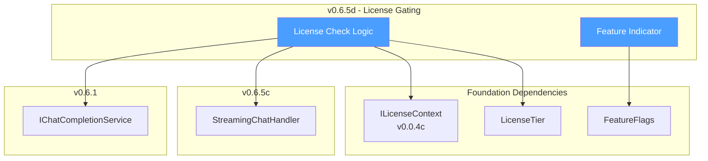
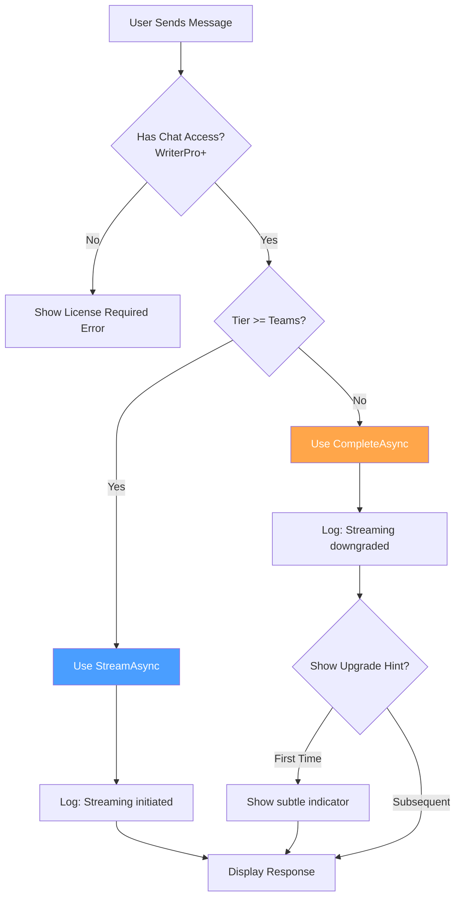

# LCS-DES-065d: Design Specification — License Gating

## 1. Metadata & Categorization

| Field           | Value                                     |
| :-------------- | :---------------------------------------- |
| **Document ID** | LCS-DES-065d                              |
| **Version**     | v0.6.5d                                   |
| **Status**      | Draft                                     |
| **Category**    | Business Logic                            |
| **Module**      | Lexichord.Modules.Agents                  |
| **Created**     | 2026-01-28                                |
| **Author**      | Documentation Agent                       |
| **Parent**      | [LCS-DES-065-INDEX](LCS-DES-065-INDEX.md) |

---

## 2. Executive Summary

### 2.1 The Requirement

Real-time streaming is a premium feature that provides significant value to users through immediate feedback and enhanced interaction. This premium capability should be reserved for Teams-tier subscribers to justify the higher subscription cost, while ensuring WriterPro users still have a functional chat experience.

### 2.2 The Proposed Solution

Implement license gating that:

1. **Checks license tier** — Verifies Teams-tier before initiating streaming
2. **Falls back gracefully** — WriterPro users receive batch (non-streaming) responses
3. **Provides transparency** — Subtle UI indication that streaming is a premium feature
4. **Tracks usage** — Telemetry for streaming adoption by tier

---

## 3. Architecture & Modular Strategy

### 3.1 Component Placement

The license gating logic is integrated directly into existing components:

```text
Lexichord.Modules.Agents/
└── Chat/
    └── ViewModels/
        └── CoPilotViewModel.cs      ← License check integration
```

No new files are created; this sub-part modifies existing orchestration logic.

### 3.2 Dependency Graph



### 3.3 License Tier Matrix

| License Tier | Chat Access | Batch Completion | Streaming | Cancel |
| :----------- | :---------: | :--------------: | :-------: | :----: |
| Free         |      ✗      |        ✗         |     ✗     |   ✗    |
| Writer       |      ✗      |        ✗         |     ✗     |   ✗    |
| WriterPro    |      ✓      |        ✓         |     ✗     |   ✗    |
| Teams        |      ✓      |        ✓         |     ✓     |   ✓    |
| Enterprise   |      ✓      |        ✓         |     ✓     |   ✓    |

---

## 4. Data Contract (The API)

### 4.1 License Check Integration

```csharp
// Within CoPilotViewModel.SendAsync method

/// <summary>
/// Determines whether streaming should be used based on license tier.
/// </summary>
/// <returns>True if streaming is available; false for batch completion.</returns>
private bool ShouldUseStreaming()
{
    var canStream = _license.Tier >= LicenseTier.Teams;

    if (!canStream)
    {
        _logger.LogInformation(
            "Streaming downgraded to batch for {Tier} license. " +
            "Streaming requires Teams tier or higher.",
            _license.Tier);
    }

    return canStream;
}

/// <summary>
/// Sends a chat message, using streaming or batch based on license.
/// </summary>
[RelayCommand(CanExecute = nameof(CanSend))]
private async Task SendAsync(CancellationToken ct)
{
    var userInput = InputText.Trim();
    InputText = string.Empty;

    try
    {
        // Add user message
        AddUserMessage(userInput);

        // License-based routing
        if (ShouldUseStreaming())
        {
            await SendStreamingAsync(userInput, ct);
        }
        else
        {
            await SendBatchAsync(userInput, ct);
        }
    }
    catch (OperationCanceledException)
    {
        _logger.LogDebug("Send operation cancelled");
    }
    catch (Exception ex)
    {
        HandleSendError(ex);
    }
}
```

### 4.2 Batch Completion Fallback

```csharp
/// <summary>
/// Sends a chat message using batch (non-streaming) completion.
/// </summary>
/// <remarks>
/// This method is used for WriterPro users who don't have access to
/// streaming. The experience is functional but with higher perceived
/// latency as the full response must be generated before display.
/// </remarks>
private async Task SendBatchAsync(string userInput, CancellationToken ct)
{
    _logger.LogDebug("Initiating batch request for {Tier} license", _license.Tier);

    IsGenerating = true;
    StatusMessage = "Generating...";

    try
    {
        // Build context and request
        var context = await BuildContextAsync(userInput, ct);
        var request = new ChatRequest(
            await BuildMessagesAsync(context),
            new ChatOptions(Model: SelectedModel, Stream: false));

        var stopwatch = Stopwatch.StartNew();

        // Execute batch completion
        var response = await _chatService.CompleteAsync(request, ct);

        stopwatch.Stop();

        _logger.LogInformation(
            "Batch response received in {ElapsedMs}ms, {Length} chars",
            stopwatch.ElapsedMilliseconds,
            response.Content?.Length ?? 0);

        // Add assistant message
        Messages.Add(new ChatMessageViewModel
        {
            MessageId = Guid.NewGuid(),
            Role = ChatRole.Assistant,
            Content = response.Content ?? string.Empty,
            Timestamp = DateTime.Now,
            TokenCount = response.Usage?.CompletionTokens
        });

        StatusMessage = $"Completed in {stopwatch.ElapsedMilliseconds}ms";
        RequestScrollToBottom();
    }
    finally
    {
        IsGenerating = false;
    }
}
```

### 4.3 Feature Availability Properties

```csharp
public partial class CoPilotViewModel
{
    /// <summary>
    /// Indicates whether streaming is available for the current license.
    /// </summary>
    /// <remarks>
    /// Used for UI bindings to show/hide streaming-related elements
    /// and to display upgrade prompts when appropriate.
    /// </remarks>
    public bool IsStreamingAvailable => _license.Tier >= LicenseTier.Teams;

    /// <summary>
    /// Message shown when streaming is not available.
    /// </summary>
    public string? StreamingUnavailableMessage => IsStreamingAvailable
        ? null
        : "ℹ️ Real-time streaming requires Teams tier. Upgrade for instant responses.";
}
```

---

## 5. Implementation Logic

### 5.1 Decision Flow



### 5.2 Telemetry Events

```csharp
/// <summary>
/// Records telemetry for streaming feature usage.
/// </summary>
private void RecordStreamingTelemetry(bool used, string tier)
{
    _telemetry.TrackEvent("ChatCompletion", new Dictionary<string, string>
    {
        ["LicenseTier"] = tier,
        ["StreamingUsed"] = used.ToString(),
        ["Model"] = SelectedModel,
        ["Provider"] = SelectedProvider
    });
}

// In SendStreamingAsync:
RecordStreamingTelemetry(used: true, _license.Tier.ToString());

// In SendBatchAsync:
RecordStreamingTelemetry(used: false, _license.Tier.ToString());
```

### 5.3 Upgrade Prompt Logic

```csharp
/// <summary>
/// Determines if an upgrade hint should be shown.
/// </summary>
/// <remarks>
/// Shows the hint:
/// - First time a WriterPro user uses chat
/// - Once per session after that (not on every message)
/// </remarks>
private bool ShouldShowUpgradeHint()
{
    if (IsStreamingAvailable) return false;

    // Check if already shown this session
    if (_upgradeHintShownThisSession) return false;

    // Check user preference
    if (_settings.DontShowStreamingUpgradeHint) return false;

    return true;
}

private void ShowUpgradeHintIfNeeded()
{
    if (!ShouldShowUpgradeHint()) return;

    _upgradeHintShownThisSession = true;

    // Show non-intrusive hint in status bar
    StatusMessage = StreamingUnavailableMessage;

    _logger.LogDebug("Displayed streaming upgrade hint");
}
```

---

## 6. UI/UX Specifications

### 6.1 WriterPro User Experience

```text
User sends message:
┌────────────────────────────────────────────────────────────┐
│ 👤 What's the best way to structure a mystery plot?        │
└────────────────────────────────────────────────────────────┘

Loading state (no streaming):
┌────────────────────────────────────────────────────────────┐
│ [Input disabled]                              Generating... │
├────────────────────────────────────────────────────────────┤
│                      ⏳ Please wait...                      │
└────────────────────────────────────────────────────────────┘

Response appears all at once:
┌────────────────────────────────────────────────────────────┐
│ 🤖 For a compelling mystery, consider the classic          │
│    structure: Hook, Investigation, Red Herrings,           │
│    Revelation, and Resolution. Start with...               │
│                                                            │
│    [Full response displayed immediately]                   │
└────────────────────────────────────────────────────────────┘
┌────────────────────────────────────────────────────────────┐
│ [Input enabled]                      Completed in 3,421ms  │
├────────────────────────────────────────────────────────────┤
│ ℹ️ Upgrade to Teams for real-time streaming responses      │
└────────────────────────────────────────────────────────────┘
```

### 6.2 Upgrade Hint Component

```xml
<!-- Subtle upgrade hint, conditionally visible -->
<Border Classes="upgrade-hint"
        IsVisible="{Binding !IsStreamingAvailable}"
        Margin="0,4,0,0">
    <Grid ColumnDefinitions="Auto,*,Auto">
        <PathIcon Grid.Column="0"
                  Data="{StaticResource InfoIcon}"
                  Width="14" Height="14"
                  Foreground="{DynamicResource AccentColor}"/>

        <TextBlock Grid.Column="1"
                   Text="Real-time streaming requires Teams tier"
                   Classes="upgrade-hint-text"
                   Margin="8,0"/>

        <Button Grid.Column="2"
                Content="Learn More"
                Classes="link-button"
                Command="{Binding ShowUpgradeInfoCommand}"/>
    </Grid>
</Border>

<Style Selector="Border.upgrade-hint">
    <Setter Property="Background" Value="{DynamicResource HintBackgroundBrush}"/>
    <Setter Property="Padding" Value="8,4"/>
    <Setter Property="CornerRadius" Value="4"/>
    <Setter Property="Opacity" Value="0.9"/>
</Style>

<Style Selector="TextBlock.upgrade-hint-text">
    <Setter Property="FontSize" Value="11"/>
    <Setter Property="Foreground" Value="{DynamicResource SecondaryTextBrush}"/>
    <Setter Property="VerticalAlignment" Value="Center"/>
</Style>
```

### 6.3 Visual Comparison

| Aspect              | WriterPro (Batch)            | Teams (Streaming)            |
| :------------------ | :--------------------------- | :--------------------------- |
| Response Appearance | All at once after generation | Progressive, word by word    |
| Perceived Latency   | High (full wait)             | Low (immediate feedback)     |
| Loading Indicator   | Spinner / "Generating..."    | Typing dots → live content   |
| Cancel Option       | None                         | Cancel button available      |
| Status Message      | "Completed in Xms"           | "Streaming..." → "Completed" |
| Upgrade Hint        | Shown after response         | Not shown                    |

---

## 7. Observability & Logging

### 7.1 Log Events

| Event                   | Level       | Template                                                                                     |
| :---------------------- | :---------- | :------------------------------------------------------------------------------------------- |
| Streaming authorized    | Debug       | `Streaming authorized for {Tier} license`                                                    |
| Streaming downgraded    | Information | `Streaming downgraded to batch for {Tier} license. Streaming requires Teams tier or higher.` |
| Batch request initiated | Debug       | `Initiating batch request for {Tier} license`                                                |
| Upgrade hint shown      | Debug       | `Displayed streaming upgrade hint`                                                           |
| Upgrade link clicked    | Information | `User clicked streaming upgrade link`                                                        |

### 7.2 Telemetry

| Event                         | Properties                                          |
| :---------------------------- | :-------------------------------------------------- |
| `ChatCompletion`              | `LicenseTier`, `StreamingUsed`, `Model`, `Provider` |
| `StreamingUpgradeHintShown`   | `LicenseTier`, `SessionId`                          |
| `StreamingUpgradeLinkClicked` | `LicenseTier`, `SessionId`, `Source`                |

### 7.3 Metrics

| Metric                       | Type    | Description                             |
| :--------------------------- | :------ | :-------------------------------------- |
| `chat_completions_total`     | Counter | Total completions by tier and method    |
| `streaming_downgrades_total` | Counter | Times streaming was downgraded to batch |
| `upgrade_hints_shown_total`  | Counter | Times upgrade hint was displayed        |
| `upgrade_link_clicks_total`  | Counter | Times upgrade link was clicked          |

---

## 8. Data Persistence

This sub-part introduces one user preference:

| Setting                        | Type | Default | Description                     |
| :----------------------------- | :--- | :------ | :------------------------------ |
| `DontShowStreamingUpgradeHint` | bool | false   | User dismissed the upgrade hint |

```csharp
// In user settings model
public class UserPreferences
{
    /// <summary>
    /// If true, don't show the streaming upgrade hint.
    /// </summary>
    public bool DontShowStreamingUpgradeHint { get; set; }
}
```

---

## 9. Security & Safety

### 9.1 License Validation

| Check             | Implementation                        | Failure Behavior       |
| :---------------- | :------------------------------------ | :--------------------- |
| Tier Verification | `_license.Tier >= LicenseTier.Teams`  | Fallback to batch      |
| License Expiry    | Checked by `ILicenseContext`          | Degrades to lower tier |
| Offline Mode      | Cached tier from last successful auth | Uses cached tier       |

### 9.2 Client-Side vs Server-Side

The client-side check is for UX purposes only (routing to streaming vs batch). The actual streaming endpoint should also verify the license server-side to prevent API abuse.

```csharp
// Server-side (in API)
if (request.Stream && !license.CanStream)
{
    return BadRequest("Streaming requires Teams tier");
}
```

---

## 10. Acceptance Criteria

### AC-065d-01: License Check

- [ ] Teams-tier users receive streaming responses
- [ ] WriterPro-tier users receive batch responses
- [ ] License check occurs before request initiation

### AC-065d-02: Graceful Fallback

- [ ] WriterPro fallback is seamless (no error)
- [ ] Batch response displays correctly
- [ ] Loading indicator shown during batch generation

### AC-065d-03: User Communication

- [ ] Upgrade hint shown for WriterPro users (non-intrusive)
- [ ] Hint contains "Learn More" link
- [ ] Hint can be dismissed

### AC-065d-04: Telemetry

- [ ] Streaming vs batch usage tracked by tier
- [ ] Upgrade hint impressions tracked
- [ ] Upgrade link clicks tracked

---

## 11. Unit Tests

```csharp
namespace Lexichord.Modules.Agents.Tests.Chat.ViewModels;

public class CoPilotViewModelLicenseGatingTests
{
    private readonly IChatCompletionService _chatService;
    private readonly ILicenseContext _licenseContext;
    private readonly CoPilotViewModel _viewModel;

    public CoPilotViewModelLicenseGatingTests()
    {
        _chatService = Substitute.For<IChatCompletionService>();
        _licenseContext = Substitute.For<ILicenseContext>();
        _viewModel = CreateViewModel();
    }

    #region License Routing Tests

    [Fact]
    [Trait("SubPart", "v0.6.5d")]
    public async Task SendAsync_TeamsLicense_UsesStreaming()
    {
        // Arrange
        _licenseContext.Tier.Returns(LicenseTier.Teams);
        _viewModel.InputText = "Test message";

        // Act
        await _viewModel.SendCommand.ExecuteAsync(null);

        // Assert
        await _chatService.Received().StreamAsync(
            Arg.Any<ChatRequest>(),
            Arg.Any<CancellationToken>());
        await _chatService.DidNotReceive().CompleteAsync(
            Arg.Any<ChatRequest>(),
            Arg.Any<CancellationToken>());
    }

    [Fact]
    [Trait("SubPart", "v0.6.5d")]
    public async Task SendAsync_EnterpriseLicense_UsesStreaming()
    {
        // Arrange
        _licenseContext.Tier.Returns(LicenseTier.Enterprise);
        _viewModel.InputText = "Test message";

        // Act
        await _viewModel.SendCommand.ExecuteAsync(null);

        // Assert
        await _chatService.Received().StreamAsync(
            Arg.Any<ChatRequest>(),
            Arg.Any<CancellationToken>());
    }

    [Fact]
    [Trait("SubPart", "v0.6.5d")]
    public async Task SendAsync_WriterProLicense_UsesBatch()
    {
        // Arrange
        _licenseContext.Tier.Returns(LicenseTier.WriterPro);
        _viewModel.InputText = "Test message";
        _chatService.CompleteAsync(Arg.Any<ChatRequest>(), Arg.Any<CancellationToken>())
            .Returns(new ChatResponse("Response", "stop"));

        // Act
        await _viewModel.SendCommand.ExecuteAsync(null);

        // Assert
        await _chatService.Received().CompleteAsync(
            Arg.Any<ChatRequest>(),
            Arg.Any<CancellationToken>());
        await _chatService.DidNotReceive().StreamAsync(
            Arg.Any<ChatRequest>(),
            Arg.Any<CancellationToken>());
    }

    #endregion

    #region Feature Availability Tests

    [Theory]
    [Trait("SubPart", "v0.6.5d")]
    [InlineData(LicenseTier.Teams, true)]
    [InlineData(LicenseTier.Enterprise, true)]
    [InlineData(LicenseTier.WriterPro, false)]
    [InlineData(LicenseTier.Writer, false)]
    public void IsStreamingAvailable_ReturnsCorrectValue(LicenseTier tier, bool expected)
    {
        // Arrange
        _licenseContext.Tier.Returns(tier);
        var vm = CreateViewModel();

        // Assert
        vm.IsStreamingAvailable.Should().Be(expected);
    }

    [Fact]
    [Trait("SubPart", "v0.6.5d")]
    public void StreamingUnavailableMessage_NullWhenAvailable()
    {
        // Arrange
        _licenseContext.Tier.Returns(LicenseTier.Teams);
        var vm = CreateViewModel();

        // Assert
        vm.StreamingUnavailableMessage.Should().BeNull();
    }

    [Fact]
    [Trait("SubPart", "v0.6.5d")]
    public void StreamingUnavailableMessage_HasContentWhenUnavailable()
    {
        // Arrange
        _licenseContext.Tier.Returns(LicenseTier.WriterPro);
        var vm = CreateViewModel();

        // Assert
        vm.StreamingUnavailableMessage.Should().NotBeNullOrEmpty();
        vm.StreamingUnavailableMessage.Should().Contain("Teams");
    }

    #endregion

    #region Fallback Behavior Tests

    [Fact]
    [Trait("SubPart", "v0.6.5d")]
    public async Task SendBatch_AddsAssistantMessage()
    {
        // Arrange
        _licenseContext.Tier.Returns(LicenseTier.WriterPro);
        _viewModel.InputText = "Test";
        _chatService.CompleteAsync(Arg.Any<ChatRequest>(), Arg.Any<CancellationToken>())
            .Returns(new ChatResponse("AI Response", "stop"));

        var initialCount = _viewModel.Messages.Count;

        // Act
        await _viewModel.SendCommand.ExecuteAsync(null);

        // Assert
        _viewModel.Messages.Count.Should().Be(initialCount + 2); // User + Assistant
        _viewModel.Messages.Last().Role.Should().Be(ChatRole.Assistant);
        _viewModel.Messages.Last().Content.Should().Be("AI Response");
    }

    [Fact]
    [Trait("SubPart", "v0.6.5d")]
    public async Task SendBatch_SetsIsGeneratingDuringRequest()
    {
        // Arrange
        _licenseContext.Tier.Returns(LicenseTier.WriterPro);
        _viewModel.InputText = "Test";

        var wasGenerating = false;
        _chatService.CompleteAsync(Arg.Any<ChatRequest>(), Arg.Any<CancellationToken>())
            .Returns(async _ =>
            {
                wasGenerating = _viewModel.IsGenerating;
                await Task.Delay(10);
                return new ChatResponse("Response", "stop");
            });

        // Act
        await _viewModel.SendCommand.ExecuteAsync(null);

        // Assert
        wasGenerating.Should().BeTrue();
        _viewModel.IsGenerating.Should().BeFalse();
    }

    #endregion

    #region Logging Tests

    [Fact]
    [Trait("SubPart", "v0.6.5d")]
    public async Task SendAsync_WriterPro_LogsDowngrade()
    {
        // Arrange
        var logger = Substitute.For<ILogger<CoPilotViewModel>>();
        _licenseContext.Tier.Returns(LicenseTier.WriterPro);
        var vm = CreateViewModelWithLogger(logger);
        vm.InputText = "Test";
        _chatService.CompleteAsync(Arg.Any<ChatRequest>(), Arg.Any<CancellationToken>())
            .Returns(new ChatResponse("Response", "stop"));

        // Act
        await vm.SendCommand.ExecuteAsync(null);

        // Assert
        logger.Received().Log(
            LogLevel.Information,
            Arg.Any<EventId>(),
            Arg.Is<object>(o => o.ToString()!.Contains("downgraded")),
            Arg.Any<Exception>(),
            Arg.Any<Func<object, Exception?, string>>());
    }

    #endregion

    private CoPilotViewModel CreateViewModel()
    {
        return new CoPilotViewModel(
            _chatService,
            Substitute.For<ILLMProviderRegistry>(),
            Substitute.For<IPromptRenderer>(),
            Substitute.For<IConversationManager>(),
            _licenseContext,
            Substitute.For<ILoggerFactory>());
    }

    private CoPilotViewModel CreateViewModelWithLogger(ILogger<CoPilotViewModel> logger)
    {
        var loggerFactory = Substitute.For<ILoggerFactory>();
        loggerFactory.CreateLogger<CoPilotViewModel>().Returns(logger);

        return new CoPilotViewModel(
            _chatService,
            Substitute.For<ILLMProviderRegistry>(),
            Substitute.For<IPromptRenderer>(),
            Substitute.For<IConversationManager>(),
            _licenseContext,
            loggerFactory);
    }
}
```

---

## 12. Integration Considerations

### 12.1 Server-Side Enforcement

While this document focuses on client-side UX, the API layer should also enforce streaming permissions:

```csharp
// In ChatController or equivalent
[HttpPost("complete")]
public async Task<IActionResult> Complete([FromBody] ChatRequest request)
{
    var license = await _licenseService.GetCurrentLicenseAsync();

    if (request.Stream && license.Tier < LicenseTier.Teams)
    {
        _logger.LogWarning(
            "Streaming request denied for {Tier} license",
            license.Tier);

        return BadRequest(new ProblemDetails
        {
            Title = "Streaming Not Available",
            Detail = "Real-time streaming requires a Teams subscription.",
            Status = 400
        });
    }

    // Proceed with request...
}
```

### 12.2 License Change Handling

If a user's license tier changes during a session:

```csharp
// Subscribe to license changes
_license.TierChanged += OnLicenseTierChanged;

private void OnLicenseTierChanged(object? sender, LicenseTierChangedEventArgs e)
{
    _logger.LogInformation(
        "License tier changed: {OldTier} → {NewTier}",
        e.OldTier, e.NewTier);

    // Update computed properties
    OnPropertyChanged(nameof(IsStreamingAvailable));
    OnPropertyChanged(nameof(StreamingUnavailableMessage));

    // If downgraded during streaming, cancel gracefully
    if (IsStreaming && e.NewTier < LicenseTier.Teams)
    {
        CancelStreaming();
        StatusMessage = "Streaming unavailable - license changed";
    }
}
```

---

## 13. Changelog

| Version | Date       | Author              | Changes       |
| :------ | :--------- | :------------------ | :------------ |
| 0.1     | 2026-01-28 | Documentation Agent | Initial draft |
