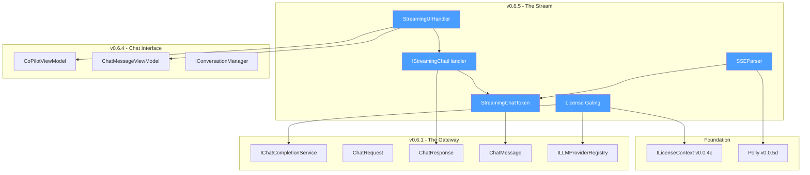
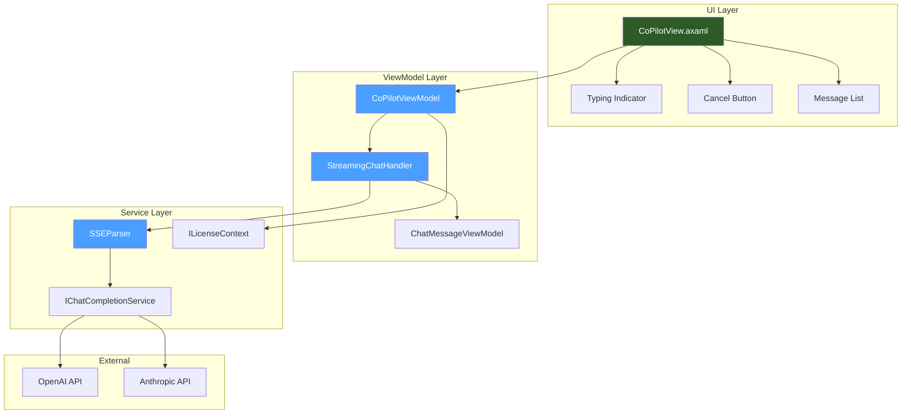
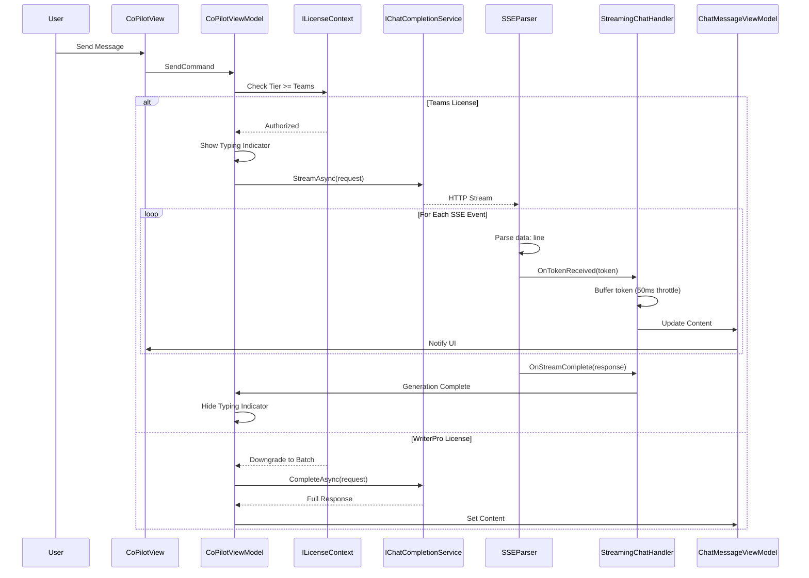

# LCS-SBD-065: Scope Breakdown Document — The Stream

## Document Control

| Field            | Value                                                                      |
| :--------------- | :------------------------------------------------------------------------- |
| **Document ID**  | LCS-SBD-065                                                                |
| **Version**      | v0.6.5                                                                     |
| **Codename**     | The Stream (Real-time Response Rendering)                                  |
| **Status**       | Draft                                                                      |
| **Module**       | Lexichord.Modules.Agents                                                   |
| **Created**      | 2026-01-28                                                                 |
| **Author**       | Documentation Agent                                                        |
| **Reviewers**    | TBD                                                                        |
| **Related Docs** | [LCS-DES-065-INDEX](LCS-DES-065-INDEX.md), [Roadmap](../roadmap-v0.6.x.md) |

---

## 1. Executive Summary

### 1.1 Vision

Transform the chat experience from a request-response model to a fluid, real-time conversation where AI responses appear progressively as they are generated. This creates a more natural, engaging interaction that mirrors human conversation patterns and provides immediate feedback that the system is working.

### 1.2 Business Value

| Benefit                      | Impact                                                                         |
| :--------------------------- | :----------------------------------------------------------------------------- |
| **Enhanced User Experience** | Eliminates the "dead air" waiting period, reducing perceived latency by 60-80% |
| **Immediate Feedback**       | Users see responses forming in real-time, increasing engagement and trust      |
| **Cancellation Support**     | Users can abort long generations early, saving time and API costs              |
| **Premium Differentiation**  | Streaming is a Teams-tier feature, adding tangible value to the premium tier   |
| **Competitive Parity**       | Matches the streaming experience users expect from modern AI interfaces        |

### 1.3 Success Criteria

| Criterion                         | Target                                         |
| :-------------------------------- | :--------------------------------------------- |
| Time to first token display       | < 500ms from request initiation                |
| UI update latency                 | < 100ms between token batches                  |
| Smooth scroll performance         | Maintains 60fps during token streaming         |
| Cancellation response time        | < 200ms from button click to stream abort      |
| Memory footprint during streaming | < 50MB additional allocation                   |
| Graceful fallback for WriterPro   | Non-streaming completion within 2s of original |

### 1.4 License Gating

| Feature                       | WriterPro | Teams |
| :---------------------------- | :-------: | :---: |
| Chat Interface Access         |     ✓     |   ✓   |
| Batch (Non-streaming) Chat    |     ✓     |   ✓   |
| Real-time Streaming Display   |     ✗     |   ✓   |
| Cancel In-Progress Generation |     ✗     |   ✓   |

**Fallback Behavior**: WriterPro users requesting streaming will automatically receive non-streaming responses. A subtle UI indicator will note that streaming is a Teams feature.

---

## 2. Dependencies on Prior Versions

### 2.1 Required Components

| Component                  | Version | Purpose                          |
| :------------------------- | :------ | :------------------------------- |
| `IChatCompletionService`   | v0.6.1a | LLM communication abstraction    |
| `ChatMessage`              | v0.6.1a | Message format for conversations |
| `ChatRequest`              | v0.6.1a | Request structure for LLM calls  |
| `ChatResponse`             | v0.6.1a | Response structure from LLM      |
| `ILLMProviderRegistry`     | v0.6.1c | Dynamic provider selection       |
| `CoPilotViewModel`         | v0.6.4a | Chat panel orchestration         |
| `ChatMessageViewModel`     | v0.6.4b | Message rendering in UI          |
| `IConversationManager`     | v0.6.4c | Conversation state management    |
| `StreamJsonReader` (Polly) | v0.0.5d | Resilient HTTP stream handling   |
| `ILicenseContext`          | v0.0.4c | License tier verification        |

### 2.2 Dependency Graph



---

## 3. Sub-Part Specifications

### 3.1 v0.6.5a: Streaming Token Model

**Goal**: Define the data structures for representing streaming tokens and handling streaming events.

**Scope**:

- `StreamingChatToken` record for individual token representation
- `IStreamingChatHandler` interface for token consumption
- `StreamingState` enum for tracking stream lifecycle

**Key Deliverables**:

- `StreamingChatToken.cs` - Immutable token record
- `IStreamingChatHandler.cs` - Handler contract
- `StreamingState.cs` - Lifecycle state enumeration

**Estimated Effort**: 4 hours

---

### 3.2 v0.6.5b: SSE Parser

**Goal**: Implement Server-Sent Events parsing to convert HTTP streams into token objects.

**Scope**:

- Parse SSE `data:` lines from HTTP response streams
- Handle OpenAI streaming format (`{"choices":[{"delta":{"content":"token"}}]}`)
- Handle Anthropic streaming format (`{"type":"content_block_delta","delta":{"text":"token"}}`)
- Detect stream termination signals (`[DONE]`, `message_stop`)
- Integrate with Polly for resilient stream reading

**Key Deliverables**:

- `SSEParser.cs` - Core parsing logic
- `ISSEParser.cs` - Parser interface for DI
- `SSEParserTests.cs` - Comprehensive unit tests

**Estimated Effort**: 8 hours

---

### 3.3 v0.6.5c: Streaming UI Handler

**Goal**: Implement real-time UI updates with performance optimizations.

**Scope**:

- Incremental token appending to message content
- Throttled UI updates (50ms batch intervals)
- Typing indicator during initial connection
- Smooth auto-scroll to keep latest content visible
- Cancel button to abort in-progress generation

**Key Deliverables**:

- `StreamingChatHandler.cs` - `IStreamingChatHandler` implementation
- `CoPilotView.axaml` updates for streaming state
- `CoPilotViewModel` streaming orchestration

**Estimated Effort**: 12 hours

---

### 3.4 v0.6.5d: License Gating

**Goal**: Enforce Teams tier requirement for streaming functionality.

**Scope**:

- License tier check before streaming execution
- Graceful fallback to batch completion for WriterPro
- UI indication of streaming availability
- Telemetry for streaming usage by tier

**Key Deliverables**:

- License check integration in `CoPilotViewModel`
- `StreamingUnavailableIndicator` UI component
- Telemetry events for streaming tier analysis

**Estimated Effort**: 4 hours

---

## 4. Implementation Checklist

| Phase | Task                                     | Est. Hours | Status |
| :---: | :--------------------------------------- | :--------: | :----: |
|   1   | Define `StreamingChatToken` record       |     1      |   ☐    |
|   1   | Define `IStreamingChatHandler` interface |     1      |   ☐    |
|   1   | Define `StreamingState` enum             |    0.5     |   ☐    |
|   1   | Unit tests for token model               |    1.5     |   ☐    |
|   2   | Implement `ISSEParser` interface         |     1      |   ☐    |
|   2   | Implement `SSEParser` for OpenAI format  |     3      |   ☐    |
|   2   | Extend `SSEParser` for Anthropic format  |     2      |   ☐    |
|   2   | Integrate Polly resilience               |     1      |   ☐    |
|   2   | Unit tests for SSE parsing               |     2      |   ☐    |
|   3   | Implement `StreamingChatHandler`         |     4      |   ☐    |
|   3   | Add throttled UI update mechanism        |     2      |   ☐    |
|   3   | Implement typing indicator               |     1      |   ☐    |
|   3   | Implement smooth auto-scroll             |     2      |   ☐    |
|   3   | Add cancel button and abort logic        |     2      |   ☐    |
|   3   | Unit tests for streaming handler         |     2      |   ☐    |
|   4   | Implement license tier check             |     1      |   ☐    |
|   4   | Implement fallback to batch completion   |     1      |   ☐    |
|   4   | Add streaming availability indicator     |     1      |   ☐    |
|   4   | Add telemetry for streaming usage        |    0.5     |   ☐    |
|   4   | Unit tests for license gating            |     1      |   ☐    |
|       | **Total**                                |   **30**   |        |

---

## 5. Dependency Matrix

### 5.1 New Interfaces

| Interface               | Module                   | Purpose                                |
| :---------------------- | :----------------------- | :------------------------------------- |
| `IStreamingChatHandler` | Lexichord.Modules.Agents | Contract for handling streaming events |
| `ISSEParser`            | Lexichord.Modules.Agents | Contract for SSE parsing               |

### 5.2 New Records/Classes

| Type                   | Module                   | Purpose                             |
| :--------------------- | :----------------------- | :---------------------------------- |
| `StreamingChatToken`   | Lexichord.Modules.Agents | Immutable token representation      |
| `StreamingState`       | Lexichord.Modules.Agents | Stream lifecycle enumeration        |
| `SSEParser`            | Lexichord.Modules.Agents | SSE parsing implementation          |
| `StreamingChatHandler` | Lexichord.Modules.Agents | UI streaming handler implementation |

### 5.3 Modified Components

| Component                | Modification                                                |
| :----------------------- | :---------------------------------------------------------- |
| `CoPilotViewModel`       | Add streaming orchestration, cancel support, license checks |
| `CoPilotView.axaml`      | Add streaming indicators, cancel button, typing animation   |
| `ChatMessageViewModel`   | Support incremental content updates                         |
| `IChatCompletionService` | Add `StreamAsync` method signature                          |

---

## 6. Architecture Diagram



---

## 7. Data Flow Diagram



---

## 8. Risks & Mitigations

| Risk                                    | Probability | Impact | Mitigation                                                |
| :-------------------------------------- | :---------: | :----: | :-------------------------------------------------------- |
| SSE parsing errors with malformed data  |   Medium    | Medium | Robust error handling, skip malformed lines, log warnings |
| UI thread blocking during rapid updates |   Medium    |  High  | Throttle updates to 50ms batches, use async dispatching   |
| Memory leaks from unclosed streams      |     Low     |  High  | Implement IDisposable, use CancellationToken throughout   |
| Provider format changes                 |     Low     | Medium | Abstract provider-specific parsing, version detection     |
| Network interruption mid-stream         |   Medium    | Medium | Polly retry policies, partial response preservation       |
| Cancel race conditions                  |   Medium    |  Low   | Linked CancellationTokenSource, proper synchronization    |

---

## 9. Success Metrics

| Metric                 | Measurement Method                           | Target     |
| :--------------------- | :------------------------------------------- | :--------- |
| Time to First Token    | Stopwatch from send to first OnTokenReceived | < 500ms    |
| Stream Completion Rate | Successful completions / total attempts      | > 99%      |
| Cancel Success Rate    | Successful cancels / cancel attempts         | > 99.5%    |
| UI Responsiveness      | Frame rate during streaming                  | 60fps      |
| User Satisfaction      | Post-interaction survey scores               | > 4.5/5    |
| Teams Tier Adoption    | Streaming feature usage correlation          | +15% Teams |

---

## 10. What This Enables

### 10.1 Immediate Benefits

- **Natural Conversation Flow**: Responses appear progressively, mimicking human typing
- **Reduced Perceived Latency**: Users see immediate activity, not a loading spinner
- **Cost Control**: Cancel button allows aborting expensive generations early
- **Premium Value**: Streaming becomes a compelling reason to upgrade to Teams

### 10.2 Future Capabilities

| Future Feature                    | How v0.6.5 Enables It                         |
| :-------------------------------- | :-------------------------------------------- |
| v0.6.6: Tool Use Foundation       | Streaming infrastructure for tool call events |
| v0.6.7: Function Calling          | Real-time display of function invocations     |
| v0.6.8: Agentic Tools             | Progressive execution feedback                |
| v0.7.x: Multi-agent Orchestration | Parallel streaming from multiple agents       |

---

## 11. User Stories

### US-065-01: Real-time Response Display

> **As a** Teams user  
> **I want** to see the AI's response appear word-by-word as it's generated  
> **So that** I get immediate feedback and can follow the AI's reasoning in real-time

**Acceptance Criteria**:

- First token appears within 500ms of sending message
- Tokens render smoothly without jarring jumps
- Message content auto-scrolls to keep latest text visible
- Typing indicator shows during initial connection

---

### US-065-02: Cancel In-Progress Generation

> **As a** Teams user  
> **I want** to cancel an AI response while it's being generated  
> **So that** I can stop irrelevant responses and save time/API costs

**Acceptance Criteria**:

- Cancel button visible during streaming
- Cancel stops the stream within 200ms
- Partial response is preserved in conversation
- User can immediately send a new message

---

### US-065-03: Graceful Fallback for WriterPro

> **As a** WriterPro user  
> **I want** to still use the chat feature even without streaming  
> **So that** I can benefit from the AI assistant within my license tier

**Acceptance Criteria**:

- Chat functionality works normally for WriterPro users
- Response appears after full generation (non-streaming)
- Subtle indicator notes streaming is a Teams feature
- No error messages, just graceful degradation

---

## 12. Use Cases

### UC-065-01: Complete Streaming Conversation

**Actors**: Teams User, AI Assistant  
**Preconditions**: User has Teams license, chat panel open, message composed  
**Trigger**: User clicks Send or presses Enter

**Main Flow**:

1. System validates license tier (Teams)
2. System shows typing indicator
3. System initiates streaming request to LLM
4. SSE parser receives first token
5. UI handler buffers tokens (50ms)
6. UI updates with buffered content
7. Steps 4-6 repeat until stream ends
8. System shows complete message
9. Typing indicator hides

**Alternative Flow A** (Cancellation):

- At step 4-6: User clicks Cancel
- System signals cancellation
- Stream aborts within 200ms
- Partial response preserved

**Alternative Flow B** (Network Error):

- At step 4: Network connection lost
- Polly retry initiates
- If retry fails: Error message shown
- Partial content preserved if available

---

### UC-065-02: WriterPro Fallback Experience

**Actors**: WriterPro User, AI Assistant  
**Preconditions**: User has WriterPro license, chat panel open  
**Trigger**: User sends message

**Main Flow**:

1. System validates license tier (WriterPro)
2. System logs streaming downgrade
3. System shows standard loading indicator
4. System initiates batch request to LLM
5. Full response received
6. Message appears complete
7. Loading indicator hides

---

## 13. Unit Testing Requirements

### 13.1 Test Categories

| Category              | Description                          | Count  |
| :-------------------- | :----------------------------------- | :----: |
| StreamingChatToken    | Token record creation and validation |   5    |
| IStreamingChatHandler | Handler interface contract tests     |   6    |
| SSEParser             | Parsing logic for multiple formats   |   12   |
| StreamingChatHandler  | UI handler with throttling           |   10   |
| License Gating        | Tier checks and fallback behavior    |   6    |
| Integration           | End-to-end streaming flow            |   4    |
| **Total**             |                                      | **43** |

### 13.2 Critical Test Cases

```csharp
[Fact]
[Trait("Category", "Streaming")]
[Trait("SubPart", "v0.6.5b")]
public async Task SSEParser_OpenAIFormat_ParsesTokensCorrectly()
{
    // Arrange
    var sseData = """
        data: {"choices":[{"delta":{"content":"Hello"}}]}
        data: {"choices":[{"delta":{"content":" World"}}]}
        data: [DONE]
        """;
    var stream = new MemoryStream(Encoding.UTF8.GetBytes(sseData));
    var parser = new SSEParser();

    // Act
    var tokens = await parser.ParseSSEStreamAsync(stream, "OpenAI", CancellationToken.None)
        .ToListAsync();

    // Assert
    tokens.Should().HaveCount(2);
    tokens[0].Text.Should().Be("Hello");
    tokens[1].Text.Should().Be(" World");
    tokens[1].IsComplete.Should().BeFalse();
}

[Fact]
[Trait("Category", "Streaming")]
[Trait("SubPart", "v0.6.5d")]
public async Task CoPilotViewModel_WriterProLicense_FallsBackToBatch()
{
    // Arrange
    var licenseContext = Substitute.For<ILicenseContext>();
    licenseContext.Tier.Returns(LicenseTier.WriterPro);
    var chatService = Substitute.For<IChatCompletionService>();
    var viewModel = CreateViewModel(licenseContext, chatService);

    // Act
    await viewModel.SendCommand.ExecuteAsync(null);

    // Assert
    await chatService.Received(1).CompleteAsync(Arg.Any<ChatRequest>(), Arg.Any<CancellationToken>());
    await chatService.DidNotReceive().StreamAsync(Arg.Any<ChatRequest>(), Arg.Any<CancellationToken>());
}
```

---

## 14. Observability & Logging

### 14.1 Log Events

| Event                 | Level       | Template                                                 |
| :-------------------- | :---------- | :------------------------------------------------------- |
| Streaming initiated   | Information | `Streaming request initiated for {Provider}/{Model}`     |
| First token received  | Debug       | `First token received at {ElapsedMs}ms`                  |
| Token batch processed | Trace       | `Processed {Count} tokens, buffer size: {BufferSize}`    |
| Stream completed      | Information | `Stream completed: {TokenCount} tokens in {ElapsedMs}ms` |
| Stream cancelled      | Information | `Stream cancelled by user at {TokenCount} tokens`        |
| SSE parse error       | Warning     | `Failed to parse SSE line: {Line}, error: {Error}`       |
| Streaming downgraded  | Information | `Streaming downgraded to batch for {Tier} license`       |
| Stream error          | Error       | `Stream error: {Exception}`                              |

### 14.2 Metrics

| Metric                     | Type      | Description                          |
| :------------------------- | :-------- | :----------------------------------- |
| `streaming_requests_total` | Counter   | Total streaming requests by provider |
| `streaming_fallback_total` | Counter   | Requests downgraded to batch by tier |
| `streaming_cancellations`  | Counter   | User-initiated stream cancellations  |
| `time_to_first_token_ms`   | Histogram | Latency from request to first token  |
| `stream_duration_ms`       | Histogram | Total stream duration                |
| `tokens_per_stream`        | Histogram | Token count per completed stream     |

---

## 15. UI/UX Specifications

### 15.1 Streaming State Layout

```text
┌──────────────────────────────────────────────────────────────────┐
│  Co-pilot                                [Provider ▼][Model ▼]  │
├──────────────────────────────────────────────────────────────────┤
│  ▶ Context (5 rules, 3 chunks)                      [Refresh]   │
├──────────────────────────────────────────────────────────────────┤
│  ┌────────────────────────────────────────────────────────────┐  │
│  │ 👤 What is the best approach for this scene?      2 min ago │  │
│  ├────────────────────────────────────────────────────────────┤  │
│  │ 🤖 I'd recommend focusing on the emotional core of the    │  │
│  │    scene. Consider the following approaches:               │  │
│  │    █                                              ← Cursor  │  │
│  └────────────────────────────────────────────────────────────┘  │
├──────────────────────────────────────────────────────────────────┤
│  ┌────────────────────────────────────────────────────────────┐  │
│  │ (Input disabled during streaming)                          │  │
│  └────────────────────────────────────────────────────────────┘  │
├──────────────────────────────────────────────────────────────────┤
│  [Cancel ⏹]                                    Streaming... ●●● │
└──────────────────────────────────────────────────────────────────┘
```

### 15.2 Visual States

| State             | Input Field | Send Button | Footer                        |
| :---------------- | :---------- | :---------- | :---------------------------- |
| Idle              | Enabled     | Send icon   | Token count, New Chat, Export |
| Streaming (Teams) | Disabled    | Hidden      | Cancel button, "Streaming..." |
| Batch Loading     | Disabled    | Spinner     | "Generating..."               |
| Error             | Enabled     | Send icon   | Error message (red)           |

### 15.3 Typing Indicator

```text
During initial connection (before first token):

   🤖 ●●●

The dots animate in sequence (fade in/out) at 300ms intervals.
Indicator disappears when first token arrives.
```

---

## 16. Acceptance Criteria

### AC-065-01: Streaming Token Display

- [ ] Tokens appear incrementally as received from LLM
- [ ] First token displays within 500ms of request
- [ ] UI remains responsive (60fps) during streaming
- [ ] Content auto-scrolls to keep latest text visible

### AC-065-02: SSE Parsing

- [ ] Parser correctly handles OpenAI streaming format
- [ ] Parser correctly handles Anthropic streaming format
- [ ] Parser detects stream termination signals
- [ ] Malformed lines are skipped with warning log

### AC-065-03: UI Throttling

- [ ] Tokens are batched at 50ms intervals
- [ ] UI updates are dispatched to UI thread
- [ ] Memory usage stays under 50MB during streaming

### AC-065-04: Cancellation

- [ ] Cancel button visible during streaming
- [ ] Cancellation completes within 200ms
- [ ] Partial response is preserved
- [ ] CancellationToken properly propagated

### AC-065-05: License Gating

- [ ] Teams users receive streaming responses
- [ ] WriterPro users receive batch responses
- [ ] Fallback is logged with appropriate level
- [ ] No error shown for WriterPro fallback

---

## 17. Verification Commands

```bash
# Build the Agents module
dotnet build src/Modules/Lexichord.Modules.Agents/Lexichord.Modules.Agents.csproj

# Run streaming-related tests
dotnet test --filter "Category=Streaming"

# Run all v0.6.5 tests
dotnet test --filter "SubPart=v0.6.5a|SubPart=v0.6.5b|SubPart=v0.6.5c|SubPart=v0.6.5d"

# Run specific SSE parser tests
dotnet test --filter "FullyQualifiedName~SSEParserTests"

# Verify license gating tests
dotnet test --filter "Category=LicenseGating&SubPart=v0.6.5d"
```

---

## 18. Deliverable Checklist

| Deliverable                          | Status |
| :----------------------------------- | :----: |
| `StreamingChatToken.cs`              |   ☐    |
| `IStreamingChatHandler.cs`           |   ☐    |
| `StreamingState.cs`                  |   ☐    |
| `ISSEParser.cs`                      |   ☐    |
| `SSEParser.cs`                       |   ☐    |
| `StreamingChatHandler.cs`            |   ☐    |
| `CoPilotViewModel` updates           |   ☐    |
| `CoPilotView.axaml` updates          |   ☐    |
| `IChatCompletionService.StreamAsync` |   ☐    |
| Unit tests (43 total)                |   ☐    |
| Integration tests                    |   ☐    |
| Documentation updates                |   ☐    |

---

## 19. Code Examples

### 19.1 StreamingChatToken Record

```csharp
namespace Lexichord.Modules.Agents.Chat.Models;

/// <summary>
/// Represents a single token received during streaming LLM responses.
/// </summary>
/// <param name="Text">The text content of this token.</param>
/// <param name="Index">Zero-based index of this token in the stream.</param>
/// <param name="IsComplete">True if this is the final token.</param>
/// <param name="FinishReason">Optional reason for stream completion.</param>
public record StreamingChatToken(
    string Text,
    int Index,
    bool IsComplete,
    string? FinishReason
);
```

### 19.2 IStreamingChatHandler Interface

```csharp
namespace Lexichord.Modules.Agents.Chat.Abstractions;

/// <summary>
/// Contract for handling streaming chat token events.
/// </summary>
public interface IStreamingChatHandler
{
    /// <summary>
    /// Called when a new token is received from the stream.
    /// </summary>
    Task OnTokenReceived(StreamingChatToken token);

    /// <summary>
    /// Called when the stream completes successfully.
    /// </summary>
    Task OnStreamComplete(ChatResponse fullResponse);

    /// <summary>
    /// Called when an error occurs during streaming.
    /// </summary>
    Task OnStreamError(Exception error);
}
```

### 19.3 SSE Parser Core Logic

```csharp
public async IAsyncEnumerable<StreamingChatToken> ParseSSEStreamAsync(
    Stream responseStream,
    string provider,
    [EnumeratorCancellation] CancellationToken ct)
{
    using var reader = new StreamReader(responseStream);
    var index = 0;

    while (!reader.EndOfStream && !ct.IsCancellationRequested)
    {
        var line = await reader.ReadLineAsync(ct);

        if (string.IsNullOrWhiteSpace(line)) continue;
        if (!line.StartsWith("data: ")) continue;

        var json = line[6..];

        if (json == "[DONE]" || json.Contains("message_stop"))
        {
            yield return new StreamingChatToken("", index, true, "stop");
            yield break;
        }

        var token = ParseToken(json, provider, index++);
        if (token is not null)
        {
            yield return token;
        }
    }
}
```

---

## 20. Deferred Features

| Feature                       | Rationale                              | Target Version |
| :---------------------------- | :------------------------------------- | :------------- |
| Multi-stream aggregation      | Requires multi-agent foundation        | v0.7.x         |
| Streaming cost display        | Requires token counting infrastructure | v0.6.8+        |
| Voice synthesis from stream   | Accessibility feature, separate scope  | v0.9.x         |
| Streaming to multiple devices | Requires sync infrastructure           | v0.8.x         |

---

## 21. Changelog Entry

```markdown
## [0.6.5] - 2026-XX-XX

### Added

- Real-time streaming token display for Teams license holders
- SSE parser supporting OpenAI and Anthropic streaming formats
- Cancel button to abort in-progress LLM generations
- Typing indicator during stream initialization
- Throttled UI updates (50ms batching) for smooth performance
- Auto-scroll to keep latest streaming content visible
- License gating with graceful fallback for WriterPro users

### Changed

- `IChatCompletionService` extended with `StreamAsync` method
- `CoPilotViewModel` updated with streaming orchestration
- `ChatMessageViewModel` supports incremental content updates

### Technical

- New `StreamingChatToken` record for token representation
- New `IStreamingChatHandler` interface for token consumption
- New `SSEParser` for Server-Sent Events processing
- New `StreamingChatHandler` for UI integration
- Integrated Polly for resilient stream reading
```
