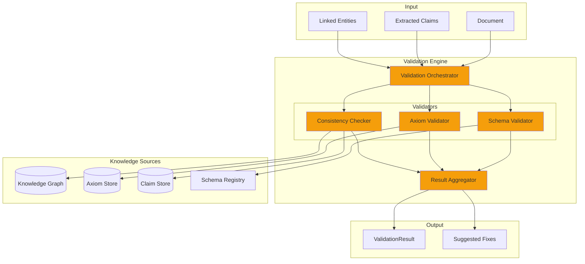
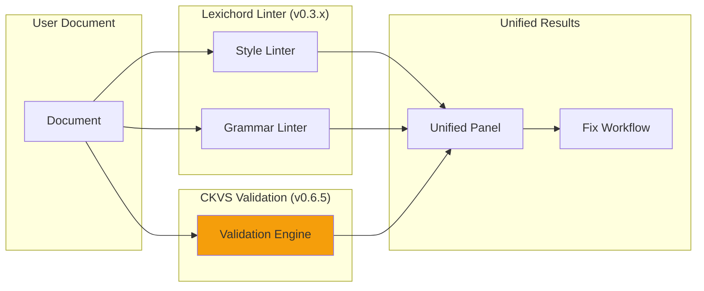

# LCS-SBD-065-KG: Scope Overview — Validation Engine

## Document Control

| Field            | Value                                                                |
| :--------------- | :------------------------------------------------------------------- |
| **Document ID**  | LCS-SBD-065-KG                                                       |
| **Version**      | v0.6.5                                                               |
| **Codename**     | Validation Engine (CKVS Phase 3a)                                    |
| **Status**       | Draft                                                                |
| **Last Updated** | 2026-01-31                                                           |
| **Owner**        | Lead Architect                                                       |
| **Depends On**   | v0.5.6-KG (Claims), v0.4.6-KG (Axioms), v0.4.5-KG (Graph)            |

---

## 1. Executive Summary

### 1.1 The Vision

**v0.6.5-KG** delivers the **Validation Engine** — the core CKVS component that validates content against the Knowledge Graph and Axiom Store. This is where all the CKVS infrastructure converges to provide real, actionable feedback to writers.

The Validation Engine checks:
- **Schema Validity:** Do entities match their type schemas?
- **Axiom Compliance:** Do claims satisfy foundational rules?
- **Consistency:** Do new claims contradict existing knowledge?
- **Completeness:** Are required relationships present?

### 1.2 Business Value

- **Error Prevention:** Catch mistakes before publication.
- **Consistency Enforcement:** Ensure documentation stays coherent.
- **Real-Time Feedback:** Validate as users write (streaming).
- **Confidence Building:** Green checkmarks for validated content.
- **Publication Gate:** Block publishing of invalid documentation.

### 1.3 Success Criteria

1. Schema validator checks entities against type definitions.
2. Axiom validator evaluates claims against axiom rules.
3. Consistency checker detects contradictions with existing claims.
4. Validation latency <500ms for typical documents.
5. 95% of axiom violations detected (recall target).
6. False positive rate <10% (precision target).
7. Integration with Linter (v0.3.x) for unified fix suggestions.

---

## 2. Relationship to Existing v0.6.5

The existing v0.6.5 spec covers **Streaming** for LLM responses. Validation Engine integrates by:

- **Stream Validation:** Validate LLM output chunks in real-time.
- **Co-pilot Integration:** Pre-validate context before generation.
- **Shared Infrastructure:** Uses same async/streaming patterns.

---

## 3. Key Deliverables

### 3.1 Sub-Parts

| Sub-Part | Title | Description | Est. Hours |
|:---------|:------|:------------|:-----------|
| v0.6.5e | Validation Orchestrator | Coordinates all validators | 6 | ✅ Complete |
| v0.6.5f | Schema Validator | Validates entities against schemas | 5 | ✅ Complete |
| v0.6.5g | Axiom Validator | Validates claims against axioms | 8 |
| v0.6.5h | Consistency Checker | Detects contradictions | 8 |
| v0.6.5i | Validation Result Aggregator | Combines results, suggests fixes | 4 |
| v0.6.5j | Linter Integration | Unified fix workflow with style linter | 4 |
| **Total** | | | **35 hours** |

### 3.2 Key Interfaces

```csharp
/// <summary>
/// Core validation engine for CKVS.
/// </summary>
public interface IValidationEngine
{
    /// <summary>
    /// Validates a document against all CKVS rules.
    /// </summary>
    /// <param name="document">Document to validate.</param>
    /// <param name="options">Validation options.</param>
    /// <param name="ct">Cancellation token.</param>
    /// <returns>Validation result with all findings.</returns>
    Task<ValidationResult> ValidateDocumentAsync(
        Document document,
        ValidationOptions options,
        CancellationToken ct = default);

    /// <summary>
    /// Validates extracted claims against knowledge base.
    /// </summary>
    Task<ValidationResult> ValidateClaimsAsync(
        IReadOnlyList<Claim> claims,
        ValidationOptions options,
        CancellationToken ct = default);

    /// <summary>
    /// Validates generated content before insertion.
    /// </summary>
    Task<ValidationResult> ValidateGeneratedContentAsync(
        string content,
        GenerationContext context,
        CancellationToken ct = default);

    /// <summary>
    /// Streams validation results as they're computed.
    /// </summary>
    IAsyncEnumerable<ValidationFinding> ValidateStreamingAsync(
        string content,
        ValidationOptions options,
        CancellationToken ct = default);
}

/// <summary>
/// Result of validation operation.
/// </summary>
public record ValidationResult
{
    /// <summary>Overall validation status.</summary>
    public ValidationStatus Status { get; init; }

    /// <summary>All validation findings.</summary>
    public required IReadOnlyList<ValidationFinding> Findings { get; init; }

    /// <summary>Validation duration.</summary>
    public TimeSpan Duration { get; init; }

    /// <summary>Number of claims validated.</summary>
    public int ClaimsValidated { get; init; }

    /// <summary>Number of entities validated.</summary>
    public int EntitiesValidated { get; init; }

    /// <summary>Whether document passed validation.</summary>
    public bool IsValid => Status == ValidationStatus.Valid;

    /// <summary>Error count.</summary>
    public int ErrorCount => Findings.Count(f => f.Severity == ValidationSeverity.Error);

    /// <summary>Warning count.</summary>
    public int WarningCount => Findings.Count(f => f.Severity == ValidationSeverity.Warning);
}

/// <summary>
/// A single validation finding.
/// </summary>
public record ValidationFinding
{
    /// <summary>Unique finding ID.</summary>
    public Guid Id { get; init; } = Guid.NewGuid();

    /// <summary>Validator that produced this finding.</summary>
    public required string ValidatorName { get; init; }

    /// <summary>Finding severity.</summary>
    public ValidationSeverity Severity { get; init; }

    /// <summary>Finding code (e.g., "AXIOM_VIOLATION").</summary>
    public required string Code { get; init; }

    /// <summary>Human-readable message.</summary>
    public required string Message { get; init; }

    /// <summary>Source location in document.</summary>
    public TextSpan? Location { get; init; }

    /// <summary>Related claim (if claim-based).</summary>
    public Claim? RelatedClaim { get; init; }

    /// <summary>Related entity (if entity-based).</summary>
    public KnowledgeEntity? RelatedEntity { get; init; }

    /// <summary>Suggested fix (if available).</summary>
    public ValidationFix? SuggestedFix { get; init; }

    /// <summary>Related axiom (if axiom violation).</summary>
    public Axiom? ViolatedAxiom { get; init; }
}

public enum ValidationStatus { Valid, ValidWithWarnings, Invalid }
public enum ValidationSeverity { Error, Warning, Info, Hint }

/// <summary>
/// Suggested fix for a validation finding.
/// </summary>
public record ValidationFix
{
    /// <summary>Fix description.</summary>
    public required string Description { get; init; }

    /// <summary>Text replacement (if applicable).</summary>
    public string? ReplacementText { get; init; }

    /// <summary>Text span to replace.</summary>
    public TextSpan? ReplaceSpan { get; init; }

    /// <summary>Fix confidence (0-1).</summary>
    public float Confidence { get; init; }

    /// <summary>Whether fix can be auto-applied.</summary>
    public bool CanAutoApply { get; init; }
}
```

### 3.3 Validation Architecture



---

## 4. Validator Details

### 4.1 Schema Validator

**Purpose:** Ensures entities conform to their type definitions.

**Checks:**
- Required properties present
- Property types correct
- Enum values valid
- Constraints satisfied (min/max, pattern, length)

**Example Finding:**
```json
{
  "code": "SCHEMA_REQUIRED_PROPERTY",
  "message": "Endpoint 'GET /users' missing required property 'method'",
  "severity": "Error",
  "suggestedFix": {
    "description": "Add method property",
    "replacementText": "method: GET"
  }
}
```

### 4.2 Axiom Validator

**Purpose:** Ensures claims satisfy foundational domain rules.

**Checks:**
- Property constraints (equality, range, cardinality)
- Relationship constraints (valid from/to types)
- Business rules (e.g., "required params can't have defaults")

**Example Finding:**
```json
{
  "code": "AXIOM_VIOLATION",
  "message": "Parameter 'userId' is marked required but has default value '0'",
  "severity": "Warning",
  "violatedAxiom": {
    "id": "parameter-required-no-default",
    "name": "Required Parameter Cannot Have Default"
  },
  "suggestedFix": {
    "description": "Remove default value or mark as optional",
    "confidence": 0.7
  }
}
```

### 4.3 Consistency Checker

**Purpose:** Detects contradictions between new and existing claims.

**Checks:**
- Conflicting property values for same entity
- Contradictory relationships
- Temporal inconsistencies (if versioned)

**Example Finding:**
```json
{
  "code": "CONSISTENCY_CONFLICT",
  "message": "Claim conflicts with existing knowledge: '/users' is documented as both GET and POST",
  "severity": "Error",
  "relatedClaim": { "subject": "/users", "predicate": "HAS_METHOD", "object": "POST" },
  "existingClaim": { "subject": "/users", "predicate": "HAS_METHOD", "object": "GET" }
}
```

---

## 5. Validation Modes

| Mode | When Used | Latency Target | Validators |
|:-----|:----------|:---------------|:-----------|
| **Real-time** | As user types | <100ms | Schema only |
| **On-save** | Document save | <500ms | Schema + Axiom |
| **Full** | Pre-publish | <5s | All validators |
| **Streaming** | LLM generation | Per-chunk | Schema + Axiom |

---

## 6. Linter Integration



**Integration Points:**
- Validation findings appear alongside linter findings
- Unified severity levels (Error, Warning, Info)
- Combined fix suggestions
- Single "Fix All" workflow

---

## 7. Dependencies

| Component | Source | Usage |
|:----------|:-------|:------|
| `ISchemaRegistry` | v0.4.5f | Schema definitions |
| `IAxiomStore` | v0.4.6-KG | Axiom rules |
| `IClaimRepository` | v0.5.6-KG | Existing claims for consistency |
| `IGraphRepository` | v0.4.5e | Entity data |
| `ILinterService` | v0.3.x | Linter integration |

---

## 8. License Gating

| Tier | Validation Access |
|:-----|:------------------|
| Core | Not available |
| WriterPro | Schema validation only |
| Teams | Full validation (schema + axiom + consistency) |
| Enterprise | Full + custom validators |

---

## 9. Performance Targets

| Metric | Target | Measurement |
|:-------|:-------|:------------|
| Real-time latency | <100ms | P95 timing |
| On-save latency | <500ms | P95 timing |
| Full validation | <5s | P95 timing |
| Axiom violation recall | >95% | Test corpus |
| False positive rate | <10% | Human evaluation |

---

## 10. Risks & Mitigations

| Risk | Mitigation |
|:-----|:-----------|
| Validation too slow | Incremental validation, caching |
| Too many false positives | Confidence thresholds, easy dismiss |
| User ignores warnings | Clear severity levels, education |
| Axiom rules too strict | Severity levels, workspace overrides |

---

## 11. What This Enables

- **v0.6.6 Co-pilot:** Pre/post validation for generated content.
- **v0.7.5 Unified Validation:** Combined style + knowledge validation.
- **Publication Gates:** Block publishing invalid documentation.
- **Continuous Validation:** Monitor documentation health over time.

---
