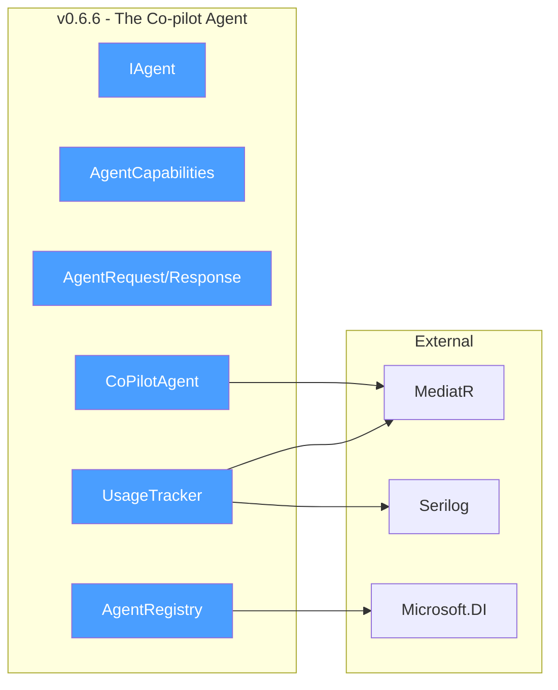
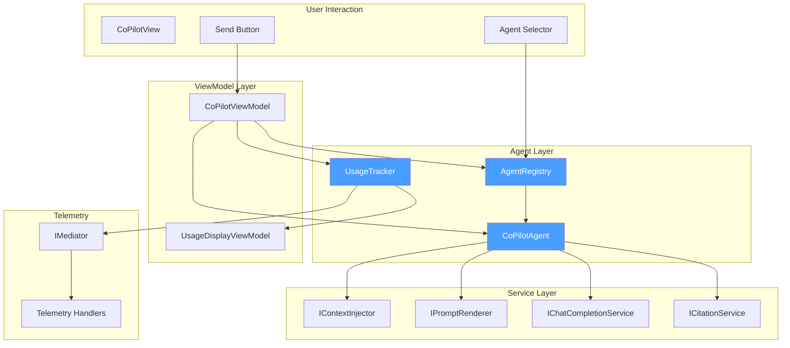
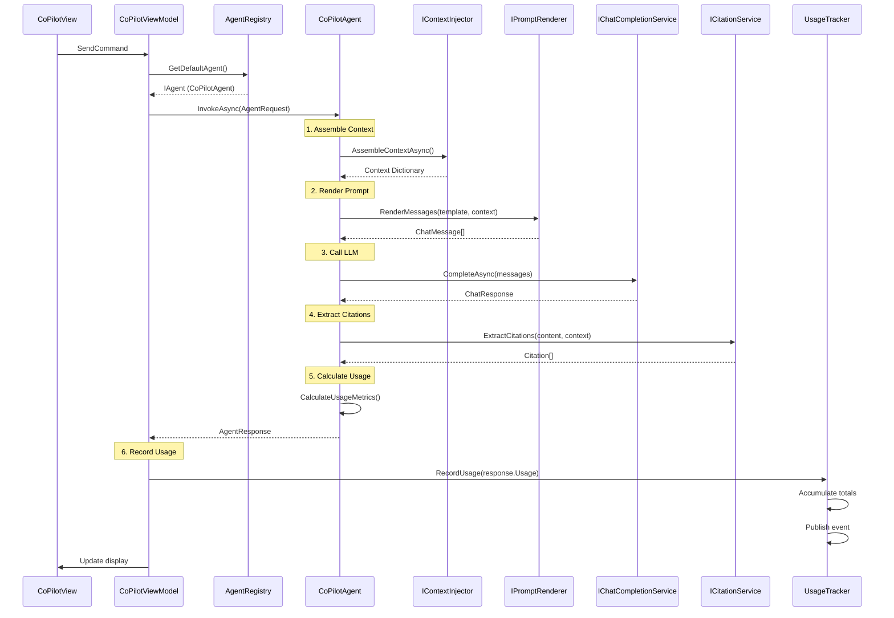
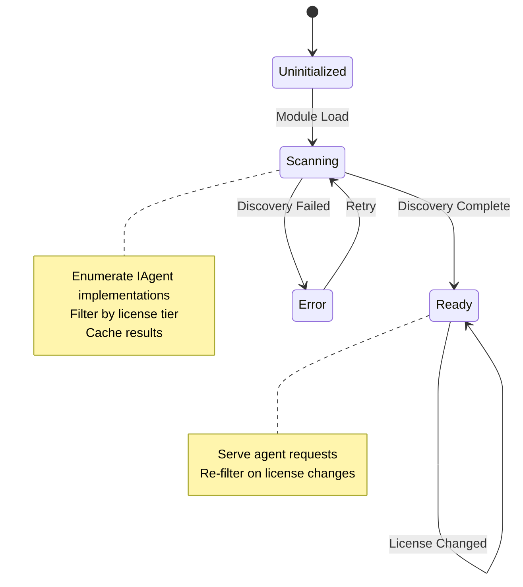
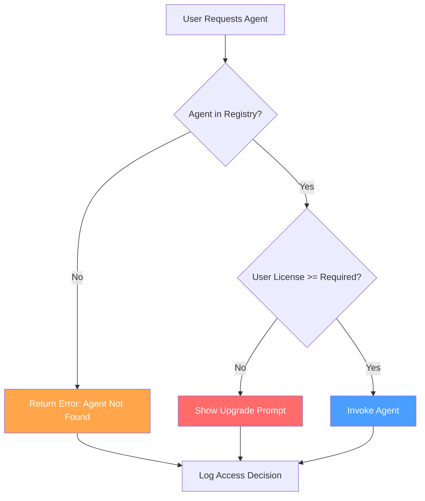
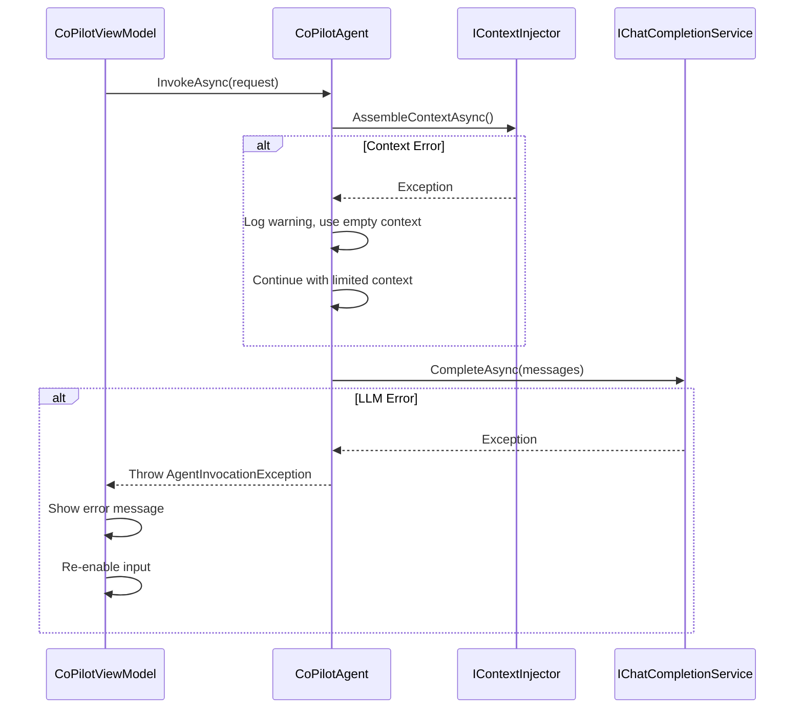

# LCS-DES-066-INDEX: Design Specification Index — The Co-pilot Agent

## Document Control

| Field           | Value                                         |
| :-------------- | :-------------------------------------------- |
| **Document ID** | LCS-DES-066-INDEX                             |
| **Version**     | v0.6.6                                        |
| **Codename**    | The Co-pilot Agent (Conversational Assistant) |
| **Status**      | Draft                                         |
| **Module**      | Lexichord.Modules.Agents                      |
| **Created**     | 2026-01-28                                    |
| **Author**      | Documentation Agent                           |
| **Parent**      | [LCS-SBD-066](LCS-SBD-066.md)                 |

---

## 1. Overview

### 1.1 Goals

Unify all AI-powered capabilities into a cohesive agent framework by implementing:

1. **Agent Abstractions** — Define the core `IAgent` contract and supporting data structures
2. **Co-pilot Implementation** — Create the foundational writing assistant agent
3. **Agent Registry** — Implement agent discovery and selection infrastructure
4. **Usage Tracking** — Provide transparent token and cost tracking

### 1.2 Module Structure

```text
Lexichord.Abstractions/
└── Agents/
    ├── IAgent.cs                       ← v0.6.6a
    ├── IAgentRegistry.cs               ← v0.6.6c
    ├── AgentCapabilities.cs            ← v0.6.6a
    ├── AgentRequest.cs                 ← v0.6.6a
    ├── AgentResponse.cs                ← v0.6.6a
    └── UsageMetrics.cs                 ← v0.6.6a

Lexichord.Modules.Agents/
└── Chat/
    ├── Agents/
    │   ├── CoPilotAgent.cs             ← v0.6.6b
    │   └── AgentRegistry.cs            ← v0.6.6c
    ├── Events/
    │   └── AgentInvocationEvent.cs     ← v0.6.6d
    ├── Services/
    │   └── UsageTracker.cs             ← v0.6.6d
    ├── ViewModels/
    │   ├── CoPilotViewModel.cs         ← Modified v0.6.6b, v0.6.6c
    │   └── UsageDisplayViewModel.cs    ← v0.6.6d
    └── Templates/
        └── co-pilot-editor.liquid      ← v0.6.6b
```

---

## 2. Sub-Part Index

| Part    | Title                   | Document                        | Status |
| :------ | :---------------------- | :------------------------------ | :----: |
| v0.6.6a | Agent Abstractions      | [LCS-DES-066a](LCS-DES-066a.md) | Draft  |
| v0.6.6b | Co-pilot Implementation | [LCS-DES-066b](LCS-DES-066b.md) | Draft  |
| v0.6.6c | Agent Registry          | [LCS-DES-066c](LCS-DES-066c.md) | Draft  |
| v0.6.6d | Usage Tracking          | [LCS-DES-066d](LCS-DES-066d.md) | Draft  |

---

## 3. Dependency Graph

### 3.1 External Dependencies



### 3.2 Internal Dependencies

```mermaid
graph TB
    subgraph "v0.6.6 - The Co-pilot Agent"
        IA[IAgent<br/>v0.6.6a]
        AC[AgentCapabilities<br/>v0.6.6a]
        ARQ[AgentRequest<br/>v0.6.6a]
        ARS[AgentResponse<br/>v0.6.6a]
        UM[UsageMetrics<br/>v0.6.6a]
        CPA[CoPilotAgent<br/>v0.6.6b]
        IAR[IAgentRegistry<br/>v0.6.6c]
        AREG[AgentRegistry<br/>v0.6.6c]
        AIE[AgentInvocationEvent<br/>v0.6.6d]
        UT[UsageTracker<br/>v0.6.6d]
    end

    subgraph "v0.6.5 - The Stream"
        ISH[IStreamingChatHandler]
    end

    subgraph "v0.6.4 - Chat Interface"
        CPVM[CoPilotViewModel]
        CMV[ChatMessageViewModel]
    end

    subgraph "v0.6.3 - Template Engine"
        IPR[IPromptRenderer]
        ICI[IContextInjector]
        IPTR[IPromptTemplateRepository]
    end

    subgraph "v0.6.1 - The Gateway"
        ICCS[IChatCompletionService]
    end

    subgraph "Domain Services"
        CIT[ICitationService<br/>v0.5.2a]
    end

    subgraph "Foundation"
        LIC[ILicenseContext<br/>v0.0.4c]
        MED[IMediator<br/>v0.0.7a]
    end

    CPA --> IA
    CPA --> AC
    CPA --> ARQ
    CPA --> ARS
    CPA --> UM
    CPA --> ICCS
    CPA --> IPR
    CPA --> ICI
    CPA --> IPTR
    CPA --> CIT
    CPA --> ISH
    AREG --> IAR
    AREG --> IA
    AREG --> LIC
    UT --> AIE
    UT --> UM
    UT --> MED
    CPVM --> CPA
    CPVM --> AREG
    CPVM --> UT

    style IA fill:#4a9eff,color:#fff
    style AC fill:#4a9eff,color:#fff
    style ARQ fill:#4a9eff,color:#fff
    style ARS fill:#4a9eff,color:#fff
    style UM fill:#4a9eff,color:#fff
    style CPA fill:#4a9eff,color:#fff
    style IAR fill:#4a9eff,color:#fff
    style AREG fill:#4a9eff,color:#fff
    style AIE fill:#4a9eff,color:#fff
    style UT fill:#4a9eff,color:#fff
```



---

## 4. Interface Summary

### 4.1 New Interfaces

| Interface        | Sub-Part | Purpose                                |
| :--------------- | :------: | :------------------------------------- |
| `IAgent`         | v0.6.6a  | Contract for all agent implementations |
| `IAgentRegistry` | v0.6.6c  | Agent discovery and selection          |

### 4.2 New Records

| Record          | Sub-Part | Purpose                     |
| :-------------- | :------: | :-------------------------- |
| `AgentRequest`  | v0.6.6a  | Agent invocation parameters |
| `AgentResponse` | v0.6.6a  | Agent invocation results    |
| `UsageMetrics`  | v0.6.6a  | Token and cost tracking     |

### 4.3 New Enums

| Enum                | Sub-Part | Purpose                           |
| :------------------ | :------: | :-------------------------------- |
| `AgentCapabilities` | v0.6.6a  | Flags for agent feature discovery |

### 4.4 New Services

| Service         | Sub-Part | Purpose                         |
| :-------------- | :------: | :------------------------------ |
| `CoPilotAgent`  | v0.6.6b  | Writing assistant agent         |
| `AgentRegistry` | v0.6.6c  | Agent discovery implementation  |
| `UsageTracker`  | v0.6.6d  | Token/cost accumulation service |

### 4.5 New Events

| Event                  | Sub-Part | Purpose                   |
| :--------------------- | :------: | :------------------------ |
| `AgentInvocationEvent` | v0.6.6d  | Telemetry for invocations |

---

## 5. Data Flow Overview



---

## 6. Agent Invocation Flow



---

## 7. Agent Registry State Machine



---

## 8. UI Component Layout

### 8.1 Agent-Integrated Chat Panel

```text
┌──────────────────────────────────────────────────────────────────┐
│  Co-pilot                    [Agent ▼][Provider ▼][Model ▼]     │
├──────────────────────────────────────────────────────────────────┤
│  ▶ Context (5 rules, 3 RAG chunks)                  [Refresh]   │
├──────────────────────────────────────────────────────────────────┤
│                                                                  │
│  ┌────────────────────────────────────────────────────────────┐  │
│  │ 👤 Can you help improve the dialogue in this scene?        │  │
│  │                                              10:45 AM       │  │
│  └────────────────────────────────────────────────────────────┘  │
│                                                                  │
│  ┌────────────────────────────────────────────────────────────┐  │
│  │ 🤖 Based on your scene [1], I have several suggestions:     │  │
│  │                                                            │  │
│  │    **1. Subtext**: The characters are stating their        │  │
│  │       feelings too directly. Consider...                   │  │
│  │                                                            │  │
│  │    **2. Rhythm**: Your dialogue could benefit from         │  │
│  │       varying sentence lengths per your style guide [2].   │  │
│  │                                                            │  │
│  │    [1]: Chapter 5, scene 3 (current selection)             │  │
│  │    [2]: Style Rule: Dialogue Rhythm                        │  │
│  │                                              10:45 AM       │  │
│  └────────────────────────────────────────────────────────────┘  │
│                                                                  │
├──────────────────────────────────────────────────────────────────┤
│  ┌────────────────────────────────────────────────────────────┐  │
│  │ Type your message...                                       │  │
│  └────────────────────────────────────────────────────────────┘  │
├──────────────────────────────────────────────────────────────────┤
│  Tokens: 2,847 (~$0.0085)              [New Chat] [Export]      │
└──────────────────────────────────────────────────────────────────┘
```

### 8.2 Component Responsibility

| Component         | Responsibility                               |
| :---------------- | :------------------------------------------- |
| `CoPilotView`     | Container layout, bindings, user interaction |
| `Agent Selector`  | Agent enumeration and selection              |
| `Context Summary` | Display of injected context                  |
| `Message List`    | Virtualized chat message display             |
| `Usage Display`   | Running token count and estimated cost       |
| `Citation Links`  | Navigable references to source content       |

---

## 9. Testing Summary

### 9.1 Test Distribution

| Sub-Part  | Unit Tests | Integration | Total  |
| :-------- | :--------: | :---------: | :----: |
| v0.6.6a   |     8      |      0      |   8    |
| v0.6.6b   |     15     |      2      |   17   |
| v0.6.6c   |     10     |      1      |   11   |
| v0.6.6d   |     8      |      1      |   9    |
| **Total** |   **41**   |    **4**    | **45** |

### 9.2 Key Test Scenarios

| Scenario                            | Sub-Part | Priority |
| :---------------------------------- | :------: | :------: |
| IAgent contract compliance          | v0.6.6a  |   High   |
| AgentCapabilities flag combinations | v0.6.6a  |  Medium  |
| Record equality and immutability    | v0.6.6a  |  Medium  |
| Context assembly orchestration      | v0.6.6b  | Critical |
| Prompt rendering with all variables | v0.6.6b  | Critical |
| Citation extraction accuracy        | v0.6.6b  |   High   |
| Usage metrics calculation           | v0.6.6b  |   High   |
| Agent discovery via DI              | v0.6.6c  | Critical |
| License tier filtering              | v0.6.6c  | Critical |
| Default agent selection             | v0.6.6c  |   High   |
| Usage accumulation correctness      | v0.6.6d  | Critical |
| Event publishing on invocation      | v0.6.6d  |   High   |
| Monthly summary aggregation         | v0.6.6d  |  Medium  |

---

## 10. DI Registration

### 10.1 Service Registrations

```csharp
// In AgentsModule.cs
public static class AgentsModuleExtensions
{
    public static IServiceCollection AddAgentsModule(this IServiceCollection services)
    {
        // Agent implementations
        services.AddScoped<IAgent, CoPilotAgent>();

        // Agent registry
        services.AddSingleton<IAgentRegistry, AgentRegistry>();

        // Usage tracking
        services.AddScoped<UsageTracker>();
        services.AddTransient<UsageDisplayViewModel>();

        return services;
    }
}
```

### 10.2 Registration Rationale

| Service                 | Lifetime  | Rationale                                    |
| :---------------------- | :-------- | :------------------------------------------- |
| `CoPilotAgent`          | Scoped    | Per-request lifetime for context isolation   |
| `AgentRegistry`         | Singleton | Static agent collection, thread-safe caching |
| `UsageTracker`          | Scoped    | Per-conversation usage accumulation          |
| `UsageDisplayViewModel` | Transient | Fresh instance per UI binding                |

---

## 11. License Gating

### 11.1 Feature Matrix

| Feature                   | WriterPro | Teams | Implementation                        |
| :------------------------ | :-------: | :---: | :------------------------------------ |
| Co-pilot Agent Access     |     ✓     |   ✓   | `[RequiresLicense(WriterPro)]`        |
| Document Context          |     ✓     |   ✓   | Enabled in `AgentCapabilities`        |
| RAG Context               |     ✓     |   ✓   | Enabled in `AgentCapabilities`        |
| Style Enforcement         |     ✓     |   ✓   | Enabled in `AgentCapabilities`        |
| Streaming Responses       |     ✗     |   ✓   | Checked in `CoPilotViewModel`         |
| Monthly Usage Summary     |     ✗     |   ✓   | `UsageTracker.GetMonthlySummaryAsync` |
| Custom Agent Registration |     ✗     |   ✓   | `AgentRegistry.RegisterCustomAgent`   |

### 11.2 Agent Access Decision Flow



---

## 12. Error Handling

### 12.1 Error Categories

| Category               | Handling Strategy                             | User Message                                   |
| :--------------------- | :-------------------------------------------- | :--------------------------------------------- |
| Agent Not Found        | Log warning, return default agent             | (Silent - uses fallback)                       |
| License Denied         | Log info, show upgrade prompt                 | "This feature requires [Tier]. Upgrade?"       |
| Context Assembly Error | Log error, proceed with partial context       | (Silent - response may be less informed)       |
| Prompt Render Error    | Log error, fail gracefully                    | "Unable to process request. Please try again." |
| LLM Invocation Error   | Log error, show specific error                | Provider-specific error message                |
| Citation Extraction    | Log warning, return content without citations | (Silent - citations may be incomplete)         |
| Usage Tracking Error   | Log error, do not block response              | (Silent - usage display may be inaccurate)     |

### 12.2 Error Recovery Sequence



---

## 13. Performance Considerations

### 13.1 Optimization Strategies

| Strategy                  | Implementation                     | Expected Impact                |
| :------------------------ | :--------------------------------- | :----------------------------- |
| Parallel Context Assembly | `Task.WhenAll` for doc, RAG, style | 40% faster context preparation |
| Agent Registry Caching    | Cache agent list on startup        | < 1ms agent lookup             |
| Lazy Template Loading     | Load templates on first use        | Faster module initialization   |
| Usage Batch Updates       | Throttle UI updates to 500ms       | Smoother UI, less CPU          |
| Citation Extraction Async | Non-blocking citation processing   | Response appears faster        |

### 13.2 Memory Management

| Component        | Strategy                             | Target                 |
| :--------------- | :----------------------------------- | :--------------------- |
| Context Cache    | Weak references, LRU eviction        | < 50MB per session     |
| Agent Instances  | Scoped lifetime, GC after request    | Minimal retention      |
| Usage History    | Rolling window, persist on threshold | < 1MB per conversation |
| Citation Objects | Immutable, short-lived               | Released after render  |

---

## 14. Related Documents

| Document                                            | Relationship                    |
| :-------------------------------------------------- | :------------------------------ |
| [LCS-SBD-066](LCS-SBD-066.md)                       | Parent scope document           |
| [LCS-DES-065-INDEX](../v0.6.5/LCS-DES-065-INDEX.md) | Previous version (Streaming)    |
| [LCS-DES-064-INDEX](../v0.6.4/LCS-DES-064-INDEX.md) | Chat Interface dependency       |
| [LCS-DES-063-INDEX](../v0.6.3/LCS-DES-063-INDEX.md) | Template Engine dependency      |
| [LCS-DES-061-INDEX](../v0.6.1/LCS-DES-061-INDEX.md) | Gateway abstractions dependency |
| [roadmap-v0.6.x](../roadmap-v0.6.x.md)              | Feature roadmap source          |
| [DEPENDENCY-MATRIX](../../DEPENDENCY-MATRIX.md)     | Cross-version dependencies      |

---

## 15. Quick Reference

### 15.1 Key Types

```csharp
// v0.6.6a: Agent Abstractions
public interface IAgent
{
    string AgentId { get; }
    string Name { get; }
    string Description { get; }
    IPromptTemplate Template { get; }
    AgentCapabilities Capabilities { get; }
    Task<AgentResponse> InvokeAsync(AgentRequest request, CancellationToken ct = default);
}

[Flags]
public enum AgentCapabilities
{
    None = 0, Chat = 1, DocumentContext = 2,
    RAGContext = 4, StyleEnforcement = 8, Streaming = 16
}

public record AgentRequest(
    string UserMessage,
    IReadOnlyList<ChatMessage>? History = null,
    string? DocumentPath = null,
    string? Selection = null
);

public record AgentResponse(
    string Content,
    IReadOnlyList<Citation>? Citations,
    UsageMetrics Usage
);

public record UsageMetrics(int PromptTokens, int CompletionTokens, decimal EstimatedCost);

// v0.6.6c: Agent Registry
public interface IAgentRegistry
{
    IReadOnlyList<IAgent> AvailableAgents { get; }
    IAgent GetAgent(string agentId);
    IAgent GetDefaultAgent();
}

// v0.6.6d: Usage Tracking
public record AgentInvocationEvent(
    string AgentId,
    string Model,
    int PromptTokens,
    int CompletionTokens,
    TimeSpan Duration,
    bool Streamed
) : INotification;
```

### 15.2 Configuration

| Setting                       | Default      | Description                         |
| :---------------------------- | :----------- | :---------------------------------- |
| `Agent:DefaultAgentId`        | `"co-pilot"` | Default agent for new conversations |
| `Agent:MaxContextItems`       | `10`         | Maximum RAG chunks to inject        |
| `Agent:CitationConfidence`    | `0.75`       | Minimum confidence for citation     |
| `Usage:DisplayUpdateInterval` | `500`        | UI update throttle (ms)             |
| `Usage:MonthlySummaryEnabled` | `true`       | Enable monthly aggregation (Teams)  |

---

## 16. Changelog

| Version | Date       | Author              | Changes       |
| :------ | :--------- | :------------------ | :------------ |
| 0.1     | 2026-01-28 | Documentation Agent | Initial draft |
