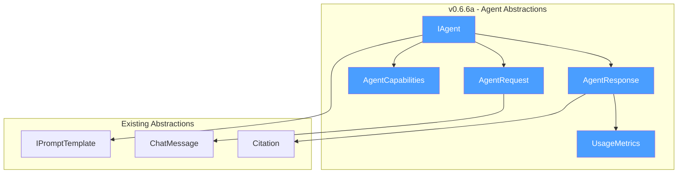
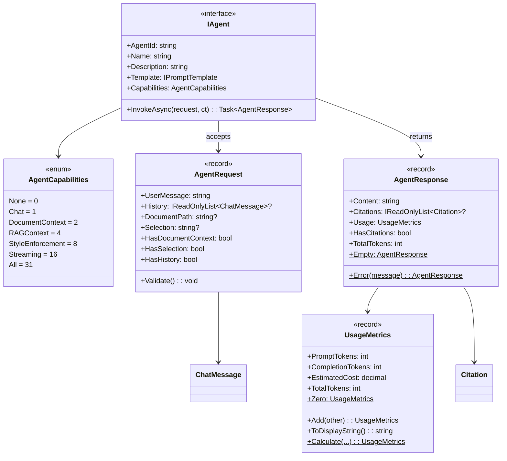
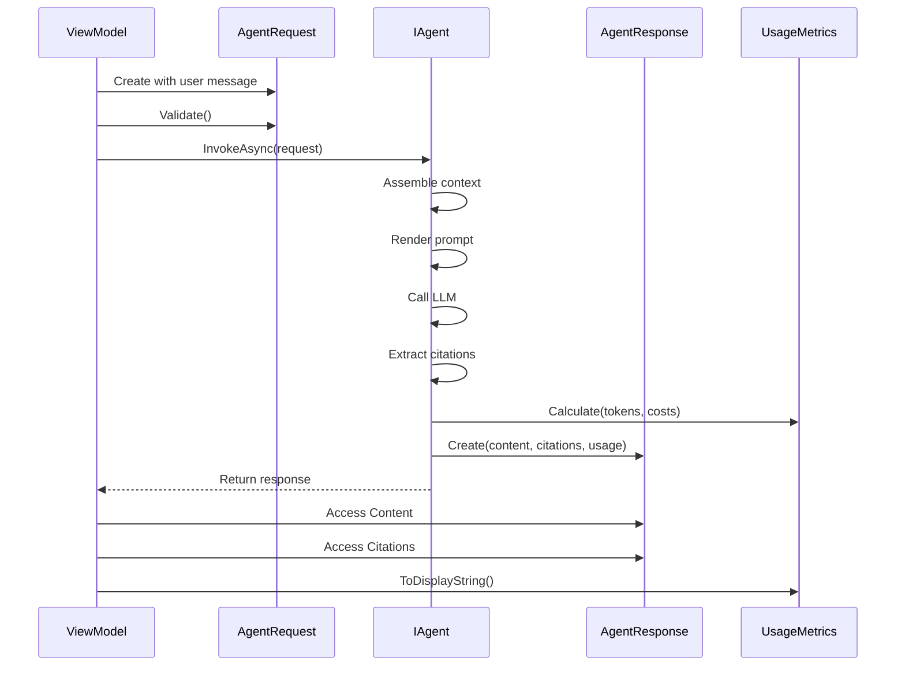

# LCS-DES-066a: Design Specification — Agent Abstractions

## 1. Metadata & Categorization

| Field           | Value                                     |
| :-------------- | :---------------------------------------- |
| **Document ID** | LCS-DES-066a                              |
| **Version**     | v0.6.6a                                   |
| **Status**      | Draft                                     |
| **Category**    | Core Abstractions                         |
| **Module**      | Lexichord.Abstractions                    |
| **Created**     | 2026-01-28                                |
| **Author**      | Documentation Agent                       |
| **Parent**      | [LCS-DES-066-INDEX](LCS-DES-066-INDEX.md) |

---

## 2. Executive Summary

### 2.1 The Requirement

Lexichord's AI capabilities are currently distributed across multiple services without a unified abstraction. Each feature (chat, context injection, style enforcement) operates independently, making it difficult to compose them into a cohesive user experience. A standardized agent contract is needed to:

- Define a common interface for all AI-powered assistants
- Enable capability discovery for feature gating
- Standardize request/response patterns for consistent error handling
- Support extensibility for future specialized agents

### 2.2 The Proposed Solution

Define a comprehensive agent abstraction layer consisting of:

1. **`IAgent`** — Core interface defining the contract for all agent implementations
2. **`AgentCapabilities`** — Flags enum for feature discovery and UI adaptation
3. **`AgentRequest`** — Immutable record capturing all invocation parameters
4. **`AgentResponse`** — Immutable record with content, citations, and usage metrics
5. **`UsageMetrics`** — Record for transparent token and cost tracking

These primitives establish the foundation for the entire agent framework in v0.6.6 and beyond.

---

## 3. Architecture & Modular Strategy

### 3.1 Component Placement

```text
Lexichord.Abstractions/
└── Agents/
    ├── IAgent.cs
    ├── AgentCapabilities.cs
    ├── AgentRequest.cs
    ├── AgentResponse.cs
    └── UsageMetrics.cs
```

The abstractions are placed in `Lexichord.Abstractions` to ensure they can be referenced by both the implementation modules and any external consumers (plugins, extensions) without creating circular dependencies.

### 3.2 Dependency Graph



### 3.3 Licensing Behavior

The agent abstractions themselves have no license gating—they define contracts that can be implemented at any license tier. License enforcement occurs at the implementation level (e.g., `CoPilotAgent` requires `WriterPro`).

---

## 4. Data Contract (The API)

### 4.1 IAgent Interface

```csharp
namespace Lexichord.Abstractions.Agents;

/// <summary>
/// Contract for all agent implementations in Lexichord.
/// </summary>
/// <remarks>
/// <para>
/// Agents are the primary abstraction for AI-powered assistants in Lexichord.
/// Each agent encapsulates a specific set of capabilities (chat, document analysis,
/// style enforcement, etc.) and exposes them through a unified invocation pattern.
/// </para>
/// <para>
/// Implementations should be stateless between invocations. Conversation state is
/// managed externally and passed via <see cref="AgentRequest.History"/>.
/// </para>
/// <para>
/// Agents may be decorated with <see cref="RequiresLicenseAttribute"/> to indicate
/// minimum license tier requirements. The <see cref="IAgentRegistry"/> enforces
/// these requirements during agent discovery and selection.
/// </para>
/// </remarks>
/// <example>
/// <code>
/// [RequiresLicense(LicenseTier.WriterPro)]
/// public class CoPilotAgent : IAgent
/// {
///     public string AgentId => "co-pilot";
///     public string Name => "Co-pilot";
///     public string Description => "General writing assistant";
///
///     public AgentCapabilities Capabilities =>
///         AgentCapabilities.Chat | AgentCapabilities.DocumentContext;
///
///     public async Task&lt;AgentResponse&gt; InvokeAsync(AgentRequest request, CancellationToken ct)
///     {
///         // Implementation
///     }
/// }
/// </code>
/// </example>
public interface IAgent
{
    /// <summary>
    /// Unique identifier for this agent.
    /// </summary>
    /// <remarks>
    /// The agent ID should be lowercase, kebab-case, and stable across versions.
    /// Examples: "co-pilot", "research-assistant", "style-editor".
    /// This ID is used for configuration, telemetry, and user preferences.
    /// </remarks>
    string AgentId { get; }

    /// <summary>
    /// Human-readable name of the agent.
    /// </summary>
    /// <remarks>
    /// Displayed in the agent selector UI and usage reports.
    /// Should be concise (2-3 words max) and descriptive.
    /// </remarks>
    string Name { get; }

    /// <summary>
    /// Description of the agent's purpose and capabilities.
    /// </summary>
    /// <remarks>
    /// Displayed in the agent selector tooltip and help documentation.
    /// Should explain what the agent does and when to use it.
    /// Recommended length: 1-2 sentences.
    /// </remarks>
    string Description { get; }

    /// <summary>
    /// The prompt template used by this agent.
    /// </summary>
    /// <remarks>
    /// Templates are loaded from <see cref="IPromptTemplateRepository"/> and define
    /// the system prompt, context injection points, and output formatting.
    /// The template ID should match a registered template in the repository.
    /// </remarks>
    IPromptTemplate Template { get; }

    /// <summary>
    /// Flags indicating the capabilities of this agent.
    /// </summary>
    /// <remarks>
    /// Used by the UI to adapt available features (show/hide context panel,
    /// enable/disable style enforcement, etc.) and by the registry to filter
    /// agents based on required capabilities.
    /// </remarks>
    AgentCapabilities Capabilities { get; }

    /// <summary>
    /// Invokes the agent with the given request.
    /// </summary>
    /// <remarks>
    /// <para>
    /// This is the primary entry point for agent execution. Implementations should:
    /// </para>
    /// <list type="number">
    ///   <item>Assemble context from document, selection, and RAG sources</item>
    ///   <item>Render the prompt template with assembled context</item>
    ///   <item>Add conversation history to the message stream</item>
    ///   <item>Invoke the LLM completion service</item>
    ///   <item>Extract citations from RAG-sourced content</item>
    ///   <item>Calculate usage metrics</item>
    /// </list>
    /// <para>
    /// Implementations should respect the <paramref name="ct"/> cancellation token
    /// and abort promptly when cancellation is requested.
    /// </para>
    /// </remarks>
    /// <param name="request">The invocation parameters including message and context.</param>
    /// <param name="ct">Cancellation token for aborting the operation.</param>
    /// <returns>The agent response with content, citations, and usage metrics.</returns>
    /// <exception cref="AgentInvocationException">Thrown when the agent fails to process the request.</exception>
    /// <exception cref="OperationCanceledException">Thrown when cancellation is requested.</exception>
    Task<AgentResponse> InvokeAsync(AgentRequest request, CancellationToken ct = default);
}
```

### 4.2 AgentCapabilities Enum

```csharp
namespace Lexichord.Abstractions.Agents;

/// <summary>
/// Flags indicating the capabilities of an agent.
/// </summary>
/// <remarks>
/// <para>
/// Agent capabilities are used for feature discovery and UI adaptation.
/// The UI reads these flags to determine which features to enable or show.
/// </para>
/// <para>
/// Multiple capabilities can be combined using bitwise OR. For example,
/// a fully-featured agent might have:
/// <c>Chat | DocumentContext | RAGContext | StyleEnforcement | Streaming</c>
/// </para>
/// <para>
/// When implementing new agents, carefully consider which capabilities apply.
/// Claiming a capability that isn't fully implemented will lead to user confusion.
/// </para>
/// </remarks>
/// <example>
/// <code>
/// // Minimal chat-only agent
/// AgentCapabilities.Chat
///
/// // Full-featured writing assistant
/// AgentCapabilities.Chat | AgentCapabilities.DocumentContext |
/// AgentCapabilities.RAGContext | AgentCapabilities.StyleEnforcement |
/// AgentCapabilities.Streaming
///
/// // Research agent without document context
/// AgentCapabilities.Chat | AgentCapabilities.RAGContext
/// </code>
/// </example>
[Flags]
public enum AgentCapabilities
{
    /// <summary>
    /// No special capabilities. Base agent with no context awareness.
    /// </summary>
    None = 0,

    /// <summary>
    /// Supports conversational chat with message history.
    /// </summary>
    /// <remarks>
    /// When enabled, the agent can maintain context across multiple turns
    /// within a conversation. The UI will show conversation controls.
    /// </remarks>
    Chat = 1,

    /// <summary>
    /// Can access and reason about document content.
    /// </summary>
    /// <remarks>
    /// When enabled, the agent receives the current document content
    /// (or selection) as part of the context. The UI will show the
    /// document context indicator in the context panel.
    /// </remarks>
    DocumentContext = 2,

    /// <summary>
    /// Uses semantic search for retrieval-augmented generation.
    /// </summary>
    /// <remarks>
    /// When enabled, the agent performs semantic search against the
    /// project's knowledge base to find relevant content. Retrieved
    /// chunks are injected into the prompt context and cited in responses.
    /// </remarks>
    RAGContext = 4,

    /// <summary>
    /// Applies and enforces style rules.
    /// </summary>
    /// <remarks>
    /// When enabled, the agent loads applicable style rules and instructs
    /// the LLM to follow them. The UI will show style context in the
    /// context panel.
    /// </remarks>
    StyleEnforcement = 8,

    /// <summary>
    /// Supports streaming responses.
    /// </summary>
    /// <remarks>
    /// When enabled (and user has Teams license), responses are streamed
    /// token-by-token via <see cref="IStreamingChatHandler"/>. When disabled
    /// or user lacks Teams license, responses are returned in batch.
    /// </remarks>
    Streaming = 16,

    /// <summary>
    /// All standard writing assistant capabilities.
    /// </summary>
    /// <remarks>
    /// Convenience combination for fully-featured writing assistants.
    /// </remarks>
    All = Chat | DocumentContext | RAGContext | StyleEnforcement | Streaming
}
```

### 4.3 AgentCapabilities Extensions

```csharp
namespace Lexichord.Abstractions.Agents;

/// <summary>
/// Extension methods for <see cref="AgentCapabilities"/>.
/// </summary>
public static class AgentCapabilitiesExtensions
{
    /// <summary>
    /// Determines whether the agent has the specified capability.
    /// </summary>
    /// <param name="capabilities">The agent's capabilities.</param>
    /// <param name="capability">The capability to check.</param>
    /// <returns>True if the capability is present.</returns>
    public static bool HasCapability(this AgentCapabilities capabilities, AgentCapabilities capability) =>
        (capabilities & capability) == capability;

    /// <summary>
    /// Determines whether the agent supports any form of context injection.
    /// </summary>
    /// <param name="capabilities">The agent's capabilities.</param>
    /// <returns>True if document, RAG, or style context is supported.</returns>
    public static bool SupportsContext(this AgentCapabilities capabilities) =>
        capabilities.HasCapability(AgentCapabilities.DocumentContext) ||
        capabilities.HasCapability(AgentCapabilities.RAGContext) ||
        capabilities.HasCapability(AgentCapabilities.StyleEnforcement);

    /// <summary>
    /// Returns a human-readable list of capability names.
    /// </summary>
    /// <param name="capabilities">The agent's capabilities.</param>
    /// <returns>Array of capability display names.</returns>
    public static string[] GetCapabilityNames(this AgentCapabilities capabilities)
    {
        var names = new List<string>();

        if (capabilities.HasCapability(AgentCapabilities.Chat))
            names.Add("Chat");
        if (capabilities.HasCapability(AgentCapabilities.DocumentContext))
            names.Add("Document");
        if (capabilities.HasCapability(AgentCapabilities.RAGContext))
            names.Add("RAG");
        if (capabilities.HasCapability(AgentCapabilities.StyleEnforcement))
            names.Add("Style");
        if (capabilities.HasCapability(AgentCapabilities.Streaming))
            names.Add("Streaming");

        return names.ToArray();
    }
}
```

### 4.4 AgentRequest Record

```csharp
namespace Lexichord.Abstractions.Agents;

/// <summary>
/// Immutable record capturing all parameters for an agent invocation.
/// </summary>
/// <remarks>
/// <para>
/// The <see cref="AgentRequest"/> encapsulates everything the agent needs to
/// generate a response: the user's message, conversation history, and
/// context references (document path, selection).
/// </para>
/// <para>
/// This record is immutable by design, ensuring thread-safety when passed
/// between components. Use <c>with</c> expressions to create modified copies.
/// </para>
/// </remarks>
/// <param name="UserMessage">
/// The user's input message. This is the primary content the agent will respond to.
/// Should not be empty or whitespace-only.
/// </param>
/// <param name="History">
/// Optional conversation history for multi-turn dialogues. Messages are ordered
/// chronologically (oldest first). Set to null for single-turn interactions.
/// </param>
/// <param name="DocumentPath">
/// Optional path to the current document for context injection. When provided,
/// agents with <see cref="AgentCapabilities.DocumentContext"/> will load and
/// inject the document content. Set to null if no document context is needed.
/// </param>
/// <param name="Selection">
/// Optional selected text from the document. When provided, the agent focuses
/// on this specific content rather than the entire document. Useful for
/// targeted questions about specific passages.
/// </param>
/// <example>
/// <code>
/// // Simple chat request
/// var request1 = new AgentRequest("What is the hero's journey?");
///
/// // Request with document context
/// var request2 = new AgentRequest(
///     "Summarize this chapter",
///     DocumentPath: "/path/to/chapter1.md"
/// );
///
/// // Request with selection and history
/// var request3 = new AgentRequest(
///     "How can I improve this paragraph?",
///     History: previousMessages,
///     DocumentPath: "/path/to/novel.md",
///     Selection: "The sun set slowly..."
/// );
/// </code>
/// </example>
public record AgentRequest(
    string UserMessage,
    IReadOnlyList<ChatMessage>? History = null,
    string? DocumentPath = null,
    string? Selection = null
)
{
    /// <summary>
    /// Validates the request and throws if invalid.
    /// </summary>
    /// <exception cref="ArgumentException">Thrown if UserMessage is empty.</exception>
    public void Validate()
    {
        if (string.IsNullOrWhiteSpace(UserMessage))
            throw new ArgumentException("User message cannot be empty", nameof(UserMessage));
    }

    /// <summary>
    /// Indicates whether this request includes document context.
    /// </summary>
    public bool HasDocumentContext => !string.IsNullOrEmpty(DocumentPath);

    /// <summary>
    /// Indicates whether this request includes a text selection.
    /// </summary>
    public bool HasSelection => !string.IsNullOrEmpty(Selection);

    /// <summary>
    /// Indicates whether this request includes conversation history.
    /// </summary>
    public bool HasHistory => History is { Count: > 0 };

    /// <summary>
    /// Gets the number of messages in the history.
    /// </summary>
    public int HistoryCount => History?.Count ?? 0;
}
```

### 4.5 AgentResponse Record

```csharp
namespace Lexichord.Abstractions.Agents;

/// <summary>
/// Immutable record containing the results of an agent invocation.
/// </summary>
/// <remarks>
/// <para>
/// The <see cref="AgentResponse"/> encapsulates everything returned by an agent:
/// the generated content, any citations from RAG sources, and usage metrics
/// for transparency and budget tracking.
/// </para>
/// <para>
/// This record is immutable by design, ensuring thread-safety when passed
/// to UI components and telemetry handlers.
/// </para>
/// </remarks>
/// <param name="Content">
/// The generated text response from the agent. May contain markdown formatting,
/// code blocks, and inline citation references (e.g., [1], [2]).
/// </param>
/// <param name="Citations">
/// Optional list of citations referencing source content used in the response.
/// Each citation corresponds to a numbered reference in the content.
/// Set to null if no RAG context was used.
/// </param>
/// <param name="Usage">
/// Token and cost metrics for this invocation. Always populated even if
/// usage tracking is disabled (will contain zero values).
/// </param>
/// <example>
/// <code>
/// // Response with citations
/// var response = new AgentResponse(
///     Content: "The hero's journey [1] consists of three phases...",
///     Citations: [
///         new Citation("Chapter 1", "/docs/chapter1.md", 12, 18)
///     ],
///     Usage: new UsageMetrics(150, 75, 0.0045m)
/// );
///
/// // Response without citations
/// var simpleResponse = new AgentResponse(
///     Content: "Here is my suggestion...",
///     Citations: null,
///     Usage: new UsageMetrics(100, 50, 0.003m)
/// );
/// </code>
/// </example>
public record AgentResponse(
    string Content,
    IReadOnlyList<Citation>? Citations,
    UsageMetrics Usage
)
{
    /// <summary>
    /// Indicates whether this response includes citations.
    /// </summary>
    public bool HasCitations => Citations is { Count: > 0 };

    /// <summary>
    /// Gets the number of citations in this response.
    /// </summary>
    public int CitationCount => Citations?.Count ?? 0;

    /// <summary>
    /// Gets the total token count (prompt + completion).
    /// </summary>
    public int TotalTokens => Usage.TotalTokens;

    /// <summary>
    /// Creates an empty response for error cases.
    /// </summary>
    public static AgentResponse Empty { get; } = new(
        string.Empty,
        null,
        UsageMetrics.Zero);

    /// <summary>
    /// Creates an error response with a message.
    /// </summary>
    /// <param name="errorMessage">The error message to display.</param>
    /// <returns>An AgentResponse containing the error.</returns>
    public static AgentResponse Error(string errorMessage) => new(
        errorMessage,
        null,
        UsageMetrics.Zero);
}
```

### 4.6 UsageMetrics Record

```csharp
namespace Lexichord.Abstractions.Agents;

/// <summary>
/// Immutable record tracking token consumption and estimated costs.
/// </summary>
/// <remarks>
/// <para>
/// Usage metrics provide transparency into AI resource consumption. They are
/// calculated for every agent invocation and displayed to users in the chat
/// panel footer.
/// </para>
/// <para>
/// Cost estimation uses configured pricing for the model used. Actual billing
/// may differ based on provider pricing changes or usage tiers.
/// </para>
/// </remarks>
/// <param name="PromptTokens">
/// Number of tokens in the prompt (system message, context, history, user message).
/// Reported by the LLM provider in the response.
/// </param>
/// <param name="CompletionTokens">
/// Number of tokens in the generated response.
/// Reported by the LLM provider in the response.
/// </param>
/// <param name="EstimatedCost">
/// Estimated cost in USD based on configured model pricing.
/// Calculated as: (PromptTokens / 1000 * promptCost) + (CompletionTokens / 1000 * completionCost)
/// </param>
/// <example>
/// <code>
/// // Typical usage metrics
/// var metrics = new UsageMetrics(
///     PromptTokens: 1500,
///     CompletionTokens: 500,
///     EstimatedCost: 0.045m  // $0.045
/// );
///
/// // Display in UI
/// Console.WriteLine($"Tokens: {metrics.TotalTokens} (~${metrics.EstimatedCost:F4})");
/// // Output: "Tokens: 2000 (~$0.0450)"
/// </code>
/// </example>
public record UsageMetrics(
    int PromptTokens,
    int CompletionTokens,
    decimal EstimatedCost
)
{
    /// <summary>
    /// Total tokens consumed (prompt + completion).
    /// </summary>
    public int TotalTokens => PromptTokens + CompletionTokens;

    /// <summary>
    /// Zero usage metrics for error cases or when tracking is disabled.
    /// </summary>
    public static UsageMetrics Zero { get; } = new(0, 0, 0m);

    /// <summary>
    /// Adds two usage metrics together.
    /// </summary>
    /// <param name="other">The metrics to add.</param>
    /// <returns>Combined usage metrics.</returns>
    public UsageMetrics Add(UsageMetrics other) => new(
        PromptTokens + other.PromptTokens,
        CompletionTokens + other.CompletionTokens,
        EstimatedCost + other.EstimatedCost);

    /// <summary>
    /// Formats the metrics for display.
    /// </summary>
    /// <returns>Formatted string like "1,500 tokens (~$0.0045)".</returns>
    public string ToDisplayString() =>
        $"{TotalTokens:N0} tokens (~${EstimatedCost:F4})";

    /// <summary>
    /// Creates usage metrics from provider response.
    /// </summary>
    /// <param name="promptTokens">Prompt tokens from provider.</param>
    /// <param name="completionTokens">Completion tokens from provider.</param>
    /// <param name="promptCostPer1K">Cost per 1K prompt tokens.</param>
    /// <param name="completionCostPer1K">Cost per 1K completion tokens.</param>
    /// <returns>Calculated usage metrics.</returns>
    public static UsageMetrics Calculate(
        int promptTokens,
        int completionTokens,
        decimal promptCostPer1K,
        decimal completionCostPer1K) => new(
            promptTokens,
            completionTokens,
            (promptTokens / 1000m * promptCostPer1K) +
            (completionTokens / 1000m * completionCostPer1K));
}
```

---

## 5. Implementation Logic

### 5.1 Type Relationship Diagram



### 5.2 Usage Flow



### 5.3 Capability Checking Pattern

```csharp
// Pattern 1: Simple capability check
if (agent.Capabilities.HasCapability(AgentCapabilities.RAGContext))
{
    await InjectRAGContextAsync(context, cancellationToken);
}

// Pattern 2: Multiple capability check
var hasFullContext =
    agent.Capabilities.HasCapability(AgentCapabilities.DocumentContext) &&
    agent.Capabilities.HasCapability(AgentCapabilities.StyleEnforcement);

// Pattern 3: UI adaptation based on capabilities
contextPanelVisible = agent.Capabilities.SupportsContext();
streamingEnabled = agent.Capabilities.HasCapability(AgentCapabilities.Streaming)
                   && licenseContext.Tier >= LicenseTier.Teams;

// Pattern 4: Get display names for UI
var capabilityLabels = agent.Capabilities.GetCapabilityNames();
// Result: ["Chat", "Document", "RAG", "Style"]
```

---

## 6. Data Persistence

This sub-part does not introduce new persistence requirements. All types defined here are:

- **Immutable records** — Used transiently during request/response cycles
- **In-memory only** — No serialization or storage

Persistence of conversation history is handled by `IConversationManager` (v0.6.4c). Usage aggregation for reporting is handled by `UsageTracker` (v0.6.6d).

---

## 7. UI/UX Specifications

### 7.1 Capability Display in Agent Selector

```text
┌──────────────────────────────────────┐
│ ✓ Co-pilot                          │
│   General writing assistant          │
│   [Chat][Document][RAG][Style]  ← Capability badges
└──────────────────────────────────────┘
```

### 7.2 Capability Badge Styling

| Capability       | Badge Color      | Icon (Optional) |
| :--------------- | :--------------- | :-------------- |
| Chat             | Blue (#4a9eff)   | 💬              |
| DocumentContext  | Green (#2d5a27)  | 📄              |
| RAGContext       | Purple (#9b59b6) | 🔍              |
| StyleEnforcement | Orange (#e67e22) | ✏️              |
| Streaming        | Cyan (#00bcd4)   | ⚡              |

### 7.3 Usage Metrics Display

```text
Footer States:
┌─────────────────────────────────────┐
│ No usage:     Tokens: 0             │
│ Normal:       Tokens: 1,247 (~$0.0037) │
│ High usage:   Tokens: 45,892 (~$0.14)  │ ← Amber color
│ At limit:     Tokens: 95,000/100,000   │ ← Red pulsing
└─────────────────────────────────────┘
```

---

## 8. Observability & Logging

### 8.1 Log Events

| Event              | Level | Template                                        |
| :----------------- | :---- | :---------------------------------------------- |
| Request validation | Debug | `AgentRequest validated: {MessageLength} chars` |
| Capability check   | Trace | `Checking capability {Capability}: {HasIt}`     |
| Response created   | Debug | `AgentResponse created: {ContentLength} chars`  |
| Usage calculated   | Debug | `UsageMetrics: {TotalTokens} tokens, {Cost:C4}` |

### 8.2 Telemetry

These types are data-only and don't generate telemetry directly. Telemetry is emitted by the `UsageTracker` service (v0.6.6d) which consumes these types.

---

## 9. Security & Safety

### 9.1 Thread Safety

All types in this sub-part are **immutable records**, making them inherently thread-safe. They can be safely shared across threads without synchronization.

### 9.2 Input Validation

| Type            | Field           | Validation                             |
| :-------------- | :-------------- | :------------------------------------- |
| `AgentRequest`  | `UserMessage`   | Non-empty via `Validate()` method      |
| `AgentRequest`  | `History`       | Null allowed; readonly list if present |
| `AgentRequest`  | `DocumentPath`  | Null allowed; no path traversal check  |
| `AgentResponse` | `Content`       | May be empty for error cases           |
| `UsageMetrics`  | `PromptTokens`  | Non-negative (enforced by provider)    |
| `UsageMetrics`  | `EstimatedCost` | Non-negative (calculated)              |

### 9.3 Sensitive Data

| Field                      | Sensitivity | Handling                         |
| :------------------------- | :---------- | :------------------------------- |
| `AgentRequest.UserMessage` | Medium      | May contain user's creative work |
| `AgentRequest.Selection`   | Medium      | Document excerpts                |
| `AgentResponse.Content`    | Low         | AI-generated, non-sensitive      |

---

## 10. Acceptance Criteria

### AC-066a-01: IAgent Interface

- [ ] `IAgent` defines all required members (AgentId, Name, Description, Template, Capabilities, InvokeAsync)
- [ ] Interface is in `Lexichord.Abstractions.Agents` namespace
- [ ] XML documentation is complete for all members
- [ ] Interface is referenced by implementation modules without circular dependencies

### AC-066a-02: AgentCapabilities Enum

- [ ] All five capabilities defined (Chat, DocumentContext, RAGContext, StyleEnforcement, Streaming)
- [ ] `[Flags]` attribute applied correctly
- [ ] `None` value is 0
- [ ] Combined `All` value includes all capabilities
- [ ] Extension methods work correctly for all flag combinations

### AC-066a-03: AgentRequest Record

- [ ] Immutable record with correct properties
- [ ] `Validate()` throws for empty messages
- [ ] Helper properties (HasDocumentContext, HasSelection, HasHistory) work correctly
- [ ] Record equality works as expected

### AC-066a-04: AgentResponse Record

- [ ] Immutable record with Content, Citations, Usage
- [ ] `Empty` and `Error` factory methods work
- [ ] `HasCitations` and `CitationCount` computed correctly
- [ ] `TotalTokens` delegates to UsageMetrics

### AC-066a-05: UsageMetrics Record

- [ ] Immutable record with PromptTokens, CompletionTokens, EstimatedCost
- [ ] `TotalTokens` computed correctly
- [ ] `Add()` method combines metrics correctly
- [ ] `ToDisplayString()` formats properly
- [ ] `Calculate()` factory computes cost correctly

---

## 11. Unit Tests

```csharp
namespace Lexichord.Abstractions.Tests.Agents;

public class AgentCapabilitiesTests
{
    [Theory]
    [Trait("SubPart", "v0.6.6a")]
    [InlineData(AgentCapabilities.Chat, AgentCapabilities.Chat, true)]
    [InlineData(AgentCapabilities.Chat | AgentCapabilities.RAGContext, AgentCapabilities.Chat, true)]
    [InlineData(AgentCapabilities.Chat, AgentCapabilities.RAGContext, false)]
    [InlineData(AgentCapabilities.All, AgentCapabilities.Streaming, true)]
    public void HasCapability_ReturnsCorrectResult(
        AgentCapabilities capabilities,
        AgentCapabilities check,
        bool expected)
    {
        capabilities.HasCapability(check).Should().Be(expected);
    }

    [Theory]
    [Trait("SubPart", "v0.6.6a")]
    [InlineData(AgentCapabilities.Chat, false)]
    [InlineData(AgentCapabilities.DocumentContext, true)]
    [InlineData(AgentCapabilities.RAGContext, true)]
    [InlineData(AgentCapabilities.StyleEnforcement, true)]
    [InlineData(AgentCapabilities.Chat | AgentCapabilities.DocumentContext, true)]
    public void SupportsContext_ReturnsCorrectResult(AgentCapabilities capabilities, bool expected)
    {
        capabilities.SupportsContext().Should().Be(expected);
    }

    [Fact]
    [Trait("SubPart", "v0.6.6a")]
    public void GetCapabilityNames_ReturnsAllNames()
    {
        var capabilities = AgentCapabilities.All;

        var names = capabilities.GetCapabilityNames();

        names.Should().Contain("Chat");
        names.Should().Contain("Document");
        names.Should().Contain("RAG");
        names.Should().Contain("Style");
        names.Should().Contain("Streaming");
    }
}

public class AgentRequestTests
{
    [Fact]
    [Trait("SubPart", "v0.6.6a")]
    public void Constructor_ValidMessage_CreatesRequest()
    {
        var request = new AgentRequest("Hello");

        request.UserMessage.Should().Be("Hello");
        request.History.Should().BeNull();
        request.DocumentPath.Should().BeNull();
        request.Selection.Should().BeNull();
    }

    [Theory]
    [Trait("SubPart", "v0.6.6a")]
    [InlineData("")]
    [InlineData("   ")]
    [InlineData(null)]
    public void Validate_EmptyMessage_ThrowsArgumentException(string? message)
    {
        var request = new AgentRequest(message ?? "");

        var act = () => request.Validate();

        act.Should().Throw<ArgumentException>();
    }

    [Fact]
    [Trait("SubPart", "v0.6.6a")]
    public void HasDocumentContext_WithPath_ReturnsTrue()
    {
        var request = new AgentRequest("Hello", DocumentPath: "/path/to/doc.md");

        request.HasDocumentContext.Should().BeTrue();
    }

    [Fact]
    [Trait("SubPart", "v0.6.6a")]
    public void HasHistory_WithMessages_ReturnsTrue()
    {
        var history = new[] { new ChatMessage("user", "Hi") };
        var request = new AgentRequest("Hello", History: history);

        request.HasHistory.Should().BeTrue();
        request.HistoryCount.Should().Be(1);
    }
}

public class AgentResponseTests
{
    [Fact]
    [Trait("SubPart", "v0.6.6a")]
    public void Constructor_CreatesImmutableResponse()
    {
        var citations = new[] { new Citation("Ref", "/path", 1, 5) };
        var usage = new UsageMetrics(100, 50, 0.003m);

        var response = new AgentResponse("Content", citations, usage);

        response.Content.Should().Be("Content");
        response.Citations.Should().HaveCount(1);
        response.Usage.Should().Be(usage);
    }

    [Fact]
    [Trait("SubPart", "v0.6.6a")]
    public void Empty_ReturnsEmptyResponse()
    {
        var empty = AgentResponse.Empty;

        empty.Content.Should().BeEmpty();
        empty.Citations.Should().BeNull();
        empty.Usage.Should().Be(UsageMetrics.Zero);
    }

    [Fact]
    [Trait("SubPart", "v0.6.6a")]
    public void Error_CreatesErrorResponse()
    {
        var error = AgentResponse.Error("Something went wrong");

        error.Content.Should().Be("Something went wrong");
        error.HasCitations.Should().BeFalse();
    }
}

public class UsageMetricsTests
{
    [Fact]
    [Trait("SubPart", "v0.6.6a")]
    public void TotalTokens_ReturnsSumOfPromptAndCompletion()
    {
        var metrics = new UsageMetrics(100, 50, 0.003m);

        metrics.TotalTokens.Should().Be(150);
    }

    [Fact]
    [Trait("SubPart", "v0.6.6a")]
    public void Add_CombinesMetricsCorrectly()
    {
        var m1 = new UsageMetrics(100, 50, 0.003m);
        var m2 = new UsageMetrics(200, 100, 0.006m);

        var combined = m1.Add(m2);

        combined.PromptTokens.Should().Be(300);
        combined.CompletionTokens.Should().Be(150);
        combined.EstimatedCost.Should().Be(0.009m);
    }

    [Fact]
    [Trait("SubPart", "v0.6.6a")]
    public void ToDisplayString_FormatsCorrectly()
    {
        var metrics = new UsageMetrics(1500, 500, 0.045m);

        var display = metrics.ToDisplayString();

        display.Should().Contain("2,000");
        display.Should().Contain("$0.0450");
    }

    [Fact]
    [Trait("SubPart", "v0.6.6a")]
    public void Calculate_ComputesCostCorrectly()
    {
        var metrics = UsageMetrics.Calculate(
            promptTokens: 1000,
            completionTokens: 500,
            promptCostPer1K: 0.01m,
            completionCostPer1K: 0.03m);

        // (1000/1000 * 0.01) + (500/1000 * 0.03) = 0.01 + 0.015 = 0.025
        metrics.EstimatedCost.Should().Be(0.025m);
    }
}
```

---

## 12. DI Registration

The types in this sub-part are abstractions and records that do not require DI registration. They are:

- **Interfaces** — Implemented in other sub-parts
- **Enums/Records** — Value types created as needed

The `IAgent` interface is implemented by `CoPilotAgent` (v0.6.6b) and registered there.

---

## 13. Changelog

| Version | Date       | Author              | Changes       |
| :------ | :--------- | :------------------ | :------------ |
| 0.1     | 2026-01-28 | Documentation Agent | Initial draft |
