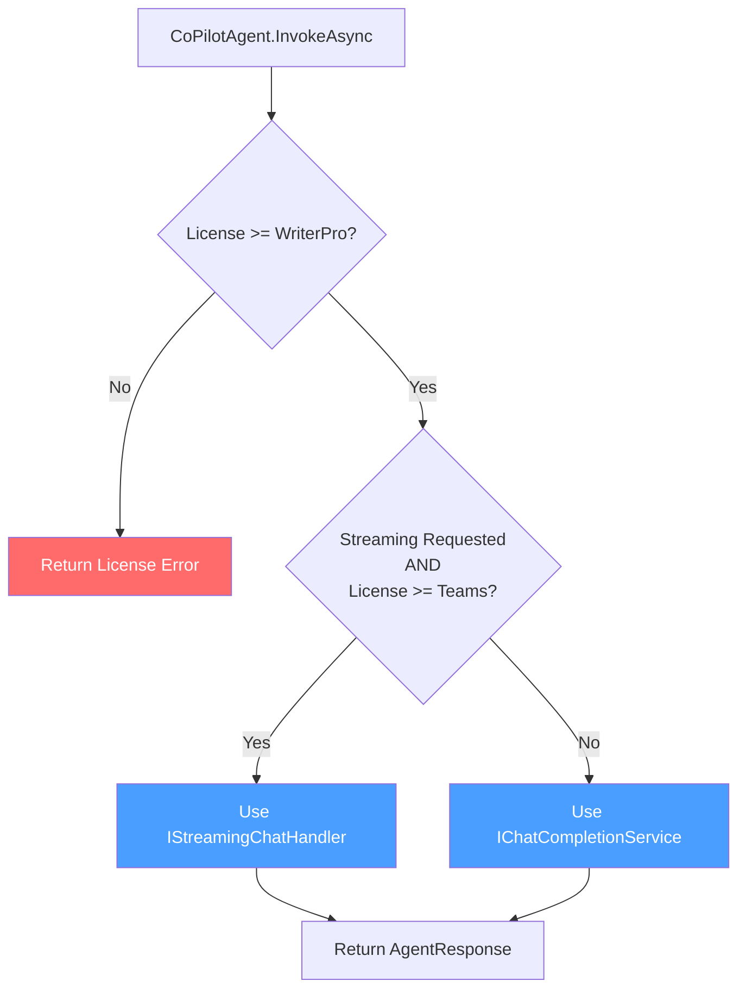
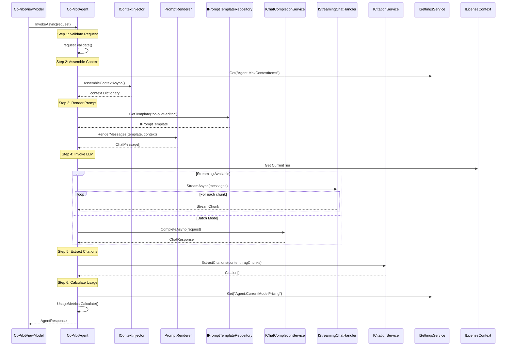
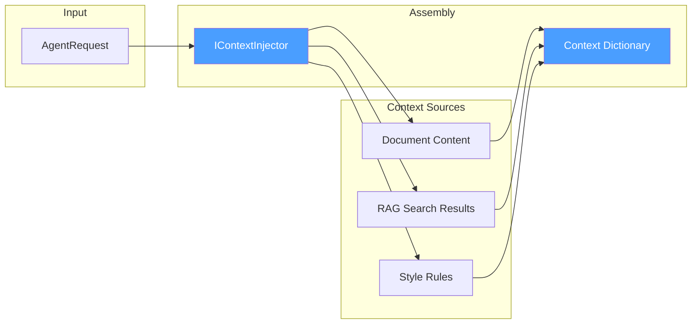

# LCS-DES-066b: Design Specification — Co-pilot Implementation

## 1. Metadata & Categorization

| Field           | Value                                     |
| :-------------- | :---------------------------------------- |
| **Document ID** | LCS-DES-066b                              |
| **Version**     | v0.6.6b                                   |
| **Status**      | Draft                                     |
| **Category**    | Agent Implementation                      |
| **Module**      | Lexichord.Modules.Agents                  |
| **Created**     | 2026-01-28                                |
| **Author**      | Documentation Agent                       |
| **Parent**      | [LCS-DES-066-INDEX](LCS-DES-066-INDEX.md) |

---

## 2. Executive Summary

### 2.1 The Requirement

Lexichord needs a foundational writing assistant that combines all AI capabilities into a cohesive conversational experience. This agent must:

- Seamlessly integrate document context, RAG search, and style enforcement
- Provide accurate citations for retrieved content
- Support both streaming and batch response modes
- Track usage metrics for transparency
- Be gated to WriterPro (and higher) license tiers

### 2.2 The Proposed Solution

Implement `CoPilotAgent`, the foundational writing assistant that:

1. **Implements `IAgent`** — Adheres to the contract defined in v0.6.6a
2. **Orchestrates context assembly** — Uses `IContextInjector` to gather document, RAG, and style context
3. **Renders prompts** — Uses `IPromptRenderer` with the `co-pilot-editor` template
4. **Manages conversation** — Appends history for multi-turn dialogues
5. **Invokes LLM** — Uses `IChatCompletionService` (or streaming handler)
6. **Extracts citations** — Uses `ICitationService` to attribute RAG sources
7. **Calculates usage** — Returns `UsageMetrics` for transparent cost tracking

---

## 3. Architecture & Modular Strategy

### 3.1 Component Placement

```text
Lexichord.Modules.Agents/
└── Chat/
    ├── Agents/
    │   └── CoPilotAgent.cs             ← Primary implementation
    ├── Templates/
    │   └── co-pilot-editor.liquid      ← Prompt template
    └── Extensions/
        └── CoPilotAgentExtensions.cs   ← Helper methods
```

### 3.2 Dependency Graph

```mermaid
graph TB
    subgraph "v0.6.6b - Co-pilot Implementation"
        CPA[CoPilotAgent]
    end

    subgraph "v0.6.6a - Abstractions"
        IA[IAgent]
        AC[AgentCapabilities]
        ARQ[AgentRequest]
        ARS[AgentResponse]
        UM[UsageMetrics]
    end

    subgraph "v0.6.5 - Streaming"
        ISH[IStreamingChatHandler]
    end

    subgraph "v0.6.3 - Template Engine"
        IPR[IPromptRenderer]
        ICI[IContextInjector]
        IPTR[IPromptTemplateRepository]
    end

    subgraph "v0.6.1 - Gateway"
        ICCS[IChatCompletionService]
    end

    subgraph "Domain Services"
        CIT[ICitationService]
        STY[IStyleRuleRepository]
    end

    subgraph "Foundation"
        LIC[ILicenseContext]
        SET[ISettingsService]
        LOG[ILogger]
    end

    CPA --> IA
    CPA --> AC
    CPA --> ARQ
    CPA --> ARS
    CPA --> UM
    CPA --> ICCS
    CPA --> ISH
    CPA --> IPR
    CPA --> ICI
    CPA --> IPTR
    CPA --> CIT
    CPA --> LIC
    CPA --> SET
    CPA --> LOG

    style CPA fill:#4a9eff,color:#fff
```



### 3.3 Licensing Behavior

| Feature               | WriterPro | Teams | Implementation                             |
| :-------------------- | :-------: | :---: | :----------------------------------------- |
| Co-pilot Agent Access |     ✓     |   ✓   | `[RequiresLicense(LicenseTier.WriterPro)]` |
| Document Context      |     ✓     |   ✓   | Always enabled when document provided      |
| RAG Context           |     ✓     |   ✓   | Always enabled when index available        |
| Style Enforcement     |     ✓     |   ✓   | Always enabled when rules exist            |
| Streaming Responses   |     ✗     |   ✓   | Checked at invocation time                 |



---

## 4. Data Contract (The API)

### 4.1 CoPilotAgent Class

```csharp
namespace Lexichord.Modules.Agents.Chat.Agents;

/// <summary>
/// Foundational writing assistant agent that integrates context, style, and RAG.
/// </summary>
/// <remarks>
/// <para>
/// The Co-pilot Agent is Lexichord's primary conversational AI assistant. It orchestrates
/// multiple services to provide context-aware writing assistance:
/// </para>
/// <list type="bullet">
///   <item>Document Context: Includes current document or selection in prompts</item>
///   <item>RAG Context: Performs semantic search for relevant project content</item>
///   <item>Style Enforcement: Loads and applies user-defined style rules</item>
///   <item>Citation Attribution: Tracks and cites sources used in responses</item>
/// </list>
/// <para>
/// This agent requires a WriterPro license or higher. Streaming responses require Teams.
/// </para>
/// </remarks>
/// <example>
/// <code>
/// // Register in DI
/// services.AddScoped&lt;IAgent, CoPilotAgent&gt;();
///
/// // Usage
/// var agent = registry.GetAgent("co-pilot");
/// var response = await agent.InvokeAsync(new AgentRequest(
///     "How can I improve this paragraph?",
///     Selection: selectedText
/// ));
/// </code>
/// </example>
[RequiresLicense(LicenseTier.WriterPro)]
public sealed class CoPilotAgent : IAgent
{
    private readonly IChatCompletionService _chatService;
    private readonly IStreamingChatHandler _streamingHandler;
    private readonly IPromptRenderer _promptRenderer;
    private readonly IContextInjector _contextInjector;
    private readonly IPromptTemplateRepository _templateRepository;
    private readonly ICitationService _citationService;
    private readonly ILicenseContext _licenseContext;
    private readonly ISettingsService _settingsService;
    private readonly ILogger<CoPilotAgent> _logger;

    private const string TemplateId = "co-pilot-editor";
    private const decimal DefaultPromptCostPer1K = 0.01m;
    private const decimal DefaultCompletionCostPer1K = 0.03m;

    /// <summary>
    /// Initializes a new instance of <see cref="CoPilotAgent"/>.
    /// </summary>
    public CoPilotAgent(
        IChatCompletionService chatService,
        IStreamingChatHandler streamingHandler,
        IPromptRenderer promptRenderer,
        IContextInjector contextInjector,
        IPromptTemplateRepository templateRepository,
        ICitationService citationService,
        ILicenseContext licenseContext,
        ISettingsService settingsService,
        ILogger<CoPilotAgent> logger)
    {
        _chatService = chatService;
        _streamingHandler = streamingHandler;
        _promptRenderer = promptRenderer;
        _contextInjector = contextInjector;
        _templateRepository = templateRepository;
        _citationService = citationService;
        _licenseContext = licenseContext;
        _settingsService = settingsService;
        _logger = logger;
    }

    /// <inheritdoc />
    public string AgentId => "co-pilot";

    /// <inheritdoc />
    public string Name => "Co-pilot";

    /// <inheritdoc />
    public string Description =>
        "General writing assistant with document awareness, style enforcement, and semantic search.";

    /// <inheritdoc />
    public IPromptTemplate Template => _templateRepository.GetTemplate(TemplateId);

    /// <inheritdoc />
    public AgentCapabilities Capabilities =>
        AgentCapabilities.Chat |
        AgentCapabilities.DocumentContext |
        AgentCapabilities.RAGContext |
        AgentCapabilities.StyleEnforcement |
        AgentCapabilities.Streaming;

    /// <inheritdoc />
    public async Task<AgentResponse> InvokeAsync(
        AgentRequest request,
        CancellationToken ct = default)
    {
        ArgumentNullException.ThrowIfNull(request);
        request.Validate();

        using var activity = AgentActivitySource.StartActivity("CoPilot.Invoke");
        var stopwatch = Stopwatch.StartNew();

        try
        {
            _logger.LogDebug("CoPilot invocation started: {MessageLength} chars",
                request.UserMessage.Length);

            // 1. Assemble context
            var context = await AssembleContextAsync(request, ct);

            // 2. Render prompt
            var messages = RenderPromptMessages(request, context);

            // 3. Invoke LLM
            var (content, promptTokens, completionTokens) = await InvokeLLMAsync(
                messages, request.HasDocumentContext, ct);

            // 4. Extract citations
            var citations = ExtractCitations(content, context);

            // 5. Calculate usage
            var usage = CalculateUsageMetrics(promptTokens, completionTokens);

            stopwatch.Stop();
            _logger.LogInformation(
                "CoPilot invocation completed: {TotalTokens} tokens in {Duration}ms",
                usage.TotalTokens, stopwatch.ElapsedMilliseconds);

            return new AgentResponse(content, citations, usage);
        }
        catch (OperationCanceledException)
        {
            _logger.LogInformation("CoPilot invocation cancelled");
            throw;
        }
        catch (Exception ex)
        {
            _logger.LogError(ex, "CoPilot invocation failed");
            throw new AgentInvocationException("Failed to process request", ex);
        }
    }
}
```

### 4.2 Context Assembly Methods

```csharp
// Continuation of CoPilotAgent class

/// <summary>
/// Assembles all context for the prompt.
/// </summary>
private async Task<Dictionary<string, object>> AssembleContextAsync(
    AgentRequest request,
    CancellationToken ct)
{
    _logger.LogDebug("Assembling context for CoPilot request");

    var contextRequest = new ContextRequest(
        DocumentPath: request.DocumentPath,
        ProjectPath: null, // Resolved by injector
        Selection: request.Selection,
        IncludeRAG: true,
        IncludeStyle: true,
        MaxRAGChunks: _settingsService.Get("Agent:MaxContextItems", 10),
        StyleConfidenceThreshold: _settingsService.Get("Agent:CitationConfidence", 0.75f)
    );

    try
    {
        var context = await _contextInjector.AssembleContextAsync(contextRequest, ct);

        _logger.LogDebug(
            "Context assembled: {RAGChunks} RAG chunks, {StyleRules} style rules",
            context.GetValueOrDefault("rag_chunks_count", 0),
            context.GetValueOrDefault("style_rules_count", 0));

        return context;
    }
    catch (Exception ex)
    {
        _logger.LogWarning(ex, "Context assembly failed, proceeding with limited context");
        return new Dictionary<string, object>();
    }
}

/// <summary>
/// Renders prompt messages from template and context.
/// </summary>
private IReadOnlyList<ChatMessage> RenderPromptMessages(
    AgentRequest request,
    Dictionary<string, object> context)
{
    // Add user input to context
    context["user_input"] = request.UserMessage;
    context["has_selection"] = request.HasSelection;
    context["selection_text"] = request.Selection ?? string.Empty;

    // Render template
    var templateMessages = _promptRenderer.RenderMessages(Template, context);

    // Prepend conversation history
    if (request.HasHistory)
    {
        var allMessages = new List<ChatMessage>(request.History!);
        allMessages.AddRange(templateMessages);
        return allMessages;
    }

    return templateMessages;
}
```

### 4.3 LLM Invocation Methods

```csharp
// Continuation of CoPilotAgent class

/// <summary>
/// Invokes the LLM and returns content with token counts.
/// </summary>
private async Task<(string Content, int PromptTokens, int CompletionTokens)> InvokeLLMAsync(
    IReadOnlyList<ChatMessage> messages,
    bool hasDocumentContext,
    CancellationToken ct)
{
    var options = new ChatOptions
    {
        Temperature = _settingsService.Get("Agent:Temperature", 0.7f),
        MaxTokens = _settingsService.Get("Agent:MaxResponseTokens", 2000),
        TopP = _settingsService.Get("Agent:TopP", 0.95f)
    };

    // Check if streaming is available and requested
    var streamingEnabled = Capabilities.HasCapability(AgentCapabilities.Streaming) &&
                          _licenseContext.Tier >= LicenseTier.Teams &&
                          _settingsService.Get("Agent:EnableStreaming", true);

    if (streamingEnabled)
    {
        return await InvokeStreamingAsync(messages, options, ct);
    }

    return await InvokeBatchAsync(messages, options, ct);
}

/// <summary>
/// Invokes LLM in batch mode.
/// </summary>
private async Task<(string Content, int PromptTokens, int CompletionTokens)> InvokeBatchAsync(
    IReadOnlyList<ChatMessage> messages,
    ChatOptions options,
    CancellationToken ct)
{
    _logger.LogDebug("Invoking LLM in batch mode: {MessageCount} messages", messages.Count);

    var request = new ChatRequest(messages, options);
    var response = await _chatService.CompleteAsync(request, ct);

    return (response.Content, response.PromptTokens, response.CompletionTokens);
}

/// <summary>
/// Invokes LLM in streaming mode.
/// </summary>
private async Task<(string Content, int PromptTokens, int CompletionTokens)> InvokeStreamingAsync(
    IReadOnlyList<ChatMessage> messages,
    ChatOptions options,
    CancellationToken ct)
{
    _logger.LogDebug("Invoking LLM in streaming mode: {MessageCount} messages", messages.Count);

    var contentBuilder = new StringBuilder();
    var promptTokens = 0;
    var completionTokens = 0;

    await foreach (var chunk in _streamingHandler.StreamAsync(messages, options, ct))
    {
        contentBuilder.Append(chunk.Content);

        // Final chunk contains token counts
        if (chunk.IsFinal)
        {
            promptTokens = chunk.PromptTokens;
            completionTokens = chunk.CompletionTokens;
        }
    }

    return (contentBuilder.ToString(), promptTokens, completionTokens);
}
```

### 4.4 Citation Extraction Methods

```csharp
// Continuation of CoPilotAgent class

/// <summary>
/// Extracts citations from response content based on RAG context.
/// </summary>
private IReadOnlyList<Citation>? ExtractCitations(
    string content,
    Dictionary<string, object> context)
{
    // Check if RAG context was used
    if (!context.TryGetValue("rag_chunks", out var ragChunksObj) ||
        ragChunksObj is not IReadOnlyList<RAGChunk> ragChunks ||
        ragChunks.Count == 0)
    {
        return null;
    }

    try
    {
        var citations = _citationService.ExtractCitations(content, ragChunks);

        if (citations.Count > 0)
        {
            _logger.LogDebug("Extracted {CitationCount} citations from response", citations.Count);
        }

        return citations.Count > 0 ? citations : null;
    }
    catch (Exception ex)
    {
        _logger.LogWarning(ex, "Citation extraction failed, returning without citations");
        return null;
    }
}

/// <summary>
/// Calculates usage metrics from token counts.
/// </summary>
private UsageMetrics CalculateUsageMetrics(int promptTokens, int completionTokens)
{
    var modelPricing = _settingsService.Get<ModelPricing?>("Agent:CurrentModelPricing", null);
    var promptCost = modelPricing?.PromptCostPer1K ?? DefaultPromptCostPer1K;
    var completionCost = modelPricing?.CompletionCostPer1K ?? DefaultCompletionCostPer1K;

    return UsageMetrics.Calculate(promptTokens, completionTokens, promptCost, completionCost);
}
```

### 4.5 AgentInvocationException

```csharp
namespace Lexichord.Modules.Agents.Chat.Exceptions;

/// <summary>
/// Exception thrown when an agent invocation fails.
/// </summary>
/// <remarks>
/// This exception wraps underlying failures (LLM errors, context errors, etc.)
/// to provide a consistent error handling pattern for the UI.
/// </remarks>
public sealed class AgentInvocationException : Exception
{
    /// <summary>
    /// Initializes a new instance of <see cref="AgentInvocationException"/>.
    /// </summary>
    public AgentInvocationException(string message) : base(message) { }

    /// <summary>
    /// Initializes a new instance with an inner exception.
    /// </summary>
    public AgentInvocationException(string message, Exception innerException)
        : base(message, innerException) { }
}
```

---

## 5. Implementation Logic

### 5.1 Agent Invocation Sequence



### 5.2 Context Assembly Flow



### 5.3 Prompt Template Structure

The `co-pilot-editor.liquid` template defines the system prompt and context injection points:

```liquid

Template: co-pilot-editor
Purpose: General writing assistant with full context awareness


[system]
You are a helpful writing assistant for Lexichord, a novel-writing application.
Your role is to help users improve their writing while respecting their creative vision.


## Style Guidelines
The user has defined the following style rules that you must follow:

- **{{ rule.name }}**: {{ rule.description }}




## Current Document Context
The user is currently working on:
**Document**: {{ document_title }}
**Location**: {{ document_path }}


### Selected Text
```

{{ selection_text }}

```




## Relevant Reference Material
The following content from the user's project may be relevant:

[{{ forloop.index }}] From "{{ chunk.source_title }}":
{{ chunk.content }}


When referencing this material, cite it using the format [n].


## Guidelines
1. Be concise and actionable in your suggestions
2. Respect the user's creative voice and intent
3. When suggesting changes, explain your reasoning
4. If referencing project material, cite your sources

[user]
{{ user_input }}
```

### 5.4 Error Recovery Patterns

```csharp
// Pattern 1: Context assembly failure recovery
private async Task<Dictionary<string, object>> AssembleContextWithFallbackAsync(
    AgentRequest request,
    CancellationToken ct)
{
    try
    {
        return await _contextInjector.AssembleContextAsync(
            new ContextRequest(request.DocumentPath, null, request.Selection, true, true), ct);
    }
    catch (SemanticSearchException ex)
    {
        _logger.LogWarning(ex, "RAG search failed, proceeding without RAG context");
        return await _contextInjector.AssembleContextAsync(
            new ContextRequest(request.DocumentPath, null, request.Selection, false, true), ct);
    }
    catch (StyleRuleException ex)
    {
        _logger.LogWarning(ex, "Style rules failed, proceeding without style context");
        return await _contextInjector.AssembleContextAsync(
            new ContextRequest(request.DocumentPath, null, request.Selection, true, false), ct);
    }
    catch (Exception ex)
    {
        _logger.LogWarning(ex, "Full context assembly failed, proceeding with empty context");
        return new Dictionary<string, object>();
    }
}

// Pattern 2: LLM invocation with retry
private async Task<ChatResponse> InvokeWithRetryAsync(
    ChatRequest request,
    CancellationToken ct)
{
    var attempts = 0;
    Exception? lastException = null;

    while (attempts < 3)
    {
        try
        {
            return await _chatService.CompleteAsync(request, ct);
        }
        catch (RateLimitException ex)
        {
            lastException = ex;
            attempts++;
            await Task.Delay(TimeSpan.FromSeconds(Math.Pow(2, attempts)), ct);
        }
    }

    throw new AgentInvocationException("LLM invocation failed after retries", lastException!);
}
```

---

## 6. Data Persistence

This sub-part does not introduce new persistence requirements. The `CoPilotAgent` is:

- **Stateless** — All state is passed via `AgentRequest`
- **Per-request** — New instance for each DI scope (typically per request)

Conversation history persistence is handled by `IConversationManager` (v0.6.4c).

---

## 7. UI/UX Specifications

### 7.1 Agent Invocation States

```text
┌─────────────────────────────────────────────────────────────────┐
│ State: Idle                                                     │
│                                                                 │
│  ┌───────────────────────────────────────────────────────────┐  │
│  │ Type your message...                              [Send]  │  │
│  └───────────────────────────────────────────────────────────┘  │
│  Tokens: 0                              [New Chat] [Export]     │
└─────────────────────────────────────────────────────────────────┘

┌─────────────────────────────────────────────────────────────────┐
│ State: Sending (Batch Mode)                                     │
│                                                                 │
│  ┌────────────────────────────────────────────────────────────┐ │
│  │ 👤 How can I improve this dialogue?              10:45 AM  │ │
│  └────────────────────────────────────────────────────────────┘ │
│                                                                 │
│  ┌────────────────────────────────────────────────────────────┐ │
│  │ 🤖 [████████░░░░░░░░░░░░] Generating...                    │ │
│  └────────────────────────────────────────────────────────────┘ │
│                                                                 │
│  ┌───────────────────────────────────────────────────────────┐  │
│  │ Please wait...                                    [Stop]  │  │
│  └───────────────────────────────────────────────────────────┘  │
└─────────────────────────────────────────────────────────────────┘

┌─────────────────────────────────────────────────────────────────┐
│ State: Streaming (Teams)                                        │
│                                                                 │
│  ┌────────────────────────────────────────────────────────────┐ │
│  │ 👤 How can I improve this dialogue?              10:45 AM  │ │
│  └────────────────────────────────────────────────────────────┘ │
│                                                                 │
│  ┌────────────────────────────────────────────────────────────┐ │
│  │ 🤖 The dialogue in your selection [1] could benefit from   │ │
│  │    more subtext. Consider having the characters...▌        │ │
│  └────────────────────────────────────────────────────────────┘ │
│                                                                 │
│  ┌───────────────────────────────────────────────────────────┐  │
│  │ Streaming...                                      [Stop]  │  │
│  └───────────────────────────────────────────────────────────┘  │
└─────────────────────────────────────────────────────────────────┘

┌─────────────────────────────────────────────────────────────────┐
│ State: Complete                                                 │
│                                                                 │
│  ┌────────────────────────────────────────────────────────────┐ │
│  │ 👤 How can I improve this dialogue?              10:45 AM  │ │
│  └────────────────────────────────────────────────────────────┘ │
│                                                                 │
│  ┌────────────────────────────────────────────────────────────┐ │
│  │ 🤖 The dialogue in your selection [1] could benefit from   │ │
│  │    more subtext. Consider having the characters express    │ │
│  │    their emotions through actions rather than words.       │ │
│  │                                                            │ │
│  │    [1]: Chapter 5, Scene 3 (selection)           10:45 AM │ │
│  └────────────────────────────────────────────────────────────┘ │
│                                                                 │
│  ┌───────────────────────────────────────────────────────────┐  │
│  │ Type your message...                              [Send]  │  │
│  └───────────────────────────────────────────────────────────┘  │
│  Tokens: 847 (~$0.0025)                 [New Chat] [Export]     │
└─────────────────────────────────────────────────────────────────┘
```

### 7.2 Citation Display

```text
Citation inline reference:
┌────────────────────────────────────────────────────────────────┐
│ ... following the hero's journey [1], your protagonist should │
│ face a clear threshold moment [2] before entering the...      │
└────────────────────────────────────────────────────────────────┘

Citation footer:
┌────────────────────────────────────────────────────────────────┐
│ [1]: "The Hero's Journey" (project_notes.md, lines 45-52)     │← Clickable
│ [2]: "Act One Structure" (outline.md, lines 12-18)            │← Clickable
└────────────────────────────────────────────────────────────────┘
```

---

## 8. Observability & Logging

### 8.1 Log Events

| Event                   | Level       | Template                                                             |
| :---------------------- | :---------- | :------------------------------------------------------------------- |
| Invocation start        | Debug       | `CoPilot invocation started: {MessageLength} chars`                  |
| Context assembly start  | Debug       | `Assembling context for CoPilot request`                             |
| Context assembly result | Debug       | `Context assembled: {RAGChunks} chunks, {StyleRules} rules`          |
| Context failure         | Warning     | `Context assembly failed, proceeding with limited context`           |
| LLM invocation mode     | Debug       | `Invoking LLM in {Mode} mode: {MessageCount} messages`               |
| Citation extraction     | Debug       | `Extracted {CitationCount} citations from response`                  |
| Citation failure        | Warning     | `Citation extraction failed, returning without citations`            |
| Invocation complete     | Information | `CoPilot invocation completed: {TotalTokens} tokens in {Duration}ms` |
| Invocation cancelled    | Information | `CoPilot invocation cancelled`                                       |
| Invocation failed       | Error       | `CoPilot invocation failed`                                          |

### 8.2 OpenTelemetry Spans

```
AgentInvocation
├── CoPilot.Invoke
│   ├── Context.Assemble
│   │   ├── RAG.Search
│   │   ├── Style.Load
│   │   └── Document.Read
│   ├── Prompt.Render
│   ├── LLM.Invoke
│   │   └── [Provider specific spans]
│   ├── Citation.Extract
│   └── Usage.Calculate
```

### 8.3 Metrics

| Metric                         | Type      | Labels                 |
| :----------------------------- | :-------- | :--------------------- |
| `agent_invocations_total`      | Counter   | agent_id, status       |
| `agent_invocation_duration`    | Histogram | agent_id, streaming    |
| `agent_tokens_total`           | Counter   | agent_id, token_type   |
| `agent_context_chunks`         | Histogram | agent_id, context_type |
| `agent_citations_per_response` | Histogram | agent_id               |

---

## 9. Security & Safety

### 9.1 Thread Safety

The `CoPilotAgent` is designed to be thread-safe:

- **Immutable dependencies** — All injected services are stateless or thread-safe
- **No shared mutable state** — All local variables are per-invocation
- **Scoped lifetime** — New instance per DI scope prevents state leakage

### 9.2 Input Validation

| Input          | Validation                           | Error Handling                  |
| :------------- | :----------------------------------- | :------------------------------ |
| `request`      | Null check via ArgumentNullException | Throws immediately              |
| `UserMessage`  | Non-empty via `Validate()`           | Throws ArgumentException        |
| `DocumentPath` | Validated by `IContextInjector`      | Fallback to no document context |
| `Selection`    | No validation (optional)             | Empty treated as no selection   |
| `History`      | No validation (readonly list)        | Null treated as no history      |

### 9.3 Sensitive Data Handling

| Data             | Sensitivity | Handling                     |
| :--------------- | :---------- | :--------------------------- |
| User messages    | Medium      | Not logged at Info or higher |
| Document content | Medium      | Truncated in logs            |
| Response content | Low         | AI-generated, safe to log    |
| Token counts     | Low         | Logged for telemetry         |
| Cost estimates   | Low         | Logged for telemetry         |

---

## 10. Acceptance Criteria

### AC-066b-01: Agent Contract Implementation

- [ ] `CoPilotAgent` fully implements `IAgent` interface
- [ ] AgentId is "co-pilot"
- [ ] All five capabilities are declared
- [ ] Template is loaded from repository

### AC-066b-02: Context Assembly

- [ ] Document context is injected when DocumentPath provided
- [ ] RAG context is retrieved and injected
- [ ] Style rules are loaded and injected
- [ ] Failures result in partial context, not errors

### AC-066b-03: Prompt Rendering

- [ ] Template is rendered with all context variables
- [ ] History is prepended to rendered messages
- [ ] User message is properly escaped

### AC-066b-04: LLM Invocation

- [ ] Batch mode works for all license tiers
- [ ] Streaming mode enabled only for Teams
- [ ] Settings (temperature, max tokens) are respected
- [ ] Cancellation token is honored

### AC-066b-05: Citation Extraction

- [ ] Citations are extracted when RAG context present
- [ ] Citation numbers match RAG chunk indices
- [ ] Failures return null citations, not errors

### AC-066b-06: Usage Metrics

- [ ] Prompt and completion tokens are captured
- [ ] Cost is calculated from model pricing
- [ ] UsageMetrics is returned in every response

### AC-066b-07: License Gating

- [ ] Agent requires WriterPro minimum
- [ ] Streaming requires Teams minimum
- [ ] Unauthorized access throws appropriate error

---

## 11. Unit Tests

```csharp
namespace Lexichord.Modules.Agents.Tests.Chat.Agents;

public class CoPilotAgentTests
{
    private readonly Mock<IChatCompletionService> _chatServiceMock = new();
    private readonly Mock<IStreamingChatHandler> _streamingHandlerMock = new();
    private readonly Mock<IPromptRenderer> _promptRendererMock = new();
    private readonly Mock<IContextInjector> _contextInjectorMock = new();
    private readonly Mock<IPromptTemplateRepository> _templateRepoMock = new();
    private readonly Mock<ICitationService> _citationServiceMock = new();
    private readonly Mock<ILicenseContext> _licenseContextMock = new();
    private readonly Mock<ISettingsService> _settingsServiceMock = new();
    private readonly ILogger<CoPilotAgent> _logger = NullLogger<CoPilotAgent>.Instance;

    private CoPilotAgent CreateAgent() => new(
        _chatServiceMock.Object,
        _streamingHandlerMock.Object,
        _promptRendererMock.Object,
        _contextInjectorMock.Object,
        _templateRepoMock.Object,
        _citationServiceMock.Object,
        _licenseContextMock.Object,
        _settingsServiceMock.Object,
        _logger);

    [Fact]
    [Trait("SubPart", "v0.6.6b")]
    public void AgentId_ReturnsCoPilot()
    {
        var agent = CreateAgent();

        agent.AgentId.Should().Be("co-pilot");
    }

    [Fact]
    [Trait("SubPart", "v0.6.6b")]
    public void Capabilities_IncludesAllExpected()
    {
        var agent = CreateAgent();

        agent.Capabilities.Should().HaveFlag(AgentCapabilities.Chat);
        agent.Capabilities.Should().HaveFlag(AgentCapabilities.DocumentContext);
        agent.Capabilities.Should().HaveFlag(AgentCapabilities.RAGContext);
        agent.Capabilities.Should().HaveFlag(AgentCapabilities.StyleEnforcement);
        agent.Capabilities.Should().HaveFlag(AgentCapabilities.Streaming);
    }

    [Fact]
    [Trait("SubPart", "v0.6.6b")]
    public async Task InvokeAsync_ValidRequest_AssemblesContext()
    {
        // Arrange
        var agent = CreateAgent();
        SetupDefaultMocks();
        var request = new AgentRequest("Hello");

        // Act
        await agent.InvokeAsync(request);

        // Assert
        _contextInjectorMock.Verify(x => x.AssembleContextAsync(
            It.IsAny<ContextRequest>(),
            It.IsAny<CancellationToken>()), Times.Once);
    }

    [Fact]
    [Trait("SubPart", "v0.6.6b")]
    public async Task InvokeAsync_ValidRequest_RendersPrompt()
    {
        // Arrange
        var agent = CreateAgent();
        SetupDefaultMocks();
        var request = new AgentRequest("Hello");

        // Act
        await agent.InvokeAsync(request);

        // Assert
        _promptRendererMock.Verify(x => x.RenderMessages(
            It.IsAny<IPromptTemplate>(),
            It.Is<Dictionary<string, object>>(d => d.ContainsKey("user_input"))),
            Times.Once);
    }

    [Fact]
    [Trait("SubPart", "v0.6.6b")]
    public async Task InvokeAsync_BatchMode_UsesChatCompletionService()
    {
        // Arrange
        var agent = CreateAgent();
        SetupDefaultMocks();
        _licenseContextMock.SetupGet(x => x.Tier).Returns(LicenseTier.WriterPro);
        var request = new AgentRequest("Hello");

        // Act
        await agent.InvokeAsync(request);

        // Assert
        _chatServiceMock.Verify(x => x.CompleteAsync(
            It.IsAny<ChatRequest>(),
            It.IsAny<CancellationToken>()), Times.Once);
    }

    [Fact]
    [Trait("SubPart", "v0.6.6b")]
    public async Task InvokeAsync_TeamsLicense_UsesStreaming()
    {
        // Arrange
        var agent = CreateAgent();
        SetupDefaultMocks();
        _licenseContextMock.SetupGet(x => x.Tier).Returns(LicenseTier.Teams);
        _settingsServiceMock.Setup(x => x.Get("Agent:EnableStreaming", true)).Returns(true);
        SetupStreamingMock();
        var request = new AgentRequest("Hello");

        // Act
        await agent.InvokeAsync(request);

        // Assert
        _streamingHandlerMock.Verify(x => x.StreamAsync(
            It.IsAny<IReadOnlyList<ChatMessage>>(),
            It.IsAny<ChatOptions>(),
            It.IsAny<CancellationToken>()), Times.Once);
    }

    [Fact]
    [Trait("SubPart", "v0.6.6b")]
    public async Task InvokeAsync_WithRAGContext_ExtractsCitations()
    {
        // Arrange
        var agent = CreateAgent();
        SetupDefaultMocks();
        var ragChunks = new[] { new RAGChunk("content", "source", 1, 5) };
        _contextInjectorMock.Setup(x => x.AssembleContextAsync(
            It.IsAny<ContextRequest>(), It.IsAny<CancellationToken>()))
            .ReturnsAsync(new Dictionary<string, object> { ["rag_chunks"] = ragChunks });
        var request = new AgentRequest("Hello");

        // Act
        await agent.InvokeAsync(request);

        // Assert
        _citationServiceMock.Verify(x => x.ExtractCitations(
            It.IsAny<string>(),
            It.IsAny<IReadOnlyList<RAGChunk>>()), Times.Once);
    }

    [Fact]
    [Trait("SubPart", "v0.6.6b")]
    public async Task InvokeAsync_ReturnsUsageMetrics()
    {
        // Arrange
        var agent = CreateAgent();
        SetupDefaultMocks();
        _chatServiceMock.Setup(x => x.CompleteAsync(
            It.IsAny<ChatRequest>(), It.IsAny<CancellationToken>()))
            .ReturnsAsync(new ChatResponse("content", 100, 50));
        var request = new AgentRequest("Hello");

        // Act
        var response = await agent.InvokeAsync(request);

        // Assert
        response.Usage.PromptTokens.Should().Be(100);
        response.Usage.CompletionTokens.Should().Be(50);
        response.Usage.TotalTokens.Should().Be(150);
    }

    [Fact]
    [Trait("SubPart", "v0.6.6b")]
    public async Task InvokeAsync_ContextAssemblyFails_ContinuesWithEmptyContext()
    {
        // Arrange
        var agent = CreateAgent();
        SetupDefaultMocks();
        _contextInjectorMock.Setup(x => x.AssembleContextAsync(
            It.IsAny<ContextRequest>(), It.IsAny<CancellationToken>()))
            .ThrowsAsync(new Exception("Context failure"));
        var request = new AgentRequest("Hello");

        // Act
        var response = await agent.InvokeAsync(request);

        // Assert
        response.Should().NotBeNull();
        response.Content.Should().NotBeEmpty();
    }

    [Fact]
    [Trait("SubPart", "v0.6.6b")]
    public async Task InvokeAsync_WithHistory_PrependsToMessages()
    {
        // Arrange
        var agent = CreateAgent();
        SetupDefaultMocks();
        var history = new[] { new ChatMessage("user", "Previous message") };
        var request = new AgentRequest("Hello", History: history);
        IReadOnlyList<ChatMessage>? capturedMessages = null;
        _chatServiceMock.Setup(x => x.CompleteAsync(
            It.IsAny<ChatRequest>(), It.IsAny<CancellationToken>()))
            .Callback<ChatRequest, CancellationToken>((r, _) => capturedMessages = r.Messages)
            .ReturnsAsync(new ChatResponse("content", 100, 50));

        // Act
        await agent.InvokeAsync(request);

        // Assert
        capturedMessages.Should().NotBeNull();
        capturedMessages!.First().Content.Should().Be("Previous message");
    }

    [Fact]
    [Trait("SubPart", "v0.6.6b")]
    public async Task InvokeAsync_Cancellation_ThrowsOperationCanceled()
    {
        // Arrange
        var agent = CreateAgent();
        SetupDefaultMocks();
        var cts = new CancellationTokenSource();
        cts.Cancel();
        var request = new AgentRequest("Hello");

        // Act & Assert
        await Assert.ThrowsAsync<OperationCanceledException>(
            () => agent.InvokeAsync(request, cts.Token));
    }

    private void SetupDefaultMocks()
    {
        _contextInjectorMock.Setup(x => x.AssembleContextAsync(
            It.IsAny<ContextRequest>(), It.IsAny<CancellationToken>()))
            .ReturnsAsync(new Dictionary<string, object>());

        _templateRepoMock.Setup(x => x.GetTemplate(It.IsAny<string>()))
            .Returns(Mock.Of<IPromptTemplate>());

        _promptRendererMock.Setup(x => x.RenderMessages(
            It.IsAny<IPromptTemplate>(), It.IsAny<Dictionary<string, object>>()))
            .Returns(new[] { new ChatMessage("user", "rendered") });

        _chatServiceMock.Setup(x => x.CompleteAsync(
            It.IsAny<ChatRequest>(), It.IsAny<CancellationToken>()))
            .ReturnsAsync(new ChatResponse("response content", 100, 50));

        _licenseContextMock.SetupGet(x => x.Tier).Returns(LicenseTier.WriterPro);

        _settingsServiceMock.Setup(x => x.Get(It.IsAny<string>(), It.IsAny<int>()))
            .Returns((string _, int def) => def);
        _settingsServiceMock.Setup(x => x.Get(It.IsAny<string>(), It.IsAny<float>()))
            .Returns((string _, float def) => def);
        _settingsServiceMock.Setup(x => x.Get(It.IsAny<string>(), It.IsAny<bool>()))
            .Returns((string _, bool def) => def);
    }

    private void SetupStreamingMock()
    {
        _streamingHandlerMock.Setup(x => x.StreamAsync(
            It.IsAny<IReadOnlyList<ChatMessage>>(),
            It.IsAny<ChatOptions>(),
            It.IsAny<CancellationToken>()))
            .Returns(CreateStreamChunks());
    }

    private async IAsyncEnumerable<StreamChunk> CreateStreamChunks()
    {
        yield return new StreamChunk("Hello ", false, 0, 0);
        yield return new StreamChunk("World", true, 100, 50);
        await Task.CompletedTask;
    }
}
```

---

## 12. DI Registration

```csharp
// In AgentsModuleExtensions.cs
public static class AgentsModuleExtensions
{
    public static IServiceCollection AddAgentsModule(this IServiceCollection services)
    {
        // CoPilot Agent
        services.AddScoped<IAgent, CoPilotAgent>();

        return services;
    }
}
```

| Service        | Lifetime | Rationale                                 |
| :------------- | :------- | :---------------------------------------- |
| `CoPilotAgent` | Scoped   | Per-request isolation, respects DI scopes |

---

## 13. Changelog

| Version | Date       | Author              | Changes       |
| :------ | :--------- | :------------------ | :------------ |
| 0.1     | 2026-01-28 | Documentation Agent | Initial draft |
