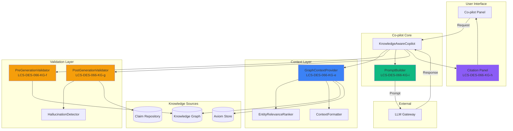
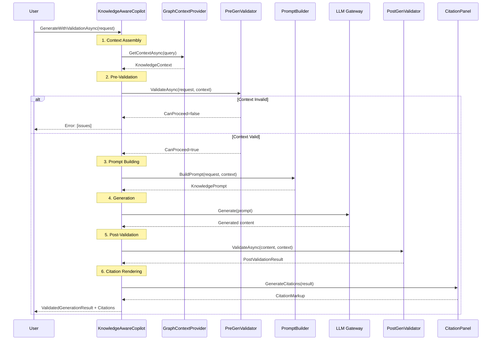

# LCS-DES-066-KG-INDEX: Knowledge-Aware Co-pilot — Design Specifications Index

## Document Control

| Field | Value |
| :--- | :--- |
| **Index ID** | LCS-DES-066-KG-INDEX |
| **System Breakdown** | LCS-SBD-066-KG |
| **Version** | v0.6.6 |
| **Codename** | Knowledge-Aware Co-pilot (CKVS Phase 3b) |
| **Status** | Draft |
| **Last Updated** | 2026-01-31 |

---

## 1. Overview

This index catalogs all design specifications for the **Knowledge-Aware Co-pilot** component of CKVS Phase 3b. This enhancement transforms the Co-pilot from a general-purpose LLM assistant into a domain-aware documentation expert that generates content grounded in verified knowledge.

---

## 2. Sub-Part Specifications

| Spec ID | Title | Est. Hours | Description |
| :------ | :---- | :--------- | :---------- |
| [LCS-DES-066-KG-e](LCS-DES-066-KG-e.md) | Graph Context Provider | 6 | Queries KG for relevant entities and context |
| [LCS-DES-066-KG-f](LCS-DES-066-KG-f.md) | Pre-Generation Validator | 4 | Validates context before LLM call |
| [LCS-DES-066-KG-g](LCS-DES-066-KG-g.md) | Post-Generation Validator | 5 | Validates output, detects hallucinations |
| [LCS-DES-066-KG-h](LCS-DES-066-KG-h.md) | Entity Citation Renderer | 3 | Shows which entities informed response |
| [LCS-DES-066-KG-i](LCS-DES-066-KG-i.md) | Knowledge-Aware Prompts | 4 | Prompt templates with graph context |
| **Total** | | **22** | |

---

## 3. Architecture Diagram



---

## 4. Co-pilot Flow with CKVS



---

## 5. Key Interfaces

### 5.1 IKnowledgeAwareCopilot

```csharp
public interface IKnowledgeAwareCopilot : ICopilotAgent
{
    Task<ValidatedGenerationResult> GenerateWithValidationAsync(
        CopilotRequest request,
        CancellationToken ct = default);
}
```

### 5.2 IKnowledgeContextProvider

```csharp
public interface IKnowledgeContextProvider
{
    Task<KnowledgeContext> GetContextAsync(
        string query,
        KnowledgeContextOptions options,
        CancellationToken ct = default);

    Task<KnowledgeContext> GetContextForEntitiesAsync(
        IReadOnlyList<Guid> entityIds,
        KnowledgeContextOptions options,
        CancellationToken ct = default);
}
```

### 5.3 IPreGenerationValidator / IPostGenerationValidator

```csharp
public interface IPreGenerationValidator
{
    Task<PreValidationResult> ValidateAsync(
        CopilotRequest request,
        KnowledgeContext context,
        CancellationToken ct = default);
}

public interface IPostGenerationValidator
{
    Task<PostValidationResult> ValidateAsync(
        string generatedContent,
        KnowledgeContext context,
        CopilotRequest originalRequest,
        CancellationToken ct = default);
}
```

---

## 6. Grounding Levels

| Level | Behavior |
| :---- | :------- |
| **Strict** | Only facts from context, no inferences |
| **Moderate** | Prefer context, allow marked inferences |
| **Flexible** | Use context as guidance, supplement allowed |

---

## 7. Validation Status Flow

```
┌─────────────────┐     ┌─────────────────┐     ┌─────────────────┐
│   Pre-Validate  │────▶│    Generate     │────▶│  Post-Validate  │
└─────────────────┘     └─────────────────┘     └─────────────────┘
        │                                               │
        ▼                                               ▼
   CanProceed?                                  IsValid?
   ├── Yes ──▶ Continue                         ├── Valid ──▶ ✓ Show
   └── No ──▶ ✗ Block                           ├── Warnings ──▶ ⚠ Show + Warn
                                                └── Invalid ──▶ ✗ Show + Fixes
```

---

## 8. Citation Display Example

```
┌────────────────────────────────────────────────────────────────┐
│ Co-pilot Response                                              │
├────────────────────────────────────────────────────────────────┤
│                                                                │
│ The `/orders` endpoint accepts the following parameters:       │
│                                                                │
│ - `userId` (required): The ID of the user placing the order   │
│ - `items` (required): Array of order items                    │
│ - `coupon` (optional): Discount coupon code                   │
│                                                                │
├────────────────────────────────────────────────────────────────┤
│ 📚 Based on:                                                   │
│ ├── 🔗 Endpoint: POST /orders ✓                               │
│ ├── 📝 Parameter: userId (path) ✓                             │
│ ├── 📝 Parameter: items (body) ✓                              │
│ └── 📝 Parameter: coupon (body) ✓                             │
│                                                                │
│ ✓ Validation passed                                           │
└────────────────────────────────────────────────────────────────┘
```

---

## 9. Performance Targets

| Metric | Target | Measurement |
| :----- | :----- | :---------- |
| Context retrieval | <200ms | P95 timing |
| Pre-validation | <100ms | P95 timing |
| Post-validation | <200ms | P95 timing |
| Total overhead | <500ms | P95 timing |
| Validation pass rate | >90% | Telemetry |

---

## 10. Dependencies

| Component | From | Description |
| :-------- | :--- | :---------- |
| `ICopilotAgent` | v0.6.6 | Base Co-pilot functionality |
| `IValidationEngine` | v0.6.5-KG | Pre/post validation |
| `IGraphRepository` | v0.4.5e | Query entities |
| `IAxiomStore` | v0.4.6-KG | Axiom constraints |
| `IClaimExtractionService` | v0.5.6-KG | Extract claims from output |
| `IEntityLinkingService` | v0.5.5-KG | Link entities in output |

---

## 11. License Gating Summary

| Component | Core | WriterPro | Teams | Enterprise |
| :-------- | :--- | :-------- | :---- | :--------- |
| GraphContextProvider | ❌ | Entity only | Full | Full |
| PreGenerationValidator | ❌ | Basic | Full | Full + custom |
| PostGenerationValidator | ❌ | Basic | Full + hallucination | Full + auto-fix |
| EntityCitationRenderer | ❌ | Basic | Full + details | Full + custom |
| KnowledgeAwarePrompts | ❌ | Default | All | Custom templates |

---

## 12. What This Enables

- **v0.7.5 Unified Validation:** Combined Co-pilot + Editor validation
- **v0.7.6 Sync Service:** Generated content updates graph
- **Expert Co-pilot:** Deep domain knowledge assistance
- **Publication Quality:** AI-assisted content meets standards

---

## 13. Changelog

| Version | Date | Author | Changes |
| :------ | :--- | :----- | :------ |
| 1.0 | 2026-01-31 | Lead Architect | Initial creation |

---
