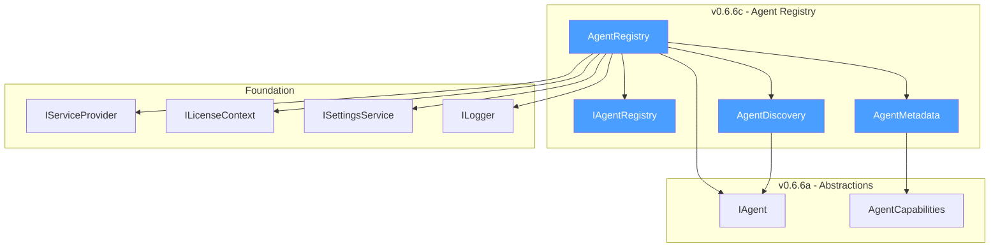
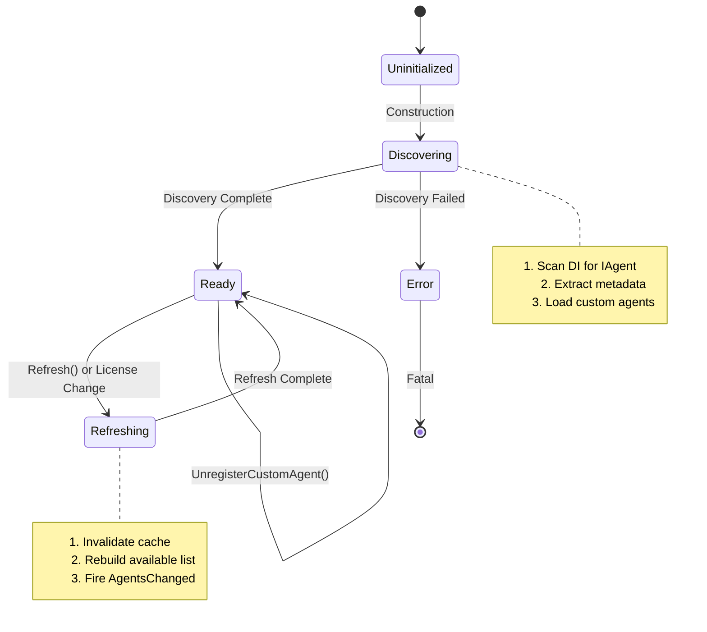
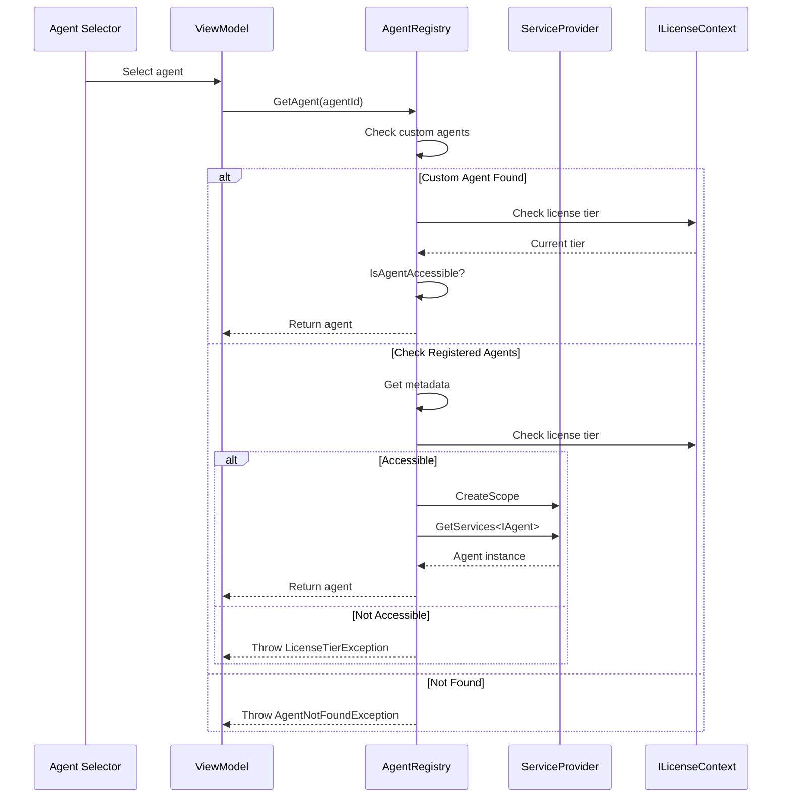
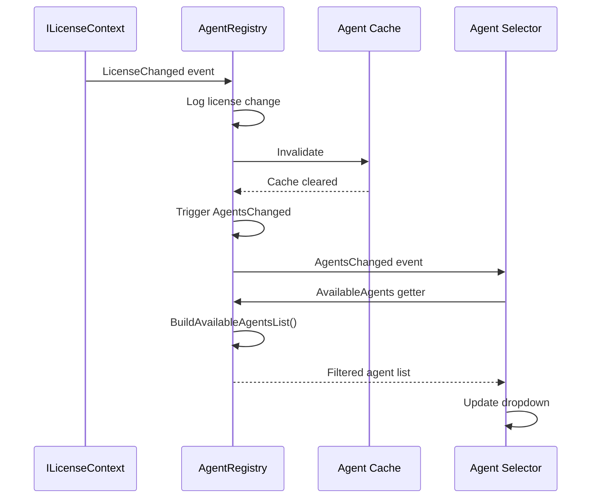

# LCS-DES-066c: Design Specification — Agent Registry

## 1. Metadata & Categorization

| Field           | Value                                     |
| :-------------- | :---------------------------------------- |
| **Document ID** | LCS-DES-066c                              |
| **Version**     | v0.6.6c                                   |
| **Status**      | Draft                                     |
| **Category**    | Service Infrastructure                    |
| **Module**      | Lexichord.Modules.Agents                  |
| **Created**     | 2026-01-28                                |
| **Author**      | Documentation Agent                       |
| **Parent**      | [LCS-DES-066-INDEX](LCS-DES-066-INDEX.md) |

---

## 2. Executive Summary

### 2.1 The Requirement

As Lexichord grows its agent ecosystem (Co-pilot, specialized assistants, future function-calling agents), there needs to be a centralized mechanism for:

- Discovering available agents at runtime
- Filtering agents based on user's license tier
- Providing a default agent for new conversations
- Supporting custom agent registration for Teams users

### 2.2 The Proposed Solution

Implement `IAgentRegistry` and `AgentRegistry`:

1. **`IAgentRegistry`** — Interface for agent discovery and selection
2. **`AgentRegistry`** — Singleton implementation that:
    - Scans DI container for `IAgent` implementations on startup
    - Caches agent metadata for fast lookup
    - Filters agents based on license requirements
    - Supports runtime registration of custom agents (Teams only)

---

## 3. Architecture & Modular Strategy

### 3.1 Component Placement

```text
Lexichord.Abstractions/
└── Agents/
    └── IAgentRegistry.cs           ← Interface definition

Lexichord.Modules.Agents/
└── Chat/
    ├── Registry/
    │   ├── AgentRegistry.cs        ← Primary implementation
    │   ├── AgentMetadata.cs        ← Cached agent information
    │   └── AgentDiscovery.cs       ← Scanning logic
    └── Extensions/
        └── AgentRegistryExtensions.cs
```

### 3.2 Dependency Graph



### 3.3 Licensing Behavior

| Feature                   | WriterPro | Teams | Implementation                         |
| :------------------------ | :-------: | :---: | :------------------------------------- |
| Agent Discovery           |     ✓     |   ✓   | Always available                       |
| Agent Selection           |     ✓     |   ✓   | Filtered by `RequiresLicenseAttribute` |
| Default Agent Config      |     ✓     |   ✓   | Via settings                           |
| Custom Agent Registration |     ✗     |   ✓   | `RegisterCustomAgent` method           |
| Agent Refresh on License  |     ✓     |   ✓   | Auto-refresh on license change         |

---

## 4. Data Contract (The API)

### 4.1 IAgentRegistry Interface

```csharp
namespace Lexichord.Abstractions.Agents;

/// <summary>
/// Registry for discovering and selecting agents.
/// </summary>
/// <remarks>
/// <para>
/// The agent registry provides a centralized way to discover and access
/// available agents. It handles license-based filtering and provides
/// a consistent way to get the default agent for new conversations.
/// </para>
/// <para>
/// The registry is populated on startup by scanning for <see cref="IAgent"/>
/// implementations registered in the DI container. It then filters these
/// based on the user's license tier.
/// </para>
/// <para>
/// Teams users can register custom agents at runtime using
/// <see cref="RegisterCustomAgent"/>. These agents are persisted in
/// user settings and loaded on subsequent startups.
/// </para>
/// </remarks>
/// <example>
/// <code>
/// // Get all available agents
/// var agents = registry.AvailableAgents;
///
/// // Get specific agent
/// var coPilot = registry.GetAgent("co-pilot");
///
/// // Get default agent for new conversations
/// var defaultAgent = registry.GetDefaultAgent();
/// </code>
/// </example>
public interface IAgentRegistry
{
    /// <summary>
    /// Gets all agents available to the current user based on license tier.
    /// </summary>
    /// <remarks>
    /// This list is filtered based on the <see cref="RequiresLicenseAttribute"/>
    /// decoration on each agent. Agents requiring a higher tier than the user's
    /// current license are excluded.
    /// </remarks>
    IReadOnlyList<IAgent> AvailableAgents { get; }

    /// <summary>
    /// Gets an agent by its unique identifier.
    /// </summary>
    /// <remarks>
    /// Returns the requested agent if:
    /// 1. The agent exists in the registry
    /// 2. The user's license tier meets the agent's requirements
    ///
    /// If either condition is not met, throws <see cref="AgentNotFoundException"/>
    /// or <see cref="LicenseTierException"/> respectively.
    /// </remarks>
    /// <param name="agentId">The unique identifier of the agent.</param>
    /// <returns>The requested agent.</returns>
    /// <exception cref="AgentNotFoundException">Agent does not exist.</exception>
    /// <exception cref="LicenseTierException">User lacks required license.</exception>
    IAgent GetAgent(string agentId);

    /// <summary>
    /// Tries to get an agent by its unique identifier.
    /// </summary>
    /// <param name="agentId">The unique identifier of the agent.</param>
    /// <param name="agent">The agent if found and accessible, otherwise null.</param>
    /// <returns>True if agent was found and accessible.</returns>
    bool TryGetAgent(string agentId, [MaybeNullWhen(false)] out IAgent agent);

    /// <summary>
    /// Gets the default agent for new conversations.
    /// </summary>
    /// <remarks>
    /// The default agent is determined by:
    /// 1. User preference (Agent:DefaultAgentId setting)
    /// 2. Fallback to "co-pilot" if preference not set or not available
    ///
    /// If neither is available (e.g., user has no valid license), throws
    /// <see cref="NoAgentAvailableException"/>.
    /// </remarks>
    /// <returns>The default agent.</returns>
    /// <exception cref="NoAgentAvailableException">No agents available.</exception>
    IAgent GetDefaultAgent();

    /// <summary>
    /// Registers a custom agent at runtime (Teams only).
    /// </summary>
    /// <remarks>
    /// Custom agents are stored in user settings and loaded on subsequent
    /// application starts. Only Teams users can register custom agents.
    /// </remarks>
    /// <param name="agent">The agent to register.</param>
    /// <exception cref="LicenseTierException">User lacks Teams license.</exception>
    /// <exception cref="AgentAlreadyRegisteredException">Agent ID already exists.</exception>
    void RegisterCustomAgent(IAgent agent);

    /// <summary>
    /// Unregisters a custom agent.
    /// </summary>
    /// <param name="agentId">The ID of the agent to unregister.</param>
    /// <returns>True if the agent was removed.</returns>
    bool UnregisterCustomAgent(string agentId);

    /// <summary>
    /// Refreshes the agent list based on current license tier.
    /// </summary>
    /// <remarks>
    /// Called automatically when the license context changes.
    /// Can be called manually to force a refresh.
    /// </remarks>
    void Refresh();

    /// <summary>
    /// Event raised when the available agents list changes.
    /// </summary>
    event EventHandler<AgentListChangedEventArgs>? AgentsChanged;
}
```

### 4.2 AgentRegistry Implementation

```csharp
namespace Lexichord.Modules.Agents.Chat.Registry;

/// <summary>
/// Default implementation of <see cref="IAgentRegistry"/>.
/// </summary>
/// <remarks>
/// <para>
/// The AgentRegistry is a singleton service that manages the lifecycle of
/// agent discovery and access. It performs the following on initialization:
/// </para>
/// <list type="number">
///   <item>Scans the DI container for IAgent implementations</item>
///   <item>Extracts metadata (AgentId, Name, Capabilities, License requirements)</item>
///   <item>Filters based on current license tier</item>
///   <item>Loads any custom agents from user settings (Teams only)</item>
/// </list>
/// <para>
/// The registry subscribes to license change events and automatically
/// refreshes the available agents when the user's tier changes.
/// </para>
/// </remarks>
public sealed class AgentRegistry : IAgentRegistry, IDisposable
{
    private readonly IServiceProvider _serviceProvider;
    private readonly ILicenseContext _licenseContext;
    private readonly ISettingsService _settingsService;
    private readonly ILogger<AgentRegistry> _logger;

    private readonly ConcurrentDictionary<string, AgentMetadata> _registeredAgents = new();
    private readonly ConcurrentDictionary<string, IAgent> _customAgents = new();
    private readonly object _refreshLock = new();

    private IReadOnlyList<IAgent>? _cachedAvailableAgents;
    private bool _isDisposed;

    /// <summary>
    /// Initializes a new instance of <see cref="AgentRegistry"/>.
    /// </summary>
    public AgentRegistry(
        IServiceProvider serviceProvider,
        ILicenseContext licenseContext,
        ISettingsService settingsService,
        ILogger<AgentRegistry> logger)
    {
        _serviceProvider = serviceProvider;
        _licenseContext = licenseContext;
        _settingsService = settingsService;
        _logger = logger;

        // Subscribe to license changes
        _licenseContext.LicenseChanged += OnLicenseChanged;

        // Initial discovery
        DiscoverAgents();
        LoadCustomAgents();

        _logger.LogInformation("AgentRegistry initialized with {AgentCount} agents",
            _registeredAgents.Count);
    }

    /// <inheritdoc />
    public IReadOnlyList<IAgent> AvailableAgents
    {
        get
        {
            if (_cachedAvailableAgents is null)
            {
                lock (_refreshLock)
                {
                    _cachedAvailableAgents ??= BuildAvailableAgentsList();
                }
            }
            return _cachedAvailableAgents;
        }
    }

    /// <inheritdoc />
    public event EventHandler<AgentListChangedEventArgs>? AgentsChanged;

    /// <inheritdoc />
    public IAgent GetAgent(string agentId)
    {
        ArgumentException.ThrowIfNullOrEmpty(agentId);

        if (TryGetAgent(agentId, out var agent))
        {
            return agent;
        }

        if (_registeredAgents.TryGetValue(agentId, out var metadata))
        {
            throw new LicenseTierException(
                $"Agent '{agentId}' requires {metadata.RequiredLicense} license",
                metadata.RequiredLicense);
        }

        throw new AgentNotFoundException(agentId);
    }

    /// <inheritdoc />
    public bool TryGetAgent(string agentId, [MaybeNullWhen(false)] out IAgent agent)
    {
        agent = null;

        if (string.IsNullOrEmpty(agentId))
            return false;

        // Check custom agents first
        if (_customAgents.TryGetValue(agentId, out agent))
        {
            if (IsAgentAccessible(agent))
            {
                _logger.LogDebug("Retrieved custom agent: {AgentId}", agentId);
                return true;
            }
            agent = null;
            return false;
        }

        // Check registered agents
        if (!_registeredAgents.TryGetValue(agentId, out var metadata))
            return false;

        if (!IsMetadataAccessible(metadata))
            return false;

        // Resolve from DI
        agent = ResolveAgent(agentId);
        if (agent is not null)
        {
            _logger.LogDebug("Retrieved agent: {AgentId}", agentId);
            return true;
        }

        return false;
    }

    /// <inheritdoc />
    public IAgent GetDefaultAgent()
    {
        var defaultId = _settingsService.Get("Agent:DefaultAgentId", "co-pilot");

        if (TryGetAgent(defaultId, out var agent))
        {
            _logger.LogDebug("Returning default agent: {AgentId}", defaultId);
            return agent;
        }

        // Fallback to co-pilot
        if (defaultId != "co-pilot" && TryGetAgent("co-pilot", out agent))
        {
            _logger.LogDebug("Falling back to co-pilot agent");
            return agent;
        }

        // Return any available agent
        var available = AvailableAgents;
        if (available.Count > 0)
        {
            _logger.LogWarning("Default agent not available, using first available: {AgentId}",
                available[0].AgentId);
            return available[0];
        }

        throw new NoAgentAvailableException();
    }

    /// <inheritdoc />
    public void RegisterCustomAgent(IAgent agent)
    {
        ArgumentNullException.ThrowIfNull(agent);

        if (_licenseContext.Tier < LicenseTier.Teams)
        {
            throw new LicenseTierException(
                "Custom agent registration requires Teams license",
                LicenseTier.Teams);
        }

        if (_registeredAgents.ContainsKey(agent.AgentId) ||
            _customAgents.ContainsKey(agent.AgentId))
        {
            throw new AgentAlreadyRegisteredException(agent.AgentId);
        }

        _customAgents[agent.AgentId] = agent;
        SaveCustomAgents();
        InvalidateCache();

        _logger.LogInformation("Registered custom agent: {AgentId}", agent.AgentId);
        OnAgentsChanged(AgentListChangeReason.AgentRegistered);
    }

    /// <inheritdoc />
    public bool UnregisterCustomAgent(string agentId)
    {
        if (_customAgents.TryRemove(agentId, out _))
        {
            SaveCustomAgents();
            InvalidateCache();

            _logger.LogInformation("Unregistered custom agent: {AgentId}", agentId);
            OnAgentsChanged(AgentListChangeReason.AgentUnregistered);
            return true;
        }

        return false;
    }

    /// <inheritdoc />
    public void Refresh()
    {
        _logger.LogDebug("Refreshing agent registry");
        InvalidateCache();
        OnAgentsChanged(AgentListChangeReason.Refreshed);
    }

    /// <summary>
    /// Disposes the registry and unsubscribes from events.
    /// </summary>
    public void Dispose()
    {
        if (_isDisposed) return;

        _licenseContext.LicenseChanged -= OnLicenseChanged;
        _isDisposed = true;
    }
}
```

### 4.3 Agent Discovery Logic

```csharp
// Continuation of AgentRegistry class

/// <summary>
/// Discovers agents from the DI container.
/// </summary>
private void DiscoverAgents()
{
    _logger.LogDebug("Discovering agents from DI container");

    using var scope = _serviceProvider.CreateScope();
    var agents = scope.ServiceProvider.GetServices<IAgent>();

    foreach (var agent in agents)
    {
        var metadata = ExtractMetadata(agent);
        _registeredAgents[agent.AgentId] = metadata;

        _logger.LogDebug(
            "Discovered agent: {AgentId} ({Name}), License: {License}",
            agent.AgentId, agent.Name, metadata.RequiredLicense);
    }
}

/// <summary>
/// Extracts metadata from an agent instance.
/// </summary>
private static AgentMetadata ExtractMetadata(IAgent agent)
{
    var agentType = agent.GetType();
    var licenseAttribute = agentType.GetCustomAttribute<RequiresLicenseAttribute>();
    var requiredLicense = licenseAttribute?.Tier ?? LicenseTier.Free;

    return new AgentMetadata(
        AgentId: agent.AgentId,
        Name: agent.Name,
        Description: agent.Description,
        Capabilities: agent.Capabilities,
        RequiredLicense: requiredLicense,
        AgentType: agentType);
}

/// <summary>
/// Loads custom agents from user settings.
/// </summary>
private void LoadCustomAgents()
{
    if (_licenseContext.Tier < LicenseTier.Teams)
    {
        _logger.LogDebug("Skipping custom agent load (requires Teams license)");
        return;
    }

    var customAgentDefs = _settingsService.Get<CustomAgentDefinition[]?>(
        "Agent:CustomAgents", null);

    if (customAgentDefs is null || customAgentDefs.Length == 0)
    {
        _logger.LogDebug("No custom agents found in settings");
        return;
    }

    foreach (var def in customAgentDefs)
    {
        try
        {
            var agent = CreateCustomAgent(def);
            _customAgents[agent.AgentId] = agent;
            _logger.LogDebug("Loaded custom agent: {AgentId}", agent.AgentId);
        }
        catch (Exception ex)
        {
            _logger.LogWarning(ex, "Failed to load custom agent: {AgentId}", def.AgentId);
        }
    }
}

/// <summary>
/// Saves custom agents to user settings.
/// </summary>
private void SaveCustomAgents()
{
    var definitions = _customAgents.Values
        .Select(a => new CustomAgentDefinition(a.AgentId, a.Name, a.Description))
        .ToArray();

    _settingsService.Set("Agent:CustomAgents", definitions);
}

/// <summary>
/// Builds the filtered list of available agents.
/// </summary>
private IReadOnlyList<IAgent> BuildAvailableAgentsList()
{
    var availableAgents = new List<IAgent>();

    // Add accessible registered agents
    foreach (var (agentId, metadata) in _registeredAgents)
    {
        if (IsMetadataAccessible(metadata))
        {
            var agent = ResolveAgent(agentId);
            if (agent is not null)
            {
                availableAgents.Add(agent);
            }
        }
    }

    // Add accessible custom agents
    foreach (var (_, agent) in _customAgents)
    {
        if (IsAgentAccessible(agent))
        {
            availableAgents.Add(agent);
        }
    }

    return availableAgents.AsReadOnly();
}

/// <summary>
/// Resolves an agent from the DI container.
/// </summary>
private IAgent? ResolveAgent(string agentId)
{
    using var scope = _serviceProvider.CreateScope();
    return scope.ServiceProvider.GetServices<IAgent>()
        .FirstOrDefault(a => a.AgentId == agentId);
}

/// <summary>
/// Checks if agent metadata is accessible to current user.
/// </summary>
private bool IsMetadataAccessible(AgentMetadata metadata) =>
    _licenseContext.Tier >= metadata.RequiredLicense;

/// <summary>
/// Checks if an agent is accessible to current user.
/// </summary>
private bool IsAgentAccessible(IAgent agent)
{
    var licenseAttr = agent.GetType().GetCustomAttribute<RequiresLicenseAttribute>();
    var required = licenseAttr?.Tier ?? LicenseTier.Free;
    return _licenseContext.Tier >= required;
}

/// <summary>
/// Invalidates the cached agent list.
/// </summary>
private void InvalidateCache()
{
    lock (_refreshLock)
    {
        _cachedAvailableAgents = null;
    }
}

/// <summary>
/// Handles license change events.
/// </summary>
private void OnLicenseChanged(object? sender, LicenseChangedEventArgs e)
{
    _logger.LogInformation(
        "License changed from {OldTier} to {NewTier}, refreshing agents",
        e.OldTier, e.NewTier);

    InvalidateCache();
    OnAgentsChanged(AgentListChangeReason.LicenseChanged);
}

/// <summary>
/// Raises the AgentsChanged event.
/// </summary>
private void OnAgentsChanged(AgentListChangeReason reason)
{
    AgentsChanged?.Invoke(this, new AgentListChangedEventArgs(reason, AvailableAgents));
}
```

### 4.4 AgentMetadata Record

```csharp
namespace Lexichord.Modules.Agents.Chat.Registry;

/// <summary>
/// Cached metadata about a registered agent.
/// </summary>
/// <remarks>
/// Metadata is extracted once during discovery and cached to avoid
/// repeated reflection calls. It contains all information needed for
/// filtering and display without resolving the full agent instance.
/// </remarks>
/// <param name="AgentId">Unique identifier for the agent.</param>
/// <param name="Name">Human-readable name of the agent.</param>
/// <param name="Description">Description of the agent's purpose.</param>
/// <param name="Capabilities">Agent capability flags.</param>
/// <param name="RequiredLicense">Minimum license tier required.</param>
/// <param name="AgentType">The concrete agent implementation type.</param>
public record AgentMetadata(
    string AgentId,
    string Name,
    string Description,
    AgentCapabilities Capabilities,
    LicenseTier RequiredLicense,
    Type AgentType
);
```

### 4.5 Event Arguments and Exceptions

```csharp
namespace Lexichord.Abstractions.Agents;

/// <summary>
/// Event arguments for agent list changes.
/// </summary>
public class AgentListChangedEventArgs : EventArgs
{
    public AgentListChangedEventArgs(
        AgentListChangeReason reason,
        IReadOnlyList<IAgent> availableAgents)
    {
        Reason = reason;
        AvailableAgents = availableAgents;
    }

    public AgentListChangeReason Reason { get; }
    public IReadOnlyList<IAgent> AvailableAgents { get; }
}

/// <summary>
/// Reasons for agent list changes.
/// </summary>
public enum AgentListChangeReason
{
    LicenseChanged,
    AgentRegistered,
    AgentUnregistered,
    Refreshed
}

/// <summary>
/// Exception thrown when an agent is not found.
/// </summary>
public class AgentNotFoundException : Exception
{
    public AgentNotFoundException(string agentId)
        : base($"Agent not found: {agentId}")
    {
        AgentId = agentId;
    }

    public string AgentId { get; }
}

/// <summary>
/// Exception thrown when no agents are available.
/// </summary>
public class NoAgentAvailableException : Exception
{
    public NoAgentAvailableException()
        : base("No agents are available for the current license tier") { }
}

/// <summary>
/// Exception thrown when an agent is already registered.
/// </summary>
public class AgentAlreadyRegisteredException : Exception
{
    public AgentAlreadyRegisteredException(string agentId)
        : base($"Agent already registered: {agentId}")
    {
        AgentId = agentId;
    }

    public string AgentId { get; }
}
```

---

## 5. Implementation Logic

### 5.1 Registry State Machine



### 5.2 Agent Resolution Sequence



### 5.3 License Change Flow



---

## 6. Data Persistence

### 6.1 Custom Agent Storage

Custom agents are persisted in the user's settings file:

```json
{
    "Agent": {
        "DefaultAgentId": "co-pilot",
        "CustomAgents": [
            {
                "AgentId": "custom-research",
                "Name": "Research Assistant",
                "Description": "Custom agent for research tasks",
                "TemplateId": "custom-research-template",
                "Capabilities": 5
            }
        ]
    }
}
```

### 6.2 Serialization Strategy

| Data                 | Storage        | Format |
| :------------------- | :------------- | :----- |
| Custom agents        | User settings  | JSON   |
| Default agent ID     | User settings  | String |
| Registered agents    | In-memory only | N/A    |
| Agent metadata cache | In-memory only | N/A    |

---

## 7. UI/UX Specifications

### 7.1 Agent Selector Dropdown

```text
┌─────────────────────────────────────────────────────────┐
│ Agent ▼                                                 │
├─────────────────────────────────────────────────────────┤
│ ✓ Co-pilot                        📄 🔍 ✏️             │
│   General writing assistant                             │
├─────────────────────────────────────────────────────────┤
│   Research Assistant (Custom)     🔍                    │  ← Teams only
│   Focused research tasks                                │
├─────────────────────────────────────────────────────────┤
│   Style Editor                    📄 ✏️    🔒 Teams    │  ← Locked
│   Deep style analysis                                   │
├─────────────────────────────────────────────────────────┤
│   + Add Custom Agent                       🔒 Teams    │
└─────────────────────────────────────────────────────────┘

Legend:
📄 = Document Context
🔍 = RAG Context
✏️ = Style Enforcement
⚡ = Streaming
🔒 = Requires higher license
```

### 7.2 State Transitions

| State          | Visual                                   |
| :------------- | :--------------------------------------- |
| Loading        | Spinner in dropdown                      |
| Available      | Normal list item                         |
| Selected       | Check mark prefix, highlighted row       |
| License Locked | Lock icon, grayed out, "Upgrade" tooltip |
| Custom Agent   | "(Custom)" suffix                        |
| No Agents      | "No agents available" message            |

---

## 8. Observability & Logging

### 8.1 Log Events

| Event                     | Level       | Template                                                   |
| :------------------------ | :---------- | :--------------------------------------------------------- |
| Initialization            | Information | `AgentRegistry initialized with {AgentCount} agents`       |
| Agent discovered          | Debug       | `Discovered agent: {AgentId} ({Name}), License: {License}` |
| Agent retrieved           | Debug       | `Retrieved agent: {AgentId}`                               |
| Custom agent retrieved    | Debug       | `Retrieved custom agent: {AgentId}`                        |
| Default agent returned    | Debug       | `Returning default agent: {AgentId}`                       |
| Default fallback          | Debug       | `Falling back to co-pilot agent`                           |
| First available fallback  | Warning     | `Default agent not available, using first: {AgentId}`      |
| Custom agent registered   | Information | `Registered custom agent: {AgentId}`                       |
| Custom agent unregistered | Information | `Unregistered custom agent: {AgentId}`                     |
| License change refresh    | Information | `License changed from {OldTier} to {NewTier}, refreshing`  |
| Custom agent load fail    | Warning     | `Failed to load custom agent: {AgentId}`                   |
| Registry refresh          | Debug       | `Refreshing agent registry`                                |

### 8.2 Metrics

| Metric                         | Type    | Labels                   |
| :----------------------------- | :------ | :----------------------- |
| `agent_registry_agents_total`  | Gauge   | type (registered/custom) |
| `agent_registry_lookups_total` | Counter | agent_id, result         |
| `agent_registry_refresh_total` | Counter | reason                   |

---

## 9. Security & Safety

### 9.1 Thread Safety

The `AgentRegistry` is designed for concurrent access:

- **ConcurrentDictionary** — Used for all agent collections
- **Lock on cache rebuild** — Prevents duplicate cache builds
- **Immutable return types** — `IReadOnlyList` prevents modification

### 9.2 License Enforcement

| Check Point               | Enforcement                                  |
| :------------------------ | :------------------------------------------- |
| Agent selection           | `IsMetadataAccessible` / `IsAgentAccessible` |
| Custom agent registration | Explicit license tier check                  |
| Custom agent load         | Skip if not Teams tier                       |

---

## 10. Acceptance Criteria

### AC-066c-01: Agent Discovery

- [ ] All `IAgent` implementations are discovered on startup
- [ ] Metadata is correctly extracted (ID, Name, Capabilities, License)
- [ ] Discovery handles missing agents gracefully

### AC-066c-02: License Filtering

- [ ] Agents requiring higher license are hidden from `AvailableAgents`
- [ ] `GetAgent` throws `LicenseTierException` for inaccessible agents
- [ ] Filter updates when license changes

### AC-066c-03: Default Agent

- [ ] Default agent respects user preference
- [ ] Falls back to "co-pilot" if preference not available
- [ ] Falls back to first available if "co-pilot" not available
- [ ] Throws `NoAgentAvailableException` if none available

### AC-066c-04: Custom Agents (Teams)

- [ ] Registration blocked for non-Teams users
- [ ] Custom agents persist to settings
- [ ] Custom agents load on startup
- [ ] Custom agents appear in `AvailableAgents`
- [ ] Unregistration removes from settings

### AC-066c-05: Event Notifications

- [ ] `AgentsChanged` fires on license change
- [ ] `AgentsChanged` fires on agent registration
- [ ] `AgentsChanged` fires on agent unregistration
- [ ] Event includes reason and updated list

---

## 11. Unit Tests

```csharp
namespace Lexichord.Modules.Agents.Tests.Chat.Registry;

public class AgentRegistryTests
{
    private readonly Mock<IServiceProvider> _serviceProviderMock = new();
    private readonly Mock<IServiceScope> _scopeMock = new();
    private readonly Mock<IServiceScopeFactory> _scopeFactoryMock = new();
    private readonly Mock<ILicenseContext> _licenseContextMock = new();
    private readonly Mock<ISettingsService> _settingsServiceMock = new();
    private readonly ILogger<AgentRegistry> _logger = NullLogger<AgentRegistry>.Instance;

    [Fact]
    [Trait("SubPart", "v0.6.6c")]
    public void AvailableAgents_ReturnsFilteredByLicense()
    {
        // Arrange
        var agents = new IAgent[]
        {
            CreateMockAgent("free-agent", LicenseTier.Free),
            CreateMockAgent("pro-agent", LicenseTier.WriterPro),
            CreateMockAgent("teams-agent", LicenseTier.Teams)
        };
        SetupServiceProvider(agents);
        _licenseContextMock.SetupGet(x => x.Tier).Returns(LicenseTier.WriterPro);

        var registry = CreateRegistry();

        // Act
        var available = registry.AvailableAgents;

        // Assert
        available.Should().HaveCount(2);
        available.Should().Contain(a => a.AgentId == "free-agent");
        available.Should().Contain(a => a.AgentId == "pro-agent");
        available.Should().NotContain(a => a.AgentId == "teams-agent");
    }

    [Fact]
    [Trait("SubPart", "v0.6.6c")]
    public void GetAgent_ValidId_ReturnsAgent()
    {
        // Arrange
        var coPilot = CreateMockAgent("co-pilot", LicenseTier.WriterPro);
        SetupServiceProvider(new[] { coPilot });
        _licenseContextMock.SetupGet(x => x.Tier).Returns(LicenseTier.WriterPro);

        var registry = CreateRegistry();

        // Act
        var agent = registry.GetAgent("co-pilot");

        // Assert
        agent.Should().Be(coPilot);
    }

    [Fact]
    [Trait("SubPart", "v0.6.6c")]
    public void GetAgent_UnknownId_ThrowsAgentNotFoundException()
    {
        // Arrange
        SetupServiceProvider(Array.Empty<IAgent>());
        _licenseContextMock.SetupGet(x => x.Tier).Returns(LicenseTier.WriterPro);

        var registry = CreateRegistry();

        // Act & Assert
        var act = () => registry.GetAgent("unknown");
        act.Should().Throw<AgentNotFoundException>();
    }

    [Fact]
    [Trait("SubPart", "v0.6.6c")]
    public void GetAgent_InsufficientLicense_ThrowsLicenseTierException()
    {
        // Arrange
        var teamsAgent = CreateMockAgent("teams-agent", LicenseTier.Teams);
        SetupServiceProvider(new[] { teamsAgent });
        _licenseContextMock.SetupGet(x => x.Tier).Returns(LicenseTier.WriterPro);

        var registry = CreateRegistry();

        // Act & Assert
        var act = () => registry.GetAgent("teams-agent");
        act.Should().Throw<LicenseTierException>();
    }

    [Fact]
    [Trait("SubPart", "v0.6.6c")]
    public void TryGetAgent_ValidId_ReturnsTrue()
    {
        // Arrange
        var agent = CreateMockAgent("test-agent", LicenseTier.Free);
        SetupServiceProvider(new[] { agent });
        _licenseContextMock.SetupGet(x => x.Tier).Returns(LicenseTier.Free);

        var registry = CreateRegistry();

        // Act
        var result = registry.TryGetAgent("test-agent", out var retrieved);

        // Assert
        result.Should().BeTrue();
        retrieved.Should().Be(agent);
    }

    [Fact]
    [Trait("SubPart", "v0.6.6c")]
    public void GetDefaultAgent_ReturnsConfiguredDefault()
    {
        // Arrange
        var coPilot = CreateMockAgent("co-pilot", LicenseTier.WriterPro);
        var custom = CreateMockAgent("custom-agent", LicenseTier.WriterPro);
        SetupServiceProvider(new[] { coPilot, custom });
        _licenseContextMock.SetupGet(x => x.Tier).Returns(LicenseTier.WriterPro);
        _settingsServiceMock.Setup(x => x.Get("Agent:DefaultAgentId", "co-pilot"))
            .Returns("custom-agent");

        var registry = CreateRegistry();

        // Act
        var defaultAgent = registry.GetDefaultAgent();

        // Assert
        defaultAgent.AgentId.Should().Be("custom-agent");
    }

    [Fact]
    [Trait("SubPart", "v0.6.6c")]
    public void GetDefaultAgent_FallsBackToCoPilot()
    {
        // Arrange
        var coPilot = CreateMockAgent("co-pilot", LicenseTier.WriterPro);
        SetupServiceProvider(new[] { coPilot });
        _licenseContextMock.SetupGet(x => x.Tier).Returns(LicenseTier.WriterPro);
        _settingsServiceMock.Setup(x => x.Get("Agent:DefaultAgentId", "co-pilot"))
            .Returns("nonexistent");

        var registry = CreateRegistry();

        // Act
        var defaultAgent = registry.GetDefaultAgent();

        // Assert
        defaultAgent.AgentId.Should().Be("co-pilot");
    }

    [Fact]
    [Trait("SubPart", "v0.6.6c")]
    public void RegisterCustomAgent_Teams_AddsToRegistry()
    {
        // Arrange
        SetupServiceProvider(Array.Empty<IAgent>());
        _licenseContextMock.SetupGet(x => x.Tier).Returns(LicenseTier.Teams);

        var registry = CreateRegistry();
        var customAgent = CreateMockAgent("custom-agent", LicenseTier.Free);

        // Act
        registry.RegisterCustomAgent(customAgent);

        // Assert
        registry.AvailableAgents.Should().Contain(a => a.AgentId == "custom-agent");
    }

    [Fact]
    [Trait("SubPart", "v0.6.6c")]
    public void RegisterCustomAgent_NonTeams_ThrowsLicenseTierException()
    {
        // Arrange
        SetupServiceProvider(Array.Empty<IAgent>());
        _licenseContextMock.SetupGet(x => x.Tier).Returns(LicenseTier.WriterPro);

        var registry = CreateRegistry();
        var customAgent = CreateMockAgent("custom-agent", LicenseTier.Free);

        // Act & Assert
        var act = () => registry.RegisterCustomAgent(customAgent);
        act.Should().Throw<LicenseTierException>();
    }

    [Fact]
    [Trait("SubPart", "v0.6.6c")]
    public void LicenseChanged_RefreshesAvailableAgents()
    {
        // Arrange
        var teamsAgent = CreateMockAgent("teams-agent", LicenseTier.Teams);
        SetupServiceProvider(new[] { teamsAgent });
        _licenseContextMock.SetupGet(x => x.Tier).Returns(LicenseTier.WriterPro);

        var registry = CreateRegistry();
        registry.AvailableAgents.Should().BeEmpty();

        // Act - Simulate license upgrade
        _licenseContextMock.SetupGet(x => x.Tier).Returns(LicenseTier.Teams);
        _licenseContextMock.Raise(x => x.LicenseChanged += null,
            new LicenseChangedEventArgs(LicenseTier.WriterPro, LicenseTier.Teams));

        // Assert
        registry.AvailableAgents.Should().Contain(a => a.AgentId == "teams-agent");
    }

    [Fact]
    [Trait("SubPart", "v0.6.6c")]
    public void AgentsChanged_FiresOnRegistration()
    {
        // Arrange
        SetupServiceProvider(Array.Empty<IAgent>());
        _licenseContextMock.SetupGet(x => x.Tier).Returns(LicenseTier.Teams);

        var registry = CreateRegistry();
        AgentListChangedEventArgs? capturedArgs = null;
        registry.AgentsChanged += (_, e) => capturedArgs = e;

        var customAgent = CreateMockAgent("custom-agent", LicenseTier.Free);

        // Act
        registry.RegisterCustomAgent(customAgent);

        // Assert
        capturedArgs.Should().NotBeNull();
        capturedArgs!.Reason.Should().Be(AgentListChangeReason.AgentRegistered);
    }

    private IAgent CreateMockAgent(string agentId, LicenseTier requiredLicense)
    {
        var mock = new Mock<IAgent>();
        mock.SetupGet(x => x.AgentId).Returns(agentId);
        mock.SetupGet(x => x.Name).Returns(agentId);
        mock.SetupGet(x => x.Description).Returns($"Description for {agentId}");
        mock.SetupGet(x => x.Capabilities).Returns(AgentCapabilities.Chat);

        // Set up the license attribute via a derived type
        if (requiredLicense != LicenseTier.Free)
        {
            // For testing, we inject the tier via the mock's type
            mock.As<ILicenseRequired>().SetupGet(x => x.RequiredTier).Returns(requiredLicense);
        }

        return mock.Object;
    }

    private void SetupServiceProvider(IAgent[] agents)
    {
        _scopeMock.Setup(x => x.ServiceProvider).Returns(_serviceProviderMock.Object);
        _scopeFactoryMock.Setup(x => x.CreateScope()).Returns(_scopeMock.Object);
        _serviceProviderMock.Setup(x => x.GetService(typeof(IServiceScopeFactory)))
            .Returns(_scopeFactoryMock.Object);
        _serviceProviderMock.Setup(x => x.GetService(typeof(IEnumerable<IAgent>)))
            .Returns(agents);
    }

    private AgentRegistry CreateRegistry() => new(
        _serviceProviderMock.Object,
        _licenseContextMock.Object,
        _settingsServiceMock.Object,
        _logger);
}
```

---

## 12. DI Registration

```csharp
// In AgentsModuleExtensions.cs
public static class AgentsModuleExtensions
{
    public static IServiceCollection AddAgentsModule(this IServiceCollection services)
    {
        // Agent implementations
        services.AddScoped<IAgent, CoPilotAgent>();

        // Agent registry (singleton for caching and event handling)
        services.AddSingleton<IAgentRegistry, AgentRegistry>();

        return services;
    }
}
```

| Service         | Lifetime  | Rationale                                |
| :-------------- | :-------- | :--------------------------------------- |
| `AgentRegistry` | Singleton | Shared cache, license event subscription |

---

## 13. Changelog

| Version | Date       | Author              | Changes       |
| :------ | :--------- | :------------------ | :------------ |
| 0.1     | 2026-01-28 | Documentation Agent | Initial draft |
