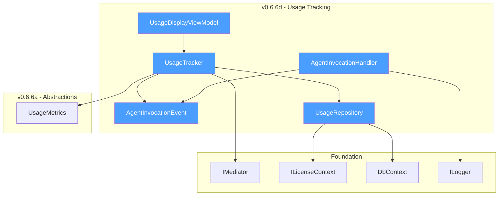
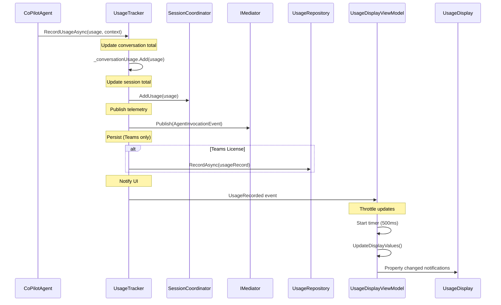
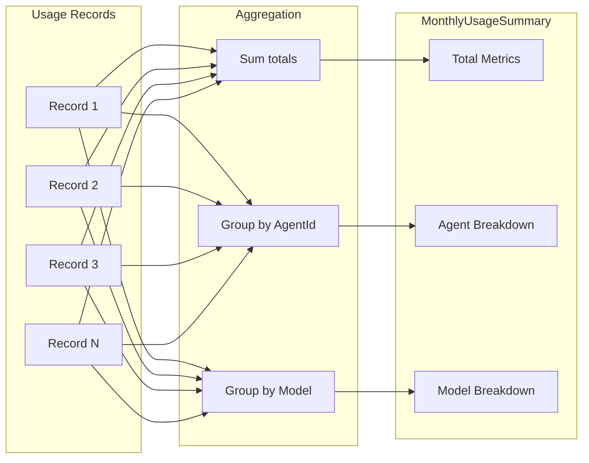
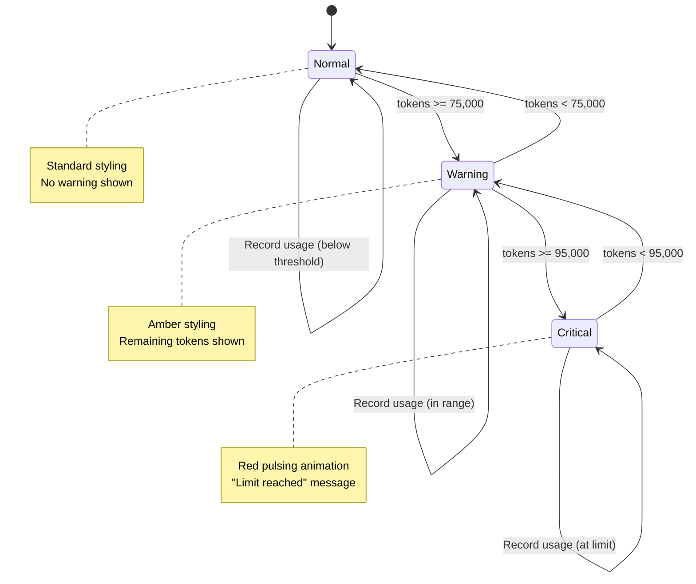

# LCS-DES-066d: Design Specification — Usage Tracking

## 1. Metadata & Categorization

| Field           | Value                                     |
| :-------------- | :---------------------------------------- |
| **Document ID** | LCS-DES-066d                              |
| **Version**     | v0.6.6d                                   |
| **Status**      | Draft                                     |
| **Category**    | Service Infrastructure                    |
| **Module**      | Lexichord.Modules.Agents                  |
| **Created**     | 2026-01-28                                |
| **Author**      | Documentation Agent                       |
| **Parent**      | [LCS-DES-066-INDEX](LCS-DES-066-INDEX.md) |

---

## 2. Executive Summary

### 2.1 The Requirement

Users of AI-powered writing assistants need transparency into their resource consumption. This includes:

- **Per-conversation usage** — Token counts and cost estimates displayed in real-time
- **Session totals** — Accumulated usage across the current editing session
- **Monthly summaries** — Historical usage for budget planning (Teams feature)
- **Telemetry** — Usage events for analytics and optimization

### 2.2 The Proposed Solution

Implement comprehensive usage tracking:

1. **`UsageTracker`** — Service for accumulating and persisting usage metrics
2. **`UsageDisplayViewModel`** — ViewModel for UI binding of usage data
3. **`AgentInvocationEvent`** — MediatR notification for telemetry
4. **Monthly Summary** — Aggregated usage reports for Teams users

---

## 3. Architecture & Modular Strategy

### 3.1 Component Placement

```text
Lexichord.Abstractions/
└── Agents/
    └── Events/
        └── AgentInvocationEvent.cs      ← MediatR notification

Lexichord.Modules.Agents/
└── Chat/
    ├── Services/
    │   └── UsageTracker.cs              ← Usage accumulation
    ├── ViewModels/
    │   └── UsageDisplayViewModel.cs     ← UI binding
    ├── Events/
    │   └── Handlers/
    │       └── AgentInvocationHandler.cs ← Telemetry handler
    └── Persistence/
        └── UsageRepository.cs           ← Monthly data storage
```

### 3.2 Dependency Graph



### 3.3 Licensing Behavior

| Feature                 | WriterPro | Teams | Implementation                  |
| :---------------------- | :-------: | :---: | :------------------------------ |
| Per-conversation Usage  |     ✓     |   ✓   | Always tracked and displayed    |
| Session Totals          |     ✓     |   ✓   | In-memory accumulation          |
| Usage Event Publishing  |     ✓     |   ✓   | MediatR notification            |
| Monthly Summary Access  |     ✗     |   ✓   | `GetMonthlySummaryAsync` method |
| Historical Usage Export |     ✗     |   ✓   | CSV/JSON export                 |
| Usage Alerts            |     ✗     |   ✓   | Configurable thresholds         |

---

## 4. Data Contract (The API)

### 4.1 AgentInvocationEvent Record

```csharp
namespace Lexichord.Abstractions.Agents.Events;

/// <summary>
/// MediatR notification published after each agent invocation.
/// </summary>
/// <remarks>
/// <para>
/// This event is published by <see cref="UsageTracker"/> after recording usage
/// metrics for an agent invocation. It enables:
/// </para>
/// <list type="bullet">
///   <item>Telemetry and analytics collection</item>
///   <item>Real-time usage dashboards</item>
///   <item>Integration with external monitoring systems</item>
/// </list>
/// <para>
/// Handlers should be lightweight and non-blocking to avoid impacting
/// response latency. Consider using background processing for expensive
/// operations.
/// </para>
/// </remarks>
/// <param name="AgentId">Identifier of the invoked agent.</param>
/// <param name="Model">LLM model used for the invocation.</param>
/// <param name="PromptTokens">Number of tokens in the prompt.</param>
/// <param name="CompletionTokens">Number of tokens in the completion.</param>
/// <param name="Duration">Total invocation duration.</param>
/// <param name="Streamed">Whether response was streamed.</param>
/// <example>
/// <code>
/// // Publishing an event
/// await _mediator.Publish(new AgentInvocationEvent(
///     AgentId: "co-pilot",
///     Model: "gpt-4",
///     PromptTokens: 1500,
///     CompletionTokens: 500,
///     Duration: TimeSpan.FromSeconds(2.5),
///     Streamed: true
/// ));
///
/// // Handling the event
/// public class TelemetryHandler : INotificationHandler&lt;AgentInvocationEvent&gt;
/// {
///     public Task Handle(AgentInvocationEvent notification, CancellationToken ct)
///     {
///         _telemetry.TrackEvent("AgentInvocation", new { ... });
///         return Task.CompletedTask;
///     }
/// }
/// </code>
/// </example>
public record AgentInvocationEvent(
    string AgentId,
    string Model,
    int PromptTokens,
    int CompletionTokens,
    TimeSpan Duration,
    bool Streamed
) : INotification
{
    /// <summary>
    /// Total tokens consumed (prompt + completion).
    /// </summary>
    public int TotalTokens => PromptTokens + CompletionTokens;

    /// <summary>
    /// Timestamp when the event was created.
    /// </summary>
    public DateTimeOffset Timestamp { get; init; } = DateTimeOffset.UtcNow;

    /// <summary>
    /// Optional conversation ID for correlation.
    /// </summary>
    public Guid? ConversationId { get; init; }
}
```

### 4.2 UsageTracker Service

```csharp
namespace Lexichord.Modules.Agents.Chat.Services;

/// <summary>
/// Service for tracking and accumulating agent usage metrics.
/// </summary>
/// <remarks>
/// <para>
/// The UsageTracker maintains running totals of token consumption and costs
/// for the current conversation and session. It provides:
/// </para>
/// <list type="bullet">
///   <item>Real-time usage accumulation</item>
///   <item>Event publication for telemetry</item>
///   <item>Monthly summary access (Teams only)</item>
///   <item>Usage persistence for historical tracking</item>
/// </list>
/// <para>
/// This service has scoped lifetime to maintain per-conversation state.
/// Session totals are tracked via a singleton coordinator.
/// </para>
/// </remarks>
/// <example>
/// <code>
/// // Recording usage after agent invocation
/// _usageTracker.RecordUsage(response.Usage, new InvocationContext
/// {
///     AgentId = agent.AgentId,
///     Model = modelId,
///     Duration = stopwatch.Elapsed,
///     Streamed = wasStreamed
/// });
///
/// // Getting current totals
/// var conversationTotal = _usageTracker.ConversationUsage;
/// var sessionTotal = _usageTracker.SessionUsage;
/// </code>
/// </example>
public sealed class UsageTracker : IDisposable
{
    private readonly IMediator _mediator;
    private readonly ILicenseContext _licenseContext;
    private readonly UsageRepository _usageRepository;
    private readonly SessionUsageCoordinator _sessionCoordinator;
    private readonly ILogger<UsageTracker> _logger;

    private readonly object _lock = new();
    private UsageMetrics _conversationUsage = UsageMetrics.Zero;
    private Guid _currentConversationId;
    private string _currentModel = string.Empty;

    /// <summary>
    /// Initializes a new instance of <see cref="UsageTracker"/>.
    /// </summary>
    public UsageTracker(
        IMediator mediator,
        ILicenseContext licenseContext,
        UsageRepository usageRepository,
        SessionUsageCoordinator sessionCoordinator,
        ILogger<UsageTracker> logger)
    {
        _mediator = mediator;
        _licenseContext = licenseContext;
        _usageRepository = usageRepository;
        _sessionCoordinator = sessionCoordinator;
        _logger = logger;
    }

    /// <summary>
    /// Gets the accumulated usage for the current conversation.
    /// </summary>
    public UsageMetrics ConversationUsage
    {
        get
        {
            lock (_lock)
            {
                return _conversationUsage;
            }
        }
    }

    /// <summary>
    /// Gets the accumulated usage for the current session.
    /// </summary>
    public UsageMetrics SessionUsage => _sessionCoordinator.TotalUsage;

    /// <summary>
    /// Gets the current conversation ID.
    /// </summary>
    public Guid ConversationId => _currentConversationId;

    /// <summary>
    /// Event raised when usage is recorded.
    /// </summary>
    public event EventHandler<UsageRecordedEventArgs>? UsageRecorded;

    /// <summary>
    /// Initializes tracking for a new conversation.
    /// </summary>
    /// <param name="conversationId">The ID of the conversation.</param>
    public void StartConversation(Guid conversationId)
    {
        lock (_lock)
        {
            _currentConversationId = conversationId;
            _conversationUsage = UsageMetrics.Zero;
        }

        _logger.LogDebug("Started tracking for conversation: {ConversationId}", conversationId);
    }

    /// <summary>
    /// Records usage from an agent invocation.
    /// </summary>
    /// <param name="usage">The usage metrics to record.</param>
    /// <param name="context">Context about the invocation.</param>
    public async Task RecordUsageAsync(UsageMetrics usage, InvocationContext context)
    {
        ArgumentNullException.ThrowIfNull(usage);
        ArgumentNullException.ThrowIfNull(context);

        lock (_lock)
        {
            _conversationUsage = _conversationUsage.Add(usage);
            _currentModel = context.Model;
        }

        // Update session totals
        _sessionCoordinator.AddUsage(usage);

        _logger.LogDebug(
            "Recorded usage: {PromptTokens}+{CompletionTokens} tokens, {Cost:C4}",
            usage.PromptTokens, usage.CompletionTokens, usage.EstimatedCost);

        // Publish telemetry event
        var invocationEvent = new AgentInvocationEvent(
            context.AgentId,
            context.Model,
            usage.PromptTokens,
            usage.CompletionTokens,
            context.Duration,
            context.Streamed)
        {
            ConversationId = _currentConversationId
        };

        try
        {
            await _mediator.Publish(invocationEvent);
        }
        catch (Exception ex)
        {
            _logger.LogWarning(ex, "Failed to publish AgentInvocationEvent");
        }

        // Persist for monthly summary (Teams only)
        if (_licenseContext.Tier >= LicenseTier.Teams)
        {
            await PersistUsageAsync(usage, context);
        }

        // Notify UI
        OnUsageRecorded(usage);
    }

    /// <summary>
    /// Resets the conversation usage totals.
    /// </summary>
    public void ResetConversation()
    {
        lock (_lock)
        {
            _conversationUsage = UsageMetrics.Zero;
        }

        _logger.LogDebug("Reset conversation usage");
        OnUsageRecorded(UsageMetrics.Zero);
    }

    /// <summary>
    /// Gets the monthly usage summary (Teams only).
    /// </summary>
    /// <param name="month">The month to get summary for.</param>
    /// <param name="ct">Cancellation token.</param>
    /// <returns>Monthly usage summary.</returns>
    /// <exception cref="LicenseTierException">Thrown if user lacks Teams license.</exception>
    public async Task<MonthlyUsageSummary> GetMonthlySummaryAsync(
        DateOnly month,
        CancellationToken ct = default)
    {
        if (_licenseContext.Tier < LicenseTier.Teams)
        {
            throw new LicenseTierException(
                "Monthly usage summary requires Teams license",
                LicenseTier.Teams);
        }

        return await _usageRepository.GetMonthlySummaryAsync(month, ct);
    }

    /// <summary>
    /// Exports usage history (Teams only).
    /// </summary>
    /// <param name="startDate">Start of export period.</param>
    /// <param name="endDate">End of export period.</param>
    /// <param name="format">Export format (csv or json).</param>
    /// <param name="ct">Cancellation token.</param>
    /// <returns>Export data stream.</returns>
    public async Task<Stream> ExportUsageAsync(
        DateOnly startDate,
        DateOnly endDate,
        ExportFormat format,
        CancellationToken ct = default)
    {
        if (_licenseContext.Tier < LicenseTier.Teams)
        {
            throw new LicenseTierException(
                "Usage export requires Teams license",
                LicenseTier.Teams);
        }

        return await _usageRepository.ExportAsync(startDate, endDate, format, ct);
    }

    private async Task PersistUsageAsync(UsageMetrics usage, InvocationContext context)
    {
        try
        {
            await _usageRepository.RecordAsync(new UsageRecord
            {
                Timestamp = DateTimeOffset.UtcNow,
                ConversationId = _currentConversationId,
                AgentId = context.AgentId,
                Model = context.Model,
                PromptTokens = usage.PromptTokens,
                CompletionTokens = usage.CompletionTokens,
                EstimatedCost = usage.EstimatedCost,
                Duration = context.Duration,
                Streamed = context.Streamed
            });
        }
        catch (Exception ex)
        {
            _logger.LogWarning(ex, "Failed to persist usage record");
        }
    }

    private void OnUsageRecorded(UsageMetrics usage)
    {
        UsageRecorded?.Invoke(this, new UsageRecordedEventArgs(
            usage,
            ConversationUsage,
            SessionUsage));
    }

    public void Dispose()
    {
        // No resources to dispose, but implementing for proper pattern
    }
}
```

### 4.3 Supporting Types

```csharp
namespace Lexichord.Modules.Agents.Chat.Services;

/// <summary>
/// Context about an agent invocation for usage tracking.
/// </summary>
public record InvocationContext(
    string AgentId,
    string Model,
    TimeSpan Duration,
    bool Streamed
);

/// <summary>
/// Event arguments for usage recorded events.
/// </summary>
public class UsageRecordedEventArgs : EventArgs
{
    public UsageRecordedEventArgs(
        UsageMetrics thisInvocation,
        UsageMetrics conversationTotal,
        UsageMetrics sessionTotal)
    {
        ThisInvocation = thisInvocation;
        ConversationTotal = conversationTotal;
        SessionTotal = sessionTotal;
    }

    public UsageMetrics ThisInvocation { get; }
    public UsageMetrics ConversationTotal { get; }
    public UsageMetrics SessionTotal { get; }
}

/// <summary>
/// Monthly usage summary (Teams feature).
/// </summary>
public record MonthlyUsageSummary(
    DateOnly Month,
    int TotalInvocations,
    int TotalPromptTokens,
    int TotalCompletionTokens,
    decimal TotalCost,
    Dictionary<string, AgentUsageSummary> ByAgent,
    Dictionary<string, ModelUsageSummary> ByModel
);

/// <summary>
/// Per-agent usage breakdown.
/// </summary>
public record AgentUsageSummary(
    string AgentId,
    int InvocationCount,
    int TotalTokens,
    decimal TotalCost
);

/// <summary>
/// Per-model usage breakdown.
/// </summary>
public record ModelUsageSummary(
    string Model,
    int InvocationCount,
    int TotalTokens,
    decimal TotalCost
);

/// <summary>
/// Export format options.
/// </summary>
public enum ExportFormat
{
    Csv,
    Json
}
```

### 4.4 SessionUsageCoordinator

```csharp
namespace Lexichord.Modules.Agents.Chat.Services;

/// <summary>
/// Singleton coordinator for session-level usage tracking.
/// </summary>
/// <remarks>
/// This singleton maintains the accumulated usage across all conversations
/// in the current application session. It is thread-safe and resets when
/// the application restarts.
/// </remarks>
public sealed class SessionUsageCoordinator
{
    private readonly object _lock = new();
    private UsageMetrics _totalUsage = UsageMetrics.Zero;

    /// <summary>
    /// Gets the total usage for the current session.
    /// </summary>
    public UsageMetrics TotalUsage
    {
        get
        {
            lock (_lock)
            {
                return _totalUsage;
            }
        }
    }

    /// <summary>
    /// Adds usage to the session total.
    /// </summary>
    /// <param name="usage">Usage to add.</param>
    public void AddUsage(UsageMetrics usage)
    {
        lock (_lock)
        {
            _totalUsage = _totalUsage.Add(usage);
        }
    }

    /// <summary>
    /// Resets the session total.
    /// </summary>
    public void Reset()
    {
        lock (_lock)
        {
            _totalUsage = UsageMetrics.Zero;
        }
    }
}
```

### 4.5 UsageDisplayViewModel

```csharp
namespace Lexichord.Modules.Agents.Chat.ViewModels;

/// <summary>
/// ViewModel for displaying usage metrics in the UI.
/// </summary>
/// <remarks>
/// <para>
/// This ViewModel binds to the usage display in the chat panel footer.
/// It subscribes to the <see cref="UsageTracker.UsageRecorded"/> event
/// and throttles UI updates to prevent excessive redraws.
/// </para>
/// <para>
/// The ViewModel provides formatted display strings and visual states
/// based on usage thresholds.
/// </para>
/// </remarks>
public partial class UsageDisplayViewModel : ViewModelBase, IDisposable
{
    private readonly UsageTracker _usageTracker;
    private readonly ISettingsService _settingsService;
    private readonly IDispatcher _dispatcher;
    private readonly Timer _updateThrottle;

    private const int UpdateIntervalMs = 500;
    private bool _pendingUpdate;
    private bool _isDisposed;

    /// <summary>
    /// Initializes a new instance of <see cref="UsageDisplayViewModel"/>.
    /// </summary>
    public UsageDisplayViewModel(
        UsageTracker usageTracker,
        ISettingsService settingsService,
        IDispatcher dispatcher)
    {
        _usageTracker = usageTracker;
        _settingsService = settingsService;
        _dispatcher = dispatcher;

        _updateThrottle = new Timer(OnThrottleElapsed, null, Timeout.Infinite, Timeout.Infinite);
        _usageTracker.UsageRecorded += OnUsageRecorded;

        // Initial values
        UpdateDisplayValues();
    }

    /// <summary>
    /// Gets the formatted token count display.
    /// </summary>
    [ObservableProperty]
    private string _tokenDisplay = "0 tokens";

    /// <summary>
    /// Gets the formatted cost display.
    /// </summary>
    [ObservableProperty]
    private string _costDisplay = "";

    /// <summary>
    /// Gets the current usage state for styling.
    /// </summary>
    [ObservableProperty]
    private UsageDisplayState _displayState = UsageDisplayState.Normal;

    /// <summary>
    /// Gets whether the usage limit warning is visible.
    /// </summary>
    [ObservableProperty]
    private bool _showLimitWarning;

    /// <summary>
    /// Gets the usage limit warning message.
    /// </summary>
    [ObservableProperty]
    private string _limitWarningMessage = "";

    /// <summary>
    /// Gets the progress towards usage limit (0-100).
    /// </summary>
    [ObservableProperty]
    private int _usageProgress;

    private void OnUsageRecorded(object? sender, UsageRecordedEventArgs e)
    {
        // Debounce updates
        if (!_pendingUpdate)
        {
            _pendingUpdate = true;
            _updateThrottle.Change(UpdateIntervalMs, Timeout.Infinite);
        }
    }

    private void OnThrottleElapsed(object? state)
    {
        _pendingUpdate = false;
        _dispatcher.Invoke(UpdateDisplayValues);
    }

    private void UpdateDisplayValues()
    {
        var usage = _usageTracker.ConversationUsage;
        var totalTokens = usage.TotalTokens;

        // Format token count
        TokenDisplay = totalTokens switch
        {
            0 => "0 tokens",
            < 1000 => $"{totalTokens:N0} tokens",
            _ => $"{totalTokens:N0} tokens"
        };

        // Format cost (only show if non-zero)
        CostDisplay = usage.EstimatedCost > 0
            ? $"(~${usage.EstimatedCost:F4})"
            : "";

        // Determine display state based on thresholds
        var warningThreshold = _settingsService.Get("Usage:WarningThreshold", 75000);
        var criticalThreshold = _settingsService.Get("Usage:CriticalThreshold", 95000);
        var limit = _settingsService.Get("Usage:TokenLimit", 100000);

        DisplayState = totalTokens switch
        {
            _ when totalTokens >= criticalThreshold => UsageDisplayState.Critical,
            _ when totalTokens >= warningThreshold => UsageDisplayState.Warning,
            _ => UsageDisplayState.Normal
        };

        // Usage progress and limit warning
        UsageProgress = Math.Min(100, (int)(totalTokens * 100.0 / limit));
        ShowLimitWarning = totalTokens >= warningThreshold;

        if (ShowLimitWarning)
        {
            var remaining = limit - totalTokens;
            LimitWarningMessage = remaining > 0
                ? $"~{remaining:N0} tokens remaining"
                : "Token limit reached";
        }
    }

    public void Dispose()
    {
        if (_isDisposed) return;

        _usageTracker.UsageRecorded -= OnUsageRecorded;
        _updateThrottle.Dispose();
        _isDisposed = true;
    }
}

/// <summary>
/// Visual states for usage display.
/// </summary>
public enum UsageDisplayState
{
    /// <summary>
    /// Normal usage, no concerns.
    /// </summary>
    Normal,

    /// <summary>
    /// Approaching usage limit (75%+).
    /// </summary>
    Warning,

    /// <summary>
    /// Near or at usage limit (95%+).
    /// </summary>
    Critical
}
```

---

## 5. Implementation Logic

### 5.1 Usage Tracking Flow



### 5.2 Monthly Summary Aggregation



### 5.3 Display State Transitions



---

## 6. Data Persistence

### 6.1 UsageRecord Entity

```csharp
namespace Lexichord.Modules.Agents.Chat.Persistence;

/// <summary>
/// Database entity for persisted usage records.
/// </summary>
[Table("usage_records")]
public class UsageRecord
{
    [Key]
    public long Id { get; set; }

    [Required]
    public DateTimeOffset Timestamp { get; set; }

    public Guid ConversationId { get; set; }

    [Required, MaxLength(64)]
    public string AgentId { get; set; } = string.Empty;

    [Required, MaxLength(64)]
    public string Model { get; set; } = string.Empty;

    public int PromptTokens { get; set; }

    public int CompletionTokens { get; set; }

    [Column(TypeName = "decimal(18,6)")]
    public decimal EstimatedCost { get; set; }

    public TimeSpan Duration { get; set; }

    public bool Streamed { get; set; }

    // Computed for indexing
    public int Month => Timestamp.Month + (Timestamp.Year * 100);
}
```

### 6.2 UsageRepository

```csharp
namespace Lexichord.Modules.Agents.Chat.Persistence;

/// <summary>
/// Repository for usage record persistence and queries.
/// </summary>
public class UsageRepository
{
    private readonly AgentsDbContext _dbContext;
    private readonly ILogger<UsageRepository> _logger;

    public UsageRepository(AgentsDbContext dbContext, ILogger<UsageRepository> logger)
    {
        _dbContext = dbContext;
        _logger = logger;
    }

    /// <summary>
    /// Records a usage entry.
    /// </summary>
    public async Task RecordAsync(UsageRecord record, CancellationToken ct = default)
    {
        _dbContext.UsageRecords.Add(record);
        await _dbContext.SaveChangesAsync(ct);

        _logger.LogTrace("Persisted usage record: {Id}", record.Id);
    }

    /// <summary>
    /// Gets monthly summary for the specified month.
    /// </summary>
    public async Task<MonthlyUsageSummary> GetMonthlySummaryAsync(
        DateOnly month,
        CancellationToken ct = default)
    {
        var monthKey = month.Month + (month.Year * 100);

        var records = await _dbContext.UsageRecords
            .Where(r => r.Month == monthKey)
            .ToListAsync(ct);

        var byAgent = records
            .GroupBy(r => r.AgentId)
            .ToDictionary(
                g => g.Key,
                g => new AgentUsageSummary(
                    g.Key,
                    g.Count(),
                    g.Sum(r => r.PromptTokens + r.CompletionTokens),
                    g.Sum(r => r.EstimatedCost)));

        var byModel = records
            .GroupBy(r => r.Model)
            .ToDictionary(
                g => g.Key,
                g => new ModelUsageSummary(
                    g.Key,
                    g.Count(),
                    g.Sum(r => r.PromptTokens + r.CompletionTokens),
                    g.Sum(r => r.EstimatedCost)));

        return new MonthlyUsageSummary(
            month,
            records.Count,
            records.Sum(r => r.PromptTokens),
            records.Sum(r => r.CompletionTokens),
            records.Sum(r => r.EstimatedCost),
            byAgent,
            byModel);
    }

    /// <summary>
    /// Exports usage data for a date range.
    /// </summary>
    public async Task<Stream> ExportAsync(
        DateOnly startDate,
        DateOnly endDate,
        ExportFormat format,
        CancellationToken ct = default)
    {
        var start = startDate.ToDateTime(TimeOnly.MinValue, DateTimeKind.Utc);
        var end = endDate.ToDateTime(TimeOnly.MaxValue, DateTimeKind.Utc);

        var records = await _dbContext.UsageRecords
            .Where(r => r.Timestamp >= start && r.Timestamp <= end)
            .OrderBy(r => r.Timestamp)
            .ToListAsync(ct);

        return format switch
        {
            ExportFormat.Csv => ExportToCsv(records),
            ExportFormat.Json => ExportToJson(records),
            _ => throw new ArgumentOutOfRangeException(nameof(format))
        };
    }

    private static Stream ExportToCsv(List<UsageRecord> records)
    {
        var stream = new MemoryStream();
        var writer = new StreamWriter(stream, Encoding.UTF8);

        writer.WriteLine("Timestamp,ConversationId,AgentId,Model,PromptTokens,CompletionTokens,Cost,Duration,Streamed");

        foreach (var r in records)
        {
            writer.WriteLine($"{r.Timestamp:O},{r.ConversationId},{r.AgentId},{r.Model},{r.PromptTokens},{r.CompletionTokens},{r.EstimatedCost},{r.Duration.TotalSeconds},{r.Streamed}");
        }

        writer.Flush();
        stream.Position = 0;
        return stream;
    }

    private static Stream ExportToJson(List<UsageRecord> records)
    {
        var stream = new MemoryStream();
        JsonSerializer.Serialize(stream, records, new JsonSerializerOptions { WriteIndented = true });
        stream.Position = 0;
        return stream;
    }
}
```

### 6.3 Database Migrations

```csharp
// Migration for usage_records table
public partial class AddUsageRecordsTable : Migration
{
    protected override void Up(MigrationBuilder migrationBuilder)
    {
        migrationBuilder.CreateTable(
            name: "usage_records",
            columns: table => new
            {
                Id = table.Column<long>(type: "INTEGER", nullable: false)
                    .Annotation("Sqlite:Autoincrement", true),
                Timestamp = table.Column<DateTimeOffset>(type: "TEXT", nullable: false),
                ConversationId = table.Column<Guid>(type: "TEXT", nullable: false),
                AgentId = table.Column<string>(type: "TEXT", maxLength: 64, nullable: false),
                Model = table.Column<string>(type: "TEXT", maxLength: 64, nullable: false),
                PromptTokens = table.Column<int>(type: "INTEGER", nullable: false),
                CompletionTokens = table.Column<int>(type: "INTEGER", nullable: false),
                EstimatedCost = table.Column<decimal>(type: "decimal(18,6)", nullable: false),
                Duration = table.Column<TimeSpan>(type: "TEXT", nullable: false),
                Streamed = table.Column<bool>(type: "INTEGER", nullable: false),
                Month = table.Column<int>(type: "INTEGER", nullable: false)
            },
            constraints: table =>
            {
                table.PrimaryKey("PK_usage_records", x => x.Id);
            });

        migrationBuilder.CreateIndex(
            name: "IX_usage_records_Month",
            table: "usage_records",
            column: "Month");

        migrationBuilder.CreateIndex(
            name: "IX_usage_records_ConversationId",
            table: "usage_records",
            column: "ConversationId");
    }

    protected override void Down(MigrationBuilder migrationBuilder)
    {
        migrationBuilder.DropTable(name: "usage_records");
    }
}
```

---

## 7. UI/UX Specifications

### 7.1 Usage Display States

```text
State: Normal (0 - 74,999 tokens)
┌──────────────────────────────────────────────────────────────────┐
│  Tokens: 2,847 (~$0.0085)              [New Chat] [Export]      │
└──────────────────────────────────────────────────────────────────┘
  └─ White text, no special styling

State: Warning (75,000 - 94,999 tokens)
┌──────────────────────────────────────────────────────────────────┐
│  ⚠ Tokens: 78,234 (~$0.23)             [New Chat] [Export]      │
│  ~21,766 tokens remaining                                        │
└──────────────────────────────────────────────────────────────────┘
  └─ Amber text, warning icon, remaining count

State: Critical (95,000+ tokens)
┌──────────────────────────────────────────────────────────────────┐
│  ⚠ Tokens: 97,500 (~$0.29)  [██████████████████░░] 97%          │
│  Token limit nearly reached!                                     │
└──────────────────────────────────────────────────────────────────┘
  └─ Red pulsing text, progress bar, urgent message
```

### 7.2 Monthly Summary Dialog (Teams)

```text
┌─────────────────────────────────────────────────────────────────┐
│  Usage Summary - January 2026                              [X]  │
├─────────────────────────────────────────────────────────────────┤
│                                                                 │
│  Total Usage                                                    │
│  ┌───────────────────────────────────────────────────────────┐  │
│  │  245 invocations                                          │  │
│  │  1,234,567 tokens                                         │  │
│  │  $3.70 estimated cost                                     │  │
│  └───────────────────────────────────────────────────────────┘  │
│                                                                 │
│  By Agent                                                       │
│  ┌───────────────────────────────────────────────────────────┐  │
│  │  Co-pilot           │ 198 invocations │ 987,654 tokens   │  │
│  │  Research Assistant │  47 invocations │ 246,913 tokens   │  │
│  └───────────────────────────────────────────────────────────┘  │
│                                                                 │
│  By Model                                                       │
│  ┌───────────────────────────────────────────────────────────┐  │
│  │  gpt-4              │ 150 invocations │ 800,000 tokens   │  │
│  │  gpt-3.5-turbo      │  95 invocations │ 434,567 tokens   │  │
│  └───────────────────────────────────────────────────────────┘  │
│                                                                 │
│  [◀ Dec] [▶ Feb]                          [Export CSV] [Close]  │
└─────────────────────────────────────────────────────────────────┘
```

---

## 8. Observability & Logging

### 8.1 Log Events

| Event                   | Level       | Template                                                              |
| :---------------------- | :---------- | :-------------------------------------------------------------------- |
| Conversation started    | Debug       | `Started tracking for conversation: {ConversationId}`                 |
| Usage recorded          | Debug       | `Recorded usage: {PromptTokens}+{CompletionTokens} tokens, {Cost:C4}` |
| Conversation reset      | Debug       | `Reset conversation usage`                                            |
| Event publish failure   | Warning     | `Failed to publish AgentInvocationEvent`                              |
| Persistence failure     | Warning     | `Failed to persist usage record`                                      |
| Usage record persisted  | Trace       | `Persisted usage record: {Id}`                                        |
| Monthly summary queried | Debug       | `Retrieved monthly summary for {Month}`                               |
| Usage exported          | Information | `Exported {Count} usage records in {Format} format`                   |

### 8.2 Telemetry Events (via AgentInvocationHandler)

```csharp
namespace Lexichord.Modules.Agents.Chat.Events.Handlers;

/// <summary>
/// Handles AgentInvocationEvent for telemetry.
/// </summary>
public class AgentInvocationHandler : INotificationHandler<AgentInvocationEvent>
{
    private readonly ITelemetryClient _telemetry;
    private readonly ILogger<AgentInvocationHandler> _logger;

    public AgentInvocationHandler(
        ITelemetryClient telemetry,
        ILogger<AgentInvocationHandler> logger)
    {
        _telemetry = telemetry;
        _logger = logger;
    }

    public Task Handle(AgentInvocationEvent notification, CancellationToken ct)
    {
        _telemetry.TrackEvent("AgentInvocation", new Dictionary<string, string>
        {
            ["agentId"] = notification.AgentId,
            ["model"] = notification.Model,
            ["streamed"] = notification.Streamed.ToString()
        }, new Dictionary<string, double>
        {
            ["promptTokens"] = notification.PromptTokens,
            ["completionTokens"] = notification.CompletionTokens,
            ["durationMs"] = notification.Duration.TotalMilliseconds
        });

        _logger.LogTrace(
            "Telemetry: Agent {AgentId} invocation - {TotalTokens} tokens in {Duration}ms",
            notification.AgentId,
            notification.TotalTokens,
            notification.Duration.TotalMilliseconds);

        return Task.CompletedTask;
    }
}
```

### 8.3 Metrics

| Metric                              | Type      | Labels               |
| :---------------------------------- | :-------- | :------------------- |
| `usage_tokens_total`                | Counter   | agent_id, token_type |
| `usage_cost_total`                  | Counter   | agent_id             |
| `usage_invocations_total`           | Counter   | agent_id, streamed   |
| `usage_invocation_duration_seconds` | Histogram | agent_id             |
| `usage_conversation_tokens`         | Gauge     | conversation_id      |

---

## 9. Security & Safety

### 9.1 Thread Safety

All usage tracking components are thread-safe:

- **UsageTracker** — Uses `lock` for conversation totals
- **SessionUsageCoordinator** — Uses `lock` for session totals
- **UsageDisplayViewModel** — Timer-based throttle prevents race conditions

### 9.2 Data Privacy

| Data             | Sensitivity | Handling                       |
| :--------------- | :---------- | :----------------------------- |
| Token counts     | Low         | Aggregate metrics, no content  |
| Model names      | Low         | Public API identifiers         |
| Conversation IDs | Medium      | GUIDs only, no content         |
| Cost estimates   | Low         | Calculated from public pricing |
| Timestamps       | Low         | Used for aggregation only      |

### 9.3 License Enforcement

Monthly summary and export features explicitly check license tier before execution, throwing `LicenseTierException` for unauthorized access.

---

## 10. Acceptance Criteria

### AC-066d-01: Per-Conversation Tracking

- [ ] Usage is accumulated per conversation
- [ ] Tokens and cost are displayed in real-time
- [ ] Reset clears conversation totals
- [ ] New conversation initializes fresh totals

### AC-066d-02: Session Tracking

- [ ] Usage accumulates across conversations
- [ ] Session totals survive conversation changes
- [ ] Session resets on application restart

### AC-066d-03: Event Publishing

- [ ] `AgentInvocationEvent` published after each invocation
- [ ] Event includes all required fields
- [ ] Event publishing failures don't block response

### AC-066d-04: Monthly Summary (Teams)

- [ ] Summary correctly aggregates by month
- [ ] Breakdown by agent is accurate
- [ ] Breakdown by model is accurate
- [ ] Non-Teams users receive `LicenseTierException`

### AC-066d-05: Export (Teams)

- [ ] CSV export includes all fields
- [ ] JSON export is properly formatted
- [ ] Date range filtering works correctly
- [ ] Non-Teams users receive `LicenseTierException`

### AC-066d-06: UI Display

- [ ] Token count updates in real-time (throttled)
- [ ] Cost estimate displays correctly
- [ ] Warning state shows at 75k+ tokens
- [ ] Critical state shows at 95k+ tokens

---

## 11. Unit Tests

```csharp
namespace Lexichord.Modules.Agents.Tests.Chat.Services;

public class UsageTrackerTests
{
    private readonly Mock<IMediator> _mediatorMock = new();
    private readonly Mock<ILicenseContext> _licenseContextMock = new();
    private readonly Mock<UsageRepository> _repositoryMock = new();
    private readonly SessionUsageCoordinator _sessionCoordinator = new();
    private readonly ILogger<UsageTracker> _logger = NullLogger<UsageTracker>.Instance;

    private UsageTracker CreateTracker() => new(
        _mediatorMock.Object,
        _licenseContextMock.Object,
        _repositoryMock.Object,
        _sessionCoordinator,
        _logger);

    [Fact]
    [Trait("SubPart", "v0.6.6d")]
    public async Task RecordUsageAsync_AccumulatesConversationTotal()
    {
        // Arrange
        var tracker = CreateTracker();
        tracker.StartConversation(Guid.NewGuid());

        var usage1 = new UsageMetrics(100, 50, 0.003m);
        var usage2 = new UsageMetrics(200, 100, 0.006m);

        // Act
        await tracker.RecordUsageAsync(usage1, CreateContext());
        await tracker.RecordUsageAsync(usage2, CreateContext());

        // Assert
        tracker.ConversationUsage.PromptTokens.Should().Be(300);
        tracker.ConversationUsage.CompletionTokens.Should().Be(150);
        tracker.ConversationUsage.EstimatedCost.Should().Be(0.009m);
    }

    [Fact]
    [Trait("SubPart", "v0.6.6d")]
    public async Task RecordUsageAsync_AccumulatesSessionTotal()
    {
        // Arrange
        var tracker = CreateTracker();

        tracker.StartConversation(Guid.NewGuid());
        await tracker.RecordUsageAsync(new UsageMetrics(100, 50, 0.003m), CreateContext());

        tracker.StartConversation(Guid.NewGuid());
        await tracker.RecordUsageAsync(new UsageMetrics(200, 100, 0.006m), CreateContext());

        // Assert
        tracker.SessionUsage.TotalTokens.Should().Be(450);
    }

    [Fact]
    [Trait("SubPart", "v0.6.6d")]
    public async Task RecordUsageAsync_PublishesEvent()
    {
        // Arrange
        var tracker = CreateTracker();
        tracker.StartConversation(Guid.NewGuid());
        var usage = new UsageMetrics(100, 50, 0.003m);

        // Act
        await tracker.RecordUsageAsync(usage, CreateContext());

        // Assert
        _mediatorMock.Verify(x => x.Publish(
            It.Is<AgentInvocationEvent>(e =>
                e.AgentId == "co-pilot" &&
                e.PromptTokens == 100 &&
                e.CompletionTokens == 50),
            It.IsAny<CancellationToken>()), Times.Once);
    }

    [Fact]
    [Trait("SubPart", "v0.6.6d")]
    public async Task RecordUsageAsync_Teams_PersistsRecord()
    {
        // Arrange
        _licenseContextMock.SetupGet(x => x.Tier).Returns(LicenseTier.Teams);
        var tracker = CreateTracker();
        tracker.StartConversation(Guid.NewGuid());
        var usage = new UsageMetrics(100, 50, 0.003m);

        // Act
        await tracker.RecordUsageAsync(usage, CreateContext());

        // Assert
        _repositoryMock.Verify(x => x.RecordAsync(
            It.IsAny<UsageRecord>(),
            It.IsAny<CancellationToken>()), Times.Once);
    }

    [Fact]
    [Trait("SubPart", "v0.6.6d")]
    public async Task RecordUsageAsync_NonTeams_DoesNotPersist()
    {
        // Arrange
        _licenseContextMock.SetupGet(x => x.Tier).Returns(LicenseTier.WriterPro);
        var tracker = CreateTracker();
        tracker.StartConversation(Guid.NewGuid());
        var usage = new UsageMetrics(100, 50, 0.003m);

        // Act
        await tracker.RecordUsageAsync(usage, CreateContext());

        // Assert
        _repositoryMock.Verify(x => x.RecordAsync(
            It.IsAny<UsageRecord>(),
            It.IsAny<CancellationToken>()), Times.Never);
    }

    [Fact]
    [Trait("SubPart", "v0.6.6d")]
    public void ResetConversation_ClearsConversationUsage()
    {
        // Arrange
        var tracker = CreateTracker();
        tracker.StartConversation(Guid.NewGuid());

        // Manually set usage via reflection or use the record method
        tracker.RecordUsageAsync(new UsageMetrics(100, 50, 0.003m), CreateContext()).Wait();

        // Act
        tracker.ResetConversation();

        // Assert
        tracker.ConversationUsage.Should().Be(UsageMetrics.Zero);
    }

    [Fact]
    [Trait("SubPart", "v0.6.6d")]
    public async Task GetMonthlySummaryAsync_Teams_ReturnsSummary()
    {
        // Arrange
        _licenseContextMock.SetupGet(x => x.Tier).Returns(LicenseTier.Teams);
        var expectedSummary = new MonthlyUsageSummary(
            new DateOnly(2026, 1, 1),
            100, 50000, 25000, 2.25m,
            new Dictionary<string, AgentUsageSummary>(),
            new Dictionary<string, ModelUsageSummary>());

        _repositoryMock.Setup(x => x.GetMonthlySummaryAsync(
            It.IsAny<DateOnly>(), It.IsAny<CancellationToken>()))
            .ReturnsAsync(expectedSummary);

        var tracker = CreateTracker();

        // Act
        var summary = await tracker.GetMonthlySummaryAsync(new DateOnly(2026, 1, 1));

        // Assert
        summary.Should().Be(expectedSummary);
    }

    [Fact]
    [Trait("SubPart", "v0.6.6d")]
    public async Task GetMonthlySummaryAsync_NonTeams_ThrowsLicenseException()
    {
        // Arrange
        _licenseContextMock.SetupGet(x => x.Tier).Returns(LicenseTier.WriterPro);
        var tracker = CreateTracker();

        // Act & Assert
        await Assert.ThrowsAsync<LicenseTierException>(
            () => tracker.GetMonthlySummaryAsync(new DateOnly(2026, 1, 1)));
    }

    [Fact]
    [Trait("SubPart", "v0.6.6d")]
    public async Task RecordUsageAsync_RaisesUsageRecordedEvent()
    {
        // Arrange
        var tracker = CreateTracker();
        tracker.StartConversation(Guid.NewGuid());
        UsageRecordedEventArgs? capturedArgs = null;
        tracker.UsageRecorded += (_, e) => capturedArgs = e;

        var usage = new UsageMetrics(100, 50, 0.003m);

        // Act
        await tracker.RecordUsageAsync(usage, CreateContext());

        // Assert
        capturedArgs.Should().NotBeNull();
        capturedArgs!.ThisInvocation.Should().Be(usage);
    }

    private static InvocationContext CreateContext() => new(
        "co-pilot",
        "gpt-4",
        TimeSpan.FromSeconds(2),
        false);
}

public class AgentInvocationEventTests
{
    [Fact]
    [Trait("SubPart", "v0.6.6d")]
    public void TotalTokens_ReturnsSumOfPromptAndCompletion()
    {
        var evt = new AgentInvocationEvent(
            "co-pilot", "gpt-4", 100, 50, TimeSpan.FromSeconds(2), false);

        evt.TotalTokens.Should().Be(150);
    }

    [Fact]
    [Trait("SubPart", "v0.6.6d")]
    public void Timestamp_IsSetAutomatically()
    {
        var before = DateTimeOffset.UtcNow;
        var evt = new AgentInvocationEvent(
            "co-pilot", "gpt-4", 100, 50, TimeSpan.FromSeconds(2), false);
        var after = DateTimeOffset.UtcNow;

        evt.Timestamp.Should().BeOnOrAfter(before);
        evt.Timestamp.Should().BeOnOrBefore(after);
    }
}

public class SessionUsageCoordinatorTests
{
    [Fact]
    [Trait("SubPart", "v0.6.6d")]
    public void AddUsage_AccumulatesTotals()
    {
        var coordinator = new SessionUsageCoordinator();

        coordinator.AddUsage(new UsageMetrics(100, 50, 0.003m));
        coordinator.AddUsage(new UsageMetrics(200, 100, 0.006m));

        coordinator.TotalUsage.TotalTokens.Should().Be(450);
        coordinator.TotalUsage.EstimatedCost.Should().Be(0.009m);
    }

    [Fact]
    [Trait("SubPart", "v0.6.6d")]
    public void Reset_ClearsTotals()
    {
        var coordinator = new SessionUsageCoordinator();
        coordinator.AddUsage(new UsageMetrics(100, 50, 0.003m));

        coordinator.Reset();

        coordinator.TotalUsage.Should().Be(UsageMetrics.Zero);
    }

    [Fact]
    [Trait("SubPart", "v0.6.6d")]
    public void AddUsage_IsThreadSafe()
    {
        var coordinator = new SessionUsageCoordinator();
        var usage = new UsageMetrics(1, 1, 0.001m);

        Parallel.For(0, 1000, _ => coordinator.AddUsage(usage));

        coordinator.TotalUsage.TotalTokens.Should().Be(2000);
    }
}
```

---

## 12. DI Registration

```csharp
// In AgentsModuleExtensions.cs
public static class AgentsModuleExtensions
{
    public static IServiceCollection AddAgentsModule(this IServiceCollection services)
    {
        // Agent implementations
        services.AddScoped<IAgent, CoPilotAgent>();

        // Agent registry
        services.AddSingleton<IAgentRegistry, AgentRegistry>();

        // Usage tracking
        services.AddSingleton<SessionUsageCoordinator>();
        services.AddScoped<UsageTracker>();
        services.AddScoped<UsageRepository>();
        services.AddTransient<UsageDisplayViewModel>();

        // Event handlers
        services.AddTransient<INotificationHandler<AgentInvocationEvent>, AgentInvocationHandler>();

        return services;
    }
}
```

| Service                   | Lifetime  | Rationale                                     |
| :------------------------ | :-------- | :-------------------------------------------- |
| `SessionUsageCoordinator` | Singleton | Shared session state across all conversations |
| `UsageTracker`            | Scoped    | Per-conversation usage accumulation           |
| `UsageRepository`         | Scoped    | DbContext-aligned lifetime                    |
| `UsageDisplayViewModel`   | Transient | Fresh instance per UI binding                 |
| `AgentInvocationHandler`  | Transient | Stateless event handler                       |

---

## 13. Changelog

| Version | Date       | Author              | Changes       |
| :------ | :--------- | :------------------ | :------------ |
| 0.1     | 2026-01-28 | Documentation Agent | Initial draft |
