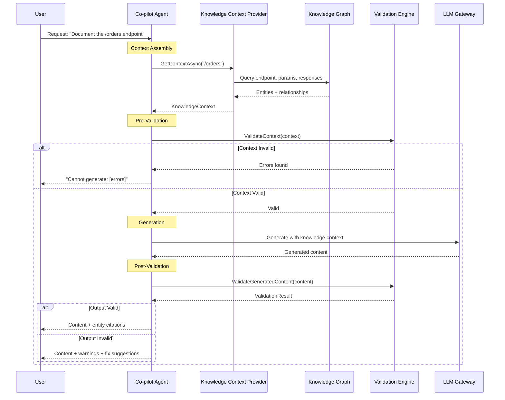

# LCS-SBD-066-KG: Scope Overview — Knowledge-Aware Co-pilot

## Document Control

| Field            | Value                                                        |
| :--------------- | :----------------------------------------------------------- |
| **Document ID**  | LCS-SBD-066-KG                                               |
| **Version**      | v0.6.6                                                       |
| **Codename**     | Knowledge-Aware Co-pilot (CKVS Phase 3b)                     |
| **Status**       | Draft                                                        |
| **Last Updated** | 2026-01-31                                                   |
| **Owner**        | Lead Architect                                               |
| **Depends On**   | v0.6.5-KG (Validation), v0.6.6 (Co-pilot Agent)              |

---

## 1. Executive Summary

### 1.1 The Vision

**v0.6.6-KG** enhances the **Co-pilot Agent** with Knowledge Graph awareness. The Co-pilot can now:
- Query the Knowledge Graph for accurate facts during generation.
- Pre-validate context to avoid generating contradictions.
- Post-validate output before presenting to users.
- Suggest fixes grounded in canonical knowledge.

This transforms the Co-pilot from a general-purpose LLM assistant into a domain-aware documentation expert.

### 1.2 Business Value

- **Grounded Generation:** Co-pilot outputs based on verified facts.
- **Reduced Hallucination:** LLM constrained by knowledge base.
- **Consistent Terminology:** Uses canonical entity names.
- **Automatic Validation:** Generated content pre-checked.
- **Expert-Level Assistance:** Knows the product domain deeply.

### 1.3 Success Criteria

1. Co-pilot queries Knowledge Graph during context assembly.
2. Pre-generation validation blocks if context contains errors.
3. Post-generation validation flags invalid outputs.
4. Co-pilot passes validation >90% of the time.
5. User can see which graph entities informed the response.
6. Performance impact <500ms additional latency.

---

## 2. Relationship to Existing v0.6.6

The existing v0.6.6 spec defines the **Co-pilot Agent** for AI-assisted writing. CKVS integration adds:

| Feature | Existing | CKVS Addition |
|:--------|:---------|:--------------|
| Context Assembly | RAG + Style | + Knowledge Graph context |
| Pre-Generation | (none) | Validation check |
| Generation | LLM call | (unchanged) |
| Post-Generation | (none) | Validation + graph update |
| Response Display | Text | + Entity citations |

---

## 3. Key Deliverables

### 3.1 Sub-Parts

| Sub-Part | Title | Description | Est. Hours |
|:---------|:------|:------------|:-----------|
| v0.6.6e | Graph Context Provider | Queries KG for relevant entities | 6 |
| v0.6.6f | Pre-Generation Validator | Validates context before LLM call | 4 |
| v0.6.6g | Post-Generation Validator | Validates output, suggests fixes | 5 |
| v0.6.6h | Entity Citation Renderer | Shows which entities informed response | 3 |
| v0.6.6i | Knowledge-Aware Prompts | Prompt templates with graph context | 4 |
| **Total** | | | **22 hours** |

### 3.2 Key Interfaces

```csharp
/// <summary>
/// Knowledge-aware context provider for Co-pilot.
/// </summary>
public interface IKnowledgeContextProvider
{
    /// <summary>
    /// Gets relevant knowledge graph context for a query.
    /// </summary>
    /// <param name="query">User query or document context.</param>
    /// <param name="options">Context options.</param>
    /// <param name="ct">Cancellation token.</param>
    /// <returns>Knowledge context for prompt injection.</returns>
    Task<KnowledgeContext> GetContextAsync(
        string query,
        KnowledgeContextOptions options,
        CancellationToken ct = default);
}

/// <summary>
/// Knowledge context for LLM prompts.
/// </summary>
public record KnowledgeContext
{
    /// <summary>Relevant entities from graph.</summary>
    public required IReadOnlyList<KnowledgeEntity> Entities { get; init; }

    /// <summary>Relevant relationships.</summary>
    public IReadOnlyList<KnowledgeRelationship>? Relationships { get; init; }

    /// <summary>Applicable axioms.</summary>
    public IReadOnlyList<Axiom>? Axioms { get; init; }

    /// <summary>Related claims from documents.</summary>
    public IReadOnlyList<Claim>? Claims { get; init; }

    /// <summary>Formatted context for prompt injection.</summary>
    public string FormattedContext { get; init; } = "";

    /// <summary>Token count of formatted context.</summary>
    public int TokenCount { get; init; }
}

/// <summary>
/// Extended Co-pilot agent with CKVS integration.
/// </summary>
public interface IKnowledgeAwareCopilot : ICopilotAgent
{
    /// <summary>
    /// Generates content with knowledge validation.
    /// </summary>
    /// <param name="request">Generation request.</param>
    /// <param name="ct">Cancellation token.</param>
    /// <returns>Validated generation result.</returns>
    Task<ValidatedGenerationResult> GenerateWithValidationAsync(
        CopilotRequest request,
        CancellationToken ct = default);
}

/// <summary>
/// Generation result with validation status.
/// </summary>
public record ValidatedGenerationResult
{
    /// <summary>Generated content.</summary>
    public required string Content { get; init; }

    /// <summary>Pre-generation validation result.</summary>
    public ValidationResult? PreValidation { get; init; }

    /// <summary>Post-generation validation result.</summary>
    public required ValidationResult PostValidation { get; init; }

    /// <summary>Entities that informed the response.</summary>
    public IReadOnlyList<KnowledgeEntity> SourceEntities { get; init; } = Array.Empty<KnowledgeEntity>();

    /// <summary>Whether output passed validation.</summary>
    public bool IsValid => PostValidation.IsValid;

    /// <summary>Suggested fixes if invalid.</summary>
    public IReadOnlyList<ValidationFix>? SuggestedFixes { get; init; }
}
```

### 3.3 Co-pilot Flow with CKVS



---

## 4. Knowledge-Aware Prompt Template

```yaml
# prompts/copilot-knowledge-aware.yaml
id: copilot-knowledge-aware
name: "Knowledge-Aware Co-pilot"
version: "1.0"

system_prompt: |
  You are a technical writing assistant with access to a knowledge base.
  Use the provided KNOWLEDGE CONTEXT to ensure accuracy.

  IMPORTANT RULES:
  1. Only state facts that are in the knowledge context or explicitly asked about
  2. Use the exact names and terminology from the knowledge entities
  3. If information is not in the context, say "I don't have information about..."
  4. Reference the knowledge entities by their canonical names

  AXIOMS TO FOLLOW:
  {{#each axioms}}
  - {{this.name}}: {{this.description}}
  {{/each}}

user_prompt: |
  KNOWLEDGE CONTEXT:
  {{#each entities}}
  - {{this.Type}}: {{this.Name}}
    {{#each this.Properties}}
    - {{@key}}: {{this}}
    {{/each}}
  {{/each}}

  RELATIONSHIPS:
  {{#each relationships}}
  - {{this.FromEntity.Name}} --[{{this.Type}}]--> {{this.ToEntity.Name}}
  {{/each}}

  USER REQUEST:
  {{query}}

  Please generate content that is consistent with the knowledge context above.
```

---

## 5. Entity Citation Display

When Co-pilot generates content, entity citations are shown:

```
┌────────────────────────────────────────────────────────────────┐
│ Co-pilot Response                                              │
├────────────────────────────────────────────────────────────────┤
│                                                                │
│ The `/orders` endpoint accepts the following parameters:       │
│                                                                │
│ - `userId` (required): The ID of the user placing the order   │
│ - `items` (required): Array of order items                    │
│ - `coupon` (optional): Discount coupon code                   │
│                                                                │
│ The endpoint returns a 201 Created response on success.       │
│                                                                │
├────────────────────────────────────────────────────────────────┤
│ 📚 Based on:                                                   │
│ ├── Endpoint: POST /orders                                     │
│ ├── Parameter: userId (path)                                  │
│ ├── Parameter: items (body)                                   │
│ ├── Parameter: coupon (body)                                  │
│ └── Response: 201 Created                                     │
│                                                                │
│ ✓ Validation passed                                           │
└────────────────────────────────────────────────────────────────┘
```

---

## 6. Dependencies

| Component | Source | Usage |
|:----------|:-------|:------|
| `ICopilotAgent` | v0.6.6 | Base Co-pilot functionality |
| `IValidationEngine` | v0.6.5-KG | Pre/post validation |
| `IGraphRepository` | v0.4.5e | Query entities |
| `IAxiomStore` | v0.4.6-KG | Axiom constraints for prompts |
| `IPromptRegistry` | v0.6.2 | Prompt template management |

---

## 7. License Gating

| Tier | Knowledge-Aware Co-pilot |
|:-----|:-------------------------|
| Core | Not available |
| WriterPro | Basic (entity context only) |
| Teams | Full (validation + axioms) |
| Enterprise | Full + custom prompt templates |

---

## 8. Performance Targets

| Metric | Target | Measurement |
|:-------|:-------|:------------|
| Context retrieval | <200ms | P95 timing |
| Pre-validation | <100ms | P95 timing |
| Post-validation | <200ms | P95 timing |
| Total overhead | <500ms | P95 timing |
| Validation pass rate | >90% | Telemetry |

---

## 9. Risks & Mitigations

| Risk | Mitigation |
|:-----|:-----------|
| Knowledge context too large | Token budgeting, relevance ranking |
| Validation latency impacts UX | Async validation, streaming |
| Over-constraining generation | Balance grounding vs creativity |
| LLM ignores knowledge context | Prompt engineering, examples |

---

## 10. What This Enables

- **v0.7.5 Unified Validation:** Co-pilot + Editor agent unified.
- **v0.7.6 Sync Service:** Generated content updates graph.
- **Expert Co-pilot:** Deep domain knowledge assistance.
- **Publication Quality:** AI-assisted content meets standards.

---
