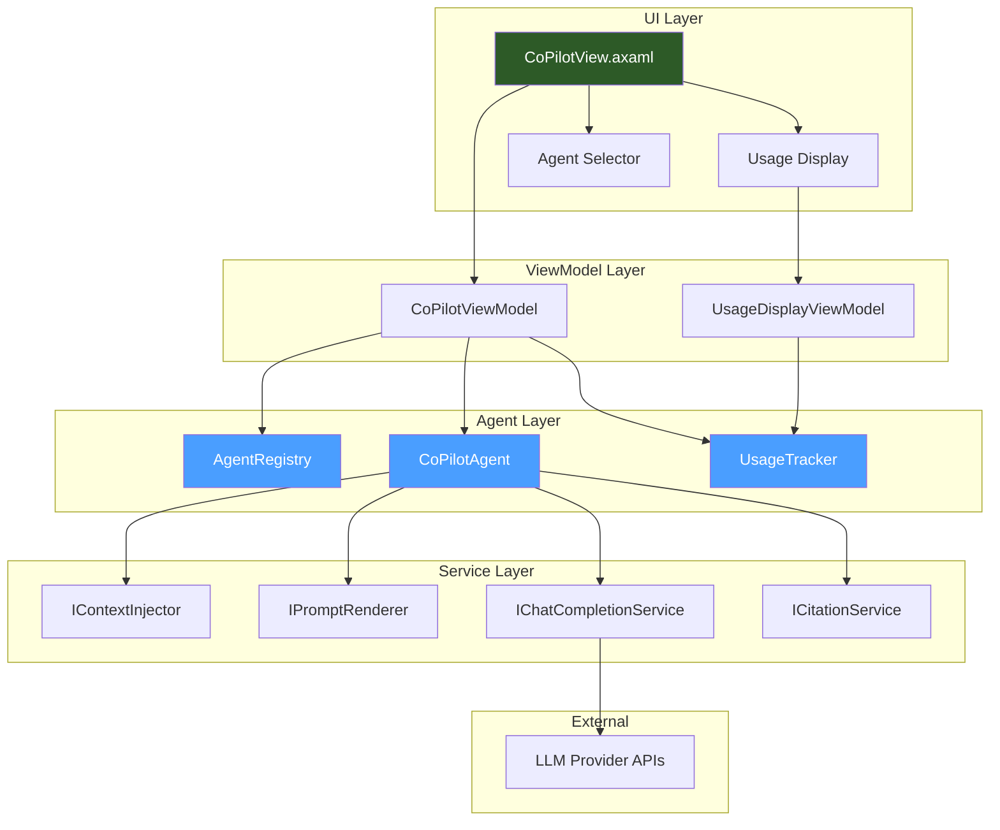
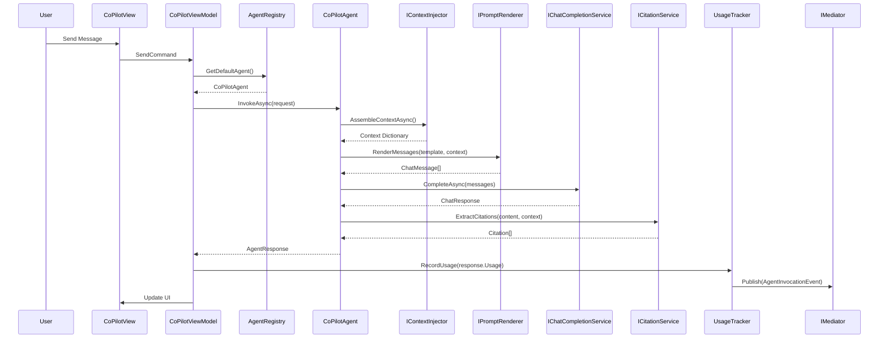
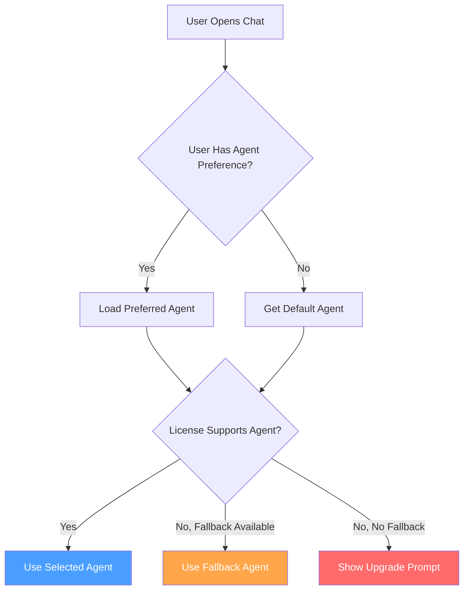
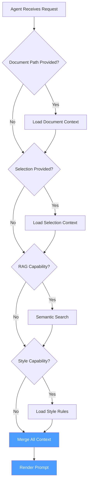

# LCS-SBD-066: Scope Breakdown Document — The Co-pilot Agent

## Document Control

| Field            | Value                                                                      |
| :--------------- | :------------------------------------------------------------------------- |
| **Document ID**  | LCS-SBD-066                                                                |
| **Version**      | v0.6.6                                                                     |
| **Codename**     | The Co-pilot Agent (Conversational Assistant)                              |
| **Status**       | Draft                                                                      |
| **Module**       | Lexichord.Modules.Agents                                                   |
| **Created**      | 2026-01-28                                                                 |
| **Author**       | Documentation Agent                                                        |
| **Reviewers**    | TBD                                                                        |
| **Related Docs** | [LCS-DES-066-INDEX](LCS-DES-066-INDEX.md), [Roadmap](../roadmap-v0.6.x.md) |

---

## 1. Executive Summary

### 1.1 Vision

Unify all AI-powered capabilities—chat, document analysis, style enforcement, and semantic retrieval—into a cohesive agent framework that serves as the foundation for Lexichord's conversational writing assistant. The Co-pilot Agent represents the culmination of the v0.6.x series, wiring together the LLM Gateway (v0.6.1), Provider Integration (v0.6.2), Template Engine (v0.6.3), Chat Interface (v0.6.4), and Streaming Infrastructure (v0.6.5) into a production-ready AI assistant.

### 1.2 Business Value

| Benefit                        | Impact                                                                           |
| :----------------------------- | :------------------------------------------------------------------------------- |
| **Unified AI Experience**      | Single, coherent assistant that understands context, style, and document content |
| **Extensible Agent Framework** | Foundation for specialized agents (research, editing, critique) in future phases |
| **Usage Transparency**         | Clear token and cost tracking builds user trust and supports budget management   |
| **Premium Differentiation**    | Full agent capabilities gated to WriterPro tier, driving subscription value      |
| **Enterprise Readiness**       | Usage metrics and agent registry support Teams-tier enterprise deployments       |

### 1.3 Success Criteria

| Criterion                     | Target                                                 |
| :---------------------------- | :----------------------------------------------------- |
| End-to-end response latency   | < 3s for typical queries with context injection        |
| Context injection accuracy    | > 95% relevant context retrieved from document and RAG |
| Style enforcement compliance  | 100% of applicable rules evaluated per request         |
| Token tracking accuracy       | 100% match between reported and actual usage           |
| Agent registry discovery      | < 100ms to enumerate available agents                  |
| Citation extraction precision | > 90% of RAG-sourced claims properly cited             |

### 1.4 License Gating

| Feature                    | WriterPro | Teams |
| :------------------------- | :-------: | :---: |
| Co-pilot Agent Access      |     ✓     |   ✓   |
| Document Context Injection |     ✓     |   ✓   |
| RAG Context Injection      |     ✓     |   ✓   |
| Style Enforcement          |     ✓     |   ✓   |
| Streaming Responses        |     ✗     |   ✓   |
| Monthly Usage Summary      |     ✗     |   ✓   |
| Custom Agent Registration  |     ✗     |   ✓   |

**Access Control**: The CoPilotAgent requires `LicenseTier.WriterPro` or higher. Users on lower tiers will see a prompt to upgrade when attempting to access agent features.

---

## 2. Dependencies on Prior Versions

### 2.1 Required Components

| Component                   | Version | Purpose                            |
| :-------------------------- | :------ | :--------------------------------- |
| `IChatCompletionService`    | v0.6.1a | LLM communication abstraction      |
| `ChatMessage`               | v0.6.1a | Message format for conversations   |
| `ChatRequest`               | v0.6.1a | Request structure for LLM calls    |
| `ChatResponse`              | v0.6.1a | Response structure from LLM        |
| `ChatOptions`               | v0.6.1b | Model configuration parameters     |
| `ILLMProviderRegistry`      | v0.6.1c | Dynamic provider selection         |
| `IPromptRenderer`           | v0.6.3b | Template-to-message conversion     |
| `IPromptTemplateRepository` | v0.6.3c | Prompt template storage            |
| `IContextInjector`          | v0.6.3d | Context assembly orchestration     |
| `CoPilotViewModel`          | v0.6.4a | Chat panel orchestration           |
| `ChatMessageViewModel`      | v0.6.4b | Message rendering in UI            |
| `IConversationManager`      | v0.6.4c | Conversation state management      |
| `IStreamingChatHandler`     | v0.6.5a | Streaming token handling           |
| `SSEParser`                 | v0.6.5b | Server-sent events parsing         |
| `ISemanticSearchService`    | v0.4.5a | RAG semantic search                |
| `IStyleRuleRepository`      | v0.2.1b | Style rule access                  |
| `ICitationService`          | v0.5.2a | Citation extraction and formatting |
| `ILicenseContext`           | v0.0.4c | License tier verification          |
| `ISettingsService`          | v0.1.6a | User preferences access            |
| `IMediator`                 | v0.0.7a | Event publishing infrastructure    |
| `ILogger<T>`                | v0.0.3b | Structured logging                 |

### 2.2 Dependency Graph

```mermaid
graph TB
    subgraph "v0.6.6 - The Co-pilot Agent"
        IA[IAgent]
        AC[AgentCapabilities]
        AR[AgentRequest/Response]
        CPA[CoPilotAgent]
        IAR[IAgentRegistry]
        UT[Usage Tracking]
    end

    subgraph "v0.6.5 - The Stream"
        ISH[IStreamingChatHandler]
        SSE[SSEParser]
    end

    subgraph "v0.6.4 - Chat Interface"
        CPVM[CoPilotViewModel]
        CMV[ChatMessageViewModel]
        ICM[IConversationManager]
    end

    subgraph "v0.6.3 - Template Engine"
        IPR[IPromptRenderer]
        ICI[IContextInjector]
        IPTR[IPromptTemplateRepository]
    end

    subgraph "v0.6.1 - The Gateway"
        ICCS[IChatCompletionService]
        CR[ChatRequest]
        CRS[ChatResponse]
        REG[ILLMProviderRegistry]
    end

    subgraph "Foundation"
        LIC[ILicenseContext v0.0.4c]
        MED[IMediator v0.0.7a]
        LOG[ILogger v0.0.3b]
    end

    subgraph "Domain Services"
        SEM[ISemanticSearchService v0.4.5a]
        STY[IStyleRuleRepository v0.2.1b]
        CIT[ICitationService v0.5.2a]
    end

    CPA --> IA
    CPA --> AC
    CPA --> AR
    CPA --> ICCS
    CPA --> IPR
    CPA --> ICI
    CPA --> IPTR
    CPA --> ISH
    CPA --> CIT
    IAR --> IA
    IAR --> LIC
    UT --> MED
    UT --> AR
    CPVM --> CPA
    CPVM --> IAR

    style IA fill:#4a9eff,color:#fff
    style AC fill:#4a9eff,color:#fff
    style AR fill:#4a9eff,color:#fff
    style CPA fill:#4a9eff,color:#fff
    style IAR fill:#4a9eff,color:#fff
    style UT fill:#4a9eff,color:#fff
```



---

## 3. Sub-Part Specifications

### 3.1 v0.6.6a: Agent Abstractions

**Goal**: Define the core agent contract and supporting data structures in `Lexichord.Abstractions`.

**Scope**:

- `IAgent` interface defining the agent contract
- `AgentCapabilities` flags enum for feature discovery
- `AgentRequest` record for invocation parameters
- `AgentResponse` record for invocation results
- `UsageMetrics` record for token and cost tracking

**Key Deliverables**:

- `IAgent.cs` - Agent interface contract
- `AgentCapabilities.cs` - Capability flags enumeration
- `AgentRequest.cs` - Request record with message and context
- `AgentResponse.cs` - Response record with content and metrics
- `UsageMetrics.cs` - Token and cost tracking record

**Estimated Effort**: 4 hours

---

### 3.2 v0.6.6b: Co-pilot Implementation

**Goal**: Create the foundational writing assistant agent that orchestrates all AI capabilities.

**Scope**:

- `CoPilotAgent` class implementing `IAgent`
- Context assembly using `IContextInjector`
- Prompt rendering via `IPromptRenderer`
- LLM invocation through `IChatCompletionService`
- Citation extraction using `ICitationService`
- Usage metrics calculation

**Key Deliverables**:

- `CoPilotAgent.cs` - Full agent implementation
- `co-pilot-editor.liquid` - Default prompt template
- Unit tests for all agent workflows

**Estimated Effort**: 16 hours

---

### 3.3 v0.6.6c: Agent Registry

**Goal**: Implement `IAgentRegistry` for agent discovery and selection.

**Scope**:

- `IAgentRegistry` interface for agent enumeration
- `AgentRegistry` implementation with DI integration
- License-tier filtering for available agents
- Default agent configuration and selection

**Key Deliverables**:

- `IAgentRegistry.cs` - Registry interface
- `AgentRegistry.cs` - Discovery implementation
- Configuration for default agent selection

**Estimated Effort**: 6 hours

---

### 3.4 v0.6.6d: Usage Tracking

**Goal**: Implement token and cost tracking for transparency and budget management.

**Scope**:

- Per-conversation usage accumulation
- `AgentInvocationEvent` for telemetry
- UI display of running usage totals
- Monthly summary aggregation (Teams+ feature)

**Key Deliverables**:

- `AgentInvocationEvent.cs` - MediatR notification
- `UsageTracker.cs` - Accumulation service
- `UsageDisplayViewModel.cs` - UI binding support
- Monthly summary endpoint (Teams tier)

**Estimated Effort**: 8 hours

---

## 4. Implementation Checklist

| Phase | Task                                       | Est. Hours | Status |
| :---: | :----------------------------------------- | :--------: | :----: |
|   1   | Define `IAgent` interface                  |     1      |   ☐    |
|   1   | Define `AgentCapabilities` enum            |    0.5     |   ☐    |
|   1   | Define `AgentRequest` record               |    0.5     |   ☐    |
|   1   | Define `AgentResponse` record              |    0.5     |   ☐    |
|   1   | Define `UsageMetrics` record               |    0.5     |   ☐    |
|   1   | Unit tests for agent abstractions          |     1      |   ☐    |
|   2   | Implement `CoPilotAgent` class             |     6      |   ☐    |
|   2   | Create `co-pilot-editor.liquid` template   |     2      |   ☐    |
|   2   | Implement context assembly flow            |     2      |   ☐    |
|   2   | Implement citation extraction              |     2      |   ☐    |
|   2   | Add streaming support delegation           |     2      |   ☐    |
|   2   | Unit tests for CoPilotAgent                |     2      |   ☐    |
|   3   | Define `IAgentRegistry` interface          |     1      |   ☐    |
|   3   | Implement `AgentRegistry` with DI scanning |     2      |   ☐    |
|   3   | Add license-tier filtering                 |     1      |   ☐    |
|   3   | Implement default agent configuration      |     1      |   ☐    |
|   3   | Unit tests for agent registry              |     1      |   ☐    |
|   4   | Define `AgentInvocationEvent`              |    0.5     |   ☐    |
|   4   | Implement `UsageTracker` service           |     2      |   ☐    |
|   4   | Implement `UsageDisplayViewModel`          |     2      |   ☐    |
|   4   | Add monthly summary aggregation            |     2      |   ☐    |
|   4   | Unit tests for usage tracking              |    1.5     |   ☐    |
|       | **Total**                                  |   **34**   |        |

---

## 5. Dependency Matrix

### 5.1 New Interfaces

| Interface        | Module                 | Purpose                                |
| :--------------- | :--------------------- | :------------------------------------- |
| `IAgent`         | Lexichord.Abstractions | Contract for all agent implementations |
| `IAgentRegistry` | Lexichord.Abstractions | Agent discovery and selection          |

### 5.2 New Records/Classes

| Type                    | Module                   | Purpose                          |
| :---------------------- | :----------------------- | :------------------------------- |
| `AgentCapabilities`     | Lexichord.Abstractions   | Agent feature flags              |
| `AgentRequest`          | Lexichord.Abstractions   | Agent invocation parameters      |
| `AgentResponse`         | Lexichord.Abstractions   | Agent invocation results         |
| `UsageMetrics`          | Lexichord.Abstractions   | Token and cost tracking          |
| `CoPilotAgent`          | Lexichord.Modules.Agents | Writing assistant implementation |
| `AgentRegistry`         | Lexichord.Modules.Agents | Agent discovery implementation   |
| `AgentInvocationEvent`  | Lexichord.Modules.Agents | Telemetry event for invocations  |
| `UsageTracker`          | Lexichord.Modules.Agents | Usage accumulation service       |
| `UsageDisplayViewModel` | Lexichord.Modules.Agents | UI binding for usage display     |

### 5.3 Modified Components

| Component           | Modification                                       |
| :------------------ | :------------------------------------------------- |
| `CoPilotViewModel`  | Integrate with `IAgentRegistry` and `CoPilotAgent` |
| `CoPilotView.axaml` | Add usage display binding, agent selector          |
| `AgentsModule.cs`   | Register agent services and implementations        |

---

## 6. Architecture Diagram



---

## 7. Data Flow Diagram



---

## 8. Risks & Mitigations

| Risk                                | Probability | Impact | Mitigation                                                 |
| :---------------------------------- | :---------: | :----: | :--------------------------------------------------------- |
| Context injection latency           |   Medium    | Medium | Parallel context assembly, caching, timeout limits         |
| Token calculation inaccuracy        |     Low     |  High  | Use provider-reported tokens, validate against tiktoken    |
| Agent registry discovery failures   |     Low     | Medium | Graceful fallback to default agent, detailed error logging |
| Citation extraction false positives |   Medium    |  Low   | Confidence thresholds, user-reviewable citations           |
| Prompt template rendering errors    |     Low     |  High  | Template validation on load, comprehensive error handling  |
| License bypass attempts             |     Low     |  High  | Server-side validation, signed license tokens              |

---

## 9. Success Metrics

| Metric                  | Measurement Method                      | Target  |
| :---------------------- | :-------------------------------------- | :------ |
| Response Quality        | User satisfaction ratings               | > 4.2/5 |
| Context Relevance       | RAG retrieval precision                 | > 90%   |
| Style Compliance        | Style rules correctly applied           | > 95%   |
| Token Tracking Accuracy | Reported vs actual token counts         | 100%    |
| Agent Discovery Latency | Time to enumerate available agents      | < 100ms |
| Invocation Success Rate | Successful completions / total attempts | > 99%   |

---

## 10. What This Enables

### 10.1 Immediate Benefits

- **Unified Writing Assistant**: Single conversational interface for all AI-powered writing help
- **Context-Aware Responses**: Automatic injection of document content, style rules, and semantic search results
- **Transparent Usage**: Real-time visibility into token consumption and estimated costs
- **Extensible Architecture**: Foundation for specialized agents without infrastructure changes

### 10.2 Future Capabilities

| Future Feature                    | How v0.6.6 Enables It                                  |
| :-------------------------------- | :----------------------------------------------------- |
| v0.6.7: Function Calling          | IAgent contract supports tool invocation extensions    |
| v0.6.8: Agentic Tools             | AgentCapabilities enum allows feature discovery        |
| v0.7.x: Multi-agent Orchestration | AgentRegistry enables agent selection and coordination |
| v0.8.x: Review Workflows          | Usage tracking provides audit trail for approvals      |

---

## 11. Decision Trees

### 11.1 Agent Selection



### 11.2 Context Assembly



---

## 12. User Stories

### US-066-01: Conversational Writing Assistance

> **As a** WriterPro user  
> **I want** to chat with an AI assistant that understands my document  
> **So that** I get contextually relevant writing help without copy-pasting content

**Acceptance Criteria**:

- Co-pilot agent has access to current document content
- Agent applies relevant style rules from user's style configuration
- RAG context is injected when relevant to user's query
- Response includes proper citations for retrieved content

---

### US-066-02: Usage Visibility

> **As a** WriterPro user  
> **I want** to see how many tokens my conversation is using  
> **So that** I can manage my usage and budget accordingly

**Acceptance Criteria**:

- Token count displayed after each response
- Running total visible in chat panel footer
- Estimated cost shown (based on configured model pricing)
- Usage resets appropriately for new conversations

---

### US-066-03: Agent Discovery

> **As a** Teams user  
> **I want** to see what agents are available to me  
> **So that** I can choose the best assistant for my current task

**Acceptance Criteria**:

- Agent selector shows all available agents for user's tier
- Each agent displays name, description, and capabilities
- Unavailable agents shown with upgrade prompt
- Default agent is pre-selected

---

### US-066-04: Monthly Usage Summary

> **As a** Teams administrator  
> **I want** to see monthly usage summaries for my team  
> **So that** I can track AI costs and optimize usage

**Acceptance Criteria**:

- Monthly summary shows total tokens by agent and model
- Cost breakdown by user (anonymized for privacy)
- Export capability for reporting
- Historical comparison with previous months

---

## 13. Use Cases

### UC-066-01: Context-Aware Chat Session

**Actors**: WriterPro User, Co-pilot Agent  
**Preconditions**: User has WriterPro license, document open, chat panel visible  
**Trigger**: User types question and clicks Send

**Main Flow**:

1. ViewModel retrieves default agent from registry
2. Agent constructs context from document and selection
3. Agent performs semantic search for relevant chunks
4. Agent loads applicable style rules
5. Agent renders prompt with assembled context
6. Agent adds conversation history
7. Agent invokes LLM completion service
8. Agent extracts citations from RAG context
9. Agent calculates usage metrics
10. ViewModel records usage and publishes event
11. Response displayed with citations

**Alternative Flow A** (No RAG Results):

- At step 3: No relevant chunks found
- Skip citation extraction at step 8
- Continue with remaining flow

**Alternative Flow B** (Streaming Enabled):

- At step 7: Check if Teams tier
- If Teams: Use streaming completion
- Delegate to streaming handler for progressive display

---

### UC-066-02: Agent Selection

**Actors**: Teams User  
**Preconditions**: User has Teams license, multiple agents available  
**Trigger**: User clicks agent selector dropdown

**Main Flow**:

1. Registry enumerates all registered agents
2. Registry filters by user's license tier
3. UI displays available agents with metadata
4. User selects desired agent
5. Selection persisted to user preferences
6. Subsequent messages use selected agent

---

## 14. Unit Testing Requirements

### 14.1 Test Categories

| Category           | Description                       | Count  |
| :----------------- | :-------------------------------- | :----: |
| Agent Abstractions | Interface and record validation   |   8    |
| CoPilotAgent       | Agent workflow and integration    |   15   |
| AgentRegistry      | Discovery and filtering logic     |   10   |
| Usage Tracking     | Accumulation and event publishing |   8    |
| Integration        | End-to-end agent invocation       |   4    |
| **Total**          |                                   | **45** |

### 14.2 Critical Test Cases

```csharp
[Fact]
[Trait("Category", "Agent")]
[Trait("SubPart", "v0.6.6b")]
public async Task CoPilotAgent_InvokeAsync_AssemblesContextCorrectly()
{
    // Arrange
    var contextInjector = Substitute.For<IContextInjector>();
    var context = new Dictionary<string, object> { ["document"] = "Sample text" };
    contextInjector.AssembleContextAsync(Arg.Any<ContextRequest>(), Arg.Any<CancellationToken>())
        .Returns(context);

    var agent = CreateAgent(contextInjector: contextInjector);
    var request = new AgentRequest("Summarize this", DocumentPath: "/doc.md");

    // Act
    await agent.InvokeAsync(request, CancellationToken.None);

    // Assert
    await contextInjector.Received(1).AssembleContextAsync(
        Arg.Is<ContextRequest>(r => r.DocumentPath == "/doc.md"),
        Arg.Any<CancellationToken>());
}

[Fact]
[Trait("Category", "Agent")]
[Trait("SubPart", "v0.6.6c")]
public void AgentRegistry_GetAvailableAgents_FiltersbyLicenseTier()
{
    // Arrange
    var licenseContext = Substitute.For<ILicenseContext>();
    licenseContext.Tier.Returns(LicenseTier.WriterPro);

    var proAgent = CreateMockAgent("pro-agent", LicenseTier.WriterPro);
    var teamsAgent = CreateMockAgent("teams-agent", LicenseTier.Teams);

    var registry = new AgentRegistry([proAgent, teamsAgent], licenseContext);

    // Act
    var available = registry.AvailableAgents;

    // Assert
    available.Should().ContainSingle();
    available[0].AgentId.Should().Be("pro-agent");
}

[Fact]
[Trait("Category", "UsageTracking")]
[Trait("SubPart", "v0.6.6d")]
public async Task UsageTracker_RecordUsage_PublishesEvent()
{
    // Arrange
    var mediator = Substitute.For<IMediator>();
    var tracker = new UsageTracker(mediator);
    var metrics = new UsageMetrics(100, 50, 0.0015m);

    // Act
    await tracker.RecordUsageAsync("co-pilot", "gpt-4", metrics, TimeSpan.FromSeconds(2), false);

    // Assert
    await mediator.Received(1).Publish(
        Arg.Is<AgentInvocationEvent>(e =>
            e.AgentId == "co-pilot" &&
            e.PromptTokens == 100 &&
            e.CompletionTokens == 50),
        Arg.Any<CancellationToken>());
}
```

---

## 15. Observability & Logging

### 15.1 Log Events

| Event                  | Level       | Template                                                         |
| :--------------------- | :---------- | :--------------------------------------------------------------- |
| Agent invoked          | Information | `Agent {AgentId} invoked with {ContextItems} context items`      |
| Context assembled      | Debug       | `Context assembled: {DocumentChars} doc chars, {RagChunks} RAG`  |
| Prompt rendered        | Debug       | `Prompt rendered: {MessageCount} messages, {TotalTokens} tokens` |
| LLM completion started | Information | `LLM completion started for {Model}`                             |
| LLM completion done    | Information | `LLM completed: {PromptTokens}+{CompletionTokens} tokens`        |
| Citations extracted    | Debug       | `Extracted {CitationCount} citations from response`              |
| Usage recorded         | Debug       | `Usage recorded: {TotalTokens} tokens, {Cost:C4} estimated`      |
| Agent not found        | Warning     | `Agent {AgentId} not found in registry`                          |
| Agent access denied    | Warning     | `Agent {AgentId} requires {RequiredTier}, user has {UserTier}`   |

### 15.2 Metrics

| Metric                      | Type      | Description                              |
| :-------------------------- | :-------- | :--------------------------------------- |
| `agent_invocations_total`   | Counter   | Total invocations by agent and model     |
| `agent_invocation_duration` | Histogram | Invocation duration in milliseconds      |
| `agent_tokens_total`        | Counter   | Total tokens by type (prompt/completion) |
| `agent_context_items`       | Histogram | Number of context items per invocation   |
| `agent_citations_extracted` | Counter   | Citations extracted per invocation       |
| `agent_errors_total`        | Counter   | Agent errors by type                     |

---

## 16. UI/UX Specifications

### 16.1 Chat Panel with Agent Integration

```text
┌──────────────────────────────────────────────────────────────────┐
│  Co-pilot                    [Agent ▼][Provider ▼][Model ▼]     │
├──────────────────────────────────────────────────────────────────┤
│  ▶ Context (5 rules, 3 chunks)                      [Refresh]   │
├──────────────────────────────────────────────────────────────────┤
│                                                                  │
│  ┌────────────────────────────────────────────────────────────┐  │
│  │ 👤 How can I improve the pacing in this chapter?           │  │
│  │                                              10:32 AM       │  │
│  └────────────────────────────────────────────────────────────┘  │
│                                                                  │
│  ┌────────────────────────────────────────────────────────────┐  │
│  │ 🤖 Based on your current chapter [1], I notice several     │  │
│  │    areas where pacing could be improved:                   │  │
│  │                                                            │  │
│  │    1. **Scene transitions** are abrupt between...          │  │
│  │    2. **Dialogue density** in the middle section...        │  │
│  │                                                            │  │
│  │    [1]: Chapter 3, paragraphs 12-18                        │  │
│  │                                              10:32 AM       │  │
│  └────────────────────────────────────────────────────────────┘  │
│                                                                  │
├──────────────────────────────────────────────────────────────────┤
│  ┌────────────────────────────────────────────────────────────┐  │
│  │ Type your message...                                       │  │
│  └────────────────────────────────────────────────────────────┘  │
├──────────────────────────────────────────────────────────────────┤
│  Tokens: 1,247 (~$0.0037)              [New Chat] [Export]      │
└──────────────────────────────────────────────────────────────────┘
```

### 16.2 Agent Selector Dropdown

```text
┌──────────────────────────────────────┐
│ ✓ Co-pilot                          │
│   General writing assistant with     │
│   document and style awareness       │
│   [Chat] [Document] [RAG] [Style]   │
├──────────────────────────────────────┤
│   Research Assistant     🔒 Teams    │
│   Deep research and fact-checking    │
│   Upgrade to access →                │
├──────────────────────────────────────┤
│   Editor                 🔒 Teams    │
│   Line-by-line editing suggestions   │
│   Upgrade to access →                │
└──────────────────────────────────────┘
```

### 16.3 Usage Display States

| State               | Display Format                         |
| :------------------ | :------------------------------------- |
| No usage yet        | `Tokens: 0`                            |
| Active conversation | `Tokens: 1,247 (~$0.0037)`             |
| High usage          | `Tokens: 45,892 (~$0.14)` (amber)      |
| Usage limit warning | `Tokens: 95,000/100,000` (red pulsing) |

---

## 17. Acceptance Criteria

### AC-066-01: Agent Contract

- [ ] `IAgent` interface defines all required members
- [ ] `AgentCapabilities` flags correctly represent features
- [ ] `AgentRequest` captures all invocation parameters
- [ ] `AgentResponse` includes content, citations, and metrics
- [ ] `UsageMetrics` tracks tokens and cost accurately

### AC-066-02: Co-pilot Implementation

- [ ] `CoPilotAgent` assembles context correctly
- [ ] Prompt templates render with all context variables
- [ ] LLM responses are properly processed
- [ ] Citations are extracted from RAG context
- [ ] Usage metrics calculated accurately

### AC-066-03: Agent Registry

- [ ] Registry discovers all registered agents
- [ ] License filtering works correctly
- [ ] Default agent selection respects configuration
- [ ] Unavailable agents are handled gracefully

### AC-066-04: Usage Tracking

- [ ] Per-conversation usage is accumulated correctly
- [ ] `AgentInvocationEvent` published for each invocation
- [ ] UI displays running totals
- [ ] Monthly summary aggregation works (Teams tier)

---

## 18. Verification Commands

```bash
# Build the Agents module
dotnet build src/Modules/Lexichord.Modules.Agents/Lexichord.Modules.Agents.csproj

# Run agent-related tests
dotnet test --filter "Category=Agent"

# Run all v0.6.6 tests
dotnet test --filter "SubPart=v0.6.6a|SubPart=v0.6.6b|SubPart=v0.6.6c|SubPart=v0.6.6d"

# Run specific CoPilotAgent tests
dotnet test --filter "FullyQualifiedName~CoPilotAgentTests"

# Verify agent registry tests
dotnet test --filter "Category=AgentRegistry"

# Run usage tracking tests
dotnet test --filter "Category=UsageTracking"
```

---

## 19. Deliverable Checklist

| Deliverable                | Status |
| :------------------------- | :----: |
| `IAgent.cs`                |   ☐    |
| `AgentCapabilities.cs`     |   ☐    |
| `AgentRequest.cs`          |   ☐    |
| `AgentResponse.cs`         |   ☐    |
| `UsageMetrics.cs`          |   ☐    |
| `CoPilotAgent.cs`          |   ☐    |
| `co-pilot-editor.liquid`   |   ☐    |
| `IAgentRegistry.cs`        |   ☐    |
| `AgentRegistry.cs`         |   ☐    |
| `AgentInvocationEvent.cs`  |   ☐    |
| `UsageTracker.cs`          |   ☐    |
| `UsageDisplayViewModel.cs` |   ☐    |
| Unit tests (45 total)      |   ☐    |
| Integration tests          |   ☐    |
| Documentation updates      |   ☐    |

---

## 20. Code Examples

### 20.1 IAgent Interface

```csharp
namespace Lexichord.Abstractions.Agents;

/// <summary>
/// Contract for all agent implementations in Lexichord.
/// </summary>
public interface IAgent
{
    /// <summary>
    /// Unique identifier for this agent.
    /// </summary>
    string AgentId { get; }

    /// <summary>
    /// Human-readable name of the agent.
    /// </summary>
    string Name { get; }

    /// <summary>
    /// Description of the agent's purpose and capabilities.
    /// </summary>
    string Description { get; }

    /// <summary>
    /// The prompt template used by this agent.
    /// </summary>
    IPromptTemplate Template { get; }

    /// <summary>
    /// Flags indicating the capabilities of this agent.
    /// </summary>
    AgentCapabilities Capabilities { get; }

    /// <summary>
    /// Invokes the agent with the given request.
    /// </summary>
    Task<AgentResponse> InvokeAsync(AgentRequest request, CancellationToken ct = default);
}
```

### 20.2 AgentCapabilities Enum

```csharp
namespace Lexichord.Abstractions.Agents;

/// <summary>
/// Flags indicating the capabilities of an agent.
/// </summary>
[Flags]
public enum AgentCapabilities
{
    /// <summary>No special capabilities.</summary>
    None = 0,

    /// <summary>Supports conversational chat.</summary>
    Chat = 1,

    /// <summary>Can access and reason about document content.</summary>
    DocumentContext = 2,

    /// <summary>Uses semantic search for retrieval-augmented generation.</summary>
    RAGContext = 4,

    /// <summary>Applies and enforces style rules.</summary>
    StyleEnforcement = 8,

    /// <summary>Supports streaming responses.</summary>
    Streaming = 16
}
```

### 20.3 CoPilotAgent Implementation

```csharp
namespace Lexichord.Modules.Agents.Chat;

[RequiresLicense(LicenseTier.WriterPro)]
public class CoPilotAgent(
    IChatCompletionService llm,
    IPromptRenderer renderer,
    IContextInjector contextInjector,
    IPromptTemplateRepository templates,
    ICitationService citationService,
    ILogger<CoPilotAgent> logger) : IAgent
{
    public string AgentId => "co-pilot";
    public string Name => "Co-pilot";
    public string Description => "General writing assistant with document and style awareness";

    public AgentCapabilities Capabilities =>
        AgentCapabilities.Chat | AgentCapabilities.DocumentContext |
        AgentCapabilities.RAGContext | AgentCapabilities.StyleEnforcement |
        AgentCapabilities.Streaming;

    public IPromptTemplate Template => templates.GetTemplate("co-pilot-editor");

    public async Task<AgentResponse> InvokeAsync(AgentRequest request, CancellationToken ct)
    {
        logger.LogInformation("Agent {AgentId} invoked", AgentId);

        // 1. Assemble context
        var context = await contextInjector.AssembleContextAsync(
            new ContextRequest(request.DocumentPath, null, request.Selection, true, true), ct);

        logger.LogDebug("Context assembled: {ItemCount} items", context.Count);

        // 2. Render prompt
        context["user_input"] = request.UserMessage;
        var messages = renderer.RenderMessages(Template, context);

        // 3. Add conversation history
        var fullMessages = (request.History ?? []).Concat(messages).ToList();

        // 4. Call LLM
        var response = await llm.CompleteAsync(new ChatRequest(fullMessages, new ChatOptions()), ct);

        logger.LogInformation("LLM completed: {PromptTokens}+{CompletionTokens} tokens",
            response.PromptTokens, response.CompletionTokens);

        // 5. Extract citations if RAG context was used
        var citations = citationService.ExtractCitations(response.Content, context);

        var usage = new UsageMetrics(
            response.PromptTokens,
            response.CompletionTokens,
            CalculateCost(response));

        return new AgentResponse(response.Content, citations, usage);
    }

    private static decimal CalculateCost(ChatResponse response)
    {
        // Simplified cost calculation - actual implementation would use model pricing
        const decimal promptCostPer1K = 0.01m;
        const decimal completionCostPer1K = 0.03m;

        return (response.PromptTokens / 1000m * promptCostPer1K) +
               (response.CompletionTokens / 1000m * completionCostPer1K);
    }
}
```

### 20.4 AgentInvocationEvent

```csharp
namespace Lexichord.Modules.Agents.Events;

/// <summary>
/// Published when an agent invocation completes.
/// </summary>
public record AgentInvocationEvent(
    string AgentId,
    string Model,
    int PromptTokens,
    int CompletionTokens,
    TimeSpan Duration,
    bool Streamed
) : INotification;
```

---

## 21. Deferred Features

| Feature                   | Reason for Deferral                      | Target Version |
| :------------------------ | :--------------------------------------- | :------------- |
| Function calling          | Requires additional provider support     | v0.6.7         |
| Multi-agent orchestration | Complexity requires dedicated iteration  | v0.7.x         |
| Custom agent creation     | Enterprise feature, lower priority       | v0.8.x         |
| Agent fine-tuning         | Requires model management infrastructure | v0.9.x         |

---

## 22. Changelog Entry

```markdown
### v0.6.6 — The Co-pilot Agent (Conversational Assistant)

**Release Date**: TBD

#### Added

- `IAgent` interface defining the contract for all agent implementations
- `AgentCapabilities` flags enum for feature discovery and filtering
- `AgentRequest` and `AgentResponse` records for type-safe invocation
- `UsageMetrics` record for transparent token and cost tracking
- `CoPilotAgent` — foundational writing assistant with full context integration
- `IAgentRegistry` interface and implementation for agent discovery
- `AgentInvocationEvent` for telemetry and usage tracking
- `UsageTracker` service for per-conversation usage accumulation
- `UsageDisplayViewModel` for real-time usage display in UI
- Monthly usage summary aggregation (Teams+ feature)
- Agent selector UI component in chat panel

#### Changed

- `CoPilotViewModel` now integrates with `IAgentRegistry` for agent selection
- `CoPilotView.axaml` updated with agent selector and usage display

#### Dependencies

- Requires `IChatCompletionService` from v0.6.1a
- Requires `IPromptRenderer` from v0.6.3b
- Requires `IContextInjector` from v0.6.3d
- Requires `IPromptTemplateRepository` from v0.6.3c
- Requires `IStreamingChatHandler` from v0.6.5a (for Teams streaming)
```
