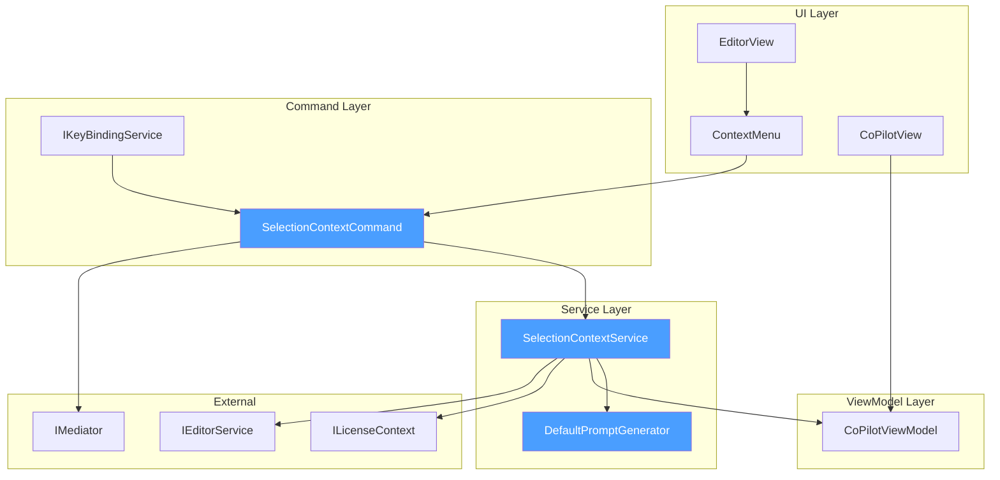

# LCS-DES-067a: Selection Context

## Document Control

| Field            | Value                                                                    |
| :--------------- | :----------------------------------------------------------------------- |
| **Document ID**  | LCS-DES-067a                                                             |
| **Version**      | v0.6.7a                                                                  |
| **Title**        | Selection Context                                                        |
| **Status**       | Draft                                                                    |
| **Module**       | Lexichord.Modules.Agents                                                 |
| **Created**      | 2026-01-28                                                               |
| **Author**       | Documentation Agent                                                      |
| **Related Docs** | [LCS-DES-067-INDEX](LCS-DES-067-INDEX.md), [LCS-SBD-067](LCS-SBD-067.md) |

---

## 1. Metadata & Categorization

| Aspect         | Details                                 |
| :------------- | :-------------------------------------- |
| **Area**       | Editor Integration                      |
| **Type**       | Feature                                 |
| **Complexity** | Medium                                  |
| **Impact**     | High - Enables contextual AI assistance |

---

## 2. Executive Summary

### 2.1 Purpose

Selection Context enables users to send selected text from the editor to the Co-pilot with a single action—either via keyboard shortcut or context menu. This eliminates the friction of manually copying text, switching to chat, pasting, and framing a question. The selection becomes the immediate context for AI-assisted analysis, explanation, or improvement.

### 2.2 Key Features

1. **Keyboard Shortcut**: `Ctrl+Shift+A` sends selection to Co-pilot (configurable)
2. **Context Menu**: "Ask Co-pilot about selection" right-click option
3. **Smart Prompts**: Default prompt adapts to selection characteristics
4. **Focus Management**: Automatically focuses chat input after selection
5. **Selection Indicator**: Visual indicator in chat shows active selection context

### 2.3 Dependencies

| Component            | Version | Usage                           |
| :------------------- | :------ | :------------------------------ |
| `CoPilotViewModel`   | v0.6.4a | Chat state management           |
| `AgentRequest`       | v0.6.6a | Request with Selection property |
| `IKeyBindingService` | v0.1.5b | Keyboard shortcut registration  |
| `IEditorService`     | v0.1.3a | Selection retrieval             |
| `ILicenseContext`    | v0.0.4c | WriterPro tier verification     |
| `IMediator`          | v0.0.7a | Event publishing                |

---

## 3. Architecture & Modular Strategy

### 3.1 Component Architecture



### 3.2 Module Placement

```text
Lexichord.Modules.Agents/
├── Services/
│   ├── SelectionContextService.cs        # Main service
│   └── DefaultPromptGenerator.cs         # Prompt generation logic
├── Commands/
│   └── SelectionContextCommand.cs        # RelayCommand implementation
├── Events/
│   └── SelectionContextSetEvent.cs       # MediatR notification
└── Extensions/
    └── EditorContextMenuExtensions.cs    # Context menu registration
```

---

## 4. Data Contract (The API)

### 4.1 ISelectionContextService Interface

```csharp
namespace Lexichord.Modules.Agents.Services;

/// <summary>
/// Bridges selected text in the editor to the Co-pilot chat interface.
/// </summary>
/// <remarks>
/// <para>
/// This service coordinates the flow of selected text from the editor to the
/// Co-pilot chat panel. It handles license verification, default prompt
/// generation, and focus management.
/// </para>
/// <para>
/// The service automatically generates contextually appropriate prompts based
/// on the selection characteristics (length, content type, structure).
/// </para>
/// </remarks>
/// <example>
/// <code>
/// // Typical usage from a command
/// if (_selectionService.HasActiveSelection)
/// {
///     var selection = _editorService.GetSelectedText();
///     await _selectionService.SendSelectionToCoPilotAsync(selection);
/// }
/// </code>
/// </example>
public interface ISelectionContextService
{
    /// <summary>
    /// Sends selected text to the Co-pilot chat with a generated default prompt.
    /// </summary>
    /// <param name="selection">The selected text from the editor.</param>
    /// <param name="ct">Cancellation token for async operation.</param>
    /// <returns>A task representing the asynchronous operation.</returns>
    /// <exception cref="LicenseRequiredException">
    /// Thrown when the user does not have WriterPro license.
    /// </exception>
    /// <exception cref="ArgumentException">
    /// Thrown when selection is null or empty.
    /// </exception>
    Task SendSelectionToCoPilotAsync(string selection, CancellationToken ct = default);

    /// <summary>
    /// Generates an appropriate default prompt based on selection characteristics.
    /// </summary>
    /// <param name="selection">The selected text to analyze.</param>
    /// <returns>A contextually appropriate prompt string.</returns>
    /// <remarks>
    /// Prompt selection logic:
    /// <list type="bullet">
    /// <item>Short selection (&lt;50 chars): "Explain this:"</item>
    /// <item>Code-like selection: "Review this code:"</item>
    /// <item>Long selection (&gt;500 chars): "Summarize this:"</item>
    /// <item>Default: "Improve this:"</item>
    /// </list>
    /// </remarks>
    string GenerateDefaultPrompt(string selection);

    /// <summary>
    /// Gets whether the editor currently has an active text selection.
    /// </summary>
    bool HasActiveSelection { get; }

    /// <summary>
    /// Gets the currently selected text, or null if no selection.
    /// </summary>
    string? CurrentSelection { get; }

    /// <summary>
    /// Clears the current selection context from the Co-pilot.
    /// </summary>
    void ClearSelectionContext();
}
```

### 4.2 SelectionContextCommand

```csharp
namespace Lexichord.Modules.Agents.Commands;

/// <summary>
/// RelayCommand that sends the current editor selection to Co-pilot.
/// </summary>
/// <remarks>
/// This command is bound to Ctrl+Shift+A by default and is also
/// triggered from the editor context menu.
/// </remarks>
public partial class SelectionContextCommand : ObservableObject, IRelayCommand
{
    private readonly ISelectionContextService _selectionService;
    private readonly IEditorService _editorService;
    private readonly IMediator _mediator;
    private readonly ILogger<SelectionContextCommand> _logger;

    /// <summary>
    /// Initializes a new instance of the SelectionContextCommand.
    /// </summary>
    public SelectionContextCommand(
        ISelectionContextService selectionService,
        IEditorService editorService,
        IMediator mediator,
        ILogger<SelectionContextCommand> logger)
    {
        _selectionService = selectionService;
        _editorService = editorService;
        _mediator = mediator;
        _logger = logger;
    }

    /// <summary>
    /// Determines whether the command can execute.
    /// </summary>
    public bool CanExecute(object? parameter) => _selectionService.HasActiveSelection;

    /// <summary>
    /// Executes the selection-to-copilot flow.
    /// </summary>
    public async void Execute(object? parameter)
    {
        try
        {
            var selection = _editorService.GetSelectedText();
            if (string.IsNullOrWhiteSpace(selection))
            {
                _logger.LogDebug("No text selected, command skipped");
                return;
            }

            _logger.LogDebug("Sending selection to Co-pilot: {CharCount} chars",
                selection.Length);

            await _selectionService.SendSelectionToCoPilotAsync(selection);

            await _mediator.Publish(new SelectionContextSetEvent(
                selection.Length,
                DateTime.UtcNow));
        }
        catch (LicenseRequiredException ex)
        {
            _logger.LogWarning(ex, "License required for selection context");
            // Let the exception propagate for UI handling
            throw;
        }
        catch (Exception ex)
        {
            _logger.LogError(ex, "Failed to send selection to Co-pilot");
        }
    }

    /// <summary>
    /// Notifies UI of potential can-execute changes.
    /// </summary>
    public void NotifyCanExecuteChanged() => CanExecuteChanged?.Invoke(this, EventArgs.Empty);

    /// <summary>
    /// Event raised when CanExecute may have changed.
    /// </summary>
    public event EventHandler? CanExecuteChanged;
}
```

### 4.3 SelectionContextSetEvent

```csharp
namespace Lexichord.Modules.Agents.Events;

/// <summary>
/// Published when selection context is set in Co-pilot.
/// </summary>
/// <param name="SelectionLength">Number of characters in selection.</param>
/// <param name="Timestamp">When the selection was sent.</param>
public record SelectionContextSetEvent(
    int SelectionLength,
    DateTime Timestamp
) : INotification;
```

### 4.4 DefaultPromptGenerator

```csharp
namespace Lexichord.Modules.Agents.Services;

/// <summary>
/// Generates contextually appropriate default prompts for selections.
/// </summary>
public class DefaultPromptGenerator
{
    private const int ShortSelectionThreshold = 50;
    private const int LongSelectionThreshold = 500;

    private static readonly Regex CodePattern = new(
        @"^[\s]*(public|private|class|function|def|const|let|var|import|using|#include)",
        RegexOptions.Multiline | RegexOptions.Compiled);

    private static readonly Regex JsonPattern = new(
        @"^\s*[\[{]",
        RegexOptions.Compiled);

    /// <summary>
    /// Generates a default prompt based on selection analysis.
    /// </summary>
    /// <param name="selection">The selected text.</param>
    /// <returns>Appropriate default prompt string.</returns>
    public string Generate(string selection)
    {
        ArgumentNullException.ThrowIfNull(selection);

        var trimmed = selection.Trim();

        // Short selection: likely wants explanation
        if (trimmed.Length < ShortSelectionThreshold)
        {
            return "Explain this:";
        }

        // Code-like content: offer code review
        if (IsCodeLike(trimmed))
        {
            return "Review this code:";
        }

        // Long selection: summarization is helpful
        if (trimmed.Length > LongSelectionThreshold)
        {
            return "Summarize this:";
        }

        // Default: improvement
        return "Improve this:";
    }

    private static bool IsCodeLike(string text)
    {
        return CodePattern.IsMatch(text) || JsonPattern.IsMatch(text);
    }
}
```

---

## 5. Implementation Logic

### 5.1 SelectionContextService Implementation

```csharp
namespace Lexichord.Modules.Agents.Services;

/// <summary>
/// Implementation of <see cref="ISelectionContextService"/>.
/// </summary>
public class SelectionContextService : ISelectionContextService
{
    private readonly CoPilotViewModel _viewModel;
    private readonly IEditorService _editorService;
    private readonly ILicenseContext _license;
    private readonly DefaultPromptGenerator _promptGenerator;
    private readonly ILogger<SelectionContextService> _logger;

    private string? _currentSelection;

    /// <summary>
    /// Initializes a new instance of the SelectionContextService.
    /// </summary>
    public SelectionContextService(
        CoPilotViewModel viewModel,
        IEditorService editorService,
        ILicenseContext license,
        ILogger<SelectionContextService> logger)
    {
        _viewModel = viewModel;
        _editorService = editorService;
        _license = license;
        _promptGenerator = new DefaultPromptGenerator();
        _logger = logger;

        // Subscribe to editor selection changes
        _editorService.SelectionChanged += OnSelectionChanged;
    }

    /// <inheritdoc/>
    public bool HasActiveSelection =>
        !string.IsNullOrWhiteSpace(_editorService.GetSelectedText());

    /// <inheritdoc/>
    public string? CurrentSelection => _currentSelection;

    /// <inheritdoc/>
    public async Task SendSelectionToCoPilotAsync(string selection, CancellationToken ct = default)
    {
        // ───────────────────────────────────────────────────────────────
        // License Verification
        // ───────────────────────────────────────────────────────────────
        if (!_license.HasFeature(LicenseFeature.CoPilotAgent))
        {
            _logger.LogWarning(
                "Selection context attempted without WriterPro license");
            throw new LicenseRequiredException(
                LicenseTier.WriterPro,
                "Selection Context requires a WriterPro license.");
        }

        // ───────────────────────────────────────────────────────────────
        // Input Validation
        // ───────────────────────────────────────────────────────────────
        if (string.IsNullOrWhiteSpace(selection))
        {
            _logger.LogDebug("Empty selection, no action taken");
            throw new ArgumentException("Selection cannot be empty.", nameof(selection));
        }

        _logger.LogDebug(
            "Processing selection context: {CharCount} chars",
            selection.Length);

        // ───────────────────────────────────────────────────────────────
        // Store Selection and Generate Prompt
        // ───────────────────────────────────────────────────────────────
        _currentSelection = selection;
        var defaultPrompt = GenerateDefaultPrompt(selection);

        _logger.LogDebug(
            "Generated default prompt: {PromptType}",
            defaultPrompt.Split(':')[0]);

        // ───────────────────────────────────────────────────────────────
        // Update ViewModel
        // ───────────────────────────────────────────────────────────────
        await Dispatcher.UIThread.InvokeAsync(() =>
        {
            _viewModel.SetSelectionContext(selection);
            _viewModel.InputText = defaultPrompt + " ";
            _viewModel.FocusChatInput();
        });

        _logger.LogInformation(
            "Selection context set: {CharCount} chars, prompt: {Prompt}",
            selection.Length,
            defaultPrompt);
    }

    /// <inheritdoc/>
    public string GenerateDefaultPrompt(string selection)
    {
        return _promptGenerator.Generate(selection);
    }

    /// <inheritdoc/>
    public void ClearSelectionContext()
    {
        _currentSelection = null;
        _viewModel.ClearSelectionContext();
        _logger.LogDebug("Selection context cleared");
    }

    private void OnSelectionChanged(object? sender, SelectionChangedEventArgs e)
    {
        // Clear stale context when selection changes
        if (_currentSelection != null && e.NewSelection != _currentSelection)
        {
            _logger.LogDebug("Selection changed, clearing stale context");
            _currentSelection = null;
        }
    }
}
```

### 5.2 Context Menu Registration

```csharp
namespace Lexichord.Modules.Agents.Extensions;

/// <summary>
/// Extension methods for registering editor context menu items.
/// </summary>
public static class EditorContextMenuExtensions
{
    /// <summary>
    /// Adds "Ask Co-pilot about selection" menu item to editor context menu.
    /// </summary>
    public static void RegisterCoPilotContextMenu(
        this IEditorService editorService,
        IServiceProvider services)
    {
        var command = services.GetRequiredService<SelectionContextCommand>();
        var license = services.GetRequiredService<ILicenseContext>();

        editorService.RegisterContextMenuItem(new ContextMenuItem
        {
            Header = "Ask Co-pilot about selection",
            Icon = "mdi-robot-happy",
            Command = command,
            IsVisible = () => license.HasFeature(LicenseFeature.CoPilotAgent),
            IsEnabled = () => command.CanExecute(null),
            Group = "AI Assistance",
            Order = 100
        });
    }
}
```

### 5.3 Keyboard Binding Configuration

```csharp
namespace Lexichord.Modules.Agents.Configuration;

/// <summary>
/// Configures keyboard bindings for selection context.
/// </summary>
public class SelectionContextKeyBindings : IKeyBindingConfiguration
{
    /// <summary>
    /// Registers selection context keyboard shortcuts.
    /// </summary>
    public void Configure(IKeyBindingService keyBindingService)
    {
        keyBindingService.RegisterBinding(new KeyBinding
        {
            CommandId = "copilot.sendSelection",
            Key = Key.A,
            Modifiers = KeyModifiers.Control | KeyModifiers.Shift,
            Condition = KeyBindingCondition.EditorHasSelection,
            Description = "Send selection to Co-pilot"
        });
    }
}
```

---

## 6. UI/UX Specifications

### 6.1 Context Menu Design

```text
┌─────────────────────────────────────┐
│ Cut                          Ctrl+X │
│ Copy                         Ctrl+C │
│ Paste                        Ctrl+V │
├─────────────────────────────────────┤
│ 🤖 Ask Co-pilot about selection     │◄── New menu item
│                     Ctrl+Shift+A    │
├─────────────────────────────────────┤
│ Select All                   Ctrl+A │
└─────────────────────────────────────┘
```

### 6.2 Selection Context Indicator

When selection context is active in the chat panel:

```text
┌─────────────────────────────────────────────────────────────┐
│ 🤖 Co-pilot                                            [×] │
├─────────────────────────────────────────────────────────────┤
│ ┌─────────────────────────────────────────────────────────┐ │
│ │ 📎 Selection context (245 chars)              [Clear ×] │ │◄── Indicator
│ │ "The quick brown fox jumps over the lazy dog..."       │ │
│ └─────────────────────────────────────────────────────────┘ │
│                                                             │
│ ┌─────────────────────────────────────────────────────────┐ │
│ │ Improve this: ▌                                         │ │◄── Pre-filled
│ └─────────────────────────────────────────────────────────┘ │
│                                                [Send ➤]    │
└─────────────────────────────────────────────────────────────┘
```

### 6.3 Selection Indicator Component

```csharp
// SelectionContextIndicator.axaml
<UserControl x:Class="Lexichord.Modules.Agents.Views.SelectionContextIndicator"
             xmlns="https://github.com/avaloniaui"
             xmlns:x="http://schemas.microsoft.com/winfx/2006/xaml">

    <Border IsVisible="{Binding HasSelectionContext}"
            Classes="selectionContext"
            Padding="8"
            CornerRadius="4"
            Margin="8,0,8,8">

        <Grid ColumnDefinitions="Auto,*,Auto">
            <!-- Icon -->
            <PathIcon Grid.Column="0"
                      Data="{StaticResource IconPaperclip}"
                      Width="14" Height="14"
                      Margin="0,0,8,0"/>

            <!-- Context Summary -->
            <StackPanel Grid.Column="1" Spacing="2">
                <TextBlock Text="{Binding SelectionSummary}"
                           FontWeight="SemiBold"
                           FontSize="12"/>
                <TextBlock Text="{Binding SelectionPreview}"
                           FontSize="11"
                           Opacity="0.7"
                           TextTrimming="CharacterEllipsis"
                           MaxLines="1"/>
            </StackPanel>

            <!-- Clear Button -->
            <Button Grid.Column="2"
                    Command="{Binding ClearSelectionContextCommand}"
                    Classes="ghost small">
                <PathIcon Data="{StaticResource IconClose}"
                          Width="12" Height="12"/>
            </Button>
        </Grid>
    </Border>
</UserControl>
```

---

## 7. Observability & Logging

### 7.1 Log Events

| Event ID | Level       | Template                                                     |
| :------- | :---------- | :----------------------------------------------------------- |
| SEL001   | Debug       | `Processing selection context: {CharCount} chars`            |
| SEL002   | Debug       | `Generated default prompt: {PromptType}`                     |
| SEL003   | Information | `Selection context set: {CharCount} chars, prompt: {Prompt}` |
| SEL004   | Debug       | `Selection context cleared`                                  |
| SEL005   | Debug       | `Empty selection, no action taken`                           |
| SEL006   | Warning     | `Selection context attempted without WriterPro license`      |
| SEL007   | Debug       | `Selection changed, clearing stale context`                  |
| SEL008   | Error       | `Failed to send selection to Co-pilot: {Error}`              |

### 7.2 Structured Log Context

```csharp
using (_logger.BeginScope(new Dictionary<string, object>
{
    ["SelectionLength"] = selection.Length,
    ["DocumentPath"] = _editorService.CurrentDocumentPath ?? "unknown",
    ["PromptType"] = defaultPrompt.Split(':')[0]
}))
{
    _logger.LogInformation("Selection context set");
}
```

### 7.3 Metrics

| Metric                          | Type      | Tags                     |
| :------------------------------ | :-------- | :----------------------- |
| `selection_context_invocations` | Counter   | `source` (menu/shortcut) |
| `selection_context_chars`       | Histogram | `prompt_type`            |
| `selection_context_duration`    | Histogram | -                        |

---

## 8. Acceptance Criteria

| #   | Criterion                                                 | Test Method   |
| :-- | :-------------------------------------------------------- | :------------ |
| 1   | `Ctrl+Shift+A` opens Co-pilot with selection as context   | Manual + Unit |
| 2   | Right-click menu shows "Ask Co-pilot about selection"     | Manual        |
| 3   | Menu item disabled when no text is selected               | Unit          |
| 4   | Selection appears as context indicator in chat panel      | Manual        |
| 5   | Input field pre-populates with contextual default prompt  | Unit          |
| 6   | Short selection (<50 chars) gets "Explain this:" prompt   | Unit          |
| 7   | Code selection gets "Review this code:" prompt            | Unit          |
| 8   | Long selection (>500 chars) gets "Summarize this:" prompt | Unit          |
| 9   | Chat input is focused after selection is sent             | Integration   |
| 10  | Feature is gated to WriterPro license                     | Unit          |
| 11  | SelectionContextSetEvent is published on success          | Unit          |
| 12  | Context can be cleared with [Clear ×] button              | Manual + Unit |

---

## 9. Unit Tests

### 9.1 Test Summary

| Test Class                     | Test Count | Focus Area             |
| :----------------------------- | :--------: | :--------------------- |
| `SelectionContextServiceTests` |     6      | Service behavior       |
| `DefaultPromptGeneratorTests`  |     4      | Prompt selection logic |
| `SelectionContextCommandTests` |     3      | Command execution      |
| **Total**                      |   **13**   |                        |

### 9.2 Test Implementations

```csharp
namespace Lexichord.Modules.Agents.Tests.Services;

[Trait("Category", "Unit")]
[Trait("SubPart", "v0.6.7a")]
public class SelectionContextServiceTests
{
    private readonly Mock<CoPilotViewModel> _viewModelMock;
    private readonly Mock<IEditorService> _editorMock;
    private readonly Mock<ILicenseContext> _licenseMock;
    private readonly Mock<ILogger<SelectionContextService>> _loggerMock;
    private readonly SelectionContextService _sut;

    public SelectionContextServiceTests()
    {
        _viewModelMock = new Mock<CoPilotViewModel>();
        _editorMock = new Mock<IEditorService>();
        _licenseMock = new Mock<ILicenseContext>();
        _loggerMock = new Mock<ILogger<SelectionContextService>>();

        _licenseMock.Setup(l => l.HasFeature(LicenseFeature.CoPilotAgent))
            .Returns(true);

        _sut = new SelectionContextService(
            _viewModelMock.Object,
            _editorMock.Object,
            _licenseMock.Object,
            _loggerMock.Object);
    }

    [Fact]
    public async Task SendSelectionToCoPilotAsync_WithValidSelection_SetsContext()
    {
        // Arrange
        var selection = "The quick brown fox jumps over the lazy dog.";

        // Act
        await _sut.SendSelectionToCoPilotAsync(selection);

        // Assert
        _viewModelMock.Verify(v => v.SetSelectionContext(selection), Times.Once);
        _viewModelMock.Verify(v => v.FocusChatInput(), Times.Once);
    }

    [Fact]
    public async Task SendSelectionToCoPilotAsync_WithoutLicense_ThrowsException()
    {
        // Arrange
        _licenseMock.Setup(l => l.HasFeature(LicenseFeature.CoPilotAgent))
            .Returns(false);
        var selection = "Some text";

        // Act & Assert
        await Assert.ThrowsAsync<LicenseRequiredException>(
            () => _sut.SendSelectionToCoPilotAsync(selection));
    }

    [Theory]
    [InlineData(null)]
    [InlineData("")]
    [InlineData("   ")]
    public async Task SendSelectionToCoPilotAsync_WithEmptySelection_ThrowsArgumentException(
        string? selection)
    {
        // Act & Assert
        await Assert.ThrowsAsync<ArgumentException>(
            () => _sut.SendSelectionToCoPilotAsync(selection!));
    }

    [Fact]
    public void HasActiveSelection_WhenEditorHasSelection_ReturnsTrue()
    {
        // Arrange
        _editorMock.Setup(e => e.GetSelectedText()).Returns("Selected text");

        // Act
        var result = _sut.HasActiveSelection;

        // Assert
        result.Should().BeTrue();
    }

    [Fact]
    public void HasActiveSelection_WhenNoSelection_ReturnsFalse()
    {
        // Arrange
        _editorMock.Setup(e => e.GetSelectedText()).Returns(string.Empty);

        // Act
        var result = _sut.HasActiveSelection;

        // Assert
        result.Should().BeFalse();
    }

    [Fact]
    public void ClearSelectionContext_ClearsViewModelContext()
    {
        // Act
        _sut.ClearSelectionContext();

        // Assert
        _viewModelMock.Verify(v => v.ClearSelectionContext(), Times.Once);
    }
}

[Trait("Category", "Unit")]
[Trait("SubPart", "v0.6.7a")]
public class DefaultPromptGeneratorTests
{
    private readonly DefaultPromptGenerator _sut = new();

    [Theory]
    [InlineData("hi", "Explain this:")]
    [InlineData("test", "Explain this:")]
    [InlineData("12345678901234567890123456789012345678901234567890", "Improve this:")] // 50 chars
    public void Generate_WithShortSelection_ReturnsExplainPrompt(string selection, string expected)
    {
        // Act
        var result = _sut.Generate(selection);

        // Assert
        result.Should().Be(expected);
    }

    [Theory]
    [InlineData("public class Foo { }", "Review this code:")]
    [InlineData("function test() { return 1; }", "Review this code:")]
    [InlineData("{ \"key\": \"value\" }", "Review this code:")]
    [InlineData("import React from 'react';", "Review this code:")]
    public void Generate_WithCodeLikeSelection_ReturnsReviewPrompt(string selection)
    {
        // Act
        var result = _sut.Generate(selection);

        // Assert
        result.Should().Be("Review this code:");
    }

    [Fact]
    public void Generate_WithLongSelection_ReturnsSummarizePrompt()
    {
        // Arrange
        var selection = new string('x', 501);

        // Act
        var result = _sut.Generate(selection);

        // Assert
        result.Should().Be("Summarize this:");
    }

    [Fact]
    public void Generate_WithMediumProseSelection_ReturnsImprovePrompt()
    {
        // Arrange
        var selection = "The quick brown fox jumps over the lazy dog. " +
                        "This is a somewhat longer selection that should " +
                        "trigger the default improve prompt.";

        // Act
        var result = _sut.Generate(selection);

        // Assert
        result.Should().Be("Improve this:");
    }
}
```

---

## 10. DI Registration

```csharp
// In AgentsModule.cs

// ═══════════════════════════════════════════════════════════════════
// v0.6.7a: Selection Context
// ═══════════════════════════════════════════════════════════════════
services.AddSingleton<ISelectionContextService, SelectionContextService>();
services.AddTransient<SelectionContextCommand>();
services.AddSingleton<SelectionContextKeyBindings>();

// Register keybindings
services.AddSingleton<IKeyBindingConfiguration, SelectionContextKeyBindings>();
```

---
