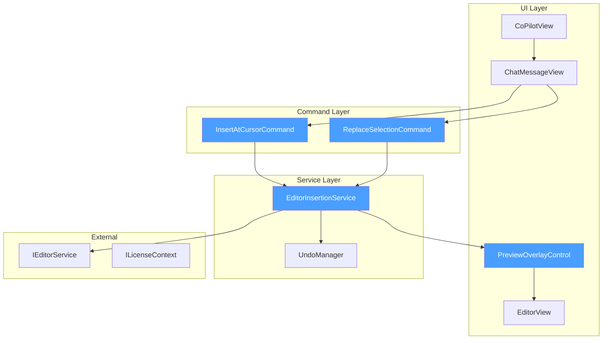

# LCS-DES-067b: Inline Suggestions

## Document Control

| Field            | Value                                                                    |
| :--------------- | :----------------------------------------------------------------------- |
| **Document ID**  | LCS-DES-067b                                                             |
| **Version**      | v0.6.7b                                                                  |
| **Title**        | Inline Suggestions                                                       |
| **Status**       | Draft                                                                    |
| **Module**       | Lexichord.Abstractions, Lexichord.Modules.Agents                         |
| **Created**      | 2026-01-28                                                               |
| **Author**       | Documentation Agent                                                      |
| **Related Docs** | [LCS-DES-067-INDEX](LCS-DES-067-INDEX.md), [LCS-SBD-067](LCS-SBD-067.md) |

---

## 1. Metadata & Categorization

| Aspect         | Details                               |
| :------------- | :------------------------------------ |
| **Area**       | Editor Integration                    |
| **Type**       | Feature                               |
| **Complexity** | High                                  |
| **Impact**     | High - Enables AI-to-editor text flow |

---

## 2. Executive Summary

### 2.1 Purpose

Inline Suggestions closes the loop on AI-assisted writing by enabling the insertion of agent responses directly into the document. Rather than copying text from the chat panel and manually placing it, users can preview AI-generated text as a ghost overlay, then accept or reject with a single action. All insertions are wrapped in transaction groups, ensuring a single `Ctrl+Z` undoes the entire AI modification.

### 2.2 Key Features

1. **Insert at Cursor**: One-click insertion of AI response at current cursor
2. **Replace Selection**: Replace selected text with AI suggestion
3. **Preview Overlay**: Ghost text visualization before committing
4. **Accept/Reject Actions**: Enter to accept, Escape to reject
5. **Transaction-Based Undo**: Single `Ctrl+Z` reverts entire AI insertion
6. **Position Validation**: Re-validates cursor before insertion

### 2.3 Dependencies

| Component          | Version | Usage                                |
| :----------------- | :------ | :----------------------------------- |
| `IEditorService`   | v0.1.3a | Core editor text manipulation        |
| `AgentResponse`    | v0.6.6a | Response content to insert           |
| `CoPilotViewModel` | v0.6.4a | Response display with action buttons |
| `ILicenseContext`  | v0.0.4c | WriterPro tier verification          |

---

## 3. Architecture & Modular Strategy

### 3.1 Component Architecture



### 3.2 Module Placement

```text
Lexichord.Abstractions/
├── Editor/
│   ├── IEditorInsertionService.cs        # Public interface
│   └── TextSpan.cs                       # Text range record

Lexichord.Modules.Agents/
├── Services/
│   └── EditorInsertionService.cs         # Implementation
├── Commands/
│   ├── InsertAtCursorCommand.cs          # Insert command
│   └── ReplaceSelectionCommand.cs        # Replace command
├── Controls/
│   ├── PreviewOverlayControl.axaml       # Ghost overlay UI
│   └── PreviewOverlayControl.axaml.cs    # Code-behind
└── ViewModels/
    └── PreviewOverlayViewModel.cs        # Preview state
```

---

## 4. Data Contract (The API)

### 4.1 IEditorInsertionService Interface

```csharp
namespace Lexichord.Abstractions.Editor;

/// <summary>
/// Service for inserting AI-generated text into the editor with preview support.
/// </summary>
/// <remarks>
/// <para>
/// This service provides a clean abstraction for editor text manipulation,
/// supporting both immediate insertion and preview-before-commit workflows.
/// The preview mode displays proposed text as a ghost overlay, allowing the
/// user to review changes before accepting.
/// </para>
/// <para>
/// All modifications are wrapped in undo groups using <see cref="IEditorService"/>,
/// ensuring that a single Ctrl+Z reverts the entire AI insertion regardless
/// of complexity. This applies to both direct insertions and accepted previews.
/// </para>
/// <para>
/// The service maintains preview state and provides reactive updates for UI
/// binding through the <see cref="IsPreviewActive"/> property.
/// </para>
/// </remarks>
/// <example>
/// <code>
/// // Show preview and wait for user decision
/// await _insertionService.ShowPreviewAsync(responseText, location);
///
/// // Later, based on user action:
/// if (userAccepts)
/// {
///     await _insertionService.AcceptPreviewAsync();
/// }
/// else
/// {
///     await _insertionService.RejectPreviewAsync();
/// }
/// </code>
/// </example>
public interface IEditorInsertionService
{
    /// <summary>
    /// Inserts text at the current cursor position.
    /// </summary>
    /// <param name="text">The text to insert.</param>
    /// <param name="ct">Cancellation token for async operation.</param>
    /// <returns>A task representing the asynchronous operation.</returns>
    /// <exception cref="InvalidOperationException">
    /// Thrown when cursor position cannot be determined.
    /// </exception>
    /// <remarks>
    /// The insertion is wrapped in an undo group. If the cursor position
    /// has changed since the operation was initiated, the service will
    /// attempt to re-acquire the current position.
    /// </remarks>
    Task InsertAtCursorAsync(string text, CancellationToken ct = default);

    /// <summary>
    /// Replaces the current selection with the specified text.
    /// </summary>
    /// <param name="text">The replacement text.</param>
    /// <param name="ct">Cancellation token for async operation.</param>
    /// <returns>A task representing the asynchronous operation.</returns>
    /// <exception cref="InvalidOperationException">
    /// Thrown when no selection is active.
    /// </exception>
    /// <remarks>
    /// If no selection is active when this method is called, it throws
    /// an exception. Callers should verify selection state first.
    /// </remarks>
    Task ReplaceSelectionAsync(string text, CancellationToken ct = default);

    /// <summary>
    /// Shows a preview overlay at the specified location without committing.
    /// </summary>
    /// <param name="text">The text to preview.</param>
    /// <param name="location">The text span where preview should appear.</param>
    /// <param name="ct">Cancellation token for async operation.</param>
    /// <returns>A task representing the asynchronous operation.</returns>
    /// <remarks>
    /// <para>
    /// The preview is displayed as a ghost overlay with reduced opacity,
    /// showing the proposed text without modifying the actual document.
    /// Accept/reject controls are displayed alongside the preview.
    /// </para>
    /// <para>
    /// Only one preview can be active at a time. Calling this method while
    /// a preview is active will reject the existing preview first.
    /// </para>
    /// </remarks>
    Task ShowPreviewAsync(string text, TextSpan location, CancellationToken ct = default);

    /// <summary>
    /// Accepts the current preview and commits the text to the document.
    /// </summary>
    /// <param name="ct">Cancellation token for async operation.</param>
    /// <returns>
    /// True if the preview was accepted and committed; false if no preview was active.
    /// </returns>
    /// <remarks>
    /// After accepting, the committed text becomes part of the document and
    /// is wrapped in an undo group for single-step reversal.
    /// </remarks>
    Task<bool> AcceptPreviewAsync(CancellationToken ct = default);

    /// <summary>
    /// Rejects the current preview and dismisses the overlay without changes.
    /// </summary>
    /// <param name="ct">Cancellation token for async operation.</param>
    /// <returns>A task representing the asynchronous operation.</returns>
    Task RejectPreviewAsync(CancellationToken ct = default);

    /// <summary>
    /// Gets whether a preview overlay is currently active.
    /// </summary>
    /// <remarks>
    /// This property can be used for UI binding to show/hide preview-related
    /// controls and for keyboard shortcut condition evaluation.
    /// </remarks>
    bool IsPreviewActive { get; }

    /// <summary>
    /// Gets the current preview text, if any.
    /// </summary>
    string? CurrentPreviewText { get; }

    /// <summary>
    /// Gets the location of the current preview.
    /// </summary>
    TextSpan? CurrentPreviewLocation { get; }

    /// <summary>
    /// Raised when preview state changes.
    /// </summary>
    event EventHandler<PreviewStateChangedEventArgs>? PreviewStateChanged;
}

/// <summary>
/// Represents a span of text in the document.
/// </summary>
/// <param name="Start">The zero-based starting character position.</param>
/// <param name="Length">The number of characters in the span.</param>
public record TextSpan(int Start, int Length)
{
    /// <summary>
    /// Gets the end position of the span (exclusive).
    /// </summary>
    public int End => Start + Length;

    /// <summary>
    /// Creates a span from start and end positions.
    /// </summary>
    /// <param name="start">Start position (inclusive).</param>
    /// <param name="end">End position (exclusive).</param>
    /// <returns>A new TextSpan instance.</returns>
    public static TextSpan FromStartEnd(int start, int end) =>
        new(start, end - start);

    /// <summary>
    /// Returns an empty span at position zero.
    /// </summary>
    public static TextSpan Empty => new(0, 0);

    /// <summary>
    /// Determines if this span contains the specified position.
    /// </summary>
    public bool Contains(int position) =>
        position >= Start && position < End;

    /// <summary>
    /// Determines if this span overlaps with another span.
    /// </summary>
    public bool OverlapsWith(TextSpan other) =>
        Start < other.End && other.Start < End;
}

/// <summary>
/// Event args for preview state changes.
/// </summary>
public class PreviewStateChangedEventArgs : EventArgs
{
    /// <summary>
    /// Gets whether a preview is now active.
    /// </summary>
    public bool IsActive { get; init; }

    /// <summary>
    /// Gets the preview text if active.
    /// </summary>
    public string? PreviewText { get; init; }

    /// <summary>
    /// Gets the preview location if active.
    /// </summary>
    public TextSpan? Location { get; init; }
}
```

### 4.2 InsertAtCursorCommand

```csharp
namespace Lexichord.Modules.Agents.Commands;

/// <summary>
/// Command that inserts AI-generated text at the current cursor position.
/// </summary>
/// <remarks>
/// This command is displayed as a button in AI response messages and can be
/// invoked from the chat panel. It supports preview mode by default.
/// </remarks>
public partial class InsertAtCursorCommand : ObservableObject, IAsyncRelayCommand
{
    private readonly IEditorInsertionService _insertionService;
    private readonly IEditorService _editorService;
    private readonly ILicenseContext _license;
    private readonly ILogger<InsertAtCursorCommand> _logger;

    [ObservableProperty]
    private bool _isExecuting;

    /// <summary>
    /// Initializes the command with required dependencies.
    /// </summary>
    public InsertAtCursorCommand(
        IEditorInsertionService insertionService,
        IEditorService editorService,
        ILicenseContext license,
        ILogger<InsertAtCursorCommand> logger)
    {
        _insertionService = insertionService;
        _editorService = editorService;
        _license = license;
        _logger = logger;
    }

    /// <summary>
    /// Gets or sets the text to insert (bound from message content).
    /// </summary>
    public string? TextToInsert { get; set; }

    /// <summary>
    /// Gets or sets whether to show preview before inserting.
    /// </summary>
    public bool ShowPreview { get; set; } = true;

    /// <inheritdoc/>
    public bool CanExecute(object? parameter)
    {
        return !IsExecuting
            && _license.HasFeature(LicenseFeature.CoPilotAgent)
            && !string.IsNullOrEmpty(TextToInsert ?? parameter as string);
    }

    /// <inheritdoc/>
    public async Task ExecuteAsync(object? parameter)
    {
        var text = TextToInsert ?? parameter as string;
        if (string.IsNullOrEmpty(text))
        {
            _logger.LogWarning("Insert command invoked without text");
            return;
        }

        IsExecuting = true;
        try
        {
            _logger.LogDebug("Inserting text at cursor: {CharCount} chars", text.Length);

            if (ShowPreview)
            {
                var position = _editorService.CaretOffset;
                var location = new TextSpan(position, 0);
                await _insertionService.ShowPreviewAsync(text, location);
                _logger.LogDebug("Preview shown at position {Position}", position);
            }
            else
            {
                await _insertionService.InsertAtCursorAsync(text);
                _logger.LogInformation("Text inserted at cursor: {CharCount} chars",
                    text.Length);
            }
        }
        catch (Exception ex)
        {
            _logger.LogError(ex, "Failed to insert text at cursor");
            throw;
        }
        finally
        {
            IsExecuting = false;
        }
    }

    void ICommand.Execute(object? parameter) => _ = ExecuteAsync(parameter);

    /// <inheritdoc/>
    public event EventHandler? CanExecuteChanged;

    /// <summary>
    /// Notifies that CanExecute may have changed.
    /// </summary>
    public void NotifyCanExecuteChanged() =>
        CanExecuteChanged?.Invoke(this, EventArgs.Empty);
}
```

### 4.3 ReplaceSelectionCommand

```csharp
namespace Lexichord.Modules.Agents.Commands;

/// <summary>
/// Command that replaces the current selection with AI-generated text.
/// </summary>
public partial class ReplaceSelectionCommand : ObservableObject, IAsyncRelayCommand
{
    private readonly IEditorInsertionService _insertionService;
    private readonly IEditorService _editorService;
    private readonly ILicenseContext _license;
    private readonly ILogger<ReplaceSelectionCommand> _logger;

    [ObservableProperty]
    private bool _isExecuting;

    /// <summary>
    /// Initializes the command with required dependencies.
    /// </summary>
    public ReplaceSelectionCommand(
        IEditorInsertionService insertionService,
        IEditorService editorService,
        ILicenseContext license,
        ILogger<ReplaceSelectionCommand> logger)
    {
        _insertionService = insertionService;
        _editorService = editorService;
        _license = license;
        _logger = logger;
    }

    /// <summary>
    /// Gets or sets the replacement text.
    /// </summary>
    public string? ReplacementText { get; set; }

    /// <summary>
    /// Gets or sets whether to show preview before replacing.
    /// </summary>
    public bool ShowPreview { get; set; } = true;

    /// <inheritdoc/>
    public bool CanExecute(object? parameter)
    {
        return !IsExecuting
            && _license.HasFeature(LicenseFeature.CoPilotAgent)
            && _editorService.HasSelection
            && !string.IsNullOrEmpty(ReplacementText ?? parameter as string);
    }

    /// <inheritdoc/>
    public async Task ExecuteAsync(object? parameter)
    {
        var text = ReplacementText ?? parameter as string;
        if (string.IsNullOrEmpty(text))
        {
            _logger.LogWarning("Replace command invoked without text");
            return;
        }

        if (!_editorService.HasSelection)
        {
            _logger.LogWarning("Replace command invoked without selection");
            return;
        }

        IsExecuting = true;
        try
        {
            var selectionStart = _editorService.SelectionStart;
            var selectionLength = _editorService.SelectionLength;

            _logger.LogDebug(
                "Replacing selection: {SelLength} chars with {NewLength} chars",
                selectionLength, text.Length);

            if (ShowPreview)
            {
                var location = new TextSpan(selectionStart, selectionLength);
                await _insertionService.ShowPreviewAsync(text, location);
                _logger.LogDebug("Preview shown for selection replacement");
            }
            else
            {
                await _insertionService.ReplaceSelectionAsync(text);
                _logger.LogInformation(
                    "Selection replaced: {OldLength} → {NewLength} chars",
                    selectionLength, text.Length);
            }
        }
        catch (Exception ex)
        {
            _logger.LogError(ex, "Failed to replace selection");
            throw;
        }
        finally
        {
            IsExecuting = false;
        }
    }

    void ICommand.Execute(object? parameter) => _ = ExecuteAsync(parameter);

    /// <inheritdoc/>
    public event EventHandler? CanExecuteChanged;

    /// <summary>
    /// Notifies that CanExecute may have changed.
    /// </summary>
    public void NotifyCanExecuteChanged() =>
        CanExecuteChanged?.Invoke(this, EventArgs.Empty);
}
```

---

## 5. Implementation Logic

### 5.1 EditorInsertionService Implementation

```csharp
namespace Lexichord.Modules.Agents.Services;

/// <summary>
/// Implementation of <see cref="IEditorInsertionService"/> with preview support.
/// </summary>
public class EditorInsertionService : IEditorInsertionService, IDisposable
{
    private readonly IEditorService _editorService;
    private readonly ILogger<EditorInsertionService> _logger;

    private string? _previewText;
    private TextSpan? _previewLocation;
    private bool _isPreviewActive;

    /// <summary>
    /// Initializes a new instance of the EditorInsertionService.
    /// </summary>
    public EditorInsertionService(
        IEditorService editorService,
        ILogger<EditorInsertionService> logger)
    {
        _editorService = editorService;
        _logger = logger;
    }

    /// <inheritdoc/>
    public bool IsPreviewActive => _isPreviewActive;

    /// <inheritdoc/>
    public string? CurrentPreviewText => _previewText;

    /// <inheritdoc/>
    public TextSpan? CurrentPreviewLocation => _previewLocation;

    /// <inheritdoc/>
    public event EventHandler<PreviewStateChangedEventArgs>? PreviewStateChanged;

    /// <inheritdoc/>
    public async Task InsertAtCursorAsync(string text, CancellationToken ct = default)
    {
        ArgumentNullException.ThrowIfNull(text);

        _logger.LogDebug("InsertAtCursorAsync: {CharCount} chars", text.Length);

        await Dispatcher.UIThread.InvokeAsync(() =>
        {
            // ─────────────────────────────────────────────────────────────
            // Get Current Cursor Position
            // ─────────────────────────────────────────────────────────────
            var position = _editorService.CaretOffset;
            if (position < 0)
            {
                throw new InvalidOperationException(
                    "Cannot determine cursor position.");
            }

            _logger.LogDebug("Inserting at position {Position}", position);

            // ─────────────────────────────────────────────────────────────
            // Begin Undo Group for Single-Step Reversal
            // ─────────────────────────────────────────────────────────────
            _editorService.BeginUndoGroup("AI Insertion");

            try
            {
                // ─────────────────────────────────────────────────────────
                // Perform Insertion
                // ─────────────────────────────────────────────────────────
                _editorService.InsertText(position, text);

                // ─────────────────────────────────────────────────────────
                // Move Cursor to End of Inserted Text
                // ─────────────────────────────────────────────────────────
                _editorService.CaretOffset = position + text.Length;

                _logger.LogInformation(
                    "Text inserted: {CharCount} chars at position {Position}",
                    text.Length, position);
            }
            finally
            {
                // ─────────────────────────────────────────────────────────
                // End Undo Group
                // ─────────────────────────────────────────────────────────
                _editorService.EndUndoGroup();
            }
        });
    }

    /// <inheritdoc/>
    public async Task ReplaceSelectionAsync(string text, CancellationToken ct = default)
    {
        ArgumentNullException.ThrowIfNull(text);

        _logger.LogDebug("ReplaceSelectionAsync: {CharCount} chars", text.Length);

        await Dispatcher.UIThread.InvokeAsync(() =>
        {
            // ─────────────────────────────────────────────────────────────
            // Validate Selection
            // ─────────────────────────────────────────────────────────────
            if (!_editorService.HasSelection)
            {
                throw new InvalidOperationException("No selection is active.");
            }

            var selectionStart = _editorService.SelectionStart;
            var selectionLength = _editorService.SelectionLength;

            _logger.LogDebug(
                "Replacing selection at {Start}, length {Length}",
                selectionStart, selectionLength);

            // ─────────────────────────────────────────────────────────────
            // Begin Undo Group
            // ─────────────────────────────────────────────────────────────
            _editorService.BeginUndoGroup("AI Replacement");

            try
            {
                // ─────────────────────────────────────────────────────────
                // Delete Selection and Insert Replacement
                // ─────────────────────────────────────────────────────────
                _editorService.DeleteText(selectionStart, selectionLength);
                _editorService.InsertText(selectionStart, text);

                // ─────────────────────────────────────────────────────────
                // Clear Selection, Position Cursor
                // ─────────────────────────────────────────────────────────
                _editorService.ClearSelection();
                _editorService.CaretOffset = selectionStart + text.Length;

                _logger.LogInformation(
                    "Selection replaced: {OldLength} → {NewLength} chars",
                    selectionLength, text.Length);
            }
            finally
            {
                _editorService.EndUndoGroup();
            }
        });
    }

    /// <inheritdoc/>
    public async Task ShowPreviewAsync(
        string text,
        TextSpan location,
        CancellationToken ct = default)
    {
        ArgumentNullException.ThrowIfNull(text);
        ArgumentNullException.ThrowIfNull(location);

        _logger.LogDebug(
            "ShowPreviewAsync: {CharCount} chars at {Location}",
            text.Length, location);

        // ─────────────────────────────────────────────────────────────────
        // Dismiss Any Existing Preview
        // ─────────────────────────────────────────────────────────────────
        if (_isPreviewActive)
        {
            _logger.LogDebug("Dismissing existing preview");
            await RejectPreviewAsync(ct);
        }

        await Dispatcher.UIThread.InvokeAsync(() =>
        {
            // ─────────────────────────────────────────────────────────────
            // Store Preview State
            // ─────────────────────────────────────────────────────────────
            _previewText = text;
            _previewLocation = location;
            _isPreviewActive = true;

            // ─────────────────────────────────────────────────────────────
            // Notify UI to Display Overlay
            // ─────────────────────────────────────────────────────────────
            PreviewStateChanged?.Invoke(this, new PreviewStateChangedEventArgs
            {
                IsActive = true,
                PreviewText = text,
                Location = location
            });

            _logger.LogDebug("Preview activated at location {Location}", location);
        });
    }

    /// <inheritdoc/>
    public async Task<bool> AcceptPreviewAsync(CancellationToken ct = default)
    {
        if (!_isPreviewActive || _previewText == null || _previewLocation == null)
        {
            _logger.LogDebug("AcceptPreviewAsync: No active preview");
            return false;
        }

        var text = _previewText;
        var location = _previewLocation;

        _logger.LogDebug("Accepting preview: {CharCount} chars", text.Length);

        // ─────────────────────────────────────────────────────────────────
        // Clear Preview State First
        // ─────────────────────────────────────────────────────────────────
        ClearPreviewState();

        // ─────────────────────────────────────────────────────────────────
        // Commit to Document Based on Location Type
        // ─────────────────────────────────────────────────────────────────
        if (location.Length == 0)
        {
            // Insertion at position
            await InsertAtPositionAsync(text, location.Start, ct);
        }
        else
        {
            // Replacement of existing text
            await ReplaceRangeAsync(text, location, ct);
        }

        _logger.LogInformation("Preview accepted and committed");
        return true;
    }

    /// <inheritdoc/>
    public Task RejectPreviewAsync(CancellationToken ct = default)
    {
        if (!_isPreviewActive)
        {
            _logger.LogDebug("RejectPreviewAsync: No active preview");
            return Task.CompletedTask;
        }

        _logger.LogDebug("Rejecting preview");
        ClearPreviewState();

        return Task.CompletedTask;
    }

    private void ClearPreviewState()
    {
        _previewText = null;
        _previewLocation = null;
        _isPreviewActive = false;

        PreviewStateChanged?.Invoke(this, new PreviewStateChangedEventArgs
        {
            IsActive = false
        });
    }

    private async Task InsertAtPositionAsync(
        string text,
        int position,
        CancellationToken ct)
    {
        await Dispatcher.UIThread.InvokeAsync(() =>
        {
            _editorService.BeginUndoGroup("AI Insertion");
            try
            {
                _editorService.InsertText(position, text);
                _editorService.CaretOffset = position + text.Length;
            }
            finally
            {
                _editorService.EndUndoGroup();
            }
        });
    }

    private async Task ReplaceRangeAsync(
        string text,
        TextSpan location,
        CancellationToken ct)
    {
        await Dispatcher.UIThread.InvokeAsync(() =>
        {
            _editorService.BeginUndoGroup("AI Replacement");
            try
            {
                _editorService.DeleteText(location.Start, location.Length);
                _editorService.InsertText(location.Start, text);
                _editorService.CaretOffset = location.Start + text.Length;
            }
            finally
            {
                _editorService.EndUndoGroup();
            }
        });
    }

    /// <inheritdoc/>
    public void Dispose()
    {
        if (_isPreviewActive)
        {
            ClearPreviewState();
        }
    }
}
```

---

## 6. UI/UX Specifications

### 6.1 Preview Overlay Design

```text
┌──────────────────────────────────────────────────────────────────────────────┐
│ Document Editor                                                               │
├──────────────────────────────────────────────────────────────────────────────┤
│                                                                              │
│  The quick brown fox jumps over the lazy dog²                                │
│                                                                              │
│  ┌────────────────────────────────────────────────────────────────────────┐  │
│  │░░░░░░░░░░░░░░░░░░░ Preview Overlay ░░░░░░░░░░░░░░░░░░░░░░░░░░░░░░░░░░░│  │
│  │░                                                                       ░│  │
│  │░  The swift russet fox leaps gracefully over the weary canine.        ░│  │
│  │░  This revision maintains the original meaning while enhancing the    ░│  │
│  │░  vocabulary and flow of the sentence.                                 ░│  │
│  │░                                                                       ░│  │
│  │░░░░░░░░░░░░░░░░░░░░░░░░░░ [✓ Accept] [✗ Reject] ░░░░░░░░░░░░░░░░░░░░░░░│  │
│  └────────────────────────────────────────────────────────────────────────┘  │
│                                                                              │
│  This is the continuation of the document below the preview.                 │
│                                                                              │
└──────────────────────────────────────────────────────────────────────────────┘
        ▲ Ghost overlay with semi-transparent background
```

### 6.2 Chat Response Action Buttons

```text
┌─────────────────────────────────────────────────────────────────┐
│ 🤖 Here's an improved version of your text:                    │
│                                                                 │
│    The swift russet fox leaps gracefully over the weary        │
│    canine. This revision maintains the original meaning...      │
│                                                                 │
│                  [📥 Insert at Cursor] [🔄 Replace Selection]  │◄── Action buttons
│                                                       10:45 AM  │
└─────────────────────────────────────────────────────────────────┘
```

### 6.3 PreviewOverlayControl

```csharp
// PreviewOverlayControl.axaml
<UserControl x:Class="Lexichord.Modules.Agents.Controls.PreviewOverlayControl"
             xmlns="https://github.com/avaloniaui"
             xmlns:x="http://schemas.microsoft.com/winfx/2006/xaml"
             xmlns:vm="using:Lexichord.Modules.Agents.ViewModels"
             x:DataType="vm:PreviewOverlayViewModel">

    <Border Classes="previewOverlay"
            IsVisible="{Binding IsVisible}"
            Background="{DynamicResource Brush.Surface.Preview}"
            BorderBrush="{DynamicResource Brush.Accent.Primary}"
            BorderThickness="2"
            CornerRadius="6"
            Padding="12">

        <Grid RowDefinitions="*,Auto">
            <!-- Preview Content -->
            <ScrollViewer Grid.Row="0"
                          MaxHeight="300"
                          VerticalScrollBarVisibility="Auto">
                <SelectableTextBlock Text="{Binding PreviewText}"
                                      FontFamily="{DynamicResource EditorFontFamily}"
                                      FontSize="{DynamicResource EditorFontSize}"
                                      TextWrapping="Wrap"/>
            </ScrollViewer>

            <!-- Action Buttons -->
            <StackPanel Grid.Row="1"
                        Orientation="Horizontal"
                        HorizontalAlignment="Right"
                        Spacing="8"
                        Margin="0,12,0,0">

                <Button Command="{Binding AcceptCommand}"
                        Classes="primary"
                        HotKey="Enter">
                    <StackPanel Orientation="Horizontal" Spacing="6">
                        <PathIcon Data="{StaticResource IconCheck}" Width="14" Height="14"/>
                        <TextBlock Text="Accept"/>
                        <TextBlock Text="↵" Opacity="0.6"/>
                    </StackPanel>
                </Button>

                <Button Command="{Binding RejectCommand}"
                        Classes="ghost"
                        HotKey="Escape">
                    <StackPanel Orientation="Horizontal" Spacing="6">
                        <PathIcon Data="{StaticResource IconClose}" Width="14" Height="14"/>
                        <TextBlock Text="Reject"/>
                        <TextBlock Text="Esc" Opacity="0.6"/>
                    </StackPanel>
                </Button>
            </StackPanel>
        </Grid>
    </Border>

    <UserControl.Styles>
        <Style Selector="Border.previewOverlay">
            <Setter Property="Effect">
                <DropShadowEffect BlurRadius="16" Opacity="0.3"/>
            </Setter>
        </Style>
    </UserControl.Styles>
</UserControl>
```

### 6.4 PreviewOverlayViewModel

```csharp
namespace Lexichord.Modules.Agents.ViewModels;

/// <summary>
/// ViewModel for the preview overlay control.
/// </summary>
public partial class PreviewOverlayViewModel : ObservableObject
{
    private readonly IEditorInsertionService _insertionService;
    private readonly ILogger<PreviewOverlayViewModel> _logger;

    [ObservableProperty]
    private bool _isVisible;

    [ObservableProperty]
    private string _previewText = string.Empty;

    [ObservableProperty]
    private double _top;

    [ObservableProperty]
    private double _left;

    /// <summary>
    /// Initializes a new instance of the PreviewOverlayViewModel.
    /// </summary>
    public PreviewOverlayViewModel(
        IEditorInsertionService insertionService,
        ILogger<PreviewOverlayViewModel> logger)
    {
        _insertionService = insertionService;
        _logger = logger;

        // Subscribe to preview state changes
        _insertionService.PreviewStateChanged += OnPreviewStateChanged;
    }

    /// <summary>
    /// Command to accept the preview.
    /// </summary>
    [RelayCommand]
    private async Task AcceptAsync()
    {
        _logger.LogDebug("Accept command invoked");
        await _insertionService.AcceptPreviewAsync();
    }

    /// <summary>
    /// Command to reject the preview.
    /// </summary>
    [RelayCommand]
    private async Task RejectAsync()
    {
        _logger.LogDebug("Reject command invoked");
        await _insertionService.RejectPreviewAsync();
    }

    private void OnPreviewStateChanged(object? sender, PreviewStateChangedEventArgs e)
    {
        Dispatcher.UIThread.Post(() =>
        {
            IsVisible = e.IsActive;
            PreviewText = e.PreviewText ?? string.Empty;

            if (e.IsActive && e.Location != null)
            {
                // Position overlay near the target location
                // This would involve coordinate translation from editor
                UpdatePosition(e.Location);
            }
        });
    }

    private void UpdatePosition(TextSpan location)
    {
        // Position calculation would be implemented based on editor layout
        // This is a placeholder for the actual coordinate translation
    }
}
```

---

## 7. Observability & Logging

### 7.1 Log Events

| Event ID | Level       | Template                                                  |
| :------- | :---------- | :-------------------------------------------------------- |
| INS001   | Debug       | `InsertAtCursorAsync: {CharCount} chars`                  |
| INS002   | Debug       | `Inserting at position {Position}`                        |
| INS003   | Information | `Text inserted: {CharCount} chars at position {Position}` |
| INS004   | Debug       | `ReplaceSelectionAsync: {CharCount} chars`                |
| INS005   | Debug       | `Replacing selection at {Start}, length {Length}`         |
| INS006   | Information | `Selection replaced: {OldLength} → {NewLength} chars`     |
| INS007   | Debug       | `ShowPreviewAsync: {CharCount} chars at {Location}`       |
| INS008   | Debug       | `Preview activated at location {Location}`                |
| INS009   | Debug       | `Accepting preview: {CharCount} chars`                    |
| INS010   | Information | `Preview accepted and committed`                          |
| INS011   | Debug       | `Rejecting preview`                                       |
| INS012   | Debug       | `No active preview`                                       |
| INS013   | Error       | `Failed to insert text at cursor: {Error}`                |
| INS014   | Error       | `Failed to replace selection: {Error}`                    |

### 7.2 Metrics

| Metric                          | Type      | Tags                      |
| :------------------------------ | :-------- | :------------------------ |
| `editor_insertion_total`        | Counter   | `action` (insert/replace) |
| `editor_insertion_chars`        | Histogram | `action`                  |
| `editor_preview_shown_total`    | Counter   | -                         |
| `editor_preview_accepted_total` | Counter   | -                         |
| `editor_preview_rejected_total` | Counter   | -                         |
| `editor_insertion_duration`     | Histogram | `action`                  |

---

## 8. Acceptance Criteria

| #   | Criterion                                                    | Test Method   |
| :-- | :----------------------------------------------------------- | :------------ |
| 1   | "Insert at Cursor" button appears on AI responses            | Manual        |
| 2   | "Replace Selection" button appears when selection exists     | Manual + Unit |
| 3   | Clicking Insert shows preview overlay at cursor position     | Manual        |
| 4   | Preview displays ghost text with semi-transparent background | Manual        |
| 5   | Enter key accepts preview and commits text                   | Manual + Unit |
| 6   | Escape key rejects preview and dismisses overlay             | Manual + Unit |
| 7   | Single Ctrl+Z undoes entire AI insertion                     | Manual + Unit |
| 8   | Cursor moves to end of inserted text after accept            | Unit          |
| 9   | Original selection is restored on undo after replace         | Unit          |
| 10  | Preview overlay dismisses if another preview is requested    | Unit          |
| 11  | Feature is gated to WriterPro license                        | Unit          |
| 12  | Position is re-validated before insertion                    | Unit          |

---

## 9. Unit Tests

### 9.1 Test Summary

| Test Class                     | Test Count | Focus Area               |
| :----------------------------- | :--------: | :----------------------- |
| `EditorInsertionServiceTests`  |     10     | Core insertion logic     |
| `InsertAtCursorCommandTests`   |     4      | Insert command behavior  |
| `ReplaceSelectionCommandTests` |     4      | Replace command behavior |
| `TextSpanTests`                |     3      | TextSpan utilities       |
| **Total**                      |   **21**   |                          |

### 9.2 Test Implementations

```csharp
namespace Lexichord.Modules.Agents.Tests.Services;

[Trait("Category", "Unit")]
[Trait("SubPart", "v0.6.7b")]
public class EditorInsertionServiceTests
{
    private readonly Mock<IEditorService> _editorMock;
    private readonly Mock<ILogger<EditorInsertionService>> _loggerMock;
    private readonly EditorInsertionService _sut;

    public EditorInsertionServiceTests()
    {
        _editorMock = new Mock<IEditorService>();
        _loggerMock = new Mock<ILogger<EditorInsertionService>>();
        _sut = new EditorInsertionService(_editorMock.Object, _loggerMock.Object);
    }

    [Fact]
    public async Task InsertAtCursorAsync_WithValidPosition_InsertsText()
    {
        // Arrange
        _editorMock.Setup(e => e.CaretOffset).Returns(10);
        var text = "Inserted text";

        // Act
        await _sut.InsertAtCursorAsync(text);

        // Assert
        _editorMock.Verify(e => e.BeginUndoGroup("AI Insertion"), Times.Once);
        _editorMock.Verify(e => e.InsertText(10, text), Times.Once);
        _editorMock.Verify(e => e.EndUndoGroup(), Times.Once);
    }

    [Fact]
    public async Task InsertAtCursorAsync_MoveCursorToEndOfInsertion()
    {
        // Arrange
        _editorMock.Setup(e => e.CaretOffset).Returns(5);
        var text = "Hello World"; // 11 chars

        // Act
        await _sut.InsertAtCursorAsync(text);

        // Assert
        _editorMock.VerifySet(e => e.CaretOffset = 16); // 5 + 11
    }

    [Fact]
    public async Task ReplaceSelectionAsync_WithSelection_ReplacesText()
    {
        // Arrange
        _editorMock.Setup(e => e.HasSelection).Returns(true);
        _editorMock.Setup(e => e.SelectionStart).Returns(0);
        _editorMock.Setup(e => e.SelectionLength).Returns(5);
        var text = "New text";

        // Act
        await _sut.ReplaceSelectionAsync(text);

        // Assert
        _editorMock.Verify(e => e.BeginUndoGroup("AI Replacement"), Times.Once);
        _editorMock.Verify(e => e.DeleteText(0, 5), Times.Once);
        _editorMock.Verify(e => e.InsertText(0, text), Times.Once);
        _editorMock.Verify(e => e.EndUndoGroup(), Times.Once);
    }

    [Fact]
    public async Task ReplaceSelectionAsync_WithoutSelection_ThrowsException()
    {
        // Arrange
        _editorMock.Setup(e => e.HasSelection).Returns(false);

        // Act & Assert
        await Assert.ThrowsAsync<InvalidOperationException>(
            () => _sut.ReplaceSelectionAsync("text"));
    }

    [Fact]
    public async Task ShowPreviewAsync_ActivatesPreviewState()
    {
        // Arrange
        var text = "Preview text";
        var location = new TextSpan(0, 10);
        PreviewStateChangedEventArgs? eventArgs = null;
        _sut.PreviewStateChanged += (s, e) => eventArgs = e;

        // Act
        await _sut.ShowPreviewAsync(text, location);

        // Assert
        _sut.IsPreviewActive.Should().BeTrue();
        _sut.CurrentPreviewText.Should().Be(text);
        _sut.CurrentPreviewLocation.Should().Be(location);
        eventArgs.Should().NotBeNull();
        eventArgs!.IsActive.Should().BeTrue();
    }

    [Fact]
    public async Task AcceptPreviewAsync_CommitsText()
    {
        // Arrange
        var text = "Preview text";
        var location = new TextSpan(5, 0); // Insertion
        _editorMock.Setup(e => e.CaretOffset).Returns(5);
        await _sut.ShowPreviewAsync(text, location);

        // Act
        var result = await _sut.AcceptPreviewAsync();

        // Assert
        result.Should().BeTrue();
        _sut.IsPreviewActive.Should().BeFalse();
        _editorMock.Verify(e => e.InsertText(5, text), Times.Once);
    }

    [Fact]
    public async Task AcceptPreviewAsync_WithNoPreview_ReturnsFalse()
    {
        // Act
        var result = await _sut.AcceptPreviewAsync();

        // Assert
        result.Should().BeFalse();
    }

    [Fact]
    public async Task RejectPreviewAsync_ClearsPreviewState()
    {
        // Arrange
        await _sut.ShowPreviewAsync("text", new TextSpan(0, 0));

        // Act
        await _sut.RejectPreviewAsync();

        // Assert
        _sut.IsPreviewActive.Should().BeFalse();
        _sut.CurrentPreviewText.Should().BeNull();
    }

    [Fact]
    public async Task ShowPreviewAsync_DismissesExistingPreview()
    {
        // Arrange
        await _sut.ShowPreviewAsync("first", new TextSpan(0, 0));

        // Act
        await _sut.ShowPreviewAsync("second", new TextSpan(10, 0));

        // Assert
        _sut.CurrentPreviewText.Should().Be("second");
    }
}

[Trait("Category", "Unit")]
[Trait("SubPart", "v0.6.7b")]
public class TextSpanTests
{
    [Theory]
    [InlineData(0, 10, 5, true)]
    [InlineData(0, 10, 0, true)]
    [InlineData(0, 10, 10, false)]
    [InlineData(5, 5, 4, false)]
    public void Contains_ReturnsCorrectResult(int start, int length, int position, bool expected)
    {
        // Arrange
        var span = new TextSpan(start, length);

        // Act
        var result = span.Contains(position);

        // Assert
        result.Should().Be(expected);
    }

    [Fact]
    public void FromStartEnd_CreatesCorrectSpan()
    {
        // Act
        var span = TextSpan.FromStartEnd(5, 15);

        // Assert
        span.Start.Should().Be(5);
        span.Length.Should().Be(10);
        span.End.Should().Be(15);
    }

    [Theory]
    [InlineData(0, 10, 5, 15, true)]
    [InlineData(0, 5, 10, 5, false)]
    [InlineData(0, 10, 10, 5, false)]
    public void OverlapsWith_ReturnsCorrectResult(
        int s1, int l1, int s2, int l2, bool expected)
    {
        // Arrange
        var span1 = new TextSpan(s1, l1);
        var span2 = new TextSpan(s2, l2);

        // Act
        var result = span1.OverlapsWith(span2);

        // Assert
        result.Should().Be(expected);
    }
}
```

---

## 10. DI Registration

```csharp
// In AgentsModule.cs

// ═══════════════════════════════════════════════════════════════════
// v0.6.7b: Inline Suggestions
// ═══════════════════════════════════════════════════════════════════
services.AddSingleton<IEditorInsertionService, EditorInsertionService>();
services.AddTransient<InsertAtCursorCommand>();
services.AddTransient<ReplaceSelectionCommand>();
services.AddTransient<PreviewOverlayViewModel>();
```

---
