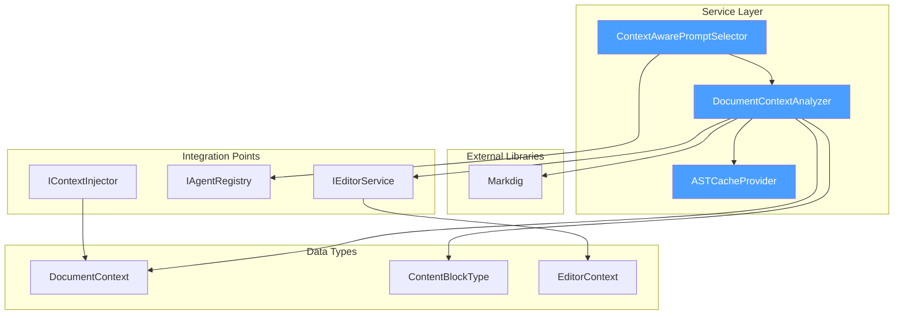

# LCS-DES-067c: Document-Aware Prompting

## Document Control

| Field            | Value                                                                    |
| :--------------- | :----------------------------------------------------------------------- |
| **Document ID**  | LCS-DES-067c                                                             |
| **Version**      | v0.6.7c                                                                  |
| **Title**        | Document-Aware Prompting                                                 |
| **Status**       | Draft                                                                    |
| **Module**       | Lexichord.Modules.Agents                                                 |
| **Created**      | 2026-01-28                                                               |
| **Author**       | Documentation Agent                                                      |
| **Related Docs** | [LCS-DES-067-INDEX](LCS-DES-067-INDEX.md), [LCS-SBD-067](LCS-SBD-067.md) |

---

## 1. Metadata & Categorization

| Aspect         | Details                                              |
| :------------- | :--------------------------------------------------- |
| **Area**       | Context Enrichment                                   |
| **Type**       | Feature                                              |
| **Complexity** | Medium                                               |
| **Impact**     | High - Enables intelligent context-aware suggestions |

---

## 2. Executive Summary

### 2.1 Purpose

Document-Aware Prompting transforms the Co-pilot from a generic chat assistant into a context-sensitive writing partner. By analyzing the Markdown AST structure of the active document, the system identifies where the user is working (section headings, code blocks, tables, lists) and enriches prompts with local context. This enables more relevant, contextually appropriate AI responses without requiring explicit user instructions.

### 2.2 Key Features

1. **Section Heading Detection**: Identifies current section from Markdown AST
2. **Local Context Window**: Includes 500 characters before and after cursor
3. **Content Type Detection**: Recognizes code blocks, tables, lists, blockquotes
4. **Context-Aware Prompt Selection**: Suggests appropriate prompts based on context
5. **Agent Auto-Suggestion**: Recommends relevant agent for content type

### 2.3 Dependencies

| Component          | Version | Usage                               |
| :----------------- | :------ | :---------------------------------- |
| `Markdig`          | v0.1.3b | Markdown AST parsing                |
| `IContextInjector` | v0.6.3d | Context assembly integration        |
| `IAgentRegistry`   | v0.6.6c | Agent discovery for suggestions     |
| `IPromptRenderer`  | v0.6.3b | Template variable injection         |
| `IEditorService`   | v0.1.3a | Cursor position and document access |

---

## 3. Architecture & Modular Strategy

### 3.1 Component Architecture



### 3.2 Module Placement

```text
Lexichord.Modules.Agents/
├── Services/
│   ├── DocumentContextAnalyzer.cs        # AST analysis service
│   ├── ContextAwarePromptSelector.cs     # Prompt recommendation
│   └── ASTCacheProvider.cs               # Cached AST per document
├── Models/
│   ├── DocumentContext.cs                # Context metadata record
│   ├── ContentBlockType.cs               # Block type enum
│   └── EditorContext.cs                  # Editor state record
└── Extensions/
    └── MarkdigExtensions.cs              # AST traversal helpers
```

---

## 4. Data Contract (The API)

### 4.1 IDocumentContextAnalyzer Interface

```csharp
namespace Lexichord.Modules.Agents.Services;

/// <summary>
/// Analyzes document structure to provide context for AI prompts.
/// </summary>
/// <remarks>
/// <para>
/// This service parses the Markdown AST of the active document to determine
/// the structural context at the cursor position. It identifies section
/// headings, content block types, and extracts local context for prompt
/// enrichment.
/// </para>
/// <para>
/// The analyzer maintains a cached AST per document, invalidating on edits.
/// This ensures fast repeated queries without re-parsing the entire document.
/// </para>
/// </remarks>
/// <example>
/// <code>
/// var context = await _analyzer.AnalyzeAtPositionAsync(docPath, cursorPos);
/// Console.WriteLine($"Section: {context.CurrentSection}");
/// Console.WriteLine($"Type: {context.ContentType}");
/// Console.WriteLine($"Suggested Agent: {context.SuggestedAgentId}");
/// </code>
/// </example>
public interface IDocumentContextAnalyzer
{
    /// <summary>
    /// Analyzes document structure at the specified cursor position.
    /// </summary>
    /// <param name="documentPath">Path to the document being analyzed.</param>
    /// <param name="cursorPosition">Zero-based cursor position in the document.</param>
    /// <param name="ct">Cancellation token for async operation.</param>
    /// <returns>
    /// A <see cref="DocumentContext"/> containing structural metadata.
    /// </returns>
    /// <exception cref="FileNotFoundException">
    /// Thrown when the document path does not exist.
    /// </exception>
    Task<DocumentContext> AnalyzeAtPositionAsync(
        string documentPath,
        int cursorPosition,
        CancellationToken ct = default);

    /// <summary>
    /// Detects the content block type at the specified position.
    /// </summary>
    /// <param name="position">Zero-based position in the document.</param>
    /// <returns>The detected content block type.</returns>
    ContentBlockType DetectContentType(int position);

    /// <summary>
    /// Gets the current section heading containing the cursor position.
    /// </summary>
    /// <param name="position">Zero-based position in the document.</param>
    /// <returns>The section heading text, or null if not in a heading section.</returns>
    string? GetCurrentSectionHeading(int position);

    /// <summary>
    /// Extracts surrounding text as local context.
    /// </summary>
    /// <param name="position">Zero-based position in the document.</param>
    /// <param name="charsBefore">Number of characters to include before position.</param>
    /// <param name="charsAfter">Number of characters to include after position.</param>
    /// <returns>The extracted local context string.</returns>
    string GetLocalContext(int position, int charsBefore = 500, int charsAfter = 500);

    /// <summary>
    /// Invalidates the cached AST for the specified document.
    /// </summary>
    /// <param name="documentPath">Path to the document to invalidate.</param>
    void InvalidateCache(string documentPath);
}
```

### 4.2 DocumentContext Record

```csharp
namespace Lexichord.Modules.Agents.Models;

/// <summary>
/// Contains structural metadata about the document at a specific cursor position.
/// </summary>
/// <param name="CurrentSection">
/// The heading text of the current section, or null if at document root.
/// </param>
/// <param name="ContentType">
/// The type of content block containing the cursor.
/// </param>
/// <param name="LocalContext">
/// Surrounding text within the configured character window.
/// </param>
/// <param name="CursorPosition">
/// The zero-based cursor position analyzed.
/// </param>
/// <param name="SuggestedAgentId">
/// The recommended agent ID based on content type, or null for default.
/// </param>
/// <param name="SectionLevel">
/// The heading level (1-6) of the current section, or 0 if none.
/// </param>
/// <param name="DocumentPath">
/// Path to the document being analyzed.
/// </param>
/// <example>
/// <code>
/// // Example context for cursor in a code block under "Implementation" heading
/// var context = new DocumentContext(
///     CurrentSection: "Implementation",
///     ContentType: ContentBlockType.CodeBlock,
///     LocalContext: "public class MyService...",
///     CursorPosition: 1542,
///     SuggestedAgentId: "code-helper",
///     SectionLevel: 2,
///     DocumentPath: "/docs/spec.md");
/// </code>
/// </example>
public record DocumentContext(
    string? CurrentSection,
    ContentBlockType ContentType,
    string LocalContext,
    int CursorPosition,
    string? SuggestedAgentId,
    int SectionLevel = 0,
    string? DocumentPath = null
)
{
    /// <summary>
    /// Creates an empty context for cases where analysis is not possible.
    /// </summary>
    public static DocumentContext Empty => new(
        CurrentSection: null,
        ContentType: ContentBlockType.Prose,
        LocalContext: string.Empty,
        CursorPosition: 0,
        SuggestedAgentId: null);

    /// <summary>
    /// Gets whether this context contains a section heading.
    /// </summary>
    public bool HasSection => !string.IsNullOrEmpty(CurrentSection);

    /// <summary>
    /// Gets whether this context suggests a specialized agent.
    /// </summary>
    public bool HasSuggestedAgent => !string.IsNullOrEmpty(SuggestedAgentId);
}
```

### 4.3 ContentBlockType Enum

```csharp
namespace Lexichord.Modules.Agents.Models;

/// <summary>
/// Identifies the type of content block containing the cursor.
/// </summary>
/// <remarks>
/// Used for context-aware prompt selection and agent recommendation.
/// Each type may trigger different default prompts or specialized agents.
/// </remarks>
public enum ContentBlockType
{
    /// <summary>
    /// Regular paragraph text (default).
    /// </summary>
    Prose = 0,

    /// <summary>
    /// Fenced or indented code block.
    /// </summary>
    CodeBlock = 1,

    /// <summary>
    /// Markdown table structure.
    /// </summary>
    Table = 2,

    /// <summary>
    /// Ordered or unordered list.
    /// </summary>
    List = 3,

    /// <summary>
    /// Heading element (H1-H6).
    /// </summary>
    Heading = 4,

    /// <summary>
    /// Blockquote section.
    /// </summary>
    Blockquote = 5,

    /// <summary>
    /// Front matter (YAML/TOML).
    /// </summary>
    FrontMatter = 6,

    /// <summary>
    /// Inline code span (not block).
    /// </summary>
    InlineCode = 7,

    /// <summary>
    /// Link or image reference.
    /// </summary>
    Link = 8
}
```

### 4.4 EditorContext Record

```csharp
namespace Lexichord.Modules.Agents.Models;

/// <summary>
/// Captures the current editor state for context analysis.
/// </summary>
/// <param name="DocumentPath">Path to the active document.</param>
/// <param name="CursorPosition">Current cursor position (zero-based).</param>
/// <param name="SelectionStart">Start of selection, if any.</param>
/// <param name="SelectionLength">Length of selection, if any.</param>
/// <param name="SelectedText">The selected text, if any.</param>
/// <param name="LineNumber">Current line number (1-based).</param>
/// <param name="ColumnNumber">Current column number (1-based).</param>
public record EditorContext(
    string DocumentPath,
    int CursorPosition,
    int? SelectionStart = null,
    int? SelectionLength = null,
    string? SelectedText = null,
    int LineNumber = 1,
    int ColumnNumber = 1
)
{
    /// <summary>
    /// Gets whether there is an active selection.
    /// </summary>
    public bool HasSelection => SelectionLength > 0;

    /// <summary>
    /// Creates an EditorContext from IEditorService.
    /// </summary>
    public static EditorContext FromEditorService(IEditorService editor)
    {
        return new EditorContext(
            DocumentPath: editor.CurrentDocumentPath ?? string.Empty,
            CursorPosition: editor.CaretOffset,
            SelectionStart: editor.HasSelection ? editor.SelectionStart : null,
            SelectionLength: editor.HasSelection ? editor.SelectionLength : null,
            SelectedText: editor.HasSelection ? editor.GetSelectedText() : null,
            LineNumber: editor.CurrentLine,
            ColumnNumber: editor.CurrentColumn);
    }
}
```

---

## 5. Implementation Logic

### 5.1 DocumentContextAnalyzer Implementation

```csharp
namespace Lexichord.Modules.Agents.Services;

/// <summary>
/// Implementation of <see cref="IDocumentContextAnalyzer"/> using Markdig.
/// </summary>
public class DocumentContextAnalyzer : IDocumentContextAnalyzer
{
    private readonly IEditorService _editorService;
    private readonly IAgentRegistry _agentRegistry;
    private readonly ASTCacheProvider _astCache;
    private readonly ILogger<DocumentContextAnalyzer> _logger;

    private static readonly MarkdownPipeline Pipeline = new MarkdownPipelineBuilder()
        .UseAdvancedExtensions()
        .UsePreciseSourceLocation()
        .Build();

    /// <summary>
    /// Initializes a new instance of the DocumentContextAnalyzer.
    /// </summary>
    public DocumentContextAnalyzer(
        IEditorService editorService,
        IAgentRegistry agentRegistry,
        ASTCacheProvider astCache,
        ILogger<DocumentContextAnalyzer> logger)
    {
        _editorService = editorService;
        _agentRegistry = agentRegistry;
        _astCache = astCache;
        _logger = logger;

        // Subscribe to document changes for cache invalidation
        _editorService.DocumentChanged += OnDocumentChanged;
    }

    /// <inheritdoc/>
    public async Task<DocumentContext> AnalyzeAtPositionAsync(
        string documentPath,
        int cursorPosition,
        CancellationToken ct = default)
    {
        _logger.LogDebug(
            "Analyzing document at position {Position}: {Path}",
            cursorPosition, documentPath);

        // ─────────────────────────────────────────────────────────────────
        // Get or Parse Document AST
        // ─────────────────────────────────────────────────────────────────
        var document = await _astCache.GetOrParseAsync(documentPath, ct);
        if (document == null)
        {
            _logger.LogWarning("Failed to parse document: {Path}", documentPath);
            return DocumentContext.Empty;
        }

        var content = await File.ReadAllTextAsync(documentPath, ct);

        // ─────────────────────────────────────────────────────────────────
        // Detect Content Type at Position
        // ─────────────────────────────────────────────────────────────────
        var contentType = DetectContentTypeFromAST(document, cursorPosition);
        _logger.LogDebug("Detected content type: {Type}", contentType);

        // ─────────────────────────────────────────────────────────────────
        // Find Section Heading
        // ─────────────────────────────────────────────────────────────────
        var (sectionHeading, sectionLevel) = FindSectionHeading(document, cursorPosition);
        _logger.LogDebug("Current section: {Section} (level {Level})",
            sectionHeading ?? "(root)", sectionLevel);

        // ─────────────────────────────────────────────────────────────────
        // Extract Local Context
        // ─────────────────────────────────────────────────────────────────
        var localContext = ExtractLocalContext(content, cursorPosition, 500, 500);

        // ─────────────────────────────────────────────────────────────────
        // Suggest Agent Based on Content Type
        // ─────────────────────────────────────────────────────────────────
        var suggestedAgentId = SuggestAgentForContentType(contentType, sectionHeading);

        var context = new DocumentContext(
            CurrentSection: sectionHeading,
            ContentType: contentType,
            LocalContext: localContext,
            CursorPosition: cursorPosition,
            SuggestedAgentId: suggestedAgentId,
            SectionLevel: sectionLevel,
            DocumentPath: documentPath);

        _logger.LogInformation(
            "Document context analyzed: Section={Section}, Type={Type}, Agent={Agent}",
            context.CurrentSection ?? "(root)",
            context.ContentType,
            context.SuggestedAgentId ?? "default");

        return context;
    }

    /// <inheritdoc/>
    public ContentBlockType DetectContentType(int position)
    {
        var documentPath = _editorService.CurrentDocumentPath;
        if (string.IsNullOrEmpty(documentPath))
            return ContentBlockType.Prose;

        var document = _astCache.GetCached(documentPath);
        return document != null
            ? DetectContentTypeFromAST(document, position)
            : ContentBlockType.Prose;
    }

    /// <inheritdoc/>
    public string? GetCurrentSectionHeading(int position)
    {
        var documentPath = _editorService.CurrentDocumentPath;
        if (string.IsNullOrEmpty(documentPath))
            return null;

        var document = _astCache.GetCached(documentPath);
        if (document == null)
            return null;

        var (heading, _) = FindSectionHeading(document, position);
        return heading;
    }

    /// <inheritdoc/>
    public string GetLocalContext(int position, int charsBefore = 500, int charsAfter = 500)
    {
        var content = _editorService.GetDocumentText();
        if (string.IsNullOrEmpty(content))
            return string.Empty;

        return ExtractLocalContext(content, position, charsBefore, charsAfter);
    }

    /// <inheritdoc/>
    public void InvalidateCache(string documentPath)
    {
        _logger.LogDebug("Invalidating AST cache for: {Path}", documentPath);
        _astCache.Invalidate(documentPath);
    }

    // ═══════════════════════════════════════════════════════════════════════
    // Private Implementation
    // ═══════════════════════════════════════════════════════════════════════

    private ContentBlockType DetectContentTypeFromAST(MarkdownDocument document, int position)
    {
        foreach (var block in document.Descendants())
        {
            if (!IsPositionInBlock(block, position))
                continue;

            return block switch
            {
                FencedCodeBlock or CodeBlock => ContentBlockType.CodeBlock,
                Table => ContentBlockType.Table,
                ListBlock or ListItemBlock => ContentBlockType.List,
                HeadingBlock => ContentBlockType.Heading,
                QuoteBlock => ContentBlockType.Blockquote,
                ThematicBreakBlock => ContentBlockType.Prose, // Treat as prose
                _ when block.Parent is FencedCodeBlock => ContentBlockType.CodeBlock,
                _ => ContentBlockType.Prose
            };
        }

        return ContentBlockType.Prose;
    }

    private (string? Heading, int Level) FindSectionHeading(
        MarkdownDocument document,
        int position)
    {
        string? nearestHeading = null;
        int nearestHeadingLevel = 0;
        int nearestHeadingEnd = -1;

        foreach (var block in document.Descendants<HeadingBlock>())
        {
            var headingEnd = block.Span.End;

            // Only consider headings that appear before the cursor
            if (headingEnd > position)
                continue;

            // Find the nearest heading before cursor
            if (headingEnd > nearestHeadingEnd)
            {
                nearestHeadingEnd = headingEnd;
                nearestHeading = block.Inline?.FirstChild?.ToString()?.Trim();
                nearestHeadingLevel = block.Level;
            }
        }

        return (nearestHeading, nearestHeadingLevel);
    }

    private static string ExtractLocalContext(
        string content,
        int position,
        int charsBefore,
        int charsAfter)
    {
        if (string.IsNullOrEmpty(content))
            return string.Empty;

        var start = Math.Max(0, position - charsBefore);
        var end = Math.Min(content.Length, position + charsAfter);
        var length = end - start;

        return content.Substring(start, length);
    }

    private static bool IsPositionInBlock(MarkdownObject block, int position)
    {
        return block.Span.Start <= position && position <= block.Span.End;
    }

    private string? SuggestAgentForContentType(
        ContentBlockType contentType,
        string? sectionHeading)
    {
        // Check section heading for keywords
        if (!string.IsNullOrEmpty(sectionHeading))
        {
            var headingLower = sectionHeading.ToLowerInvariant();

            if (headingLower.Contains("code") ||
                headingLower.Contains("implementation") ||
                headingLower.Contains("example"))
            {
                return TryGetAgent("code-helper");
            }

            if (headingLower.Contains("test") || headingLower.Contains("spec"))
            {
                return TryGetAgent("test-helper");
            }
        }

        // Suggest based on content type
        return contentType switch
        {
            ContentBlockType.CodeBlock => TryGetAgent("code-helper"),
            ContentBlockType.Table => TryGetAgent("data-helper"),
            _ => null // Use default agent
        };
    }

    private string? TryGetAgent(string agentId)
    {
        return _agentRegistry.AvailableAgents.Any(a => a.AgentId == agentId)
            ? agentId
            : null;
    }

    private void OnDocumentChanged(object? sender, DocumentChangedEventArgs e)
    {
        if (!string.IsNullOrEmpty(e.DocumentPath))
        {
            InvalidateCache(e.DocumentPath);
        }
    }
}
```

### 5.2 ASTCacheProvider

```csharp
namespace Lexichord.Modules.Agents.Services;

/// <summary>
/// Provides cached Markdown AST per document, invalidating on changes.
/// </summary>
public class ASTCacheProvider
{
    private readonly ConcurrentDictionary<string, MarkdownDocument> _cache = new();
    private readonly ILogger<ASTCacheProvider> _logger;

    private static readonly MarkdownPipeline Pipeline = new MarkdownPipelineBuilder()
        .UseAdvancedExtensions()
        .UsePreciseSourceLocation()
        .Build();

    /// <summary>
    /// Initializes a new instance of the ASTCacheProvider.
    /// </summary>
    public ASTCacheProvider(ILogger<ASTCacheProvider> logger)
    {
        _logger = logger;
    }

    /// <summary>
    /// Gets the cached AST or parses the document.
    /// </summary>
    public async Task<MarkdownDocument?> GetOrParseAsync(
        string documentPath,
        CancellationToken ct = default)
    {
        if (_cache.TryGetValue(documentPath, out var cached))
        {
            _logger.LogDebug("AST cache hit: {Path}", documentPath);
            return cached;
        }

        _logger.LogDebug("AST cache miss, parsing: {Path}", documentPath);

        try
        {
            var content = await File.ReadAllTextAsync(documentPath, ct);
            var document = Markdown.Parse(content, Pipeline);

            _cache[documentPath] = document;
            _logger.LogDebug("AST cached for: {Path}", documentPath);

            return document;
        }
        catch (Exception ex)
        {
            _logger.LogError(ex, "Failed to parse document: {Path}", documentPath);
            return null;
        }
    }

    /// <summary>
    /// Gets the cached AST without parsing.
    /// </summary>
    public MarkdownDocument? GetCached(string documentPath)
    {
        return _cache.TryGetValue(documentPath, out var cached) ? cached : null;
    }

    /// <summary>
    /// Invalidates the cache for the specified document.
    /// </summary>
    public void Invalidate(string documentPath)
    {
        if (_cache.TryRemove(documentPath, out _))
        {
            _logger.LogDebug("AST cache invalidated: {Path}", documentPath);
        }
    }

    /// <summary>
    /// Clears all cached ASTs.
    /// </summary>
    public void ClearAll()
    {
        _cache.Clear();
        _logger.LogDebug("All AST caches cleared");
    }
}
```

### 5.3 ContextAwarePromptSelector

```csharp
namespace Lexichord.Modules.Agents.Services;

/// <summary>
/// Selects appropriate prompts based on document context.
/// </summary>
public class ContextAwarePromptSelector
{
    private readonly IDocumentContextAnalyzer _analyzer;
    private readonly IPromptTemplateRepository _templates;
    private readonly ILogger<ContextAwarePromptSelector> _logger;

    /// <summary>
    /// Initializes a new instance of the ContextAwarePromptSelector.
    /// </summary>
    public ContextAwarePromptSelector(
        IDocumentContextAnalyzer analyzer,
        IPromptTemplateRepository templates,
        ILogger<ContextAwarePromptSelector> logger)
    {
        _analyzer = analyzer;
        _templates = templates;
        _logger = logger;
    }

    /// <summary>
    /// Selects the most appropriate prompt template for the given context.
    /// </summary>
    public async Task<IPromptTemplate?> SelectPromptAsync(
        EditorContext editorContext,
        CancellationToken ct = default)
    {
        var docContext = await _analyzer.AnalyzeAtPositionAsync(
            editorContext.DocumentPath,
            editorContext.CursorPosition,
            ct);

        var templateId = docContext.ContentType switch
        {
            ContentBlockType.CodeBlock => "context-code-review",
            ContentBlockType.Table => "context-table-help",
            ContentBlockType.List => "context-list-expand",
            _ => "context-general-improve"
        };

        _logger.LogDebug(
            "Selected prompt template {TemplateId} for content type {Type}",
            templateId, docContext.ContentType);

        return _templates.GetTemplate(templateId);
    }

    /// <summary>
    /// Gets a list of suggested prompts for the current context.
    /// </summary>
    public async Task<IReadOnlyList<PromptSuggestion>> GetSuggestionsAsync(
        EditorContext editorContext,
        CancellationToken ct = default)
    {
        var docContext = await _analyzer.AnalyzeAtPositionAsync(
            editorContext.DocumentPath,
            editorContext.CursorPosition,
            ct);

        var suggestions = new List<PromptSuggestion>();

        // Add content-type-specific suggestions
        switch (docContext.ContentType)
        {
            case ContentBlockType.CodeBlock:
                suggestions.Add(new("Review this code", "code-review"));
                suggestions.Add(new("Add comments", "code-comment"));
                suggestions.Add(new("Optimize", "code-optimize"));
                break;

            case ContentBlockType.Table:
                suggestions.Add(new("Add column", "table-add-column"));
                suggestions.Add(new("Sort by...", "table-sort"));
                break;

            case ContentBlockType.List:
                suggestions.Add(new("Add items", "list-expand"));
                suggestions.Add(new("Reorder", "list-reorder"));
                break;

            default:
                suggestions.Add(new("Improve writing", "prose-improve"));
                suggestions.Add(new("Simplify", "prose-simplify"));
                suggestions.Add(new("Expand", "prose-expand"));
                break;
        }

        // Add section-specific suggestions if available
        if (docContext.HasSection)
        {
            suggestions.Add(new($"Summarize {docContext.CurrentSection}", "section-summarize"));
        }

        return suggestions;
    }
}

/// <summary>
/// Represents a prompt suggestion for the current context.
/// </summary>
public record PromptSuggestion(string Label, string TemplateId);
```

---

## 6. Observability & Logging

### 6.1 Log Events

| Event ID | Level       | Template                                                                   |
| :------- | :---------- | :------------------------------------------------------------------------- |
| DOC001   | Debug       | `Analyzing document at position {Position}: {Path}`                        |
| DOC002   | Debug       | `Detected content type: {Type}`                                            |
| DOC003   | Debug       | `Current section: {Section} (level {Level})`                               |
| DOC004   | Information | `Document context analyzed: Section={Section}, Type={Type}, Agent={Agent}` |
| DOC005   | Warning     | `Failed to parse document: {Path}`                                         |
| DOC006   | Debug       | `Invalidating AST cache for: {Path}`                                       |
| DOC007   | Debug       | `AST cache hit: {Path}`                                                    |
| DOC008   | Debug       | `AST cache miss, parsing: {Path}`                                          |
| DOC009   | Debug       | `AST cached for: {Path}`                                                   |
| DOC010   | Debug       | `Selected prompt template {TemplateId} for content type {Type}`            |

### 6.2 Metrics

| Metric                       | Type      | Tags           |
| :--------------------------- | :-------- | :------------- |
| `document_analysis_total`    | Counter   | `content_type` |
| `document_analysis_duration` | Histogram | -              |
| `ast_cache_hits`             | Counter   | -              |
| `ast_cache_misses`           | Counter   | -              |
| `ast_parse_duration`         | Histogram | -              |

---

## 7. Acceptance Criteria

| #   | Criterion                                                | Test Method |
| :-- | :------------------------------------------------------- | :---------- |
| 1   | Service correctly detects code blocks from Markdown AST  | Unit        |
| 2   | Service correctly detects tables from Markdown AST       | Unit        |
| 3   | Service correctly detects lists from Markdown AST        | Unit        |
| 4   | Section heading is identified from cursor position       | Unit        |
| 5   | Local context includes 500 chars before and after cursor | Unit        |
| 6   | AST is cached per document                               | Unit        |
| 7   | Cache is invalidated on document change                  | Unit        |
| 8   | Suggested agent matches content type                     | Unit        |
| 9   | Analysis completes within 50ms for typical documents     | Performance |
| 10  | Context integrates with IContextInjector                 | Integration |

---

## 8. Unit Tests

### 8.1 Test Summary

| Test Class                        | Test Count | Focus Area         |
| :-------------------------------- | :--------: | :----------------- |
| `DocumentContextAnalyzerTests`    |     8      | AST analysis logic |
| `ASTCacheProviderTests`           |     4      | Caching behavior   |
| `ContextAwarePromptSelectorTests` |     4      | Prompt selection   |
| **Total**                         |   **16**   |                    |

### 8.2 Test Implementations

````csharp
namespace Lexichord.Modules.Agents.Tests.Services;

[Trait("Category", "Unit")]
[Trait("SubPart", "v0.6.7c")]
public class DocumentContextAnalyzerTests
{
    private readonly Mock<IEditorService> _editorMock;
    private readonly Mock<IAgentRegistry> _registryMock;
    private readonly ASTCacheProvider _astCache;
    private readonly DocumentContextAnalyzer _sut;

    public DocumentContextAnalyzerTests()
    {
        _editorMock = new Mock<IEditorService>();
        _registryMock = new Mock<IAgentRegistry>();
        _registryMock.Setup(r => r.AvailableAgents).Returns(Array.Empty<IAgent>());
        _astCache = new ASTCacheProvider(Mock.Of<ILogger<ASTCacheProvider>>());

        _sut = new DocumentContextAnalyzer(
            _editorMock.Object,
            _registryMock.Object,
            _astCache,
            Mock.Of<ILogger<DocumentContextAnalyzer>>());
    }

    [Theory]
    [InlineData("```csharp\nvar x = 1;\n```", 15, ContentBlockType.CodeBlock)]
    [InlineData("| A | B |\n|---|---|\n| 1 | 2 |", 10, ContentBlockType.Table)]
    [InlineData("- Item 1\n- Item 2", 5, ContentBlockType.List)]
    [InlineData("Regular paragraph text.", 10, ContentBlockType.Prose)]
    [InlineData("# Heading\n\nParagraph", 3, ContentBlockType.Heading)]
    [InlineData("> Quote text", 5, ContentBlockType.Blockquote)]
    public async Task AnalyzeAtPositionAsync_DetectsCorrectContentType(
        string markdown,
        int position,
        ContentBlockType expectedType)
    {
        // Arrange
        var tempFile = Path.GetTempFileName();
        await File.WriteAllTextAsync(tempFile, markdown);

        try
        {
            // Act
            var result = await _sut.AnalyzeAtPositionAsync(tempFile, position);

            // Assert
            result.ContentType.Should().Be(expectedType);
        }
        finally
        {
            File.Delete(tempFile);
        }
    }

    [Fact]
    public async Task AnalyzeAtPositionAsync_FindsSectionHeading()
    {
        // Arrange
        var markdown = """
            # Introduction

            Some intro text.

            ## Implementation

            The cursor is here.
            """;
        var tempFile = Path.GetTempFileName();
        await File.WriteAllTextAsync(tempFile, markdown);
        var cursorPosition = markdown.IndexOf("cursor");

        try
        {
            // Act
            var result = await _sut.AnalyzeAtPositionAsync(tempFile, cursorPosition);

            // Assert
            result.CurrentSection.Should().Be("Implementation");
            result.SectionLevel.Should().Be(2);
        }
        finally
        {
            File.Delete(tempFile);
        }
    }

    [Fact]
    public async Task AnalyzeAtPositionAsync_ExtractsLocalContext()
    {
        // Arrange
        var markdown = "A".PadRight(600, 'A') + "CURSOR" + "B".PadRight(600, 'B');
        var tempFile = Path.GetTempFileName();
        await File.WriteAllTextAsync(tempFile, markdown);
        var cursorPosition = markdown.IndexOf("CURSOR");

        try
        {
            // Act
            var result = await _sut.AnalyzeAtPositionAsync(tempFile, cursorPosition);

            // Assert
            result.LocalContext.Length.Should().BeApproximately(1000, 10);
            result.LocalContext.Should().Contain("CURSOR");
        }
        finally
        {
            File.Delete(tempFile);
        }
    }

    [Fact]
    public async Task AnalyzeAtPositionAsync_SuggestsCodeHelperForCodeBlock()
    {
        // Arrange
        var codeAgent = new Mock<IAgent>();
        codeAgent.Setup(a => a.AgentId).Returns("code-helper");
        _registryMock.Setup(r => r.AvailableAgents)
            .Returns(new[] { codeAgent.Object });

        var markdown = "```csharp\nvar x = 1;\n```";
        var tempFile = Path.GetTempFileName();
        await File.WriteAllTextAsync(tempFile, markdown);

        try
        {
            // Act
            var result = await _sut.AnalyzeAtPositionAsync(tempFile, 15);

            // Assert
            result.SuggestedAgentId.Should().Be("code-helper");
        }
        finally
        {
            File.Delete(tempFile);
        }
    }
}

[Trait("Category", "Unit")]
[Trait("SubPart", "v0.6.7c")]
public class ASTCacheProviderTests
{
    private readonly ASTCacheProvider _sut;

    public ASTCacheProviderTests()
    {
        _sut = new ASTCacheProvider(Mock.Of<ILogger<ASTCacheProvider>>());
    }

    [Fact]
    public async Task GetOrParseAsync_CachesResult()
    {
        // Arrange
        var tempFile = Path.GetTempFileName();
        await File.WriteAllTextAsync(tempFile, "# Test");

        try
        {
            // Act
            var first = await _sut.GetOrParseAsync(tempFile);
            var second = await _sut.GetOrParseAsync(tempFile);

            // Assert
            first.Should().BeSameAs(second);
        }
        finally
        {
            File.Delete(tempFile);
        }
    }

    [Fact]
    public async Task Invalidate_RemovesFromCache()
    {
        // Arrange
        var tempFile = Path.GetTempFileName();
        await File.WriteAllTextAsync(tempFile, "# Test");
        await _sut.GetOrParseAsync(tempFile);

        try
        {
            // Act
            _sut.Invalidate(tempFile);
            var cached = _sut.GetCached(tempFile);

            // Assert
            cached.Should().BeNull();
        }
        finally
        {
            File.Delete(tempFile);
        }
    }
}
````

---

## 9. DI Registration

```csharp
// In AgentsModule.cs

// ═══════════════════════════════════════════════════════════════════
// v0.6.7c: Document-Aware Prompting
// ═══════════════════════════════════════════════════════════════════
services.AddSingleton<ASTCacheProvider>();
services.AddSingleton<IDocumentContextAnalyzer, DocumentContextAnalyzer>();
services.AddSingleton<ContextAwarePromptSelector>();
```

---
