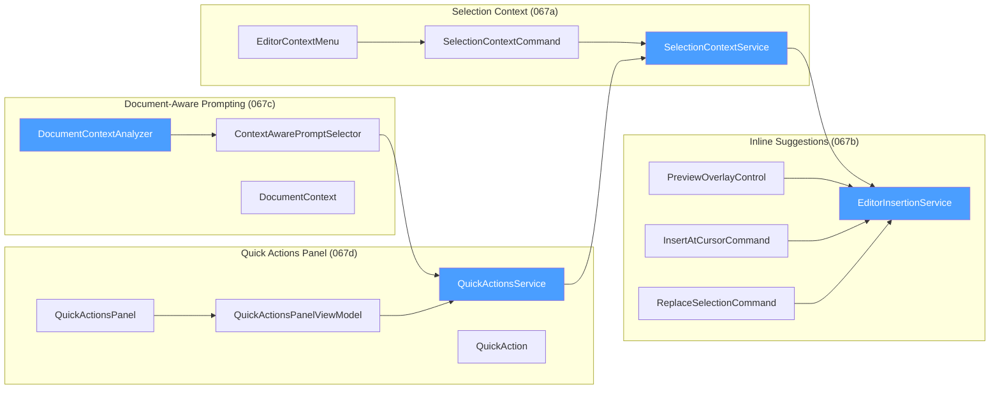
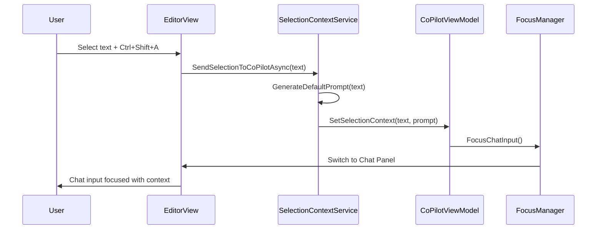
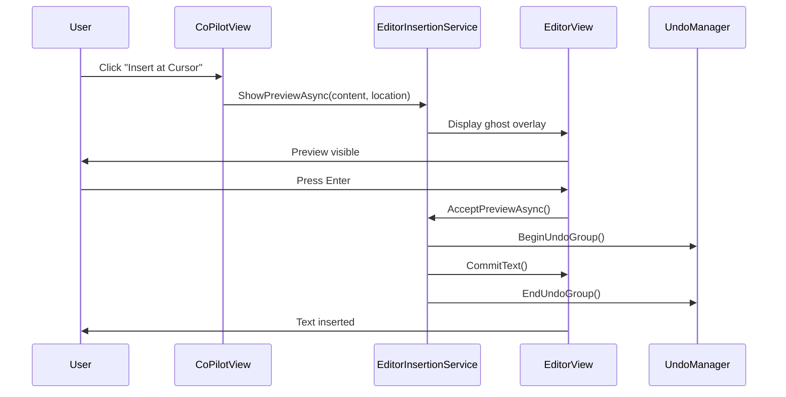
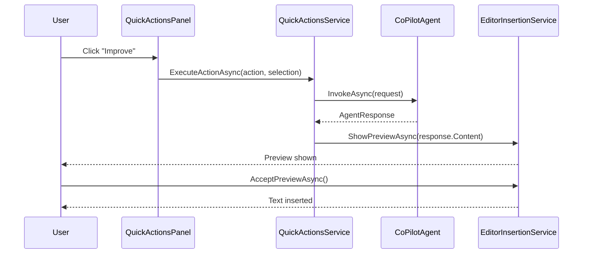

# LCS-DES-067-INDEX: Design Specification Index — The Document Bridge

## Document Control

| Field            | Value                                                          |
| :--------------- | :------------------------------------------------------------- |
| **Document ID**  | LCS-DES-067-INDEX                                              |
| **Version**      | v0.6.7                                                         |
| **Codename**     | The Document Bridge (Editor Integration)                       |
| **Status**       | Draft                                                          |
| **Module**       | Lexichord.Modules.Agents                                       |
| **Created**      | 2026-01-28                                                     |
| **Author**       | Documentation Agent                                            |
| **Related Docs** | [LCS-SBD-067](LCS-SBD-067.md), [Roadmap](../roadmap-v0.6.x.md) |

---

## 1. Overview

The Document Bridge integrates the Co-pilot Agent with the active document editor, creating a seamless bidirectional workflow for AI-assisted writing. This index coordinates four sub-specifications that together enable:

- **Selection-to-Chat Flow**: Send selected text to Co-pilot for analysis
- **Chat-to-Editor Flow**: Insert AI responses back into the document
- **Contextual Awareness**: Document structure informs prompt selection
- **Quick Access**: Floating toolbar for common AI operations

---

## 2. Sub-Part Index

| ID   | Name                     | Focus                         | Document                        |
| :--- | :----------------------- | :---------------------------- | :------------------------------ |
| 067a | Selection Context        | Selection-to-chat integration | [LCS-DES-067a](LCS-DES-067a.md) |
| 067b | Inline Suggestions       | Chat-to-editor insertion      | [LCS-DES-067b](LCS-DES-067b.md) |
| 067c | Document-Aware Prompting | AST-based context detection   | [LCS-DES-067c](LCS-DES-067c.md) |
| 067d | Quick Actions Panel      | Floating toolbar UI           | [LCS-DES-067d](LCS-DES-067d.md) |

---

## 3. External Dependency Graph

```mermaid
graph TB
    subgraph "v0.6.7 - The Document Bridge"
        DES067a[067a: Selection Context]
        DES067b[067b: Inline Suggestions]
        DES067c[067c: Document-Aware Prompting]
        DES067d[067d: Quick Actions Panel]
    end

    subgraph "v0.6.6 - The Co-pilot Agent"
        IA[IAgent]
        ARQ[AgentRequest]
        ARS[AgentResponse]
        CPA[CoPilotAgent]
        IAR[IAgentRegistry]
    end

    subgraph "v0.6.4 - Chat Interface"
        CPVM[CoPilotViewModel]
        CPV[CoPilotView]
    end

    subgraph "v0.6.3 - Template Engine"
        IPTR[IPromptTemplateRepository]
        ICI[IContextInjector]
        IPR[IPromptRenderer]
    end

    subgraph "Editor Module v0.1.3"
        IED[IEditorService]
        MKD[Markdig AST]
    end

    subgraph "Foundation"
        IKB[IKeyBindingService v0.1.5b]
        LIC[ILicenseContext v0.0.4c]
        MED[IMediator v0.0.7a]
    end

    DES067a --> CPVM
    DES067a --> ARQ
    DES067a --> IKB
    DES067b --> ARS
    DES067b --> IED
    DES067c --> MKD
    DES067c --> ICI
    DES067d --> CPA
    DES067d --> IAR
    DES067d --> IPTR

    style DES067a fill:#4a9eff,color:#fff
    style DES067b fill:#4a9eff,color:#fff
    style DES067c fill:#4a9eff,color:#fff
    style DES067d fill:#4a9eff,color:#fff
```



---

## 4. Internal Dependency Graph



---

## 5. Interface Summary

### 5.1 New Interfaces

| Interface                  | Module                   | Purpose                              |
| :------------------------- | :----------------------- | :----------------------------------- |
| `ISelectionContextService` | Lexichord.Modules.Agents | Selection-to-chat coordination       |
| `IEditorInsertionService`  | Lexichord.Abstractions   | Editor text insertion abstraction    |
| `IDocumentContextAnalyzer` | Lexichord.Modules.Agents | Document structure analysis          |
| `IQuickActionsService`     | Lexichord.Modules.Agents | Quick action discovery and execution |

### 5.2 Interface Definitions

```csharp
// ═══════════════════════════════════════════════════════════════════
// ISelectionContextService - Selection to Chat Bridge (v0.6.7a)
// ═══════════════════════════════════════════════════════════════════
namespace Lexichord.Modules.Agents.Services;

/// <summary>
/// Bridges selected text in the editor to the Co-pilot chat interface.
/// </summary>
public interface ISelectionContextService
{
    /// <summary>Sends selected text to Co-pilot with generated prompt.</summary>
    Task SendSelectionToCoPilotAsync(string selection, CancellationToken ct = default);

    /// <summary>Generates appropriate default prompt for selection.</summary>
    string GenerateDefaultPrompt(string selection);

    /// <summary>Indicates whether editor has active selection.</summary>
    bool HasActiveSelection { get; }
}

// ═══════════════════════════════════════════════════════════════════
// IEditorInsertionService - Chat to Editor Bridge (v0.6.7b)
// ═══════════════════════════════════════════════════════════════════
namespace Lexichord.Abstractions.Editor;

/// <summary>
/// Inserts AI-generated text into the editor with preview support.
/// </summary>
public interface IEditorInsertionService
{
    /// <summary>Inserts text at current cursor position.</summary>
    Task InsertAtCursorAsync(string text, CancellationToken ct = default);

    /// <summary>Replaces current selection with text.</summary>
    Task ReplaceSelectionAsync(string text, CancellationToken ct = default);

    /// <summary>Shows ghost text preview at location.</summary>
    Task ShowPreviewAsync(string text, TextSpan location, CancellationToken ct = default);

    /// <summary>Commits preview to document.</summary>
    Task<bool> AcceptPreviewAsync(CancellationToken ct = default);

    /// <summary>Dismisses preview without changes.</summary>
    Task RejectPreviewAsync(CancellationToken ct = default);

    /// <summary>Indicates whether preview is currently visible.</summary>
    bool IsPreviewActive { get; }
}

// ═══════════════════════════════════════════════════════════════════
// IDocumentContextAnalyzer - Structure Detection (v0.6.7c)
// ═══════════════════════════════════════════════════════════════════
namespace Lexichord.Modules.Agents.Services;

/// <summary>
/// Analyzes document structure to enhance prompt context.
/// </summary>
public interface IDocumentContextAnalyzer
{
    /// <summary>Analyzes document structure at cursor position.</summary>
    Task<DocumentContext> AnalyzeAtPositionAsync(
        string documentPath,
        int cursorPosition,
        CancellationToken ct = default);

    /// <summary>Detects content type (code, table, list, prose).</summary>
    ContentBlockType DetectContentType(int position);

    /// <summary>Gets current section heading if any.</summary>
    string? GetCurrentSectionHeading(int position);

    /// <summary>Extracts surrounding text as local context.</summary>
    string GetLocalContext(int position, int charsBefore = 500, int charsAfter = 500);
}

// ═══════════════════════════════════════════════════════════════════
// IQuickActionsService - Action Discovery and Execution (v0.6.7d)
// ═══════════════════════════════════════════════════════════════════
namespace Lexichord.Modules.Agents.Services;

/// <summary>
/// Provides quick action discovery and execution for floating toolbar.
/// </summary>
public interface IQuickActionsService
{
    /// <summary>Gets available actions for current context.</summary>
    IReadOnlyList<QuickAction> GetActionsForContext(EditorContext context);

    /// <summary>Executes quick action on selected text.</summary>
    Task<AgentResponse> ExecuteActionAsync(
        QuickAction action,
        string selectedText,
        CancellationToken ct = default);

    /// <summary>Registers custom action (Teams tier).</summary>
    void RegisterCustomAction(QuickAction action);
}
```

---

## 6. Data Flow Overview

### 6.1 Selection → Co-pilot Flow



### 6.2 Co-pilot → Editor Flow



### 6.3 Quick Action Flow



---

## 7. UI Component Layout

### 7.1 Editor Integration Points

```text
┌──────────────────────────────────────────────────────────────────────────────┐
│ Lexichord - Document Editor                                                   │
├──────────────────────────────────────────────────────────────────────────────┤
│ ┌────────────────────────────────────────────────────────┐ ┌───────────────┐ │
│ │                                                        │ │  Co-pilot     │ │
│ │  The quick brown ║fox jumps over the lazy dog║         │ │  Panel        │ │
│ │                  ▲ Selection                           │ │               │ │
│ │  ┌───────────────────────────────────────────┐         │ │ [Message...]  │ │
│ │  │ [✨ Improve] [📝 Simplify] [📖 Expand]▼   │         │ │               │ │
│ │  └───────────────────────────────────────────┘         │ │ [Insert ▼]    │ │
│ │  Quick Actions Panel (appears on selection)            │ │               │ │
│ │                                                        │ │               │ │
│ │  ░░░░░░░░░░░░░░░░░░░░░░░░░░░░░░░░░░░░░░░░░░░░░░░░░░░░  │ │               │ │
│ │  ░ The swift russet fox leaps gracefully over... ░     │ │               │ │
│ │  ░░░░░░░░░░░░░░░░░░░░░ [✓ Accept] [✗ Reject] ░░░░░░░  │ │               │ │
│ │  Preview Overlay (shown before inserting)              │ │               │ │
│ │                                                        │ │               │ │
│ └────────────────────────────────────────────────────────┘ └───────────────┘ │
└──────────────────────────────────────────────────────────────────────────────┘
```

### 7.2 Component Hierarchy

```text
MainWindow
├── EditorView
│   ├── TextEditor (AvaloniaEdit)
│   ├── QuickActionsPanel (floating, position-aware)
│   │   ├── ActionButton (Improve)
│   │   ├── ActionButton (Simplify)
│   │   ├── ActionButton (Expand)
│   │   └── ActionButton (Fix Grammar)
│   └── PreviewOverlayControl (ghost text)
│       ├── PreviewText
│       ├── AcceptButton
│       └── RejectButton
└── CoPilotView
    ├── MessageList
    │   └── ChatMessageView
    │       ├── MessageContent
    │       └── ActionButtons
    │           ├── InsertAtCursorButton
    │           └── ReplaceSelectionButton
    └── InputArea
        ├── SelectionContextIndicator
        └── MessageInput
```

---

## 8. Testing Summary

### 8.1 Test Distribution

| Sub-Part  | Unit Tests | Integration | Total  |
| :-------- | :--------: | :---------: | :----: |
| 067a      |     10     |      2      |   12   |
| 067b      |     15     |      3      |   18   |
| 067c      |     12     |      2      |   14   |
| 067d      |     10     |      3      |   13   |
| **Total** |   **47**   |   **10**    | **57** |

### 8.2 Critical Test Areas

| Area                      | Test Focus                              | Sub-Part |
| :------------------------ | :-------------------------------------- | :------- |
| Selection Capture         | Text capture, length limits             | 067a     |
| Default Prompt Generation | Prompt selection based on content       | 067a     |
| Cursor Position           | Accurate insertion position             | 067b     |
| Preview Overlay           | Render, accept, reject flows            | 067b     |
| Undo Transaction          | Single-step undo of AI insertion        | 067b     |
| AST Parsing               | Markdown structure detection            | 067c     |
| Content Type Detection    | Code, table, list, prose identification | 067c     |
| Panel Positioning         | Viewport-aware positioning              | 067d     |
| Action Execution          | Template-to-agent invocation            | 067d     |

---

## 9. DI Registration

### 9.1 AgentsModule Registration

```csharp
// In AgentsModule.cs - ConfigureServices method

// ═══════════════════════════════════════════════════════════════════
// v0.6.7 - The Document Bridge Services
// ═══════════════════════════════════════════════════════════════════

// v0.6.7a: Selection Context
services.AddSingleton<ISelectionContextService, SelectionContextService>();
services.AddTransient<SelectionContextCommand>();

// v0.6.7b: Inline Suggestions
services.AddSingleton<IEditorInsertionService, EditorInsertionService>();
services.AddTransient<InsertAtCursorCommand>();
services.AddTransient<ReplaceSelectionCommand>();

// v0.6.7c: Document-Aware Prompting
services.AddSingleton<IDocumentContextAnalyzer, DocumentContextAnalyzer>();
services.AddSingleton<ContextAwarePromptSelector>();

// v0.6.7d: Quick Actions Panel
services.AddSingleton<IQuickActionsService, QuickActionsService>();
services.AddTransient<QuickActionsPanelViewModel>();

// Built-in Quick Action Templates
services.AddSingleton<IPromptTemplate>(sp => new QuickActionTemplate(
    "quick-action-improve",
    "Improve this text while maintaining the original meaning and tone."));
services.AddSingleton<IPromptTemplate>(sp => new QuickActionTemplate(
    "quick-action-simplify",
    "Simplify this text for clarity and readability."));
services.AddSingleton<IPromptTemplate>(sp => new QuickActionTemplate(
    "quick-action-expand",
    "Expand this text with additional detail and context."));
services.AddSingleton<IPromptTemplate>(sp => new QuickActionTemplate(
    "quick-action-fix-grammar",
    "Fix any grammar, spelling, and punctuation errors in this text."));
```

### 9.2 Keybinding Registration

```json
// In keybindings.json
{
    "bindings": [
        {
            "command": "copilot.sendSelection",
            "key": "Ctrl+Shift+A",
            "when": "editorHasSelection",
            "description": "Send selection to Co-pilot"
        },
        {
            "command": "copilot.acceptPreview",
            "key": "Enter",
            "when": "previewOverlayActive",
            "description": "Accept preview insertion"
        },
        {
            "command": "copilot.rejectPreview",
            "key": "Escape",
            "when": "previewOverlayActive",
            "description": "Reject preview insertion"
        }
    ]
}
```

---

## 10. License Gating

### 10.1 Feature Access Matrix

| Feature                  | Free | WriterPro | Teams |
| :----------------------- | :--: | :-------: | :---: |
| Selection Context        |  ✗   |     ✓     |   ✓   |
| Inline Suggestions       |  ✗   |     ✓     |   ✓   |
| Document-Aware Prompting |  ✗   |     ✓     |   ✓   |
| Quick Actions Panel      |  ✗   |     ✓     |   ✓   |
| Custom Quick Actions     |  ✗   |     ✗     |   ✓   |
| Quick Action Analytics   |  ✗   |     ✗     |   ✓   |

### 10.2 License Check Implementation

```csharp
public class SelectionContextService : ISelectionContextService
{
    private readonly ILicenseContext _license;
    private readonly CoPilotViewModel _viewModel;
    private readonly ILogger<SelectionContextService> _logger;

    public async Task SendSelectionToCoPilotAsync(string selection, CancellationToken ct)
    {
        // License gating check
        if (!_license.HasFeature(LicenseFeature.CoPilotAgent))
        {
            _logger.LogWarning("Selection context requires WriterPro license");
            throw new LicenseRequiredException(
                LicenseTier.WriterPro,
                "Selection Context requires a WriterPro license.");
        }

        // Proceed with sending selection...
    }
}
```

---

## 11. Error Handling

### 11.1 Error Categories

| Error Type                    | Handling Strategy                 | User Feedback                    |
| :---------------------------- | :-------------------------------- | :------------------------------- |
| No Selection                  | Prevent action, show notification | "Please select text first"       |
| Selection Too Large           | Truncate for preview, full for AI | Silent truncation with indicator |
| Cursor Position Lost          | Re-validate before insertion      | "Cursor position changed"        |
| Preview Render Failure        | Fallback to modal preview         | Modal dialog with content        |
| Undo Stack Corruption         | Clear preview, log error          | "Unable to undo, please check"   |
| AST Parse Failure             | Default to prose context          | Silent fallback                  |
| Quick Action Template Missing | Skip action, log warning          | Action not shown in panel        |

### 11.2 Error Flow

```mermaid
flowchart TD
    START[Operation Attempted]
    CHECK_LICENSE{License Valid?}
    LICENSE_ERROR[Throw LicenseRequiredException]
    CHECK_SELECTION{Has Selection?}
    SELECTION_ERROR[Show "Select text first"]
    CHECK_POSITION{Cursor Valid?}
    POSITION_ERROR[Re-acquire position]
    EXECUTE[Execute Operation]
    HANDLE_ERROR{Error?}
    FALLBACK[Apply Fallback Strategy]
    SUCCESS[Operation Complete]

    START --> CHECK_LICENSE
    CHECK_LICENSE -->|No| LICENSE_ERROR
    CHECK_LICENSE -->|Yes| CHECK_SELECTION
    CHECK_SELECTION -->|No| SELECTION_ERROR
    CHECK_SELECTION -->|Yes| CHECK_POSITION
    CHECK_POSITION -->|Invalid| POSITION_ERROR
    CHECK_POSITION -->|Valid| EXECUTE
    POSITION_ERROR --> CHECK_POSITION
    EXECUTE --> HANDLE_ERROR
    HANDLE_ERROR -->|Yes| FALLBACK
    HANDLE_ERROR -->|No| SUCCESS
    FALLBACK --> SUCCESS

    style LICENSE_ERROR fill:#ff6b6b,color:#fff
    style SELECTION_ERROR fill:#ffa64a,color:#fff
    style SUCCESS fill:#4a9eff,color:#fff
```

---

## 12. Performance Considerations

### 12.1 Performance Targets

| Metric                    | Target  | Measurement                    |
| :------------------------ | :------ | :----------------------------- |
| Selection capture         | < 10ms  | Time to capture text           |
| Default prompt generation | < 5ms   | Time to analyze and generate   |
| Selection-to-chat focus   | < 200ms | Total latency                  |
| Preview overlay render    | < 100ms | Time to display ghost text     |
| Preview accept/reject     | < 50ms  | Time to commit or dismiss      |
| AST parsing               | < 50ms  | Document structure analysis    |
| Quick actions panel show  | < 500ms | Time from selection to visible |
| Action execution start    | < 100ms | Time to submit to agent        |

### 12.2 Optimization Strategies

| Strategy                | Implementation                        | Benefit                         |
| :---------------------- | :------------------------------------ | :------------------------------ |
| AST Caching             | Cache parsed AST per document         | Avoid re-parsing on each query  |
| Lazy Context Loading    | Load local context on demand          | Reduce memory for large docs    |
| Debounced Panel Display | 500ms delay before showing panel      | Reduce flicker on quick selects |
| Pooled String Builders  | Reuse builders for context extraction | Reduce allocations              |
| Incremental AST Updates | Update only changed sections          | Faster re-analysis after edits  |

---

## 13. Related Documents

| Document                                            | Relationship                  |
| :-------------------------------------------------- | :---------------------------- |
| [LCS-SBD-067](LCS-SBD-067.md)                       | Parent scope breakdown        |
| [LCS-DES-067a](LCS-DES-067a.md)                     | Selection Context spec        |
| [LCS-DES-067b](LCS-DES-067b.md)                     | Inline Suggestions spec       |
| [LCS-DES-067c](LCS-DES-067c.md)                     | Document-Aware Prompting spec |
| [LCS-DES-067d](LCS-DES-067d.md)                     | Quick Actions Panel spec      |
| [LCS-DES-066-INDEX](../v0.6.6/LCS-DES-066-INDEX.md) | Co-pilot Agent index          |
| [LCS-DES-064-INDEX](../v0.6.4/LCS-DES-064-INDEX.md) | Chat Interface index          |
| [Roadmap](../roadmap-v0.6.x.md)                     | Series roadmap                |

---
