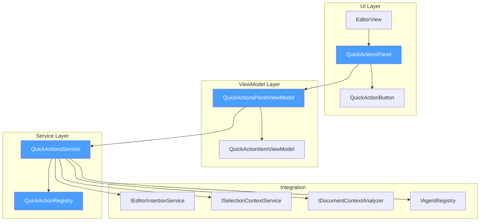

# LCS-DES-067d: Quick Actions Panel

## Document Control

| Field            | Value                                                                    |
| :--------------- | :----------------------------------------------------------------------- |
| **Document ID**  | LCS-DES-067d                                                             |
| **Version**      | v0.6.7d                                                                  |
| **Title**        | Quick Actions Panel                                                      |
| **Status**       | Draft                                                                    |
| **Module**       | Lexichord.Modules.Agents                                                 |
| **Created**      | 2026-01-28                                                               |
| **Author**       | Documentation Agent                                                      |
| **Related Docs** | [LCS-DES-067-INDEX](LCS-DES-067-INDEX.md), [LCS-SBD-067](LCS-SBD-067.md) |

---

## 1. Metadata & Categorization

| Aspect         | Details                                      |
| :------------- | :------------------------------------------- |
| **Area**       | Editor UI                                    |
| **Type**       | Feature                                      |
| **Complexity** | Medium                                       |
| **Impact**     | High - One-click AI assistance in the editor |

---

## 2. Executive Summary

### 2.1 Purpose

The Quick Actions Panel brings AI-powered writing assistance directly into the document editing flow. Instead of switching context to the chat panel, users can invoke common AI actions (Improve, Simplify, Expand, Summarize, Fix) from a floating toolbar that appears near the cursor or selection. Results can be previewed inline before accepting or rejecting, creating a seamless editing experience.

### 2.2 Key Features

1. **Floating Toolbar**: Appears near cursor on selection or via `Ctrl+.`
2. **Built-in Actions**: Improve, Simplify, Expand, Summarize, Fix
3. **Custom Actions**: User-defined quick actions with prompt templates
4. **Inline Preview**: Results displayed using v0.6.7b preview overlay
5. **Keyboard Navigation**: Full keyboard support with numbered shortcuts
6. **Context Awareness**: Actions adapt to content type from v0.6.7c

### 2.3 Dependencies

| Component                   | Version | Usage                            |
| :-------------------------- | :------ | :------------------------------- |
| `IEditorInsertionService`   | v0.6.7b | Preview and commit results       |
| `IDocumentContextAnalyzer`  | v0.6.7c | Content-aware action suggestions |
| `ISelectionContextService`  | v0.6.7a | Selection state and text         |
| `IAgentRegistry`            | v0.6.6c | Agent execution                  |
| `IPromptTemplateRepository` | v0.6.3  | Action prompt templates          |
| `ILicenseContext`           | v0.0.4c | WriterPro tier verification      |

---

## 3. Architecture & Modular Strategy

### 3.1 Component Architecture



### 3.2 Module Placement

```text
Lexichord.Modules.Agents/
├── Services/
│   ├── QuickActionsService.cs            # Action execution
│   └── QuickActionRegistry.cs            # Action definitions
├── Controls/
│   ├── QuickActionsPanel.axaml           # Floating panel UI
│   ├── QuickActionsPanel.axaml.cs        # Code-behind
│   ├── QuickActionButton.axaml           # Individual action button
│   └── QuickActionButton.axaml.cs
├── ViewModels/
│   ├── QuickActionsPanelViewModel.cs     # Panel state management
│   └── QuickActionItemViewModel.cs       # Action item state
├── Models/
│   ├── QuickAction.cs                    # Action definition
│   └── QuickActionExecutedEvent.cs       # Mediator event
└── PromptTemplates/
    └── QuickActionTemplates.cs           # Built-in prompt templates
```

---

## 4. Data Contract (The API)

### 4.1 IQuickActionsService Interface

```csharp
namespace Lexichord.Modules.Agents.Services;

/// <summary>
/// Provides quick action execution and management.
/// </summary>
/// <remarks>
/// <para>
/// Quick actions are pre-defined or custom AI operations that can be
/// invoked with a single click or keyboard shortcut. Each action is
/// associated with a prompt template and target agent.
/// </para>
/// <para>
/// Actions are context-aware and may be filtered based on the current
/// document content type (e.g., code-specific actions only appear when
/// the cursor is in a code block).
/// </para>
/// </remarks>
/// <example>
/// <code>
/// // Get available actions for current context
/// var actions = await _quickActions.GetAvailableActionsAsync();
///
/// // Execute an action on selection
/// var result = await _quickActions.ExecuteAsync("improve", selection);
/// if (result.Success)
/// {
///     await _insertionService.ShowPreviewAsync(result.Text, location);
/// }
/// </code>
/// </example>
public interface IQuickActionsService
{
    /// <summary>
    /// Gets all registered quick actions.
    /// </summary>
    IReadOnlyList<QuickAction> AllActions { get; }

    /// <summary>
    /// Gets actions available for the current editor context.
    /// </summary>
    /// <param name="ct">Cancellation token for async operation.</param>
    /// <returns>A filtered list of available actions.</returns>
    /// <remarks>
    /// Actions are filtered based on:
    /// - Current content type (code, prose, table, etc.)
    /// - Selection state (some actions require selection)
    /// - License tier (some actions are Teams-only)
    /// </remarks>
    Task<IReadOnlyList<QuickAction>> GetAvailableActionsAsync(
        CancellationToken ct = default);

    /// <summary>
    /// Executes a quick action on the specified text.
    /// </summary>
    /// <param name="actionId">The unique identifier of the action.</param>
    /// <param name="inputText">The text to process.</param>
    /// <param name="ct">Cancellation token for async operation.</param>
    /// <returns>The result of the action execution.</returns>
    /// <exception cref="ArgumentException">
    /// Thrown when the action ID is not registered.
    /// </exception>
    Task<QuickActionResult> ExecuteAsync(
        string actionId,
        string inputText,
        CancellationToken ct = default);

    /// <summary>
    /// Registers a custom quick action.
    /// </summary>
    /// <param name="action">The action to register.</param>
    /// <exception cref="InvalidOperationException">
    /// Thrown when an action with the same ID already exists.
    /// </exception>
    void RegisterAction(QuickAction action);

    /// <summary>
    /// Unregisters a custom quick action.
    /// </summary>
    /// <param name="actionId">The action ID to unregister.</param>
    /// <returns>True if the action was removed; false if not found.</returns>
    bool UnregisterAction(string actionId);

    /// <summary>
    /// Gets whether the quick actions panel should be visible.
    /// </summary>
    /// <remarks>
    /// The panel is visible when there is a selection or when
    /// explicitly triggered via keyboard shortcut.
    /// </remarks>
    bool ShouldShowPanel { get; }

    /// <summary>
    /// Raised when an action is executed.
    /// </summary>
    event EventHandler<QuickActionExecutedEventArgs>? ActionExecuted;
}

/// <summary>
/// Result of a quick action execution.
/// </summary>
public record QuickActionResult(
    bool Success,
    string Text,
    string? ErrorMessage = null,
    TimeSpan Duration = default
);
```

### 4.2 QuickAction Record

```csharp
namespace Lexichord.Modules.Agents.Models;

/// <summary>
/// Defines a quick action for the floating toolbar.
/// </summary>
/// <param name="ActionId">Unique identifier for the action.</param>
/// <param name="Name">Display name shown in the toolbar.</param>
/// <param name="Description">Tooltip description.</param>
/// <param name="Icon">Icon name from the icon set.</param>
/// <param name="PromptTemplateId">The prompt template to use.</param>
/// <param name="AgentId">Optional specific agent to use.</param>
/// <param name="KeyboardShortcut">Optional keyboard shortcut (e.g., "1").</param>
/// <param name="RequiresSelection">Whether selection is required.</param>
/// <param name="SupportedContentTypes">Content types this action applies to.</param>
/// <param name="MinimumLicenseTier">Minimum license tier required.</param>
/// <param name="Order">Display order in the toolbar.</param>
/// <example>
/// <code>
/// var improveAction = new QuickAction(
///     ActionId: "improve",
///     Name: "Improve",
///     Description: "Enhance the writing quality",
///     Icon: "IconSparkle",
///     PromptTemplateId: "quick-improve",
///     KeyboardShortcut: "1",
///     RequiresSelection: true,
///     SupportedContentTypes: new[] { ContentBlockType.Prose },
///     MinimumLicenseTier: LicenseTier.WriterPro,
///     Order: 0);
/// </code>
/// </example>
public record QuickAction(
    string ActionId,
    string Name,
    string Description,
    string Icon,
    string PromptTemplateId,
    string? AgentId = null,
    string? KeyboardShortcut = null,
    bool RequiresSelection = true,
    IReadOnlyList<ContentBlockType>? SupportedContentTypes = null,
    LicenseTier MinimumLicenseTier = LicenseTier.WriterPro,
    int Order = 100
)
{
    /// <summary>
    /// Gets whether this action supports all content types.
    /// </summary>
    public bool AppliesToAllContentTypes =>
        SupportedContentTypes == null || SupportedContentTypes.Count == 0;

    /// <summary>
    /// Checks if this action applies to the specified content type.
    /// </summary>
    public bool AppliesTo(ContentBlockType contentType)
    {
        return AppliesToAllContentTypes || SupportedContentTypes!.Contains(contentType);
    }
}
```

### 4.3 QuickActionExecutedEvent

```csharp
namespace Lexichord.Modules.Agents.Models;

/// <summary>
/// MediatR notification for quick action execution.
/// </summary>
public record QuickActionExecutedEvent(
    string ActionId,
    string ActionName,
    int InputCharacterCount,
    int OutputCharacterCount,
    TimeSpan Duration,
    bool Success,
    string? AgentId
) : INotification;

/// <summary>
/// Event args for the ActionExecuted event.
/// </summary>
public class QuickActionExecutedEventArgs : EventArgs
{
    /// <summary>
    /// The executed action.
    /// </summary>
    public required QuickAction Action { get; init; }

    /// <summary>
    /// The result of execution.
    /// </summary>
    public required QuickActionResult Result { get; init; }
}
```

### 4.4 Built-in Quick Actions

````csharp
namespace Lexichord.Modules.Agents;

/// <summary>
/// Defines the built-in quick actions and their prompt templates.
/// </summary>
public static class BuiltInQuickActions
{
    /// <summary>
    /// Gets all built-in quick action definitions.
    /// </summary>
    public static IReadOnlyList<QuickAction> All => new[]
    {
        // ═══════════════════════════════════════════════════════════════
        // Prose Actions
        // ═══════════════════════════════════════════════════════════════
        new QuickAction(
            ActionId: "improve",
            Name: "Improve",
            Description: "Enhance writing quality and clarity",
            Icon: "IconSparkle",
            PromptTemplateId: "quick-improve",
            KeyboardShortcut: "1",
            RequiresSelection: true,
            SupportedContentTypes: new[] { ContentBlockType.Prose },
            Order: 0),

        new QuickAction(
            ActionId: "simplify",
            Name: "Simplify",
            Description: "Make text clearer and more concise",
            Icon: "IconMinimize",
            PromptTemplateId: "quick-simplify",
            KeyboardShortcut: "2",
            RequiresSelection: true,
            SupportedContentTypes: new[] { ContentBlockType.Prose },
            Order: 1),

        new QuickAction(
            ActionId: "expand",
            Name: "Expand",
            Description: "Add more detail and depth",
            Icon: "IconExpand",
            PromptTemplateId: "quick-expand",
            KeyboardShortcut: "3",
            RequiresSelection: true,
            SupportedContentTypes: new[] { ContentBlockType.Prose },
            Order: 2),

        new QuickAction(
            ActionId: "summarize",
            Name: "Summarize",
            Description: "Create a brief summary",
            Icon: "IconSummary",
            PromptTemplateId: "quick-summarize",
            KeyboardShortcut: "4",
            RequiresSelection: true,
            Order: 3),

        new QuickAction(
            ActionId: "fix",
            Name: "Fix",
            Description: "Correct grammar and spelling",
            Icon: "IconCheck",
            PromptTemplateId: "quick-fix",
            KeyboardShortcut: "5",
            RequiresSelection: true,
            SupportedContentTypes: new[] { ContentBlockType.Prose },
            Order: 4),

        // ═══════════════════════════════════════════════════════════════
        // Code Actions
        // ═══════════════════════════════════════════════════════════════
        new QuickAction(
            ActionId: "explain-code",
            Name: "Explain",
            Description: "Explain what this code does",
            Icon: "IconQuestion",
            PromptTemplateId: "quick-explain-code",
            KeyboardShortcut: "6",
            RequiresSelection: true,
            SupportedContentTypes: new[] { ContentBlockType.CodeBlock },
            Order: 10),

        new QuickAction(
            ActionId: "add-comments",
            Name: "Comment",
            Description: "Add inline comments to code",
            Icon: "IconComment",
            PromptTemplateId: "quick-add-comments",
            KeyboardShortcut: "7",
            RequiresSelection: true,
            SupportedContentTypes: new[] { ContentBlockType.CodeBlock },
            Order: 11),

        // ═══════════════════════════════════════════════════════════════
        // Table Actions
        // ═══════════════════════════════════════════════════════════════
        new QuickAction(
            ActionId: "add-row",
            Name: "Add Row",
            Description: "Add a new row to the table",
            Icon: "IconPlus",
            PromptTemplateId: "quick-table-add-row",
            RequiresSelection: false,
            SupportedContentTypes: new[] { ContentBlockType.Table },
            Order: 20)
    };

    /// <summary>
    /// Gets the prompt templates for built-in actions.
    /// </summary>
    public static IReadOnlyDictionary<string, PromptTemplateDefinition> PromptTemplates =>
        new Dictionary<string, PromptTemplateDefinition>
        {
            ["quick-improve"] = new(
                TemplateId: "quick-improve",
                Name: "Quick Improve",
                SystemPrompt: """
                    You are a writing improvement assistant. Enhance the provided text
                    by improving clarity, flow, and word choice while maintaining the
                    original meaning and voice. Return ONLY the improved text.
                    """,
                UserPromptTemplate: "Improve this text:\n\n{{text}}"),

            ["quick-simplify"] = new(
                TemplateId: "quick-simplify",
                Name: "Quick Simplify",
                SystemPrompt: """
                    You are a simplification assistant. Make the text clearer and more
                    concise while preserving essential meaning. Use simpler words and
                    shorter sentences. Return ONLY the simplified text.
                    """,
                UserPromptTemplate: "Simplify this text:\n\n{{text}}"),

            ["quick-expand"] = new(
                TemplateId: "quick-expand",
                Name: "Quick Expand",
                SystemPrompt: """
                    You are an expansion assistant. Add more detail, examples, and depth
                    to the provided text while maintaining its original purpose and style.
                    Return ONLY the expanded text.
                    """,
                UserPromptTemplate: "Expand this text with more detail:\n\n{{text}}"),

            ["quick-summarize"] = new(
                TemplateId: "quick-summarize",
                Name: "Quick Summarize",
                SystemPrompt: """
                    You are a summarization assistant. Create a brief, accurate summary
                    of the provided text that captures the main points. Return ONLY the
                    summary.
                    """,
                UserPromptTemplate: "Summarize this text:\n\n{{text}}"),

            ["quick-fix"] = new(
                TemplateId: "quick-fix",
                Name: "Quick Fix",
                SystemPrompt: """
                    You are a proofreading assistant. Correct any grammar, spelling,
                    and punctuation errors in the text. Make minimal changes beyond
                    corrections. Return ONLY the corrected text.
                    """,
                UserPromptTemplate: "Fix errors in this text:\n\n{{text}}"),

            ["quick-explain-code"] = new(
                TemplateId: "quick-explain-code",
                Name: "Quick Explain Code",
                SystemPrompt: """
                    You are a code explanation assistant. Provide a clear, concise
                    explanation of what the code does. Return ONLY the explanation.
                    """,
                UserPromptTemplate: "Explain this code:\n\n```\n{{text}}\n```"),

            ["quick-add-comments"] = new(
                TemplateId: "quick-add-comments",
                Name: "Quick Add Comments",
                SystemPrompt: """
                    You are a code documentation assistant. Add helpful inline comments
                    to explain the code. Preserve the original code structure.
                    Return ONLY the commented code.
                    """,
                UserPromptTemplate: "Add comments to this code:\n\n```\n{{text}}\n```"),

            ["quick-table-add-row"] = new(
                TemplateId: "quick-table-add-row",
                Name: "Quick Table Add Row",
                SystemPrompt: """
                    You are a table editing assistant. Add a new row to the markdown
                    table with appropriate placeholder or inferred values based on
                    existing data. Return ONLY the complete table.
                    """,
                UserPromptTemplate: "Add a new row to this table:\n\n{{text}}")
        };
}

/// <summary>
/// Definition for a prompt template.
/// </summary>
public record PromptTemplateDefinition(
    string TemplateId,
    string Name,
    string SystemPrompt,
    string UserPromptTemplate
);
````

---

## 5. Implementation Logic

### 5.1 QuickActionsService Implementation

```csharp
namespace Lexichord.Modules.Agents.Services;

/// <summary>
/// Implementation of <see cref="IQuickActionsService"/>.
/// </summary>
public class QuickActionsService : IQuickActionsService
{
    private readonly IAgentRegistry _agentRegistry;
    private readonly IPromptTemplateRepository _templates;
    private readonly IPromptRenderer _renderer;
    private readonly IDocumentContextAnalyzer _contextAnalyzer;
    private readonly IEditorService _editorService;
    private readonly ILicenseContext _license;
    private readonly IMediator _mediator;
    private readonly ILogger<QuickActionsService> _logger;

    private readonly Dictionary<string, QuickAction> _actions = new();

    /// <summary>
    /// Initializes a new instance of the QuickActionsService.
    /// </summary>
    public QuickActionsService(
        IAgentRegistry agentRegistry,
        IPromptTemplateRepository templates,
        IPromptRenderer renderer,
        IDocumentContextAnalyzer contextAnalyzer,
        IEditorService editorService,
        ILicenseContext license,
        IMediator mediator,
        ILogger<QuickActionsService> logger)
    {
        _agentRegistry = agentRegistry;
        _templates = templates;
        _renderer = renderer;
        _contextAnalyzer = contextAnalyzer;
        _editorService = editorService;
        _license = license;
        _mediator = mediator;
        _logger = logger;

        // Register built-in actions
        foreach (var action in BuiltInQuickActions.All)
        {
            _actions[action.ActionId] = action;
        }
    }

    /// <inheritdoc/>
    public IReadOnlyList<QuickAction> AllActions =>
        _actions.Values.OrderBy(a => a.Order).ToList();

    /// <inheritdoc/>
    public bool ShouldShowPanel => _editorService.HasSelection;

    /// <inheritdoc/>
    public event EventHandler<QuickActionExecutedEventArgs>? ActionExecuted;

    /// <inheritdoc/>
    public async Task<IReadOnlyList<QuickAction>> GetAvailableActionsAsync(
        CancellationToken ct = default)
    {
        // ─────────────────────────────────────────────────────────────────
        // Get Current Context
        // ─────────────────────────────────────────────────────────────────
        var documentPath = _editorService.CurrentDocumentPath;
        var cursorPosition = _editorService.CaretOffset;
        var hasSelection = _editorService.HasSelection;

        ContentBlockType contentType = ContentBlockType.Prose;

        if (!string.IsNullOrEmpty(documentPath))
        {
            var context = await _contextAnalyzer.AnalyzeAtPositionAsync(
                documentPath, cursorPosition, ct);
            contentType = context.ContentType;
        }

        _logger.LogDebug(
            "Filtering actions for content type {Type}, hasSelection={HasSelection}",
            contentType, hasSelection);

        // ─────────────────────────────────────────────────────────────────
        // Filter Actions
        // ─────────────────────────────────────────────────────────────────
        var availableActions = _actions.Values
            .Where(a => a.AppliesTo(contentType))
            .Where(a => !a.RequiresSelection || hasSelection)
            .Where(a => _license.CurrentTier >= a.MinimumLicenseTier)
            .OrderBy(a => a.Order)
            .ToList();

        _logger.LogDebug(
            "Available actions: {Count} of {Total}",
            availableActions.Count, _actions.Count);

        return availableActions;
    }

    /// <inheritdoc/>
    public async Task<QuickActionResult> ExecuteAsync(
        string actionId,
        string inputText,
        CancellationToken ct = default)
    {
        if (!_actions.TryGetValue(actionId, out var action))
        {
            throw new ArgumentException($"Unknown action: {actionId}", nameof(actionId));
        }

        _logger.LogDebug(
            "Executing quick action {ActionId}: {CharCount} chars",
            actionId, inputText.Length);

        var stopwatch = System.Diagnostics.Stopwatch.StartNew();

        try
        {
            // ─────────────────────────────────────────────────────────────
            // Get Prompt Template
            // ─────────────────────────────────────────────────────────────
            var template = _templates.GetTemplate(action.PromptTemplateId);
            if (template == null)
            {
                _logger.LogError(
                    "Prompt template not found: {TemplateId}",
                    action.PromptTemplateId);
                return new QuickActionResult(
                    Success: false,
                    Text: string.Empty,
                    ErrorMessage: "Prompt template not found");
            }

            // ─────────────────────────────────────────────────────────────
            // Render Prompt with Input Text
            // ─────────────────────────────────────────────────────────────
            var variables = new Dictionary<string, object>
            {
                ["text"] = inputText
            };

            var messages = _renderer.RenderMessages(template, variables);

            // ─────────────────────────────────────────────────────────────
            // Get Agent and Execute
            // ─────────────────────────────────────────────────────────────
            var agent = !string.IsNullOrEmpty(action.AgentId)
                ? _agentRegistry.GetAgent(action.AgentId)
                : _agentRegistry.GetDefaultAgent();

            if (agent == null)
            {
                _logger.LogError("No agent available for action {ActionId}", actionId);
                return new QuickActionResult(
                    Success: false,
                    Text: string.Empty,
                    ErrorMessage: "No agent available");
            }

            _logger.LogDebug("Using agent {AgentId} for action {ActionId}",
                agent.AgentId, actionId);

            var request = new AgentRequest(
                UserMessage: messages.Last().Content,
                History: messages.SkipLast(1).ToList());

            var response = await agent.InvokeAsync(request, ct);

            stopwatch.Stop();

            // ─────────────────────────────────────────────────────────────
            // Create Result
            // ─────────────────────────────────────────────────────────────
            var result = new QuickActionResult(
                Success: true,
                Text: response.Content,
                Duration: stopwatch.Elapsed);

            _logger.LogInformation(
                "Quick action {ActionId} completed: {InputChars} → {OutputChars} chars in {Duration}ms",
                actionId, inputText.Length, response.Content.Length, stopwatch.ElapsedMilliseconds);

            // ─────────────────────────────────────────────────────────────
            // Publish Event
            // ─────────────────────────────────────────────────────────────
            var executedEvent = new QuickActionExecutedEvent(
                ActionId: actionId,
                ActionName: action.Name,
                InputCharacterCount: inputText.Length,
                OutputCharacterCount: response.Content.Length,
                Duration: stopwatch.Elapsed,
                Success: true,
                AgentId: agent.AgentId);

            await _mediator.Publish(executedEvent, ct);

            ActionExecuted?.Invoke(this, new QuickActionExecutedEventArgs
            {
                Action = action,
                Result = result
            });

            return result;
        }
        catch (Exception ex)
        {
            stopwatch.Stop();

            _logger.LogError(ex, "Quick action {ActionId} failed", actionId);

            return new QuickActionResult(
                Success: false,
                Text: string.Empty,
                ErrorMessage: ex.Message,
                Duration: stopwatch.Elapsed);
        }
    }

    /// <inheritdoc/>
    public void RegisterAction(QuickAction action)
    {
        if (_actions.ContainsKey(action.ActionId))
        {
            throw new InvalidOperationException(
                $"Action with ID '{action.ActionId}' already exists.");
        }

        _actions[action.ActionId] = action;
        _logger.LogInformation("Registered custom action: {ActionId}", action.ActionId);
    }

    /// <inheritdoc/>
    public bool UnregisterAction(string actionId)
    {
        if (_actions.Remove(actionId))
        {
            _logger.LogInformation("Unregistered action: {ActionId}", actionId);
            return true;
        }

        return false;
    }
}
```

### 5.2 QuickActionsPanelViewModel

```csharp
namespace Lexichord.Modules.Agents.ViewModels;

/// <summary>
/// ViewModel for the quick actions floating panel.
/// </summary>
public partial class QuickActionsPanelViewModel : ObservableObject
{
    private readonly IQuickActionsService _quickActions;
    private readonly IEditorInsertionService _insertionService;
    private readonly ISelectionContextService _selectionContext;
    private readonly IEditorService _editorService;
    private readonly ILogger<QuickActionsPanelViewModel> _logger;

    [ObservableProperty]
    private bool _isVisible;

    [ObservableProperty]
    private bool _isExecuting;

    [ObservableProperty]
    private ObservableCollection<QuickActionItemViewModel> _actions = new();

    [ObservableProperty]
    private double _top;

    [ObservableProperty]
    private double _left;

    /// <summary>
    /// Initializes a new instance of the QuickActionsPanelViewModel.
    /// </summary>
    public QuickActionsPanelViewModel(
        IQuickActionsService quickActions,
        IEditorInsertionService insertionService,
        ISelectionContextService selectionContext,
        IEditorService editorService,
        ILogger<QuickActionsPanelViewModel> logger)
    {
        _quickActions = quickActions;
        _insertionService = insertionService;
        _selectionContext = selectionContext;
        _editorService = editorService;
        _logger = logger;

        // Subscribe to selection changes
        _editorService.SelectionChanged += OnSelectionChanged;
    }

    /// <summary>
    /// Shows the panel with available actions.
    /// </summary>
    public async Task ShowAsync(CancellationToken ct = default)
    {
        if (!_editorService.HasSelection)
        {
            _logger.LogDebug("Cannot show panel: no selection");
            return;
        }

        var availableActions = await _quickActions.GetAvailableActionsAsync(ct);

        Actions.Clear();
        foreach (var action in availableActions)
        {
            Actions.Add(new QuickActionItemViewModel(action, ExecuteActionAsync));
        }

        // Position near selection
        UpdatePosition();
        IsVisible = true;

        _logger.LogDebug("Quick actions panel shown with {Count} actions", Actions.Count);
    }

    /// <summary>
    /// Hides the panel.
    /// </summary>
    public void Hide()
    {
        IsVisible = false;
        _logger.LogDebug("Quick actions panel hidden");
    }

    /// <summary>
    /// Executes the action at the specified index (for keyboard shortcuts).
    /// </summary>
    [RelayCommand]
    private async Task ExecuteByIndexAsync(int index)
    {
        if (index >= 0 && index < Actions.Count)
        {
            await ExecuteActionAsync(Actions[index].Action);
        }
    }

    private async Task ExecuteActionAsync(QuickAction action)
    {
        if (IsExecuting) return;

        var selectedText = _editorService.GetSelectedText();
        if (string.IsNullOrEmpty(selectedText))
        {
            _logger.LogWarning("No selection for action {ActionId}", action.ActionId);
            return;
        }

        IsExecuting = true;

        try
        {
            _logger.LogDebug("Executing action {ActionId}", action.ActionId);

            var result = await _quickActions.ExecuteAsync(action.ActionId, selectedText);

            if (result.Success)
            {
                // Show preview using v0.6.7b insertion service
                var selectionStart = _editorService.SelectionStart;
                var selectionLength = _editorService.SelectionLength;
                var location = new TextSpan(selectionStart, selectionLength);

                await _insertionService.ShowPreviewAsync(result.Text, location);

                // Hide panel after initiating preview
                Hide();
            }
            else
            {
                _logger.LogError(
                    "Action {ActionId} failed: {Error}",
                    action.ActionId, result.ErrorMessage);
            }
        }
        finally
        {
            IsExecuting = false;
        }
    }

    private void OnSelectionChanged(object? sender, EventArgs e)
    {
        if (_editorService.HasSelection)
        {
            // Delay to avoid flickering during selection
            Dispatcher.UIThread.Post(async () =>
            {
                await Task.Delay(200);
                if (_editorService.HasSelection && !IsVisible)
                {
                    await ShowAsync();
                }
            });
        }
        else
        {
            Hide();
        }
    }

    private void UpdatePosition()
    {
        // Get selection visual bounds from editor
        var bounds = _editorService.GetSelectionBounds();

        // Position panel below and to the right of selection
        Top = bounds.Bottom + 8;
        Left = bounds.Right - 50;
    }
}

/// <summary>
/// ViewModel for an individual quick action button.
/// </summary>
public partial class QuickActionItemViewModel : ObservableObject
{
    private readonly Func<QuickAction, Task> _executeCallback;

    [ObservableProperty]
    private bool _isExecuting;

    /// <summary>
    /// The underlying action definition.
    /// </summary>
    public QuickAction Action { get; }

    /// <summary>
    /// Initializes a new instance of the QuickActionItemViewModel.
    /// </summary>
    public QuickActionItemViewModel(QuickAction action, Func<QuickAction, Task> executeCallback)
    {
        Action = action;
        _executeCallback = executeCallback;
    }

    /// <summary>
    /// Executes this action.
    /// </summary>
    [RelayCommand]
    private async Task ExecuteAsync()
    {
        if (IsExecuting) return;

        IsExecuting = true;
        try
        {
            await _executeCallback(Action);
        }
        finally
        {
            IsExecuting = false;
        }
    }
}
```

---

## 6. UI/UX Specifications

### 6.1 Panel Design

```text
Selection in editor:
"The quick brown fox jumps over the lazy dog."
                    ▼
┌─────────────────────────────────────────────────────┐
│                                                     │
│  ✨ Improve  │  ▼ Simplify  │  ⬆ Expand  │  📋 ...  │◄── Floating panel
│     [1]      │     [2]      │    [3]     │          │
│                                                     │
└─────────────────────────────────────────────────────┘
    ▲ Appears near selection
```

### 6.2 QuickActionsPanel Control

```csharp
// QuickActionsPanel.axaml
<UserControl x:Class="Lexichord.Modules.Agents.Controls.QuickActionsPanel"
             xmlns="https://github.com/avaloniaui"
             xmlns:x="http://schemas.microsoft.com/winfx/2006/xaml"
             xmlns:vm="using:Lexichord.Modules.Agents.ViewModels"
             x:DataType="vm:QuickActionsPanelViewModel">

    <Border Classes="quickActionsPanel"
            IsVisible="{Binding IsVisible}"
            Background="{DynamicResource Brush.Surface.Elevated}"
            BorderBrush="{DynamicResource Brush.Border.Subtle}"
            BorderThickness="1"
            CornerRadius="8"
            Padding="4">

        <StackPanel Orientation="Horizontal" Spacing="2">
            <ItemsControl ItemsSource="{Binding Actions}">
                <ItemsControl.ItemsPanel>
                    <ItemsPanelTemplate>
                        <StackPanel Orientation="Horizontal" Spacing="2"/>
                    </ItemsPanelTemplate>
                </ItemsControl.ItemsPanel>

                <ItemsControl.ItemTemplate>
                    <DataTemplate x:DataType="vm:QuickActionItemViewModel">
                        <Button Command="{Binding ExecuteCommand}"
                                ToolTip.Tip="{Binding Action.Description}"
                                Classes="quickAction"
                                IsEnabled="{Binding !IsExecuting}">

                            <StackPanel Orientation="Horizontal" Spacing="6">
                                <PathIcon Data="{Binding Action.Icon, Converter={StaticResource IconConverter}}"
                                          Width="14" Height="14"/>
                                <TextBlock Text="{Binding Action.Name}"
                                           FontSize="12"/>

                                <!-- Keyboard shortcut indicator -->
                                <Border Classes="shortcutBadge"
                                        IsVisible="{Binding Action.KeyboardShortcut, Converter={x:Static StringConverters.IsNotNullOrEmpty}}">
                                    <TextBlock Text="{Binding Action.KeyboardShortcut}"
                                               FontSize="10"
                                               Opacity="0.6"/>
                                </Border>
                            </StackPanel>
                        </Button>
                    </DataTemplate>
                </ItemsControl.ItemTemplate>
            </ItemsControl>

            <!-- More actions menu -->
            <Button Classes="ghost iconOnly"
                    ToolTip.Tip="More actions">
                <PathIcon Data="{StaticResource IconMoreHorizontal}"
                          Width="14" Height="14"/>
            </Button>
        </StackPanel>
    </Border>

    <UserControl.Styles>
        <Style Selector="Border.quickActionsPanel">
            <Setter Property="Effect">
                <DropShadowEffect BlurRadius="12" Opacity="0.2" OffsetY="4"/>
            </Setter>
        </Style>

        <Style Selector="Button.quickAction">
            <Setter Property="Background" Value="Transparent"/>
            <Setter Property="Padding" Value="8,6"/>
            <Setter Property="CornerRadius" Value="4"/>
        </Style>

        <Style Selector="Button.quickAction:pointerover">
            <Setter Property="Background" Value="{DynamicResource Brush.Surface.Hover}"/>
        </Style>

        <Style Selector="Border.shortcutBadge">
            <Setter Property="Background" Value="{DynamicResource Brush.Surface.Subtle}"/>
            <Setter Property="CornerRadius" Value="2"/>
            <Setter Property="Padding" Value="4,1"/>
        </Style>
    </UserControl.Styles>
</UserControl>
```

---

## 7. Keyboard Bindings

| Key      | Condition        | Action                          |
| :------- | :--------------- | :------------------------------ |
| `Ctrl+.` | Selection exists | Show/toggle quick actions panel |
| `1-9`    | Panel visible    | Execute action by index         |
| `Escape` | Panel visible    | Hide panel                      |
| `Enter`  | Preview active   | Accept preview (from v0.6.7b)   |

```csharp
// Keyboard binding registration
keyBindingService.RegisterBinding(new KeyBinding(
    Key: Key.OemPeriod,
    Modifiers: KeyModifiers.Control,
    CommandId: "QuickActions.Toggle",
    Condition: () => _editorService.HasSelection,
    Scope: KeyBindingScope.Editor));

for (int i = 1; i <= 9; i++)
{
    var index = i - 1;
    keyBindingService.RegisterBinding(new KeyBinding(
        Key: (Key)((int)Key.D0 + i),
        Modifiers: KeyModifiers.None,
        CommandId: $"QuickActions.ExecuteIndex{index}",
        Condition: () => _quickActionsPanel.IsVisible,
        Scope: KeyBindingScope.Editor));
}
```

---

## 8. Observability & Logging

### 8.1 Log Events

| Event ID | Level       | Template                                                                                |
| :------- | :---------- | :-------------------------------------------------------------------------------------- |
| QAC001   | Debug       | `Filtering actions for content type {Type}, hasSelection={HasSelection}`                |
| QAC002   | Debug       | `Available actions: {Count} of {Total}`                                                 |
| QAC003   | Debug       | `Executing quick action {ActionId}: {CharCount} chars`                                  |
| QAC004   | Debug       | `Using agent {AgentId} for action {ActionId}`                                           |
| QAC005   | Information | `Quick action {ActionId} completed: {InputChars} → {OutputChars} chars in {Duration}ms` |
| QAC006   | Error       | `Quick action {ActionId} failed: {Error}`                                               |
| QAC007   | Information | `Registered custom action: {ActionId}`                                                  |
| QAC008   | Information | `Unregistered action: {ActionId}`                                                       |
| QAC009   | Debug       | `Quick actions panel shown with {Count} actions`                                        |
| QAC010   | Debug       | `Quick actions panel hidden`                                                            |

### 8.2 Metrics

| Metric                          | Type      | Tags                   |
| :------------------------------ | :-------- | :--------------------- |
| `quick_action_executions_total` | Counter   | `action_id`, `success` |
| `quick_action_duration`         | Histogram | `action_id`            |
| `quick_action_input_chars`      | Histogram | `action_id`            |
| `quick_action_output_chars`     | Histogram | `action_id`            |
| `quick_action_panel_shown`      | Counter   | -                      |

---

## 9. Acceptance Criteria

| #   | Criterion                                              | Test Method   |
| :-- | :----------------------------------------------------- | :------------ |
| 1   | Panel appears near selection when text is selected     | Manual        |
| 2   | Panel shows Improve, Simplify, Expand, Fix for prose   | Manual + Unit |
| 3   | `Ctrl+.` toggles panel visibility                      | Manual        |
| 4   | Number keys 1-5 execute corresponding actions          | Manual + Unit |
| 5   | Clicking action executes and shows preview             | Manual        |
| 6   | Panel hides after action preview is shown              | Manual        |
| 7   | Code-specific actions appear for code block selections | Unit          |
| 8   | Actions respect license tier requirements              | Unit          |
| 9   | Custom actions can be registered and unregistered      | Unit          |
| 10  | MediatR event is published on action execution         | Unit          |
| 11  | Panel position updates with selection changes          | Manual        |
| 12  | Escape key hides the panel                             | Manual        |

---

## 10. Unit Tests

### 10.1 Test Summary

| Test Class                        | Test Count | Focus Area         |
| :-------------------------------- | :--------: | :----------------- |
| `QuickActionsServiceTests`        |     8      | Service logic      |
| `QuickActionTests`                |     3      | Model utilities    |
| `QuickActionsPanelViewModelTests` |     4      | ViewModel behavior |
| **Total**                         |   **15**   |                    |

### 10.2 Test Implementations

```csharp
namespace Lexichord.Modules.Agents.Tests.Services;

[Trait("Category", "Unit")]
[Trait("SubPart", "v0.6.7d")]
public class QuickActionsServiceTests
{
    private readonly Mock<IAgentRegistry> _agentRegistryMock;
    private readonly Mock<IPromptTemplateRepository> _templatesMock;
    private readonly Mock<IPromptRenderer> _rendererMock;
    private readonly Mock<IDocumentContextAnalyzer> _analyzerMock;
    private readonly Mock<IEditorService> _editorMock;
    private readonly Mock<ILicenseContext> _licenseMock;
    private readonly Mock<IMediator> _mediatorMock;
    private readonly QuickActionsService _sut;

    public QuickActionsServiceTests()
    {
        _agentRegistryMock = new Mock<IAgentRegistry>();
        _templatesMock = new Mock<IPromptTemplateRepository>();
        _rendererMock = new Mock<IPromptRenderer>();
        _analyzerMock = new Mock<IDocumentContextAnalyzer>();
        _editorMock = new Mock<IEditorService>();
        _licenseMock = new Mock<ILicenseContext>();
        _mediatorMock = new Mock<IMediator>();

        _licenseMock.Setup(l => l.CurrentTier).Returns(LicenseTier.WriterPro);

        _sut = new QuickActionsService(
            _agentRegistryMock.Object,
            _templatesMock.Object,
            _rendererMock.Object,
            _analyzerMock.Object,
            _editorMock.Object,
            _licenseMock.Object,
            _mediatorMock.Object,
            Mock.Of<ILogger<QuickActionsService>>());
    }

    [Fact]
    public void AllActions_ReturnsBuiltInActions()
    {
        // Assert
        _sut.AllActions.Count.Should().BeGreaterThanOrEqualTo(5);
        _sut.AllActions.Should().Contain(a => a.ActionId == "improve");
        _sut.AllActions.Should().Contain(a => a.ActionId == "simplify");
    }

    [Fact]
    public async Task GetAvailableActionsAsync_FiltersForProseSelection()
    {
        // Arrange
        _editorMock.Setup(e => e.HasSelection).Returns(true);
        _editorMock.Setup(e => e.CurrentDocumentPath).Returns("/test.md");
        _editorMock.Setup(e => e.CaretOffset).Returns(10);
        _analyzerMock.Setup(a => a.AnalyzeAtPositionAsync(
                It.IsAny<string>(), It.IsAny<int>(), It.IsAny<CancellationToken>()))
            .ReturnsAsync(new DocumentContext(
                CurrentSection: null,
                ContentType: ContentBlockType.Prose,
                LocalContext: "",
                CursorPosition: 10,
                SuggestedAgentId: null));

        // Act
        var actions = await _sut.GetAvailableActionsAsync();

        // Assert
        actions.Should().Contain(a => a.ActionId == "improve");
        actions.Should().NotContain(a => a.ActionId == "explain-code");
    }

    [Fact]
    public async Task GetAvailableActionsAsync_FiltersForCodeBlock()
    {
        // Arrange
        _editorMock.Setup(e => e.HasSelection).Returns(true);
        _editorMock.Setup(e => e.CurrentDocumentPath).Returns("/test.md");
        _analyzerMock.Setup(a => a.AnalyzeAtPositionAsync(
                It.IsAny<string>(), It.IsAny<int>(), It.IsAny<CancellationToken>()))
            .ReturnsAsync(new DocumentContext(
                CurrentSection: null,
                ContentType: ContentBlockType.CodeBlock,
                LocalContext: "",
                CursorPosition: 10,
                SuggestedAgentId: null));

        // Act
        var actions = await _sut.GetAvailableActionsAsync();

        // Assert
        actions.Should().Contain(a => a.ActionId == "explain-code");
        actions.Should().Contain(a => a.ActionId == "add-comments");
    }

    [Fact]
    public async Task ExecuteAsync_CallsAgentWithRenderedPrompt()
    {
        // Arrange
        var template = new Mock<IPromptTemplate>();
        _templatesMock.Setup(t => t.GetTemplate("quick-improve"))
            .Returns(template.Object);

        var agent = new Mock<IAgent>();
        agent.Setup(a => a.AgentId).Returns("default");
        agent.Setup(a => a.InvokeAsync(It.IsAny<AgentRequest>(), It.IsAny<CancellationToken>()))
            .ReturnsAsync(new AgentResponse("Improved text", 100, 50, TimeSpan.Zero, null));

        _agentRegistryMock.Setup(r => r.GetDefaultAgent())
            .Returns(agent.Object);

        _rendererMock.Setup(r => r.RenderMessages(
                It.IsAny<IPromptTemplate>(), It.IsAny<IDictionary<string, object>>()))
            .Returns(new[] { new ChatMessage(ChatRole.User, "Improve this") });

        // Act
        var result = await _sut.ExecuteAsync("improve", "Original text");

        // Assert
        result.Success.Should().BeTrue();
        result.Text.Should().Be("Improved text");
        agent.Verify(a => a.InvokeAsync(It.IsAny<AgentRequest>(), It.IsAny<CancellationToken>()),
            Times.Once);
    }

    [Fact]
    public void RegisterAction_AddsCustomAction()
    {
        // Arrange
        var customAction = new QuickAction(
            ActionId: "custom-action",
            Name: "Custom",
            Description: "A custom action",
            Icon: "IconCustom",
            PromptTemplateId: "custom-template");

        // Act
        _sut.RegisterAction(customAction);

        // Assert
        _sut.AllActions.Should().Contain(a => a.ActionId == "custom-action");
    }

    [Fact]
    public void RegisterAction_ThrowsOnDuplicate()
    {
        // Arrange
        var customAction = new QuickAction(
            ActionId: "improve", // Already exists
            Name: "Custom",
            Description: "A custom action",
            Icon: "IconCustom",
            PromptTemplateId: "custom-template");

        // Act & Assert
        Assert.Throws<InvalidOperationException>(() => _sut.RegisterAction(customAction));
    }

    [Fact]
    public void UnregisterAction_RemovesAction()
    {
        // Arrange
        var customAction = new QuickAction(
            ActionId: "to-remove",
            Name: "Remove Me",
            Description: "Will be removed",
            Icon: "IconRemove",
            PromptTemplateId: "template");
        _sut.RegisterAction(customAction);

        // Act
        var result = _sut.UnregisterAction("to-remove");

        // Assert
        result.Should().BeTrue();
        _sut.AllActions.Should().NotContain(a => a.ActionId == "to-remove");
    }
}

[Trait("Category", "Unit")]
[Trait("SubPart", "v0.6.7d")]
public class QuickActionTests
{
    [Theory]
    [InlineData(ContentBlockType.Prose, true)]
    [InlineData(ContentBlockType.CodeBlock, false)]
    public void AppliesTo_ReturnsCorrectForProseAction(ContentBlockType type, bool expected)
    {
        // Arrange
        var action = new QuickAction(
            ActionId: "test",
            Name: "Test",
            Description: "Test",
            Icon: "Icon",
            PromptTemplateId: "template",
            SupportedContentTypes: new[] { ContentBlockType.Prose });

        // Act
        var result = action.AppliesTo(type);

        // Assert
        result.Should().Be(expected);
    }

    [Fact]
    public void AppliesTo_ReturnsTrueWhenNoContentTypesSpecified()
    {
        // Arrange - universal action
        var action = new QuickAction(
            ActionId: "universal",
            Name: "Universal",
            Description: "Works everywhere",
            Icon: "Icon",
            PromptTemplateId: "template");

        // Assert
        action.AppliesToAllContentTypes.Should().BeTrue();
        action.AppliesTo(ContentBlockType.CodeBlock).Should().BeTrue();
        action.AppliesTo(ContentBlockType.Table).Should().BeTrue();
    }
}
```

---

## 11. DI Registration

```csharp
// In AgentsModule.cs

// ═══════════════════════════════════════════════════════════════════
// v0.6.7d: Quick Actions Panel
// ═══════════════════════════════════════════════════════════════════
services.AddSingleton<IQuickActionsService, QuickActionsService>();
services.AddTransient<QuickActionsPanelViewModel>();
services.AddTransient<QuickActionItemViewModel>();

// Register built-in quick action prompt templates
services.Configure<PromptTemplateOptions>(options =>
{
    foreach (var (id, template) in BuiltInQuickActions.PromptTemplates)
    {
        options.Templates[id] = template;
    }
});
```

---
