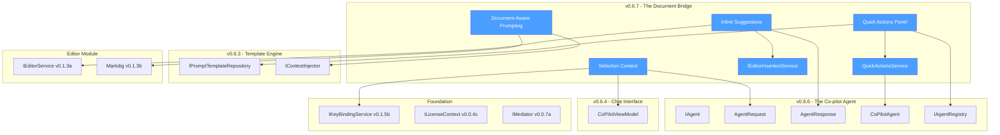
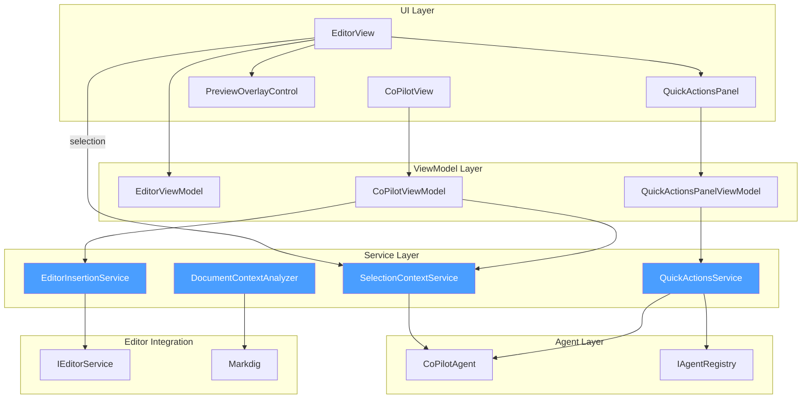
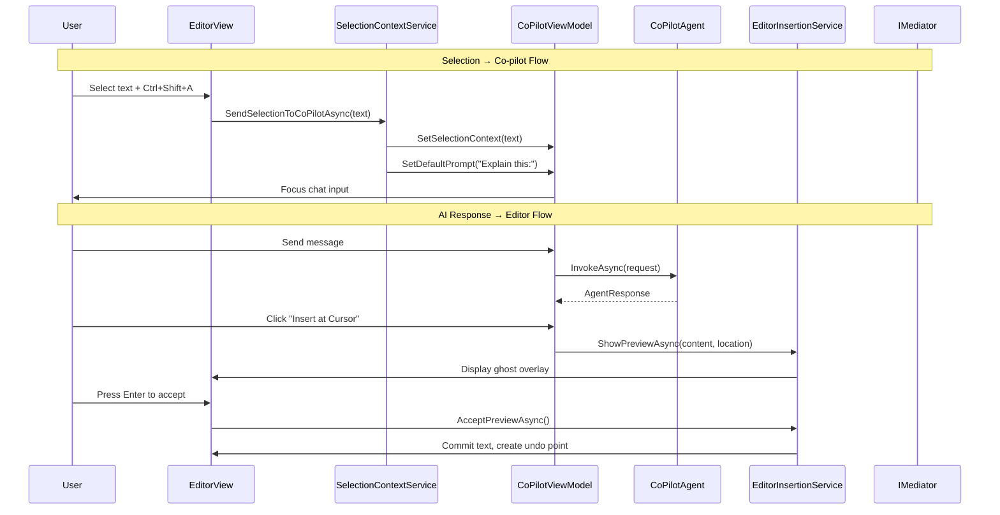
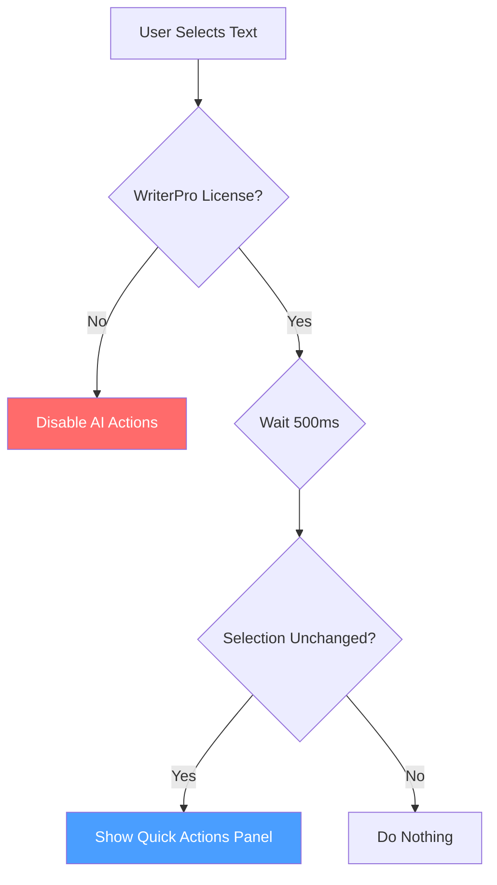
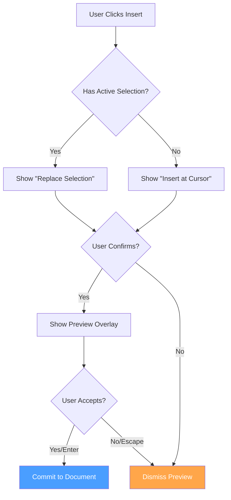

# LCS-SBD-067: Scope Breakdown Document — The Document Bridge

## Document Control

| Field            | Value                                                                      |
| :--------------- | :------------------------------------------------------------------------- |
| **Document ID**  | LCS-SBD-067                                                                |
| **Version**      | v0.6.7                                                                     |
| **Codename**     | The Document Bridge (Editor Integration)                                   |
| **Status**       | Draft                                                                      |
| **Module**       | Lexichord.Modules.Agents                                                   |
| **Created**      | 2026-01-28                                                                 |
| **Author**       | Documentation Agent                                                        |
| **Reviewers**    | TBD                                                                        |
| **Related Docs** | [LCS-DES-067-INDEX](LCS-DES-067-INDEX.md), [Roadmap](../roadmap-v0.6.x.md) |

---

## 1. Executive Summary

### 1.1 Vision

Seamlessly integrate the Co-pilot Agent with the active document in the editor, transforming Lexichord from a standalone chat interface into a deeply contextual writing assistant. The Document Bridge establishes bidirectional communication between the editor and the AI agent—text flows from the editor to the Co-pilot for analysis, and AI-generated suggestions flow back into the document with preview and acceptance workflows.

### 1.2 Business Value

| Benefit                          | Impact                                                                             |
| :------------------------------- | :--------------------------------------------------------------------------------- |
| **Contextual AI Assistance**     | Eliminates manual copy-paste; selection automatically provides context to Co-pilot |
| **Inline Editing Workflow**      | AI suggestions can be inserted or previewed directly in the document               |
| **Smart Context Awareness**      | Document structure (headings, code blocks) informs prompt selection                |
| **Accelerated Writing Velocity** | Quick actions panel provides one-click access to common AI operations              |
| **Reduced Friction**             | Keyboard shortcuts and context menus integrate AI into natural writing flow        |
| **Premium Differentiation**      | Quick actions and inline suggestions enhance WriterPro value proposition           |

### 1.3 Success Criteria

| Criterion                       | Target                                          |
| :------------------------------ | :---------------------------------------------- |
| Selection-to-chat latency       | < 200ms from selection to context injection     |
| Inline insertion accuracy       | 100% correct cursor positioning for insertions  |
| Preview overlay responsiveness  | < 100ms render time for ghost text preview      |
| Quick action panel display time | < 500ms from selection to panel visible         |
| Undo reliability                | Single Ctrl+Z reverts complete AI insertion     |
| Markdown AST parsing            | < 50ms for typical document structure detection |

### 1.4 License Gating

| Feature                  | WriterPro | Teams |
| :----------------------- | :-------: | :---: |
| Selection Context        |     ✓     |   ✓   |
| Inline Suggestions       |     ✓     |   ✓   |
| Document-Aware Prompting |     ✓     |   ✓   |
| Quick Actions Panel      |     ✓     |   ✓   |
| Custom Quick Actions     |     ✗     |   ✓   |
| Quick Action Analytics   |     ✗     |   ✓   |

**Access Control**: All Document Bridge features require `LicenseTier.WriterPro` or higher. Quick action customization and analytics require `LicenseTier.Teams`.

---

## 2. Dependencies on Prior Versions

### 2.1 Required Components

| Component                   | Version | Purpose                           |
| :-------------------------- | :------ | :-------------------------------- |
| `IAgent`                    | v0.6.6a | Agent invocation contract         |
| `AgentRequest`              | v0.6.6a | Request parameters with selection |
| `AgentResponse`             | v0.6.6a | Response with content to insert   |
| `CoPilotAgent`              | v0.6.6b | Primary agent implementation      |
| `IAgentRegistry`            | v0.6.6c | Agent discovery for quick actions |
| `CoPilotViewModel`          | v0.6.4a | Chat orchestration                |
| `IPromptTemplateRepository` | v0.6.3c | Quick action templates            |
| `IContextInjector`          | v0.6.3d | Context assembly with selection   |
| `IEditorService`            | v0.1.3a | Editor text manipulation          |
| `IKeyBindingService`        | v0.1.5b | Keyboard shortcut registration    |
| `Markdig`                   | v0.1.3b | Markdown AST parsing              |
| `IMediator`                 | v0.0.7a | Event publishing                  |
| `ILicenseContext`           | v0.0.4c | License tier verification         |
| `ILogger<T>`                | v0.0.3b | Structured logging                |

### 2.2 Dependency Graph



---

## 3. Sub-Part Specifications

### 3.1 v0.6.7a: Selection Context

**Goal**: Enable sending selected text to Co-pilot with context menu and keyboard shortcut access.

**Scope**:

- Context menu integration: "Ask Co-pilot about selection"
- Keyboard shortcut: `Ctrl+Shift+A` (configurable via `IKeyBindingService`)
- Selection passed as `AgentRequest.Selection`
- Pre-fill user input based on selection characteristics
- Integration with `CoPilotViewModel` to populate input field

**Key Deliverables**:

- `SelectionContextCommand.cs` - RelayCommand for selection-to-chat
- `EditorContextMenuExtensions.cs` - Context menu registration
- Keyboard binding configuration in `keybindings.json`
- Unit tests for selection handling

**Key Interfaces**:

```csharp
public interface ISelectionContextService
{
    Task SendSelectionToCoPilotAsync(string selection, CancellationToken ct = default);
    string GenerateDefaultPrompt(string selection);
    bool HasActiveSelection { get; }
}
```

**Estimated Effort**: 8 hours

---

### 3.2 v0.6.7b: Inline Suggestions

**Goal**: Display agent responses inline in the editor with preview and acceptance workflow.

**Scope**:

- `IEditorInsertionService` interface for editor text manipulation
- "Insert at Cursor" button in chat response
- "Replace Selection" when response relates to selected text
- Preview mode: Ghost text overlay before accepting
- Undo support: Single `Ctrl+Z` reverts inserted AI text
- Transaction-based editing for atomic undo

**Key Deliverables**:

- `IEditorInsertionService.cs` - Editor insertion abstraction
- `EditorInsertionService.cs` - Implementation with preview support
- `PreviewOverlayControl.axaml` - Ghost text visualization
- `InsertAtCursorCommand.cs` - Chat response insertion
- `ReplaceSelectionCommand.cs` - Selection replacement
- Unit tests for insertion and undo behavior

**Key Interfaces**:

```csharp
public interface IEditorInsertionService
{
    Task InsertAtCursorAsync(string text, CancellationToken ct = default);
    Task ReplaceSelectionAsync(string text, CancellationToken ct = default);
    Task ShowPreviewAsync(string text, TextSpan location, CancellationToken ct = default);
    Task<bool> AcceptPreviewAsync(CancellationToken ct = default);
    Task RejectPreviewAsync(CancellationToken ct = default);
    bool IsPreviewActive { get; }
}

public record TextSpan(int Start, int Length);
```

**Estimated Effort**: 16 hours

---

### 3.3 v0.6.7c: Document-Aware Prompting

**Goal**: Enhance context based on cursor position and document structure.

**Scope**:

- Section heading detection using Markdown AST
- Local context extraction (500 chars before/after cursor)
- Content type detection (code block, table, list, prose)
- Specialized prompt suggestion based on context
- Auto-suggest relevant agent based on content type

**Key Deliverables**:

- `IDocumentContextAnalyzer.cs` - Document structure analysis
- `DocumentContextAnalyzer.cs` - Markdig-based implementation
- `EditorContext` record for cursor position metadata
- `ContextAwarePromptSelector.cs` - Smart prompt selection
- Unit tests for structure detection

**Key Interfaces**:

```csharp
public interface IDocumentContextAnalyzer
{
    Task<DocumentContext> AnalyzeAtPositionAsync(string documentPath, int cursorPosition, CancellationToken ct = default);
    ContentBlockType DetectContentType(int position);
    string? GetCurrentSectionHeading(int position);
    string GetLocalContext(int position, int charsBefore = 500, int charsAfter = 500);
}

public record DocumentContext(
    string? CurrentSection,
    ContentBlockType ContentType,
    string LocalContext,
    int CursorPosition,
    string? SuggestedAgentId
);

public enum ContentBlockType
{
    Prose,
    CodeBlock,
    Table,
    List,
    Heading,
    Blockquote
}
```

**Estimated Effort**: 12 hours

---

### 3.4 v0.6.7d: Quick Actions Panel

**Goal**: Add floating toolbar near cursor with one-click AI actions.

**Scope**:

- Floating panel appears on text selection
- Configurable delay (default: 500ms)
- Pre-defined actions: "Improve", "Simplify", "Expand", "Fix Grammar"
- Each action maps to a prompt template
- Dismiss on click outside or Escape key
- Custom actions for Teams tier

**Key Deliverables**:

- `QuickActionsPanel.axaml` - Floating toolbar UI
- `QuickActionsPanelViewModel.cs` - Panel state and commands
- `IQuickActionsService.cs` - Action discovery and execution
- `QuickActionsService.cs` - Implementation
- `QuickAction` record for action definition
- `QuickActionExecutedEvent` for telemetry
- Built-in prompt templates for default actions
- Unit tests for action execution

**Key Interfaces**:

```csharp
public interface IQuickActionsService
{
    IReadOnlyList<QuickAction> GetActionsForContext(EditorContext context);
    Task<AgentResponse> ExecuteActionAsync(QuickAction action, string selectedText, CancellationToken ct = default);
    void RegisterCustomAction(QuickAction action);
}

public record QuickAction(
    string Id,
    string Label,
    string Icon,
    string PromptTemplateId,
    LicenseTier RequiredTier = LicenseTier.WriterPro
);

public record QuickActionExecutedEvent(
    string ActionId,
    string AgentId,
    int SelectionLength,
    TimeSpan Duration
) : INotification;
```

**Quick Actions Panel UI**:

```text
┌───────────────────────────────────────┐
│ [✨ Improve] [📝 Simplify] [📖 Expand] [🔧 Fix] │
└───────────────────────────────────────┘
         ▲ Appears above selection
```

**Estimated Effort**: 14 hours

---

## 4. Implementation Checklist

| Phase | Task                                        | Est. Hours | Status |
| :---: | :------------------------------------------ | :--------: | :----: |
|   1   | Define `ISelectionContextService` interface |    0.5     |   ☐    |
|   1   | Implement `SelectionContextService`         |     2      |   ☐    |
|   1   | Create `SelectionContextCommand`            |     1      |   ☐    |
|   1   | Add context menu "Ask Co-pilot" entry       |     1      |   ☐    |
|   1   | Configure keyboard shortcut `Ctrl+Shift+A`  |    0.5     |   ☐    |
|   1   | Implement default prompt generation         |     1      |   ☐    |
|   1   | Unit tests for selection context            |     2      |   ☐    |
|   2   | Define `IEditorInsertionService` interface  |    0.5     |   ☐    |
|   2   | Implement `EditorInsertionService`          |     4      |   ☐    |
|   2   | Create `PreviewOverlayControl`              |     3      |   ☐    |
|   2   | Implement preview accept/reject workflow    |     2      |   ☐    |
|   2   | Add "Insert at Cursor" button to chat       |     1      |   ☐    |
|   2   | Add "Replace Selection" button              |     1      |   ☐    |
|   2   | Implement transaction-based undo            |     2      |   ☐    |
|   2   | Unit tests for inline suggestions           |    2.5     |   ☐    |
|   3   | Define `IDocumentContextAnalyzer` interface |    0.5     |   ☑    |
|   3   | Implement Markdig AST parsing               |     3      |   ☑    |
|   3   | Implement local context extraction          |     2      |   ☑    |
|   3   | Implement content type detection            |     2      |   ☑    |
|   3   | Implement context-aware prompt selector     |     2      |   ☑    |
|   3   | Unit tests for document analysis            |    2.5     |   ☑    |
|   4   | Define `IQuickActionsService` interface     |    0.5     |   ☐    |
|   4   | Implement `QuickActionsService`             |     3      |   ☐    |
|   4   | Create `QuickActionsPanel.axaml`            |     3      |   ☐    |
|   4   | Create `QuickActionsPanelViewModel`         |     2      |   ☐    |
|   4   | Create built-in prompt templates            |     2      |   ☐    |
|   4   | Implement selection-triggered display       |     2      |   ☐    |
|   4   | Add dismiss behavior                        |     1      |   ☐    |
|   4   | Unit tests for quick actions                |    2.5     |   ☐    |
|       | **Total**                                   |   **50**   |        |

---

## 5. Dependency Matrix

### 5.1 New Interfaces

| Interface                  | Module                   | Purpose                              |
| :------------------------- | :----------------------- | :----------------------------------- |
| `ISelectionContextService` | Lexichord.Modules.Agents | Selection-to-chat coordination       |
| `IEditorInsertionService`  | Lexichord.Abstractions   | Editor text insertion abstraction    |
| `IDocumentContextAnalyzer` | Lexichord.Modules.Agents | Document structure analysis          |
| `IQuickActionsService`     | Lexichord.Modules.Agents | Quick action discovery and execution |

### 5.2 New Records/Classes

| Type                       | Module                   | Purpose                             |
| :------------------------- | :----------------------- | :---------------------------------- |
| `TextSpan`                 | Lexichord.Abstractions   | Text range specification            |
| `DocumentContext`          | Lexichord.Modules.Agents | Cursor position metadata            |
| `ContentBlockType`         | Lexichord.Modules.Agents | Document content classification     |
| `QuickAction`              | Lexichord.Modules.Agents | Quick action definition             |
| `QuickActionExecutedEvent` | Lexichord.Modules.Agents | Telemetry event for actions         |
| `SelectionContextCommand`  | Lexichord.Modules.Agents | RelayCommand for selection handling |
| `PreviewOverlayControl`    | Lexichord.Modules.Agents | Ghost text preview UI               |
| `QuickActionsPanel`        | Lexichord.Modules.Agents | Floating action toolbar             |

### 5.3 Modified Components

| Component               | Modification                                       |
| :---------------------- | :------------------------------------------------- |
| `CoPilotViewModel`      | Add selection context handling, insertion commands |
| `CoPilotView.axaml`     | Add Insert/Replace buttons to responses            |
| `ChatMessageView.axaml` | Add action buttons for AI responses                |
| `EditorView.axaml`      | Register context menu items, overlay support       |
| `main-menu.json`        | Add Edit > Ask Co-pilot menu item                  |
| `keybindings.json`      | Add Ctrl+Shift+A binding                           |

---

## 6. Architecture Diagram



---

## 7. Data Flow Diagram



---

## 8. Risks & Mitigations

| Risk                           | Probability | Impact | Mitigation                                                  |
| :----------------------------- | :---------: | :----: | :---------------------------------------------------------- |
| Cursor position desync         |   Medium    |  High  | Validate cursor position before insertion, use transactions |
| Ghost overlay rendering issues |   Medium    | Medium | Fallback to modal preview if overlay fails                  |
| Markdown parsing performance   |     Low     | Medium | Cache AST, incremental parsing for large documents          |
| Quick action panel positioning |   Medium    |  Low   | Viewport-aware positioning, screen edge detection           |
| Undo stack corruption          |     Low     |  High  | Transaction-based edits, comprehensive undo testing         |
| Keyboard shortcut conflicts    |   Medium    |  Low   | Configurable shortcuts, conflict detection on startup       |
| Large selection performance    |     Low     | Medium | Truncate selection for preview, full content for AI         |

---

## 9. Success Metrics

| Metric                   | Measurement Method                    | Target  |
| :----------------------- | :------------------------------------ | :------ |
| Selection-to-chat time   | Stopwatch from shortcut to chat focus | < 200ms |
| Preview render time      | Time to display ghost overlay         | < 100ms |
| Quick action panel delay | Time from selection to panel visible  | < 500ms |
| Insertion accuracy       | Correct cursor position rate          | 100%    |
| Undo reliability         | Successful single-Ctrl+Z reversions   | 100%    |
| AST parsing time         | Document structure detection latency  | < 50ms  |
| Quick action usage rate  | Actions per session                   | > 2.0   |

---

## 10. What This Enables

### 10.1 Immediate Benefits

- **Seamless Editor Integration**: AI assistance accessible without leaving the editor
- **Preview Before Commit**: Ghost text overlay allows review before accepting
- **Context-Aware Suggestions**: Prompts adapt to document structure
- **Rapid Iteration**: Quick actions provide one-click access to common operations

### 10.2 Future Capabilities

| Future Feature                    | How v0.6.7 Enables It                                  |
| :-------------------------------- | :----------------------------------------------------- |
| v0.6.8: Reliability & Performance | Editor integration provides testable surface area      |
| v0.7.x: Multi-file Context        | DocumentContextAnalyzer extends to workspace scope     |
| v0.8.x: Review Workflows          | Inline suggestions provide approval/rejection patterns |
| v0.9.x: Collaborative Editing     | Preview overlay supports concurrent editing            |

---

## 11. Decision Trees

### 11.1 Selection Action Decision



### 11.2 Inline Insertion Decision



---

## 12. User Stories

### US-067-01: Selection to Co-pilot

> **As a** WriterPro user  
> **I want** to send my selected text directly to Co-pilot  
> **So that** I can get AI assistance without copy-pasting

**Acceptance Criteria**:

- Right-click context menu shows "Ask Co-pilot about selection"
- Ctrl+Shift+A shortcut opens Co-pilot with selection context
- Selection appears as context indicator in chat panel
- Input field pre-populates with contextual prompt

---

### US-067-02: Inline Insertion

> **As a** WriterPro user  
> **I want** to insert AI responses directly into my document  
> **So that** I can incorporate suggestions without manual copying

**Acceptance Criteria**:

- Each AI response has "Insert at Cursor" button
- When selection exists, "Replace Selection" button appears
- Preview overlay shows proposed text before committing
- Single Ctrl+Z undoes the entire AI insertion

---

### US-067-03: Smart Context Detection

> **As a** WriterPro user  
> **I want** the Co-pilot to understand my document structure  
> **So that** suggestions are appropriate for my current context

**Acceptance Criteria**:

- Co-pilot detects when I'm in a code block vs. prose
- Section headings provide context for suggestions
- Local context (surrounding paragraphs) informs responses
- Suggested prompt adapts to content type

---

### US-067-04: Quick Actions

> **As a** WriterPro user  
> **I want** quick access to common AI operations  
> **So that** I can improve my writing with minimal effort

**Acceptance Criteria**:

- Floating panel appears after selecting text
- Panel shows Improve, Simplify, Expand, Fix Grammar buttons
- Clicking action immediately invokes Co-pilot
- Panel dismisses on Escape or click outside

---

## 13. Use Cases

### UC-067-01: Selection Context Flow

**Actors**: WriterPro User, Co-pilot Agent  
**Preconditions**: Document open, text selected, WriterPro license  
**Trigger**: User presses Ctrl+Shift+A or right-clicks and selects "Ask Co-pilot"

**Main Flow**:

1. SelectionContextService captures selected text
2. Service generates contextual default prompt
3. Service notifies CoPilotViewModel of selection
4. ViewModel populates AgentRequest.Selection
5. ViewModel pre-fills input with default prompt
6. Chat panel scrolls to input and focuses it
7. User modifies or accepts default prompt
8. User sends message
9. Co-pilot responds with context-aware answer

**Alternative Flow A** (No Selection):

- At step 1: No text selected
- Service shows notification: "Please select text first"
- Flow ends

---

### UC-067-02: Preview and Accept Insertion

**Actors**: WriterPro User  
**Preconditions**: AI response in chat, document open  
**Trigger**: User clicks "Insert at Cursor" button

**Main Flow**:

1. EditorInsertionService retrieves current cursor position
2. Service creates transaction for undo support
3. Service shows ghost overlay at cursor position
4. User reviews proposed text
5. User presses Enter to accept
6. Service commits text to document
7. Service creates single undo point
8. Ghost overlay is dismissed
9. Cursor moves to end of inserted text

**Alternative Flow A** (User Rejects):

- At step 5: User presses Escape
- Service discards preview
- No changes made to document

**Alternative Flow B** (Replace Selection):

- At step 1: Active selection detected
- Ghost overlay shows replacement over selection
- On accept, selection is replaced
- Undo restores original selection

---

## 14. Unit Testing Requirements

### 14.1 Test Categories

| Category           | Description                       | Count  |
| :----------------- | :-------------------------------- | :----: |
| Selection Context  | Selection handling and prompt gen |   10   |
| Inline Suggestions | Insertion, preview, undo          |   15   |
| Document Analysis  | AST parsing, context detection    |   12   |
| Quick Actions      | Panel display, action execution   |   10   |
| Integration        | End-to-end editor workflows       |   5    |
| **Total**          |                                   | **52** |

### 14.2 Critical Test Cases

````csharp
[Fact]
[Trait("Category", "Selection")]
[Trait("SubPart", "v0.6.7a")]
public async Task SelectionContextService_SendSelection_PopulatesCoPilotContext()
{
    // Arrange
    var viewModel = Substitute.For<CoPilotViewModel>();
    var service = new SelectionContextService(viewModel);
    var selection = "The quick brown fox jumps over the lazy dog.";

    // Act
    await service.SendSelectionToCoPilotAsync(selection, CancellationToken.None);

    // Assert
    viewModel.Received(1).SetSelectionContext(selection);
    viewModel.Received(1).SetDefaultPrompt(Arg.Any<string>());
}

[Fact]
[Trait("Category", "Insertion")]
[Trait("SubPart", "v0.6.7b")]
public async Task EditorInsertionService_InsertAtCursor_CreatesUndoPoint()
{
    // Arrange
    var editorService = Substitute.For<IEditorService>();
    var insertionService = new EditorInsertionService(editorService);
    var text = "Inserted AI text";

    // Act
    await insertionService.InsertAtCursorAsync(text, CancellationToken.None);

    // Assert
    editorService.Received(1).BeginUndoGroup();
    editorService.Received(1).InsertTextAtCursor(text);
    editorService.Received(1).EndUndoGroup();
}

[Theory]
[InlineData("```csharp\nvar x = 1;\n```", ContentBlockType.CodeBlock)]
[InlineData("| Col1 | Col2 |\n|---|---|\n", ContentBlockType.Table)]
[InlineData("- Item 1\n- Item 2", ContentBlockType.List)]
[InlineData("Regular paragraph text.", ContentBlockType.Prose)]
[Trait("Category", "DocumentAnalysis")]
[Trait("SubPart", "v0.6.7c")]
public void DocumentContextAnalyzer_DetectsContentType(string markdown, ContentBlockType expected)
{
    // Arrange
    var analyzer = new DocumentContextAnalyzer();

    // Act
    var result = analyzer.DetectContentType(markdown, 5);

    // Assert
    result.Should().Be(expected);
}

[Fact]
[Trait("Category", "QuickActions")]
[Trait("SubPart", "v0.6.7d")]
public async Task QuickActionsService_ExecuteAction_InvokesCoPilotWithTemplate()
{
    // Arrange
    var agent = Substitute.For<IAgent>();
    agent.InvokeAsync(Arg.Any<AgentRequest>(), Arg.Any<CancellationToken>())
        .Returns(new AgentResponse("Improved text", null, UsageMetrics.Zero));

    var registry = Substitute.For<IAgentRegistry>();
    registry.GetDefaultAgent().Returns(agent);

    var service = new QuickActionsService(registry, templates);
    var action = new QuickAction("improve", "Improve", "✨", "quick-action-improve");

    // Act
    var result = await service.ExecuteActionAsync(action, "Selected text", CancellationToken.None);

    // Assert
    await agent.Received(1).InvokeAsync(
        Arg.Is<AgentRequest>(r => r.Selection == "Selected text"),
        Arg.Any<CancellationToken>());
}
````

---

## 15. Observability & Logging

### 15.1 Log Events

| Event                     | Level       | Template                                                       |
| :------------------------ | :---------- | :------------------------------------------------------------- |
| Selection context set     | Debug       | `Selection context set: {CharCount} chars from {DocumentPath}` |
| Default prompt generated  | Debug       | `Generated default prompt: {PromptType} for {ContentType}`     |
| Insertion preview shown   | Debug       | `Preview shown at position {Position}: {CharCount} chars`      |
| Insertion accepted        | Information | `Text inserted: {CharCount} chars at position {Position}`      |
| Insertion rejected        | Debug       | `Preview rejected by user`                                     |
| Document analysis started | Debug       | `Analyzing document at position {Position}`                    |
| Content type detected     | Debug       | `Content type: {ContentType}, section: {SectionHeading}`       |
| Quick action panel shown  | Debug       | `Quick actions panel shown for selection: {CharCount} chars`   |
| Quick action executed     | Information | `Quick action {ActionId} executed on {CharCount} chars`        |
| Quick action panel hidden | Debug       | `Quick actions panel dismissed: {Reason}`                      |

### 15.2 Metrics

| Metric                       | Type      | Description                             |
| :--------------------------- | :-------- | :-------------------------------------- |
| `selection_context_total`    | Counter   | Total selection-to-chat invocations     |
| `selection_context_duration` | Histogram | Time to process selection context       |
| `insertion_preview_total`    | Counter   | Total preview overlays shown            |
| `insertion_accepted_total`   | Counter   | Total accepted insertions               |
| `insertion_rejected_total`   | Counter   | Total rejected previews                 |
| `document_analysis_duration` | Histogram | Time to analyze document structure      |
| `quick_action_total`         | Counter   | Total quick action executions by action |
| `quick_action_duration`      | Histogram | Quick action execution time             |

---

## 16. UI/UX Specifications

### 16.1 Quick Actions Panel Layout

```text
                    ┌───────────────────────────────────────────┐
                    │ [✨ Improve] [📝 Simplify] [📖 Expand] [🔧 Fix] │
                    └───────────────────────────────────────────┘
                                        ▼
╔══════════════════════════════════════════════════════════════════════╗
║  The quick brown ║fox jumps over the lazy dog║. This is some text.   ║
╚══════════════════════════════════════════════════════════════════════╝
                    ^^^^^^^^^^^^^^^^^^^^^^^^^^^^^^^^
                           Selected Text
```

### 16.2 Preview Overlay Layout

```text
╔══════════════════════════════════════════════════════════════════════╗
║  The quick brown fox ░░░░░░░░░░░░░░░░░░░░░░░░░░░░░░░░░░░░░░░░░░░░░░  ║
║                      ░ The swift russet fox leaps gracefully   ░     ║
║                      ░ over the weary canine.                   ░     ║
║                      ░░░░░░░░░░░░░░░░ [Enter ✓] [Esc ✗] ░░░░░░░░     ║
║  . This is the rest of the paragraph continuing below.               ║
╚══════════════════════════════════════════════════════════════════════╝
           Ghost overlay showing proposed replacement
```

### 16.3 Chat Response with Actions

```text
┌────────────────────────────────────────────────────────────────────┐
│ 🤖 Here's an improved version of your paragraph:                   │
│                                                                    │
│    The swift russet fox leaps gracefully over the weary canine.   │
│    This revision maintains the original meaning while...           │
│                                                                    │
│                         [Insert at Cursor] [Replace Selection]▼    │
│                                                        10:45 AM    │
└────────────────────────────────────────────────────────────────────┘
```

### 16.4 Component Styling

| Component             | Theme Resource           | Notes                             |
| :-------------------- | :----------------------- | :-------------------------------- |
| Quick Actions Panel   | `Brush.Surface.Floating` | Semi-transparent, elevated shadow |
| Action Button         | `LexButtonGhost`         | Icon + text, hover highlight      |
| Preview Overlay       | `Brush.Surface.Preview`  | 50% opacity background            |
| Preview Border        | `Brush.Accent.Primary`   | Dashed border indicating preview  |
| Accept/Reject Buttons | `LexButtonPrimary/Ghost` | Positioned at bottom of overlay   |

---

## 17. Acceptance Criteria (QA)

| #   | Category          | Criterion                                                 |
| :-- | :---------------- | :-------------------------------------------------------- |
| 1   | **Selection**     | Ctrl+Shift+A opens Co-pilot with selected text as context |
| 2   | **Selection**     | Right-click menu shows "Ask Co-pilot about selection"     |
| 3   | **Selection**     | Default prompt adapts to selection length                 |
| 4   | **Insertion**     | "Insert at Cursor" places text at current cursor position |
| 5   | **Insertion**     | "Replace Selection" replaces active selection             |
| 6   | **Insertion**     | Preview overlay shows proposed text before commit         |
| 7   | **Insertion**     | Enter accepts preview, Escape rejects                     |
| 8   | **Insertion**     | Single Ctrl+Z undoes entire AI insertion                  |
| 9   | **Document**      | Analyzer detects code blocks vs prose correctly           |
| 10  | **Document**      | Section heading is identified from cursor position        |
| 11  | **Document**      | Local context includes 500 chars before and after         |
| 12  | **Quick Actions** | Panel appears after 500ms of stable selection             |
| 13  | **Quick Actions** | Clicking action invokes Co-pilot with template            |
| 14  | **Quick Actions** | Panel dismisses on Escape or click outside                |
| 15  | **License**       | All features gated to WriterPro+ tiers                    |
| 16  | **Performance**   | Selection-to-chat completes in < 200ms                    |

---

## 18. Verification Commands

```bash
# ═══════════════════════════════════════════════════════════════════════════
# v0.6.7 Verification
# ═══════════════════════════════════════════════════════════════════════════

# 1. Build solution
dotnet build

# 2. Run unit tests for v0.6.7 components
dotnet test --filter "Category=Unit&FullyQualifiedName~v0.6.7"

# 3. Run selection context tests
dotnet test --filter "Category=Selection"

# 4. Run insertion tests
dotnet test --filter "Category=Insertion"

# 5. Run document analysis tests
dotnet test --filter "Category=DocumentAnalysis"

# 6. Run quick action tests
dotnet test --filter "Category=QuickActions"

# 7. Manual verification:
# a) Open a document, select text, press Ctrl+Shift+A
#    - Verify Co-pilot opens with selection context
# b) Send a message, click "Insert at Cursor"
#    - Verify preview overlay appears
#    - Press Enter to accept, verify text is inserted
#    - Press Ctrl+Z, verify insertion is undone
# c) Select text, wait 500ms
#    - Verify quick actions panel appears
#    - Click "Improve", verify Co-pilot is invoked
```

---

## 19. Deliverable Checklist

| #   | Deliverable                                         | Status |
| :-- | :-------------------------------------------------- | :----- |
| 1   | `ISelectionContextService.cs` interface             | [ ]    |
| 2   | `SelectionContextService.cs` implementation         | [ ]    |
| 3   | `SelectionContextCommand.cs` RelayCommand           | [ ]    |
| 4   | Context menu "Ask Co-pilot" entry                   | [ ]    |
| 5   | Keyboard shortcut Ctrl+Shift+A configuration        | [ ]    |
| 6   | `IEditorInsertionService.cs` interface              | [ ]    |
| 7   | `EditorInsertionService.cs` implementation          | [ ]    |
| 8   | `PreviewOverlayControl.axaml` preview UI            | [ ]    |
| 9   | Insert/Replace buttons in chat responses            | [ ]    |
| 10  | Transaction-based undo support                      | [ ]    |
| 11  | `IDocumentContextAnalyzer.cs` interface             | [x]   |
| 12  | `DocumentContextAnalyzer.cs` Markdig implementation | [x]   |
| 13  | `ContentBlockType` enum                             | [x]   |
| 14  | `DocumentContext` record                            | [x]   |
| 15  | `IQuickActionsService.cs` interface                 | [ ]    |
| 16  | `QuickActionsService.cs` implementation             | [ ]    |
| 17  | `QuickActionsPanel.axaml` floating toolbar          | [ ]    |
| 18  | `QuickActionsPanelViewModel.cs` state management    | [ ]    |
| 19  | Built-in quick action prompt templates              | [ ]    |
| 20  | `QuickActionExecutedEvent` telemetry                | [ ]    |
| 21  | Unit tests (52 tests)                               | [ ]    |
| 22  | DI registration in AgentsModule.cs                  | [ ]    |

---

## 20. Code Examples

### 20.1 IEditorInsertionService Interface

```csharp
namespace Lexichord.Abstractions.Editor;

/// <summary>
/// Service for inserting AI-generated text into the editor.
/// </summary>
/// <remarks>
/// <para>
/// This service provides a clean abstraction for editor text manipulation,
/// supporting both immediate insertion and preview-before-commit workflows.
/// </para>
/// <para>
/// All modifications are wrapped in undo groups, ensuring that a single
/// Ctrl+Z reverts the entire AI insertion regardless of complexity.
/// </para>
/// </remarks>
public interface IEditorInsertionService
{
    /// <summary>
    /// Inserts text at the current cursor position.
    /// </summary>
    /// <param name="text">The text to insert.</param>
    /// <param name="ct">Cancellation token.</param>
    Task InsertAtCursorAsync(string text, CancellationToken ct = default);

    /// <summary>
    /// Replaces the current selection with the specified text.
    /// </summary>
    /// <param name="text">The replacement text.</param>
    /// <param name="ct">Cancellation token.</param>
    Task ReplaceSelectionAsync(string text, CancellationToken ct = default);

    /// <summary>
    /// Shows a preview overlay at the specified location.
    /// </summary>
    /// <param name="text">The text to preview.</param>
    /// <param name="location">The text span for the preview.</param>
    /// <param name="ct">Cancellation token.</param>
    Task ShowPreviewAsync(string text, TextSpan location, CancellationToken ct = default);

    /// <summary>
    /// Accepts the current preview and commits to the document.
    /// </summary>
    /// <param name="ct">Cancellation token.</param>
    /// <returns>True if preview was accepted.</returns>
    Task<bool> AcceptPreviewAsync(CancellationToken ct = default);

    /// <summary>
    /// Rejects the current preview and dismisses the overlay.
    /// </summary>
    /// <param name="ct">Cancellation token.</param>
    Task RejectPreviewAsync(CancellationToken ct = default);

    /// <summary>
    /// Indicates whether a preview is currently active.
    /// </summary>
    bool IsPreviewActive { get; }
}

/// <summary>
/// Represents a span of text in the document.
/// </summary>
public record TextSpan(int Start, int Length)
{
    /// <summary>
    /// Gets the end position of the span.
    /// </summary>
    public int End => Start + Length;

    /// <summary>
    /// Creates a span from start and end positions.
    /// </summary>
    public static TextSpan FromStartEnd(int start, int end) => new(start, end - start);
}
```

### 20.2 QuickAction Record

```csharp
namespace Lexichord.Modules.Agents.QuickActions;

/// <summary>
/// Represents a quick action available in the floating toolbar.
/// </summary>
/// <param name="Id">Unique identifier for the action.</param>
/// <param name="Label">Display label for the button.</param>
/// <param name="Icon">Emoji or icon character.</param>
/// <param name="PromptTemplateId">ID of the prompt template to use.</param>
/// <param name="RequiredTier">Minimum license tier required.</param>
public record QuickAction(
    string Id,
    string Label,
    string Icon,
    string PromptTemplateId,
    LicenseTier RequiredTier = LicenseTier.WriterPro
)
{
    /// <summary>
    /// Gets the display text combining icon and label.
    /// </summary>
    public string DisplayText => $"{Icon} {Label}";

    /// <summary>
    /// Built-in "Improve" action.
    /// </summary>
    public static QuickAction Improve { get; } = new(
        "improve", "Improve", "✨", "quick-action-improve");

    /// <summary>
    /// Built-in "Simplify" action.
    /// </summary>
    public static QuickAction Simplify { get; } = new(
        "simplify", "Simplify", "📝", "quick-action-simplify");

    /// <summary>
    /// Built-in "Expand" action.
    /// </summary>
    public static QuickAction Expand { get; } = new(
        "expand", "Expand", "📖", "quick-action-expand");

    /// <summary>
    /// Built-in "Fix Grammar" action.
    /// </summary>
    public static QuickAction FixGrammar { get; } = new(
        "fix-grammar", "Fix", "🔧", "quick-action-fix-grammar");
}
```

---

## 21. Deferred Features

| Feature                       | Deferred To | Reason                                      |
| :---------------------------- | :---------- | :------------------------------------------ |
| Multi-cursor insertion        | v0.7.x      | Requires advanced editor integration        |
| Voice-activated quick actions | v0.9.x      | Depends on voice command infrastructure     |
| Custom quick action creation  | v0.6.8      | Teams tier feature, needs configuration UI  |
| Insertion history/favorites   | v0.7.x      | Requires persistence infrastructure         |
| Collaborative preview sharing | v0.9.x      | Depends on real-time collaboration features |

---

## 22. Changelog Entry

Upon completion of v0.6.7, the following entry will be added to `CHANGELOG.md`:

```markdown
## [0.6.7] - 2026-01-XX

### Added

- **Selection Context**: Send selected text to Co-pilot via Ctrl+Shift+A or context menu
- **Inline Suggestions**: Insert AI responses directly into document with preview workflow
- **Document-Aware Prompting**: Context detection for code blocks, tables, lists, and prose
- **Quick Actions Panel**: Floating toolbar with one-click Improve, Simplify, Expand, Fix actions
- **Preview Overlay**: Ghost text visualization before accepting AI insertions
- **Transaction-Based Undo**: Single Ctrl+Z reverts complete AI insertions

### Changed

- `CoPilotViewModel` now supports selection context and insertion commands
- `ChatMessageView` includes Insert/Replace action buttons

### Technical

- `IEditorInsertionService` abstraction for editor text manipulation
- `IDocumentContextAnalyzer` for Markdig-based document structure analysis
- `IQuickActionsService` for action discovery and execution
- `QuickActionExecutedEvent` for telemetry and analytics
```

---
