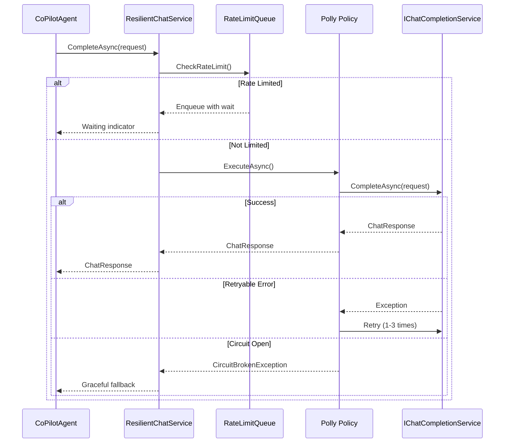
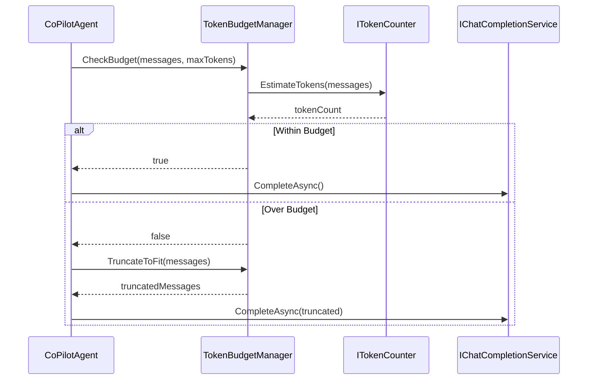
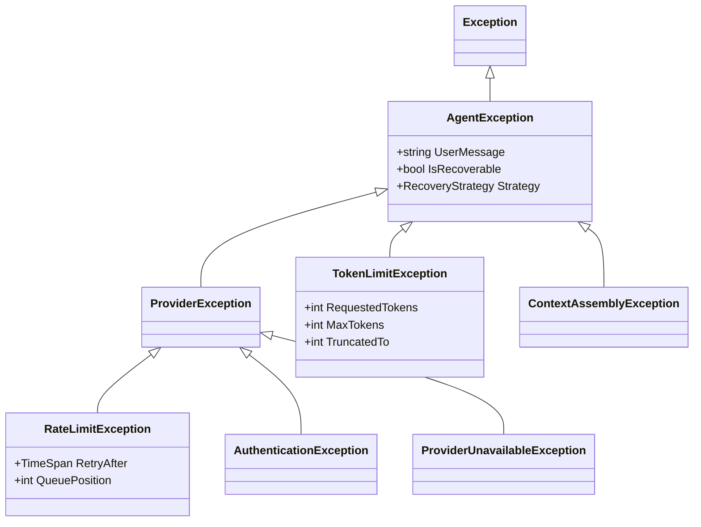

# LCS-DES-068-INDEX: Design Specification Index — The Hardening

## Document Control

| Field            | Value                                                          |
| :--------------- | :------------------------------------------------------------- |
| **Document ID**  | LCS-DES-068-INDEX                                              |
| **Version**      | v0.6.8                                                         |
| **Codename**     | The Hardening (Reliability & Performance)                      |
| **Status**       | Draft                                                          |
| **Module**       | Lexichord.Modules.Agents                                       |
| **Created**      | 2026-01-28                                                     |
| **Author**       | Documentation Agent                                            |
| **Related Docs** | [LCS-SBD-068](LCS-SBD-068.md), [Roadmap](../roadmap-v0.6.x.md) |

---

## 1. Overview

The Hardening phase ensures the Agents module is production-ready through comprehensive testing, error handling, and performance optimization. This index coordinates four sub-specifications:

- **Unit Test Suite**: Comprehensive tests for all Agents module components
- **Integration Tests**: End-to-end agent workflows with realistic scenarios
- **Performance Optimization**: Baselines, caching, and memory management
- **Error Handling & Recovery**: Resilient error management with user feedback

---

## 2. Sub-Part Index

| ID   | Name                      | Focus                       | Document                        |
| :--- | :------------------------ | :-------------------------- | :------------------------------ |
| 068a | Unit Test Suite           | Component-level testing     | [LCS-DES-068a](LCS-DES-068a.md) |
| 068b | Integration Tests         | End-to-end workflow testing | [LCS-DES-068b](LCS-DES-068b.md) |
| 068c | Performance Optimization  | Baselines and optimization  | [LCS-DES-068c](LCS-DES-068c.md) |
| 068d | Error Handling & Recovery | Resilient error management  | [LCS-DES-068d](LCS-DES-068d.md) |

---

## 3. Dependency Graph

```mermaid
graph TB
    subgraph "v0.6.8 - The Hardening"
        DES068a[068a: Unit Test Suite]
        DES068b[068b: Integration Tests]
        DES068c[068c: Performance Optimization]
        DES068d[068d: Error Handling]
    end

    subgraph "v0.6.1-v0.6.7 Components Under Test"
        CCS[IChatCompletionService v0.6.1a]
        OAI[OpenAIConnector v0.6.2a]
        ANT[AnthropicConnector v0.6.2b]
        IPR[IPromptRenderer v0.6.3b]
        ICI[IContextInjector v0.6.3d]
        SCH[IStreamingChatHandler v0.6.5a]
        CPA[CoPilotAgent v0.6.6b]
        IES[IEditorInsertionService v0.6.7b]
    end

    subgraph "Infrastructure"
        POL[Polly v0.0.5d]
        MED[IMediator v0.0.7a]
        LOG[ILogger v0.0.3b]
    end

    DES068a --> CCS
    DES068a --> IPR
    DES068a --> SCH
    DES068b --> CPA
    DES068b --> IES
    DES068c --> ICI
    DES068c --> CPA
    DES068d --> POL
    DES068d --> CCS

    style DES068a fill:#4a9eff,color:#fff
    style DES068b fill:#4a9eff,color:#fff
    style DES068c fill:#22c55e,color:#fff
    style DES068d fill:#22c55e,color:#fff
```



---

## 4. Interface Summary

### 4.1 New Interfaces

| Interface                    | Module                   | Purpose                        |
| :--------------------------- | :----------------------- | :----------------------------- |
| `IMockLLMServer`             | Lexichord.Tests.Agents   | Test fixture for LLM mocking   |
| `IConversationMemoryManager` | Lexichord.Modules.Agents | History cap enforcement        |
| `IRequestCoalescer`          | Lexichord.Modules.Agents | Sequential query optimization  |
| `IErrorRecoveryService`      | Lexichord.Modules.Agents | Recovery strategy coordination |
| `IRateLimitQueue`            | Lexichord.Modules.Agents | Request queuing with wait time |
| `ITokenBudgetManager`        | Lexichord.Modules.Agents | Token limit enforcement        |

### 4.2 Interface Definitions

```csharp
// ═══════════════════════════════════════════════════════════════════
// IMockLLMServer - Test Infrastructure (v0.6.8a)
// ═══════════════════════════════════════════════════════════════════
namespace Lexichord.Tests.Agents.Fixtures;

public interface IMockLLMServer
{
    void ConfigureResponse(ChatResponse response);
    void ConfigureStreamingResponse(IEnumerable<StreamingChatToken> tokens);
    void ConfigureError(HttpStatusCode statusCode, string message);
    void ConfigureRateLimit(TimeSpan retryAfter);
    int RequestCount { get; }
    IReadOnlyList<ChatRequest> ReceivedRequests { get; }
}

// ═══════════════════════════════════════════════════════════════════
// IConversationMemoryManager - Memory Optimization (v0.6.8c)
// ═══════════════════════════════════════════════════════════════════
namespace Lexichord.Modules.Agents.Performance;

public interface IConversationMemoryManager
{
    void TrimToLimit(IList<ChatMessage> messages, int maxMessages);
    int CurrentMessageCount { get; }
    long EstimatedMemoryBytes { get; }
}

// ═══════════════════════════════════════════════════════════════════
// IErrorRecoveryService - Error Recovery (v0.6.8d)
// ═══════════════════════════════════════════════════════════════════
namespace Lexichord.Modules.Agents.Resilience;

public interface IErrorRecoveryService
{
    Task<AgentResponse?> AttemptRecoveryAsync(
        AgentException exception,
        AgentRequest originalRequest,
        CancellationToken ct);
    bool CanRecover(AgentException exception);
    RecoveryStrategy GetStrategy(AgentException exception);
}

// ═══════════════════════════════════════════════════════════════════
// IRateLimitQueue - Rate Limit Handling (v0.6.8d)
// ═══════════════════════════════════════════════════════════════════
namespace Lexichord.Modules.Agents.Resilience;

public interface IRateLimitQueue
{
    Task<ChatResponse> EnqueueAsync(ChatRequest request, CancellationToken ct);
    TimeSpan EstimatedWaitTime { get; }
    int QueueDepth { get; }
    event EventHandler<RateLimitStatusEventArgs> StatusChanged;
}

// ═══════════════════════════════════════════════════════════════════
// ITokenBudgetManager - Token Management (v0.6.8d)
// ═══════════════════════════════════════════════════════════════════
namespace Lexichord.Modules.Agents.Resilience;

public interface ITokenBudgetManager
{
    bool CheckBudget(IEnumerable<ChatMessage> messages, int maxTokens);
    IReadOnlyList<ChatMessage> TruncateToFit(
        IReadOnlyList<ChatMessage> messages,
        int maxTokens);
    int EstimateTokens(IEnumerable<ChatMessage> messages);
}
```

---

## 5. Data Flow Overview

### 5.1 Resilient Request Flow



### 5.2 Token Budget Flow



---

## 6. Test Organization

### 6.1 Test Project Structure

```text
tests/
└── Lexichord.Tests.Agents/
    ├── Unit/
    │   ├── ChatCompletion/
    │   │   ├── OpenAIConnectorTests.cs
    │   │   ├── AnthropicConnectorTests.cs
    │   │   └── TokenCounterTests.cs
    │   ├── Templates/
    │   │   ├── MustacheRendererTests.cs
    │   │   ├── TemplateRepositoryTests.cs
    │   │   └── ContextInjectorTests.cs
    │   ├── Agents/
    │   │   ├── CoPilotAgentTests.cs
    │   │   ├── AgentRegistryTests.cs
    │   │   └── UsageTrackingTests.cs
    │   └── Streaming/
    │       ├── SSEParserTests.cs
    │       └── StreamingHandlerTests.cs
    ├── Integration/
    │   ├── WorkflowTests.cs
    │   ├── StreamingIntegrationTests.cs
    │   ├── ContextInjectionTests.cs
    │   └── ErrorScenarioTests.cs
    ├── Fixtures/
    │   ├── MockLLMServer.cs
    │   ├── TestChatResponses.cs
    │   └── TestPromptTemplates.cs
    └── Benchmarks/
        ├── ContextAssemblyBenchmarks.cs
        ├── TemplateRenderBenchmarks.cs
        └── StreamingBenchmarks.cs
```

### 6.2 Test Distribution

| Sub-Part  | Unit Tests | Integration | Benchmarks |  Total  |
| :-------- | :--------: | :---------: | :--------: | :-----: |
| 068a      |     45     |      -      |     -      |   45    |
| 068b      |     -      |     20      |     -      |   20    |
| 068c      |     10     |      5      |     15     |   30    |
| 068d      |     20     |     10      |     -      |   30    |
| **Total** |   **75**   |   **35**    |   **15**   | **125** |

---

## 7. Performance Baselines

### 7.1 Target Metrics

| Metric                  | Target  | Measurement                    |
| :---------------------- | :------ | :----------------------------- |
| First token latency     | < 500ms | Time from request to first SSE |
| Context assembly        | < 200ms | Style rules + 3 RAG chunks     |
| Template rendering      | < 10ms  | Typical prompt with variables  |
| Message truncation      | < 5ms   | Truncate 100 messages to 50    |
| Memory per conversation | < 5MB   | 50-message conversation        |
| Request coalescing      | 100ms   | Window for combining requests  |

### 7.2 Benchmark Configuration

```csharp
[MemoryDiagnoser]
[SimpleJob(RuntimeMoniker.Net90)]
public class AgentPerformanceBenchmarks
{
    [Benchmark(Baseline = true)]
    public async Task ContextAssembly_StyleRulesAndRAG()
    {
        await _contextInjector.AssembleContextAsync(
            new ContextRequest(DocumentPath, CursorPos, null, true, true, 3),
            CancellationToken.None);
    }

    [Benchmark]
    public string TemplateRendering_TypicalPrompt()
    {
        return _renderer.Render(_typicalTemplate, _typicalVariables);
    }
}
```

---

## 8. Error Handling Strategy

### 8.1 Exception Hierarchy



### 8.2 Recovery Strategies

| Exception Type               | Strategy          | User Feedback                         |
| :--------------------------- | :---------------- | :------------------------------------ |
| RateLimitException           | Queue & Wait      | "Request queued. Estimated wait: 30s" |
| ProviderUnavailableException | Circuit & Retry   | "Service temporarily unavailable"     |
| AuthenticationException      | Prompt & Guide    | "API key invalid. Check Settings."    |
| TokenLimitException          | Truncate & Warn   | "History truncated to fit context"    |
| NetworkException             | Retry & Indicator | "Reconnecting..." with offline badge  |

---

## 9. DI Registration

```csharp
// In AgentsModule.cs - ConfigureServices method

// ═══════════════════════════════════════════════════════════════════
// v0.6.8 - The Hardening Services
// ═══════════════════════════════════════════════════════════════════

// v0.6.8c: Performance Optimization
services.AddSingleton<IConversationMemoryManager, ConversationMemoryManager>();
services.AddSingleton<IRequestCoalescer, RequestCoalescer>();
services.AddSingleton<CachedContextAssembler>();

// v0.6.8d: Error Handling & Recovery
services.AddSingleton<IErrorRecoveryService, ErrorRecoveryService>();
services.AddSingleton<IRateLimitQueue, RateLimitQueue>();
services.AddSingleton<ITokenBudgetManager, TokenBudgetManager>();

// Decorator pattern for resilient chat service
services.Decorate<IChatCompletionService, ResilientChatService>();

// Polly policies
services.AddSingleton<IAsyncPolicy<ChatResponse>>(sp =>
{
    var logger = sp.GetRequiredService<ILogger<ResilientChatService>>();
    return Policy<ChatResponse>
        .Handle<HttpRequestException>()
        .Or<RateLimitException>()
        .WaitAndRetryAsync(
            retryCount: 3,
            sleepDurationProvider: attempt => TimeSpan.FromSeconds(Math.Pow(2, attempt)),
            onRetry: (outcome, delay, attempt, ctx) =>
                logger.LogWarning("Retry {Attempt} after {Delay}ms", attempt, delay.TotalMilliseconds));
});
```

---

## 10. Related Documents

| Document                                            | Relationship                  |
| :-------------------------------------------------- | :---------------------------- |
| [LCS-SBD-068](LCS-SBD-068.md)                       | Parent scope breakdown        |
| [LCS-DES-068a](LCS-DES-068a.md)                     | Unit Test Suite spec          |
| [LCS-DES-068b](LCS-DES-068b.md)                     | Integration Tests spec        |
| [LCS-DES-068c](LCS-DES-068c.md)                     | Performance Optimization spec |
| [LCS-DES-068d](LCS-DES-068d.md)                     | Error Handling spec           |
| [LCS-DES-067-INDEX](../v0.6.7/LCS-DES-067-INDEX.md) | Document Bridge index         |
| [LCS-DES-066-INDEX](../v0.6.6/LCS-DES-066-INDEX.md) | Co-pilot Agent index          |
| [Roadmap](../roadmap-v0.6.x.md)                     | Series roadmap                |

---
