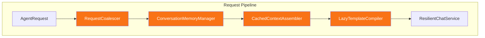

# LCS-DES-068c: Performance Optimization

## 1. Metadata & Categorization

| Field              | Value                    |
| :----------------- | :----------------------- |
| **Document ID**    | LCS-DES-068c             |
| **Feature ID**     | AGT-068c                 |
| **Feature Name**   | Performance Optimization |
| **Target Version** | v0.6.8c                  |
| **Module Scope**   | Lexichord.Modules.Agents |
| **Swimlane**       | Agents                   |
| **License Tier**   | WriterPro+               |
| **Status**         | Draft                    |
| **Last Updated**   | 2026-01-28               |

---

## 2. Executive Summary

### 2.1 The Requirement

The Agents module must meet strict performance targets for production use. Long latencies frustrate users, unbounded memory growth causes crashes, and inefficient context assembly wastes API tokens.

### 2.2 The Proposed Solution

Establish performance baselines using BenchmarkDotNet, implement optimizations (caching, pooling, coalescing), and enforce memory limits through conversation history management.

---

## 3. Architecture & Modular Strategy

### 3.1 Dependencies

**Upstream Modules:**

- `Lexichord.Modules.Agents` (optimization target)
- `Microsoft.ML.Tokenizers` v0.22.x (token counting)

**NuGet Packages:**

- `BenchmarkDotNet` 0.13.x - Performance benchmarking
- `System.IO.Pipelines` 9.0.x - Efficient streaming
- `Microsoft.Extensions.ObjectPool` 9.0.x - Object pooling

### 3.2 Optimization Architecture



---

## 4. Data Contract (The API)

### 4.1 Interfaces

```csharp
namespace Lexichord.Modules.Agents.Performance;

/// <summary>
/// Manages conversation history to prevent unbounded memory growth.
/// </summary>
public interface IConversationMemoryManager
{
    /// <summary>Trims messages to the specified limit, preserving system message.</summary>
    void TrimToLimit(IList<ChatMessage> messages, int maxMessages);

    /// <summary>Gets current count of messages in active conversation.</summary>
    int CurrentMessageCount { get; }

    /// <summary>Estimates current memory usage of conversation history.</summary>
    long EstimatedMemoryBytes { get; }

    /// <summary>Clears oldest messages when memory threshold exceeded.</summary>
    void EnforceMemoryLimit(long maxBytes);
}

/// <summary>
/// Coalesces rapid sequential requests to reduce API calls.
/// </summary>
public interface IRequestCoalescer
{
    /// <summary>Coalesces request with pending requests if within window.</summary>
    Task<ChatResponse> CoalesceAsync(ChatRequest request, CancellationToken ct);

    /// <summary>Gets count of pending coalesced requests.</summary>
    int PendingRequestCount { get; }

    /// <summary>Gets coalescing time window.</summary>
    TimeSpan CoalescingWindow { get; }
}

/// <summary>
/// Caches assembled context to avoid redundant work.
/// </summary>
public interface ICachedContextAssembler
{
    /// <summary>Gets or creates cached context for document.</summary>
    Task<AssembledContext> GetOrCreateAsync(string documentPath, ContextOptions options, CancellationToken ct);

    /// <summary>Invalidates cache for document.</summary>
    void Invalidate(string documentPath);

    /// <summary>Gets cache hit ratio.</summary>
    double CacheHitRatio { get; }
}
```

### 4.2 Configuration Records

```csharp
namespace Lexichord.Modules.Agents.Performance;

/// <summary>Performance tuning options.</summary>
public sealed record PerformanceOptions
{
    /// <summary>Maximum messages before trimming (default: 50).</summary>
    public int MaxConversationMessages { get; init; } = 50;

    /// <summary>Maximum memory per conversation (default: 5MB).</summary>
    public long MaxConversationMemoryBytes { get; init; } = 5 * 1024 * 1024;

    /// <summary>Time window for request coalescing (default: 100ms).</summary>
    public TimeSpan CoalescingWindow { get; init; } = TimeSpan.FromMilliseconds(100);

    /// <summary>Context cache duration (default: 30s).</summary>
    public TimeSpan ContextCacheDuration { get; init; } = TimeSpan.FromSeconds(30);

    /// <summary>Maximum compiled template cache size (default: 100).</summary>
    public int MaxCompiledTemplates { get; init; } = 100;
}

/// <summary>Baseline performance record.</summary>
public sealed record PerformanceBaseline(
    string MetricName,
    double TargetMs,
    double ActualMs,
    double P95Ms,
    DateTimeOffset MeasuredAt);
```

---

## 5. Implementation Logic

### 5.1 Conversation Memory Manager

```csharp
namespace Lexichord.Modules.Agents.Performance;

/// <summary>
/// Manages conversation history to prevent unbounded memory growth.
/// Preserves system messages while trimming oldest user/assistant turns.
/// </summary>
public sealed class ConversationMemoryManager : IConversationMemoryManager
{
    private readonly ILogger<ConversationMemoryManager> _logger;
    private readonly ITokenCounter _tokenCounter;
    private readonly PerformanceOptions _options;
    private int _currentMessageCount;
    private long _estimatedBytes;

    public ConversationMemoryManager(
        ILogger<ConversationMemoryManager> logger,
        ITokenCounter tokenCounter,
        IOptions<PerformanceOptions> options)
    {
        _logger = logger;
        _tokenCounter = tokenCounter;
        _options = options.Value;
    }

    public int CurrentMessageCount => _currentMessageCount;
    public long EstimatedMemoryBytes => _estimatedBytes;

    public void TrimToLimit(IList<ChatMessage> messages, int maxMessages)
    {
        if (messages.Count <= maxMessages)
        {
            _currentMessageCount = messages.Count;
            return;
        }

        var systemMessages = messages.Where(m => m.Role == ChatRole.System).ToList();
        var otherMessages = messages.Where(m => m.Role != ChatRole.System).ToList();

        var allowedOther = maxMessages - systemMessages.Count;
        var toRemove = otherMessages.Count - allowedOther;

        if (toRemove > 0)
        {
            _logger.LogInformation("Trimming {Count} oldest messages to enforce limit of {Max}",
                toRemove, maxMessages);

            // Remove oldest non-system messages
            for (int i = 0; i < toRemove; i++)
            {
                messages.Remove(otherMessages[i]);
            }
        }

        _currentMessageCount = messages.Count;
        _estimatedBytes = EstimateBytes(messages);
    }

    public void EnforceMemoryLimit(long maxBytes)
    {
        if (_estimatedBytes <= maxBytes) return;

        _logger.LogWarning("Memory limit exceeded: {Current}MB > {Max}MB. Aggressive trim required.",
            _estimatedBytes / (1024 * 1024), maxBytes / (1024 * 1024));
    }

    private long EstimateBytes(IEnumerable<ChatMessage> messages)
    {
        // Approximate: 2 bytes per character (UTF-16) + object overhead
        return messages.Sum(m => (m.Content?.Length ?? 0) * 2 + 100);
    }
}
```

### 5.2 Request Coalescer

```csharp
namespace Lexichord.Modules.Agents.Performance;

/// <summary>
/// Coalesces rapid sequential requests into batches to reduce API pressure.
/// Uses a sliding window approach to group related requests.
/// </summary>
public sealed class RequestCoalescer : IRequestCoalescer
{
    private readonly IChatCompletionService _inner;
    private readonly ILogger<RequestCoalescer> _logger;
    private readonly PerformanceOptions _options;
    private readonly Channel<CoalescedRequest> _channel;
    private readonly SemaphoreSlim _batchLock = new(1, 1);
    private List<CoalescedRequest> _pendingBatch = new();
    private DateTimeOffset _batchStartTime;

    public RequestCoalescer(
        IChatCompletionService inner,
        ILogger<RequestCoalescer> logger,
        IOptions<PerformanceOptions> options)
    {
        _inner = inner;
        _logger = logger;
        _options = options.Value;
        _channel = Channel.CreateUnbounded<CoalescedRequest>();

        _ = ProcessBatchesAsync();
    }

    public TimeSpan CoalescingWindow => _options.CoalescingWindow;
    public int PendingRequestCount => _pendingBatch.Count;

    public async Task<ChatResponse> CoalesceAsync(ChatRequest request, CancellationToken ct)
    {
        var tcs = new TaskCompletionSource<ChatResponse>();
        var coalesced = new CoalescedRequest(request, tcs, ct);

        await _batchLock.WaitAsync(ct);
        try
        {
            if (_pendingBatch.Count == 0)
            {
                _batchStartTime = DateTimeOffset.UtcNow;
            }

            _pendingBatch.Add(coalesced);
            _logger.LogDebug("Request added to batch. Pending: {Count}", _pendingBatch.Count);
        }
        finally
        {
            _batchLock.Release();
        }

        return await tcs.Task;
    }

    private async Task ProcessBatchesAsync()
    {
        while (true)
        {
            await Task.Delay(_options.CoalescingWindow);

            List<CoalescedRequest>? batch = null;

            await _batchLock.WaitAsync();
            try
            {
                if (_pendingBatch.Count > 0 &&
                    DateTimeOffset.UtcNow - _batchStartTime >= _options.CoalescingWindow)
                {
                    batch = _pendingBatch;
                    _pendingBatch = new List<CoalescedRequest>();
                }
            }
            finally
            {
                _batchLock.Release();
            }

            if (batch != null)
            {
                await ProcessBatchAsync(batch);
            }
        }
    }

    private async Task ProcessBatchAsync(List<CoalescedRequest> batch)
    {
        _logger.LogInformation("Processing coalesced batch of {Count} requests", batch.Count);

        // For now, process sequentially but could batch if API supports
        foreach (var request in batch)
        {
            try
            {
                var response = await _inner.CompleteAsync(request.Request, request.CancellationToken);
                request.TaskCompletionSource.SetResult(response);
            }
            catch (Exception ex)
            {
                request.TaskCompletionSource.SetException(ex);
            }
        }
    }

    private sealed record CoalescedRequest(
        ChatRequest Request,
        TaskCompletionSource<ChatResponse> TaskCompletionSource,
        CancellationToken CancellationToken);
}
```

### 5.3 Cached Context Assembler

```csharp
namespace Lexichord.Modules.Agents.Performance;

/// <summary>
/// Caches assembled context to avoid redundant RAG searches and style rule lookups.
/// Uses memory cache with configurable expiration.
/// </summary>
public sealed class CachedContextAssembler : ICachedContextAssembler
{
    private readonly IContextInjector _inner;
    private readonly ILogger<CachedContextAssembler> _logger;
    private readonly MemoryCache _cache;
    private readonly PerformanceOptions _options;
    private int _hits;
    private int _misses;

    public CachedContextAssembler(
        IContextInjector inner,
        ILogger<CachedContextAssembler> logger,
        IOptions<PerformanceOptions> options)
    {
        _inner = inner;
        _logger = logger;
        _options = options.Value;
        _cache = new MemoryCache(new MemoryCacheOptions { SizeLimit = 100 });
    }

    public double CacheHitRatio => _hits + _misses == 0 ? 0 : (double)_hits / (_hits + _misses);

    public async Task<AssembledContext> GetOrCreateAsync(
        string documentPath,
        ContextOptions options,
        CancellationToken ct)
    {
        var key = GenerateCacheKey(documentPath, options);

        if (_cache.TryGetValue(key, out AssembledContext? cached))
        {
            Interlocked.Increment(ref _hits);
            _logger.LogDebug("Context cache hit for {Path}", documentPath);
            return cached!;
        }

        Interlocked.Increment(ref _misses);
        _logger.LogDebug("Context cache miss for {Path}, assembling...", documentPath);

        var context = await _inner.AssembleContextAsync(
            new ContextRequest(documentPath, 0, null, options.IncludeStyleRules, options.IncludeRAG, options.MaxRAGChunks),
            ct);

        var entry = _cache.CreateEntry(key);
        entry.Value = context;
        entry.Size = 1;
        entry.AbsoluteExpirationRelativeToNow = _options.ContextCacheDuration;
        entry.Dispose();

        return context;
    }

    public void Invalidate(string documentPath)
    {
        // Invalidate all cache entries for this document
        _logger.LogDebug("Invalidating cache for {Path}", documentPath);
        // In practice, would track keys per document
    }

    private static string GenerateCacheKey(string documentPath, ContextOptions options)
        => $"{documentPath}:{options.IncludeStyleRules}:{options.IncludeRAG}:{options.MaxRAGChunks}";
}
```

---

## 6. Performance Benchmarks

### 6.1 Benchmark Suite

```csharp
namespace Lexichord.Benchmarks.Agents;

[MemoryDiagnoser]
[SimpleJob(RuntimeMoniker.Net90)]
[RPlotExporter]
public class AgentPerformanceBenchmarks
{
    private IContextInjector _contextInjector = null!;
    private IPromptRenderer _renderer = null!;
    private IConversationMemoryManager _memoryManager = null!;
    private IPromptTemplate _typicalTemplate = null!;
    private Dictionary<string, object> _typicalVariables = null!;
    private List<ChatMessage> _largeConversation = null!;

    [GlobalSetup]
    public void Setup()
    {
        var services = new ServiceCollection();
        services.AddAgentsModule();
        var sp = services.BuildServiceProvider();

        _contextInjector = sp.GetRequiredService<IContextInjector>();
        _renderer = sp.GetRequiredService<IPromptRenderer>();
        _memoryManager = sp.GetRequiredService<IConversationMemoryManager>();

        _typicalTemplate = CreateTypicalTemplate();
        _typicalVariables = CreateTypicalVariables();
        _largeConversation = CreateLargeConversation(100);
    }

    [Benchmark(Baseline = true, Description = "Context Assembly (Style + 3 RAG)")]
    public async Task<AssembledContext> ContextAssembly_StyleRulesAndRAG()
    {
        return await _contextInjector.AssembleContextAsync(
            new ContextRequest("test.md", 0, null, true, true, 3),
            CancellationToken.None);
    }

    [Benchmark(Description = "Template Rendering (Typical)")]
    public string TemplateRendering_TypicalPrompt()
    {
        return _renderer.Render(_typicalTemplate.UserPromptTemplate, _typicalVariables);
    }

    [Benchmark(Description = "Memory Trim (100 → 50 messages)")]
    public void MemoryTrim_HalfConversation()
    {
        var copy = _largeConversation.ToList();
        _memoryManager.TrimToLimit(copy, 50);
    }

    [Benchmark(Description = "Token Counting (50 messages)")]
    public int TokenCounting_MediumConversation()
    {
        var messages = _largeConversation.Take(50).ToList();
        return messages.Sum(m => _tokenCounter.CountTokens(m.Content ?? ""));
    }

    private static IPromptTemplate CreateTypicalTemplate() => new PromptTemplate(
        "You are a helpful writing assistant. {{#style_rules}}Follow these rules: {{rules}}{{/style_rules}}",
        "{{user_input}}{{#context}} Context: {{context}}{{/context}}");

    private static Dictionary<string, object> CreateTypicalVariables() => new()
    {
        ["user_input"] = "Help me improve this paragraph about climate change.",
        ["style_rules"] = true,
        ["rules"] = "Use active voice. Avoid jargon. Keep sentences under 25 words.",
        ["context"] = "The document discusses environmental policy in the 21st century."
    };

    private static List<ChatMessage> CreateLargeConversation(int messageCount)
    {
        var messages = new List<ChatMessage>
        {
            new(ChatRole.System, "You are a helpful assistant.")
        };

        for (int i = 0; i < messageCount; i++)
        {
            messages.Add(new ChatMessage(
                i % 2 == 0 ? ChatRole.User : ChatRole.Assistant,
                $"Message {i}: This is a sample message of moderate length to simulate realistic conversation content."));
        }

        return messages;
    }
}
```

### 6.2 Performance Targets

| Metric                    | Target  | P95 Target | Measurement Method            |
| :------------------------ | :------ | :--------- | :---------------------------- |
| First token latency       | < 500ms | < 750ms    | Streaming test with stopwatch |
| Context assembly          | < 200ms | < 300ms    | BenchmarkDotNet               |
| Template rendering        | < 10ms  | < 25ms     | BenchmarkDotNet               |
| Message trimming (100→50) | < 5ms   | < 10ms     | BenchmarkDotNet               |
| Token counting (50 msgs)  | < 20ms  | < 40ms     | BenchmarkDotNet               |
| Memory per 50-msg conv    | < 5MB   | < 8MB      | MemoryDiagnoser               |
| Cache hit ratio (steady)  | > 70%   | -          | In-app telemetry              |

---

## 7. Observability & Logging

| Level   | Source                 | Message Template                                  |
| :------ | :--------------------- | :------------------------------------------------ |
| Debug   | ConversationMemoryMgr  | `Current memory: {Bytes} bytes, {Count} messages` |
| Info    | ConversationMemoryMgr  | `Trimmed {Removed} messages to limit {Max}`       |
| Debug   | RequestCoalescer       | `Request added to batch. Pending: {Count}`        |
| Info    | RequestCoalescer       | `Processing coalesced batch of {Count} requests`  |
| Debug   | CachedContextAssembler | `Context cache {HitOrMiss} for {Path}`            |
| Info    | CachedContextAssembler | `Cache hit ratio: {Ratio:P1}`                     |
| Warning | ConversationMemoryMgr  | `Memory limit exceeded: {Current}MB > {Max}MB`    |

---

## 8. Acceptance Criteria (QA)

| #   | Category       | Criterion                                         |
| :-- | :------------- | :------------------------------------------------ |
| 1   | **Latency**    | First token latency < 500ms in 95% of requests    |
| 2   | **Context**    | Context assembly < 200ms for style + 3 RAG chunks |
| 3   | **Templates**  | Template rendering < 10ms for typical prompts     |
| 4   | **Memory**     | Conversation memory capped at configured limit    |
| 5   | **Coalescing** | Rapid requests coalesced within configured window |
| 6   | **Caching**    | Context cache hit ratio > 70% in steady state     |
| 7   | **Benchmarks** | All benchmarks documented with baselines          |

---

## 9. DI Registration

```csharp
// In AgentsModule.cs

// v0.6.8c: Performance Optimization
services.Configure<PerformanceOptions>(configuration.GetSection("Agents:Performance"));
services.AddSingleton<IConversationMemoryManager, ConversationMemoryManager>();
services.AddSingleton<IRequestCoalescer, RequestCoalescer>();
services.AddSingleton<ICachedContextAssembler>(sp =>
{
    var inner = sp.GetRequiredService<IContextInjector>();
    var logger = sp.GetRequiredService<ILogger<CachedContextAssembler>>();
    var options = sp.GetRequiredService<IOptions<PerformanceOptions>>();
    return new CachedContextAssembler(inner, logger, options);
});

// Object pooling for string builders
services.AddSingleton<ObjectPool<StringBuilder>>(sp =>
    new DefaultObjectPoolProvider().CreateStringBuilderPool());
```

---

## 10. Deliverable Checklist

| #   | Deliverable                                   | Status |
| :-- | :-------------------------------------------- | :----- |
| 1   | `ConversationMemoryManager` implementation    | [ ]    |
| 2   | `RequestCoalescer` implementation             | [ ]    |
| 3   | `CachedContextAssembler` implementation       | [ ]    |
| 4   | `AgentPerformanceBenchmarks` suite            | [ ]    |
| 5   | Performance baseline documentation            | [ ]    |
| 6   | Configuration schema for `PerformanceOptions` | [ ]    |
| 7   | Memory profiling verification                 | [ ]    |

---
