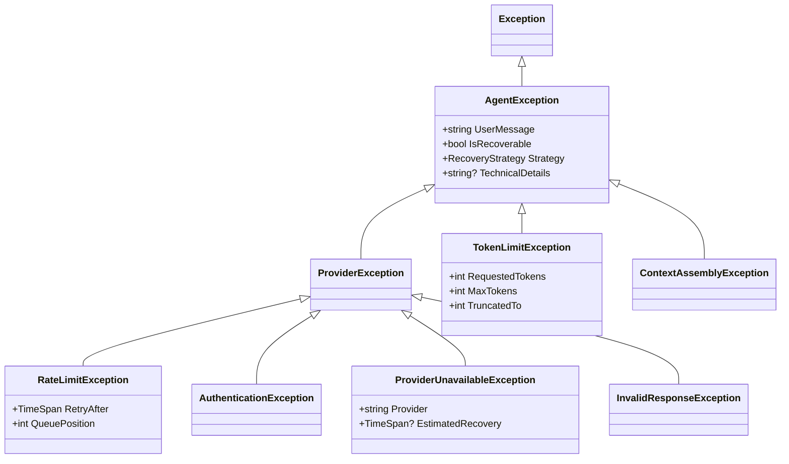
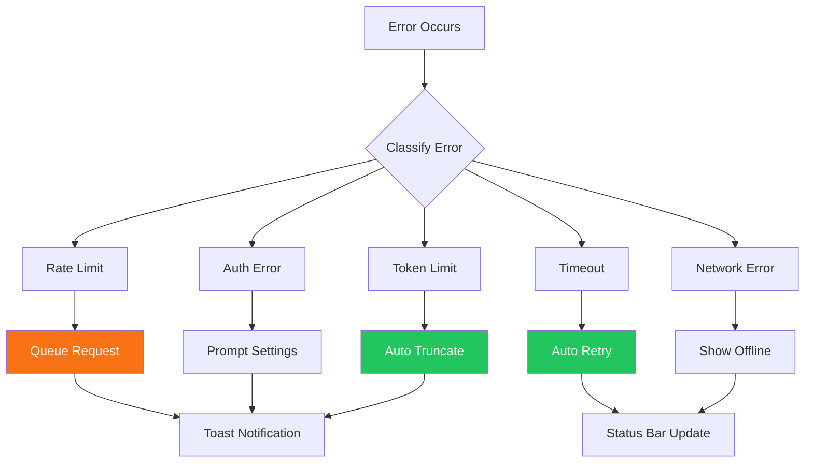

# LCS-DES-068d: Error Handling & Recovery

## 1. Metadata & Categorization

| Field              | Value                     |
| :----------------- | :------------------------ |
| **Document ID**    | LCS-DES-068d              |
| **Feature ID**     | AGT-068d                  |
| **Feature Name**   | Error Handling & Recovery |
| **Target Version** | v0.6.8d                   |
| **Module Scope**   | Lexichord.Modules.Agents  |
| **Swimlane**       | Agents                    |
| **License Tier**   | WriterPro+                |
| **Status**         | Draft                     |
| **Last Updated**   | 2026-01-28                |

---

## 2. Executive Summary

### 2.1 The Requirement

LLM API interactions are inherently unreliable: rate limits, network failures, timeouts, and invalid responses occur regularly. Without robust error handling, users experience cryptic errors and lost work.

### 2.2 The Proposed Solution

Implement a resilient error management layer using Polly policies, structured exception hierarchy, and user-friendly recovery strategies. Errors are classified, logged, and presented with actionable guidance.

---

## 3. Architecture & Modular Strategy

### 3.1 Dependencies

**Upstream Modules:**

- `Lexichord.Modules.Agents` (wrap with resilience)
- `Polly` v8.x (retry/circuit breaker policies)
- `IMediator` v0.0.7a (error events)

### 3.2 Exception Hierarchy



---

## 4. Data Contract (The API)

### 4.1 Interfaces

```csharp
namespace Lexichord.Modules.Agents.Resilience;

/// <summary>
/// Coordinates error recovery strategies.
/// </summary>
public interface IErrorRecoveryService
{
    /// <summary>Attempts automatic recovery from exception.</summary>
    Task<AgentResponse?> AttemptRecoveryAsync(
        AgentException exception,
        AgentRequest originalRequest,
        CancellationToken ct);

    /// <summary>Checks if exception is recoverable.</summary>
    bool CanRecover(AgentException exception);

    /// <summary>Gets recommended recovery strategy.</summary>
    RecoveryStrategy GetStrategy(AgentException exception);

    /// <summary>Gets user-friendly error message.</summary>
    string GetUserMessage(AgentException exception);
}

/// <summary>
/// Queues requests during rate limiting.
/// </summary>
public interface IRateLimitQueue
{
    /// <summary>Enqueues request, waiting for rate limit window.</summary>
    Task<ChatResponse> EnqueueAsync(ChatRequest request, CancellationToken ct);

    /// <summary>Estimated wait time for next request.</summary>
    TimeSpan EstimatedWaitTime { get; }

    /// <summary>Current queue depth.</summary>
    int QueueDepth { get; }

    /// <summary>Raised when rate limit status changes.</summary>
    event EventHandler<RateLimitStatusEventArgs> StatusChanged;
}

/// <summary>
/// Manages token budgets and truncation.
/// </summary>
public interface ITokenBudgetManager
{
    /// <summary>Checks if messages fit within token budget.</summary>
    bool CheckBudget(IEnumerable<ChatMessage> messages, int maxTokens);

    /// <summary>Truncates messages to fit budget.</summary>
    IReadOnlyList<ChatMessage> TruncateToFit(IReadOnlyList<ChatMessage> messages, int maxTokens);

    /// <summary>Estimates total tokens for messages.</summary>
    int EstimateTokens(IEnumerable<ChatMessage> messages);
}
```

### 4.2 Exception Classes

```csharp
namespace Lexichord.Modules.Agents.Resilience;

/// <summary>
/// Base exception for all agent-related errors.
/// </summary>
public class AgentException : Exception
{
    public AgentException(string userMessage, Exception? inner = null)
        : base(userMessage, inner)
    {
        UserMessage = userMessage;
    }

    /// <summary>User-friendly error message for display.</summary>
    public string UserMessage { get; }

    /// <summary>Whether automatic recovery is possible.</summary>
    public virtual bool IsRecoverable => true;

    /// <summary>Recommended recovery strategy.</summary>
    public virtual RecoveryStrategy Strategy => RecoveryStrategy.Retry;

    /// <summary>Technical details for logging.</summary>
    public string? TechnicalDetails { get; init; }
}

/// <summary>
/// Thrown when API rate limit is exceeded.
/// </summary>
public sealed class RateLimitException : ProviderException
{
    public RateLimitException(string provider, TimeSpan retryAfter, int queuePosition = 0)
        : base(provider, $"Rate limit exceeded. Please wait {retryAfter.TotalSeconds:F0} seconds.")
    {
        RetryAfter = retryAfter;
        QueuePosition = queuePosition;
    }

    public TimeSpan RetryAfter { get; }
    public int QueuePosition { get; }
    public override RecoveryStrategy Strategy => RecoveryStrategy.Queue;
}

/// <summary>
/// Thrown when token limit is exceeded.
/// </summary>
public sealed class TokenLimitException : AgentException
{
    public TokenLimitException(int requested, int max, int truncatedTo)
        : base($"Message too long ({requested:N0} tokens). Truncated to {truncatedTo:N0} tokens.")
    {
        RequestedTokens = requested;
        MaxTokens = max;
        TruncatedTo = truncatedTo;
    }

    public int RequestedTokens { get; }
    public int MaxTokens { get; }
    public int TruncatedTo { get; }
    public override RecoveryStrategy Strategy => RecoveryStrategy.Truncate;
}

/// <summary>
/// Recovery strategy enumeration.
/// </summary>
public enum RecoveryStrategy
{
    /// <summary>Retry the request after a delay.</summary>
    Retry,
    /// <summary>Queue the request for later processing.</summary>
    Queue,
    /// <summary>Truncate content and retry.</summary>
    Truncate,
    /// <summary>Switch to fallback provider.</summary>
    Fallback,
    /// <summary>No recovery possible, show error.</summary>
    None
}
```

### 4.3 Event Records

```csharp
namespace Lexichord.Modules.Agents.Resilience;

/// <summary>
/// Published when rate limit status changes.
/// </summary>
public sealed record RateLimitStatusEventArgs(
    bool IsRateLimited,
    TimeSpan EstimatedWait,
    int QueueDepth);

/// <summary>
/// MediatR event for agent errors.
/// </summary>
public sealed record AgentErrorEvent(
    string ErrorType,
    string UserMessage,
    string? TechnicalDetails,
    bool WasRecovered,
    DateTimeOffset Timestamp) : INotification;
```

---

## 5. Implementation Logic

### 5.1 Resilient Chat Service

```csharp
namespace Lexichord.Modules.Agents.Resilience;

/// <summary>
/// Decorator that wraps IChatCompletionService with Polly resilience policies.
/// Provides retry, circuit breaker, and timeout functionality.
/// </summary>
public sealed class ResilientChatService : IChatCompletionService
{
    private readonly IChatCompletionService _inner;
    private readonly ResiliencePipeline<ChatResponse> _pipeline;
    private readonly IErrorRecoveryService _recovery;
    private readonly IRateLimitQueue _rateLimitQueue;
    private readonly ILogger<ResilientChatService> _logger;
    private readonly IMediator _mediator;

    public ResilientChatService(
        IChatCompletionService inner,
        IErrorRecoveryService recovery,
        IRateLimitQueue rateLimitQueue,
        ILogger<ResilientChatService> logger,
        IMediator mediator)
    {
        _inner = inner;
        _recovery = recovery;
        _rateLimitQueue = rateLimitQueue;
        _logger = logger;
        _mediator = mediator;

        _pipeline = new ResiliencePipelineBuilder<ChatResponse>()
            .AddRetry(new RetryStrategyOptions<ChatResponse>
            {
                MaxRetryAttempts = 3,
                Delay = TimeSpan.FromSeconds(1),
                BackoffType = DelayBackoffType.Exponential,
                UseJitter = true,
                ShouldHandle = new PredicateBuilder<ChatResponse>()
                    .Handle<HttpRequestException>()
                    .Handle<ProviderUnavailableException>(),
                OnRetry = args =>
                {
                    _logger.LogWarning("Retry {Attempt} after {Delay}ms due to {Exception}",
                        args.AttemptNumber, args.RetryDelay.TotalMilliseconds, args.Outcome.Exception?.Message);
                    return ValueTask.CompletedTask;
                }
            })
            .AddCircuitBreaker(new CircuitBreakerStrategyOptions<ChatResponse>
            {
                FailureRatio = 0.5,
                MinimumThroughput = 5,
                SamplingDuration = TimeSpan.FromSeconds(30),
                BreakDuration = TimeSpan.FromSeconds(15),
                OnOpened = args =>
                {
                    _logger.LogError("Circuit breaker opened. Provider unavailable.");
                    return ValueTask.CompletedTask;
                },
                OnClosed = args =>
                {
                    _logger.LogInformation("Circuit breaker closed. Provider recovered.");
                    return ValueTask.CompletedTask;
                }
            })
            .AddTimeout(TimeSpan.FromSeconds(30))
            .Build();
    }

    public async Task<ChatResponse> CompleteAsync(ChatRequest request, CancellationToken ct)
    {
        try
        {
            return await _pipeline.ExecuteAsync(async token =>
                await _inner.CompleteAsync(request, token), ct);
        }
        catch (RateLimitException rl)
        {
            _logger.LogWarning("Rate limited. Queueing request. ETA: {Wait}s", rl.RetryAfter.TotalSeconds);
            return await _rateLimitQueue.EnqueueAsync(request, ct);
        }
        catch (BrokenCircuitException)
        {
            var error = new ProviderUnavailableException("LLM Provider",
                EstimatedRecovery: TimeSpan.FromSeconds(15));
            await PublishErrorAsync(error, wasRecovered: false);
            throw new AgentException("The AI service is temporarily unavailable. Please try again in a few seconds.", error);
        }
        catch (TimeoutRejectedException)
        {
            var error = new AgentException("Request timed out. Please try again.");
            await PublishErrorAsync(error, wasRecovered: false);
            throw;
        }
        catch (Exception ex) when (ex is not AgentException)
        {
            _logger.LogError(ex, "Unexpected error during chat completion");
            throw new AgentException("An unexpected error occurred. Please try again.", ex);
        }
    }

    private async Task PublishErrorAsync(AgentException error, bool wasRecovered)
    {
        await _mediator.Publish(new AgentErrorEvent(
            error.GetType().Name,
            error.UserMessage,
            error.TechnicalDetails,
            wasRecovered,
            DateTimeOffset.UtcNow));
    }
}
```

### 5.2 Error Recovery Service

```csharp
namespace Lexichord.Modules.Agents.Resilience;

/// <summary>
/// Coordinates recovery strategies for different error types.
/// </summary>
public sealed class ErrorRecoveryService : IErrorRecoveryService
{
    private readonly ITokenBudgetManager _tokenBudget;
    private readonly ILogger<ErrorRecoveryService> _logger;

    private static readonly Dictionary<Type, RecoveryStrategy> StrategyMap = new()
    {
        [typeof(RateLimitException)] = RecoveryStrategy.Queue,
        [typeof(TokenLimitException)] = RecoveryStrategy.Truncate,
        [typeof(ProviderUnavailableException)] = RecoveryStrategy.Retry,
        [typeof(AuthenticationException)] = RecoveryStrategy.None,
        [typeof(InvalidResponseException)] = RecoveryStrategy.Retry
    };

    private static readonly Dictionary<Type, string> UserMessageMap = new()
    {
        [typeof(RateLimitException)] = "Request queued. Estimated wait: {0}",
        [typeof(TokenLimitException)] = "Message truncated to fit context limit.",
        [typeof(ProviderUnavailableException)] = "AI service temporarily unavailable. Retrying...",
        [typeof(AuthenticationException)] = "Invalid API key. Please check Settings → AI Providers.",
        [typeof(InvalidResponseException)] = "Received invalid response. Retrying..."
    };

    public ErrorRecoveryService(
        ITokenBudgetManager tokenBudget,
        ILogger<ErrorRecoveryService> logger)
    {
        _tokenBudget = tokenBudget;
        _logger = logger;
    }

    public bool CanRecover(AgentException exception)
        => exception.IsRecoverable && exception.Strategy != RecoveryStrategy.None;

    public RecoveryStrategy GetStrategy(AgentException exception)
        => StrategyMap.GetValueOrDefault(exception.GetType(), RecoveryStrategy.None);

    public string GetUserMessage(AgentException exception)
    {
        var template = UserMessageMap.GetValueOrDefault(exception.GetType(), exception.UserMessage);

        return exception switch
        {
            RateLimitException rl => string.Format(template, $"{rl.RetryAfter.TotalSeconds:F0}s"),
            _ => template
        };
    }

    public async Task<AgentResponse?> AttemptRecoveryAsync(
        AgentException exception,
        AgentRequest originalRequest,
        CancellationToken ct)
    {
        var strategy = GetStrategy(exception);

        _logger.LogInformation("Attempting recovery for {ErrorType} using {Strategy}",
            exception.GetType().Name, strategy);

        return strategy switch
        {
            RecoveryStrategy.Truncate => await TruncateAndRetryAsync(exception, originalRequest, ct),
            _ => null // Other strategies handled elsewhere
        };
    }

    private async Task<AgentResponse?> TruncateAndRetryAsync(
        AgentException exception,
        AgentRequest originalRequest,
        CancellationToken ct)
    {
        if (exception is not TokenLimitException tl) return null;

        _logger.LogInformation("Truncating conversation from {From} to {To} tokens",
            tl.RequestedTokens, tl.TruncatedTo);

        // Truncation handled by caller with adjusted request
        return null;
    }
}
```

### 5.3 Token Budget Manager

```csharp
namespace Lexichord.Modules.Agents.Resilience;

/// <summary>
/// Manages token budgets for conversations to prevent context overflow.
/// </summary>
public sealed class TokenBudgetManager : ITokenBudgetManager
{
    private readonly ITokenCounter _tokenCounter;
    private readonly ILogger<TokenBudgetManager> _logger;

    // Reserve tokens for response
    private const int ResponseReserve = 1024;
    // System message buffer
    private const int SystemBuffer = 500;

    public TokenBudgetManager(
        ITokenCounter tokenCounter,
        ILogger<TokenBudgetManager> logger)
    {
        _tokenCounter = tokenCounter;
        _logger = logger;
    }

    public bool CheckBudget(IEnumerable<ChatMessage> messages, int maxTokens)
    {
        var total = EstimateTokens(messages);
        var available = maxTokens - ResponseReserve;

        _logger.LogDebug("Token budget check: {Total} / {Available} ({Max} - {Reserve} reserve)",
            total, available, maxTokens, ResponseReserve);

        return total <= available;
    }

    public int EstimateTokens(IEnumerable<ChatMessage> messages)
    {
        return messages.Sum(m => _tokenCounter.CountTokens(m.Content ?? "") + 4); // +4 for message overhead
    }

    public IReadOnlyList<ChatMessage> TruncateToFit(
        IReadOnlyList<ChatMessage> messages,
        int maxTokens)
    {
        var available = maxTokens - ResponseReserve - SystemBuffer;

        if (CheckBudget(messages, maxTokens))
            return messages;

        var result = new List<ChatMessage>();
        var currentTokens = 0;

        // Always keep system message
        var systemMessages = messages.Where(m => m.Role == ChatRole.System).ToList();
        foreach (var sys in systemMessages)
        {
            result.Add(sys);
            currentTokens += _tokenCounter.CountTokens(sys.Content ?? "") + 4;
        }

        // Add messages from most recent, working backwards
        var otherMessages = messages.Where(m => m.Role != ChatRole.System).Reverse().ToList();

        foreach (var msg in otherMessages)
        {
            var msgTokens = _tokenCounter.CountTokens(msg.Content ?? "") + 4;

            if (currentTokens + msgTokens <= available)
            {
                result.Insert(systemMessages.Count, msg); // Insert after system messages
                currentTokens += msgTokens;
            }
            else
            {
                _logger.LogInformation("Truncating: {Removed} messages removed to fit budget",
                    otherMessages.Count - (result.Count - systemMessages.Count));
                break;
            }
        }

        return result;
    }
}
```

### 5.4 Rate Limit Queue

```csharp
namespace Lexichord.Modules.Agents.Resilience;

/// <summary>
/// Queues requests during rate limiting with wait time estimation.
/// </summary>
public sealed class RateLimitQueue : IRateLimitQueue
{
    private readonly IChatCompletionService _inner;
    private readonly ILogger<RateLimitQueue> _logger;
    private readonly Channel<QueuedRequest> _queue;
    private readonly SemaphoreSlim _rateLock = new(1, 1);
    private DateTimeOffset _rateLimitUntil = DateTimeOffset.MinValue;

    public RateLimitQueue(
        IChatCompletionService inner,
        ILogger<RateLimitQueue> logger)
    {
        _inner = inner;
        _logger = logger;
        _queue = Channel.CreateBounded<QueuedRequest>(new BoundedChannelOptions(100)
        {
            FullMode = BoundedChannelFullMode.Wait
        });

        _ = ProcessQueueAsync();
    }

    public TimeSpan EstimatedWaitTime =>
        _rateLimitUntil > DateTimeOffset.UtcNow
            ? _rateLimitUntil - DateTimeOffset.UtcNow
            : TimeSpan.Zero;

    public int QueueDepth => _queue.Reader.Count;

    public event EventHandler<RateLimitStatusEventArgs>? StatusChanged;

    public async Task<ChatResponse> EnqueueAsync(ChatRequest request, CancellationToken ct)
    {
        var tcs = new TaskCompletionSource<ChatResponse>();
        var queued = new QueuedRequest(request, tcs, ct);

        await _queue.Writer.WriteAsync(queued, ct);

        _logger.LogInformation("Request queued. Position: {Pos}, ETA: {Wait}s",
            QueueDepth, EstimatedWaitTime.TotalSeconds);

        RaiseStatusChanged();

        return await tcs.Task;
    }

    public void SetRateLimit(TimeSpan duration)
    {
        _rateLimitUntil = DateTimeOffset.UtcNow + duration;
        RaiseStatusChanged();
    }

    private async Task ProcessQueueAsync()
    {
        await foreach (var queued in _queue.Reader.ReadAllAsync())
        {
            // Wait for rate limit to clear
            var wait = EstimatedWaitTime;
            if (wait > TimeSpan.Zero)
            {
                _logger.LogDebug("Waiting {Wait}ms for rate limit", wait.TotalMilliseconds);
                await Task.Delay(wait, queued.CancellationToken);
            }

            try
            {
                var response = await _inner.CompleteAsync(queued.Request, queued.CancellationToken);
                queued.TaskCompletionSource.SetResult(response);
            }
            catch (RateLimitException rl)
            {
                // Re-queue with updated rate limit
                SetRateLimit(rl.RetryAfter);
                await _queue.Writer.WriteAsync(queued, queued.CancellationToken);
            }
            catch (Exception ex)
            {
                queued.TaskCompletionSource.SetException(ex);
            }

            RaiseStatusChanged();
        }
    }

    private void RaiseStatusChanged()
    {
        StatusChanged?.Invoke(this, new RateLimitStatusEventArgs(
            IsRateLimited: EstimatedWaitTime > TimeSpan.Zero,
            EstimatedWait: EstimatedWaitTime,
            QueueDepth: QueueDepth));
    }

    private sealed record QueuedRequest(
        ChatRequest Request,
        TaskCompletionSource<ChatResponse> TaskCompletionSource,
        CancellationToken CancellationToken);
}
```

---

## 6. User Feedback Flow



---

## 7. Observability & Logging

| Level   | Source               | Message Template                                       |
| :------ | :------------------- | :----------------------------------------------------- |
| Debug   | ResilientChatService | `Executing request with resilience pipeline`           |
| Info    | ResilientChatService | `Retry {Attempt} after {Delay}ms`                      |
| Warning | ResilientChatService | `Rate limited. Queueing request. ETA: {Wait}s`         |
| Error   | ResilientChatService | `Circuit breaker opened. Provider unavailable.`        |
| Info    | ErrorRecoveryService | `Attempting recovery for {ErrorType} using {Strategy}` |
| Info    | TokenBudgetManager   | `Truncating: {Removed} messages removed to fit budget` |
| Info    | RateLimitQueue       | `Request queued. Position: {Pos}, ETA: {Wait}s`        |

---

## 8. Acceptance Criteria (QA)

| #   | Category          | Criterion                                                     |
| :-- | :---------------- | :------------------------------------------------------------ |
| 1   | **Retry**         | Transient errors retry up to 3 times with exponential backoff |
| 2   | **Circuit**       | Circuit opens after 50% failure rate in 5+ requests           |
| 3   | **Rate Limit**    | Rate-limited requests queued with accurate wait estimation    |
| 4   | **Token Limit**   | Over-budget conversations auto-truncated                      |
| 5   | **User Messages** | All errors display user-friendly messages                     |
| 6   | **Logging**       | All errors logged with technical details                      |
| 7   | **Events**        | `AgentErrorEvent` published for all handled errors            |

---

## 9. DI Registration

```csharp
// In AgentsModule.cs

// v0.6.8d: Error Handling & Recovery
services.AddSingleton<IErrorRecoveryService, ErrorRecoveryService>();
services.AddSingleton<IRateLimitQueue, RateLimitQueue>();
services.AddSingleton<ITokenBudgetManager, TokenBudgetManager>();

// Decorate IChatCompletionService with resilience
services.Decorate<IChatCompletionService, ResilientChatService>();

// Polly resilience pipeline (using Polly v8)
services.AddResiliencePipeline<string, ChatResponse>("chat-completion", builder =>
{
    builder
        .AddRetry(new RetryStrategyOptions<ChatResponse>
        {
            MaxRetryAttempts = 3,
            Delay = TimeSpan.FromSeconds(1),
            BackoffType = DelayBackoffType.Exponential,
            UseJitter = true
        })
        .AddCircuitBreaker(new CircuitBreakerStrategyOptions<ChatResponse>
        {
            FailureRatio = 0.5,
            MinimumThroughput = 5,
            BreakDuration = TimeSpan.FromSeconds(15)
        })
        .AddTimeout(TimeSpan.FromSeconds(30));
});
```

---

## 10. Deliverable Checklist

| #   | Deliverable                                     | Status |
| :-- | :---------------------------------------------- | :----- |
| 1   | `AgentException` hierarchy (5+ exception types) | [ ]    |
| 2   | `ResilientChatService` with Polly pipeline      | [ ]    |
| 3   | `ErrorRecoveryService` implementation           | [ ]    |
| 4   | `TokenBudgetManager` implementation             | [ ]    |
| 5   | `RateLimitQueue` implementation                 | [ ]    |
| 6   | Error event publishing                          | [ ]    |
| 7   | User-friendly error message mappings            | [ ]    |
| 8   | Unit tests for all error scenarios              | [ ]    |

---
