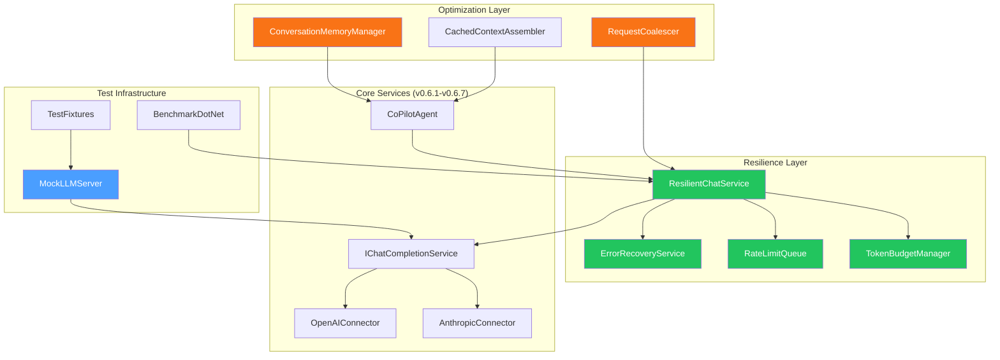

# LCS-SBD-068: Scope Breakdown Document — The Hardening

## Document Control

| Field            | Value                                                                      |
| :--------------- | :------------------------------------------------------------------------- |
| **Document ID**  | LCS-SBD-068                                                                |
| **Version**      | v0.6.8                                                                     |
| **Codename**     | The Hardening (Reliability & Performance)                                  |
| **Status**       | Draft                                                                      |
| **Module**       | Lexichord.Modules.Agents                                                   |
| **Created**      | 2026-01-28                                                                 |
| **Author**       | Documentation Agent                                                        |
| **Reviewers**    | TBD                                                                        |
| **Related Docs** | [LCS-DES-068-INDEX](LCS-DES-068-INDEX.md), [Roadmap](../roadmap-v0.6.x.md) |

---

## 1. Executive Summary

### 1.1 Vision

Ensure the Agents module is production-ready with comprehensive testing, error handling, and optimization. The Hardening phase transforms the v0.6.x feature set from a functional prototype into a battle-tested, enterprise-grade AI assistant. This release establishes reliability baselines, implements resilient error management, and optimizes performance across all Agent components.

### 1.2 Business Value

| Benefit                    | Impact                                                           |
| :------------------------- | :--------------------------------------------------------------- |
| **Production Reliability** | Comprehensive test coverage ensures stable deployments           |
| **User Confidence**        | Predictable performance and graceful error handling              |
| **Enterprise Readiness**   | Resilient architecture suitable for mission-critical workflows   |
| **Developer Velocity**     | Well-tested codebase enables faster iteration on future features |
| **Support Efficiency**     | Clear error messages and logging reduce troubleshooting time     |
| **Cost Optimization**      | Request coalescing and token management reduce API expenses      |

### 1.3 Success Criteria

| Criterion                      | Target                                         |
| :----------------------------- | :--------------------------------------------- |
| Unit test coverage             | ≥ 90% line coverage for Agents module          |
| Integration test coverage      | All critical workflows verified end-to-end     |
| First token latency (stream)   | < 500ms after request sent                     |
| Context assembly time          | < 200ms for style rules + 3 RAG chunks         |
| Template rendering time        | < 10ms for typical prompt                      |
| Memory growth per conversation | < 5MB for 50-message conversation              |
| Error recovery rate            | 100% graceful recovery from transient failures |

### 1.4 License Gating

All hardening features apply transparently to existing license tiers. No new license restrictions are introduced—enhanced reliability benefits all users proportionally.

---

## 2. Dependencies on Prior Versions

### 2.1 Required Components

| Component                        | Version | Purpose                               |
| :------------------------------- | :------ | :------------------------------------ |
| `IChatCompletionService`         | v0.6.1a | Chat completion abstraction           |
| `ChatRequest`/`ChatResponse`     | v0.6.1a | Request/response data contracts       |
| `ILLMProviderRegistry`           | v0.6.1c | Provider discovery                    |
| `OpenAIChatCompletionService`    | v0.6.2a | OpenAI connector under test           |
| `AnthropicChatCompletionService` | v0.6.2b | Anthropic connector under test        |
| `IPromptRenderer`                | v0.6.3b | Template rendering under optimization |
| `IContextInjector`               | v0.6.3d | Context assembly under optimization   |
| `CoPilotViewModel`               | v0.6.4a | Chat UI integration                   |
| `IStreamingChatHandler`          | v0.6.5a | Streaming handler under test          |
| `IAgent`                         | v0.6.6a | Agent abstraction under test          |
| `CoPilotAgent`                   | v0.6.6b | Primary agent under test              |
| `IEditorInsertionService`        | v0.6.7b | Editor integration under test         |
| `Polly`                          | v0.0.5d | Retry policy implementation           |
| `IMediator`                      | v0.0.7a | Event publishing for telemetry        |
| `ILogger<T>`                     | v0.0.3b | Structured logging                    |

---

## 3. Sub-Part Specifications

### 3.1 v0.6.8a: Unit Test Suite

**Goal**: Create comprehensive unit tests for all Agents module components.

**Scope**:

- `ChatCompletionServiceTests`: Mock HTTP responses, verify request format, handle errors
- `PromptRendererTests`: Template variable substitution, missing variable handling
- `AgentTests`: Context assembly, response parsing, citation extraction
- `StreamingParserTests`: SSE parsing for both providers, edge cases

**Key Deliverables**:

- `ChatCompletionServiceTests.cs` - Provider connector tests
- `PromptRendererTests.cs` - Template engine tests
- `AgentTests.cs` - Agent lifecycle tests
- `StreamingParserTests.cs` - SSE parsing tests
- `ContextInjectorTests.cs` - Context assembly tests
- `TokenCounterTests.cs` - Token counting accuracy tests
- Test fixtures and mocks for HTTP responses

**Test Categories**:

```csharp
[Trait("Category", "Unit")]
[Trait("Module", "Agents")]
[Trait("SubPart", "v0.6.8a")]
public class ChatCompletionServiceTests
{
    // Mock HTTP responses, verify request format, handle errors
}
```

**Estimated Effort**: 16 hours

---

### 3.2 v0.6.8b: Integration Tests

**Goal**: Test end-to-end agent workflows with realistic scenarios.

**Scope**:

- Send message → Receive response → Verify token counts
- Streaming: Verify all tokens received and assembled correctly
- Context injection: RAG search executes, style rules included
- Error scenarios: API timeout, rate limit, invalid API key

**Key Deliverables**:

- `AgentWorkflowTests.cs` - End-to-end workflow tests
- `StreamingIntegrationTests.cs` - Streaming assembly tests
- `ContextInjectionIntegrationTests.cs` - Context flow tests
- `ErrorScenarioTests.cs` - Failure handling tests
- `RateLimitTests.cs` - Rate limit handling tests
- Test fixtures with mock LLM server

**Key Interfaces**:

```csharp
public interface IMockLLMServer
{
    void ConfigureResponse(ChatResponse response);
    void ConfigureStreamingResponse(IEnumerable<StreamingChatToken> tokens);
    void ConfigureError(HttpStatusCode statusCode, string message);
    void ConfigureRateLimit(TimeSpan retryAfter);
    int RequestCount { get; }
    IReadOnlyList<ChatRequest> ReceivedRequests { get; }
}
```

**Estimated Effort**: 14 hours

---

### 3.3 v0.6.8c: Performance Optimization

**Goal**: Establish baselines and optimize critical paths.

**Scope**:

- First token latency (streaming): < 500ms after request sent
- Context assembly: < 200ms for style rules + 3 RAG chunks
- Template rendering: < 10ms for typical prompt
- Memory: Conversation history capped to prevent unbounded growth
- Request coalescing for rapid sequential queries

**Key Deliverables**:

- `PerformanceBenchmarks.cs` - BenchmarkDotNet suite
- `ConversationMemoryManager.cs` - History cap enforcement
- `RequestCoalescer.cs` - Sequential query optimization
- `CachedContextAssembler.cs` - Context caching layer
- `LazyTemplateCompiler.cs` - Compiled template cache
- Performance baseline documentation

**Key Interfaces**:

```csharp
public interface IConversationMemoryManager
{
    void TrimToLimit(IList<ChatMessage> messages, int maxMessages);
    int CurrentMessageCount { get; }
    long EstimatedMemoryBytes { get; }
}

public interface IRequestCoalescer
{
    Task<ChatResponse> CoalesceAsync(ChatRequest request, CancellationToken ct);
    int PendingRequestCount { get; }
    TimeSpan CoalescingWindow { get; }
}
```

**Estimated Effort**: 12 hours

---

### 3.4 v0.6.8d: Error Handling & Recovery

**Goal**: Implement resilient error management with user-friendly feedback.

**Scope**:

- API errors: User-friendly messages ("OpenAI is temporarily unavailable")
- Rate limits: Queue requests with estimated wait time display
- Network errors: Retry with exponential backoff, offline indicator
- Invalid responses: Graceful degradation, log for debugging
- Token limit exceeded: Auto-truncate history, warn user

**Key Deliverables**:

- `ResilientChatService.cs` - Decorator with Polly policies
- `AgentException.cs` - Custom exception hierarchy
- `ErrorRecoveryService.cs` - Recovery strategies
- `RateLimitQueue.cs` - Request queuing with wait estimation
- `TokenBudgetManager.cs` - Token limit enforcement
- Error notification UI components

**Key Interfaces**:

```csharp
public interface IErrorRecoveryService
{
    Task<AgentResponse?> AttemptRecoveryAsync(AgentException exception, AgentRequest originalRequest, CancellationToken ct);
    bool CanRecover(AgentException exception);
    RecoveryStrategy GetStrategy(AgentException exception);
}

public interface IRateLimitQueue
{
    Task<ChatResponse> EnqueueAsync(ChatRequest request, CancellationToken ct);
    TimeSpan EstimatedWaitTime { get; }
    int QueueDepth { get; }
    event EventHandler<RateLimitStatusEventArgs> StatusChanged;
}

public interface ITokenBudgetManager
{
    bool CheckBudget(IEnumerable<ChatMessage> messages, int maxTokens);
    IReadOnlyList<ChatMessage> TruncateToFit(IReadOnlyList<ChatMessage> messages, int maxTokens);
    int EstimateTokens(IEnumerable<ChatMessage> messages);
}
```

**Estimated Effort**: 14 hours

---

## 4. Implementation Checklist

| Phase | Task                                         | Est. Hours | Status |
| :---: | :------------------------------------------- | :--------: | :----: |
|   1   | Create test project structure                |     1      |   ☐    |
|   1   | Implement `ChatCompletionServiceTests`       |     4      |   ☐    |
|   1   | Implement `PromptRendererTests`              |     3      |   ☐    |
|   1   | Implement `AgentTests`                       |     4      |   ☐    |
|   1   | Implement `StreamingParserTests`             |     3      |   ☐    |
|   1   | Create test fixtures and mocks               |     1      |   ☐    |
|   2   | Implement `AgentWorkflowTests`               |     4      |   ☐    |
|   2   | Implement `StreamingIntegrationTests`        |     3      |   ☐    |
|   2   | Implement `ContextInjectionIntegrationTests` |     3      |   ☐    |
|   2   | Implement `ErrorScenarioTests`               |     4      |   ☐    |
|   3   | Create `PerformanceBenchmarks`               |     3      |   ☐    |
|   3   | Implement `ConversationMemoryManager`        |     2      |   ☐    |
|   3   | Implement `RequestCoalescer`                 |     3      |   ☐    |
|   3   | Implement context caching                    |     2      |   ☐    |
|   3   | Document performance baselines               |     2      |   ☐    |
|   4   | Implement `ResilientChatService`             |     4      |   ☐    |
|   4   | Implement `AgentException` hierarchy         |     2      |   ☐    |
|   4   | Implement `RateLimitQueue`                   |     3      |   ☐    |
|   4   | Implement `TokenBudgetManager`               |     3      |   ☐    |
|   4   | Create error notification UI                 |     2      |   ☐    |
|       | **Total**                                    |   **56**   |        |

---

## 5. Dependency Matrix

### 5.1 New Interfaces

| Interface                    | Module                   | Purpose                        |
| :--------------------------- | :----------------------- | :----------------------------- |
| `IMockLLMServer`             | Lexichord.Tests.Agents   | Test fixture for LLM mocking   |
| `IConversationMemoryManager` | Lexichord.Modules.Agents | History cap enforcement        |
| `IRequestCoalescer`          | Lexichord.Modules.Agents | Sequential query optimization  |
| `IErrorRecoveryService`      | Lexichord.Modules.Agents | Recovery strategy coordination |
| `IRateLimitQueue`            | Lexichord.Modules.Agents | Request queuing with wait time |
| `ITokenBudgetManager`        | Lexichord.Modules.Agents | Token limit enforcement        |

### 5.2 New Records/Classes

| Type                           | Module                   | Purpose                         |
| :----------------------------- | :----------------------- | :------------------------------ |
| `AgentException`               | Lexichord.Modules.Agents | Base exception for agent errors |
| `RateLimitException`           | Lexichord.Modules.Agents | Rate limit specific exception   |
| `TokenLimitException`          | Lexichord.Modules.Agents | Token budget exceeded           |
| `ProviderUnavailableException` | Lexichord.Modules.Agents | Provider connectivity failure   |
| `RecoveryStrategy`             | Lexichord.Modules.Agents | Recovery approach enumeration   |
| `RateLimitStatusEventArgs`     | Lexichord.Modules.Agents | Rate limit status updates       |
| `PerformanceBaseline`          | Lexichord.Modules.Agents | Benchmark result record         |

---

## 6. Architecture Diagram



---

## 7. Risks & Mitigations

| Risk                           | Probability | Impact | Mitigation                                 |
| :----------------------------- | :---------: | :----: | :----------------------------------------- |
| Test flakiness from timing     |   Medium    |  High  | Use deterministic mocks, avoid real delays |
| Performance regression         |     Low     |  High  | Establish baselines, CI performance gates  |
| Rate limit queue starvation    |     Low     | Medium | Implement queue timeout and priority       |
| Memory leak in history manager |     Low     |  High  | Implement WeakReference patterns, monitor  |
| Retry storm on partial outage  |   Medium    |  High  | Circuit breaker with jitter and backoff    |

---

## 8. Success Metrics

| Metric                  | Measurement Method          | Target  |
| :---------------------- | :-------------------------- | :------ |
| Unit test coverage      | dotnet coverage report      | ≥ 90%   |
| Integration test pass   | CI pipeline all green       | 100%    |
| First token latency     | Streaming benchmark         | < 500ms |
| Context assembly time   | BenchmarkDotNet             | < 200ms |
| Template render time    | BenchmarkDotNet             | < 10ms  |
| Memory per conversation | Memory profiler             | < 5MB   |
| Error recovery success  | Integration test assertions | 100%    |

---

## 9. What This Enables

### 9.1 Immediate Benefits

- **Production Deployment**: Enterprise-grade reliability for mission-critical use
- **Performance Confidence**: Documented baselines prevent regressions
- **Error Transparency**: Clear feedback helps users understand issues
- **Cost Control**: Request coalescing and token management reduce API costs

### 9.2 Future Capabilities

| Future Feature                | How v0.6.8 Enables It                              |
| :---------------------------- | :------------------------------------------------- |
| v0.7.x: External Integrations | Robust error handling extends to new connectors    |
| v0.8.x: Review Workflows      | Reliable foundations for multi-agent orchestration |
| v0.9.x: Collaboration         | Performance optimization scales to team workloads  |
| v1.0: General Availability    | Production-ready quality standards established     |

---

## 10. Verification Commands

```bash
# ═══════════════════════════════════════════════════════════════════════════
# v0.6.8 Verification
# ═══════════════════════════════════════════════════════════════════════════

# 1. Run all unit tests for v0.6.8
dotnet test --filter "SubPart~v0.6.8"

# 2. Run integration tests
dotnet test --filter "Category=Integration&Module=Agents"

# 3. Generate coverage report
dotnet test --collect:"XPlat Code Coverage" --results-directory ./coverage

# 4. Run performance benchmarks
dotnet run -c Release --project tests/Lexichord.Benchmarks -- --filter "Agents*"

# 5. Verify no memory leaks (manual)
# Run conversation with 100 messages, verify memory < 10MB

# 6. Verify error handling (manual)
# a) Disconnect network, verify offline indicator
# b) Set invalid API key, verify user-friendly error
# c) Exhaust rate limit, verify queue and wait time display
```

---

## 11. Changelog Entry

```markdown
## [0.6.8] - 2026-XX-XX

### Added

- **Unit Test Suite**: Comprehensive tests for chat completion, prompt rendering, agents, and streaming
- **Integration Tests**: End-to-end workflow tests including error scenarios
- **Performance Benchmarks**: BenchmarkDotNet suite with documented baselines
- **Resilient Chat Service**: Polly-based wrapper with retry, circuit breaker, and timeout policies
- **Rate Limit Queue**: Request queuing with estimated wait time display
- **Token Budget Manager**: Automatic history truncation when token limit approached
- **Conversation Memory Manager**: History cap enforcement to prevent memory growth

### Changed

- Improved error messages with user-friendly descriptions
- Optimized context assembly with caching layer
- Enhanced template rendering with compiled template cache

### Technical

- `ResilientChatService` decorator for all `IChatCompletionService` implementations
- `AgentException` hierarchy for structured error handling
- `IRequestCoalescer` for sequential query optimization
- Test coverage increased to 90%+ for Agents module
```

---
