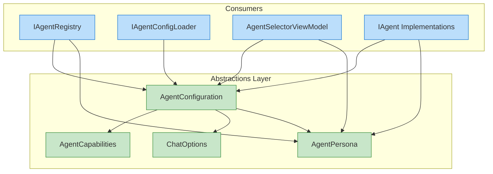
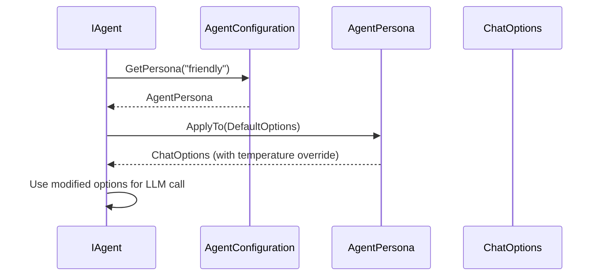

# LCS-DES-071a: Agent Configuration Model

## 1. Metadata & Categorization

| Field              | Value                     |
| :----------------- | :------------------------ |
| **Document ID**    | LCS-DES-071a              |
| **Feature ID**     | AGT-071a                  |
| **Feature Name**   | Agent Configuration Model |
| **Target Version** | v0.7.1a                   |
| **Module Scope**   | Lexichord.Abstractions    |
| **Swimlane**       | Agents                    |
| **License Tier**   | Core                      |
| **Status**         | Draft                     |
| **Last Updated**   | 2026-01-28                |

---

## 2. Executive Summary

### 2.1 The Requirement

The agent system requires a standardized data model to represent specialized agents and their configurable personality variants (personas). Without a well-defined schema, agent definitions would be inconsistent, validation would be ad-hoc, and extending the system with new agent types would be error-prone.

### 2.2 The Proposed Solution

Define immutable C# record types that serve as the canonical data contracts for agent configuration:

- **`AgentConfiguration`:** The complete definition of an agent including identity, capabilities, default options, and available personas.
- **`AgentPersona`:** A personality variant that overrides specific agent behaviors (temperature, prompts, voice).
- **`AgentCapabilities`:** A flags enum declaring what features an agent supports.

These records will be used throughout the agent subsystem—from YAML deserialization to runtime persona switching to UI rendering.

---

## 3. Architecture & Modular Strategy

### 3.1 System Architecture Diagram



### 3.2 Dependencies

| Dependency    | Source  | Purpose                        |
| :------------ | :------ | :----------------------------- |
| `ChatOptions` | v0.6.1a | Default LLM request parameters |
| `LicenseTier` | v0.0.4c | Required tier for agent access |

### 3.3 Licensing Behavior

| Tier       | Access                                  |
| :--------- | :-------------------------------------- |
| Core       | Read `AgentConfiguration` for any agent |
| WriterPro+ | Access specialist agent configurations  |

---

## 4. Data Contract (The API)

### 4.1 AgentConfiguration Record

```csharp
namespace Lexichord.Abstractions.Agents;

/// <summary>
/// Defines the complete configuration for a specialized agent including
/// identity, capabilities, default behavior, and available personas.
/// </summary>
/// <param name="AgentId">
/// Unique identifier for this agent. Must be kebab-case (e.g., "editor", "researcher").
/// </param>
/// <param name="Name">
/// Human-readable display name (e.g., "The Editor").
/// </param>
/// <param name="Description">
/// Brief description of the agent's purpose and specialization.
/// </param>
/// <param name="Icon">
/// Icon identifier for UI display (e.g., "edit-3", "search").
/// Uses Lucide icon names.
/// </param>
/// <param name="TemplateId">
/// Identifier of the prompt template used by this agent.
/// </param>
/// <param name="Capabilities">
/// Flags indicating what features this agent supports.
/// </param>
/// <param name="DefaultOptions">
/// Default LLM request options (model, temperature, max_tokens).
/// </param>
/// <param name="Personas">
/// Available personality variants for this agent.
/// </param>
/// <param name="RequiredTier">
/// Minimum license tier required to use this agent.
/// </param>
/// <param name="CustomSettings">
/// Optional dictionary of agent-specific configuration values.
/// </param>
public record AgentConfiguration(
    string AgentId,
    string Name,
    string Description,
    string Icon,
    string TemplateId,
    AgentCapabilities Capabilities,
    ChatOptions DefaultOptions,
    IReadOnlyList<AgentPersona> Personas,
    LicenseTier RequiredTier = LicenseTier.Core,
    IReadOnlyDictionary<string, object>? CustomSettings = null
)
{
    /// <summary>
    /// Gets the default persona (first in the list) or null if no personas defined.
    /// </summary>
    public AgentPersona? DefaultPersona => Personas.Count > 0 ? Personas[0] : null;

    /// <summary>
    /// Gets a persona by ID, or null if not found.
    /// </summary>
    public AgentPersona? GetPersona(string personaId) =>
        Personas.FirstOrDefault(p => p.PersonaId == personaId);

    /// <summary>
    /// Validates that the configuration meets all requirements.
    /// </summary>
    public IReadOnlyList<string> Validate()
    {
        var errors = new List<string>();

        if (string.IsNullOrWhiteSpace(AgentId))
            errors.Add("AgentId is required");
        else if (!AgentIdPattern().IsMatch(AgentId))
            errors.Add("AgentId must be kebab-case (lowercase letters, numbers, hyphens)");

        if (string.IsNullOrWhiteSpace(Name))
            errors.Add("Name is required");

        if (string.IsNullOrWhiteSpace(TemplateId))
            errors.Add("TemplateId is required");

        if (Capabilities == AgentCapabilities.None)
            errors.Add("At least one capability is required");

        // Validate personas
        var personaIds = new HashSet<string>();
        foreach (var persona in Personas)
        {
            if (!personaIds.Add(persona.PersonaId))
                errors.Add($"Duplicate persona ID: {persona.PersonaId}");
            errors.AddRange(persona.Validate());
        }

        return errors;
    }

    [GeneratedRegex(@"^[a-z0-9]+(-[a-z0-9]+)*$")]
    private static partial Regex AgentIdPattern();
}
```

### 4.2 AgentPersona Record

```csharp
namespace Lexichord.Abstractions.Agents;

/// <summary>
/// Defines a personality variant for an agent with specific behavioral overrides.
/// Personas allow the same agent to behave differently based on user preference.
/// </summary>
/// <param name="PersonaId">
/// Unique identifier within the parent agent (e.g., "strict", "friendly").
/// </param>
/// <param name="DisplayName">
/// Human-readable name shown in UI (e.g., "Strict Editor").
/// </param>
/// <param name="Tagline">
/// Short descriptive phrase (e.g., "No errors escape notice").
/// </param>
/// <param name="SystemPromptOverride">
/// Optional override for the agent's system prompt.
/// If null, uses the agent's default template.
/// </param>
/// <param name="Temperature">
/// LLM temperature override. Lower = more focused, higher = more creative.
/// </param>
/// <param name="VoiceDescription">
/// Optional description of the persona's communication style for UI hints.
/// </param>
public record AgentPersona(
    string PersonaId,
    string DisplayName,
    string Tagline,
    string? SystemPromptOverride,
    float Temperature,
    string? VoiceDescription = null
)
{
    /// <summary>
    /// Applies this persona's overrides to the given chat options.
    /// </summary>
    public ChatOptions ApplyTo(ChatOptions baseOptions) =>
        baseOptions with { Temperature = Temperature };

    /// <summary>
    /// Validates that the persona meets all requirements.
    /// </summary>
    public IReadOnlyList<string> Validate()
    {
        var errors = new List<string>();

        if (string.IsNullOrWhiteSpace(PersonaId))
            errors.Add("PersonaId is required");
        else if (!PersonaIdPattern().IsMatch(PersonaId))
            errors.Add($"PersonaId must be kebab-case: {PersonaId}");

        if (string.IsNullOrWhiteSpace(DisplayName))
            errors.Add("DisplayName is required");

        if (Temperature < 0f || Temperature > 2f)
            errors.Add($"Temperature must be between 0.0 and 2.0: {Temperature}");

        return errors;
    }

    [GeneratedRegex(@"^[a-z0-9]+(-[a-z0-9]+)*$")]
    private static partial Regex PersonaIdPattern();
}
```

### 4.3 AgentCapabilities Enum

```csharp
namespace Lexichord.Abstractions.Agents;

/// <summary>
/// Flags enum declaring the capabilities an agent supports.
/// Used for feature discovery and UI adaptation.
/// </summary>
[Flags]
public enum AgentCapabilities
{
    /// <summary>No capabilities.</summary>
    None = 0,

    /// <summary>Basic conversational chat.</summary>
    Chat = 1 << 0,

    /// <summary>Can access and analyze document content.</summary>
    DocumentContext = 1 << 1,

    /// <summary>Can enforce style rules and terminology.</summary>
    StyleEnforcement = 1 << 2,

    /// <summary>Can generate or analyze code.</summary>
    CodeGeneration = 1 << 3,

    /// <summary>Can perform research and cite sources.</summary>
    ResearchAssistance = 1 << 4,

    /// <summary>Can summarize long-form content.</summary>
    Summarization = 1 << 5,

    /// <summary>Can analyze and suggest improvements to structure.</summary>
    StructureAnalysis = 1 << 6,

    /// <summary>Can help with brainstorming and ideation.</summary>
    Brainstorming = 1 << 7,

    /// <summary>Can translate between languages.</summary>
    Translation = 1 << 8,

    /// <summary>All capabilities combined.</summary>
    All = Chat | DocumentContext | StyleEnforcement | CodeGeneration |
          ResearchAssistance | Summarization | StructureAnalysis |
          Brainstorming | Translation
}

/// <summary>
/// Extension methods for <see cref="AgentCapabilities"/>.
/// </summary>
public static class AgentCapabilitiesExtensions
{
    /// <summary>
    /// Checks if the capabilities include a specific capability.
    /// </summary>
    public static bool Has(this AgentCapabilities capabilities, AgentCapabilities capability) =>
        (capabilities & capability) == capability;

    /// <summary>
    /// Gets a human-readable description of the capabilities.
    /// </summary>
    public static string ToDisplayString(this AgentCapabilities capabilities)
    {
        if (capabilities == AgentCapabilities.None) return "None";
        if (capabilities == AgentCapabilities.All) return "All";

        var names = new List<string>();
        foreach (AgentCapabilities value in Enum.GetValues<AgentCapabilities>())
        {
            if (value != AgentCapabilities.None &&
                value != AgentCapabilities.All &&
                capabilities.Has(value))
            {
                names.Add(value.ToString());
            }
        }
        return string.Join(", ", names);
    }
}
```

---

## 5. Implementation Logic

### 5.1 Record Initialization Patterns

```csharp
// Creating an agent configuration programmatically
var editorConfig = new AgentConfiguration(
    AgentId: "editor",
    Name: "The Editor",
    Description: "Focused on grammar, clarity, and structure",
    Icon: "edit-3",
    TemplateId: "specialist-editor",
    Capabilities: AgentCapabilities.Chat | AgentCapabilities.DocumentContext | AgentCapabilities.StyleEnforcement,
    DefaultOptions: new ChatOptions { Model = "gpt-4o", Temperature = 0.3f, MaxTokens = 2048 },
    Personas:
    [
        new AgentPersona("strict", "Strict Editor", "No errors escape notice", null, 0.1f),
        new AgentPersona("friendly", "Friendly Editor", "Gentle suggestions", null, 0.5f)
    ],
    RequiredTier: LicenseTier.WriterPro
);

// Validating configuration
var errors = editorConfig.Validate();
if (errors.Count > 0)
{
    throw new InvalidOperationException($"Invalid config: {string.Join("; ", errors)}");
}

// Accessing personas
var strictPersona = editorConfig.GetPersona("strict");
var defaultPersona = editorConfig.DefaultPersona;
```

### 5.2 Persona Application Flow



### 5.3 Capability Checking

```csharp
public class CoPilotAgent : IAgent
{
    private readonly AgentConfiguration _config;

    public bool CanAccessDocument => _config.Capabilities.Has(AgentCapabilities.DocumentContext);

    public async Task<ChatResponse> ProcessAsync(ChatRequest request, CancellationToken ct)
    {
        // Only inject document context if agent has capability
        if (CanAccessDocument && request.DocumentContext is not null)
        {
            request = request with
            {
                SystemPrompt = request.SystemPrompt + "\n\n" + request.DocumentContext
            };
        }

        // Apply active persona
        var options = _activePersona?.ApplyTo(_config.DefaultOptions) ?? _config.DefaultOptions;

        return await _completionService.CompleteAsync(request with { Options = options }, ct);
    }
}
```

---

## 6. Data Persistence

### 6.1 YAML Serialization Format

```yaml
# Agent configuration YAML schema
agent_id: "editor" # Required, kebab-case
name: "The Editor" # Required
description: "Grammar and clarity" # Required
icon: "edit-3" # Required, Lucide icon name
template_id: "specialist-editor" # Required
license_tier: "WriterPro" # Optional, defaults to Core
capabilities: # Required, at least one
    - Chat
    - DocumentContext
    - StyleEnforcement
default_options: # Required
    model: "gpt-4o"
    temperature: 0.3
    max_tokens: 2048
custom_settings: # Optional
    strict_mode: true
    check_spelling: true
personas: # Optional list
    - persona_id: "strict"
      display_name: "Strict Editor"
      tagline: "No errors escape notice"
      temperature: 0.1
      system_prompt_override: |
          You are a meticulous editor...
      voice_description: "Precise and exacting"
    - persona_id: "friendly"
      display_name: "Friendly Editor"
      tagline: "Gentle suggestions"
      temperature: 0.5
```

### 6.2 JSON Serialization (API)

```json
{
    "agentId": "editor",
    "name": "The Editor",
    "description": "Focused on grammar, clarity, and structure",
    "icon": "edit-3",
    "templateId": "specialist-editor",
    "requiredTier": "WriterPro",
    "capabilities": ["Chat", "DocumentContext", "StyleEnforcement"],
    "defaultOptions": {
        "model": "gpt-4o",
        "temperature": 0.3,
        "maxTokens": 2048
    },
    "personas": [
        {
            "personaId": "strict",
            "displayName": "Strict Editor",
            "tagline": "No errors escape notice",
            "temperature": 0.1,
            "systemPromptOverride": null,
            "voiceDescription": "Precise and exacting"
        }
    ]
}
```

---

## 7. Observability & Logging

| Level   | Source             | Message Template                                   |
| :------ | :----------------- | :------------------------------------------------- |
| Debug   | AgentConfiguration | `Validating agent configuration: {AgentId}`        |
| Debug   | AgentConfiguration | `Agent validation passed: {AgentId}`               |
| Warning | AgentConfiguration | `Agent validation failed: {AgentId} - {Errors}`    |
| Debug   | AgentPersona       | `Applying persona: {PersonaId} to {AgentId}`       |
| Debug   | AgentPersona       | `Temperature override: {BaseTemp} → {PersonaTemp}` |

---

## 8. Acceptance Criteria (QA)

| #   | Category         | Criterion                                                |
| :-- | :--------------- | :------------------------------------------------------- |
| 1   | **Schema**       | `AgentConfiguration` record compiles with all properties |
| 2   | **Schema**       | `AgentPersona` record compiles with all properties       |
| 3   | **Schema**       | `AgentCapabilities` enum has all documented values       |
| 4   | **Validation**   | Invalid AgentId patterns are rejected                    |
| 5   | **Validation**   | Missing required fields produce specific errors          |
| 6   | **Validation**   | Temperature out of range produces error                  |
| 7   | **Validation**   | Duplicate persona IDs are detected                       |
| 8   | **Equality**     | Records with same values are equal                       |
| 9   | **Equality**     | Record hash codes are consistent                         |
| 10  | **Persona**      | `ApplyTo()` correctly overrides temperature              |
| 11  | **Capabilities** | Flag combinations work correctly                         |
| 12  | **Extensions**   | `Has()` extension method works for all flags             |

---

## 9. Unit Testing Requirements

### 9.1 AgentConfiguration Tests

```csharp
[Trait("Category", "Unit")]
[Trait("Module", "Agents")]
[Trait("SubPart", "v0.7.1a")]
public class AgentConfigurationTests
{
    [Fact]
    public void AgentConfiguration_WithValidData_PassesValidation()
    {
        // Arrange
        var config = CreateValidConfiguration();

        // Act
        var errors = config.Validate();

        // Assert
        errors.Should().BeEmpty();
    }

    [Theory]
    [InlineData("")]
    [InlineData(null)]
    [InlineData("Invalid ID")]
    [InlineData("UPPERCASE")]
    [InlineData("has spaces")]
    public void AgentConfiguration_WithInvalidAgentId_FailsValidation(string? agentId)
    {
        // Arrange
        var config = CreateValidConfiguration() with { AgentId = agentId! };

        // Act
        var errors = config.Validate();

        // Assert
        errors.Should().Contain(e => e.Contains("AgentId"));
    }

    [Fact]
    public void AgentConfiguration_WithDuplicatePersonaIds_FailsValidation()
    {
        // Arrange
        var config = CreateValidConfiguration() with
        {
            Personas =
            [
                new AgentPersona("duplicate", "First", "Tag", null, 0.5f),
                new AgentPersona("duplicate", "Second", "Tag", null, 0.3f)
            ]
        };

        // Act
        var errors = config.Validate();

        // Assert
        errors.Should().Contain(e => e.Contains("Duplicate persona ID"));
    }

    [Fact]
    public void AgentConfiguration_Equality_SameValues_AreEqual()
    {
        // Arrange
        var config1 = CreateValidConfiguration();
        var config2 = CreateValidConfiguration();

        // Assert
        config1.Should().Be(config2);
        config1.GetHashCode().Should().Be(config2.GetHashCode());
    }

    [Fact]
    public void AgentConfiguration_GetPersona_ReturnsCorrectPersona()
    {
        // Arrange
        var config = CreateValidConfiguration();

        // Act
        var persona = config.GetPersona("strict");

        // Assert
        persona.Should().NotBeNull();
        persona!.DisplayName.Should().Be("Strict Editor");
    }

    [Fact]
    public void AgentConfiguration_GetPersona_UnknownId_ReturnsNull()
    {
        // Arrange
        var config = CreateValidConfiguration();

        // Act
        var persona = config.GetPersona("nonexistent");

        // Assert
        persona.Should().BeNull();
    }

    [Fact]
    public void AgentConfiguration_DefaultPersona_ReturnsFirst()
    {
        // Arrange
        var config = CreateValidConfiguration();

        // Act
        var defaultPersona = config.DefaultPersona;

        // Assert
        defaultPersona.Should().NotBeNull();
        defaultPersona!.PersonaId.Should().Be("strict");
    }

    [Fact]
    public void AgentConfiguration_WithNoPersonas_DefaultPersonaIsNull()
    {
        // Arrange
        var config = CreateValidConfiguration() with { Personas = [] };

        // Act
        var defaultPersona = config.DefaultPersona;

        // Assert
        defaultPersona.Should().BeNull();
    }

    private static AgentConfiguration CreateValidConfiguration() =>
        new(
            AgentId: "test-agent",
            Name: "Test Agent",
            Description: "A test agent",
            Icon: "test-icon",
            TemplateId: "test-template",
            Capabilities: AgentCapabilities.Chat,
            DefaultOptions: new ChatOptions { Model = "gpt-4o", Temperature = 0.5f, MaxTokens = 1024 },
            Personas:
            [
                new AgentPersona("strict", "Strict Editor", "No errors", null, 0.1f),
                new AgentPersona("friendly", "Friendly Editor", "Gentle", null, 0.5f)
            ]
        );
}
```

### 9.2 AgentPersona Tests

```csharp
[Trait("Category", "Unit")]
[Trait("Module", "Agents")]
[Trait("SubPart", "v0.7.1a")]
public class AgentPersonaTests
{
    [Fact]
    public void AgentPersona_WithValidData_PassesValidation()
    {
        // Arrange
        var persona = new AgentPersona("test-persona", "Test", "Tagline", null, 0.5f);

        // Act
        var errors = persona.Validate();

        // Assert
        errors.Should().BeEmpty();
    }

    [Theory]
    [InlineData(-0.1f)]
    [InlineData(2.1f)]
    [InlineData(3.0f)]
    public void AgentPersona_WithInvalidTemperature_FailsValidation(float temperature)
    {
        // Arrange
        var persona = new AgentPersona("test", "Test", "Tag", null, temperature);

        // Act
        var errors = persona.Validate();

        // Assert
        errors.Should().Contain(e => e.Contains("Temperature"));
    }

    [Fact]
    public void AgentPersona_ApplyTo_OverridesTemperature()
    {
        // Arrange
        var persona = new AgentPersona("warm", "Warm", "Tag", null, 0.8f);
        var baseOptions = new ChatOptions { Model = "gpt-4o", Temperature = 0.3f, MaxTokens = 2048 };

        // Act
        var modified = persona.ApplyTo(baseOptions);

        // Assert
        modified.Temperature.Should().Be(0.8f);
        modified.Model.Should().Be("gpt-4o"); // Unchanged
        modified.MaxTokens.Should().Be(2048); // Unchanged
    }

    [Fact]
    public void AgentPersona_Equality_SameValues_AreEqual()
    {
        // Arrange
        var persona1 = new AgentPersona("test", "Test", "Tag", "Override", 0.5f, "Voice");
        var persona2 = new AgentPersona("test", "Test", "Tag", "Override", 0.5f, "Voice");

        // Assert
        persona1.Should().Be(persona2);
    }

    [Fact]
    public void AgentPersona_WithSystemPromptOverride_StoresValue()
    {
        // Arrange
        var override_ = "You are a specialized assistant...";
        var persona = new AgentPersona("custom", "Custom", "Tag", override_, 0.5f);

        // Assert
        persona.SystemPromptOverride.Should().Be(override_);
    }
}
```

### 9.3 AgentCapabilities Tests

```csharp
[Trait("Category", "Unit")]
[Trait("Module", "Agents")]
[Trait("SubPart", "v0.7.1a")]
public class AgentCapabilitiesTests
{
    [Fact]
    public void AgentCapabilities_Has_SingleFlag_ReturnsTrue()
    {
        // Arrange
        var capabilities = AgentCapabilities.Chat;

        // Act & Assert
        capabilities.Has(AgentCapabilities.Chat).Should().BeTrue();
        capabilities.Has(AgentCapabilities.DocumentContext).Should().BeFalse();
    }

    [Fact]
    public void AgentCapabilities_Has_CombinedFlags_ReturnsCorrectly()
    {
        // Arrange
        var capabilities = AgentCapabilities.Chat |
                           AgentCapabilities.DocumentContext |
                           AgentCapabilities.StyleEnforcement;

        // Act & Assert
        capabilities.Has(AgentCapabilities.Chat).Should().BeTrue();
        capabilities.Has(AgentCapabilities.DocumentContext).Should().BeTrue();
        capabilities.Has(AgentCapabilities.StyleEnforcement).Should().BeTrue();
        capabilities.Has(AgentCapabilities.CodeGeneration).Should().BeFalse();
    }

    [Fact]
    public void AgentCapabilities_ToDisplayString_ReturnsCommaSeparated()
    {
        // Arrange
        var capabilities = AgentCapabilities.Chat | AgentCapabilities.DocumentContext;

        // Act
        var display = capabilities.ToDisplayString();

        // Assert
        display.Should().Contain("Chat");
        display.Should().Contain("DocumentContext");
    }

    [Fact]
    public void AgentCapabilities_None_ToDisplayString_ReturnsNone()
    {
        // Arrange
        var capabilities = AgentCapabilities.None;

        // Act
        var display = capabilities.ToDisplayString();

        // Assert
        display.Should().Be("None");
    }

    [Fact]
    public void AgentCapabilities_All_ToDisplayString_ReturnsAll()
    {
        // Arrange
        var capabilities = AgentCapabilities.All;

        // Act
        var display = capabilities.ToDisplayString();

        // Assert
        display.Should().Be("All");
    }
}
```

---

## 10. DI Registration

```csharp
// No DI registration needed for record types - they are data contracts.
// Records are instantiated directly or via IAgentConfigLoader.

// For validation extensions:
public static class AgentValidationServiceCollectionExtensions
{
    public static IServiceCollection AddAgentValidation(this IServiceCollection services)
    {
        services.AddSingleton<IValidator<AgentConfiguration>, AgentConfigurationValidator>();
        services.AddSingleton<IValidator<AgentPersona>, AgentPersonaValidator>();
        return services;
    }
}
```

---

## 11. Deliverable Checklist

| #   | Deliverable                     | Status |
| :-- | :------------------------------ | :----- |
| 1   | `AgentConfiguration.cs`         | [ ]    |
| 2   | `AgentPersona.cs`               | [ ]    |
| 3   | `AgentCapabilities.cs`          | [ ]    |
| 4   | `AgentConfigurationTests.cs`    | [ ]    |
| 5   | `AgentPersonaTests.cs`          | [ ]    |
| 6   | `AgentCapabilitiesTests.cs`     | [ ]    |
| 7   | XML documentation for all types | [ ]    |

---

## 12. Changelog Entry

```markdown
## [0.7.1a] - 2026-XX-XX

### Added

- `AgentConfiguration` record for agent metadata and settings
    - Properties: AgentId, Name, Description, Icon, TemplateId, Capabilities, DefaultOptions, Personas, RequiredTier, CustomSettings
    - Methods: Validate(), GetPersona(), DefaultPersona property
- `AgentPersona` record for personality variants
    - Properties: PersonaId, DisplayName, Tagline, SystemPromptOverride, Temperature, VoiceDescription
    - Methods: Validate(), ApplyTo()
- `AgentCapabilities` flags enum
    - Values: None, Chat, DocumentContext, StyleEnforcement, CodeGeneration, ResearchAssistance, Summarization, StructureAnalysis, Brainstorming, Translation, All
    - Extension methods: Has(), ToDisplayString()
```

---

## Related Documents

- [LCS-DES-071-INDEX.md](LCS-DES-071-INDEX.md) - Design Specification Index
- [LCS-DES-071b.md](LCS-DES-071b.md) - Agent Registry Implementation
- [LCS-SBD-071.md](LCS-SBD-071.md) - Scope Breakdown Document
