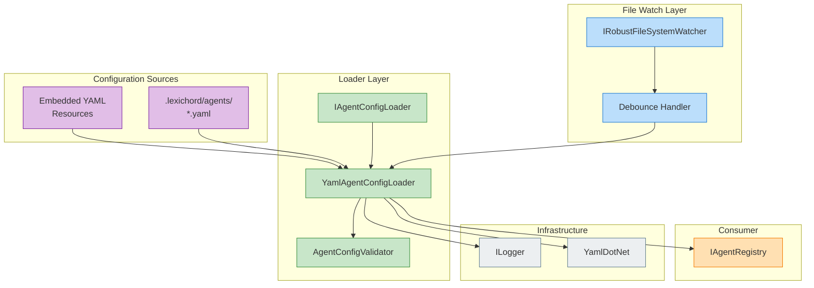

# LCS-DES-071c: Agent Configuration Files

## 1. Metadata & Categorization

| Field              | Value                     |
| :----------------- | :------------------------ |
| **Document ID**    | LCS-DES-071c              |
| **Feature ID**     | AGT-071c                  |
| **Feature Name**   | Agent Configuration Files |
| **Target Version** | v0.7.1c                   |
| **Module Scope**   | Lexichord.Modules.Agents  |
| **Swimlane**       | Agents                    |
| **License Tier**   | WriterPro (custom agents) |
| **Status**         | Draft                     |
| **Last Updated**   | 2026-01-28                |

---

## 2. Executive Summary

### 2.1 The Requirement

Writers need both access to built-in specialist agents and the ability to create custom agents tailored to their specific projects. Custom agents should:

- Be defined via human-readable YAML files
- Support hot-reload when files change
- Validate against a strict schema
- Integrate seamlessly with the Agent Registry

### 2.2 The Proposed Solution

Implement a YAML-based configuration system for agents:

- **Built-in agents:** Embedded YAML resources in the Agents module assembly
- **Workspace agents:** YAML files in `.lexichord/agents/` directory
- **Hot-reload:** File watcher detects changes and updates registry
- **Validation:** Strict schema validation with helpful error messages
- **Version compatibility:** Schema versioning for future migrations

---

## 3. Architecture & Modular Strategy

### 3.1 System Architecture Diagram



### 3.2 Dependencies

| Dependency                 | Source  | Purpose                          |
| :------------------------- | :------ | :------------------------------- |
| `AgentConfiguration`       | v0.7.1a | Target model for deserialization |
| `IAgentRegistry`           | v0.7.1b | Registration target              |
| `IRobustFileSystemWatcher` | v0.1.2b | Workspace file monitoring        |
| `ILicenseContext`          | v0.0.4c | Custom agent access control      |
| `YamlDotNet`               | NuGet   | YAML parsing and validation      |

### 3.3 Licensing Behavior

| Tier      | Built-in Agents | Workspace Agents | Hot-Reload |
| :-------- | :-------------- | :--------------- | :--------- |
| Core      | ✅ General Chat | ❌               | ❌         |
| Writer    | ✅ General Chat | ❌               | ❌         |
| WriterPro | ✅ All          | ✅ Read-only     | ✅         |
| Teams+    | ✅ All          | ✅ Read/Write    | ✅         |

---

## 4. Data Contract (The API)

### 4.1 IAgentConfigLoader Interface

```csharp
namespace Lexichord.Abstractions.Agents;

/// <summary>
/// Loads agent configurations from YAML files.
/// </summary>
public interface IAgentConfigLoader
{
    /// <summary>
    /// Loads all built-in agents from embedded resources.
    /// </summary>
    /// <returns>List of validated agent configurations.</returns>
    Task<IReadOnlyList<AgentConfiguration>> LoadBuiltInAgentsAsync(
        CancellationToken ct = default);

    /// <summary>
    /// Loads all workspace agents from the specified directory.
    /// </summary>
    /// <param name="workspacePath">Path to the workspace root.</param>
    /// <returns>List of validated agent configurations.</returns>
    Task<IReadOnlyList<AgentConfiguration>> LoadWorkspaceAgentsAsync(
        string workspacePath,
        CancellationToken ct = default);

    /// <summary>
    /// Loads a single agent configuration from a YAML file.
    /// </summary>
    /// <param name="filePath">Path to the YAML file.</param>
    /// <returns>Validation result with configuration if valid.</returns>
    Task<AgentConfigValidationResult> LoadFromFileAsync(
        string filePath,
        CancellationToken ct = default);

    /// <summary>
    /// Parses and validates YAML content directly.
    /// </summary>
    /// <param name="yamlContent">The YAML string to parse.</param>
    /// <param name="sourceName">Name for error reporting.</param>
    /// <returns>Validation result with configuration if valid.</returns>
    AgentConfigValidationResult ParseYaml(string yamlContent, string sourceName);

    /// <summary>
    /// Starts watching workspace agents directory for changes.
    /// </summary>
    /// <param name="workspacePath">Path to the workspace root.</param>
    void StartWatching(string workspacePath);

    /// <summary>
    /// Stops watching the workspace directory.
    /// </summary>
    void StopWatching();

    /// <summary>
    /// Event raised when a workspace agent file changes.
    /// </summary>
    event EventHandler<AgentFileChangedEventArgs>? AgentFileChanged;
}
```

### 4.2 Validation Result Types

```csharp
namespace Lexichord.Modules.Agents;

/// <summary>
/// Result of validating an agent configuration YAML file.
/// </summary>
public sealed record AgentConfigValidationResult
{
    /// <summary>
    /// Whether the configuration is valid and can be used.
    /// </summary>
    public bool IsValid { get; init; }

    /// <summary>
    /// The parsed configuration if valid, null otherwise.
    /// </summary>
    public AgentConfiguration? Configuration { get; init; }

    /// <summary>
    /// Validation errors if invalid.
    /// </summary>
    public IReadOnlyList<AgentConfigError> Errors { get; init; } = [];

    /// <summary>
    /// Warnings that don't prevent loading but should be addressed.
    /// </summary>
    public IReadOnlyList<AgentConfigWarning> Warnings { get; init; } = [];

    /// <summary>
    /// Source file or resource name.
    /// </summary>
    public string SourceName { get; init; } = "";

    public static AgentConfigValidationResult Success(
        AgentConfiguration config,
        string sourceName,
        IReadOnlyList<AgentConfigWarning>? warnings = null) =>
        new()
        {
            IsValid = true,
            Configuration = config,
            SourceName = sourceName,
            Warnings = warnings ?? []
        };

    public static AgentConfigValidationResult Failure(
        string sourceName,
        IReadOnlyList<AgentConfigError> errors) =>
        new()
        {
            IsValid = false,
            SourceName = sourceName,
            Errors = errors
        };
}

/// <summary>
/// A validation error that prevents loading an agent configuration.
/// </summary>
public sealed record AgentConfigError(
    string Property,
    string Message,
    int? Line = null,
    int? Column = null
);

/// <summary>
/// A validation warning that doesn't prevent loading but should be addressed.
/// </summary>
public sealed record AgentConfigWarning(
    string Property,
    string Message,
    int? Line = null
);

/// <summary>
/// Event args when a workspace agent file changes.
/// </summary>
public sealed class AgentFileChangedEventArgs : EventArgs
{
    public required string FilePath { get; init; }
    public required AgentFileChangeType ChangeType { get; init; }
    public AgentConfigValidationResult? ValidationResult { get; init; }
}

public enum AgentFileChangeType
{
    Created,
    Modified,
    Deleted
}
```

### 4.3 YAML Schema Definition

```yaml
# Agent Configuration YAML Schema (v1)
# File: .lexichord/agents/my-agent.yaml

# Required schema version for future compatibility
schema_version: 1

# Required: Unique identifier (kebab-case)
agent_id: "custom-editor"

# Required: Display name
name: "Custom Editor"

# Required: Description of the agent's purpose
description: |
    A specialized editor for technical documentation.
    Focuses on clarity, accuracy, and consistent terminology.

# Required: Icon name (Lucide icon set)
icon: "file-edit"

# Required: Prompt template ID
template_id: "custom-editor-template"

# Optional: License tier required (defaults to Core)
# Values: Core, Writer, WriterPro, Teams, Enterprise
license_tier: "WriterPro"

# Required: Agent capabilities (at least one)
capabilities:
    - Chat
    - DocumentContext
    - StyleEnforcement

# Required: Default LLM options
default_options:
    # Required: OpenAI model name
    model: "gpt-4o"

    # Required: Temperature (0.0-2.0)
    temperature: 0.3

    # Required: Maximum response tokens
    max_tokens: 2048

# Optional: Custom agent-specific settings
custom_settings:
    check_spelling: true
    enforce_terminology: true
    terminology_file: ".lexichord/terminology.yaml"

# Optional: Persona variants (uses defaults if empty)
personas:
    - persona_id: "precise"
      display_name: "Precise Mode"
      tagline: "Technical accuracy first"
      temperature: 0.1
      voice_description: "Exact and exacting"

    - persona_id: "conversational"
      display_name: "Conversational Mode"
      tagline: "Friendly technical guidance"
      temperature: 0.5
      system_prompt_override: |
          You are a friendly technical writer who helps with documentation.
          Maintain accuracy while being approachable and encouraging.
      voice_description: "Warm but precise"
```

---

## 5. Implementation Logic

### 5.1 YamlAgentConfigLoader Implementation

```csharp
namespace Lexichord.Modules.Agents;

/// <summary>
/// Loads and validates agent configurations from YAML files.
/// </summary>
public sealed class YamlAgentConfigLoader : IAgentConfigLoader, IDisposable
{
    private readonly IAgentConfigValidator _validator;
    private readonly IRobustFileSystemWatcher _fileSystemWatcher;
    private readonly ILicenseContext _licenseContext;
    private readonly ILogger<YamlAgentConfigLoader> _logger;

    private readonly IDeserializer _deserializer;
    private IDisposable? _watcherSubscription;
    private readonly Subject<string> _fileChangeSubject = new();

    private const string AgentsSubdirectory = ".lexichord/agents";
    private const string BuiltInResourcePrefix = "Lexichord.Modules.Agents.Resources.BuiltIn.";

    public event EventHandler<AgentFileChangedEventArgs>? AgentFileChanged;

    public YamlAgentConfigLoader(
        IAgentConfigValidator validator,
        IRobustFileSystemWatcher fileSystemWatcher,
        ILicenseContext licenseContext,
        ILogger<YamlAgentConfigLoader> logger)
    {
        _validator = validator;
        _fileSystemWatcher = fileSystemWatcher;
        _licenseContext = licenseContext;
        _logger = logger;

        _deserializer = new DeserializerBuilder()
            .WithNamingConvention(UnderscoredNamingConvention.Instance)
            .IgnoreUnmatchedProperties()
            .Build();

        // Debounce file changes to avoid rapid reloads
        _fileChangeSubject
            .Throttle(TimeSpan.FromMilliseconds(300))
            .Subscribe(OnDebouncedFileChange);
    }

    public async Task<IReadOnlyList<AgentConfiguration>> LoadBuiltInAgentsAsync(
        CancellationToken ct = default)
    {
        var assembly = typeof(YamlAgentConfigLoader).Assembly;
        var resourceNames = assembly.GetManifestResourceNames()
            .Where(n => n.StartsWith(BuiltInResourcePrefix) && n.EndsWith(".yaml"))
            .ToList();

        _logger.LogDebug("Found {Count} built-in agent resources", resourceNames.Count);

        var configs = new List<AgentConfiguration>();

        foreach (var resourceName in resourceNames)
        {
            try
            {
                using var stream = assembly.GetManifestResourceStream(resourceName);
                if (stream is null) continue;

                using var reader = new StreamReader(stream);
                var yaml = await reader.ReadToEndAsync(ct);

                var result = ParseYaml(yaml, resourceName);
                if (result.IsValid && result.Configuration is not null)
                {
                    configs.Add(result.Configuration);
                    _logger.LogDebug("Loaded built-in agent: {AgentId}", result.Configuration.AgentId);
                }
                else
                {
                    _logger.LogWarning(
                        "Invalid built-in agent {Resource}: {Errors}",
                        resourceName,
                        string.Join("; ", result.Errors.Select(e => e.Message)));
                }
            }
            catch (Exception ex)
            {
                _logger.LogError(ex, "Failed to load built-in agent resource: {Resource}", resourceName);
            }
        }

        return configs;
    }

    public async Task<IReadOnlyList<AgentConfiguration>> LoadWorkspaceAgentsAsync(
        string workspacePath,
        CancellationToken ct = default)
    {
        if (!_licenseContext.HasFeature(Feature.CustomAgents))
        {
            _logger.LogDebug("Custom agents feature not licensed");
            return [];
        }

        var agentsPath = Path.Combine(workspacePath, AgentsSubdirectory);
        if (!Directory.Exists(agentsPath))
        {
            _logger.LogDebug("No agents directory found at {Path}", agentsPath);
            return [];
        }

        var yamlFiles = Directory.GetFiles(agentsPath, "*.yaml", SearchOption.TopDirectoryOnly)
            .Concat(Directory.GetFiles(agentsPath, "*.yml", SearchOption.TopDirectoryOnly))
            .ToList();

        _logger.LogDebug("Found {Count} workspace agent files", yamlFiles.Count);

        var configs = new List<AgentConfiguration>();

        foreach (var filePath in yamlFiles)
        {
            var result = await LoadFromFileAsync(filePath, ct);
            if (result.IsValid && result.Configuration is not null)
            {
                configs.Add(result.Configuration);
            }
        }

        return configs;
    }

    public async Task<AgentConfigValidationResult> LoadFromFileAsync(
        string filePath,
        CancellationToken ct = default)
    {
        try
        {
            var yaml = await File.ReadAllTextAsync(filePath, ct);
            return ParseYaml(yaml, filePath);
        }
        catch (FileNotFoundException)
        {
            return AgentConfigValidationResult.Failure(filePath,
                [new AgentConfigError("file", "File not found")]);
        }
        catch (IOException ex)
        {
            return AgentConfigValidationResult.Failure(filePath,
                [new AgentConfigError("file", $"IO error: {ex.Message}")]);
        }
    }

    public AgentConfigValidationResult ParseYaml(string yamlContent, string sourceName)
    {
        try
        {
            var yamlModel = _deserializer.Deserialize<AgentYamlModel>(yamlContent);

            if (yamlModel is null)
            {
                return AgentConfigValidationResult.Failure(sourceName,
                    [new AgentConfigError("root", "Empty or invalid YAML")]);
            }

            // Validate schema version
            if (yamlModel.SchemaVersion is not null && yamlModel.SchemaVersion > 1)
            {
                return AgentConfigValidationResult.Failure(sourceName,
                    [new AgentConfigError("schema_version",
                        $"Unsupported schema version: {yamlModel.SchemaVersion}. Max supported: 1")]);
            }

            // Convert YAML model to domain model
            var config = ConvertToDomain(yamlModel);

            // Validate domain model
            var validationResult = _validator.Validate(config, sourceName);
            return validationResult;
        }
        catch (YamlException ex)
        {
            _logger.LogWarning("YAML parse error in {Source}: {Message}", sourceName, ex.Message);
            return AgentConfigValidationResult.Failure(sourceName,
                [new AgentConfigError("yaml", ex.Message, ex.Start.Line, ex.Start.Column)]);
        }
        catch (Exception ex)
        {
            _logger.LogError(ex, "Unexpected error parsing {Source}", sourceName);
            return AgentConfigValidationResult.Failure(sourceName,
                [new AgentConfigError("unknown", ex.Message)]);
        }
    }

    public void StartWatching(string workspacePath)
    {
        var agentsPath = Path.Combine(workspacePath, AgentsSubdirectory);

        if (!Directory.Exists(agentsPath))
        {
            _logger.LogDebug("Creating agents directory: {Path}", agentsPath);
            Directory.CreateDirectory(agentsPath);
        }

        _watcherSubscription = _fileSystemWatcher.Watch(agentsPath, "*.yaml")
            .Merge(_fileSystemWatcher.Watch(agentsPath, "*.yml"))
            .Subscribe(change => _fileChangeSubject.OnNext(change.FullPath));

        _logger.LogInformation("Watching for agent changes in: {Path}", agentsPath);
    }

    public void StopWatching()
    {
        _watcherSubscription?.Dispose();
        _watcherSubscription = null;
        _logger.LogDebug("Stopped watching for agent changes");
    }

    private void OnDebouncedFileChange(string filePath)
    {
        _logger.LogDebug("Agent file changed: {Path}", filePath);

        AgentFileChangeType changeType;
        AgentConfigValidationResult? validationResult = null;

        if (File.Exists(filePath))
        {
            changeType = AgentFileChangeType.Modified;
            var loadTask = LoadFromFileAsync(filePath);
            loadTask.Wait();
            validationResult = loadTask.Result;

            if (validationResult.IsValid)
            {
                _logger.LogInformation(
                    "Reloaded agent: {AgentId} from {Path}",
                    validationResult.Configuration!.AgentId,
                    filePath);
            }
            else
            {
                _logger.LogWarning(
                    "Agent reload failed for {Path}: {Errors}",
                    filePath,
                    string.Join("; ", validationResult.Errors.Select(e => e.Message)));
            }
        }
        else
        {
            changeType = AgentFileChangeType.Deleted;
            _logger.LogInformation("Agent file deleted: {Path}", filePath);
        }

        AgentFileChanged?.Invoke(this, new AgentFileChangedEventArgs
        {
            FilePath = filePath,
            ChangeType = changeType,
            ValidationResult = validationResult
        });
    }

    private static AgentConfiguration ConvertToDomain(AgentYamlModel yaml)
    {
        var capabilities = yaml.Capabilities
            .Select(c => Enum.Parse<AgentCapabilities>(c, ignoreCase: true))
            .Aggregate(AgentCapabilities.None, (acc, cap) => acc | cap);

        var personas = yaml.Personas
            .Select(p => new AgentPersona(
                p.PersonaId,
                p.DisplayName,
                p.Tagline,
                p.SystemPromptOverride,
                p.Temperature,
                p.VoiceDescription))
            .ToList();

        var tier = yaml.LicenseTier is not null
            ? Enum.Parse<LicenseTier>(yaml.LicenseTier, ignoreCase: true)
            : LicenseTier.Core;

        return new AgentConfiguration(
            AgentId: yaml.AgentId,
            Name: yaml.Name,
            Description: yaml.Description,
            Icon: yaml.Icon,
            TemplateId: yaml.TemplateId,
            Capabilities: capabilities,
            DefaultOptions: new ChatOptions
            {
                Model = yaml.DefaultOptions.Model,
                Temperature = yaml.DefaultOptions.Temperature,
                MaxTokens = yaml.DefaultOptions.MaxTokens
            },
            Personas: personas,
            RequiredTier: tier,
            CustomSettings: yaml.CustomSettings?.ToDictionary(
                kvp => kvp.Key,
                kvp => kvp.Value)
        );
    }

    public void Dispose()
    {
        StopWatching();
        _fileChangeSubject.Dispose();
    }
}
```

### 5.2 YAML Model Classes

```csharp
namespace Lexichord.Modules.Agents.Yaml;

/// <summary>
/// YAML deserialization model for agent configuration.
/// </summary>
internal sealed class AgentYamlModel
{
    public int? SchemaVersion { get; set; }
    public string AgentId { get; set; } = "";
    public string Name { get; set; } = "";
    public string Description { get; set; } = "";
    public string Icon { get; set; } = "";
    public string TemplateId { get; set; } = "";
    public string? LicenseTier { get; set; }
    public List<string> Capabilities { get; set; } = [];
    public DefaultOptionsYamlModel DefaultOptions { get; set; } = new();
    public Dictionary<string, object>? CustomSettings { get; set; }
    public List<PersonaYamlModel> Personas { get; set; } = [];
}

internal sealed class DefaultOptionsYamlModel
{
    public string Model { get; set; } = "gpt-4o";
    public float Temperature { get; set; } = 0.5f;
    public int MaxTokens { get; set; } = 2048;
}

internal sealed class PersonaYamlModel
{
    public string PersonaId { get; set; } = "";
    public string DisplayName { get; set; } = "";
    public string Tagline { get; set; } = "";
    public float Temperature { get; set; }
    public string? SystemPromptOverride { get; set; }
    public string? VoiceDescription { get; set; }
}
```

### 5.3 AgentConfigValidator

```csharp
namespace Lexichord.Modules.Agents;

/// <summary>
/// Validates agent configurations against schema rules.
/// </summary>
public interface IAgentConfigValidator
{
    AgentConfigValidationResult Validate(AgentConfiguration config, string sourceName);
}

public sealed class AgentConfigValidator : IAgentConfigValidator
{
    private readonly ILogger<AgentConfigValidator> _logger;
    private static readonly Regex KebabCasePattern = new(@"^[a-z0-9]+(-[a-z0-9]+)*$", RegexOptions.Compiled);

    public AgentConfigValidator(ILogger<AgentConfigValidator> logger)
    {
        _logger = logger;
    }

    public AgentConfigValidationResult Validate(AgentConfiguration config, string sourceName)
    {
        var errors = new List<AgentConfigError>();
        var warnings = new List<AgentConfigWarning>();

        // Required fields
        if (string.IsNullOrWhiteSpace(config.AgentId))
            errors.Add(new AgentConfigError("agent_id", "Required field is missing"));
        else if (!KebabCasePattern.IsMatch(config.AgentId))
            errors.Add(new AgentConfigError("agent_id", "Must be kebab-case (e.g., 'my-agent')"));

        if (string.IsNullOrWhiteSpace(config.Name))
            errors.Add(new AgentConfigError("name", "Required field is missing"));

        if (string.IsNullOrWhiteSpace(config.Description))
            errors.Add(new AgentConfigError("description", "Required field is missing"));

        if (string.IsNullOrWhiteSpace(config.Icon))
            errors.Add(new AgentConfigError("icon", "Required field is missing"));

        if (string.IsNullOrWhiteSpace(config.TemplateId))
            errors.Add(new AgentConfigError("template_id", "Required field is missing"));

        // Capabilities
        if (config.Capabilities == AgentCapabilities.None)
            errors.Add(new AgentConfigError("capabilities", "At least one capability is required"));

        // Default options validation
        if (string.IsNullOrWhiteSpace(config.DefaultOptions.Model))
            errors.Add(new AgentConfigError("default_options.model", "Required field is missing"));

        if (config.DefaultOptions.Temperature < 0 || config.DefaultOptions.Temperature > 2)
            errors.Add(new AgentConfigError("default_options.temperature", "Must be between 0.0 and 2.0"));

        if (config.DefaultOptions.MaxTokens <= 0)
            errors.Add(new AgentConfigError("default_options.max_tokens", "Must be a positive integer"));
        else if (config.DefaultOptions.MaxTokens > 128000)
            warnings.Add(new AgentConfigWarning("default_options.max_tokens", "Value is very high (>128k)"));

        // Persona validation
        var personaIds = new HashSet<string>();
        foreach (var persona in config.Personas)
        {
            if (string.IsNullOrWhiteSpace(persona.PersonaId))
            {
                errors.Add(new AgentConfigError($"personas[].persona_id", "Required field is missing"));
            }
            else
            {
                if (!KebabCasePattern.IsMatch(persona.PersonaId))
                    errors.Add(new AgentConfigError($"personas[{persona.PersonaId}].persona_id", "Must be kebab-case"));

                if (!personaIds.Add(persona.PersonaId))
                    errors.Add(new AgentConfigError($"personas[{persona.PersonaId}]", "Duplicate persona ID"));
            }

            if (string.IsNullOrWhiteSpace(persona.DisplayName))
                errors.Add(new AgentConfigError($"personas[{persona.PersonaId}].display_name", "Required field is missing"));

            if (persona.Temperature < 0 || persona.Temperature > 2)
                errors.Add(new AgentConfigError($"personas[{persona.PersonaId}].temperature", "Must be between 0.0 and 2.0"));
        }

        if (errors.Count > 0)
        {
            _logger.LogDebug(
                "Validation failed for {Source}: {ErrorCount} errors",
                sourceName, errors.Count);
            return AgentConfigValidationResult.Failure(sourceName, errors);
        }

        _logger.LogDebug(
            "Validation passed for {Source} ({WarningCount} warnings)",
            sourceName, warnings.Count);
        return AgentConfigValidationResult.Success(config, sourceName, warnings);
    }
}
```

---

## 6. Built-in Agent Definitions

### 6.1 General Chat Agent

```yaml
# Resources/BuiltIn/general-chat.yaml
schema_version: 1
agent_id: "general-chat"
name: "General Chat"
description: |
    A versatile writing assistant for general conversation and brainstorming.
    Suitable for all writing tasks that don't require specialized expertise.
icon: "message-square"
template_id: "general-chat"
license_tier: "Core"
capabilities:
    - Chat
    - Brainstorming
default_options:
    model: "gpt-4o"
    temperature: 0.7
    max_tokens: 4096
personas:
    - persona_id: "balanced"
      display_name: "Balanced"
      tagline: "The versatile companion"
      temperature: 0.7
      voice_description: "Friendly and adaptable"
```

### 6.2 The Editor Agent

```yaml
# Resources/BuiltIn/editor.yaml
schema_version: 1
agent_id: "editor"
name: "The Editor"
description: |
    A meticulous editor focused on grammar, clarity, and structure.
    Catches errors and improves readability while preserving your voice.
icon: "edit-3"
template_id: "specialist-editor"
license_tier: "WriterPro"
capabilities:
    - Chat
    - DocumentContext
    - StyleEnforcement
default_options:
    model: "gpt-4o"
    temperature: 0.3
    max_tokens: 4096
custom_settings:
    check_spelling: true
    check_grammar: true
    suggestion_style: "inline"
personas:
    - persona_id: "strict"
      display_name: "Strict Editor"
      tagline: "No errors escape notice"
      temperature: 0.1
      voice_description: "Precise and exacting"
    - persona_id: "friendly"
      display_name: "Friendly Editor"
      tagline: "Gentle suggestions"
      temperature: 0.5
      voice_description: "Encouraging and supportive"
```

### 6.3 The Researcher Agent

```yaml
# Resources/BuiltIn/researcher.yaml
schema_version: 1
agent_id: "researcher"
name: "The Researcher"
description: |
    An analytical assistant that helps with research and citations.
    Finds connections, suggests sources, and organizes information.
icon: "search"
template_id: "specialist-researcher"
license_tier: "WriterPro"
capabilities:
    - Chat
    - DocumentContext
    - ResearchAssistance
    - Summarization
default_options:
    model: "gpt-4o"
    temperature: 0.2
    max_tokens: 8192
custom_settings:
    citation_style: "chicago"
    include_sources: true
personas:
    - persona_id: "academic"
      display_name: "Academic Mode"
      tagline: "Scholarly rigor"
      temperature: 0.1
      voice_description: "Formal and thorough"
    - persona_id: "casual"
      display_name: "Casual Mode"
      tagline: "Accessible insights"
      temperature: 0.4
      voice_description: "Conversational yet informed"
```

### 6.4 The Storyteller Agent

```yaml
# Resources/BuiltIn/storyteller.yaml
schema_version: 1
agent_id: "storyteller"
name: "The Storyteller"
description: |
    A creative partner for fiction and narrative development.
    Helps with plot, characters, dialogue, and world-building.
icon: "book-open"
template_id: "specialist-storyteller"
license_tier: "WriterPro"
capabilities:
    - Chat
    - DocumentContext
    - Brainstorming
    - StructureAnalysis
default_options:
    model: "gpt-4o"
    temperature: 0.8
    max_tokens: 8192
custom_settings:
    genre_awareness: true
    character_tracking: true
personas:
    - persona_id: "dramatic"
      display_name: "Dramatic Mode"
      tagline: "Bold narrative choices"
      temperature: 0.9
      voice_description: "Passionate and evocative"
    - persona_id: "subtle"
      display_name: "Subtle Mode"
      tagline: "Nuanced storytelling"
      temperature: 0.6
      voice_description: "Thoughtful and layered"
```

---

## 7. Observability & Logging

| Level   | Source       | Message Template                                           |
| :------ | :----------- | :--------------------------------------------------------- |
| Debug   | ConfigLoader | `Found {Count} built-in agent resources`                   |
| Debug   | ConfigLoader | `Loaded built-in agent: {AgentId}`                         |
| Debug   | ConfigLoader | `Found {Count} workspace agent files`                      |
| Debug   | ConfigLoader | `Agent file changed: {Path}`                               |
| Debug   | ConfigLoader | `Custom agents feature not licensed`                       |
| Debug   | ConfigLoader | `No agents directory found at {Path}`                      |
| Info    | ConfigLoader | `Watching for agent changes in: {Path}`                    |
| Info    | ConfigLoader | `Reloaded agent: {AgentId} from {Path}`                    |
| Warning | ConfigLoader | `Invalid built-in agent {Resource}: {Errors}`              |
| Warning | ConfigLoader | `YAML parse error in {Source}: {Message}`                  |
| Warning | ConfigLoader | `Agent reload failed for {Path}: {Errors}`                 |
| Error   | ConfigLoader | `Failed to load built-in agent resource: {Resource}`       |
| Error   | ConfigLoader | `Unexpected error parsing {Source}`                        |
| Debug   | Validator    | `Validation failed for {Source}: {ErrorCount} errors`      |
| Debug   | Validator    | `Validation passed for {Source} ({WarningCount} warnings)` |

---

## 8. Acceptance Criteria (QA)

| #   | Category           | Criterion                                     |
| :-- | :----------------- | :-------------------------------------------- |
| 1   | **Loading**        | Built-in agents load from embedded resources  |
| 2   | **Loading**        | Workspace agents load from .lexichord/agents/ |
| 3   | **Loading**        | Both .yaml and .yml extensions are supported  |
| 4   | **Validation**     | Valid YAML parses successfully                |
| 5   | **Validation**     | Invalid agent_id format is rejected           |
| 6   | **Validation**     | Missing required fields produce errors        |
| 7   | **Validation**     | Temperature out of range produces error       |
| 8   | **Validation**     | Duplicate persona IDs are detected            |
| 9   | **Validation**     | Unsupported schema version is rejected        |
| 10  | **Hot-Reload**     | File changes trigger reload event             |
| 11  | **Hot-Reload**     | Debouncing prevents rapid reload storms       |
| 12  | **Hot-Reload**     | Deleted files trigger delete event            |
| 13  | **Licensing**      | Core tier cannot load workspace agents        |
| 14  | **Licensing**      | WriterPro tier can load workspace agents      |
| 15  | **Error Handling** | YAML syntax errors produce line/column info   |

---

## 9. Unit Testing Requirements

### 9.1 YamlAgentConfigLoader Tests

```csharp
[Trait("Category", "Unit")]
[Trait("Module", "Agents")]
[Trait("SubPart", "v0.7.1c")]
public class YamlAgentConfigLoaderTests
{
    private readonly IAgentConfigValidator _validator = Substitute.For<IAgentConfigValidator>();
    private readonly IRobustFileSystemWatcher _watcher = Substitute.For<IRobustFileSystemWatcher>();
    private readonly ILicenseContext _license = Substitute.For<ILicenseContext>();
    private readonly ILogger<YamlAgentConfigLoader> _logger = Substitute.For<ILogger<YamlAgentConfigLoader>>();

    [Fact]
    public void ParseYaml_ValidContent_ReturnsSuccess()
    {
        // Arrange
        var yaml = CreateValidYaml();
        var loader = CreateLoader();
        SetupValidatorSuccess();

        // Act
        var result = loader.ParseYaml(yaml, "test.yaml");

        // Assert
        result.IsValid.Should().BeTrue();
        result.Configuration.Should().NotBeNull();
        result.Configuration!.AgentId.Should().Be("test-agent");
    }

    [Fact]
    public void ParseYaml_InvalidSyntax_ReturnsSyntaxError()
    {
        // Arrange
        var yaml = "invalid: yaml: content: [broken";
        var loader = CreateLoader();

        // Act
        var result = loader.ParseYaml(yaml, "test.yaml");

        // Assert
        result.IsValid.Should().BeFalse();
        result.Errors.Should().Contain(e => e.Property == "yaml");
    }

    [Fact]
    public void ParseYaml_EmptyContent_ReturnsError()
    {
        // Arrange
        var yaml = "";
        var loader = CreateLoader();

        // Act
        var result = loader.ParseYaml(yaml, "test.yaml");

        // Assert
        result.IsValid.Should().BeFalse();
    }

    [Fact]
    public void ParseYaml_UnsupportedSchemaVersion_ReturnsError()
    {
        // Arrange
        var yaml = "schema_version: 999\nagent_id: test";
        var loader = CreateLoader();

        // Act
        var result = loader.ParseYaml(yaml, "test.yaml");

        // Assert
        result.IsValid.Should().BeFalse();
        result.Errors.Should().Contain(e => e.Property == "schema_version");
    }

    [Fact]
    public void ParseYaml_CapabilitiesAreAggregated()
    {
        // Arrange
        var yaml = @"
agent_id: test
name: Test
description: Test
icon: test
template_id: test
capabilities:
  - Chat
  - DocumentContext
default_options:
  model: gpt-4o
  temperature: 0.5
  max_tokens: 2048
";
        var loader = CreateLoader();
        SetupValidatorSuccess();

        // Act
        var result = loader.ParseYaml(yaml, "test.yaml");

        // Assert
        result.Configuration!.Capabilities
            .Should().HaveFlag(AgentCapabilities.Chat)
            .And.HaveFlag(AgentCapabilities.DocumentContext);
    }

    [Fact]
    public async Task LoadBuiltInAgentsAsync_ReturnsBuiltInAgents()
    {
        // Arrange
        var loader = CreateLoader();
        SetupValidatorSuccess();

        // Act
        var configs = await loader.LoadBuiltInAgentsAsync();

        // Assert
        configs.Should().NotBeEmpty();
        configs.Should().Contain(c => c.AgentId == "general-chat");
    }

    [Fact]
    public async Task LoadWorkspaceAgentsAsync_NoLicense_ReturnsEmpty()
    {
        // Arrange
        _license.HasFeature(Feature.CustomAgents).Returns(false);
        var loader = CreateLoader();

        // Act
        var configs = await loader.LoadWorkspaceAgentsAsync("/test/workspace");

        // Assert
        configs.Should().BeEmpty();
    }

    [Fact]
    public async Task LoadFromFileAsync_FileNotFound_ReturnsFileError()
    {
        // Arrange
        var loader = CreateLoader();

        // Act
        var result = await loader.LoadFromFileAsync("/nonexistent/file.yaml");

        // Assert
        result.IsValid.Should().BeFalse();
        result.Errors.Should().Contain(e => e.Property == "file");
    }

    private YamlAgentConfigLoader CreateLoader() =>
        new(_validator, _watcher, _license, _logger);

    private void SetupValidatorSuccess()
    {
        _validator.Validate(Arg.Any<AgentConfiguration>(), Arg.Any<string>())
            .Returns(callInfo => AgentConfigValidationResult.Success(
                callInfo.ArgAt<AgentConfiguration>(0),
                callInfo.ArgAt<string>(1)));
    }

    private static string CreateValidYaml() => @"
agent_id: test-agent
name: Test Agent
description: A test agent
icon: test-icon
template_id: test-template
capabilities:
  - Chat
default_options:
  model: gpt-4o
  temperature: 0.5
  max_tokens: 2048
";
}
```

### 9.2 AgentConfigValidator Tests

```csharp
[Trait("Category", "Unit")]
[Trait("Module", "Agents")]
[Trait("SubPart", "v0.7.1c")]
public class AgentConfigValidatorTests
{
    private readonly ILogger<AgentConfigValidator> _logger = Substitute.For<ILogger<AgentConfigValidator>>();
    private readonly AgentConfigValidator _validator;

    public AgentConfigValidatorTests()
    {
        _validator = new AgentConfigValidator(_logger);
    }

    [Fact]
    public void Validate_ValidConfig_ReturnsSuccess()
    {
        // Arrange
        var config = CreateValidConfig();

        // Act
        var result = _validator.Validate(config, "test");

        // Assert
        result.IsValid.Should().BeTrue();
        result.Errors.Should().BeEmpty();
    }

    [Theory]
    [InlineData("")]
    [InlineData("  ")]
    [InlineData("INVALID")]
    [InlineData("has spaces")]
    [InlineData("CamelCase")]
    public void Validate_InvalidAgentId_ReturnsError(string agentId)
    {
        // Arrange
        var config = CreateValidConfig() with { AgentId = agentId };

        // Act
        var result = _validator.Validate(config, "test");

        // Assert
        result.IsValid.Should().BeFalse();
        result.Errors.Should().Contain(e => e.Property == "agent_id");
    }

    [Fact]
    public void Validate_MissingName_ReturnsError()
    {
        // Arrange
        var config = CreateValidConfig() with { Name = "" };

        // Act
        var result = _validator.Validate(config, "test");

        // Assert
        result.IsValid.Should().BeFalse();
        result.Errors.Should().Contain(e => e.Property == "name");
    }

    [Theory]
    [InlineData(-0.1f)]
    [InlineData(2.1f)]
    public void Validate_TemperatureOutOfRange_ReturnsError(float temperature)
    {
        // Arrange
        var options = new ChatOptions { Model = "gpt-4o", Temperature = temperature, MaxTokens = 2048 };
        var config = CreateValidConfig() with { DefaultOptions = options };

        // Act
        var result = _validator.Validate(config, "test");

        // Assert
        result.IsValid.Should().BeFalse();
        result.Errors.Should().Contain(e => e.Property == "default_options.temperature");
    }

    [Fact]
    public void Validate_DuplicatePersonaIds_ReturnsError()
    {
        // Arrange
        var config = CreateValidConfig() with
        {
            Personas =
            [
                new AgentPersona("dupe", "First", "Tag", null, 0.5f),
                new AgentPersona("dupe", "Second", "Tag", null, 0.3f)
            ]
        };

        // Act
        var result = _validator.Validate(config, "test");

        // Assert
        result.IsValid.Should().BeFalse();
        result.Errors.Should().Contain(e => e.Message.Contains("Duplicate"));
    }

    [Fact]
    public void Validate_HighMaxTokens_ReturnsWarning()
    {
        // Arrange
        var options = new ChatOptions { Model = "gpt-4o", Temperature = 0.5f, MaxTokens = 200000 };
        var config = CreateValidConfig() with { DefaultOptions = options };

        // Act
        var result = _validator.Validate(config, "test");

        // Assert
        result.IsValid.Should().BeTrue(); // Still valid
        result.Warnings.Should().Contain(w => w.Property.Contains("max_tokens"));
    }

    private static AgentConfiguration CreateValidConfig() =>
        new(
            AgentId: "test-agent",
            Name: "Test Agent",
            Description: "A test agent",
            Icon: "test-icon",
            TemplateId: "test-template",
            Capabilities: AgentCapabilities.Chat,
            DefaultOptions: new ChatOptions { Model = "gpt-4o", Temperature = 0.5f, MaxTokens = 2048 },
            Personas: []
        );
}
```

---

## 10. DI Registration

```csharp
// Lexichord.Modules.Agents/DependencyInjection.cs
public static class AgentConfigDependencyInjection
{
    public static IServiceCollection AddAgentConfigLoading(this IServiceCollection services)
    {
        // Configuration loading
        services.AddSingleton<IAgentConfigLoader, YamlAgentConfigLoader>();
        services.AddSingleton<IAgentConfigValidator, AgentConfigValidator>();

        return services;
    }
}
```

---

## 11. Deliverable Checklist

| #   | Deliverable                        | Status |
| :-- | :--------------------------------- | :----- |
| 1   | `IAgentConfigLoader.cs`            | [ ]    |
| 2   | `YamlAgentConfigLoader.cs`         | [ ]    |
| 3   | `AgentConfigValidator.cs`          | [ ]    |
| 4   | `AgentConfigValidationResult.cs`   | [ ]    |
| 5   | `AgentFileChangedEventArgs.cs`     | [ ]    |
| 6   | `AgentYamlModel.cs`                | [ ]    |
| 7   | Built-in YAML: `general-chat.yaml` | [ ]    |
| 8   | Built-in YAML: `editor.yaml`       | [ ]    |
| 9   | Built-in YAML: `researcher.yaml`   | [ ]    |
| 10  | Built-in YAML: `storyteller.yaml`  | [ ]    |
| 11  | `YamlAgentConfigLoaderTests.cs`    | [ ]    |
| 12  | `AgentConfigValidatorTests.cs`     | [ ]    |

---

## 12. Changelog Entry

```markdown
## [0.7.1c] - 2026-XX-XX

### Added

- `IAgentConfigLoader` interface for YAML configuration loading
    - Methods: LoadBuiltInAgentsAsync(), LoadWorkspaceAgentsAsync(), ParseYaml(), StartWatching(), StopWatching()
- `YamlAgentConfigLoader` implementation
    - Loads embedded YAML resources for built-in agents
    - Loads `.lexichord/agents/*.yaml` for workspace agents
    - Hot-reload with debounced file watcher
    - Schema version validation

- `AgentConfigValidator` for schema validation
    - Kebab-case validation for IDs
    - Required field checking
    - Range validation for temperature
    - Duplicate detection for personas

- Built-in agent definitions (YAML)
    - General Chat (Core tier)
    - The Editor (WriterPro)
    - The Researcher (WriterPro)
    - The Storyteller (WriterPro)
```

---

## Related Documents

- [LCS-DES-071-INDEX.md](LCS-DES-071-INDEX.md) - Design Specification Index
- [LCS-DES-071a.md](LCS-DES-071a.md) - Agent Configuration Model
- [LCS-DES-071b.md](LCS-DES-071b.md) - Agent Registry Implementation
- [LCS-DES-071d.md](LCS-DES-071d.md) - Agent Selector UI
- [LCS-SBD-071.md](LCS-SBD-071.md) - Scope Breakdown Document
