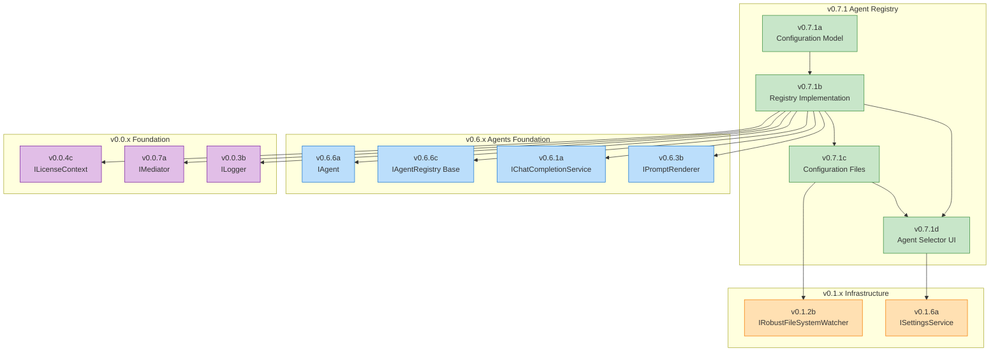
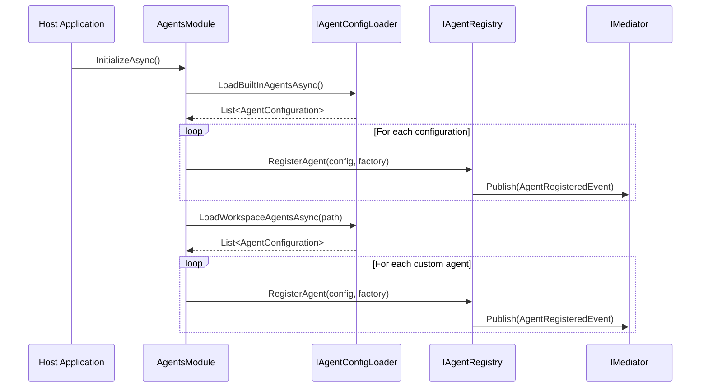
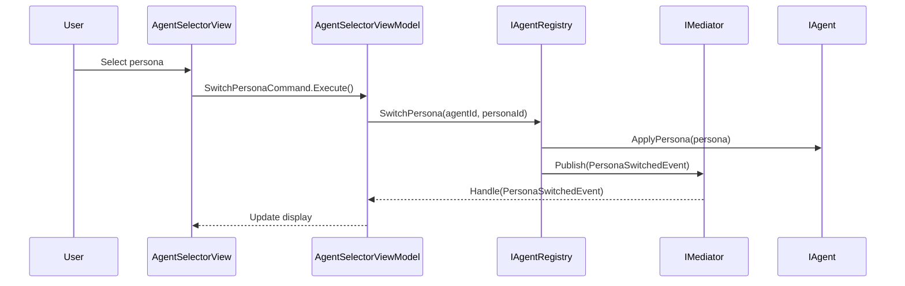
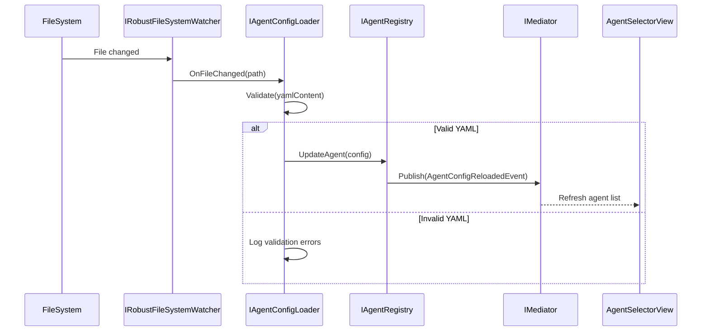
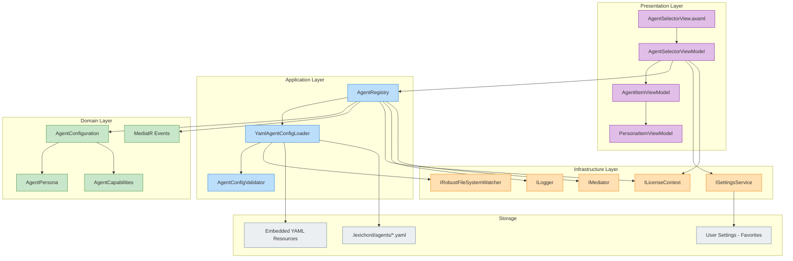

# LCS-DES-071-INDEX: The Agent Registry - Design Specification Index

## Document Control

| Field            | Value                                   |
| :--------------- | :-------------------------------------- |
| **Document ID**  | LCS-DES-071-INDEX                       |
| **Feature ID**   | AGT-071                                 |
| **Version**      | v0.7.1                                  |
| **Module Scope** | Lexichord.Modules.Agents / Abstractions |
| **Swimlane**     | Agents                                  |
| **Codename**     | The Agent Registry                      |
| **License Tier** | Core (base), WriterPro (specialists)    |
| **Feature Gate** | `Feature.AgentRegistry`                 |
| **Status**       | Draft                                   |
| **Last Updated** | 2026-01-28                              |

---

## 1. Overview

### 1.1 Problem Statement

The current agent system (v0.6.6) provides a single, general-purpose Co-pilot agent. Writers need specialized agents that understand specific writing contexts (editing, research, structure analysis), and the ability to switch between agent personalities without losing conversation context.

### 1.2 Solution Summary

Version 0.7.1 introduces the **Agent Registry**, a configuration-driven system that:

1. **Defines Agent Models:** `AgentConfiguration` and `AgentPersona` records establish the data contracts for agent identity, capabilities, and personality variants.

2. **Manages Agent Instances:** Extended `IAgentRegistry` provides singleton caching, runtime persona switching, and assembly scanning for agent discovery.

3. **Supports YAML Configuration:** Agents can be defined via YAML files loaded from embedded resources (built-in) or workspace directories (custom), with hot-reload on file changes.

4. **Provides Agent Selection UI:** An intuitive dropdown in the Co-pilot panel enables agent discovery, persona switching, and favorite management.

### 1.3 Business Value

- **Specialization:** Purpose-built agents deliver better results for specific writing tasks.
- **Personalization:** Persona variants allow writers to adjust agent behavior to their preferences.
- **Extensibility:** Teams can create custom agents tailored to their projects.
- **Monetization:** Tiered access to specialist agents drives subscription upgrades.

---

## 2. Sub-Part Index

| Sub-Part | Document ID  | Title                         | License Tier | Est. Hours |
| :------- | :----------- | :---------------------------- | :----------- | :--------- |
| v0.7.1a  | LCS-DES-071a | Agent Configuration Model     | Core         | 4          |
| v0.7.1b  | LCS-DES-071b | Agent Registry Implementation | Core         | 8          |
| v0.7.1c  | LCS-DES-071c | Agent Configuration Files     | WriterPro    | 10         |
| v0.7.1d  | LCS-DES-071d | Agent Selector UI             | Core         | 12         |

**Total Estimated Effort:** 34 hours

### Sub-Part Links

- [LCS-DES-071a.md](LCS-DES-071a.md) - Agent Configuration Model
- [LCS-DES-071b.md](LCS-DES-071b.md) - Agent Registry Implementation
- [LCS-DES-071c.md](LCS-DES-071c.md) - Agent Configuration Files
- [LCS-DES-071d.md](LCS-DES-071d.md) - Agent Selector UI

---

## 3. Dependency Graph



---

## 4. Interface Summary

### 4.1 New Interfaces

| Interface               | Module         | Purpose                      |
| :---------------------- | :------------- | :--------------------------- |
| `IAgentRegistry` (ext.) | Abstractions   | Agent and persona management |
| `IAgentConfigLoader`    | Modules.Agents | YAML configuration loading   |

### 4.2 New Records

| Record                        | Module         | Purpose                     |
| :---------------------------- | :------------- | :-------------------------- |
| `AgentConfiguration`          | Abstractions   | Agent identity and settings |
| `AgentPersona`                | Abstractions   | Persona variant definition  |
| `AgentConfigValidationResult` | Modules.Agents | YAML validation result      |

### 4.3 New Enums

| Enum                | Module       | Values                                                                                           |
| :------------------ | :----------- | :----------------------------------------------------------------------------------------------- |
| `AgentCapabilities` | Abstractions | None, Chat, DocumentContext, StyleEnforcement, CodeGeneration, ResearchAssistance, Summarization |

### 4.4 New Attributes

| Attribute                  | Module       | Purpose                         |
| :------------------------- | :----------- | :------------------------------ |
| `AgentDefinitionAttribute` | Abstractions | Marks classes for assembly scan |

### 4.5 New MediatR Events

| Event                      | Module       | When Published                 |
| :------------------------- | :----------- | :----------------------------- |
| `AgentRegisteredEvent`     | Abstractions | Agent registered with registry |
| `PersonaSwitchedEvent`     | Abstractions | User switches active persona   |
| `AgentConfigReloadedEvent` | Abstractions | YAML file hot-reloaded         |

---

## 5. Data Flow Overview

### 5.1 Agent Registration Flow



### 5.2 Persona Switching Flow



### 5.3 Configuration Hot-Reload Flow



---

## 6. Architecture Overview



---

## 7. License Gating Strategy

### 7.1 Behavior by Tier

| Tier       | Built-in Agents | Custom Agents | Personas | Features               |
| :--------- | :-------------- | :------------ | :------- | :--------------------- |
| Core       | General Chat    | ❌            | Default  | Basic chat             |
| Writer     | General Chat    | ❌            | Default  | Basic chat             |
| WriterPro  | All specialists | ✅ Read-only  | All      | Full specialist access |
| Teams      | All specialists | ✅ Read/Write | All      | Team agent sharing     |
| Enterprise | All specialists | ✅ Read/Write | All      | SSO + Admin controls   |

### 7.2 Feature Gate Keys

| Feature Gate Key           | Min Tier  | Description                  |
| :------------------------- | :-------- | :--------------------------- |
| `Feature.AgentRegistry`    | Core      | Base registry functionality  |
| `Feature.SpecialistAgents` | WriterPro | Access to specialist agents  |
| `Feature.CustomAgents`     | WriterPro | Load workspace agents (read) |
| `Feature.CustomAgentsEdit` | Teams     | Create/edit workspace agents |
| `Feature.AgentSharing`     | Teams     | Share agents across team     |

---

## 8. DI Registration

```csharp
// Lexichord.Modules.Agents/DependencyInjection.cs
public static class AgentsDependencyInjection
{
    public static IServiceCollection AddAgentRegistry(this IServiceCollection services)
    {
        // Core registry
        services.AddSingleton<IAgentRegistry, AgentRegistry>();

        // Configuration loading
        services.AddSingleton<IAgentConfigLoader, YamlAgentConfigLoader>();
        services.AddSingleton<IAgentConfigValidator, AgentConfigValidator>();

        // ViewModels
        services.AddTransient<AgentSelectorViewModel>();
        services.AddTransient<AgentItemViewModel>();
        services.AddTransient<PersonaItemViewModel>();

        // MediatR handlers
        services.AddTransient<INotificationHandler<AgentRegisteredEvent>,
            AgentRegisteredEventHandler>();
        services.AddTransient<INotificationHandler<PersonaSwitchedEvent>,
            PersonaSwitchedEventHandler>();
        services.AddTransient<INotificationHandler<AgentConfigReloadedEvent>,
            AgentConfigReloadedEventHandler>();

        return services;
    }
}
```

---

## 9. Test Coverage Summary

| Sub-Part | Test Class                    | Test Count | Focus Areas                      |
| :------- | :---------------------------- | :--------- | :------------------------------- |
| v0.7.1a  | `AgentConfigurationTests`     | 8          | Record equality, validation      |
| v0.7.1a  | `AgentPersonaTests`           | 6          | Persona defaults, overrides      |
| v0.7.1a  | `AgentCapabilitiesTests`      | 4          | Flag combinations                |
| v0.7.1b  | `AgentRegistryTests`          | 15         | Registration, caching, switching |
| v0.7.1b  | `AgentDefinitionScannerTests` | 5          | Assembly attribute scanning      |
| v0.7.1c  | `YamlAgentConfigLoaderTests`  | 12         | Parsing, validation, errors      |
| v0.7.1c  | `AgentConfigHotReloadTests`   | 6          | File watcher integration         |
| v0.7.1d  | `AgentSelectorViewModelTests` | 10         | Selection, filtering, favorites  |
| v0.7.1d  | `AgentItemViewModelTests`     | 6          | Tier display, lock state         |

**Total Tests:** 72+  
**Target Coverage:** ≥ 90%

---

## 10. Success Criteria Summary

| Criterion                | Target             | Measurement            |
| :----------------------- | :----------------- | :--------------------- |
| Agent Load Time          | < 100ms            | Performance benchmark  |
| Configuration Validation | 100% schema errors | Unit test suite        |
| Hot Reload Latency       | < 500ms            | Integration test       |
| Agent Discovery Time     | < 50ms             | UI responsiveness test |
| Unit Test Coverage       | ≥ 90%              | Coverage report        |
| Zero Regressions         | 0 failures         | Existing test suite    |

---

## 11. What This Enables

### 11.1 Immediate Dependencies (v0.7.2+)

| Version | Feature               | Uses From v0.7.1                       |
| :------ | :-------------------- | :------------------------------------- |
| v0.7.2  | Task Specialists      | `AgentConfiguration`, `IAgentRegistry` |
| v0.7.3  | Agent Memory          | `AgentPersona` context keys            |
| v0.7.4  | Agent Tools           | `AgentCapabilities` flags              |
| v0.7.5  | Multi-Agent Workflows | Registry + persona switching           |

### 11.2 Long-Term Vision

The Agent Registry establishes the foundation for a rich ecosystem of specialized writing assistants. Future versions will add:

- **Agent Memory:** Persistent context that survives sessions.
- **Agent Tools:** External integrations (web search, database queries).
- **Agent Marketplace:** Community-contributed agent definitions.
- **Multi-Agent Orchestration:** Coordinated workflows across specialists.

---

## 12. Related Documents

### 12.1 Parent Documents

- [LCS-SBD-071.md](LCS-SBD-071.md) - Scope Breakdown Document
- [roadmap-v0.7.x.md](../roadmap-v0.7.x.md) - Version 0.7.x Roadmap

### 12.2 Sub-Part Specifications

- [LCS-DES-071a.md](LCS-DES-071a.md) - Agent Configuration Model
- [LCS-DES-071b.md](LCS-DES-071b.md) - Agent Registry Implementation
- [LCS-DES-071c.md](LCS-DES-071c.md) - Agent Configuration Files
- [LCS-DES-071d.md](LCS-DES-071d.md) - Agent Selector UI

### 12.3 Dependency Documents

- [LCS-DES-066a.md](../../v0.6.x/v0.6.6/LCS-DES-066a.md) - IAgent Interface (v0.6.6a)
- [LCS-DES-066c.md](../../v0.6.x/v0.6.6/LCS-DES-066c.md) - IAgentRegistry Base (v0.6.6c)
- [LCS-DES-061-INDEX.md](../../v0.6.x/v0.6.1/LCS-DES-061-INDEX.md) - Gateway (v0.6.1)

### 12.4 Reference Documents

- [DEPENDENCY-MATRIX.md](../../DEPENDENCY-MATRIX.md) - Interface Registry
- [SUBSCRIPTION_MATRIX.md](../../SUBSCRIPTION_MATRIX.md) - License Tier Reference

---

## Document History

| Version | Date       | Author | Changes       |
| :------ | :--------- | :----- | :------------ |
| 0.1     | 2026-01-28 | System | Initial draft |
