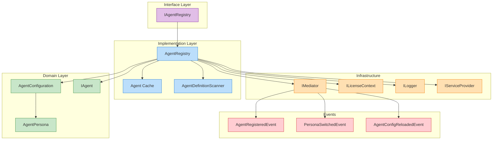
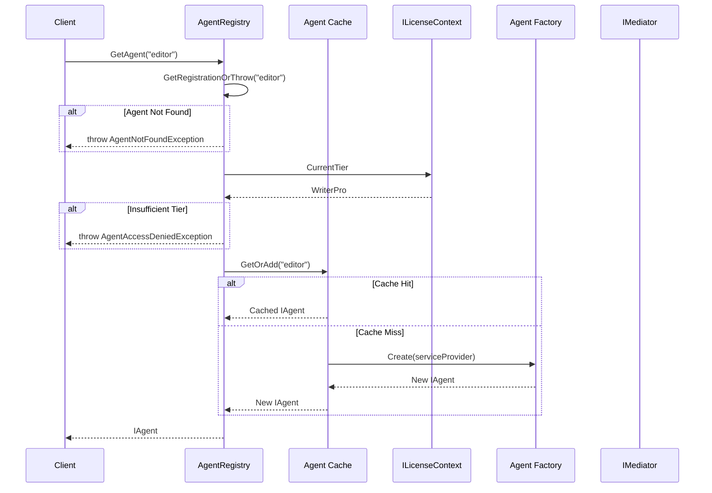
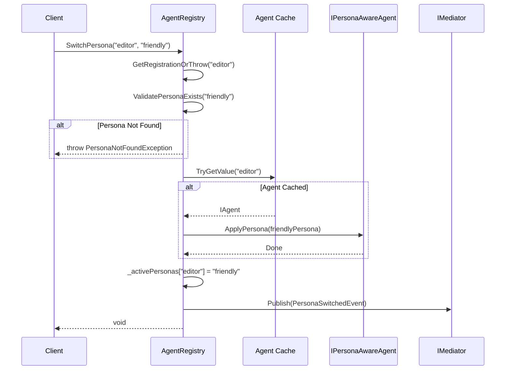

# LCS-DES-071b: Agent Registry Implementation

## 1. Metadata & Categorization

| Field              | Value                                 |
| :----------------- | :------------------------------------ |
| **Document ID**    | LCS-DES-071b                          |
| **Feature ID**     | AGT-071b                              |
| **Feature Name**   | Agent Registry Implementation         |
| **Target Version** | v0.7.1b                               |
| **Module Scope**   | Lexichord.Modules.Agents              |
| **Swimlane**       | Agents                                |
| **License Tier**   | Core (basic), WriterPro (specialists) |
| **Status**         | Draft                                 |
| **Last Updated**   | 2026-01-28                            |

---

## 2. Executive Summary

### 2.1 The Requirement

The base `IAgentRegistry` interface (v0.6.6c) provides simple agent discovery. However, it lacks:

- Persona management and runtime switching
- Singleton caching to avoid repeated agent instantiation
- Assembly scanning for agent discovery at startup
- Event-driven lifecycle notifications

### 2.2 The Proposed Solution

Extend `IAgentRegistry` with comprehensive persona management:

- **Persona-aware agent retrieval:** `GetAgentWithPersona(agentId, personaId)`
- **Runtime persona switching:** Update active persona without recreating agent
- **Singleton caching:** One agent instance per configuration, reused across requests
- **Assembly scanning:** `[AgentDefinition]` attribute for automatic discovery
- **MediatR events:** Notify subscribers of registration and persona changes

---

## 3. Architecture & Modular Strategy

### 3.1 System Architecture Diagram



### 3.2 Dependencies

| Dependency           | Source  | Purpose                        |
| :------------------- | :------ | :----------------------------- |
| `IAgentRegistry`     | v0.6.6c | Base interface (extended here) |
| `IAgent`             | v0.6.6a | Agent contract                 |
| `AgentConfiguration` | v0.7.1a | Configuration data contract    |
| `AgentPersona`       | v0.7.1a | Persona data contract          |
| `ILicenseContext`    | v0.0.4c | License tier validation        |
| `IMediator`          | v0.0.7a | Event publishing               |
| `ILogger<T>`         | v0.0.3b | Structured logging             |

### 3.3 Licensing Behavior

| Tier      | Behavior                                       |
| :-------- | :--------------------------------------------- |
| Core      | Access only to Core-tier agents                |
| Writer    | Access only to Core-tier agents                |
| WriterPro | Access to all specialist agents                |
| Teams+    | Access to all agents + custom workspace agents |

---

## 4. Data Contract (The API)

### 4.1 Extended IAgentRegistry Interface

```csharp
namespace Lexichord.Abstractions.Agents;

/// <summary>
/// Registry for discovering and managing specialized agents and their personas.
/// Extended from v0.6.6c with persona management capabilities.
/// </summary>
public interface IAgentRegistry
{
    /// <summary>
    /// Gets all registered agent configurations.
    /// </summary>
    IReadOnlyList<AgentConfiguration> AvailableAgents { get; }

    /// <summary>
    /// Gets all registered personas across all agents.
    /// </summary>
    IReadOnlyList<AgentPersona> AvailablePersonas { get; }

    /// <summary>
    /// Gets an agent instance using its default persona.
    /// Returns a cached singleton instance.
    /// </summary>
    /// <param name="agentId">The agent identifier.</param>
    /// <returns>The agent instance.</returns>
    /// <exception cref="AgentNotFoundException">Agent ID not found.</exception>
    /// <exception cref="AgentAccessDeniedException">License tier insufficient.</exception>
    IAgent GetAgent(string agentId);

    /// <summary>
    /// Gets an agent instance with a specific persona applied.
    /// </summary>
    /// <param name="agentId">The agent identifier.</param>
    /// <param name="personaId">The persona identifier.</param>
    /// <returns>The agent instance with persona applied.</returns>
    /// <exception cref="AgentNotFoundException">Agent ID not found.</exception>
    /// <exception cref="PersonaNotFoundException">Persona ID not found.</exception>
    /// <exception cref="AgentAccessDeniedException">License tier insufficient.</exception>
    IAgent GetAgentWithPersona(string agentId, string personaId);

    /// <summary>
    /// Registers an agent configuration with its factory function.
    /// </summary>
    /// <param name="config">The agent configuration.</param>
    /// <param name="factory">Factory to create agent instances.</param>
    void RegisterAgent(AgentConfiguration config, Func<IServiceProvider, IAgent> factory);

    /// <summary>
    /// Updates an existing agent configuration (for hot-reload).
    /// </summary>
    /// <param name="config">The updated configuration.</param>
    void UpdateAgent(AgentConfiguration config);

    /// <summary>
    /// Unregisters an agent by ID.
    /// </summary>
    /// <param name="agentId">The agent identifier.</param>
    /// <returns>True if agent was found and removed.</returns>
    bool UnregisterAgent(string agentId);

    /// <summary>
    /// Switches the active persona for a cached agent instance.
    /// </summary>
    /// <param name="agentId">The agent identifier.</param>
    /// <param name="personaId">The new persona identifier.</param>
    /// <exception cref="AgentNotFoundException">Agent ID not found.</exception>
    /// <exception cref="PersonaNotFoundException">Persona ID not found.</exception>
    void SwitchPersona(string agentId, string personaId);

    /// <summary>
    /// Gets the currently active persona for an agent.
    /// </summary>
    /// <param name="agentId">The agent identifier.</param>
    /// <returns>The active persona, or null if using defaults.</returns>
    AgentPersona? GetActivePersona(string agentId);

    /// <summary>
    /// Checks if an agent is accessible with the current license.
    /// </summary>
    /// <param name="agentId">The agent identifier.</param>
    /// <returns>True if accessible.</returns>
    bool CanAccess(string agentId);

    /// <summary>
    /// Gets the configuration for a specific agent.
    /// </summary>
    /// <param name="agentId">The agent identifier.</param>
    /// <returns>The configuration, or null if not found.</returns>
    AgentConfiguration? GetConfiguration(string agentId);
}
```

### 4.2 AgentDefinitionAttribute

```csharp
namespace Lexichord.Abstractions.Agents;

/// <summary>
/// Marks a class as an agent implementation for assembly scanning.
/// The scanner will discover types with this attribute at startup.
/// </summary>
[AttributeUsage(AttributeTargets.Class, AllowMultiple = false, Inherited = false)]
public sealed class AgentDefinitionAttribute : Attribute
{
    /// <summary>
    /// Gets the agent identifier.
    /// </summary>
    public string AgentId { get; }

    /// <summary>
    /// Gets the priority for registration order (lower = earlier).
    /// </summary>
    public int Priority { get; init; } = 100;

    /// <summary>
    /// Initializes a new instance of the <see cref="AgentDefinitionAttribute"/> class.
    /// </summary>
    /// <param name="agentId">The unique agent identifier.</param>
    public AgentDefinitionAttribute(string agentId)
    {
        AgentId = agentId ?? throw new ArgumentNullException(nameof(agentId));
    }
}
```

### 4.3 Exception Types

```csharp
namespace Lexichord.Modules.Agents.Exceptions;

/// <summary>
/// Thrown when an agent ID is not found in the registry.
/// </summary>
public sealed class AgentNotFoundException : Exception
{
    public string AgentId { get; }

    public AgentNotFoundException(string agentId)
        : base($"Agent not found: {agentId}")
    {
        AgentId = agentId;
    }
}

/// <summary>
/// Thrown when a persona ID is not found for an agent.
/// </summary>
public sealed class PersonaNotFoundException : Exception
{
    public string AgentId { get; }
    public string PersonaId { get; }

    public PersonaNotFoundException(string agentId, string personaId)
        : base($"Persona '{personaId}' not found for agent '{agentId}'")
    {
        AgentId = agentId;
        PersonaId = personaId;
    }
}

/// <summary>
/// Thrown when the current license tier is insufficient for an agent.
/// </summary>
public sealed class AgentAccessDeniedException : Exception
{
    public string AgentId { get; }
    public LicenseTier RequiredTier { get; }
    public LicenseTier CurrentTier { get; }

    public AgentAccessDeniedException(string agentId, LicenseTier required, LicenseTier current)
        : base($"Agent '{agentId}' requires {required} tier (current: {current})")
    {
        AgentId = agentId;
        RequiredTier = required;
        CurrentTier = current;
    }
}
```

### 4.4 MediatR Events

```csharp
namespace Lexichord.Abstractions.Agents.Events;

/// <summary>
/// Published when a new agent is registered with the registry.
/// </summary>
public sealed record AgentRegisteredEvent(
    AgentConfiguration Configuration,
    DateTimeOffset RegisteredAt
) : INotification;

/// <summary>
/// Published when a user switches the active persona for an agent.
/// </summary>
public sealed record PersonaSwitchedEvent(
    string AgentId,
    string? PreviousPersonaId,
    string NewPersonaId,
    DateTimeOffset SwitchedAt
) : INotification;

/// <summary>
/// Published when an agent configuration is updated via hot-reload.
/// </summary>
public sealed record AgentConfigReloadedEvent(
    string AgentId,
    AgentConfiguration OldConfiguration,
    AgentConfiguration NewConfiguration,
    DateTimeOffset ReloadedAt
) : INotification;
```

---

## 5. Implementation Logic

### 5.1 AgentRegistry Implementation

```csharp
namespace Lexichord.Modules.Agents;

/// <summary>
/// Central registry for managing agent configurations and instances.
/// </summary>
public sealed class AgentRegistry : IAgentRegistry
{
    private readonly IServiceProvider _serviceProvider;
    private readonly ILicenseContext _licenseContext;
    private readonly IMediator _mediator;
    private readonly ILogger<AgentRegistry> _logger;

    private readonly ConcurrentDictionary<string, AgentRegistration> _registrations = new();
    private readonly ConcurrentDictionary<string, IAgent> _agentCache = new();
    private readonly ConcurrentDictionary<string, string> _activePersonas = new();

    public AgentRegistry(
        IServiceProvider serviceProvider,
        ILicenseContext licenseContext,
        IMediator mediator,
        ILogger<AgentRegistry> logger)
    {
        _serviceProvider = serviceProvider;
        _licenseContext = licenseContext;
        _mediator = mediator;
        _logger = logger;
    }

    public IReadOnlyList<AgentConfiguration> AvailableAgents =>
        _registrations.Values.Select(r => r.Configuration).ToList();

    public IReadOnlyList<AgentPersona> AvailablePersonas =>
        _registrations.Values
            .SelectMany(r => r.Configuration.Personas)
            .ToList();

    public IAgent GetAgent(string agentId)
    {
        _logger.LogDebug("Getting agent: {AgentId}", agentId);

        var registration = GetRegistrationOrThrow(agentId);
        ValidateLicenseAccess(registration.Configuration);

        return GetOrCreateAgent(registration);
    }

    public IAgent GetAgentWithPersona(string agentId, string personaId)
    {
        _logger.LogDebug("Getting agent {AgentId} with persona {PersonaId}", agentId, personaId);

        var registration = GetRegistrationOrThrow(agentId);
        ValidateLicenseAccess(registration.Configuration);
        ValidatePersonaExists(registration.Configuration, personaId);

        var agent = GetOrCreateAgent(registration);
        SwitchPersonaInternal(agentId, personaId, agent);

        return agent;
    }

    public void RegisterAgent(AgentConfiguration config, Func<IServiceProvider, IAgent> factory)
    {
        ArgumentNullException.ThrowIfNull(config);
        ArgumentNullException.ThrowIfNull(factory);

        var errors = config.Validate();
        if (errors.Count > 0)
        {
            throw new InvalidOperationException(
                $"Invalid agent configuration: {string.Join("; ", errors)}");
        }

        var registration = new AgentRegistration(config, factory);
        _registrations[config.AgentId] = registration;

        _logger.LogInformation(
            "Agent registered: {AgentId} with {PersonaCount} personas",
            config.AgentId, config.Personas.Count);

        _mediator.Publish(new AgentRegisteredEvent(config, DateTimeOffset.UtcNow));
    }

    public void UpdateAgent(AgentConfiguration config)
    {
        if (!_registrations.TryGetValue(config.AgentId, out var existing))
        {
            throw new AgentNotFoundException(config.AgentId);
        }

        var errors = config.Validate();
        if (errors.Count > 0)
        {
            _logger.LogWarning(
                "Agent update rejected for {AgentId}: {Errors}",
                config.AgentId, string.Join("; ", errors));
            return;
        }

        // Update registration, keep factory
        var updated = existing with { Configuration = config };
        _registrations[config.AgentId] = updated;

        // Invalidate cached agent to pick up new config
        _agentCache.TryRemove(config.AgentId, out _);

        _logger.LogInformation("Agent updated: {AgentId}", config.AgentId);

        _mediator.Publish(new AgentConfigReloadedEvent(
            config.AgentId,
            existing.Configuration,
            config,
            DateTimeOffset.UtcNow));
    }

    public bool UnregisterAgent(string agentId)
    {
        var removed = _registrations.TryRemove(agentId, out _);
        if (removed)
        {
            _agentCache.TryRemove(agentId, out _);
            _activePersonas.TryRemove(agentId, out _);
            _logger.LogInformation("Agent unregistered: {AgentId}", agentId);
        }
        return removed;
    }

    public void SwitchPersona(string agentId, string personaId)
    {
        var registration = GetRegistrationOrThrow(agentId);
        ValidatePersonaExists(registration.Configuration, personaId);

        if (_agentCache.TryGetValue(agentId, out var agent))
        {
            SwitchPersonaInternal(agentId, personaId, agent);
        }
        else
        {
            // Just record the preference; will be used on next GetAgent
            _activePersonas[agentId] = personaId;
        }
    }

    public AgentPersona? GetActivePersona(string agentId)
    {
        if (!_registrations.TryGetValue(agentId, out var registration))
            return null;

        if (_activePersonas.TryGetValue(agentId, out var personaId))
            return registration.Configuration.GetPersona(personaId);

        return registration.Configuration.DefaultPersona;
    }

    public bool CanAccess(string agentId)
    {
        if (!_registrations.TryGetValue(agentId, out var registration))
            return false;

        return _licenseContext.CurrentTier >= registration.Configuration.RequiredTier;
    }

    public AgentConfiguration? GetConfiguration(string agentId) =>
        _registrations.TryGetValue(agentId, out var reg) ? reg.Configuration : null;

    // Private helpers

    private AgentRegistration GetRegistrationOrThrow(string agentId)
    {
        if (!_registrations.TryGetValue(agentId, out var registration))
            throw new AgentNotFoundException(agentId);
        return registration;
    }

    private void ValidateLicenseAccess(AgentConfiguration config)
    {
        var currentTier = _licenseContext.CurrentTier;
        if (currentTier < config.RequiredTier)
        {
            _logger.LogWarning(
                "Agent access denied: {AgentId} requires {Required}, user has {Current}",
                config.AgentId, config.RequiredTier, currentTier);
            throw new AgentAccessDeniedException(config.AgentId, config.RequiredTier, currentTier);
        }
    }

    private void ValidatePersonaExists(AgentConfiguration config, string personaId)
    {
        if (config.GetPersona(personaId) is null)
            throw new PersonaNotFoundException(config.AgentId, personaId);
    }

    private IAgent GetOrCreateAgent(AgentRegistration registration)
    {
        return _agentCache.GetOrAdd(registration.Configuration.AgentId, _ =>
        {
            _logger.LogDebug("Creating agent instance: {AgentId}", registration.Configuration.AgentId);
            return registration.Factory(_serviceProvider);
        });
    }

    private void SwitchPersonaInternal(string agentId, string personaId, IAgent agent)
    {
        var previousPersonaId = _activePersonas.TryGetValue(agentId, out var prev) ? prev : null;

        if (previousPersonaId == personaId)
            return; // No change

        _activePersonas[agentId] = personaId;

        // Apply persona to agent if it supports runtime switching
        if (agent is IPersonaAwareAgent personaAware)
        {
            var config = _registrations[agentId].Configuration;
            var persona = config.GetPersona(personaId)!;
            personaAware.ApplyPersona(persona);
        }

        _logger.LogInformation(
            "Persona switched: {AgentId} from {Previous} to {New}",
            agentId, previousPersonaId ?? "(default)", personaId);

        _mediator.Publish(new PersonaSwitchedEvent(
            agentId, previousPersonaId, personaId, DateTimeOffset.UtcNow));
    }

    private sealed record AgentRegistration(
        AgentConfiguration Configuration,
        Func<IServiceProvider, IAgent> Factory);
}
```

### 5.2 IPersonaAwareAgent Interface

```csharp
namespace Lexichord.Abstractions.Agents;

/// <summary>
/// Interface for agents that support runtime persona switching.
/// </summary>
public interface IPersonaAwareAgent : IAgent
{
    /// <summary>
    /// Gets the currently active persona.
    /// </summary>
    AgentPersona? ActivePersona { get; }

    /// <summary>
    /// Applies a new persona to this agent instance.
    /// </summary>
    /// <param name="persona">The persona to apply.</param>
    void ApplyPersona(AgentPersona persona);

    /// <summary>
    /// Resets to the default persona.
    /// </summary>
    void ResetToDefaultPersona();
}
```

### 5.3 AgentDefinitionScanner

```csharp
namespace Lexichord.Modules.Agents;

/// <summary>
/// Scans assemblies for types marked with <see cref="AgentDefinitionAttribute"/>.
/// </summary>
public class AgentDefinitionScanner
{
    private readonly ILogger<AgentDefinitionScanner> _logger;

    public AgentDefinitionScanner(ILogger<AgentDefinitionScanner> logger)
    {
        _logger = logger;
    }

    /// <summary>
    /// Scans the specified assemblies for agent definitions.
    /// </summary>
    public IEnumerable<AgentDefinitionInfo> ScanAssemblies(params Assembly[] assemblies)
    {
        foreach (var assembly in assemblies)
        {
            foreach (var type in assembly.GetExportedTypes())
            {
                var attribute = type.GetCustomAttribute<AgentDefinitionAttribute>();
                if (attribute is not null)
                {
                    _logger.LogDebug(
                        "Found agent definition: {AgentId} in {Type}",
                        attribute.AgentId, type.FullName);

                    yield return new AgentDefinitionInfo(
                        attribute.AgentId,
                        type,
                        attribute.Priority);
                }
            }
        }
    }
}

public record AgentDefinitionInfo(string AgentId, Type ImplementationType, int Priority);
```

---

## 6. Flow Diagrams

### 6.1 Agent Retrieval Flow



### 6.2 Persona Switching Flow



---

## 7. Observability & Logging

| Level   | Source        | Message Template                                           |
| :------ | :------------ | :--------------------------------------------------------- |
| Debug   | AgentRegistry | `Getting agent: {AgentId}`                                 |
| Debug   | AgentRegistry | `Getting agent {AgentId} with persona {PersonaId}`         |
| Debug   | AgentRegistry | `Creating agent instance: {AgentId}`                       |
| Info    | AgentRegistry | `Agent registered: {AgentId} with {PersonaCount} personas` |
| Info    | AgentRegistry | `Agent updated: {AgentId}`                                 |
| Info    | AgentRegistry | `Agent unregistered: {AgentId}`                            |
| Info    | AgentRegistry | `Persona switched: {AgentId} from {Previous} to {New}`     |
| Warning | AgentRegistry | `Agent access denied: {AgentId} requires {Required}`       |
| Warning | AgentRegistry | `Agent update rejected for {AgentId}: {Errors}`            |
| Debug   | Scanner       | `Found agent definition: {AgentId} in {Type}`              |

---

## 8. Acceptance Criteria (QA)

| #   | Category          | Criterion                                           |
| :-- | :---------------- | :-------------------------------------------------- |
| 1   | **Registration**  | Valid configurations are accepted                   |
| 2   | **Registration**  | Invalid configurations throw with specific errors   |
| 3   | **Registration**  | Duplicate agent IDs overwrite previous              |
| 4   | **Retrieval**     | GetAgent returns cached singleton                   |
| 5   | **Retrieval**     | Unknown agent ID throws AgentNotFoundException      |
| 6   | **Licensing**     | Insufficient tier throws AgentAccessDeniedException |
| 7   | **Licensing**     | CanAccess returns correct boolean                   |
| 8   | **Personas**      | GetAgentWithPersona applies persona overrides       |
| 9   | **Personas**      | Unknown persona ID throws PersonaNotFoundException  |
| 10  | **Personas**      | SwitchPersona updates cached agent                  |
| 11  | **Personas**      | GetActivePersona returns current selection          |
| 12  | **Events**        | AgentRegisteredEvent published on registration      |
| 13  | **Events**        | PersonaSwitchedEvent published on switch            |
| 14  | **Hot-Reload**    | UpdateAgent invalidates cache                       |
| 15  | **Thread Safety** | Concurrent access is safe                           |

---

## 9. Unit Testing Requirements

### 9.1 AgentRegistry Tests

```csharp
[Trait("Category", "Unit")]
[Trait("Module", "Agents")]
[Trait("SubPart", "v0.7.1b")]
public class AgentRegistryTests
{
    private readonly IServiceProvider _serviceProvider = Substitute.For<IServiceProvider>();
    private readonly ILicenseContext _licenseContext = Substitute.For<ILicenseContext>();
    private readonly IMediator _mediator = Substitute.For<IMediator>();
    private readonly ILogger<AgentRegistry> _logger = Substitute.For<ILogger<AgentRegistry>>();
    private readonly AgentRegistry _registry;

    public AgentRegistryTests()
    {
        _licenseContext.CurrentTier.Returns(LicenseTier.WriterPro);
        _registry = new AgentRegistry(_serviceProvider, _licenseContext, _mediator, _logger);
    }

    [Fact]
    public void RegisterAgent_ValidConfig_AddsToAvailableAgents()
    {
        // Arrange
        var config = CreateValidConfig();

        // Act
        _registry.RegisterAgent(config, sp => Substitute.For<IAgent>());

        // Assert
        _registry.AvailableAgents.Should().Contain(c => c.AgentId == config.AgentId);
    }

    [Fact]
    public void RegisterAgent_InvalidConfig_ThrowsInvalidOperation()
    {
        // Arrange
        var config = CreateValidConfig() with { AgentId = "" }; // Invalid

        // Act
        var act = () => _registry.RegisterAgent(config, sp => Substitute.For<IAgent>());

        // Assert
        act.Should().Throw<InvalidOperationException>();
    }

    [Fact]
    public async Task RegisterAgent_PublishesAgentRegisteredEvent()
    {
        // Arrange
        var config = CreateValidConfig();

        // Act
        _registry.RegisterAgent(config, sp => Substitute.For<IAgent>());

        // Assert
        await _mediator.Received(1).Publish(
            Arg.Is<AgentRegisteredEvent>(e => e.Configuration.AgentId == config.AgentId),
            Arg.Any<CancellationToken>());
    }

    [Fact]
    public void GetAgent_RegisteredAgent_ReturnsCachedInstance()
    {
        // Arrange
        var config = CreateValidConfig();
        var mockAgent = Substitute.For<IAgent>();
        _registry.RegisterAgent(config, sp => mockAgent);

        // Act
        var agent1 = _registry.GetAgent(config.AgentId);
        var agent2 = _registry.GetAgent(config.AgentId);

        // Assert
        agent1.Should().BeSameAs(agent2); // Same instance
        agent1.Should().BeSameAs(mockAgent);
    }

    [Fact]
    public void GetAgent_UnknownAgentId_ThrowsAgentNotFoundException()
    {
        // Act
        var act = () => _registry.GetAgent("nonexistent");

        // Assert
        act.Should().Throw<AgentNotFoundException>()
            .Which.AgentId.Should().Be("nonexistent");
    }

    [Fact]
    public void GetAgent_InsufficientLicense_ThrowsAgentAccessDeniedException()
    {
        // Arrange
        _licenseContext.CurrentTier.Returns(LicenseTier.Core);
        var config = CreateValidConfig() with { RequiredTier = LicenseTier.WriterPro };
        _registry.RegisterAgent(config, sp => Substitute.For<IAgent>());

        // Act
        var act = () => _registry.GetAgent(config.AgentId);

        // Assert
        act.Should().Throw<AgentAccessDeniedException>()
            .Which.RequiredTier.Should().Be(LicenseTier.WriterPro);
    }

    [Fact]
    public void GetAgentWithPersona_ValidPersona_AppliesPersona()
    {
        // Arrange
        var config = CreateValidConfig();
        var mockAgent = Substitute.For<IPersonaAwareAgent>();
        _registry.RegisterAgent(config, sp => mockAgent);

        // Act
        var agent = _registry.GetAgentWithPersona(config.AgentId, "friendly");

        // Assert
        mockAgent.Received(1).ApplyPersona(
            Arg.Is<AgentPersona>(p => p.PersonaId == "friendly"));
    }

    [Fact]
    public void GetAgentWithPersona_UnknownPersona_ThrowsPersonaNotFoundException()
    {
        // Arrange
        var config = CreateValidConfig();
        _registry.RegisterAgent(config, sp => Substitute.For<IAgent>());

        // Act
        var act = () => _registry.GetAgentWithPersona(config.AgentId, "nonexistent");

        // Assert
        act.Should().Throw<PersonaNotFoundException>()
            .Which.PersonaId.Should().Be("nonexistent");
    }

    [Fact]
    public async Task SwitchPersona_PublishesPersonaSwitchedEvent()
    {
        // Arrange
        var config = CreateValidConfig();
        _registry.RegisterAgent(config, sp => Substitute.For<IAgent>());
        _registry.GetAgent(config.AgentId); // Create cached instance

        // Act
        _registry.SwitchPersona(config.AgentId, "friendly");

        // Assert
        await _mediator.Received(1).Publish(
            Arg.Is<PersonaSwitchedEvent>(e =>
                e.AgentId == config.AgentId &&
                e.NewPersonaId == "friendly"),
            Arg.Any<CancellationToken>());
    }

    [Fact]
    public void CanAccess_SufficientTier_ReturnsTrue()
    {
        // Arrange
        _licenseContext.CurrentTier.Returns(LicenseTier.WriterPro);
        var config = CreateValidConfig() with { RequiredTier = LicenseTier.WriterPro };
        _registry.RegisterAgent(config, sp => Substitute.For<IAgent>());

        // Act
        var canAccess = _registry.CanAccess(config.AgentId);

        // Assert
        canAccess.Should().BeTrue();
    }

    [Fact]
    public void CanAccess_InsufficientTier_ReturnsFalse()
    {
        // Arrange
        _licenseContext.CurrentTier.Returns(LicenseTier.Core);
        var config = CreateValidConfig() with { RequiredTier = LicenseTier.WriterPro };
        _registry.RegisterAgent(config, sp => Substitute.For<IAgent>());

        // Act
        var canAccess = _registry.CanAccess(config.AgentId);

        // Assert
        canAccess.Should().BeFalse();
    }

    [Fact]
    public void UpdateAgent_InvalidatesCache()
    {
        // Arrange
        var config = CreateValidConfig();
        var agent1 = Substitute.For<IAgent>();
        var agent2 = Substitute.For<IAgent>();
        var callCount = 0;
        _registry.RegisterAgent(config, sp => callCount++ == 0 ? agent1 : agent2);
        _registry.GetAgent(config.AgentId); // Cache agent1

        // Act
        _registry.UpdateAgent(config with { Name = "Updated Name" });
        var newAgent = _registry.GetAgent(config.AgentId);

        // Assert
        newAgent.Should().BeSameAs(agent2); // New instance created
    }

    [Fact]
    public void UnregisterAgent_RemovesFromRegistry()
    {
        // Arrange
        var config = CreateValidConfig();
        _registry.RegisterAgent(config, sp => Substitute.For<IAgent>());

        // Act
        var removed = _registry.UnregisterAgent(config.AgentId);

        // Assert
        removed.Should().BeTrue();
        _registry.AvailableAgents.Should().NotContain(c => c.AgentId == config.AgentId);
    }

    private static AgentConfiguration CreateValidConfig() =>
        new(
            AgentId: "test-agent",
            Name: "Test Agent",
            Description: "A test agent",
            Icon: "test-icon",
            TemplateId: "test-template",
            Capabilities: AgentCapabilities.Chat,
            DefaultOptions: new ChatOptions { Model = "gpt-4o", Temperature = 0.5f, MaxTokens = 1024 },
            Personas:
            [
                new AgentPersona("strict", "Strict", "Tag", null, 0.1f),
                new AgentPersona("friendly", "Friendly", "Tag", null, 0.5f)
            ],
            RequiredTier: LicenseTier.WriterPro
        );
}
```

---

## 10. DI Registration

```csharp
// Lexichord.Modules.Agents/DependencyInjection.cs
public static class AgentRegistryDependencyInjection
{
    public static IServiceCollection AddAgentRegistry(this IServiceCollection services)
    {
        // Core registry - singleton for application lifetime
        services.AddSingleton<IAgentRegistry, AgentRegistry>();

        // Scanner for assembly discovery
        services.AddSingleton<AgentDefinitionScanner>();

        return services;
    }
}
```

---

## 11. Deliverable Checklist

| #   | Deliverable                      | Status |
| :-- | :------------------------------- | :----- |
| 1   | `IAgentRegistry.cs` (extended)   | [ ]    |
| 2   | `AgentRegistry.cs`               | [ ]    |
| 3   | `IPersonaAwareAgent.cs`          | [ ]    |
| 4   | `AgentDefinitionAttribute.cs`    | [ ]    |
| 5   | `AgentDefinitionScanner.cs`      | [ ]    |
| 6   | `AgentNotFoundException.cs`      | [ ]    |
| 7   | `PersonaNotFoundException.cs`    | [ ]    |
| 8   | `AgentAccessDeniedException.cs`  | [ ]    |
| 9   | `AgentRegisteredEvent.cs`        | [ ]    |
| 10  | `PersonaSwitchedEvent.cs`        | [ ]    |
| 11  | `AgentConfigReloadedEvent.cs`    | [ ]    |
| 12  | `AgentRegistryTests.cs`          | [ ]    |
| 13  | `AgentDefinitionScannerTests.cs` | [ ]    |

---

## 12. Changelog Entry

```markdown
## [0.7.1b] - 2026-XX-XX

### Added

- Extended `IAgentRegistry` interface with persona management
    - Methods: GetAgentWithPersona(), SwitchPersona(), GetActivePersona(), CanAccess(), UpdateAgent(), UnregisterAgent()
- `AgentRegistry` implementation
    - Singleton agent caching with concurrent access
    - Runtime persona switching without recreation
    - License tier validation
    - MediatR event publishing

- `IPersonaAwareAgent` interface for runtime persona support

- `AgentDefinitionAttribute` for assembly scanning

- `AgentDefinitionScanner` for startup discovery

- Exception types: AgentNotFoundException, PersonaNotFoundException, AgentAccessDeniedException

- MediatR events: AgentRegisteredEvent, PersonaSwitchedEvent, AgentConfigReloadedEvent
```

---

## Related Documents

- [LCS-DES-071-INDEX.md](LCS-DES-071-INDEX.md) - Design Specification Index
- [LCS-DES-071a.md](LCS-DES-071a.md) - Agent Configuration Model
- [LCS-DES-071c.md](LCS-DES-071c.md) - Agent Configuration Files
- [LCS-SBD-071.md](LCS-SBD-071.md) - Scope Breakdown Document
