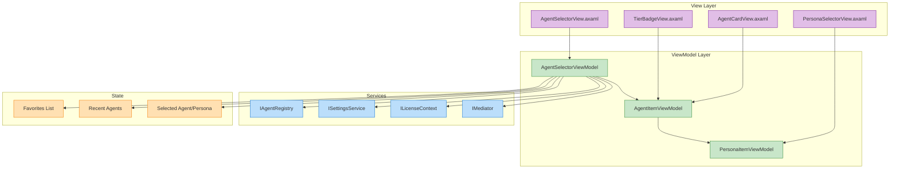

# LCS-DES-071d: Agent Selector UI

## 1. Metadata & Categorization

| Field              | Value                                 |
| :----------------- | :------------------------------------ |
| **Document ID**    | LCS-DES-071d                          |
| **Feature ID**     | AGT-071d                              |
| **Feature Name**   | Agent Selector UI                     |
| **Target Version** | v0.7.1d                               |
| **Module Scope**   | Lexichord.Modules.Agents.Views        |
| **Swimlane**       | Agents                                |
| **License Tier**   | Core (basic), WriterPro (specialists) |
| **Status**         | Draft                                 |
| **Last Updated**   | 2026-01-28                            |

---

## 2. Executive Summary

### 2.1 The Requirement

Writers need an intuitive way to:

- Discover available agents and their capabilities
- Switch between agents without losing conversation context
- Select personas within an agent
- See at a glance which agents require upgrades
- Manage a list of favorite agents for quick access

### 2.2 The Proposed Solution

Create an elegant Agent Selector UI component that integrates into the Co-pilot panel:

- **Dropdown-based selection** with search and filtering
- **Visual agent cards** showing icon, name, description, and capabilities
- **Persona submenu** for quick personality switching
- **Tier badges** showing license requirements
- **Favorites management** with drag-and-drop reordering
- **Accessibility** with full keyboard navigation and screen reader support

---

## 3. Architecture & Modular Strategy

### 3.1 System Architecture Diagram



### 3.2 Dependencies

| Dependency         | Source  | Purpose                           |
| :----------------- | :------ | :-------------------------------- |
| `IAgentRegistry`   | v0.7.1b | Agent and persona retrieval       |
| `ISettingsService` | v0.1.6a | Persist favorites and preferences |
| `ILicenseContext`  | v0.0.4c | Tier display and access control   |
| `IMediator`        | v0.0.7a | Event subscription                |
| `CommunityToolkit` | NuGet   | MVVM infrastructure               |

### 3.3 Licensing Behavior

| Tier      | Available Agents         | Features                       |
| :-------- | :----------------------- | :----------------------------- |
| Core      | General Chat only        | Basic selection                |
| Writer    | General Chat only        | Basic selection                |
| WriterPro | All built-in specialists | Personas, favorites, filtering |
| Teams+    | All + custom workspace   | Full feature set               |

---

## 4. Data Contract (The API)

### 4.1 AgentSelectorViewModel

```csharp
namespace Lexichord.Modules.Agents.ViewModels;

/// <summary>
/// ViewModel for the Agent Selector dropdown component.
/// </summary>
public sealed partial class AgentSelectorViewModel : ViewModelBase,
    IRecipient<AgentRegisteredEvent>,
    IRecipient<PersonaSwitchedEvent>,
    IRecipient<AgentConfigReloadedEvent>
{
    private readonly IAgentRegistry _registry;
    private readonly ISettingsService _settings;
    private readonly ILicenseContext _licenseContext;
    private readonly IMediator _mediator;
    private readonly ILogger<AgentSelectorViewModel> _logger;

    [ObservableProperty]
    [NotifyPropertyChangedFor(nameof(FilteredAgents))]
    private string _searchQuery = "";

    [ObservableProperty]
    private AgentItemViewModel? _selectedAgent;

    [ObservableProperty]
    private PersonaItemViewModel? _selectedPersona;

    [ObservableProperty]
    private bool _isDropdownOpen;

    [ObservableProperty]
    private bool _isLoading = true;

    [ObservableProperty]
    private string? _errorMessage;

    public ObservableCollection<AgentItemViewModel> AllAgents { get; } = [];
    public ObservableCollection<AgentItemViewModel> FavoriteAgents { get; } = [];
    public ObservableCollection<AgentItemViewModel> RecentAgents { get; } = [];

    public IEnumerable<AgentItemViewModel> FilteredAgents =>
        string.IsNullOrWhiteSpace(SearchQuery)
            ? AllAgents
            : AllAgents.Where(a =>
                a.Name.Contains(SearchQuery, StringComparison.OrdinalIgnoreCase) ||
                a.Description.Contains(SearchQuery, StringComparison.OrdinalIgnoreCase));

    public bool HasFavorites => FavoriteAgents.Count > 0;
    public bool HasRecentAgents => RecentAgents.Count > 0;
    public bool CanAccessSpecialists => _licenseContext.CurrentTier >= LicenseTier.WriterPro;

    public AgentSelectorViewModel(
        IAgentRegistry registry,
        ISettingsService settings,
        ILicenseContext licenseContext,
        IMediator mediator,
        ILogger<AgentSelectorViewModel> logger)
    {
        _registry = registry;
        _settings = settings;
        _licenseContext = licenseContext;
        _mediator = mediator;
        _logger = logger;

        // Subscribe to MediatR notifications
        mediator.RegisterAll(this);
    }

    [RelayCommand]
    private async Task InitializeAsync()
    {
        try
        {
            IsLoading = true;
            ErrorMessage = null;

            await LoadAgentsAsync();
            await LoadFavoritesAsync();
            await LoadRecentAsync();

            // Select last used agent or default
            var lastAgentId = await _settings.GetAsync<string>("agent.last_used");
            var lastPersonaId = await _settings.GetAsync<string>("agent.last_persona");

            if (!string.IsNullOrEmpty(lastAgentId))
            {
                var agent = AllAgents.FirstOrDefault(a => a.AgentId == lastAgentId);
                if (agent is not null)
                {
                    await SelectAgentAsync(agent, lastPersonaId);
                    return;
                }
            }

            // Fall back to first available agent
            var defaultAgent = AllAgents.FirstOrDefault(a => a.CanAccess);
            if (defaultAgent is not null)
            {
                await SelectAgentAsync(defaultAgent);
            }
        }
        catch (Exception ex)
        {
            _logger.LogError(ex, "Failed to initialize agent selector");
            ErrorMessage = "Failed to load agents. Please try again.";
        }
        finally
        {
            IsLoading = false;
        }
    }

    [RelayCommand]
    private async Task SelectAgentAsync(AgentItemViewModel agent, string? personaId = null)
    {
        if (!agent.CanAccess)
        {
            _logger.LogDebug("Agent {AgentId} not accessible, showing upgrade prompt", agent.AgentId);
            await ShowUpgradePromptAsync(agent);
            return;
        }

        _logger.LogDebug("Selecting agent: {AgentId}", agent.AgentId);

        SelectedAgent = agent;

        // Select persona
        var persona = personaId is not null
            ? agent.Personas.FirstOrDefault(p => p.PersonaId == personaId)
            : agent.DefaultPersona;

        if (persona is not null)
        {
            await SelectPersonaAsync(persona);
        }

        // Update recents
        await UpdateRecentAgentsAsync(agent);

        // Persist selection
        await _settings.SetAsync("agent.last_used", agent.AgentId);

        IsDropdownOpen = false;

        _logger.LogInformation("Agent selected: {AgentId}", agent.AgentId);
    }

    [RelayCommand]
    private async Task SelectPersonaAsync(PersonaItemViewModel persona)
    {
        if (SelectedAgent is null) return;

        _logger.LogDebug("Selecting persona: {PersonaId} for {AgentId}",
            persona.PersonaId, SelectedAgent.AgentId);

        // Update registry
        _registry.SwitchPersona(SelectedAgent.AgentId, persona.PersonaId);

        SelectedPersona = persona;

        // Update UI state
        foreach (var p in SelectedAgent.Personas)
        {
            p.IsSelected = p.PersonaId == persona.PersonaId;
        }

        // Persist selection
        await _settings.SetAsync("agent.last_persona", persona.PersonaId);

        _logger.LogInformation("Persona selected: {PersonaId}", persona.PersonaId);
    }

    [RelayCommand]
    private async Task ToggleFavoriteAsync(AgentItemViewModel agent)
    {
        agent.IsFavorite = !agent.IsFavorite;

        if (agent.IsFavorite)
        {
            FavoriteAgents.Add(agent);
            _logger.LogDebug("Added {AgentId} to favorites", agent.AgentId);
        }
        else
        {
            FavoriteAgents.Remove(agent);
            _logger.LogDebug("Removed {AgentId} from favorites", agent.AgentId);
        }

        await SaveFavoritesAsync();
        OnPropertyChanged(nameof(HasFavorites));
    }

    [RelayCommand]
    private void ToggleDropdown()
    {
        IsDropdownOpen = !IsDropdownOpen;

        if (IsDropdownOpen)
        {
            SearchQuery = "";
        }
    }

    [RelayCommand]
    private void CloseDropdown()
    {
        IsDropdownOpen = false;
        SearchQuery = "";
    }

    // Event handlers
    public void Receive(AgentRegisteredEvent message)
    {
        _logger.LogDebug("Agent registered: {AgentId}", message.Configuration.AgentId);

        Dispatcher.UIThread.InvokeAsync(() =>
        {
            var vm = CreateAgentViewModel(message.Configuration);
            AllAgents.Add(vm);
        });
    }

    public void Receive(PersonaSwitchedEvent message)
    {
        _logger.LogDebug("Persona switched: {AgentId} -> {PersonaId}",
            message.AgentId, message.NewPersonaId);

        if (SelectedAgent?.AgentId == message.AgentId)
        {
            var persona = SelectedAgent.Personas
                .FirstOrDefault(p => p.PersonaId == message.NewPersonaId);
            if (persona is not null)
            {
                SelectedPersona = persona;
            }
        }
    }

    public void Receive(AgentConfigReloadedEvent message)
    {
        _logger.LogDebug("Agent config reloaded: {AgentId}", message.AgentId);

        Dispatcher.UIThread.InvokeAsync(async () =>
        {
            var existing = AllAgents.FirstOrDefault(a => a.AgentId == message.AgentId);
            if (existing is not null)
            {
                var index = AllAgents.IndexOf(existing);
                AllAgents.RemoveAt(index);
                AllAgents.Insert(index, CreateAgentViewModel(message.NewConfiguration));
            }
        });
    }

    // Private helpers

    private async Task LoadAgentsAsync()
    {
        var configs = _registry.AvailableAgents;

        foreach (var config in configs.OrderBy(c => c.Name))
        {
            var vm = CreateAgentViewModel(config);
            AllAgents.Add(vm);
        }

        _logger.LogDebug("Loaded {Count} agents", AllAgents.Count);
    }

    private AgentItemViewModel CreateAgentViewModel(AgentConfiguration config)
    {
        var canAccess = _registry.CanAccess(config.AgentId);

        var personas = config.Personas
            .Select(p => new PersonaItemViewModel
            {
                PersonaId = p.PersonaId,
                DisplayName = p.DisplayName,
                Tagline = p.Tagline,
                VoiceDescription = p.VoiceDescription,
                Temperature = p.Temperature,
                IsSelected = false
            })
            .ToList();

        return new AgentItemViewModel
        {
            AgentId = config.AgentId,
            Name = config.Name,
            Description = config.Description,
            Icon = config.Icon,
            Capabilities = config.Capabilities,
            RequiredTier = config.RequiredTier,
            CanAccess = canAccess,
            Personas = new ObservableCollection<PersonaItemViewModel>(personas),
            IsFavorite = false
        };
    }

    private async Task LoadFavoritesAsync()
    {
        var favoriteIds = await _settings.GetAsync<List<string>>("agent.favorites") ?? [];

        foreach (var id in favoriteIds)
        {
            var agent = AllAgents.FirstOrDefault(a => a.AgentId == id);
            if (agent is not null)
            {
                agent.IsFavorite = true;
                FavoriteAgents.Add(agent);
            }
        }

        OnPropertyChanged(nameof(HasFavorites));
    }

    private async Task SaveFavoritesAsync()
    {
        var favoriteIds = FavoriteAgents.Select(a => a.AgentId).ToList();
        await _settings.SetAsync("agent.favorites", favoriteIds);
    }

    private async Task LoadRecentAsync()
    {
        var recentIds = await _settings.GetAsync<List<string>>("agent.recent") ?? [];

        foreach (var id in recentIds.Take(5))
        {
            var agent = AllAgents.FirstOrDefault(a => a.AgentId == id);
            if (agent is not null)
            {
                RecentAgents.Add(agent);
            }
        }

        OnPropertyChanged(nameof(HasRecentAgents));
    }

    private async Task UpdateRecentAgentsAsync(AgentItemViewModel agent)
    {
        // Remove if already in list
        RecentAgents.Remove(agent);

        // Insert at front
        RecentAgents.Insert(0, agent);

        // Trim to max 5
        while (RecentAgents.Count > 5)
        {
            RecentAgents.RemoveAt(RecentAgents.Count - 1);
        }

        var recentIds = RecentAgents.Select(a => a.AgentId).ToList();
        await _settings.SetAsync("agent.recent", recentIds);

        OnPropertyChanged(nameof(HasRecentAgents));
    }

    private async Task ShowUpgradePromptAsync(AgentItemViewModel agent)
    {
        // Publish event for upgrade prompt dialog
        await _mediator.Publish(new ShowUpgradePromptRequest(
            Feature: $"agent:{agent.AgentId}",
            RequiredTier: agent.RequiredTier,
            Message: $"'{agent.Name}' requires {agent.RequiredTier} tier."
        ));
    }
}
```

### 4.2 AgentItemViewModel

```csharp
namespace Lexichord.Modules.Agents.ViewModels;

/// <summary>
/// ViewModel for an individual agent in the selector list.
/// </summary>
public sealed partial class AgentItemViewModel : ObservableObject
{
    [ObservableProperty]
    private string _agentId = "";

    [ObservableProperty]
    private string _name = "";

    [ObservableProperty]
    private string _description = "";

    [ObservableProperty]
    private string _icon = "";

    [ObservableProperty]
    private AgentCapabilities _capabilities;

    [ObservableProperty]
    private LicenseTier _requiredTier;

    [ObservableProperty]
    private bool _canAccess;

    [ObservableProperty]
    private bool _isFavorite;

    [ObservableProperty]
    private bool _isSelected;

    public ObservableCollection<PersonaItemViewModel> Personas { get; set; } = [];

    public PersonaItemViewModel? DefaultPersona => Personas.Count > 0 ? Personas[0] : null;

    public string TierBadgeText => RequiredTier switch
    {
        LicenseTier.Core => "",
        LicenseTier.Writer => "Writer",
        LicenseTier.WriterPro => "Pro",
        LicenseTier.Teams => "Teams",
        LicenseTier.Enterprise => "Enterprise",
        _ => ""
    };

    public bool ShowTierBadge => RequiredTier > LicenseTier.Core;

    public bool IsLocked => !CanAccess && RequiredTier > LicenseTier.Core;

    public string CapabilitiesSummary => Capabilities.ToDisplayString();

    public string AccessibilityLabel =>
        $"{Name}. {Description}. " +
        (IsLocked ? $"Requires {RequiredTier} tier." : "") +
        (IsFavorite ? "Favorited." : "");
}
```

### 4.3 PersonaItemViewModel

```csharp
namespace Lexichord.Modules.Agents.ViewModels;

/// <summary>
/// ViewModel for a persona option within an agent.
/// </summary>
public sealed partial class PersonaItemViewModel : ObservableObject
{
    [ObservableProperty]
    private string _personaId = "";

    [ObservableProperty]
    private string _displayName = "";

    [ObservableProperty]
    private string _tagline = "";

    [ObservableProperty]
    private string? _voiceDescription;

    [ObservableProperty]
    private float _temperature;

    [ObservableProperty]
    private bool _isSelected;

    public string TemperatureLabel => Temperature switch
    {
        < 0.3f => "Focused",
        < 0.6f => "Balanced",
        < 0.9f => "Creative",
        _ => "Experimental"
    };

    public string AccessibilityLabel =>
        $"{DisplayName}. {Tagline}. {TemperatureLabel} mode." +
        (IsSelected ? "Currently selected." : "");
}
```

---

## 5. UI/UX Specifications

### 5.1 Visual Design

```
┌──────────────────────────────────────────────────────────────────┐
│ Co-pilot Panel Header                                            │
├──────────────────────────────────────────────────────────────────┤
│ ┌──────────────────────────────────────────────────────────────┐ │
│ │ 📝 The Editor ▾        [Strict Mode] ⭐                      │ │
│ ├──────────────────────────────────────────────────────────────┤ │
│ │ 🔍 Search agents...                                          │ │
│ ├──────────────────────────────────────────────────────────────┤ │
│ │ ⭐ FAVORITES                                                  │ │
│ │ ├─────────────────────────────────────────────────────────── │ │
│ │ │ 📝 The Editor                              [Pro]  ⭐ ✓     │ │
│ │ │    Grammar, clarity, and structure                         │ │
│ │ ├─────────────────────────────────────────────────────────── │ │
│ │ │ 🔍 The Researcher                          [Pro]  ⭐       │ │
│ │ │    Research and citation assistance                        │ │
│ │ ├──────────────────────────────────────────────────────────┤ │
│ │ RECENT                                                        │ │
│ │ ├─────────────────────────────────────────────────────────── │ │
│ │ │ 💬 General Chat                                   ☆       │ │
│ │ │    Versatile writing companion                             │ │
│ │ ├──────────────────────────────────────────────────────────┤ │
│ │ ALL AGENTS                                                    │ │
│ │ ├─────────────────────────────────────────────────────────── │ │
│ │ │ 📚 The Storyteller                         [Pro]  ☆  🔒   │ │
│ │ │    Creative fiction partner                                │ │
│ │ │    ⚠️ Requires WriterPro – Upgrade                         │ │
│ └──────────────────────────────────────────────────────────────┘ │
│                                                                   │
│ ┌──────────────────────────────────────────────────────────────┐ │
│ │ PERSONAS                                                      │ │
│ │ ├─────────────────────────────────────────────────────────── │ │
│ │ │ ● Strict Mode         "No errors escape"        Focused    │ │
│ │ │ ○ Friendly Mode       "Gentle suggestions"      Balanced   │ │
│ └──────────────────────────────────────────────────────────────┘ │
└──────────────────────────────────────────────────────────────────┘
```

### 5.2 Component States

| State                | Visual Indicator                             |
| :------------------- | :------------------------------------------- |
| **Loading**          | Skeleton placeholders with shimmer animation |
| **Normal**           | Full agent list with icons and descriptions  |
| **Selected**         | Highlighted background, checkmark indicator  |
| **Favorite**         | Filled star icon (⭐)                        |
| **Not Favorite**     | Outline star icon (☆)                        |
| **Locked (No Tier)** | Grayed out, lock icon (🔒), upgrade CTA      |
| **Hover**            | Subtle background highlight, elevated shadow |
| **Focus**            | Visible focus ring for keyboard navigation   |
| **Error**            | Red border, error message banner             |

### 5.3 Animations

| Trigger          | Animation                                    |
| :--------------- | :------------------------------------------- |
| Dropdown open    | Slide down with fade in (200ms ease-out)     |
| Dropdown close   | Slide up with fade out (150ms ease-in)       |
| Agent selection  | Smooth background color transition (100ms)   |
| Favorite toggle  | Star pop animation with scale (300ms spring) |
| Persona switch   | Radio button fill with ripple effect (150ms) |
| Tier badge hover | Tooltip fade in (200ms delay, 150ms fade)    |

---

## 6. AXAML Implementation

### 6.1 AgentSelectorView.axaml

```xml
<UserControl xmlns="https://github.com/avaloniaui"
             xmlns:x="http://schemas.microsoft.com/winfx/2006/xaml"
             xmlns:vm="using:Lexichord.Modules.Agents.ViewModels"
             xmlns:views="using:Lexichord.Modules.Agents.Views"
             x:Class="Lexichord.Modules.Agents.Views.AgentSelectorView"
             x:DataType="vm:AgentSelectorViewModel">

    <UserControl.Styles>
        <Style Selector="Border.dropdown-trigger">
            <Setter Property="Background" Value="{DynamicResource SurfaceBrush}"/>
            <Setter Property="BorderBrush" Value="{DynamicResource BorderBrush}"/>
            <Setter Property="BorderThickness" Value="1"/>
            <Setter Property="CornerRadius" Value="8"/>
            <Setter Property="Padding" Value="12,8"/>
            <Setter Property="Cursor" Value="Hand"/>
        </Style>

        <Style Selector="Border.dropdown-trigger:pointerover">
            <Setter Property="Background" Value="{DynamicResource SurfaceHoverBrush}"/>
        </Style>
    </UserControl.Styles>

    <Grid RowDefinitions="Auto,Auto">
        <!-- Trigger Button -->
        <Border Grid.Row="0"
                Classes="dropdown-trigger"
                PointerPressed="OnTriggerPressed">
            <Grid ColumnDefinitions="Auto,*,Auto,Auto">
                <!-- Agent Icon -->
                <PathIcon Grid.Column="0"
                          Data="{Binding SelectedAgent.Icon, Converter={StaticResource LucideIconConverter}}"
                          Width="20" Height="20"
                          Foreground="{DynamicResource PrimaryBrush}"/>

                <!-- Agent Name + Persona -->
                <StackPanel Grid.Column="1" Margin="12,0" VerticalAlignment="Center">
                    <TextBlock Text="{Binding SelectedAgent.Name}"
                               FontWeight="SemiBold"
                               FontSize="14"/>
                    <TextBlock Text="{Binding SelectedPersona.DisplayName}"
                               FontSize="12"
                               Foreground="{DynamicResource SecondaryTextBrush}"
                               IsVisible="{Binding SelectedPersona, Converter={x:Static ObjectConverters.IsNotNull}}"/>
                </StackPanel>

                <!-- Favorite Star -->
                <Button Grid.Column="2"
                        Command="{Binding ToggleFavoriteCommand}"
                        CommandParameter="{Binding SelectedAgent}"
                        Classes="icon-button"
                        ToolTip.Tip="Toggle Favorite"
                        IsVisible="{Binding SelectedAgent, Converter={x:Static ObjectConverters.IsNotNull}}">
                    <PathIcon Data="{Binding SelectedAgent.IsFavorite, Converter={StaticResource FavoriteIconConverter}}"
                              Width="16" Height="16"/>
                </Button>

                <!-- Dropdown Arrow -->
                <PathIcon Grid.Column="3"
                          Data="{StaticResource ChevronDown}"
                          Width="16" Height="16"
                          Margin="8,0,0,0"
                          RenderTransform="{Binding IsDropdownOpen, Converter={StaticResource DropdownRotateConverter}}">
                    <PathIcon.Transitions>
                        <Transitions>
                            <TransformOperationsTransition Property="RenderTransform" Duration="0:0:0.2"/>
                        </Transitions>
                    </PathIcon.Transitions>
                </PathIcon>
            </Grid>
        </Border>

        <!-- Dropdown Popup -->
        <Popup Grid.Row="1"
               IsOpen="{Binding IsDropdownOpen}"
               PlacementMode="Bottom"
               PlacementTarget="{Binding #TriggerBorder}"
               HorizontalOffset="0"
               VerticalOffset="4">
            <Border Background="{DynamicResource SurfaceBrush}"
                    BorderBrush="{DynamicResource BorderBrush}"
                    BorderThickness="1"
                    CornerRadius="8"
                    BoxShadow="0 4 12 0 #20000000"
                    MinWidth="320"
                    MaxHeight="400">
                <ScrollViewer>
                    <StackPanel Spacing="4" Margin="8">

                        <!-- Search Box -->
                        <TextBox Text="{Binding SearchQuery}"
                                 Watermark="Search agents..."
                                 Classes="search-box">
                            <TextBox.InnerLeftContent>
                                <PathIcon Data="{StaticResource Search}"
                                          Width="16" Height="16"
                                          Margin="8,0,0,0"/>
                            </TextBox.InnerLeftContent>
                        </TextBox>

                        <!-- Favorites Section -->
                        <StackPanel IsVisible="{Binding HasFavorites}" Margin="0,8,0,0">
                            <TextBlock Text="FAVORITES"
                                       Classes="section-header"
                                       Margin="8,0,0,4"/>
                            <ItemsControl ItemsSource="{Binding FavoriteAgents}">
                                <ItemsControl.ItemTemplate>
                                    <DataTemplate DataType="vm:AgentItemViewModel">
                                        <views:AgentCardView/>
                                    </DataTemplate>
                                </ItemsControl.ItemTemplate>
                            </ItemsControl>
                        </StackPanel>

                        <!-- Recent Section -->
                        <StackPanel IsVisible="{Binding HasRecentAgents}" Margin="0,8,0,0">
                            <TextBlock Text="RECENT"
                                       Classes="section-header"
                                       Margin="8,0,0,4"/>
                            <ItemsControl ItemsSource="{Binding RecentAgents}">
                                <ItemsControl.ItemTemplate>
                                    <DataTemplate DataType="vm:AgentItemViewModel">
                                        <views:AgentCardView/>
                                    </DataTemplate>
                                </ItemsControl.ItemTemplate>
                            </ItemsControl>
                        </StackPanel>

                        <!-- All Agents Section -->
                        <StackPanel Margin="0,8,0,0">
                            <TextBlock Text="ALL AGENTS"
                                       Classes="section-header"
                                       Margin="8,0,0,4"/>
                            <ItemsControl ItemsSource="{Binding FilteredAgents}">
                                <ItemsControl.ItemTemplate>
                                    <DataTemplate DataType="vm:AgentItemViewModel">
                                        <views:AgentCardView/>
                                    </DataTemplate>
                                </ItemsControl.ItemTemplate>
                            </ItemsControl>
                        </StackPanel>

                    </StackPanel>
                </ScrollViewer>
            </Border>
        </Popup>
    </Grid>
</UserControl>
```

### 6.2 AgentCardView.axaml

```xml
<UserControl xmlns="https://github.com/avaloniaui"
             xmlns:x="http://schemas.microsoft.com/winfx/2006/xaml"
             xmlns:vm="using:Lexichord.Modules.Agents.ViewModels"
             x:Class="Lexichord.Modules.Agents.Views.AgentCardView"
             x:DataType="vm:AgentItemViewModel">

    <Border Classes="agent-card"
            Classes.selected="{Binding IsSelected}"
            Classes.locked="{Binding IsLocked}"
            PointerPressed="OnCardPressed"
            AutomationProperties.Name="{Binding AccessibilityLabel}">
        <Grid ColumnDefinitions="Auto,*,Auto,Auto,Auto" Margin="12,8">

            <!-- Agent Icon -->
            <Border Grid.Column="0"
                    Width="36" Height="36"
                    CornerRadius="8"
                    Background="{DynamicResource SurfaceVariantBrush}">
                <PathIcon Data="{Binding Icon, Converter={StaticResource LucideIconConverter}}"
                          Width="20" Height="20"
                          Foreground="{DynamicResource PrimaryBrush}"/>
            </Border>

            <!-- Name + Description -->
            <StackPanel Grid.Column="1" Margin="12,0" VerticalAlignment="Center">
                <TextBlock Text="{Binding Name}"
                           FontWeight="SemiBold"
                           FontSize="14"/>
                <TextBlock Text="{Binding Description}"
                           FontSize="12"
                           TextTrimming="CharacterEllipsis"
                           Foreground="{DynamicResource SecondaryTextBrush}"/>
            </StackPanel>

            <!-- Tier Badge -->
            <Border Grid.Column="2"
                    IsVisible="{Binding ShowTierBadge}"
                    Classes="tier-badge"
                    ToolTip.Tip="{Binding RequiredTier, StringFormat='Requires {0} tier'}">
                <TextBlock Text="{Binding TierBadgeText}"
                           FontSize="10"
                           FontWeight="SemiBold"/>
            </Border>

            <!-- Favorite Toggle -->
            <Button Grid.Column="3"
                    Command="{Binding $parent[views:AgentSelectorView].DataContext.ToggleFavoriteCommand}"
                    CommandParameter="{Binding}"
                    Classes="icon-button"
                    ToolTip.Tip="{Binding IsFavorite, Converter={StaticResource FavoriteTooltipConverter}}">
                <PathIcon Data="{Binding IsFavorite, Converter={StaticResource FavoriteIconConverter}}"
                          Width="16" Height="16"/>
            </Button>

            <!-- Lock Icon / Checkmark -->
            <Panel Grid.Column="4" Width="20" Height="20" Margin="4,0,0,0">
                <PathIcon Data="{StaticResource Lock}"
                          IsVisible="{Binding IsLocked}"
                          Foreground="{DynamicResource WarningBrush}"/>
                <PathIcon Data="{StaticResource Check}"
                          IsVisible="{Binding IsSelected}"
                          Foreground="{DynamicResource SuccessBrush}"/>
            </Panel>

        </Grid>
    </Border>
</UserControl>
```

---

## 7. Keyboard Navigation

| Key         | Action                                   |
| :---------- | :--------------------------------------- |
| `Enter`     | Open dropdown / Select highlighted agent |
| `Escape`    | Close dropdown without selection         |
| `↑` / `↓`   | Navigate agents in list                  |
| `←` / `→`   | Navigate personas when agent expanded    |
| `Tab`       | Move focus to next section               |
| `Shift+Tab` | Move focus to previous section           |
| `Space`     | Toggle favorite on focused agent         |
| `/`         | Focus search box                         |
| `Home`      | Jump to first agent                      |
| `End`       | Jump to last agent                       |

---

## 8. Observability & Logging

| Level | Source          | Message Template                                         |
| :---- | :-------------- | :------------------------------------------------------- |
| Debug | AgentSelectorVM | `Selecting agent: {AgentId}`                             |
| Debug | AgentSelectorVM | `Selecting persona: {PersonaId} for {AgentId}`           |
| Debug | AgentSelectorVM | `Agent {AgentId} not accessible, showing upgrade prompt` |
| Debug | AgentSelectorVM | `Added {AgentId} to favorites`                           |
| Debug | AgentSelectorVM | `Removed {AgentId} from favorites`                       |
| Debug | AgentSelectorVM | `Loaded {Count} agents`                                  |
| Info  | AgentSelectorVM | `Agent selected: {AgentId}`                              |
| Info  | AgentSelectorVM | `Persona selected: {PersonaId}`                          |
| Error | AgentSelectorVM | `Failed to initialize agent selector`                    |

---

## 9. Acceptance Criteria (QA)

| #   | Category          | Criterion                                         |
| :-- | :---------------- | :------------------------------------------------ |
| 1   | **Display**       | All available agents are shown in dropdown        |
| 2   | **Display**       | Agent icons, names, and descriptions are visible  |
| 3   | **Display**       | Tier badges show for non-Core agents              |
| 4   | **Display**       | Lock icon shows for inaccessible agents           |
| 5   | **Selection**     | Clicking agent selects it and closes dropdown     |
| 6   | **Selection**     | Selected agent shows checkmark indicator          |
| 7   | **Selection**     | Persona dropdown appears for agents with personas |
| 8   | **Personas**      | Selecting persona updates registry                |
| 9   | **Favorites**     | Star toggle adds/removes from favorites           |
| 10  | **Favorites**     | Favorites section appears when favorites exist    |
| 11  | **Search**        | Search filters agents by name and description     |
| 12  | **Licensing**     | Locked agents show upgrade prompt on click        |
| 13  | **Persistence**   | Last selected agent/persona is restored on reload |
| 14  | **Persistence**   | Favorites are persisted across sessions           |
| 15  | **Keyboard**      | Full keyboard navigation works correctly          |
| 16  | **Accessibility** | Screen reader announces agent details             |

---

## 10. Unit Testing Requirements

### 10.1 AgentSelectorViewModel Tests

```csharp
[Trait("Category", "Unit")]
[Trait("Module", "Agents")]
[Trait("SubPart", "v0.7.1d")]
public class AgentSelectorViewModelTests
{
    private readonly IAgentRegistry _registry = Substitute.For<IAgentRegistry>();
    private readonly ISettingsService _settings = Substitute.For<ISettingsService>();
    private readonly ILicenseContext _license = Substitute.For<ILicenseContext>();
    private readonly IMediator _mediator = Substitute.For<IMediator>();
    private readonly ILogger<AgentSelectorViewModel> _logger = Substitute.For<ILogger<AgentSelectorViewModel>>();

    [Fact]
    public async Task InitializeAsync_LoadsAllAgents()
    {
        // Arrange
        var configs = CreateTestConfigs();
        _registry.AvailableAgents.Returns(configs);
        _registry.CanAccess(Arg.Any<string>()).Returns(true);
        var vm = CreateViewModel();

        // Act
        await vm.InitializeCommand.ExecuteAsync(null);

        // Assert
        vm.AllAgents.Should().HaveCount(configs.Count);
    }

    [Fact]
    public async Task SelectAgentAsync_UpdatesSelectedAgent()
    {
        // Arrange
        var vm = await CreateInitializedViewModel();
        var agent = vm.AllAgents.First();

        // Act
        await vm.SelectAgentCommand.ExecuteAsync(agent);

        // Assert
        vm.SelectedAgent.Should().Be(agent);
    }

    [Fact]
    public async Task SelectAgentAsync_LockedAgent_ShowsUpgradePrompt()
    {
        // Arrange
        var vm = await CreateInitializedViewModel();
        var lockedAgent = vm.AllAgents.First(a => !a.CanAccess);

        // Act
        await vm.SelectAgentCommand.ExecuteAsync(lockedAgent);

        // Assert
        await _mediator.Received(1).Publish(
            Arg.Is<ShowUpgradePromptRequest>(r => r.Feature.Contains(lockedAgent.AgentId)),
            Arg.Any<CancellationToken>());
        vm.SelectedAgent.Should().NotBe(lockedAgent);
    }

    [Fact]
    public async Task ToggleFavoriteAsync_AddsToFavorites()
    {
        // Arrange
        var vm = await CreateInitializedViewModel();
        var agent = vm.AllAgents.First();
        agent.IsFavorite = false;

        // Act
        await vm.ToggleFavoriteCommand.ExecuteAsync(agent);

        // Assert
        agent.IsFavorite.Should().BeTrue();
        vm.FavoriteAgents.Should().Contain(agent);
    }

    [Fact]
    public async Task SelectPersonaAsync_UpdatesRegistry()
    {
        // Arrange
        var vm = await CreateInitializedViewModel();
        var agent = vm.AllAgents.First(a => a.Personas.Count > 0);
        await vm.SelectAgentCommand.ExecuteAsync(agent);
        var persona = agent.Personas.Last();

        // Act
        await vm.SelectPersonaCommand.ExecuteAsync(persona);

        // Assert
        _registry.Received(1).SwitchPersona(agent.AgentId, persona.PersonaId);
        vm.SelectedPersona.Should().Be(persona);
    }

    [Fact]
    public void FilteredAgents_WithSearchQuery_FiltersResults()
    {
        // Arrange
        var vm = CreateViewModel();
        vm.AllAgents.Add(new() { Name = "Editor", Description = "Grammar" });
        vm.AllAgents.Add(new() { Name = "Researcher", Description = "Citations" });

        // Act
        vm.SearchQuery = "Grammar";

        // Assert
        vm.FilteredAgents.Should().ContainSingle();
        vm.FilteredAgents.First().Name.Should().Be("Editor");
    }

    [Fact]
    public async Task Receive_AgentRegisteredEvent_AddsToList()
    {
        // Arrange
        var vm = await CreateInitializedViewModel();
        var initialCount = vm.AllAgents.Count;
        var newConfig = new AgentConfiguration(
            "new-agent", "New Agent", "Description", "icon",
            "template", AgentCapabilities.Chat,
            new ChatOptions { Model = "gpt-4o", Temperature = 0.5f, MaxTokens = 2048 },
            [], LicenseTier.Core);

        // Act
        vm.Receive(new AgentRegisteredEvent(newConfig, DateTimeOffset.UtcNow));

        // Assert (after UI dispatch)
        // Note: In real test, would use TestScheduler or dispatcher mock
    }

    private AgentSelectorViewModel CreateViewModel() =>
        new(_registry, _settings, _license, _mediator, _logger);

    private async Task<AgentSelectorViewModel> CreateInitializedViewModel()
    {
        var configs = CreateTestConfigs();
        _registry.AvailableAgents.Returns(configs);
        _registry.CanAccess("general-chat").Returns(true);
        _registry.CanAccess("editor").Returns(true);
        _registry.CanAccess("locked-agent").Returns(false);
        _license.CurrentTier.Returns(LicenseTier.WriterPro);

        var vm = CreateViewModel();
        await vm.InitializeCommand.ExecuteAsync(null);
        return vm;
    }

    private static IReadOnlyList<AgentConfiguration> CreateTestConfigs() =>
    [
        new AgentConfiguration(
            "general-chat", "General Chat", "Basic chat", "message",
            "template", AgentCapabilities.Chat,
            new ChatOptions { Model = "gpt-4o", Temperature = 0.7f, MaxTokens = 2048 },
            [new AgentPersona("balanced", "Balanced", "Tag", null, 0.7f)],
            LicenseTier.Core),
        new AgentConfiguration(
            "editor", "The Editor", "Grammar checker", "edit",
            "template", AgentCapabilities.Chat | AgentCapabilities.DocumentContext,
            new ChatOptions { Model = "gpt-4o", Temperature = 0.3f, MaxTokens = 2048 },
            [
                new AgentPersona("strict", "Strict", "Tag", null, 0.1f),
                new AgentPersona("friendly", "Friendly", "Tag", null, 0.5f)
            ],
            LicenseTier.WriterPro),
        new AgentConfiguration(
            "locked-agent", "Locked Agent", "Enterprise only", "lock",
            "template", AgentCapabilities.Chat,
            new ChatOptions { Model = "gpt-4o", Temperature = 0.5f, MaxTokens = 2048 },
            [],
            LicenseTier.Enterprise)
    ];
}
```

---

## 11. DI Registration

```csharp
// Lexichord.Modules.Agents/DependencyInjection.cs
public static class AgentSelectorDependencyInjection
{
    public static IServiceCollection AddAgentSelectorUI(this IServiceCollection services)
    {
        // ViewModels
        services.AddTransient<AgentSelectorViewModel>();
        services.AddTransient<AgentItemViewModel>();
        services.AddTransient<PersonaItemViewModel>();

        return services;
    }
}
```

---

## 12. Deliverable Checklist

| #   | Deliverable                      | Status |
| :-- | :------------------------------- | :----- |
| 1   | `AgentSelectorViewModel.cs`      | [ ]    |
| 2   | `AgentItemViewModel.cs`          | [ ]    |
| 3   | `PersonaItemViewModel.cs`        | [ ]    |
| 4   | `AgentSelectorView.axaml`        | [ ]    |
| 5   | `AgentSelectorView.axaml.cs`     | [ ]    |
| 6   | `AgentCardView.axaml`            | [ ]    |
| 7   | `AgentCardView.axaml.cs`         | [ ]    |
| 8   | `PersonaSelectorView.axaml`      | [ ]    |
| 9   | Value converters                 | [ ]    |
| 10  | Styles and themes                | [ ]    |
| 11  | `AgentSelectorViewModelTests.cs` | [ ]    |
| 12  | `AgentItemViewModelTests.cs`     | [ ]    |

---

## 13. Changelog Entry

```markdown
## [0.7.1d] - 2026-XX-XX

### Added

- `AgentSelectorView` Avalonia component
    - Dropdown-based agent selection
    - Search and filtering
    - Favorites and recent agents sections
    - Visual tier badges for premium agents
    - Lock indicators for inaccessible agents

- `AgentSelectorViewModel` with full agent management
    - Agent and persona selection
    - Favorites persistence
    - Recent agents tracking
    - MediatR event handling for live updates

- `AgentCardView` for individual agent display
    - Icon, name, description display
    - Tier badge rendering
    - Favorite toggle button
    - Selection state indicators

- `PersonaSelectorView` for persona switching
    - Radio-style persona selection
    - Temperature indicator labels
    - Voice description tooltips

- Full keyboard navigation support
- Screen reader accessibility labels
- Smooth animations for all interactions
```

---

## Related Documents

- [LCS-DES-071-INDEX.md](LCS-DES-071-INDEX.md) - Design Specification Index
- [LCS-DES-071a.md](LCS-DES-071a.md) - Agent Configuration Model
- [LCS-DES-071b.md](LCS-DES-071b.md) - Agent Registry Implementation
- [LCS-DES-071c.md](LCS-DES-071c.md) - Agent Configuration Files
- [LCS-SBD-071.md](LCS-SBD-071.md) - Scope Breakdown Document
